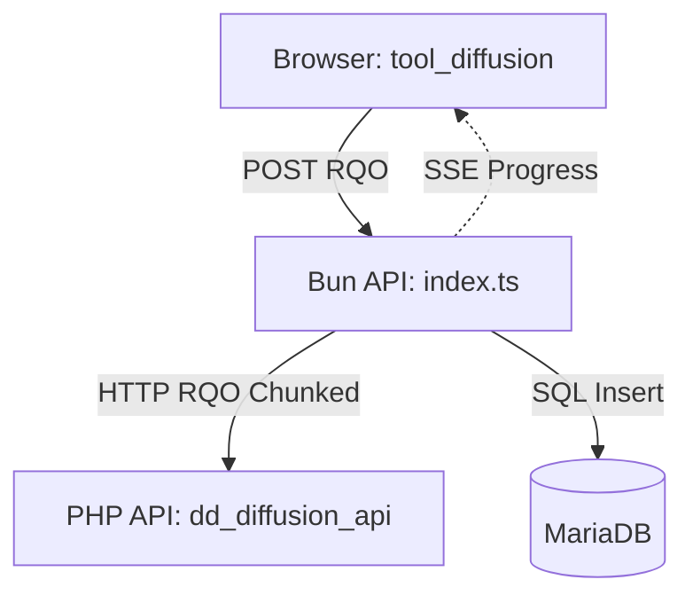
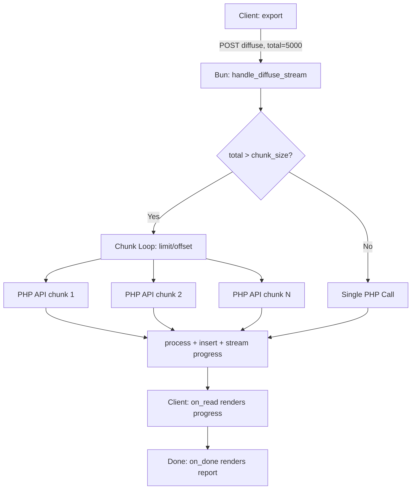

# Architecture: Hybrid Diffusion Engine

Dédalo v7 uses a hybrid architecture for its Diffusion Engine, combining the flexibility of PHP for ontology/data resolution with the performance and streaming capabilities of Bun for API delivery and storage.

## Components

The system is composed of four main layers:

### 1. Client (tool_diffusion)
The browser-side tool that initiates diffusion. 
- It constructs a **Request Query Object (RQO)** with the search criteria (SQO).
- It consumes a **Server-Sent Events (SSE)** stream for real-time progress updates.
- It can reconnect to a running process via `process_id` if the session is interrupted.

### 2. Bun API (Middleware)
A Bun-based service that acts as the primary entry point and orchestrator.
- **Streaming**: Returns an NDJSON/SSE stream to the client immediately.
- **Chunking**: Splits large requests into paginated PHP calls (default 100 records) to protect PHP memory.
- **Persistence**: Receives resolved data from PHP and writes it to MariaDB. It handles both **Upserts** (insert/update) and **Deletions** (removing stale/unpublishable records).
- **Progress Store**: Tracks active processes in-memory for polling/reconnection.

### 3. PHP API (Resolution Engine)
The core logic for resolving Dédalo's complex ontology and data structures.
- **Matrix Access**: Reads raw data from the Dédalo Matrix (PostgreSQL).
- **Ontology Resolution**: Interprets DDO Maps and resolves recursion, cross-sections, and relations.
- **Parser Pipeline**: Applies pre-parsing and standardization to data.
- **Agnostic Output**: Returns a standardized JSON object containing the hierarchy and resolved records.

### 4. MariaDB (Target Database)
The destination database where the diffused data is stored for public access or external consumption.

## Request Flow

The following diagram illustrates the internal orchestration of a diffusion request, showing how it handles both small and large record sets through chunking.

1.  **Request**: The client sends a `diffuse` RQO containing a `total` record count.
2.  **Orchestration**: Bun calculates the number of chunks needed based on `chunk_size` (default 100).
3.  **PHP Call**: Bun calls PHP for each chunk (e.g., records 0-100, 100-200).
4.  **Data Processing**: 
    - PHP resolves the chunk and returns it to Bun.
    - Bun applies secondary parsers (JS-based) and prepares the SQL.
    - Bun inserts data into MariaDB.
5.  **Streaming feedback**: After each chunk is processed, Bun enqueues an SSE message to the client.
6.  **Reconnection**: If the client disconnects, Bun allows re-attaching to the process via `get_process_status`.

## Scalability and Memory Management

By dividing the process into chunks:
- **PHP** only needs to hold a small subset of records in memory at once.
- **Bun** processes and flushes data to MariaDB continuously.
- **Browser** receives updates per chunk, providing a better user experience for long-running exports.
