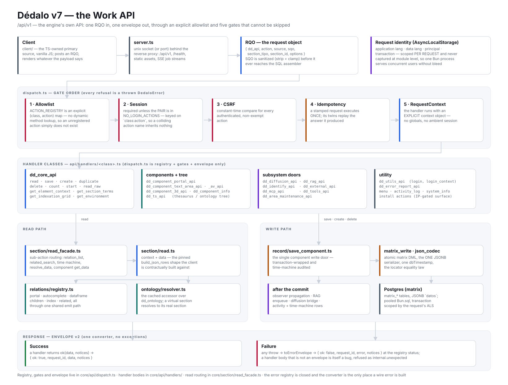

# API

> See also: [The API dispatcher (system view)](../core/system/api.md) · [RQO](../core/rqo.md) · [SQO](../core/sqo.md)

Dédalo speaks **one** HTTP endpoint. Every client call — the record form, the tree, a tool, the assistant — is a POST of a **Request Query Object** (RQO) to `/api/v1/json`, naming a `dd_api` class and an `action`. The pair is looked up in a static registry: a pair that is not registered does not exist, and is refused at the first gate. There is no dynamic method lookup and no autoloader fallback.

*The whole endpoint on one page — click the diagram to open it full size. It is
one of the [architecture diagrams](../core/architecture_overview.md#architecture-diagrams).*

## The pages

- **[JSON API v1](dedalo_api_v1.md)** — the entry point, the RQO body, the gate chain (session, CSRF, permissions), the response envelope, and the list of API classes. Start here.
- **[RQO field mapping](RQO_FIELD_MAPPING.md)** — per-action field usage: exactly which RQO keys each registered action reads, and what it ignores.
- **[Class reference](classes/dispatch.md)** — one page per `dd_api` class, its actions, their options, return contract and error codes. The [dispatch](classes/dispatch.md) page documents the router itself.

An OpenAPI description of the endpoint ships beside these pages as `openapi.yaml` in this directory.

## Two things worth knowing before the first call

- **The registry is the contract.** `ACTION_REGISTRY` in `src/core/api/dispatch.ts` binds every callable `(dd_api, action)` pair to a handler. If it is not there, it is not callable — and it is not documented here.
- **Every response is envelope v2.** A success is `{ ok: true, request_id, data, notices? }`; a failure is `{ ok: false, request_id, error: { code, category, message, label_key, retryable } }`. Read `ok`, `data` and `error`. A top-level `msg` or `errors` is a handler's own extension key, never the error channel. See [the error system](../core/system/errors.md).
