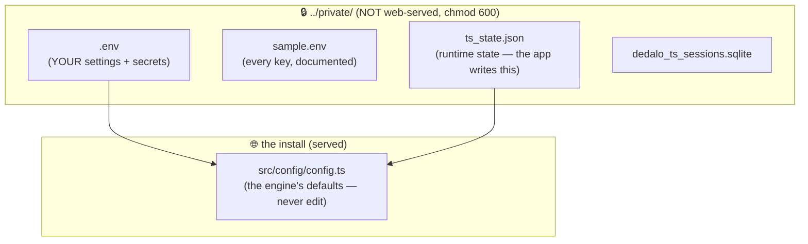
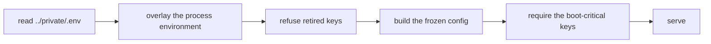

# Dédalo v7 — Configuration Administrator Guide

> How Dédalo v7 loads its configuration, where every value lives, and how you change it.
> Coming from v6? Start with **[What changed in v7](whats_changed_v7.md)**, then **[§9 Migrating a v6 install](#9-migrating-a-v6-install)**.
> Every setting is listed in the **[settings reference](config.md)**.

---

## 1. In one minute

- There is **one config file**: **`../private/.env`**, one level above the install,
  outside the web root.
- There is **one source of truth for defaults**: the engine itself
  (`src/config/config.ts`). A key you do not set takes its built-in default.
- **`../private/sample.env`** documents every key with its default. Copy the lines
  you want; do not copy the whole file.
- You change a setting by editing `../private/.env` and **restarting the server**.

```
Want to change a setting?  →  edit ../private/.env  →  restart.   That's it.
```

There is nothing to edit inside the web root.

---

## 2. Where everything lives



| File | Who writes it | What it is |
|---|---|---|
| `../private/.env` | **you** (and the install wizard) | every setting and secret for this install |
| `../private/sample.env` | shipped | the documented catalogue of every key; a reference, not read by the engine |
| `../private/ts_state.json` | **the app** | runtime state — maintenance mode, install status, area overrides. Not config; do not hand-edit |

!!! warning "`.env` is append-only"
    Add lines, change values — but do not delete or reorder other people's. A key
    you remove silently falls back to the engine default. Retired keys are left in
    place rather than deleted.

---

## 3. How a config value is calculated

```
process environment   →   ../private/.env   →   the engine's built-in default
```

Highest wins. The real environment beats the file, so a systemd unit or a one-off
`DEDALO_DEV_MODE=true bun run dev` overrides `.env` without editing it.

For a number of keys the engine also accepts the **v6 spelling** as a
fallback, so a migrated `.env` works unchanged (`DEDALO_ENTITY` for `ENTITY`,
`DEDALO_DATABASE_CONN` for `DB_NAME`, …). The v7 name wins when both are set.
The full list is in [what changed](whats_changed_v7.md#renamed-but-the-v6-spelling-still-works).

There is **no** per-host `.env.<host>` and **no** catalog/scope machinery. One
file, one precedence chain.

### The file format

```bash
# a comment
ENTITY=my_museum
DB_HOST=localhost
DEDALO_APPLICATION_LANGS={"lg-eng":"English","lg-spa":"Castellano"}
ACTIVE_ONTOLOGY_TLDS=dd,rsc,oh
```

- one `KEY=value` per line; the first `=` splits it
- `#` starts a comment **only at the beginning of a line** — a `#` inside a value
  is part of the value
- no interpolation, no multi-line values, no `export`
- lists and maps are **JSON**; simple lists also accept a comma list
- booleans are `true` / `false`

---

## 4. How to change a setting

1. Find it in the [settings reference](config.md) or `../private/sample.env`.
2. Add or edit the line in `../private/.env`.
3. Restart the server.
4. Check it took: **maintenance → check config**, which shows the live values.

---

## 5. Required settings

A configured install **must** have these, or the server refuses to boot (loudly,
naming the key — it will not limp along half-configured):

`ENTITY`, `DB_NAME`, `DB_HOST`, `DB_USER`, and the language block
(`DEDALO_APPLICATION_LANGS`, `DEDALO_APPLICATION_LANGS_DEFAULT`,
`DEDALO_DATA_LANG_DEFAULT`, `PROJECTS_DEFAULT_LANGS`).

A **fresh, unconfigured** machine is different: with none of them set, the server
boots into install mode so the wizard can run.

---

## 6. Secrets

Secrets are ordinary keys in the same file — `DB_PASSWORD`,
`DEDALO_DIFFUSION_DB_PASSWORD`, `ANTHROPIC_API_KEY`, `DEDALO_ERROR_REPORT_TOKEN`.
What protects them is **where the file is**: `../private/` is outside the web root
and the `.env` is written `0600`.

- never move a secret into the served tree, and never commit one
- the install wizard generates the secrets it needs
- rotating one = edit the line, restart

---

## 7. Retired keys

A key that has been **renamed** is retired, not aliased: the engine **refuses to
boot** if it finds the old spelling and not the new one.

```
Config key 'DEDALO_PREFIX_TIPOS' is RETIRED: rename that line to
'ACTIVE_ONTOLOGY_TLDS' in ../private/.env.
```

That is deliberate. Ignoring the old key would silently fall back to a default,
which for this key means an empty ontology-TLD list — an install that looks fine
and quietly does the wrong thing. The fix is always the one line the error names.

---

## 8. The install wizard

A fresh machine boots into the wizard, which writes `../private/.env` for you (DB
connection, entity, languages, diffusion) and then seals the install. After that,
you edit the `.env` by hand as above.

See [Installing Dédalo](../install/index.md).

---

## 9. Migrating a v6 install

v6 kept its settings in ~200 `define()` statements spread across `config/`. v7
reads one `.env`. There is a tool for exactly this:

```bash
bun run dedalo:migrate-config --config-dir=/path/to/dedalo_v6/config
```

It is **dry-run by default**: it reads your v6 config, prints exactly what it
would write, what it drops and why, and what it cannot migrate — and it writes
nothing until you pass `--execute`. It never rewrites your existing `.env`; it
merges into it and backs the old one up.

**Full walkthrough: [Migrating your config from v6](migrating_from_v6.md).**
**What moved and what is gone: [What changed in v7](whats_changed_v7.md).**

---

## 10. Troubleshooting

| Symptom | Fix |
|---|---|
| A change didn't take effect | **Restart the server.** Config is read once, at boot. |
| The server refuses to boot naming a key | Read the message — it names the key and the fix. A retired key needs renaming (§7); a required key needs setting (§5). |
| "Config key X is RETIRED" | Rename that line to the new key the error names. |
| A value reads as empty when you meant "none" | Leave the key **out**. An empty value is not "unset" — it pins an empty string over the engine's default. |
| A JSON value looks broken | It must be **one line**, and valid JSON. Do not wrap it in quotes. |
| Media renders blank | `MEDIA_PATH` is almost certainly wrong or unset. |
| It works under systemd but not by hand (or vice-versa) | The real environment beats `.env` (§3). Something is setting the key in one launch path and not the other. |
| Which value is actually live? | **maintenance → check config**. |

---

## Appendix — boot order



The config is built **once**, at import, and frozen. Nothing re-reads it at
request time — which is why a change needs a restart.
