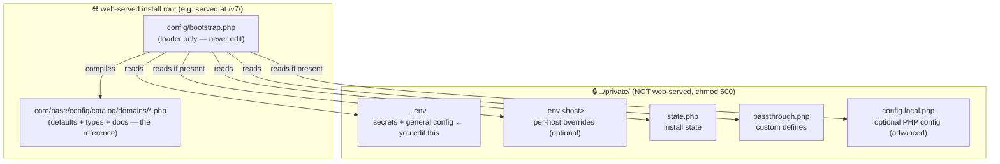
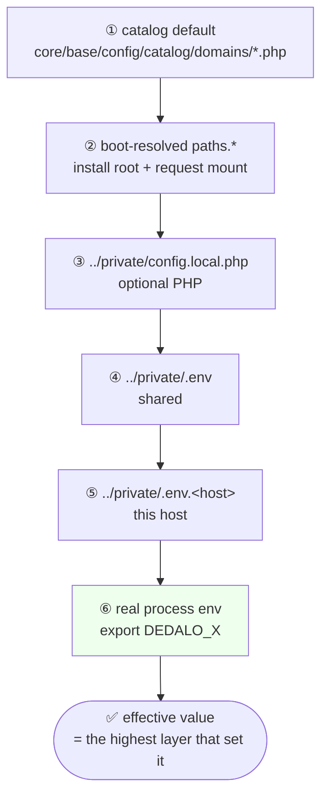
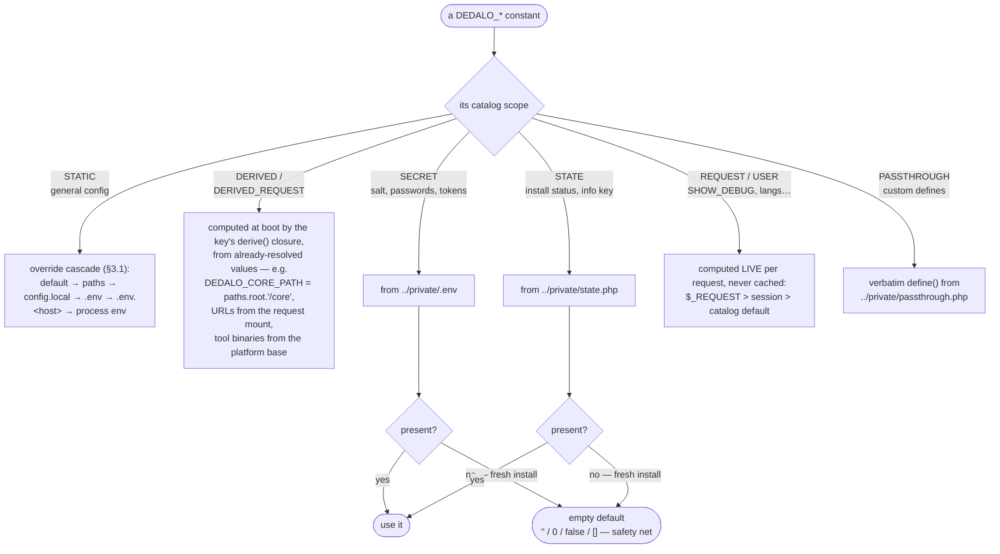
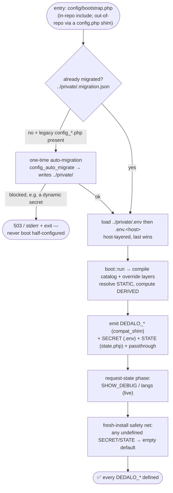
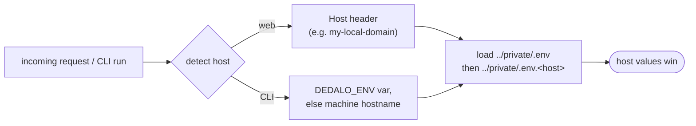
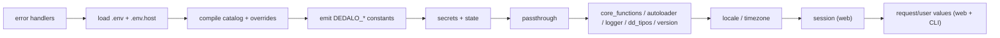

# Dédalo v7 — Configuration Administrator Guide

> How Dédalo v7 loads its configuration, where every value lives, and how you change it.
> If you're coming from v6 (the `config_*.php` files), see **[Migrating from v6](#9-migrating-a-v6-install)**.

---

## 1. In one minute

- There is **one source of truth for defaults**: the **catalog** (`core/base/config/catalog/domains/*.php`) — every setting, its type, and its default.
- Your **per-install values and secrets live OUTSIDE the web root**, in `../private/` (one level above the install).
- `config/bootstrap.php` is just a **thin loader** — it has no values, and you never edit it. (Out-of-repo callers may also get a generated `config/config.php` that only `require`s it.)
- You change settings by editing **`../private/.env`** (by the familiar `DEDALO_*` names), then reloading php-fpm.

```
Want to change a setting?  →  edit ../private/.env  →  reload php-fpm.   That's it.
```

---

## 2. Where everything lives



| File | Web-served? | What it holds | You edit it? |
|---|---|---|---|
| `config/bootstrap.php` | yes (but only *executes*) | the loader — no values | **never** |
| `core/base/config/catalog/domains/*.php` | yes (executes) | every setting: name, type, **default**, one-line doc | only to add a *new* setting or change a *global default* |
| `../private/.env` | **no** | **secrets + your general config** | **yes — this is your main file** |
| `../private/.env.<host>` | **no** | per-host overrides | yes, optional |
| `../private/state.php` | **no** | install state (info key, maintenance mode) | rarely |
| `../private/passthrough.php` | **no** | custom `define()`s not in the catalog | rarely |
| `../private/config.local.php` | **no** | optional PHP config for complex/computed values | optional (advanced) |

> **Secrets are never in the web tree.** The `config/` directory contains only the loader (`bootstrap.php`), sample templates, and a deny rule. Add the matching web-server rule for defence in depth:
> - Apache: a `config/.htaccess` with `Deny from all` (already present).
> - NGINX: `location ^~ /v7/config/ { deny all; return 404; }` (adjust the mount).

---

## 3. How a config value is calculated — the chain & fallbacks

Every `DEDALO_*` constant gets its value at boot. **Which path it takes depends on the setting's _scope_ in the catalog.** Most settings are STATIC config (an override cascade); paths/URLs are derived; secrets and state come from files; a few are computed live per request.

### 3.1 The override cascade (STATIC config — most settings)

Resolved by applying layers **low → high; the highest layer that sets the key wins**, falling back to the catalog default:



> Most installs use only **① default + ④ `.env`**, plus **⑤ `.env.<host>`** for per-environment differences. ② is computed automatically; ③ and ⑥ are there when you need them. (③ `config.local.php` and ④ `.env` can also override the ② `paths.*` keys.)

**Worked example — `SHOW_DEBUG_PROFILER` (catalog default `false`):**

| Where it's set | Effective value on host `localhost` |
|---|---|
| nothing set it | `false` (catalog default) |
| `.env`: `SHOW_DEBUG_PROFILER=true` | `true` |
| `.env`: `…=true` **and** `.env.localhost`: `…=false` | `false` (host wins) |
| above **and** shell: `export SHOW_DEBUG_PROFILER=1` | `true` (process env wins) |

### 3.2 The full picture — calculation by scope

Not every constant uses the cascade. This is how **each** kind of setting is resolved, and its fallback:



### 3.3 When it all happens — boot flow



---

## 4. How to change a setting

1. **Find the setting** in the catalog. Open the relevant file in `core/base/config/catalog/domains/` and read the `const:` (the `DEDALO_*` name), `type:`, and `default:`. Example:
   ```php
   new config_key(path: 'db.hostname', const: 'DEDALO_HOSTNAME_CONN', type: 'string', default: 'localhost', ...)
   ```
2. **Set it in `../private/.env`** by its constant name:
   ```ini
   DEDALO_HOSTNAME_CONN=127.0.0.1
   ```
3. **Reload php-fpm** so PHP re-reads the files. If you changed a **database or diffusion** value, also restart the Bun engine.

### Value formats by type

```ini
# string  — unquoted if simple; single-quote if it has spaces/specials
DEDALO_HOSTNAME_CONN=localhost
DEDALO_AV_FFMPEG_SETTINGS='-movflags +faststart -preset slow'

# bool    — true / false  (also accepts 1/0, yes/no, on/off)
SHOW_DEBUG_PROFILER=true

# int
DEDALO_BACKUP_TIME_RANGE=8

# null    — the literal word `null`  (e.g. a DB socket connection with no TCP port)
DEDALO_DB_PORT_CONN=null

# list / map  — JSON, single-quoted (readable, no escaping needed)
API_WEB_USER_CODE_MULTIPLE='[{"db_name":"web","code":"abc","api_ui":null}]'
DEDALO_PROJECTS_DEFAULT_LANGS='["lg-eng","lg-spa"]'
```

> **Quoting rules** (so values read back exactly):
> - simple tokens (letters, digits, `_ / . : @ + -`) → no quotes needed;
> - anything with spaces/JSON/special chars → wrap in **single quotes** `'…'` (literal, no escaping);
> - only if the value itself contains a single quote, use double quotes and escape `\"` and `\\`.
> - a trailing ` # comment` is stripped — put `#`-containing values in single quotes.

---

## 5. Per-host / per-environment configuration

Keep one shared `.env` and add a small `.env.<host>` for each environment that differs.



**Example layout:**
```ini
# ../private/.env                 — shared by every host
DEDALO_DATABASE_CONN=dedalo7
DEDALO_NOTIFICATIONS=false

# ../private/.env.localhost       — local dev
DEDALO_HOSTNAME_CONN=localhost
SHOW_DEBUG_PROFILER=true

# ../private/.env.my-local-domain — another dev box
DEDALO_HOSTNAME_CONN=db.local
DEDALO_NOTIFICATIONS=true
```

- **Web requests** pick the file by the `Host:` header (`my-local-domain` → `.env.my-local-domain`).
- **CLI / cron** has no Host header, so set the env var: `DEDALO_ENV=localhost php sometool.php` (otherwise it falls back to the machine hostname).
- An unknown/missing host simply means "no host file" — the shared `.env` applies. A spoofed `Host` can only ever *miss* (it can't load a file that isn't in `../private/`).

---

## 6. Secrets

Secrets live in the top section of `../private/.env`:

```ini
# Dédalo v7 secrets — chmod 600. Never commit.
DEDALO_SALT_STRING='…'
DEDALO_PASSWORD_CONN='…'
MYSQL_DEDALO_PASSWORD_CONN='…'
DEDALO_DIFFUSION_INTERNAL_TOKEN='…'
```

- **⚠️ Never change `DEDALO_SALT_STRING`** on an existing install — it is used to encrypt/decrypt stored passwords; changing it makes every stored credential unreadable.
- `.env` must be **`chmod 600`** and outside the web root (it is, in `../private/`). **Never commit it.**
- Secrets that are structured (e.g. `API_WEB_USER_CODE_MULTIPLE`, `CODE_SERVERS`, `ONTOLOGY_SERVERS`) are stored as **single-quoted JSON** and decoded automatically.

---

## 7. The catalog — your settings reference

`core/base/config/catalog/domains/` is the full, typed list of everything you can configure, grouped by domain:

| File | Domain |
|---|---|
| `paths.php` | install paths + URLs (mostly **derived** — see below) |
| `identity.php` | entity, salt, host |
| `db.php` | PostgreSQL + MySQL connection |
| `runtime.php` | session handler, cache, debug, backups |
| `lang.php`, `defaults.php` | languages, project defaults |
| `media_image.php`, `media_av.php`, `media_docs.php` | media engines + tool paths |
| `features.php` | feature flags |
| `diffusion.php`, `areas.php`, `state.php` | diffusion, areas, install state |

Each entry shows the constant, type, default, and a one-line doc:
```php
new config_key(path: 'features.lock_components', const: 'DEDALO_LOCK_COMPONENTS', type: 'bool', default: true,
    doc: 'Set lock components function when users are editing fields.'),
```

**Derived values** (paths, URLs, the media tool binaries) are *computed at boot* from a few inputs — you don't set them directly. To change them, change the input:
- URLs follow the request mount (e.g. `/v7`);
- media path = `<root>/media/media_<entity>`;
- binary tool paths derive from the platform (macOS `/opt/homebrew/bin`, Linux `/usr/bin`) or `DEDALO_BINARY_BASE_PATH`.

> Edit the catalog only to **add a brand-new setting** or change a **default for all installs** — never for per-install values (that's what `.env` is for).

---

## 8. The `config.local.php` escape-hatch (advanced)

`.env` is flat text — perfect for scalars, flags, and JSON. For **deeply nested or computed** config, you can drop an optional PHP file at `../private/config.local.php` that returns a `dot.path => value` array:

```php
<?php
return [
    'features.entity_menu_skip_tipos' => ['dd123', 'dd456'],
    // computed example:
    'runtime.backup_time_range' => (date('N') >= 6) ? 1 : 8,
];
```

It sits **below `.env`** in precedence (so `.env`/`.env.<host>` can still override it). The automatic migration does **not** create it — it's purely optional.

---

## 9. Migrating a v6 install

Migration is **automatic and safe**. After you pull v7 onto a v6 box, the first request (or CLI run) detects the legacy `config_*.php`, runs a **one-time migration** that writes the `../private/` layout, and boots — so `git pull` alone moves the install to the `.env` model. The legacy files are backed up and quarantined out of the web root, and `DEDALO_INSTALL_STATUS` carries over, so an already-installed box stays installed (no wizard).

If something **can't** be migrated automatically (e.g. a dynamically-computed secret), the loader **refuses to boot half-configured** — it returns a `503` (web) or a message (CLI) telling the operator exactly what to fix, rather than silently shipping a broken box.

**Prefer to drive it by hand?** Opt out of the auto-run and use the CLI:
```bash
export DEDALO_AUTO_MIGRATE=0                 # stop bootstrap.php from auto-migrating
php install/migrate_config_v7.php --dry-run  # preview the plan (writes nothing)
php install/validate_migration.php           # diffs v6 vs migrated — must print: faithful: YES
php install/migrate_config_v7.php --yes      # writes ../private/, quarantines the legacy files, installs the config.php shim (backs up first)
```

What the migration produces:
- **`../private/.env`** — secrets **and** general config (the non-default overrides), by constant name.
- **`../private/state.php`**, **`../private/passthrough.php`**, and the **Bun engine `.env`**.
- It does **not** write `config.local.php`.

> The dry-run / validate gate catches anything that didn't migrate cleanly (custom defines, runtime-computed values, non-standard paths) — fix what it flags and re-run until **`faithful: YES`**. The `*_URL` constants depend on the request mount and are verified in the browser, not in CLI.

---

## 10. Troubleshooting & rollback

| Symptom | Fix |
|---|---|
| A change didn't take effect | **Reload php-fpm** (clears the opcode cache of the `.env`/loader). |
| Diffusion / DB change didn't take effect | Also **restart the Bun engine** (it has its own `.env`). |
| A value reads as `''` or `0` when you meant "none" | Use the literal **`null`**: `KEY=null`. |
| JSON value looks broken | Wrap it in **single quotes**; ensure it's a single line. |
| Login/session fails after a config change | Check `DEDALO_SESSION_HANDLER` + `DEDALO_SESSION_SAVE_PATH` (e.g. a redis socket path). |
| Need to undo the migration | The legacy `config_*.php` are backed up + quarantined under `../backups/config_migration/…`; restore them to `config/`, remove `../private/.migration.json` (or all of `../private/`), and reload php-fpm. |

**Quick sanity check from the CLI** (boots config and prints a value):
```bash
php -r 'include "config/bootstrap.php"; echo DEDALO_DATABASE_CONN, "\n";'
```

---

## Appendix — boot order (for the curious)



The compiled catalog + your overrides become the legacy `DEDALO_*` constants (via `compat_shim`), so all existing code keeps working unchanged.
