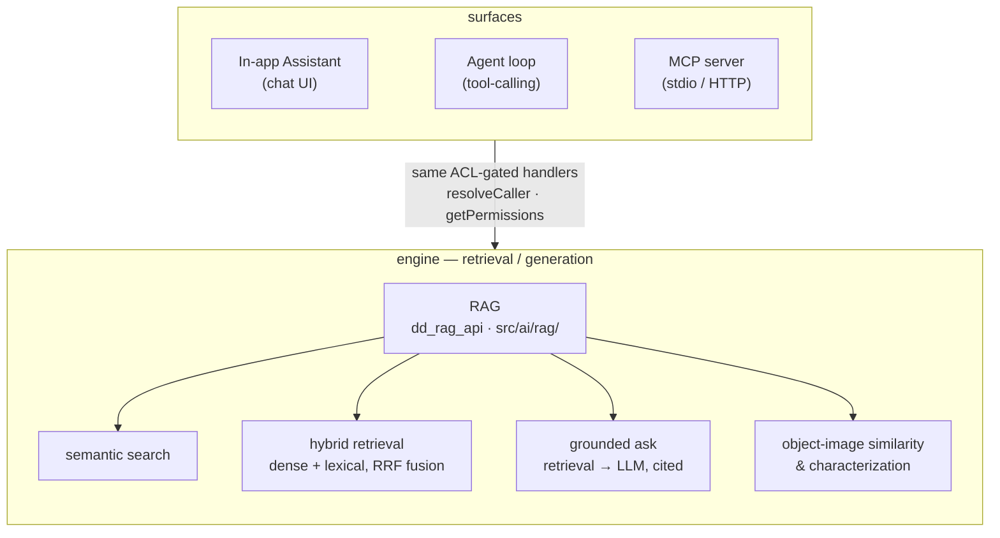

# AI in Dédalo

> The AI subsystem — **semantic search, grounded Q&A, object-image similarity, and
> the in-app assistant / agent / MCP surface**. All of it is a greenfield
> TypeScript/Bun build on top of the stable typed core, **strictly opt-in**, and
> gated by the **same permissions (ACL)** as human access: an AI query returns
> exactly what the same user could read by hand — never more.

New to the vocabulary (section, component, tipo, locator, sqo, rqo, ddo)? Start
with the [core hub](../index.md) and the [Glossary](../glossary.md).

---

## The two layers

Dédalo's AI is built in two layers — a **retrieval/generation engine** and the
**surfaces** that consume it:

- **[RAG & Semantic Search](rag.md)** — the engine. *What* semantic search and
  RAG bring to cultural-heritage work and *why* (for researchers), plus the full
  architecture, pipeline, API and internals (for developers).
- **[AI Assistant](assistant/index.md)** — the in-app chat surface that consumes
  the engine, and its own agent/MCP integration surface.

---

## Pick your document

### For researchers & curators — *what* and *why*

- **[RAG & Semantic Search](rag.md)** — Parts I–IV: what meaning-based search is,
  why it matters for heritage and memory, the use cases (cross-lingual search,
  "find records like this", grounded answers, dating an object from its image), and
  the limits & ethics. No programming required.
- **[AI Assistant — overview](assistant/index.md)** — using the in-app chat to
  question your catalog in plain language.

### For integrators — *consume* the API

- **[RAG operational cookbook](rag_cookbook.md)** — the `dd_rag_api` actions
  (`semantic_search`, `retrieve`, `ask`, `similar_objects`, …) with copy-paste
  request/response recipes.
- **[Assistant cookbook — integrators](assistant/cookbook.md)** — the assistant's
  SSE streaming protocol and HTTP recipes (`dd_mcp_api`).

### For operators — *install, connect, configure*

- **[RAG — install, connect, configure & cookbook](rag_cookbook.md)** — provision
  the pgvector store (runnable schema), connect embedding/LLM sidecars, the
  complete `DEDALO_RAG_*` config reference, and the index-drain cron.
- **[Assistant — install](assistant/install.md)** ·
  **[connecting models](assistant/connecting_models.md)** ·
  **[configuration](assistant/configuration.md)** ·
  **[privacy & security](assistant/privacy_and_security.md)**

### For developers — *architecture & internals*

- **[RAG & Semantic Search — Part V](rag.md#part-v--for-developers)** — the vector
  store, chunker, hybrid retrieval, `ask()` pipeline, the object-image stack, and
  the agent loop & MCP server. Code: `src/ai/rag/`, `src/ai/agent/`, `src/ai/mcp/`.

---

## Two rules that never bend

1. **Opt-in everywhere.** Nothing is indexed or answerable until you switch RAG on
   (`DEDALO_RAG_ENABLED`) *and* opt each section/component in via the ontology
   `properties.rag`. See the [cookbook](rag_cookbook.md#enable--the-two-checklists).
2. **ACL on every hit.** Retrieval enforces the schema permission *and* the
   per-record projects filter before any result leaves the server — and the
   assistant/agent/MCP surfaces call straight into those same gated engines. The
   semantic layer can never become a back door around access control.

---

*Related: [SQO](../sqo.md) (precise structured search — the complement to semantic
search) · [Ontology](../ontology/index.md) (where opt-in is declared) ·
[Configuration](../../config/config.md) · [Dédalo API v1](../../api/dedalo_api_v1.md).*
