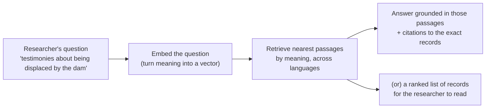
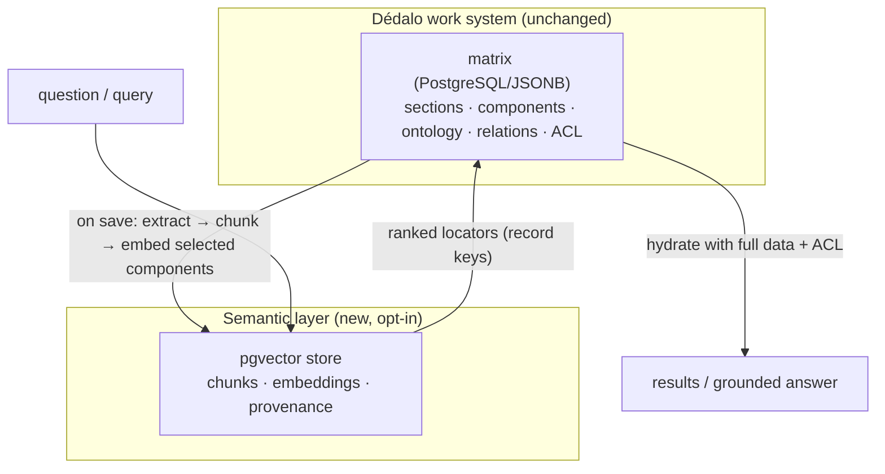
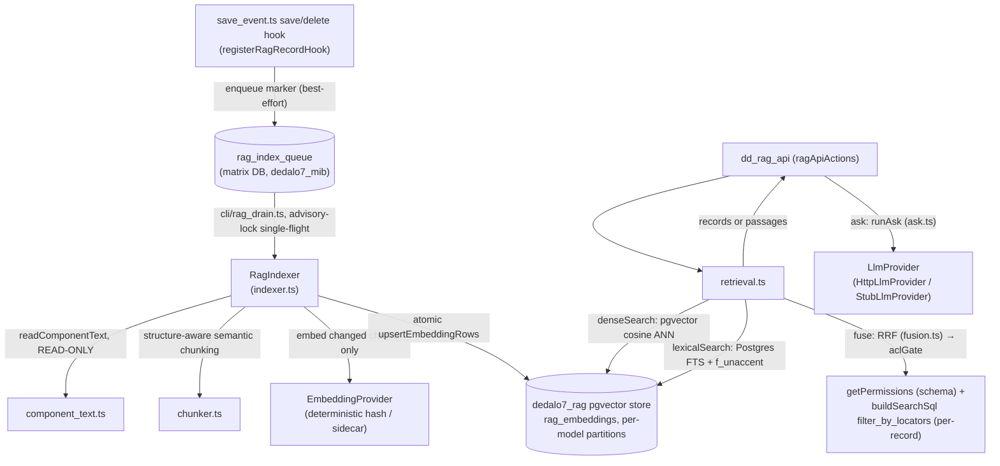

# Retrieval-Augmented Generation (RAG) & Semantic Search

> See also: **[RAG install, connect, configure & cookbook](rag_cookbook.md)** (the hands-on operational guide) · **[AI Assistant](assistant/index.md)** (the in-app chat agent that consumes this layer) · [Architecture overview](../architecture_overview.md) · [Search Query Object (SQO)](../sqo.md) · [Exporting data](../exporting_data.md) · [Glossary](../glossary.md) · [Ontology](../ontology/index.md)

This document has **two readers in mind** and is written for both:

- **Researchers in the humanities** — historians, archaeologists, anthropologists, art historians, archivists, oral-memory researchers — who want to understand *what* semantic search and RAG bring to their work, *why* it matters for cultural heritage and memory, and *how* it changes the questions they can ask of their data. **Parts I–IV** are for you; no programming required.
- **Developers** — who need to enable, use, operate and extend the subsystem. **Parts V–VI** are for you, with the API, the pipeline internals, configuration and tests. The subsystem code lives in `src/ai/rag/` (retrieval + generation), `src/ai/agent/` (the tool-use loop), and `src/ai/mcp/` (the Model Context Protocol server) — a **greenfield TypeScript/Bun build** (see [Part V](#part-v--for-developers) for the ledger).

If you read only one paragraph: Dédalo already stores cultural-heritage data as **meaningful, structured records** (sections and components governed by the ontology). RAG adds a **semantic layer** on top of that structure — a "vector version" of selected data — so the archive can be searched and questioned by **meaning**, not only by exact words. It does not replace the data model; it amplifies it.

---

# Part I — Why vectorize Cultural Heritage and Memory

## The problem: our archives know more than our searches can find

Imagine an oral-history archive with ten thousand interviews about life in a rural valley. A researcher wants every testimony that touches on **displacement caused by the building of a reservoir**. She types "reservoir" into the search box. She gets the interviews where someone literally said *reservoir* — and misses the ones where people said *the dam*, *when the water came*, *they flooded our houses*, *el pantano*, *quan ens van fer marxar*. The knowledge is in the archive. The search cannot reach it, because classic search matches **strings**, not **meaning**.

This is the everyday condition of cultural-heritage data. It is:

- **Multilingual and historical** — the same idea appears in Spanish, Català, English, in archaic spellings, in dialect, in the vocabulary of a particular decade or trade.
- **Paraphrastic** — humans describe the same object, event or idea in endlessly different words. An archaeologist's "glazed earthenware vessel with cobalt decoration" is a curator's "blue-and-white majolica jar" is a donor's "old blue pot".
- **Fragmented across collections** — a person named in an interview, an object in a catalog, a photograph, a thesis chapter, and a place in a gazetteer may all speak about the same thing, in different sections, never linked.

Classic keyword search, and even Dédalo's powerful structured search (the [SQO](../sqo.md)), are precise and essential — but they answer the question *"where does this string / this exact value appear?"*. They cannot answer *"what is **about** this idea?"*.

## What RAG and semantic search actually are (in plain terms)

**Semantic search** finds records by **conceptual similarity**. Instead of comparing letters, it compares *meanings*. Ask for "displacement caused by a dam" and it surfaces the testimony that says "when the water came and we had to leave" — because those phrases *mean* almost the same thing, even though they share no words.

How is meaning compared by a machine? Through **embeddings** (also called **vectors**). An embedding model reads a piece of text — **or an image** — and turns it into a long list of numbers — a point in a high-dimensional "**meaning space**". The crucial property: **things that mean similar things land near each other** in that space, and things that mean different things land far apart. "Dam" and "reservoir" sit close; "dam" and "wedding" sit far; two photographs of the *same kind of coin* sit close even when nothing textual links them. Searching becomes **geometry**: embed the question (or the object's image), then find the nearest records.

> **A useful mental image.** Think of a vast library where books are not shelved alphabetically but **by subject affinity** — every book physically placed so that books about similar ideas are neighbours, across every language and phrasing. To research a topic you walk to its region and everything relevant is within arm's reach, regardless of the exact words on the spine. Embeddings build that library automatically; semantic search is walking to the right shelf.

**RAG — Retrieval-Augmented Generation** — adds a second step. After *retrieving* the most relevant passages by meaning, it can hand them to a language model to *generate* a grounded answer **with citations back to the source records**. The model does not answer from its own memory of the internet; it answers **from your archive**, quoting your records. Retrieval keeps generation honest.



## Why the *semantics* of heritage data matter

The [introduction](../index.md) to this documentation states the Dédalo conviction plainly: *cultural-heritage data is information about ourselves, at the same level of importance as health or defense*. If the data is that important, then **being able to ask it the questions that matter** is equally important.

Cultural heritage is, at bottom, about **meaning** — what an object signified, what a witness understood, how a practice was lived. A data model that only matches exact strings captures the *letter* of the record but not its *sense*. Vectorizing heritage data is a way of giving the archive a memory that works the way human memory works: by **association and resemblance**, not only by exact recall.

This matters for memory in a deep way. Oral memory especially is **paraphrase all the way down** — no two people describe the same event identically, and the historical value often lives precisely in the *variation*. A semantic layer lets that variation become **findable** instead of being lost between non-matching keywords.

## How this changes research

| Without semantics (string search) | With semantics (RAG / vector search) |
| --- | --- |
| You must already know the words used in the record. | You describe the **idea**; the system finds the words. |
| Each language searched separately. | One question retrieves matches **across languages** (cross-lingual). |
| Synonyms, dialect, archaic spelling are missed. | Conceptually equivalent phrasings are found together. |
| Connections across collections are manual. | "Find records **similar to this one**" surfaces hidden links. |
| Answering a question = reading many records by hand. | A grounded, **cited** synthesis points you to the exact passages. |
| Exploratory questions ("what themes recur about X?") are hard. | Thematic and comparative exploration becomes a first-class operation. |

The point is **not** to replace the researcher's reading and judgment — it is to **remove the wall** between a well-posed question and the relevant evidence, so that the scholar spends time interpreting rather than hunting.

---

# Part II — Definitions (a short glossary)

These terms recur throughout. They are written for the non-specialist; developers will find precise mechanics in Part V.

| Term | Definition |
| --- | --- |
| **Embedding / vector** | A list of numbers representing the *meaning* of a piece of text (or media). Produced by an "embedding model". Similar meanings → nearby vectors. |
| **Embedding model** | The neural model that converts text into an embedding. Dédalo's default text model is **multilingual** so non-English heritage text is handled well. A separate **multimodal** model (a joint image+text encoder) embeds object images into a space shared with text, enabling text→image search. |
| **Multimodal / joint encoder** | An image+text model (CLIP/SigLIP-style) whose image and text "towers" share one space, so an image can be compared to another image *and* to a textual description. Used for object similarity and text→image search. |
| **Semantic / vector space** | The high-dimensional space the vectors live in. "Distance" in this space approximates *difference in meaning*. |
| **Distance (cosine)** | How meaning-similarity is measured. Small distance = similar meaning. Dédalo uses **cosine** distance. |
| **Chunk** | A coherent passage a long text is split into before embedding. Each chunk is one retrievable unit (e.g. a paragraph, a timecoded segment of a transcription). |
| **Semantic chunking** | Splitting text at **topic boundaries** (detected from meaning) and along document structure (headings, tables, pages), so each chunk is one coherent idea — not an arbitrary cut. |
| **Retrieval** | Finding the most relevant chunks for a query by vector (and lexical) similarity. |
| **Generation** | Producing a natural-language answer from retrieved passages, using a language model (LLM). |
| **RAG** | **R**etrieval-**A**ugmented **G**eneration: retrieve first, then generate grounded in what was retrieved. |
| **Grounding** | The discipline of answering **only** from retrieved sources. If nothing relevant is found, the system **refuses** rather than inventing. |
| **Hallucination** | When a language model states something plausible but unsupported. RAG mitigates it by grounding answers in real records and **refusing** when there is no evidence. |
| **Citation** | A pointer from a sentence in the answer back to the exact source record/passage it came from — so claims are verifiable. |
| **Hybrid search** | Combining **semantic** (vector) retrieval with **lexical** (keyword) retrieval, so exact terms — names, inventory numbers, signatures — are not lost. |
| **Reranking** | A second, more precise scoring pass over the top candidates to improve ordering. |
| **pgvector** | The PostgreSQL extension that stores vectors and searches them efficiently. Dédalo's vector store is a dedicated PostgreSQL + pgvector database. |
| **ACL** | Access-Control List — Dédalo's per-project permissions. RAG **never** returns a record a user may not see. |

---

# Part III — RAG in Dédalo: what, why, how

## What it is, concretely

Dédalo's RAG subsystem maintains a **vector version of selected data** — only the components an archive explicitly opts in — in a **separate, dedicated PostgreSQL + pgvector database**. It vectorizes both **text** (with a multilingual text model) and **object images** (with a joint image+text model). On top of it sit five capabilities, all exposed through one API (`dd_rag_api`):

1. **Semantic search** — find records by meaning.
2. **Q&A / chat** — grounded answers over the collection, with citations.
3. **Object image similarity & characterization** — find visually similar objects (coins, ceramics, …) and **propose attributes** (typology, period, material) aggregated from their cataloged neighbours.
4. **Agent / MCP context** — retrieval-backed passages an external AI agent can ground its reasoning on.
5. **External public semantic API** — semantic access over *published* data for third parties (a separate, later phase).

## Why it fits Dédalo so naturally

Everything in Dédalo is already **meaningful by construction**. A value is never a loose string in a spreadsheet cell; it is a component, governed by the ontology, with a model, a language, relations and context (see the [architecture overview](../architecture_overview.md) and [data model](../data_model/index.md)). That is exactly the substrate semantic search wants:

- **The ontology decides what gets vectorized.** Vectorization is *opt-in per component*, declared in the node's `properties` — the same `properties` mechanism that already drives diffusion, search and rendering. No bespoke tables, no parallel schema (the [Dédalo way](../index.md)).
- **The text is already clean.** Dédalo can already produce a clean, flat textual value for any component through the export-atoms contract (`get_value()` / `get_export_value()` — see [exporting data](../exporting_data.md)). RAG reuses it, so a relation component's linked labels, a thesaurus term's hierarchy, or a transcription's text all flow in without new extraction code.
- **Security is already per-record.** Dédalo's project ACL governs who sees what. RAG enforces the **same** ACL on every retrieved passage, so the semantic layer can never leak a record a user could not otherwise open.

## How it improves the Dédalo data model

RAG does not change the matrix, the sections or the components. It **adds a complementary index of meaning** beside the structured store:



The two databases are **bridged by a list of record locators**, never by a SQL join. A vector search produces *which records* are relevant; the **main Dédalo search then hydrates them with full data and enforces ACL**. This gives the best of both worlds:

- The **structured model remains the single source of truth** — vectors are a derived, rebuildable index.
- The **semantic layer is additive and reversible** — you can enable it for one section, rebuild it, or drop it, without touching heritage data.
- **Meaning becomes a queryable dimension** of the archive, alongside the exact, relational queries the SQO already provides. The two compose: *"records semantically about coastal trade **and** dated before 1500 **and** in project X"*.

In short, RAG turns Dédalo's already-excellent **data model** into an also-excellent **knowledge-retrieval model**, without compromising either.

## Multilingual and cross-lingual by design

Heritage collections are overwhelmingly non-English, often with historical orthography and dialect. Dédalo's default embedding model is **multilingual**, and — importantly — the system **does not silo searches by language**. A question in English can retrieve a testimony in Spanish, because in a multilingual embedding space the *meaning* sits in the same place regardless of the language it was written in. For a discipline where the same event is documented in several languages, this is transformative.

## Security, ethics and "do no harm"

Cultural-heritage and memory data can be sensitive: protected sites, culturally restricted knowledge, personal testimony, donor embargoes. The subsystem treats this as a first-class concern:

- **Per-record ACL on every retrieval.** A passage is returned only if the requesting user may access its record — checked explicitly, before any score or count leaves the server, for *every* action (search, retrieve, agent context, and chat).
- **Egress control.** If an embedding or language model is an *external* third-party service, restricted records are **never** sent to it — they are processed only by a local model, or skipped. This is enforced at **index time** (before any text leaves) and again at **answer time**.
- **Grounding and refusal.** The chat assistant answers **only** from retrieved, permitted passages and **refuses** when it has no grounded context — it does not improvise.
- **The archive stays in control.** Vectorization is opt-in per component; an institution decides exactly what enters the semantic layer.

---

# Part IV — Use cases (worked examples)

These scenarios show the *kind* of question that becomes possible. They are written from the researcher's side; the developer's request/response forms are in Part V.

### 1. Identifying an object from a description

An archaeologist excavates a sherd and wants to know whether anything like it is already cataloged. She describes it in her own words:

> *"a glazed earthenware fragment with cobalt-blue floral motifs on a white tin glaze, probably tableware"*

Semantic search returns cataloged objects described — by different curators, in different decades, in different languages — as *"blue-and-white majolica plate"*, *"loza azul de reflejo"*, *"fajalauza"*. None share the searcher's exact words; all share her *meaning*. A keyword search would have required her to already guess the catalog's vocabulary. **The system bridges her description and the catalog's terminology.**

### 2. Searching oral-history documentation by theme

An anthropologist studying environmental memory asks:

> *"What did informants say about losing farmland when the valley was flooded?"*

The system retrieves **timecoded passages** from interview transcriptions where people speak of *the dam*, *when the water rose*, *we had to leave the fields*, *el pantano se lo llevó todo* — and each result deep-links to the **exact moment in the audio/video** (via the transcription's timecodes). She can jump straight to the testimony, in the informant's own voice. Months of listening become an afternoon of focused study.

### 3. Connecting fragments across collections

A historian is reading a thesis chapter (a long full-text document in a `component_text_area`) about a guild of silversmiths. With **"find records similar to this passage"**, the system surfaces: people records of named artisans, a numismatic catalog entry mentioning a related mint mark, a photograph's caption, and an archival document — scattered across different sections, never explicitly linked, but **conceptually adjacent**. The semantic layer reveals a web of relationships the manual cataloging never recorded.

### 4. A grounded research assistant with citations

A curator preparing an exhibition asks the chat assistant:

> *"Summarize what the collection documents about coastal trade in the 15th century."*

The assistant retrieves the relevant permitted passages, synthesizes a short answer, and **cites each claim** back to the specific records and passages it used — including the exact page of a document or the exact timecode of an interview. If the collection holds nothing on the topic, it says so plainly rather than inventing. The curator gets a starting map **and** the evidence to verify every statement.

### 5. Grounding an external AI agent (MCP)

A research tool or an AI agent (via [MCP](../system/index.md)) needs trustworthy context about the collection. It calls `get_agent_context` and receives **permission-filtered passages** to ground its own reasoning — so the agent's output is anchored in the institution's real, access-controlled data, not in the model's general training.

### 6. Comparative and exploratory research

Because meaning is now a queryable dimension, new *shapes* of question become routine: *"which testimonies resemble this one?"*, *"what themes recur across these 300 interviews?"*, *"show me objects conceptually between these two."* Vectorization makes the archive **explorable by resemblance**, which is how humanistic inquiry often actually proceeds.

### 7. Cataloguing a coin from its images (typology proposal)

A numismatist registers a newly-found coin and uploads its **obverse** and **reverse** photographs. The moment it is saved, the images are vectorized. The system finds the cataloged coins whose obverse *and* reverse are visually closest — an object that matches on **both faces** ranks above one that matches on only one — and then **proposes a typology** by a similarity-weighted vote of those neighbours, showing the exact coins it relied on (with thumbnails) and a confidence. The numismatist confirms or overrides. The machine did the finding; the scholar keeps the judgment. *(This is "describe the object by its relatives" — a proposal grounded in real cataloged objects, never a generative guess.)*

### 8. Dating an object from its image

An excavation yields an object with no clear context. The researcher asks the collection to **estimate its period from its image**: the system retrieves the visually-(and metadata-)nearest objects and aggregates *their* recorded dates into a proposed **time-frame** — an earliest…latest range with a most-likely central estimate — again citing the objects that support it. It is a hypothesis to test, with its evidence attached, not an oracle's verdict.

### 9. "The same in the collection" / finding relatives

"Show me objects close to this one" returns the visually nearest pieces across the collection; raising the similarity threshold turns it into **near-duplicate detection** — the same object photographed twice, the same coin die, a re-used image — invaluable for deduplication, for spotting parallels, and for assembling a typological series. Because object similarity blends the image with the catalog **context** (material, typology, period), it does not confuse a bronze coin with a bronze button: the meaning of the object, not only its pixels, drives the match.

> **Why the context matters (and is ontology-defined).** What counts as an object's "context" is not universal — a coin's typology and a ceramic's fabric are different fields. So each section declares, **in the ontology**, which images carry the visual signal (and which face they show) and which components are the typology / period / material. Archaeology, numismatics and oral history each describe their material on their own terms, and the system respects that.

---

# Part V — For developers

**RAG, the agent loop, and MCP are a greenfield TypeScript/Bun build** — per `engineering/REWRITE_SPEC.md` §8, these three subsystems were never in PHP production, so there is nothing to port; they are designed fresh on top of the stable typed core (`rewrite/STATUS.md`, "AI (Phase 8)"). Two pieces of pure algorithm math (the RRF fusion formula and the structural/semantic chunking pipeline) were validated against an earlier internal PHP prototype's frozen test vectors for confidence (`test/unit/rag_fusion_php_port.test.ts`, `test/unit/rag_chunker_php_port.test.ts`) — but the surrounding architecture (database choice, API wiring, ACL enforcement, egress policy, the ingestion queue, the agent/MCP layer) is original TS design, not a translation of a PHP class tree.

The code lives in three trees:

- **`src/ai/rag/`** — the vector store, chunker, embedding providers, hybrid retrieval, `ask()` grounded Q&A, and the object-image similarity/characterization stack.
- **`src/ai/agent/`** — a manual tool-use loop (`loop.ts`) over the same ACL-gated handlers MCP exposes, plus RAG semantic search, driven by a pluggable `AgentLlmProvider` (`llm_provider.ts`) — the official Anthropic SDK in production (`anthropic_provider.ts`) or a scripted/deterministic provider in tests.
- **`src/ai/mcp/`** — a Model Context Protocol server (`server.ts`, `@modelcontextprotocol/sdk`) exposing the same read (and, opt-in, write) handlers (`tools.ts`) to any MCP-speaking client.

It is registered in the API dispatch as the `dd_rag_api` action class (`src/core/api/dispatch.ts` → `ragApiActions` from `src/ai/rag/api.ts`) and is **strictly opt-in**: every action declines with `rag_disabled` unless `DEDALO_RAG_ENABLED` is `'true'`/`'1'` (`isRagEnabled()`, `src/ai/rag/rag_enabled.ts`); the three image actions additionally decline with `media_disabled` unless `DEDALO_RAG_MEDIA_ENABLED` is set (`isMediaEnabled()`, `src/ai/rag/multimodal_config.ts`).

## Architecture at a glance



Two Postgres databases, bridged by a **locator/passage list**, never a join: the matrix (`dedalo7_mib`, wherever `config.db` points) holds the dirty-marker queue and is the ACL source of truth; a **separate** database (`dedalo7_rag` by default, overridable via `DEDALO_RAG_DB_NAME`/`RAG_DB_NAME`, reusing the matrix host/user/password from `config.db`) holds only vectors and is fully rebuildable. **ACL is enforced explicitly inside `retrieval.ts`'s `aclGate`/`aclFilterCandidates`** — never inside the store — as a two-step check per candidate: (1) schema ACL, `getPermissions(principal, sectionTipo, componentTipo) >= 1`; (2) per-record projects ACL, a principal-scoped existence probe built with `buildSearchSql({ filter_by_locators: […] })`, so a hit a non-admin's project scope excludes is dropped **before** any score or count leaves the server (never an existence oracle).

> **Gap.** The `rag_embeddings` parent table and its `rag_create_model_partition(model, dimension)` SQL function (which provisions each model's typed column, HNSW index, and the `unaccent`/`f_unaccent` lexical index) are **not self-provisioning** in this tree — unlike the matrix-side queue table, which `ensureRagQueueTable()` creates on demand, the `dedalo7_rag` schema must already exist before the store, indexer, or tests can run against it. There is no TS migration script for it yet; provisioning is out-of-band for now.

## Enabling RAG

1. **Provision the vector store.** A *separate* PostgreSQL with the `vector` extension, database name `dedalo7_rag` by default (`DEDALO_RAG_DB_NAME` / `RAG_DB_NAME` in `../private/.env` override the name; host/user/password are the same matrix credentials, `config.db`). Provision the `rag_embeddings` parent table and its `rag_create_model_partition()` function out-of-band — see the gap noted above; there is no TS migration for this yet.
2. **Choose an embedding provider.** The default, zero-config provider is `DeterministicHashProvider` — a deterministic, offline bag-of-words hasher (`src/ai/rag/embedding_provider.ts`) that makes the whole index→retrieve pipeline testable with no network and no keys, but is **not a semantic model**. For real semantic retrieval, set `DEDALO_RAG_EMBEDDING_PROVIDER=sidecar` plus `DEDALO_RAG_EMBEDDING_ENDPOINT` (and optionally `DEDALO_RAG_EMBEDDING_MODEL`, default `bge-m3`) to point at an HTTP embedding sidecar speaking `POST {endpoint}/embed {model, input:[…]} → {embeddings:[…]}`.
3. **Opt records in, via the ontology `properties`** (resolved by `RagConfig`, `src/ai/rag/config.ts`):
   - On the **section** node: `properties.rag = { "enabled": true }` — the cheap gate `sectionIsRagEnabled()` checks before any extraction.
   - On each **text component** to vectorize: `properties.rag = { "embed": true }` (optionally `strategy`, `mode`, `chunk: {max_tokens, min_tokens}`, `system_prompt`). Candidates are restricted to `component_text_area` / `component_input_text` / `component_text` (`DEFAULT_EMBEDDABLE_MODELS`).
4. **Switch it on:** `DEDALO_RAG_ENABLED = true`. This both lets `dd_rag_api` actions run and registers the save/delete hook (`initRagHooks()`, `src/ai/rag/bootstrap.ts`, called once from `startServer()`) that enqueues a dirty marker into `rag_index_queue` on every write.
5. **Backfill and drain** — see *Operations* below.
6. **(Optional) object images** — declare `properties.rag.context` on the section (images + views, and the typology/period/material components — see below), stand up the multimodal sidecar (`DEDALO_RAG_MULTIMODAL_*`), and set `DEDALO_RAG_MEDIA_ENABLED = true`. **Gap:** only the *retrieval* side of the image layer is built; there is no automated ingestion path yet that reads a record's images off disk and embeds them into the store (see *Image similarity & object characterization* below).

Example ontology `properties` for an oral-history transcription component:

```json
{
    "rag": {
        "embed": true,
        "strategy": "structural_semantic"
    }
}
```

## The API (`dd_rag_api`)

Registered in the static action registry (`src/core/api/dispatch.ts` → `ragApiActions`), so login/CSRF/session gating is inherited from the same dispatch chokepoint every other API class goes through. Every action reads `rqo.options` and returns the standard `{ status: 200, body: { result, msg, errors } }` envelope. Each handler resolves the caller's `Principal` first (`resolveCaller`) and declines with `no_principal` if there is none; every action declines with `rag_disabled` (`disabled()`) unless `DEDALO_RAG_ENABLED` is on.

**Actions:** `semantic_search`, `retrieve`, `get_agent_context`, `similar_to`, `ask`, and (images, additionally gated by `DEDALO_RAG_MEDIA_ENABLED`) `similar_objects`, `search_by_text_image`, `characterize_object`.

A `limit` is clamped to `[1, 50]`, default `10` (`clampTopK`, `MAX_TOP_K = 50`). An optional `section_tipo` scope accepts a single string or an array of strings (`optionScope`) — a **relevance** filter applied *after* the ACL gate narrows candidates, never a substitute for it.

**Semantic search** — text → ranked records (`RagSearchHit[]`, from `semanticSearch()`, `src/ai/rag/retrieval.ts`):

```json
// request
{
    "dd_api": "dd_rag_api",
    "action": "semantic_search",
    "options": {
        "query": "displacement caused by the building of the reservoir",
        "section_tipo": ["oh1"],
        "limit": 8
    }
}
```
```json
// response.body.result (record-level, ACL-filtered, best-first)
[
    { "section_tipo": "oh1", "section_id": 412, "component_tipo": "oh23", "lang": "lg-spa",
      "snippet": "…cuando llegó el agua tuvimos que marcharnos…", "score": 0.031 }
]
```

`retrieve` and `get_agent_context` call the same hybrid pipeline (`retrievePassages()`) but return **passages** (chunks, not collapsed to records) — each hit is a `RagSearchHit` plus `chunk_index`, for chat/agent grounding.

**Ask** — grounded answer with citations (`runAsk()`, `src/ai/rag/ask.ts`):

```json
// request
{ "dd_api": "dd_rag_api", "action": "ask",
  "options": { "query": "What do informants say about losing farmland to the dam?",
               "section_tipo": ["oh1"] } }
```
```json
// response.body.result
{
    "answer": "Several informants describe being forced to leave when the reservoir flooded their fields…",
    "citations": [ { "locator": "oh1-412", "sectionTipo": "oh1", "sectionId": 412, "citedText": "…" } ],
    "provenance": [ { "section_tipo": "oh1", "section_id": 412, "component_tipo": "oh23", "lang": "lg-spa",
                      "chunk_index": 3, "text": "…cuando llegó el agua tuvimos que marcharnos…", "score": 0.031 } ],
    "grounded": true,
    "used_provider": "stub",
    "model": "stub-llm"
}
```

If no permitted, relevant context is found, `runAsk` returns `refusalResult()` — `grounded: false`, `citations: []`, `provenance: []`, `used_provider: ''` — and **makes no model call**; the envelope's `msg` becomes `no_grounded_context` instead of `ok`. A thrown transport/protocol error from the `LlmProvider` maps to a `generation_failed` envelope (never a fabricated answer). The answer is returned as **raw text in JSON** (transport-safe); the client escapes it at render.

`similar_to` takes `{ section_tipo, section_id }` and returns nearest-neighbour records (the seed excluded), reusing the seed's *already-stored* vectors — it never re-embeds the seed.

## Ingestion pipeline (text)

The save/delete hook (`registerRagRecordHook`, wired by `initRagHooks()`) enqueues a dirty marker (best-effort — swallows every error; a down vector store can never fail a save). The drain CLI (`bun run src/ai/rag/cli/rag_drain.ts`, or `RagQueue.drain()` directly) processes markers out-of-band, single-flighted by a Postgres advisory lock (`pg_try_advisory_lock`) so it's safe to run from cron on every worker:

- **Extraction** (`component_text.ts`, `readComponentText`) — per `(record, component, lang)`, reads the matrix record and resolves the component's value with the language-fallback chain, then flattens string-family items to plain text (`htmlToPlainText` strips HTML — `text_area` holds rich text). A translatable component is extracted once per configured `APPLICATION_LANGS` entry; a non-translatable one only in `DATA_NOLAN`. Empty values are dropped (an emptied component prunes its stored chunks on the next drain).
- **Chunking** (`chunker.ts`, `chunk()`) — **structure-aware semantic chunking**:
  1. **Structural hard boundaries** — `[h1]`…`[h6]` heading lines, blank-line paragraphs, page markers `[page-n-N]`, and transcription turns `[TC_HH:MM:SS(.mmm)_TC]`; a chunk never crosses one. Text and timecoded-transcription inputs are auto-detected (`detectMode`) or set explicitly (`mode: 'short'|'transcription'|'long_document'`).
  2. **Semantic soft boundaries** — with an injected sentence embedder, adjacent sentences are compared and split where cosine distance exceeds a percentile threshold (default the 92nd, `breakpointThreshold`); with no embedder this degrades cleanly to structural-only.
  3. **Pack + orphan absorption** — segments are packed toward `maxTokens` (default 450) with a `minTokens` floor (default 120); a trailing chunk below the floor merges back into its predecessor.
  4. **Contextual enrichment** — `"{document title} › {heading path}\n{raw text}"` is embedded; the clean `raw text` alone is stored for citation.
  5. **Small-to-big** — each chunk carries a `parentKey` (its structural section's hash, or an `av:{mediaTipo}` key for a transcription) for a future parent-expansion step (not yet wired into `ask()` — see the ledgered simplification below).
  A `sourceHash = sha256(CHUNKER_VERSION '|' embedText)` versions the algorithm: bumping `CHUNKER_VERSION` forces every chunk to re-embed.
- **Indexing** (`indexer.ts`, `RagIndexer.indexRecordText`) — diffs each chunk's hash against the stored `source_hash` (`diffHashes`) so unchanged chunks never re-embed; embeds only the changed ones (soft-fails to a retryable `false` on any read/embed/store error, never throwing); flushes the changed rows plus stale-tail pruning **atomically** in one transaction (`upsertEmbeddingRows` / `deleteStale`) — embedding happens *outside* the transaction, the write is atomic.
- **Storage** (`vector_store.ts`) — `rag_embeddings` in the separate `dedalo7_rag` database, **partitioned by model** (`ensureModelPartitionTyped` / `rag_create_model_partition`, one typed `vector(N)` column + HNSW cosine index per partition — see the provisioning gap above).

**Ledgered simplification.** `ask()`'s small-to-big parent expansion is not implemented: the dense/lexical retrieval legs don't currently project `parentKey` back out, so expanding a hit to its parent section would be a no-op. Add it when the retrieval legs surface `parentKey`.

## Retrieval pipeline

`retrieval.ts` runs the hybrid search and gates every hit before it can leave the server:

1. **Hybrid candidates** (`hybridCandidates`) — dense ANN (`denseSearch`, pgvector cosine distance) and lexical full-text (`lexicalSearch`, Postgres `to_tsvector('simple', f_unaccent(…))` — accent-folded so *pantano* and *pantáno* both match) run in parallel, each over-fetching `max(limit*4, 20)` candidates, then merge via **Reciprocal Rank Fusion** (`fuse()`, `fusion.ts`, `k=60`, one map keyed on the chunk identity). Hybrid catches proper nouns, inventory numbers and archival signatures pure-vector retrieval misses.
2. **Rerank** — a `Reranker` seam (`reranker.ts`) sits between fusion and the token-budget fit in the `ask()` path; the shipped `PassThroughReranker` returns the fused order unchanged (contract: reorder only, never drop/add). No cross-encoder is wired yet.
3. **Explicit ACL** (`aclGate`, module-header chokepoint of `retrieval.ts`) — for every candidate, in order: (1) schema ACL, `getPermissions(principal, sectionTipo, componentTipo) >= 1`, memoised per `(sectionTipo, componentTipo)`; (2) per-record projects ACL, a principal-scoped existence probe (`buildSearchSql` with `filter_by_locators`), memoised per `(sectionTipo, sectionId)` — **before** any score or count is returned, for every action (never an existence oracle).
4. **Shape** — `semantic_search`/`similar_to` collapse the gated candidates to the best-scored chunk per record (`collapseToRecords`); `retrieve`/`get_agent_context`/`ask` keep every gated passage (`retrievePassages`).

## Generation (`ask`)

`ask()`'s `LlmProvider` seam (`llm_provider.ts`) is pluggable via `DEDALO_RAG_LLM_ENDPOINT`: when set, `HttpLlmProvider` posts an OpenAI-compatible chat-completions request (works against any local TEI/vLLM/llama.cpp endpoint or a hosted OpenAI-compatible API, model/timeout/temperature from `DEDALO_RAG_LLM_*`); when unset, the deterministic `StubLlmProvider` answers with a templated, self-citing echo of the retrieved passages — so `ask()` is fully exercisable offline with no model running. (This is a **different** provider seam from the agent loop's Anthropic integration below — `ask()` does not currently have an Anthropic-native adapter.) The pipeline (`runAsk`, load-bearing order): retrieve (ACL enforced inside) → grounding gate (no passages ⇒ refuse, no model call) → rerank (pass-through) → `fitTokenBudget` (keeps ≥1 passage even over budget) → a **live** egress decision recomputed per record from current config (`buildEgressPolicy`: a `DEDALO_RAG_EXTERNAL_PROVIDER_FORBIDDEN_SECTIONS` section, or `DEDALO_RAG_ALLOW_EXTERNAL_PROVIDER_DEFAULT` being off, forces `'restricted'`; the policy also accepts an optional per-record `publishable()` callback, not currently wired by `dd_rag_api`, so today the decision is **global**, not yet keyed off each record's actual diffusion-publish status) → generate. The system prompt resolves per-section `properties.rag.system_prompt` first, then `DEDALO_RAG_LLM_SYSTEM_PROMPT`, then a safe built-in default (`buildSystemPromptResolver`).

## Image similarity & object characterization

For object collections (coins, amphorae, ceramics, …) the **retrieval** side of an image layer is built: `ObjectRetrieval` (`object_retrieval.ts`) and `RagCharacterizer` (`characterizer.ts`) answer object-centric questions over image vectors already present in the store (`modality: 'image'` rows). A section opts in through `properties.rag.context` (`RagConfig.getContext`), which declares — **in the ontology, per section** (archaeology ≠ oral history) — which image components carry the visual signal (and their `view`, e.g. obverse/reverse), and which components are the *typology / period / material*:

```json
{ "rag": { "enabled": true,
  "context": {
    "images":   [ { "tipo": "numd5", "view": "obverse" }, { "tipo": "numd6", "view": "reverse" } ],
    "metadata": { "typology": "numd10", "period": "numd20", "material": "numd30" },
    "compare_scope": ["numisdata4"]
  } } }
```

Capabilities (all ACL-filtered via `aclFilterCandidates`; results carry the neighbour's stored `thumb_url` from `chunk_meta`):

- **`similar_objects`** (`findSimilarObjects`) — "objects close to this one". Reads the seed's *stored* image vectors (no re-embedding) and finds the visually nearest others. A multi-image object (a coin's obverse + reverse) **fuses the per-view result lists** with RRF, so an object close on *both* faces ranks above one close on a single face. `mode: 'hybrid'` (default) adds a lexical leg over the stored context summary (the seed's own `source_text`) — essential for heritage, where pure visual similarity confuses a bronze coin with a bronze button; `mode: 'visual'` skips it. A `near_duplicate: true` request floors results at `DEDALO_RAG_NEAR_DUPLICATE_SIMILARITY` (default `0.93`).
- **`search_by_text_image`** (`searchByTextImage`) — a textual description → matching object images, encoded through the multimodal model's **text tower** (`embedTextForImageSearch` — never the plain text `EmbeddingProvider`, which lives in an unrelated vector space).
- **`characterize_object`** (`RagCharacterizer.characterize`) — the "describe the object by its relatives" capability, **with no LLM involved**: retrieve the nearest neighbours (`findSimilarObjects`) then, for each declared metadata role, read every neighbour's value **through that neighbour's own** `properties.rag.context.metadata` mapping (`RoleReader`, `role_reader.ts`) and aggregate: a **similarity-weighted vote** over categorical roles (typology/material — `aggregateCategorical`, winner = highest-weight value, confidence = its share) or an **earliest…latest range + weighted-central estimate** for a date role (period — `summarizeDates`, confidence = `1 - midpoint-spread/span`). Each proposal carries a **confidence and cited evidence** (top-8-by-weight supporting neighbours, with thumbnails). No generative guess: a coin's typology is *proposed from real cataloged coins*, verifiably.

The multimodal provider seam (`multimodal_embedding_provider.ts`) mirrors the text one: `SidecarMultimodalProvider` speaks `POST {endpoint}/image {model, images:[base64,…]}` / `POST {endpoint}/text {model, input:[…]}` → `{embeddings:[…]}` (falls back to tolerating an OpenAI-style `{data:[{embedding}]}` shape) when `DEDALO_RAG_MULTIMODAL_ENDPOINT` is set; otherwise a deterministic, network-free `DeterministicMultimodalProvider` keeps the image pipeline exercisable offline. `isExternal()` reports non-`'local'` providers so a future egress gate can key off it.

**Gap — no image ingestion pipeline yet.** `RagIndexer` (`indexer.ts`) only extracts and embeds **text**; its own header notes "*The IMAGE/multimodal path is a later brick and is not built here*". There is no code that reads a record's declared context images off disk, downsizes/embeds them, and writes `modality: 'image'` rows on save — `embedImage()` is exercised only by `test/unit/rag_multimodal.test.ts`. `similar_objects`/`search_by_text_image`/`characterize_object` are real, ACL-gated, and tested against hand-inserted vectors, but a deployment cannot yet catalog a new coin's photographs into the store through an ordinary save the way it can for text.

## Agent loop & MCP

Two more surfaces expose the same ACL-gated core to an LLM, sharing the read/write handlers in `src/ai/mcp/tools.ts` — a section/record the configured user cannot see is invisible to either:

- **MCP server** (`src/ai/mcp/server.ts`, `@modelcontextprotocol/sdk`, stdio transport) — a **thin transport shell** with no business logic of its own: `buildMcpServer(principal, { allowWrite })` registers `dedalo_search_section`, `dedalo_read_record`, `dedalo_describe_node` as read tools (always on), plus, only when `DEDALO_MCP_ALLOW_WRITE=true`, the write tools `dedalo_save_component`, `dedalo_create_record`, `dedalo_delete_record`. The **principal is resolved once at startup** from `DEDALO_MCP_USER_ID` (a `dd128` user `section_id`, or `-1` for the superuser in trusted local dev) and is fixed for the process lifetime — there is no tool to change identity, and a missing/invalid id is a hard startup error (fail-closed, never a silent privileged fallback). Every write tool re-checks `getPermissions(...) >= 2` server-side and goes through the same `saveComponentData`/`createSectionRecord`/`deleteSectionRecord` engines (and Time Machine audit) the human save/create/delete actions use — an LLM acting through MCP can never write where its configured user could not through the web client.
- **Agent loop** (`src/ai/agent/loop.ts`, `runAgent()`) — a manual tool-use loop (capped at 12 turns, `MAX_ITERATIONS`) over the **same** handlers (`searchSectionRecords`, `readSectionRecord`, `describeOntologyNode`) plus RAG's `semanticSearch()`, each tool call executed under the caller's `Principal` so a failed/denied call becomes an `is_error` tool result the model can adapt to rather than a privilege escalation. Its tool surface (`AGENT_TOOLS`: `dedalo_search_section`, `dedalo_read_record`, `dedalo_describe_node`, `dedalo_semantic_search`) is provider-neutral (`AgentLlmProvider`, `agent/llm_provider.ts`): production wires the official `@anthropic-ai/sdk` (`AnthropicProvider`, model `claude-opus-4-8` by default, override via `AGENT_MODEL`) and **fails closed** — constructing it without `ANTHROPIC_API_KEY` throws, so the agent can never silently run keyless; the offline test gate (`agent_loop.test.ts`) drives the loop with a deterministic scripted provider instead, asserting the **same** scripted trajectory returns real data for an authorized principal and nothing for a denied one.

Both are read-only by default and additive on top of `dd_rag_api` — the MCP/agent tools do not bypass or duplicate the human API's dispatch, they call straight into the same engines it does.

## Operations

- **Drain (required).** Wire the CLI to cron — without it, markers never index:
  ```cron
  * * * * * cd /path/to/dedalo-ts && bun run src/ai/rag/cli/rag_drain.ts >> /var/log/dedalo/rag_drain.log 2>&1
  ```
  It no-ops cleanly (logs and exits 0) when `DEDALO_RAG_ENABLED` is off; it is safe to overlap (single-flighted by `pg_try_advisory_lock`, key `918273645`). A failing record backs off exponentially (`2^attempts` minutes, capped at 30) and is dropped after `DrainOptions.maxAttempts` (default 5).
- **Backfill.** No dedicated CLI yet — drive `RagIndexer.indexRecordText(locator)` (`buildRagIndexer()`) over a section's ids directly, or enqueue them via `RagQueue.enqueue()` and let the drain process them.
- **Monitoring.** `RagQueue.stats()` reports `{ pending, ready, blocked, failed, oldestAgeSec }` over `rag_index_queue`.
- **Reconcile.** `RagIndexer.reconcileSection(sectionTipo, matrixIds, enqueue)` diffs matrix-side ids against `listSectionIds()` (the vector store's distinct `section_id`s) and enqueues `index`/`delete` corrections for the drift — the matrix id source and the enqueue callback are both injected, so this is wired per-caller rather than a standalone CLI.

## Extending

- **Embedding provider** — implement the `EmbeddingProvider` interface (`embedding_provider.ts`: `name`, `model`, `dimension`, `embed(texts)`); `getEmbeddingProvider()` resolves `DeterministicHashProvider` by default or `SidecarEmbeddingProvider` when `DEDALO_RAG_EMBEDDING_PROVIDER=sidecar`. Dimension is **discovered** from the response, never hard-coded.
- **Reranker** — implement `Reranker.rerank(query, passages)` (`reranker.ts`) and wire it in place of `PassThroughReranker` in `askAction` (`api.ts`); no cross-encoder ships yet, and there is no `DEDALO_RAG_RERANK_ENDPOINT` config surface in this tree.
- **System prompt** — global `DEDALO_RAG_LLM_SYSTEM_PROMPT` or per-section `properties.rag.system_prompt` (`buildSystemPromptResolver`).

## Configuration & tests

Every `DEDALO_RAG_*` (and the shared `APPLICATION_LANGS`/`DATA_NOLAN`/`ANTHROPIC_API_KEY`/`AGENT_MODEL`/`DEDALO_MCP_*`) setting is read directly via `readEnv()` at the point of use (`src/config/env.ts`: real process env, then `../private/.env`) — there is **no** central config catalog module for RAG in this tree yet (unlike the PHP-era `core/base/config/catalog/domains/rag.php`); each module's own header comment documents the variables it reads. The full set actually referenced: `DEDALO_RAG_ENABLED`, `DEDALO_RAG_DB_NAME`/`RAG_DB_NAME`, `DEDALO_RAG_EMBEDDING_PROVIDER`/`_ENDPOINT`/`_MODEL`, `DEDALO_RAG_CONTEXT_TOKEN_BUDGET`, `DEDALO_RAG_ALLOW_EXTERNAL_PROVIDER_DEFAULT`, `DEDALO_RAG_EXTERNAL_PROVIDER_FORBIDDEN_SECTIONS`, `DEDALO_RAG_LLM_ENDPOINT`/`_MODEL`/`_API_KEY`/`_TEMPERATURE`/`_TIMEOUT`/`_MAX_OUTPUT_TOKENS`/`_SYSTEM_PROMPT`, `DEDALO_RAG_MEDIA_ENABLED`, `DEDALO_RAG_MULTIMODAL_PROVIDER`/`_MODEL`/`_ENDPOINT`/`_API_KEY`, `DEDALO_RAG_IMAGE_MAX_PX`/`_HYBRID`, `DEDALO_RAG_NEAR_DUPLICATE_SIMILARITY`, `DEDALO_RAG_CHARACTERIZE_TOP_K`.

Tests live under `test/unit/` and run with `bun test`:

```bash
bun test test/unit/rag_chunker.test.ts test/unit/rag_chunker_php_port.test.ts \
  test/unit/rag_fusion.test.ts test/unit/rag_fusion_php_port.test.ts \
  test/unit/rag_config.test.ts test/unit/rag_indexer.test.ts test/unit/rag_queue.test.ts \
  test/unit/rag_ask.test.ts test/unit/rag_api.test.ts test/unit/rag_multimodal.test.ts \
  test/unit/mcp_tools.test.ts test/unit/mcp_write_tools.test.ts test/unit/agent_loop.test.ts
```

Pure-logic tests (chunker structure/semantic boundaries, RRF fusion, config resolution, the `ask` grounding/refusal/egress gates, the multimodal joint-space math) run fully offline with no keys or network. The `_php_port` pair (`rag_chunker_php_port.test.ts`, `rag_fusion_php_port.test.ts`) asserts the TS chunking/RRF math against the *same frozen numeric test vectors* an earlier internal PHP prototype used, for algorithmic confidence — everything else in the doc above is fresh TS design. `test/unit/rag_store.test.ts`, `rag_queue_integration.test.ts`, and `rag_pipeline.test.ts` run end-to-end against the **real** `dedalo7_rag`/matrix databases (a disposable model/section per run, cleaned up in `afterAll`) — the DoD assertion in `rag_pipeline.test.ts` is that a denied principal gets nothing back from the same query a superuser gets real hits from. `mcp_tools.test.ts`/`mcp_write_tools.test.ts` assert the MCP handlers apply the exact same ACL/permission gates as the human API; `agent_loop.test.ts` drives the same scripted trajectory through a denied and an authorized principal and asserts the difference.

**Testing it end-to-end (as a user).** With `DEDALO_RAG_ENABLED=true` and the default deterministic providers, no external services are required: index a couple of records (`indexComponentText()` or a real save once the hook is registered), then call `semantic_search`/`ask` through `dd_rag_api`. To drive it as an agent, run the MCP server (`DEDALO_MCP_USER_ID=<user id> bun run src/ai/mcp/server.ts`, add `DEDALO_MCP_ALLOW_WRITE=true` for the write tools) against any MCP client, or run the agent loop (`runAgent()`, `src/ai/agent/loop.ts`) with the production `AnthropicProvider` (requires `ANTHROPIC_API_KEY`; model `claude-opus-4-8` by default, override via `AGENT_MODEL`) — its tool surface (`AGENT_TOOLS`) mirrors the MCP read tools plus `dedalo_semantic_search`. There is no reference embedding/image sidecar, `rag_selftest`, or `rag_backfill` CLI in this tree (the old PHP-era equivalents do not exist here); the sidecar HTTP contracts above are the integration point for standing one up.

---

# Part VI — Limits, ethics, and the road ahead

## What RAG is *not*

- **Not a source of truth.** The matrix remains authoritative; vectors are a derived, rebuildable index.
- **Not an oracle.** A language model can still be wrong. RAG mitigates this by **grounding** answers in real records, **citing** every claim, and **refusing** when there is no evidence — but a researcher must still verify, exactly as with any secondary source. Treat the assistant as a **finding aid**, not an authority.
- **Not a replacement for structured search.** The [SQO](../sqo.md) remains the right tool for exact, relational, faceted queries. RAG is for *meaning*; the SQO is for *precision*. They compose.

## Ethical considerations for heritage and memory

Vectorizing heritage and memory carries responsibilities beyond the technical:

- **Sensitive and restricted knowledge.** Some heritage is culturally restricted, embargoed, or personal. The egress and ACL controls exist precisely so the semantic layer cannot become a back door around them. Institutions should decide deliberately what is opted in.
- **Model bias.** Embedding and language models carry the biases of their training data, which may misrepresent minority languages, dialects or worldviews. A multilingual default helps; vigilance and local models for sensitive collections help more.
- **Provenance and consent.** When testimony is involved, retrieval should *point to* the source in the informant's own voice (timecodes, citations) rather than paraphrase it away. The design favours linking back to the original over substituting for it.
- **Interpretation stays human.** The system surfaces evidence and resemblance; the meaning-making — the actual scholarship — remains the researcher's.

## Roadmap

- **Image ingestion on save** — the nearest-term gap (Part V): a pipeline that reads a record's declared context images, downsizes and embeds them, and writes `modality: 'image'` rows, so `similar_objects`/`characterize_object` work off an ordinary save the way text indexing already does.
- **Self-provisioning RAG schema** — a TS migration for the `rag_embeddings` parent table + `rag_create_model_partition()`, mirroring `ensureRagQueueTable()`'s idempotent DDL on the matrix side, so a fresh `dedalo7_rag` database needs no out-of-band setup.
- **Per-record egress wiring** — key the `ask()`/image egress decision off each record's actual diffusion-publish status (the `buildEgressPolicy` seam already accepts an injected `publishable()` callback; nothing wires it to `dd_rag_api` yet).
- **Image region search & linking** — query by a *region* of an image (a segment of a painting) and **link** the matching objects to that segment, building on the implemented object image similarity (Part V).
- **Vision-LLM object description (optional)** — a generated description grounded in the visually-similar neighbours, for the cases where the neighbour-aggregated proposal isn't enough.
- **Reranking by default** — a real cross-encoder behind the `Reranker` seam, in place of `PassThroughReranker`.
- **Public semantic API** — a separate service over *published-only* data, for third parties, co-located with the diffusion engine.
- **Retrieval-quality evaluation** — a golden-set harness (recall@k, citation-grounding) so model and parameter choices are measurable and regression-safe.
- **Live-API smoke tests** — the `AnthropicProvider` agent path and a real embedding sidecar are wired but untested against live credentials in CI (`rewrite/STATUS.md`: "Open: real embedding-provider credentials + live-API agent smoke").

---

*Subsystem code: `src/ai/rag/`, `src/ai/agent/`, `src/ai/mcp/` (see `rewrite/STATUS.md`, "AI (Phase 8)", and `engineering/REWRITE_SPEC.md` §8). Conceptual neighbours: [architecture overview](../architecture_overview.md), [SQO](../sqo.md), [exporting data](../exporting_data.md), [ontology](../ontology/index.md).*
