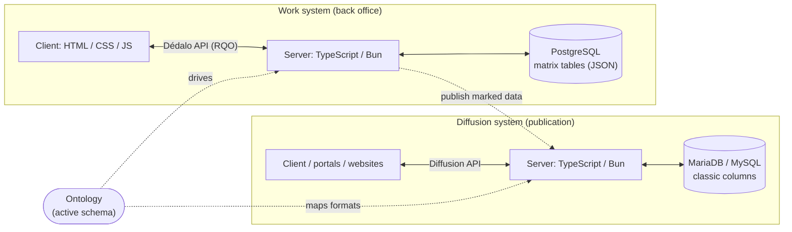
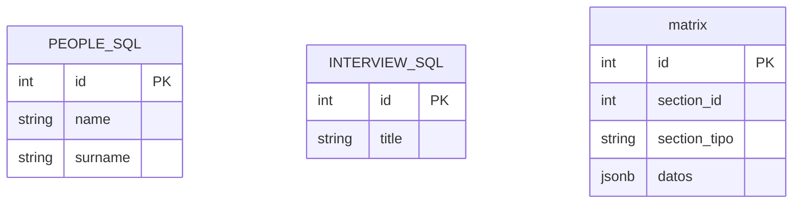
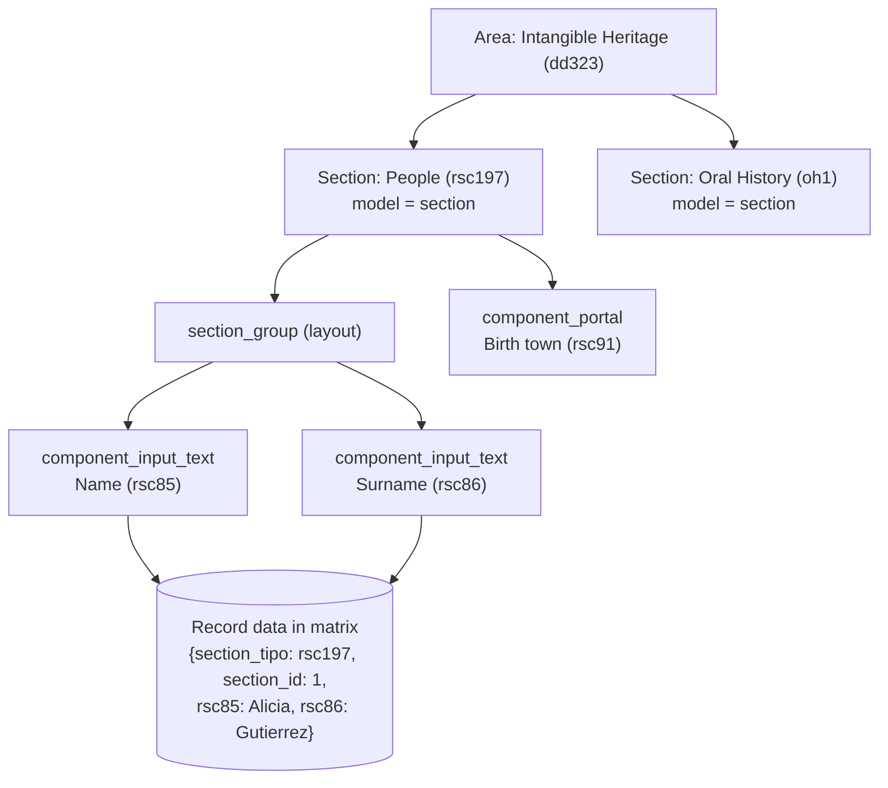
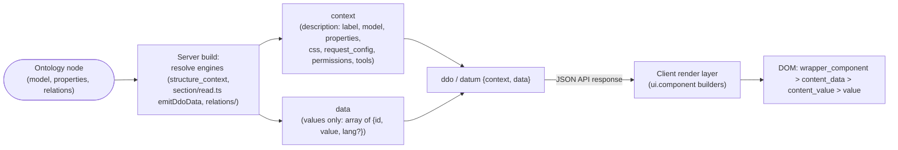
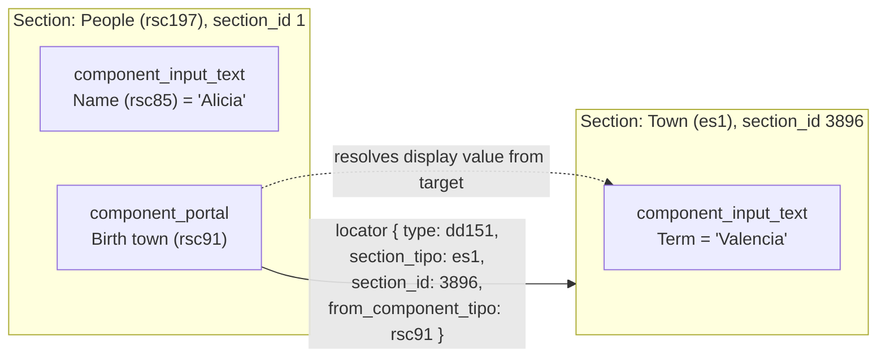
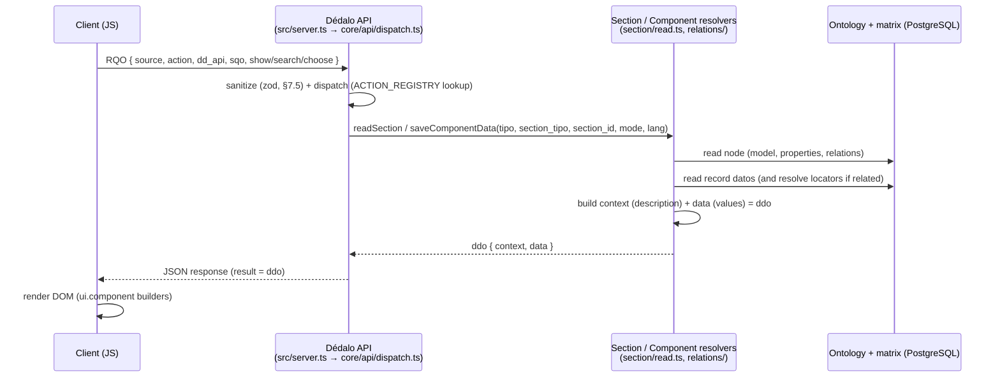

# Architecture overview

This is the "how it all fits together" map of Dédalo v7. It is written for a
developer who has just cloned the repository and wants the mental model before
diving into any single subsystem. Every concept here has a dedicated document;
this page only connects them.

If you have not yet read the [Introduction](index.md) and the
[Ontology](ontology/index.md), start there. The rest of this page assumes you
know that a *section* is the abstraction of an SQL table, a *component* is the
abstraction of a column, and that a *tipo* is the alphanumeric code that
identifies any node in the ontology.

> Quick nomenclature pointers: [Glossary](glossary.md) ·
> [Sections](sections/index.md) · [Components](components/index.md) ·
> [Ontology](ontology/index.md) · [Locator](locator.md) ·
> [dd_object](dd_object.md) · [RQO](rqo.md) · [SQO](sqo.md) ·
> [request_config](request_config.md)

## The two systems

Dédalo is not one application but two, sharing one body of data.

1. **The work system** — the back office where curators and researchers create,
   edit and relate records. Its server is a **TypeScript server on the Bun
   runtime** (`src/server.ts`, a single long-lived process — see below); its
   client is HTML, CSS and JavaScript. It talks to PostgreSQL, where all data
   lives as JSON in the `matrix` tables. The work API is the **Dédalo API**
   (see [RQO](rqo.md)).
2. **The publication / diffusion system** — the read side that publishes the
   subset of work data marked for publication into a classical SQL database
   (MariaDB/MySQL by default) with one table-and-columns schema per section, so
   that websites and third-party portals can consume it. Its API is the
   **diffusion API**, and it speaks a flat, denormalized dialect rather than the
   abstract ontology dialect of the work system.

Both systems have a server half and a client half (HTML/CSS/JS). Both servers
run as native TypeScript on Bun — diffusion is a native subsystem of the same
codebase (`src/diffusion/`), publishing via spawned job-runner processes under
the main server's control (see
[Diffusion](../diffusion/diffusion_data_flow.md)). This document is almost
entirely about the **work system**, because that is where the ontology,
sections, components and the request lifecycle live. Diffusion is the
downstream consumer.



**Prose description of the diagram above:** Two boxes sit side by side. On the
left, the *work system* contains a client (HTML/CSS/JS) and a server
(TypeScript on Bun) that exchange Request Query Objects over the Dédalo API;
the server reads and writes PostgreSQL, where data lives as JSON in the
`matrix` tables. On the right, the *diffusion system* contains portals/websites
and a TypeScript/Bun server exchanging data over the diffusion API; that server
reads and writes a classic SQL database with conventional columns. A dotted arrow
runs from the work server to the diffusion server labelled "publish marked
data" — diffusion is downstream. Below everything, an "Ontology (active
schema)" node sends dotted arrows to both servers: it drives the work system
and maps the output formats for diffusion.

## The matrix data model

Since v4 Dédalo abandoned the classic one-table-per-entity SQL schema. Instead,
almost everything lives in a handful of identically shaped tables named
`matrix`, `matrix_hierarchy`, `matrix_users`, and so on. The three identity
columns are always the same; the record itself is stored as JSON:

| column | meaning |
|---|---|
| `id` | the unique row id of the physical table |
| `section_id` | the record id *within its section* (unique per `section_tipo`, not per table) |
| `section_tipo` | which section (which abstract "table") this row belongs to |
| *JSON payload* | the whole record, stored as JSONB — one `datos` column in the legacy / `matrix_hierarchy` shape; split into typed JSONB columns in the v7 `matrix` (see note) |

A People record and an Interview record can both have `section_id = 1` because
they live under different `section_tipo` values (`rsc197` vs `oh1`). The payload
JSON keys are component tipos, not human field names — the human names live in
the ontology and are resolved at runtime per language.

> **Physical storage of the payload.** Conceptually the record is one JSON
> object, and the legacy and `matrix_hierarchy` tables do keep it in a single
> JSONB column named `datos`. The v7 `matrix` table instead splits that same
> payload across several **typed** JSONB columns — `data`, `string`, `number`,
> `relation`, `date`, `iri`, `geo`, `media`, `misc`, `relation_search`, `meta` —
> assigning each component to one column by its model. The model→column
> mapping is `getColumnNameByModel()` in `src/core/ontology/resolver.ts`, and
> the JSONB column set is `MATRIX_JSONB_COLUMNS` in `src/core/db/matrix.ts`, so
> PostgreSQL can index every data shape.
> [Sections](sections/index.md#storage-detail-the-data-column-is-split-into-typed-jsonb-columns)
> documents the full column map. The rest of this page keeps the single-payload
> mental model for clarity.



**Prose description of the diagram above:** The first two entities,
`PEOPLE_SQL` and `INTERVIEW_SQL`, show the classic approach: each concept gets
its own table with its own typed columns (`name`, `surname`; `title`). The third
entity, `matrix`, shows the Dédalo approach: a single table with only `id`,
`section_id`, `section_tipo` and a `jsonb datos` column. Where classic SQL needs
N tables for N concepts, Dédalo needs one — the concept is encoded in
`section_tipo` and the columns are encoded as keys inside `datos`.

The same People record in both worlds:

| classic SQL `people` table | | |
|---|---|---|
| **id** | **name** | **surname** |
| 1 | Alicia | Gutierrez |

```json
// one row in the Dédalo `matrix` table
// (payload shown as a single conceptual `datos` object; v7 splits it across typed columns)
{
    "id"           : 1,
    "section_id"   : 1,
    "section_tipo" : "rsc197",
    "datos" : {
        "section"    : "rsc197",
        "section_id" : 1,
        "rsc85"      : "Alicia",
        "rsc86"      : "Gutierrez"
    }
}
```

A full Dédalo installation has roughly 28 physical tables — 24 of which are this
same four-column shape — yet expresses around 1,100 logical sections with some
16,000 logical fields. The schema explosion that would cripple classic SQL is
folded into JSON and the ontology. The price is paid in resolution: reading a
field is never a column read; it is an ontology lookup followed by JSON
traversal. (See [Locator](locator.md) for the matrix tables in detail.)

## The ontology is the active schema

The ontology is not documentation *about* the schema — it **is** the schema, and
it is live. There is no `CREATE TABLE` anywhere; sections and components are
nodes in one hierarchical ontology (stored in `dd_ontology`, with instances in
the matrix tables). Dédalo reads the ontology at execution time and resolves it
into the running objects dynamically — server-side, per-model **descriptors**
(`src/core/components/component_*/descriptor.ts`, gathered by
`src/core/components/registry.ts`) plus the JS client objects — so editing a
node changes behavior with no code change. Changing a `component_select` into a
`component_autocomplete` is a node edit, not a migration.

Each node is a single JSON object. The load-bearing fields:

```json
{
  "tipo"           : "rsc197",
  "parent"         : "tch188",
  "parent_grouper" : "rsc197",
  "model"          : "section",
  "model_tipo"     : "dd6",
  "order_number"   : 5,
  "tld"            : "rsc",
  "is_translatable": false,
  "lg-eng": "People", "lg-spa": "Personas", "lg-cat": "Persones",
  "relations"  : [ ],
  "properties" : { }
}
```

- `tipo` is the unique id; it is a **TLD + sequence**: `rsc197` is the 197th node
  of the `rsc` (Resources) TLD, `oh1` is the first node of `oh` (Oral History),
  `dd5` the fifth core node. Core TLDs `dd`, `ontology`, `lg`, `hierarchy` are
  mandatory; domain TLDs (`rsc`, `tch`, `oh`, …) and custom local TLDs extend the
  tree by setting `parent` to an existing node.
- `model` (resolved via `model_tipo`, e.g. `dd6` → `section`,
  `dd592` → `component_portal`) declares what logic the node uses.
- `parent` places the node in the tree; `parent_grouper` sets its layout parent
  (usually a `section_group`).
- the `lg-*` keys are the translatable label (the *term object*).
- `properties` (JSONB) is the per-node descriptor: behavior, options, layout/CSS,
  and `request_config`. `relations` is the typed-locator array. Both flow,
  through the structure-context cache, into the **context** the client renders
  (see [request_config](request_config.md) and [dd_object](dd_object.md)).

## The areas → sections → components → data hierarchy

The ontology is a tree. The top levels organize the application; the bottom level
is the actual data.

- **Area** — a top-level grouping shown in the main menu (e.g. "Intangible
  Heritage"). Areas contain sections.
- **Section** — the abstraction of a table (model `section`); a group of records
  of the same kind (People, Interviews). See [Sections](sections/index.md).
- **Component** — the abstraction of a column (model `component_*`); a typed
  field inside a section, grouped under `section_group` nodes for layout. See
  [Components](components/index.md).
- **Data** — the actual records, stored as JSON in the matrix tables, with keys
  that are component tipos.



**Prose description of the diagram above:** At the top is the area "Intangible
Heritage". It branches to two sections, "People" (`rsc197`) and "Oral History"
(`oh1`), both with model `section`. The People section branches to a
`section_group` layout node, which in turn holds two `component_input_text`
fields, "Name" (`rsc85`) and "Surname" (`rsc86`); People also directly holds a
`component_portal`, "Birth town" (`rsc91`). The two text components point down to
a single record stored in the matrix table — a JSON object keyed by section_tipo,
section_id and the component tipos. The tree is the schema; the bottom box is the
data described by that schema.

## Abstraction layers: the cost and the benefit

Dédalo never calls things directly. To resolve a single field, the runtime
fetches the ontology node, often follows it to other nodes (a portal points into
another section whose components must themselves be resolved), and only then
traverses JSON to get the value. The layers, top to bottom:

1. **Ontology nodes** — the active definitions (areas/sections/components/tools).
2. **Models** — on the server, the TS descriptors (`section`,
   `component_input_text`, `component_portal`, …) chosen by each node's
   `model`; on the client, the same-named JS classes.
3. **Instances** — runtime objects built per request, carrying a *context* and
   *data* (see [Components](components/index.md) and [dd_object](dd_object.md)).
4. **The datum `{context, data}`** — the transport unit; `context` is the
   description (from the ontology), `data` is just the values.
5. **Locators** — typed pointers that turn standalone records into a relational
   graph (see [Locator](locator.md)).
6. **The matrix JSON** — the physical storage.

**Benefit:** extreme flexibility. The schema, the relations, the render and even
the output format (RDF, JSON-LD, Dublin Core, CIDOC, MARC21, CSV…) are all
ontology-driven, so Dédalo can re-shape data to any standard without touching
code or the database. **Cost:** resolution is slower than a direct column read,
and the complexity of resolving one record grows quickly as relations deepen.
This trade-off is the central design decision of the whole system and explains
the caches you will meet (structure-context cache, instance caches, request_config
caching).

## Server build vs client render: the data flow

The server no longer renders HTML. It resolves data and ships a normalized object
(the [dd_object / ddo](dd_object.md)) carrying **context** (the ontology
description: tipo, model, mode, label, properties, css, request_config,
permissions, tools) and **data** (only the values). The client turns that into
DOM.



**Prose description of the diagram above:** It reads left to right. An ontology
node (with its model, properties and relations) feeds the server build step —
in the TS server, the horizontal resolve engines (`src/core/resolve/structure_context.ts`
for context, `src/core/section/read.ts`'s `emitDdoData` and `src/core/relations/`
for data, dispatched via each model's descriptor rather than a per-class
factory). That build emits two things: a `context` (the description — label,
model, properties, css, request_config, permissions, tools) and a `data`
payload (values only — an array of `{id, value}` items, with `lang` when
translatable). Both are packed into a single `ddo`/datum of shape
`{context, data}` and sent as the JSON API response. The client render layer
(the shared `ui.component` builders, copied over unchanged) consumes that datum
and produces the DOM tree
`wrapper_component > content_data > content_value > value`. The key idea: the
server describes, the client draws; the ontology is the source of the
description.

### The datum contract

The persisted and transmitted unit is `{context, data}`:

- **`data`** carries values only: an array of items `{id, value, lang?}`, where
  `value` is the literal payload or a locator, and `lang` is present only for
  translatable components.
- **`context`** carries the description — tipo, model, mode, label, `properties`,
  `css`, `request_config`, permissions and tools — never the values.

A component **never** touches the database directly; persistence is delegated to
its section's write chokepoint through explicit functions rather than instance
methods — reads resolve through `src/core/section/read.ts` (`emitDdoData`) and
the `relations/` engines, and writes go through
`src/core/section/record/save_component.ts` and
`src/core/section_record/record_write.ts` (`persistRecordKeys`/
`persistRecordColumns`), the single place that reads and writes the matrix.
There is no factory and no per-component class to instantiate: a model is
looked up in the components registry (`src/core/components/registry.ts`) and
dispatched to its descriptor and the shared resolve/save engines; `tipo` and
`section_tipo` are mandatory and the `model` is force-corrected from the
ontology. Modes are `edit` (read/write a real record), `list` (read-only
listing), `search` (build SQO filters; saves blocked) and `tm` (Time Machine
read; saves blocked).

## How components compose into sections, and how portals link across them

A section node is the table; its component children point back at it with
`parent = <section_tipo>` and are arranged for layout under `section_group`
nodes. When a section is built, it gathers its component children, resolves
each (in the TS server, one pass of `emitDdoData` per ddo — see
[dd_object](dd_object.md#how-a-ddo_map-resolves-the-chain)), and assembles
their contexts and data into the section's response. Most components are
**literal** — they own their value (input_text, number, date, media). Others
are **related** — they store [locators](locator.md) instead of literals and
resolve their displayed value from a *target* record.

`component_portal` is the canonical cross-section link. Its data is not a value
but an array of locators of shape
`{type, section_tipo, section_id, from_component_tipo}` (the related-components
reference). `type` is the relation-type tipo — for a portal it defaults to
`dd151` (the generic link). `section_tipo`/`section_id` point at the target
record; `from_component_tipo` records which component owns the locator. To show a
value, the portal resolves each locator against the *target* section/component
via `expandPortal()` in `src/core/relations/relation_core.ts` (dispatched through
`src/core/relations/registry.ts` and the per-model resolver in
`src/core/relations/models/portal.ts`) — so the value is always live: edit
the target record and every portal that links to it shows the change. A
record-wide `relations` bag aggregates every locator in the record;
`from_component_tipo` is the key each component and `relation_list` uses to slice
out its own subset.



**Prose description of the diagram above:** On the left is the section "People"
(`rsc197`), record `section_id` 1, containing a literal `component_input_text`
"Name" holding the value "Alicia" and a `component_portal` "Birth town"
(`rsc91`). On the right is a different section, "Town" (`es1`), record 3896,
containing a `component_input_text` whose term is "Valencia". A solid arrow runs
from the portal to the Town section carrying a locator
`{type: dd151, section_tipo: es1, section_id: 3896, from_component_tipo: rsc91}` —
that locator is the portal's stored data. A dotted arrow shows the portal
resolving its *displayed* value by reaching into the target record's term
component. The portal stores only the pointer; the displayed text is fetched live
from the target.

## The request lifecycle

A typical round trip: the client builds a Request Query Object describing who is
calling, what action to run and what to show; the Dédalo API dispatches it; the
server resolves the section/component, builds the context and data, and
returns a ddo; the client renders the DOM.



**Prose description of the diagram above:** The client (JavaScript) sends a
Request Query Object to the Dédalo API — that RQO names the `source` (who is
calling: tipo, section_tipo, section_id, mode, lang), the `action` and `dd_api`
(what to do), an optional `sqo` (which records), and `show`/`search`/`choose`
layout maps (what to return). The server (`src/server.ts`) parses and
zod-validates the RQO and dispatches it through `src/core/api/dispatch.ts`'s
explicit action registry — no dynamic method lookup or reflection. The matched handler resolves
the section or component (`src/core/section/read.ts` for reads,
`src/core/section/record/save_component.ts` for writes, the `relations/`
engines for related components) against its ontology node (model, properties,
relations) and the record's stored data in PostgreSQL, resolving locators if it
is a related component. It assembles a `context` (the description) and `data`
(the values) into a `ddo` of shape `{context, data}`, which travels back
through the API as a JSON response. Finally the client renders the DOM using
the shared `ui.component` builders. See
[RQO](rqo.md) for the request format and [dd_object](dd_object.md) for the ddo.

## The multilingual model

Dédalo is multilingual to the core: every label and every translatable value can
exist in many languages, and the language is never baked into the schema.

- **Labels** live in the ontology node as `lg-*` term keys, resolved to the
  current application language at render time. Renaming a label in any language
  never touches the data or the schema.
- **Translatable components** store one value per language; an instance is bound
  to a single language at a time (an input_text instantiated in Català manages
  only the Català value). The `lang` field appears on each `data` item.
- **Non-translatable components** (e.g. `component_number`) declare
  `is_translatable: false` and store a single value under the sentinel language
  `lg-nolan`, working otherwise identically.
- **With-lang-versions / transliterate** is the middle ground: components such as
  `component_iri` or personal names default to `lg-nolan` but can still carry a
  tool language when needed.

Because labels, values and the UI language are independent ontology-driven
layers, the same record renders in any installed language with no duplication.

## A note on search (SQO)

Reads that filter or page over records do not hand-write SQL. They build a
**Search Query Object** — a JSON abstraction of an SQL query (its `filter` maps
to `WHERE`, `order` to `ORDER BY`, plus `limit`/`offset`), inspired by Mango and
adapted to the matrix/JSONB model. The SQO is the query; the RQO wraps it and
adds the caller identity, the action and the layout. The server compiles the SQO
into prepared SQL over the JSONB matrix tables through a security chokepoint that
sanitizes and clamps client input. For the full contract, see [SQO](sqo.md) and,
for how it rides inside a request, [RQO](rqo.md).

## Where to go next

- [Sections](sections/index.md) — the entity/class/table abstraction in depth.
- [Components](components/index.md) — the field abstraction, inheritance, datum.
- [Ontology](ontology/index.md) — the active schema, TLDs, node shape.
- [Locator](locator.md) — typed pointers and the relational graph.
- [dd_object (ddo)](dd_object.md) — the normalized object behind every request.
- [RQO](rqo.md) — the request format. · [SQO](sqo.md) — the query format.
- [request_config](request_config.md) — how context is configured and resolved.
- [Glossary](glossary.md) — the full nomenclature table.
