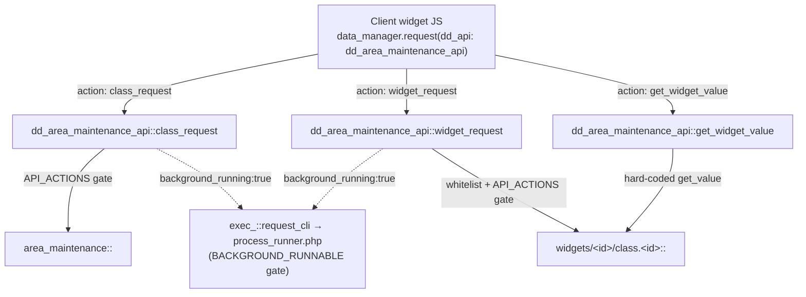

# area_maintenance

> The system-administrator area (`dd88`, "Maintenance") — the back-office dashboard
> that hosts the operational widgets a root/admin uses to back up, migrate,
> reconcile, rebuild and inspect a Dédalo installation.

> See also: [Architecture overview](../architecture_overview.md) ·
> [Sections](../sections/index.md) · [Ontology](../ontology/index.md)

This is the **subsystem reference** for the Maintenance area: the PHP class
`area_maintenance`, its JSON controller, the client `area_maintenance.js`
dashboard, the `dd_area_maintenance_api` dispatcher, and the ~28 self-contained
**widgets** it hosts. It is a *multi-file/client subsystem* anchored by one PHP
class, not a single class, so it follows the multi-file template.

## Role

`area_maintenance` (in `core/area_maintenance/class.area_maintenance.php`,
`class area_maintenance extends area_common`) is the concrete area for the
top-level "Maintenance" menu node, ontology tipo **`dd88`**
(`DEDALO_AREA_MAINTENANCE_TIPO`). Like every area it is an ontology node with no
matrix table or records of its own (see the area base-class contract); what makes
it special is its payload: instead of aggregating descendant sections into a
dashboard, its JSON `data` carries a **`datalist` of widget descriptors**, and
each widget is a small, mostly-static back-office operation rendered client-side.

It sits at the intersection of several subsystems rather than owning data:

| layer | file | role |
| --- | --- | --- |
| **Area class** | `class.area_maintenance.php` (`extends area_common`) | Declares the widget catalogue (`get_ar_widgets()`), hosts a set of class-level maintenance operations (ontology update, data-version update, config-core mutation, lang-file rebuild, DB extensions/maintenance) and the two security allowlists. |
| **JSON controller** | `area_maintenance_json.php` | Emits the `{context, data}` envelope; the single `data` item carries `datalist = get_ar_widgets()`. |
| **Client area** | `js/area_maintenance.js`, `js/render_area_maintenance.js` | Builds the dashboard (category chips + live search), lazy-loads each widget module, and provides the shared `build_form()` / `print_response()` helpers. |
| **API dispatcher** | `core/api/v1/common/class.dd_area_maintenance_api.php` | Routes client requests to class- or widget-level static methods through the SEC-044 `API_ACTIONS` allowlists. |
| **Widgets** | `widgets/<id>/` (PHP class + `js/<id>.js` + `js/render_<id>.js` [+ `css/`]) | One folder per operation; the unit of work. |

!!! note "Inheritance"
    `area_maintenance extends area_common extends common`. It overrides almost
    nothing from `area_common` (no custom `__construct`, no `get_json` override —
    it ships its own `area_maintenance_json.php` controller, which
    `area_common::get_json()` defers to). What it adds is the widget catalogue and
    a flat collection of **public-static maintenance operations** dispatched
    through the API, not the menu/dashboard machinery of the heavier areas.

## Responsibilities

- **Widget catalogue** — `get_ar_widgets()` builds the ordered list of widget
  descriptor objects (id, category, label, optional pre-loaded `value`, css
  class) via `widget_factory()`; this list is the data payload of the area and
  the **whitelist** the API validates widget requests against.
- **Ontology maintenance** — `update_ontology()` (download remote ontology files,
  import sections/private lists, rebuild `dd_ontology`, optimize tables, rewrite
  lang JS files, delete caches, log activity) and `rebuild_lang_files()`.
- **Data-version migration** — `update_data_version()` (root + maintenance-mode
  gated, delegates to `update::update_version()`).
- **Config-core mutation** — `set_config_core()` (the single write path into
  `config_core.php`) and its typed front doors `set_maintenance_mode()`,
  `set_recovery_mode()`, `set_media_access_mode()`, `set_notification()`.
- **Database housekeeping** — `create_db_extensions()`, `exec_db_maintenance()`
  (thin aliases of `db_tasks::*`).
- **Recovery** — `build_recovery_version_file()` /
  `restore_dd_ontology_recovery_from_file()` (aliases of `install::*`).
- **Test / diagnostics support** — `create_test_record()`,
  `long_process_stream()` (event-stream/CLI long-process tester), tool
  registration (`register_tools()`).
- **Security gating** — declares the `BACKGROUND_RUNNABLE` (CLI allowlist) and
  `API_ACTIONS` (remote-dispatch allowlist) constants that bound what is callable
  from `process_runner.php` and `dd_area_maintenance_api`.
- **Hosting widgets** — each widget owns its own operation; the area class only
  enumerates them and provides shared fallbacks (`get_definitions_files()`,
  `get_file_constants()`).

## Key concepts

### The widget model

A "widget" is a self-contained maintenance operation living under
`core/area_maintenance/widgets/<id>/`. The contract is informal but consistent:

- **Server (optional).** `widgets/<id>/class.<id>.php` defines `class <id>` (note:
  **bare class name = widget id**, e.g. `class media_control`). It is *not* a
  `common`/`area` subclass — it is a plain class exposing **public static
  methods**. The conventional methods are:
  - `get_value(): object` — returns the widget's current value/status (invoked
    through `dd_area_maintenance_api::get_widget_value`, which hard-codes the
    method name `get_value`).
  - action methods (`run_check`, `run_fix`, `make_psql_backup`, `move_tld`, …) —
    invoked through `dd_area_maintenance_api::widget_request`.
  - `const API_ACTIONS = [...]` (SEC-044) — the per-widget allowlist of methods
    `widget_request` is allowed to dispatch.
  Some widgets are **JS-only** (no PHP class): `environment`, `php_user`,
  `publication_api`, `lock_components`, `sequences_status` — their `value` is
  pre-computed server-side in `get_ar_widgets()` and shipped in the descriptor.
- **Client (always).** `widgets/<id>/js/<id>.js` exports a constructor named
  exactly `<id>` (the dashboard does `new module[item.id]()`), plus
  `render_<id>.js` and optional `css/<id>.less`.

### Widget categories

`get_ar_widgets()` tags every widget with a `category`; the client groups and
filters by it. The categories (presentation order from
`render_area_maintenance.js → get_category_defs()`):

| category | client label (fallback) | widgets |
| --- | --- | --- |
| `data` | Backup & data | `make_backup`, `build_database_version`, `update_data_version`, `export_hierarchy`, `add_hierarchy` |
| `migration` | Migration & transform | `move_tld`, `move_locator`, `move_to_portal`, `move_to_table`, `move_lang` |
| `config` | Configuration & code | `check_config`, `update_ontology`, `register_tools`, `update_code` |
| `integrity` | Integrity & monitoring | `lock_components`, `sequences_status`, `media_control`, `counters_status`, `dataframe_control` |
| `system` | System & environment | `php_user`, `database_info`, `environment`, `php_info`, `system_info` |
| `diffusion` | Diffusion | `publication_api` |
| `dev` | Developer & testing | `dedalo_api_test_environment`, `sqo_test_environment`, `unit_test` |
| `general` | Other | (fallback bucket) |

### The two security allowlists (SEC-024 / SEC-044)

Because every dispatchable method is `public static`, two layers bound what can be
called:

- `area_maintenance::API_ACTIONS` — methods `dd_area_maintenance_api::class_request`
  may invoke on the **area class** itself (`create_test_record`,
  `long_process_stream`, `rebuild_lang_files`). Without it the dispatcher would
  fall back to "any public-static method", exposing helpers like
  `get_file_constants` or `set_maintenance_mode` to anyone with maintenance-area
  write.
- `area_maintenance::BACKGROUND_RUNNABLE` — methods `process_runner.php` may run
  in a CLI background process (`update_data_version`, `long_process_stream`),
  reached when a widget passes `background_running:true`.
- Each **widget class** carries its own `const API_ACTIONS` enforced the same way
  in `widget_request`.

!!! warning "Authorization vs. dispatchability"
    `API_ACTIONS` answers *"is this method even dispatchable?"* — it is orthogonal
    to authorization. Access to the whole area is still gated by maintenance-area
    permissions in `dd_manager`, and several operations add their own checks:
    `update_data_version` requires `DEDALO_SUPERUSER` **and**
    `DEDALO_MAINTENANCE_MODE`; `set_config_core` (and everything routed through
    it) requires the root user, with a narrow exception for `DEDALO_RECOVERY_MODE`.

## Files & structure

```text
core/area_maintenance/
├── class.area_maintenance.php      # the area class (extends area_common)
├── area_maintenance_json.php       # JSON {context,data} controller; data.datalist = get_ar_widgets()
├── test_data.json                  # fixture inserted by create_test_record() into matrix_test
├── system_info.php                 # standalone page rendered in the system_info widget iframe
├── css/
│   └── area_maintenance.less       # dashboard chrome (toolbar, chips, group grid, cards)
├── js/
│   ├── area_maintenance.js         # client area instance (init/build/render/get_value)
│   ├── render_area_maintenance.js  # dashboard layout + render_widget + build_form + print_response
│   └── render_update_data_maintenance.js
└── widgets/
    ├── make_backup/                # class.make_backup.php + js/{make_backup,render_make_backup}.js
    ├── update_ontology/
    ├── update_data_version/
    ├── media_control/
    ├── dataframe_control/
    ├── counters_status/
    ├── …                           # one folder per widget (see catalogue below)
    └── php_info/php_info.php        # standalone page rendered in the php_info widget iframe

core/api/v1/common/class.dd_area_maintenance_api.php   # the API dispatcher (separate tree)
```

### Server-side request flow



**Prose:** A widget's client JS sends an RQO with `dd_api: 'dd_area_maintenance_api'`.
`class_request` targets static methods on the **area class** (gated by
`area_maintenance::API_ACTIONS`); `widget_request` targets methods on a **widget
class** (gated by a widget-id whitelist derived from `get_ar_widgets()`, realpath
confinement, and the widget's own `API_ACTIONS`); `get_widget_value` always calls
the widget's hard-coded `get_value`. When `background_running:true` is set, both
`class_request` and `widget_request` route through `exec_::request_cli` →
`process_runner.php`, bounded by `BACKGROUND_RUNNABLE`.

## Public API

### `area_maintenance` (the area class)

Grouped by concern. *static?* marks class-level (static) methods. Verified against
`core/area_maintenance/class.area_maintenance.php`.

#### Widget catalogue

| method | static? | purpose |
| --- | --- | --- |
| `get_ar_widgets()` | | Build and return the ordered array of widget descriptor objects (the area's `data.datalist`). Also the whitelist the API validates `widget_request` against. |
| `widget_factory($item)` | | Normalize one `stdClass` into a widget descriptor (`id`, `class`, `category`, `type`, `tipo`, `parent`, `label`, `info`, `body`, `run`, `trigger`, `value`). |

#### Ontology / data / lang

| method | static? | purpose |
| --- | --- | --- |
| `update_ontology($options)` | ✓ | Download remote ontology files, import sections/private lists, rebuild `dd_ontology`, optimize tables, purge session (except auth) and caches, rewrite lang JS files, log a `SAVE` activity entry, write the simple-schema-changes file. |
| `update_data_version($options)` | ✓ | Run the data-version upgrade (`update::update_version()`). **Root + maintenance-mode gated.** Listed in `BACKGROUND_RUNNABLE`. |
| `rebuild_lang_files($options)` | ✓ | Rewrite the per-language label JS files and drop the lang caches. In `API_ACTIONS`. |

#### Config-core mutation

| method | static? | purpose |
| --- | --- | --- |
| `set_config_core($options)` | ✓ (protected) | The single writer into `config_core.php`. Validates the constant name against a switch (`DEDALO_MAINTENANCE_MODE_CUSTOM`, `DEDALO_RECOVERY_MODE`, `DEDALO_MEDIA_ACCESS_MODE_CUSTOM`, `DEDALO_NOTIFICATION_CUSTOM`), type-checks the value, and appends/replaces the `define(...)` line. **Root-user gated** (except `DEDALO_RECOVERY_MODE`). |
| `set_maintenance_mode($options)` | ✓ | Toggle `DEDALO_MAINTENANCE_MODE_CUSTOM` (bool) via `set_config_core`. |
| `set_recovery_mode($options)` | ✓ | Toggle `DEDALO_RECOVERY_MODE` (bool) and set the live `$_ENV` flag. |
| `set_media_access_mode($options)` | ✓ | Set `DEDALO_MEDIA_ACCESS_MODE_CUSTOM` (`null` \| `false` \| `'private'` \| `'publication'`). Called by the `media_control` widget. |
| `set_notification($options)` | ✓ | Write `DEDALO_NOTIFICATION_CUSTOM` (string\|bool) read by the lock-components state API. |

#### Database / recovery / tools

| method | static? | purpose |
| --- | --- | --- |
| `create_db_extensions()` | ✓ | Force-create the PostgreSQL extensions (`db_tasks::create_extensions()`). |
| `exec_db_maintenance()` | ✓ | Run basic PostgreSQL maintenance/reindexing (`db_tasks::exec_maintenance()`). |
| `register_tools()` | ✓ | Import/register the tool ontology nodes (`tools_register::import_tools()`), aggregating per-tool errors. |
| `build_recovery_version_file()` | ✓ | Alias of `install::build_recovery_version_file()` (writes `dd_ontology_recovery.sql`). |
| `restore_dd_ontology_recovery_from_file()` | ✓ | Alias of `install::restore_dd_ontology_recovery_from_file()`. |

#### Diagnostics / helpers

| method | static? | purpose |
| --- | --- | --- |
| `create_test_record()` | ✓ | Truncate `matrix_test`, reset its sequence, insert the `test_data.json` fixture (used by the unit-test area). In `API_ACTIONS`. |
| `long_process_stream($options)` | ✓ | Long-process tester: in CLI prints an iteration count; over HTTP emits a `text/event-stream`. In both `API_ACTIONS` and `BACKGROUND_RUNNABLE`. |
| `get_definitions_files($directory)` | ✓ | Read the JSON transform definitions under `core/base/transform_definition_files/<directory>` for a fixed allowlist (`move_tld`/`move_locator`/`move_to_portal`/`move_to_table`/`move_lang`), with realpath confinement (SEC-069). |
| `get_file_constants($file)` | ✓ | Regex-extract `define(...)` constant names from a config file, confined to `DEDALO_CONFIG_PATH`/`DEDALO_CORE_PATH` (SEC-069). |

### `dd_area_maintenance_api` (the dispatcher)

`final class dd_area_maintenance_api` —
`core/api/v1/common/class.dd_area_maintenance_api.php`. Every method takes the RQO
and returns `{ result, msg, errors }`. Its own `API_ACTIONS` constant lists the
dispatchable entry points.

| method | purpose |
| --- | --- |
| `class_request($rqo)` | Dispatch `$rqo->source->action` to a **static method on `area_maintenance`**, gated by `area_maintenance::API_ACTIONS`. Honours `background_running`. |
| `widget_request($rqo)` | Dispatch `$rqo->source->action` to a **static method on `widgets/<model>/class.<model>`**, gated by the live widget-id whitelist + realpath confinement + the widget's `API_ACTIONS`. Honours `background_running`. |
| `get_widget_value($rqo)` | Call the hard-coded `get_value` on `widgets/<model>/class.<model>` (SEC-050 identifier + realpath confinement). The dynamic-refresh path. |
| `lock_components_actions($rqo)` | `get_active_users` / `force_unlock_all_components` via `lock_components::*` (the `lock_components` widget). |
| `modify_counter($rqo)` | Reset/fix a section counter (`counter::modify_counter` + `counter::check_counters`) — the `counters_status` widget. |
| `get_simple_schema_changes_files()` | List the ontology simple-schema-changes files (`hierarchy::get_simple_schema_changes_files`). |
| `parse_simple_schema_changes_files($rqo)` | Parse one changes file (`hierarchy::parse_simple_schema_changes_file`) — consumed by `component_security_access.js`. |

### Widget catalogue (server-side operations)

The data-bearing widgets and the public-static methods their classes expose
(verified by reading the widget classes). JS-only widgets are noted.

| widget (category) | class methods (beyond `get_value`) | what it does |
| --- | --- | --- |
| `make_backup` (data) | `make_psql_backup`, `make_mysql_backup`, `get_dedalo_backup_files` | PostgreSQL / MySQL dumps; list existing Dédalo backup files. |
| `build_database_version` (data) | `build_install_version` | Build the installation/database version artifact. |
| `update_data_version` (data) | `update_data_version` | Front door to the area-class data-version upgrade (background-runnable). |
| `export_hierarchy` (data) | `export_hierarchy`, `sync_hierarchy_active_status` | Export a hierarchy; sync hierarchy active status. |
| `add_hierarchy` (data) | *(get_value only)* | Install/add a hierarchy. |
| `move_tld` (migration) | `move_tld` | Re-key map items from one TLD to another across all tables (uses `transform_definition_files/move_tld`). |
| `move_locator` (migration) | `move_locator` | Move locator-defined items between sections, re-numbering `section_id`. |
| `move_to_portal` (migration) | `move_to_portal` | Move data into a linked section and wire a portal relation. |
| `move_to_table` (migration) | `move_to_table` | Move data between physical tables. |
| `move_lang` (migration) | `move_lang` | Convert items between translatable / non-translatable storage. |
| `check_config` (config) | *(get_value only)* | Report configuration state (drives maintenance/recovery toggles). |
| `update_ontology` (config) | `update_ontology`, `export_to_translate` | Front door to the ontology update; export labels for translation. |
| `register_tools` (config) | `register_tools` | Import/register the tools ontology. |
| `update_code` (config) | `check_remote_server`, `update_code`, `update_incremental`, `update_clean`, `build_version_from_git_master`, `get_code_path`, `set_code_path`, `get_file_version`, `set_development_path`, `get_code_url`, `get_code_update_info` | Inspect and update the Dédalo source code (git/remote). |
| `lock_components` (integrity) | *(JS-only; served via `lock_components_actions`)* | Show active component locks; force-unlock. |
| `sequences_status` (integrity) | *(JS-only; value pre-computed `db_tasks::check_sequences()`)* | Report DB sequence state. |
| `media_control` (integrity) | `set_media_access_mode`, `rebuild_media_index` | Report media-protection config/status; change access mode; rebuild the media publication index. |
| `counters_status` (integrity) | *(value via `counter::check_counters`; mutate via `modify_counter` API)* | Report and reset/fix section record counters. |
| `dataframe_control` (integrity) | `run_check`, `run_fix` | Scan dataframe pairing integrity; remove orphan frame locators. |
| `database_info` (system) | `analyze_db`, `optimize_tables`, `recreate_db_assets`, `rebuild_db_indexes`, `rebuild_db_functions`, `rebuild_db_constraints`, `consolidate_tables`, `rebuild_user_stats` | Inspect and rebuild PostgreSQL assets. |
| `system_info` / `php_info` (system) | *(standalone `.php` pages in an iframe)* | Show system / `phpinfo()` output. |
| `php_user`, `environment` (system) | *(JS-only; value pre-computed)* | Show the PHP user / runtime environment. |
| `publication_api` (diffusion) | *(JS-only; value = diffusion map via `diffusion_utils::get_diffusion_map`)* | Show the publication-server API config and connection status. |
| `dedalo_api_test_environment`, `sqo_test_environment`, `unit_test` (dev) | *(JS-only test consoles)* | Interactive API / SQO test consoles; the unit-test runner. |

!!! note "Exact method lists are widget-local"
    The per-widget method names above were read directly from each
    `widgets/<id>/class.<id>.php`. When extending a widget, add the new method to
    that widget's own `const API_ACTIONS` — not to the area class — or
    `widget_request` will reject it with an explicit `permissions error`.

## How it fits with the rest of Dedalo

- **Areas / menu** — `area_maintenance` is one of the major areas iterated by
  `area::get_areas()` (model name `area_maintenance`), and is reachable in the
  menu only when permitted by `config_areas.php`. It inherits the area scaffolding
  from `area_common`/`common`. See the [Architecture overview](../architecture_overview.md)
  for where areas sit in the areas → sections → components hierarchy.
- **Ontology** — `update_ontology()` rewrites `dd_ontology` (the active schema),
  so it is the operational counterpart of the [Ontology](../ontology/index.md)
  subsystem; `register_tools()` imports tool nodes.
- **Media protection** — the `media_control` widget and
  `set_media_access_mode()` write `DEDALO_MEDIA_ACCESS_MODE_CUSTOM` and trigger
  `rebuild_media_index`; see `docs/config/media_protection.md`.
- **Diffusion** — the `publication_api` widget reads the diffusion map and the
  `media_control` rebuild delegates to `dd_diffusion_api`; see
  `docs/diffusion/dd_diffusion_api_and_bun.md`.
- **Tools** — `register_tools()` is the import path for the
  [tools subsystem](../../development/tools/creating_tools.md); the widgets are a
  *different* extension surface (no `register.json`, no `tool_paths`).
- **Search / SQO** — the `sqo_test_environment` widget and `update_ontology`'s use
  of `search_query_object` connect to [SQO](../sqo.md).
- **Dataframe** — `dataframe_control` exercises the dataframe pairing-integrity
  check shared with the migration/CLI pipeline.

## Examples

### The JSON payload shape

`area_maintenance_json.php` emits a standard `{context, data}` envelope; the single
`data` item carries the widget list under `datalist`:

```json
{
  "context": [ { "tipo": "dd88", "model": "area_maintenance", "label": "Maintenance", "...": "..." } ],
  "data": [
    {
      "section_tipo": "dd88",
      "tipo": "dd88",
      "value": [],
      "datalist": [
        { "id": "make_backup", "category": "data", "type": "widget", "tipo": "dd88", "label": "Make backup", "value": null },
        { "id": "media_control", "category": "integrity", "type": "widget", "tipo": "dd88", "label": "Media access control", "value": null }
      ]
    }
  ]
}
```

### Calling a widget action from the client

A widget submits through the shared `build_form()` helper, which posts an RQO via
`data_manager.request`:

```javascript
// trigger object passed to build_form({ ..., trigger })
const trigger = {
    dd_api : 'dd_area_maintenance_api',
    action : 'widget_request',
    source : { type: 'widget', model: 'dataframe_control', action: 'run_fix' },
    options: { /* merged with the collected form values */ }
}
```

Server-side this routes through `widget_request` → `dataframe_control::run_fix`
(allowed because `run_fix` is in `dataframe_control::API_ACTIONS`).

### A class-level (non-widget) action

```javascript
// toggle maintenance mode — dispatched to the AREA class, not a widget
const api_response = await data_manager.request({
    use_worker : true,
    body : {
        dd_api : 'dd_area_maintenance_api',
        action : 'class_request',
        source : { typo: 'source', action: 'set_maintenance_mode' },
        options: { value: true }
    }
})
```

!!! warning "`set_maintenance_mode` is not in `API_ACTIONS`"
    As written, `area_maintenance::API_ACTIONS` lists only `create_test_record`,
    `long_process_stream` and `rebuild_lang_files`. `set_maintenance_mode`,
    `update_ontology` and `update_data_version` are **not** in it, so the example
    above would be **rejected** by the SEC-044 gate in `class_request` unless those
    methods are reached through a different path (e.g. the `check_config` /
    `update_ontology` widgets dispatching their own widget-class methods, or
    `dd_core_api->start` for recovery mode). Treat `API_ACTIONS` as authoritative
    for what `class_request` will actually dispatch; this is documented here rather
    than guessed.

## Related

- [Architecture overview](../architecture_overview.md) — where areas sit in the
  areas → sections → components hierarchy.
- [Ontology](../ontology/index.md) — the active schema that `update_ontology()`
  rewrites.
- [Sections](../sections/index.md) · [Components](../components/index.md) — the
  record-bearing nodes the maintenance operations act over.
- [SQO](../sqo.md) — the query format exercised by the SQO test environment.
- [dd_area_maintenance_api](../../api/classes/dd_area_maintenance_api.md) — the
  generated API-class reference.
- `docs/config/media_protection.md` — the media access control the
  `media_control` widget configures.
- `docs/diffusion/dd_diffusion_api_and_bun.md` — the diffusion engine the
  `publication_api` widget and media-index rebuild talk to.
- `docs/development/tools/creating_tools.md` — the tools subsystem
  `register_tools()` imports into.
