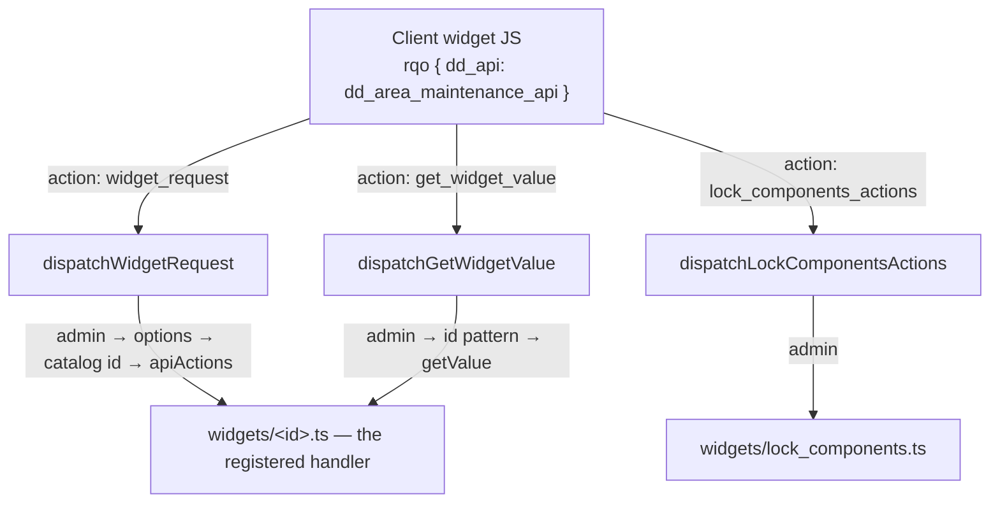

# area_maintenance

> The system-administrator area (`dd88`, "Maintenance") — the back-office
> dashboard that hosts the operational widgets an administrator uses to back up,
> migrate, reconcile, rebuild and inspect a Dédalo installation.

> See also: [area](area.md) · [Areas](index.md) ·
> [dd_area_maintenance_api](../../api/classes/dd_area_maintenance_api.md) ·
> [Architecture overview](../architecture_overview.md)

This is the **subsystem reference** for the Maintenance area: how the widget
catalog is assembled, how a widget request is dispatched and gated, what each
widget does, and how to add one.

## Role

`area_maintenance` is the area model of the top-level "Maintenance" menu node,
ontology tipo **`dd88`**. Like every [area](area.md) it is an ontology node with
no matrix table and no records of its own. What makes it special is its payload:
instead of aggregating descendant sections into a statistics dashboard, its
`data` item carries a **`datalist` of widget descriptors**, and each widget is a
self-contained back-office operation.

In the area behavior taxonomy (`src/core/concepts/area.ts`) it carries the
`maintenance` behavior — its own branch, its own subsystem.

!!! warning "Administrators only"
    The whole area is a **global-admin surface** and fails closed. The read is
    refused with `403` for a non-admin, and *every* widget dispatch re-checks
    `principal.isGlobalAdmin` independently — the gate is not delegated to the
    menu having hidden the area.

## Where the engine lives

| module | role |
| --- | --- |
| `src/core/area/read.ts` | The `maintenance` behavior branch of `dispatchAreaRead`: admin gate, structure context, and the widget catalog as `data[0].datalist`. |
| `src/core/area_maintenance/widgets/registry.ts` | The catalog assembly and the three dispatchers (`buildMaintenanceDataItem`, `dispatchWidgetRequest`, `dispatchGetWidgetValue`). |
| `src/core/area_maintenance/widgets/support.ts` | The shared contract: `WidgetModule`, `WidgetSpec`, `WidgetHandler`, `WidgetResponse`. |
| `src/core/area_maintenance/widgets/<widget_id>.ts` | One module per widget — the unit of work. |
| `src/core/api/handlers/dd_area_maintenance_api.ts` | The three API actions, registered under the `dd_area_maintenance_api` key. |
| `src/core/area_maintenance/backup.ts`, `user_stats.ts` | Heavier operations the widgets call into. |

## The widget model

A widget is **one module file** exporting one `WidgetModule`:

```ts
export const widget: WidgetModule = {
    spec: {
        id      : 'dataframe_control',   // the wire id the client sends
        category: 'integrity',           // the dashboard group
        label   : { kind: 'label', key: 'dataframe_control' },
    },
    apiActions: {                        // the EXPLICIT method registry
        run_check: dataframeRunCheck,
        run_fix  : dataframeRunFix,
    },
    getValue  : dataframeGetValue,       // the panel-open value load
    eagerValue: dataframeEagerValue,     // optional: a value pre-computed into the catalog
};
```

- **`spec`** is the catalog entry: id, category, label rule and optional CSS
  class. The `id` is what the client sends as `source.model`.
- **`apiActions`** is the widget's method registry. **A method exists on the API
  if and only if it is listed here** — there is no "any exported function is
  callable" fallback. This is the security boundary, not a convenience.
- **`getValue`** answers the panel-open value load. A widget without one returns
  an explicit "unavailable" error rather than silently nothing.
- **`eagerValue`** pre-computes a value into the catalog so the folded dashboard
  card and the opened panel paint from identical data. It is fail-soft: a widget
  whose value cannot be computed must never break the dashboard read.

Every handler returns the same envelope: `{ result, msg, errors }`.

Adding a widget is **one new module file plus one import line** in
`registry.ts`. There is nothing else to register.

## Dispatch and its four gates

`dd_area_maintenance_api` exposes exactly three actions:

| action | what it does |
| --- | --- |
| `widget_request` | Dispatch `source.action` to a method in the named widget's `apiActions`. |
| `get_widget_value` | Call the named widget's `getValue`. The panel-load and dynamic-refresh path. |
| `lock_components_actions` | The one area-level (non-widget) action: `get_active_users` / `force_unlock_all_components`. |

`dispatchWidgetRequest` (`registry.ts`) applies four gates, in order:

1. **Admin only** — a non-admin principal is refused outright.
2. **Options must be an object** when present.
3. **The widget id must be in the catalog** — checked against the static module
   list, so an action never pays for the catalog's eager values.
4. **The method must be registered** in that widget's `apiActions` — otherwise
   `unauthorized_method`.

`dispatchGetWidgetValue` applies the admin gate, validates the widget id against
an identifier pattern, and calls the widget's `getValue`.



!!! warning "Dispatchability is not authorization"
    `apiActions` answers *"is this method reachable at all?"*. It is orthogonal
    to what the operation itself checks. Several widgets add their own
    conditions on top — the data-version upgrade requires maintenance mode, and
    the state-writing operations are root-only.

## The catalog

`getMaintenanceWidgets()` builds the ordered descriptor list the client renders,
resolving each label in the application language. `buildMaintenanceDataItem()`
wraps it as the area's single `data` item:

```json
{
  "context": [ { "tipo": "dd88", "model": "area_maintenance", "label": "Maintenance" } ],
  "data": [
    {
      "section_id": null,
      "section_tipo": "dd88",
      "tipo": "dd88",
      "value": [],
      "datalist": [
        { "id": "make_backup", "category": "data", "type": "widget",
          "tipo": "dd88", "parent": "dd88", "label": "Make backup", "value": null },
        { "id": "media_control", "category": "integrity", "type": "widget",
          "tipo": "dd88", "parent": "dd88", "label": "Media access control", "value": null }
      ]
    }
  ]
}
```

### Categories

Every widget carries a `category`; the client groups and filters by it.

| category | what it holds |
| --- | --- |
| `data` | Backups, database version artifacts, the data-version upgrade, hierarchy import/export. |
| `migration` | The bulk transforms — `move_tld`, `move_locator`, `move_to_portal`, `move_to_table`, `move_lang`. |
| `config` | Configuration and code: `check_config`, `config_areas`, `menu_skip_tipos`, `update_ontology`, `register_tools`, `update_code`. |
| `integrity` | `lock_components`, `sequences_status`, `media_control`, `counters_status`, `dataframe_control`. |
| `system` | Environment, database info, system info, the runtime panel, error reports. |
| `diffusion` | `publication_api`, `diffusion_server_control`. |
| `dev` | The API and SQO test consoles, the unit-test runner. |

## The widgets

The operations each widget registers. A widget with no `apiActions` is a
read-only panel: it reports state through `getValue` or an eager catalog value.

| widget | category | registered actions |
| --- | --- | --- |
| `make_backup` | data | `make_psql_backup`, `get_dedalo_backup_files` |
| `build_database_version` | data | `build_recovery_version_file`, `restore_dd_ontology_recovery_from_file` |
| `update_data_version` | data | `update_data_version` |
| `export_hierarchy` | data | `sync_hierarchy_active_status` |
| `add_hierarchy` | data | *(read-only panel)* |
| `move_tld`, `move_locator`, `move_to_portal`, `move_to_table`, `move_lang` | migration | one transform action each, named after the widget |
| `check_config` | config | `set_maintenance_mode`, `set_recovery_mode`, `set_notification` |
| `config_areas` | config | `save_config_areas` |
| `menu_skip_tipos` | config | `save_menu_skip_tipos` |
| `update_ontology` | config | `update_ontology` |
| `register_tools` | config | `register_tools` |
| `update_code` | config | `update_code`, `build_version_from_git_master` |
| `lock_components` | integrity | *(area-level action — see the dispatch table)* |
| `sequences_status` | integrity | *(read-only panel)* |
| `media_control` | integrity | `set_media_access_mode`, `rebuild_media_index` |
| `counters_status` | integrity | `modify_counter` |
| `dataframe_control` | integrity | `run_check`, `run_fix` |
| `database_info` | system | `analyze_db`, `optimize_tables`, `consolidate_tables`, `recreate_db_assets`, `rebuild_db_indexes`, `rebuild_db_functions`, `rebuild_db_constraints`, `rebuild_user_stats` |
| `environment`, `system_info` | system | *(read-only panels)* |
| `error_reports` | system | `get_reports` |
| `publication_api` | diffusion | *(read-only panel)* |
| `diffusion_server_control` | diffusion | `cancel_process`, `requeue_job`, `purge_jobs`, `set_scheduler`, `retry_pending_deletions` |
| `dedalo_api_test_environment`, `sqo_test_environment` | dev | *(interactive consoles)* |
| `unit_test` | dev | `create_test_record` |

The `system` category also carries a **runtime panel** reporting the running
engine's version, pid, memory and uptime, and offering real cache and session
clears.

!!! note "Some operations are closed by design"
    A handful of registered methods refuse deliberately, with an explicit
    `engine_denied` envelope naming the reason — they would write files outside
    the engine's control. The refusal is loud and named; it is never a silent
    no-op.

!!! warning "Extend a widget in its own module"
    When you add an operation to a widget, add it to **that widget's**
    `apiActions` — nowhere else. If you do not, `dispatchWidgetRequest` rejects
    it at gate 4 with `unauthorized_method`.

### Runtime state the widgets write

`check_config`, `config_areas`, `menu_skip_tipos` and `media_control` persist
their changes to the **server-state store** (`../private/ts_state.json`, via
`src/core/resolve/server_state.ts`) rather than to `../private/.env`, which is
append-only and therefore cannot hold a UI-settable value. The store holds
maintenance mode, recovery mode, the login notification, the area deny/allow
lists, the menu skip tipos and the media-access override. A `null` entry means
"no override" — the static configuration wins.

## How it fits with the rest of Dédalo

- **[area](area.md) / [Menu](../ui/menu.md)** — `area_maintenance` is one of the
  root menu areas, reachable only by an administrator. It cannot be removed by
  the `areas.deny` list: the `config_areas` widget is anti-lockout guarded.
- **[Ontology](../ontology/index.md)** — `update_ontology` rewrites `dd_ontology`,
  the active schema; `register_tools` imports the tool nodes.
- **[Media protection](../../config/media_protection.md)** — the `media_control`
  widget sets the media-access mode and rebuilds the media publication index.
- **[The diffusion engine](../../diffusion/native_engine.md)** — what
  `publication_api` and `diffusion_server_control` inspect and drive.
- **[Creating tools](../../development/tools/creating_tools.md)** — the tools
  subsystem `register_tools` imports into. Widgets are a *different* extension
  surface: no register file, no tool paths — one module and one import line.
- **[SQO](../sqo.md)** — the query format the SQO test console exercises.

## Related

- [area](area.md) — the area reference.
- [Areas](index.md) — the family index.
- [dd_area_maintenance_api](../../api/classes/dd_area_maintenance_api.md) — the
  API-class reference.
- [Ontology](../ontology/index.md) — the active schema `update_ontology` rewrites.
- [Media protection](../../config/media_protection.md) — configured by the
  `media_control` widget.
- [The diffusion engine](../../diffusion/native_engine.md) — driven by the
  diffusion widgets.
- [Creating tools](../../development/tools/creating_tools.md) — the tools subsystem.
- [Architecture overview](../architecture_overview.md) — areas → sections →
  components → data.
