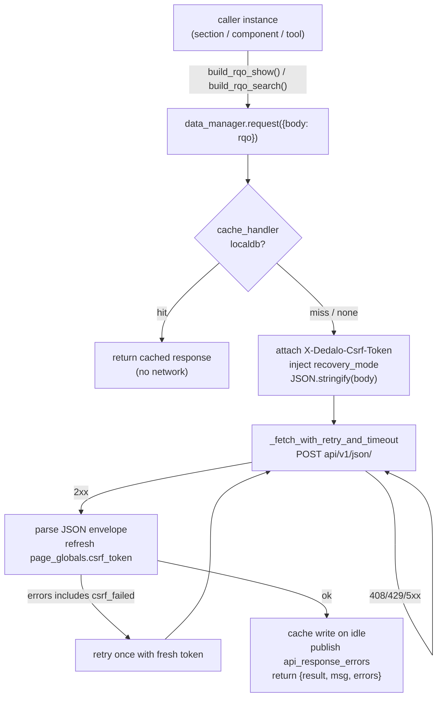

# data_manager

> The Dédalo v7 **client transport**: the single chokepoint every browser→server
> call passes through — it builds the HTTP request around an [RQO](../rqo.md),
> attaches the CSRF token, retries/times-out the fetch, and short-circuits reads
> against the browser's IndexedDB cache.

> File: `./core/common/js/data_manager.js` ·
> See also: [RQO](../rqo.md) · [request_config](../request_config.md) ·
> [UI building blocks](../ui/index.md)

## Role

`data_manager` (in `core/common/js/data_manager.js`) is the **one place** the
client talks to the server. It is a namespace object (not a class you
instantiate) whose central method `data_manager.request(options)` serializes a
body to JSON, POSTs it to the API JSON endpoint (`api/v1/json/`), and returns
the parsed response envelope. Every section, component, area, tool and service
in the browser issues its API calls through it; nothing else calls `fetch()`
against the work API directly.

It owns four concerns that would otherwise be re-implemented per caller:

1. **The wire envelope** — JSON body, `Content-Type: application/json`,
   `credentials: same-origin`, and the `X-Dedalo-Csrf-Token` header (SEC-008).
2. **Resilience** — exponential-backoff retry, per-attempt timeout, and a
   mid-attempt server-health probe that keeps a long-running request alive
   instead of aborting it.
3. **Local caching** — an optional short-circuit read/write against IndexedDB
   (database `dedalo`, v11), plus the persistence of UI/pagination state.
4. **Streaming** — SSE / NDJSON readers for long row-by-row payloads
   (`tool_export`, transcription, etc.).

The *message* it sends is the [RQO](../rqo.md), built by the caller from the
[request_config](../request_config.md) the server injected into its context.
`data_manager` is transport only: it does not build the RQO and does not know
the ontology — it moves bytes and manages the connection.

!!! note "Server describes, client draws"
    `data_manager` is the client end of the
    [request lifecycle](../rqo.md#request-lifecycle). The caller builds an RQO
    with `create_source()` / `build_rqo_show()` / `build_rqo_search()`
    (`core/common/js/common.js`); `data_manager.request` POSTs it; the API gate
    (`core/api/v1/json/index.php`) sanitizes and dispatches it; the response
    datum `{context, data}` flows back to the caller to render.

## Overview



A `request` call runs this sequence:

1. **Merge options** over the safe defaults (5 retries, 500 ms base delay,
   5 000 ms timeout) — every default is overridable per call.
2. **CSRF header** — if `page_globals.csrf_token` is set and the caller did not
   already provide the header, attach `X-Dedalo-Csrf-Token`.
3. **Cache short-circuit** — when `options.cache_handler.handler === 'localdb'`,
   read the response from the IndexedDB `data` store and return it without a
   network call on a hit.
4. **Recovery mode** — if `page_globals.recovery_mode` is set, inject
   `recovery_mode: true` into the body so the server skips non-essential side
   effects.
5. **Reset** `page_globals.api_errors` (and `request_message`) so this call's
   error state starts clean.
6. **Dispatch** through `_fetch_with_retry_and_timeout` after JSON-stringifying
   the body.
7. **Parse + refresh** — parse the JSON envelope and copy any
   `json_response.csrf_token` back into `page_globals.csrf_token` (the server
   may rotate it on auth state changes).
8. **CSRF retry** — if the envelope is `{result:false, errors:[…'csrf_failed'…]}`
   and the call has not already retried, resend it once with the fresh token
   (the `_csrf_retried` flag guards against an infinite loop).
9. **Surface errors** — fatal `error` is recorded via `_record_api_error` (the
   page renderer reads `page_globals.api_errors`); non-fatal `errors[]` publish
   the `api_response_errors` event on the [event bus](../ui/index.md).
10. **Cache write** — on a successful result (`result !== false`), write the
    response back to IndexedDB on idle (`dd_request_idle_callback`).

The return is **always an object**. On failure it has the shape
`{ result:false, msg, error, errors }` so callers can destructure without
null-checking.

## Key concepts

### The CSRF token loop (SEC-008)

The token lives in `page_globals.csrf_token`, minted by the server on the
bootstrap `start` action. `data_manager`:

- **reads** it and sends it as the `X-Dedalo-Csrf-Token` header on every
  request (and on both streaming variants);
- **refreshes** it from every response (`json_response.csrf_token`);
- **retries once** transparently on a `csrf_failed` rejection — this absorbs the
  bootstrap race where a non-exempt action fires before `start` has returned a
  token (parallel menu/read calls during page build, or the post-login reload
  that resets `page_globals`).

The set of actions exempt from the token check (and the separate no-login
allowlist) is enforced server-side — see the
[RQO security model](../rqo.md#security-model-summary).

### Retry, timeout and the health probe

`_fetch_with_retry_and_timeout` is the **only** place that calls native
`fetch()` for regular (non-streaming) requests. Per attempt it:

1. computes `delay = base_delay * 2^(attempt-1)` (exponential backoff);
2. creates a fresh `AbortController` and arms `controller.abort()` after
   `timeout + delay` ms (the window grows with each retry);
3. schedules a **mid-attempt health probe** at `timeout / 2` ms via
   `check_server_health()` (a cache-busted GET to `<url>health/`). If the
   server answers the probe, the main abort is **cancelled** so a legitimately
   slow process can finish naturally instead of being killed;
4. retries only on statuses `[408, 429, 500, 502, 503, 504]`; any other 4xx
   throws immediately (non-retryable);
5. surfaces progress to the user through `render_msg_to_inspector` ("Awaiting
   for busy server…", "Retrying in N ms…", timeout/network notices).

When retries are exhausted it throws, and `data_manager.request` catches it and
returns the normalized error envelope.

!!! note "Two dormant alternatives"
    `_fetch_with_race` (fire N staggered fetches, take the first to finish via
    `Promise.race`) and the Worker path (`_handle_worker_request` +
    `worker_data.js`) are both present but **not wired into `request`** —
    `_fetch_with_retry_and_timeout` is the active strategy. `worker_data.js` is
    a self-contained, minimal copy of `request` for a background thread; the
    `use_worker` option exists but the call is commented out (deactivated
    2025-05-22 while network debugging is in progress).

### Concurrency

There is no request queue: each `data_manager.request` is an independent
`async` call. Batching several operations is done with several concurrent
`fetch` calls (the callers await them in parallel), **not** by sending an array
of RQOs — the API endpoint decodes exactly one RQO per HTTP request (see
[RQO](../rqo.md)). `page_globals.api_errors` is reset at the **start** of each
`request`, so it reflects the most recent call.

### Local caching (IndexedDB)

`get_local_db()` opens the `dedalo` database at schema version **11**. Its
`onupgradeneeded` handler is idempotent (creates only missing stores) and drops
the legacy `sqo` store. Object stores:

| store | holds |
| --- | --- |
| `rqo` | cached request/query objects |
| `context` | component/section context cache |
| `status` | UI element state (e.g. `section_group` collapsed/expanded) |
| `data` | generic transient data (response cache, menu datum resolution) |
| `ontology` | ontology node cache |
| `pagination` | pagination state (replaced the removed `sqo` store) |

A request opts into the cache with
`cache_handler: { handler:'localdb', id:'<key>' }`: the response is read from
the `data` store **before** the network and written back **on idle** after a
successful call. The `*_local_db*` helpers
(`get_local_db_data`, `set_local_db_data`, `delete_local_db_data`,
`delete_local_db_data_by_prefix`, `clear_local_db_table`,
`delete_whole_local_db`) manage reads, writes, prefix-bulk deletes and resets.
`get_local_db_data` can cache the open DB handle per table (`use_cache=true`,
backed by a module-level `db_table_cache` map). If IndexedDB is unavailable
(blocked / private browsing) the helpers resolve `false` and Dédalo runs without
cache — callers must guard for a falsy result.

### Streaming

For payloads delivered incrementally:

- **`request_stream`** opens an SSE connection. It force-patches `is_stream:true`
  onto the body (the PHP endpoint then switches to
  `Content-Type: text/event-stream`) and resolves with the raw `response.body`
  `ReadableStream`.
- **`request_fetch_stream`** is the generic NDJSON variant (used by
  `tool_export`); it does **not** set `is_stream` and throws immediately on a
  non-2xx response.
- **`read_stream`** consumes an SSE stream chunk-by-chunk, reassembling messages
  that the HTTP server may split (`data:\n…\n\n` across chunks) or merge (two
  messages in one chunk), parsing each with `JSON_parse_safely`, and invoking
  `on_read` / `on_done` callbacks. Each reader is registered in
  `page_globals.stream_readers` so navigation can abort all in-flight readers.

Both streaming methods also attach the CSRF header.

## JS files and functions

All in `core/common/js/data_manager.js` unless noted.

| symbol | kind | role |
| --- | --- | --- |
| `data_manager` | exported namespace object | owns all client→server communication |
| `data_manager.request(options)` | method | the central dispatcher (CSRF, recovery_mode, cache short-circuit, parse, CSRF retry, error surfacing) |
| `data_manager.url` / `data_manager.health_url` | getters | API endpoint (`DEDALO_API_URL` → fallback `../api/v1/json/`) and `<url>health/` |
| `_fetch_with_retry_and_timeout(url, opts, retries, base_delay, timeout)` | module function | the only native `fetch` for regular requests; backoff + timeout + health probe |
| `check_server_health()` | exported | cache-busted probe of `<url>health/`; distinguishes "busy" from "down" |
| `render_msg_to_inspector(msg, type, remove_time)` | exported | publishes the `notification` event for user-visible banners |
| `_record_api_error(type, msg, trace, details)` | method | appends to `page_globals.api_errors` (read by the page renderer) |
| `_create_error_response(msg, error)` | method | builds the normalized `{result:false,…}` failure object |
| `get_element_context(source)` | method | `get_element_context` action, always `prevent_lock:true` (context, no data) |
| `resolve_model(tipo, section_tipo)` | method | model class for a tipo; cached in `page_globals.models` |
| `get_matrix_ontology_locator(tipo)` | method | `{section_tipo, section_id}` for a tipo; cached in `page_globals.ontology_info` |
| `get_page_element(options)` | method | fully rendered page element (`get_page_element` action) |
| `request_stream` / `request_fetch_stream` / `read_stream` | methods | SSE / NDJSON streaming |
| `get_local_db()` | method | open/upgrade the `dedalo` IndexedDB (v11) |
| `get_local_db_data` / `set_local_db_data` / `delete_local_db_data` / `delete_local_db_data_by_prefix` / `clear_local_db_table` / `delete_whole_local_db` | methods | IndexedDB read / write / delete / prefix-delete / clear / drop |
| `download_url(url, filename)` / `download_data(data, filename)` | exported | browser-download helpers (blob → temporary `<a>`) |
| `_fetch_with_race(...)` / `_handle_worker_request(...)` | functions | **dormant** alternative strategies (not wired into `request`) |
| `worker_data.js` | separate file | self-contained background-Worker copy of `request` (currently deactivated) |

The RQO body these methods carry is assembled by the caller in
`core/common/js/common.js` (`create_source`, `build_rqo_show`,
`build_rqo_search`) — documented in [RQO](../rqo.md).

## Worked example

A section list reading its first page, with the response cached in IndexedDB:

```js
import {data_manager} from '../../common/js/data_manager.js'

// rqo built from the section's request_config (see build_rqo_show in common.js)
const rqo = {
    id     : 'section_oh1_list',
    action : 'read',
    dd_api : 'dd_core_api',
    prevent_lock : true,
    source : {
        typo         : 'source',
        type         : 'section',
        action       : 'search',
        model        : 'section',
        tipo         : 'oh1',
        section_tipo : 'oh1',
        section_id   : null,
        mode         : 'list',
        lang         : 'lg-eng'
    },
    sqo : { section_tipo:['oh1'], filter:null, limit:10, offset:0 }
}

const api_response = await data_manager.request({
    body          : rqo,
    cache_handler : { handler:'localdb', id:'section_oh1_list_p0' } // optional
})

if (api_response.result === false) {
    // failure envelope: { result:false, msg, error, errors }
    console.error(api_response.errors)
} else {
    const { context, data } = api_response.result // {context, data}
    // ... hand to the section instance to render
}
```

Under the hood: the CSRF header is attached from `page_globals.csrf_token`; if
the `localdb` key is present the cached envelope is returned with no network
hit; otherwise `_fetch_with_retry_and_timeout` POSTs the JSON, retrying on a
transient 5xx and keeping the request alive if the health probe shows the server
is merely busy; the response refreshes the token and is written back to the
`data` store on idle.

A lightweight context lookup (no data, never locks the section):

```js
const ctx = await data_manager.get_element_context({
    model        : 'component_input_text',
    tipo         : 'oh16',
    section_tipo : 'oh1',
    section_id   : null,
    mode         : 'edit'
})
const context = ctx.result // structure context only
```

A streaming export (NDJSON, row by row):

```js
const stream = await data_manager.request_fetch_stream({ body: export_rqo })
const reader = stream.getReader()
// ... consume reader.read() lines until done
```

## Related

- [Request Query Object (RQO)](../rqo.md) — the message `data_manager.request`
  sends, and the API gate / dispatch / security model on the receiving end.
- [Request Config Architecture](../request_config.md) — the server-side config
  the caller turns into an RQO before handing it to the transport.
- [SQO](../sqo.md) — the `filter`/`limit`/`order` query carried inside the RQO.
- [UI building blocks](../ui/index.md) — the consumers that render the
  `{context, data}` datum a `request` returns, and the `event_manager` bus the
  transport publishes `notification` / `api_response_errors` to.
- `core/common/js/common.js` — the client RQO builders (`create_source`,
  `build_rqo_show`, `build_rqo_search`).
- `core/common/js/worker_data.js` — the dormant background-Worker copy of
  `request`.
- `core/api/v1/json/index.php` — the server endpoint the transport POSTs to.
