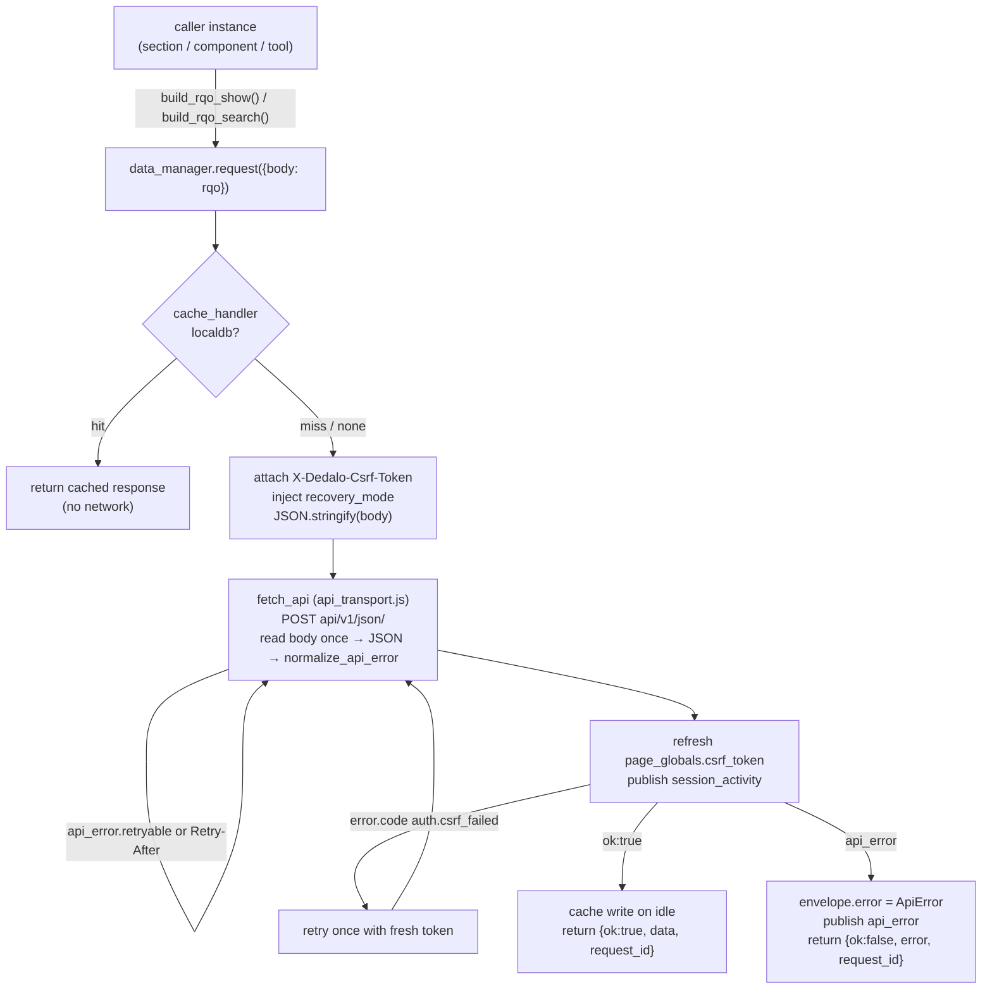

# data_manager

> The Dédalo v7 **client transport**: the single chokepoint every browser→server
> call passes through — it builds the HTTP request around an [RQO](../rqo.md),
> attaches the CSRF token, retries/times-out the fetch, and short-circuits reads
> against the browser's IndexedDB cache.

> File: `./core/common/js/data_manager.js` ·
> See also: [RQO](../rqo.md) · [request_config](../request_config.md) ·
> [UI building blocks](../ui/index.md)

## Role

`data_manager` (in `core/common/js/data_manager.js`) is the **one place** the
client talks to the server. It is a namespace object (not a class you
instantiate) whose central method `data_manager.request(options)` serializes a
body to JSON, POSTs it to the API JSON endpoint (`api/v1/json/`), and returns
the parsed response envelope. Every section, component, area, tool and service
in the browser issues its API calls through it; nothing else calls `fetch()`
against the work API directly.

It owns four concerns that would otherwise be re-implemented per caller:

1. **The wire envelope** — JSON body, `Content-Type: application/json`,
   `credentials: same-origin`, and the `X-Dedalo-Csrf-Token` header (SEC-008).
2. **Resilience** — the shared transport (`core/common/js/api_transport.js`)
   retries only what is retryable (`api_error.retryable` / `Retry-After`),
   applies a per-attempt timeout, and runs a mid-attempt server-health probe
   that keeps a long-running request alive instead of aborting it.
3. **Local caching** — an optional short-circuit read/write against IndexedDB
   (database `dedalo`, v11), plus the persistence of UI/pagination state.
4. **Streaming** — SSE / NDJSON readers for long row-by-row payloads
   (`tool_export`, transcription, etc.).

The *message* it sends is the [RQO](../rqo.md), built by the caller from the
[request_config](../request_config.md) the server injected into its context.
`data_manager` is transport only: it does not build the RQO and does not know
the ontology — it moves bytes and manages the connection.

!!! note "Server describes, client draws"
    `data_manager` is the client end of the
    [request lifecycle](../rqo.md#request-lifecycle). The caller builds an RQO
    with `create_source()` / `build_rqo_show()` / `build_rqo_search()`
    (`core/common/js/common.js`); `data_manager.request` POSTs it; the API gate
    (`src/server.ts` routes `/api/v1/json` and `/dedalo/core/api/v1/json[/]`
    into `src/core/api/dispatch.ts`) sanitizes and dispatches it; the response
    datum `{context, data}` flows back to the caller to render.

## Overview


```mermaid
flowchart TD
    A["caller instance<br/>(section / component / tool)"] -- "build_rqo_show() / build_rqo_search()" --> B["data_manager.request({body: rqo})"]
    B --> C{cache_handler<br/>localdb?}
    C -->|hit| H["return cached response<br/>(no network)"]
    C -->|miss / none| D["attach X-Dedalo-Csrf-Token<br/>inject recovery_mode<br/>JSON.stringify(body)"]
    D --> E["fetch_api (api_transport.js)<br/>POST api/v1/json/<br/>read body once → JSON → normalize_api_error"]
    E -->|"api_error.retryable or Retry-After"| E
    E --> F["refresh page_globals.csrf_token<br/>publish session_activity"]
    F -->|"error.code auth.csrf_failed"| R["retry once with fresh token"]
    R --> E
    F -->|"ok:true"| G["cache write on idle<br/>return {ok:true, data, request_id}"]
    F -->|"api_error"| X["envelope.error = ApiError<br/>publish api_error<br/>return {ok:false, error, request_id}"]
```

A `request` call runs this sequence:

1. **Merge options** over the safe defaults (5 retries, 500 ms base delay,
   5 000 ms timeout) — every default is overridable per call.
2. **CSRF header** — if `page_globals.csrf_token` is set and the caller did not
   already provide the header, attach `X-Dedalo-Csrf-Token`.
3. **Cache short-circuit** — when `options.cache_handler.handler === 'localdb'`,
   read the response from the IndexedDB `data` store and return it without a
   network call on a hit.
4. **Recovery mode** — if `page_globals.recovery_mode` is set, inject
   `recovery_mode: true` into the body so the server skips non-essential side
   effects.
5. **Validate** — an empty URL or an unserialisable body resolves a client
   failure envelope (`client.network`) without touching the network.
6. **Dispatch** through `fetch_api` (`core/common/js/api_transport.js`): fetch
   never throws on status; the body is read **once**, parsed when it is JSON,
   and passed to `normalize_api_error`. A failure is retried **only** when
   `api_error.retryable` is true or the server sent `Retry-After` (honoured
   over the backoff) — there is no status list and no 401/403 carve-out: an
   auth or permission answer is an envelope like any other, dispatched on its
   code.
7. **Refresh** — copy any `csrf_token` (present on success **and** failure
   envelopes) back into `page_globals.csrf_token` and publish
   `session_activity`.
8. **CSRF retry** — if `error.code === 'auth.csrf_failed'` and the call has not
   already retried, resend it once with the fresh token (the `_csrf_retried`
   flag guards against an infinite loop).
9. **Failure** — attach the `ApiError` under `envelope.error` (or synthesise
   `{ok:false, error}` when no JSON arrived), publish the `api_error` event on
   the [event bus](../ui/index.md), toast transport failures (network,
   timeout, foreign status page), and return the envelope.
10. **Success / cache write** — return the envelope; when cached, write it back
    to IndexedDB on idle (`dd_request_idle_callback`).

The return is **always an object**: the envelope v2. On success it is
`{ ok:true, request_id, data, notices? }`; on failure `{ ok:false, request_id,
error }` where `error` is an `ApiError` (`core/common/js/api_error.js`) —
`request_failed(api_response)` is the one test, `response_data(api_response)`
the one payload accessor, and every consumer dispatches on `error.code`, never
on HTTP status or message text.

!!! note "There is no compat mirror"
    The legacy fields (`result`, `msg`, `errors:[code]`) are not on the wire
    any more: the server stopped mirroring them on 2026-08-16, once no client
    file read them (`client_error_contract_tripwire` counts those reads and
    holds them at zero). The normaliser understands v2 only and
    `response_data` reads `data`. A handler-owned top-level field (`msg` on the
    maintenance/install surfaces, `in_use` on the lock surface, …) is an
    EXTENSION KEY, read on a SUCCESS only through
    `response_extension(api_response, key)` — it is never the error channel.

## Key concepts

### The CSRF token loop (SEC-008)

The token lives in `page_globals.csrf_token`, minted by the server on the
bootstrap `start` action. `data_manager`:

- **reads** it and sends it as the `X-Dedalo-Csrf-Token` header on every
  request (and on both streaming variants);
- **refreshes** it from every response (`json_response.csrf_token`);
- **retries once** transparently on an `auth.csrf_failed` rejection — this absorbs the
  bootstrap race where a non-exempt action fires before `start` has returned a
  token (parallel menu/read calls during page build, or the post-login reload
  that resets `page_globals`).

The set of actions exempt from the token check (and the separate no-login
allowlist) is enforced server-side — see the
[RQO security model](../rqo.md#security-model-summary).

### The error model: `ApiError`

`core/common/js/api_error.js` is a **pure** module (no DOM, no page globals —
it runs in the cache Worker and the Service Worker too). It defines:

- `ApiError` — `{code, status, message, label_key, details, request_id,
  retryable, transport, severity, source, raw}`; extends `Error` so legacy
  `.message` readers keep working, and carries `is_api_error:true` so it
  survives a `postMessage` clone.
- `CLIENT_ERROR` — the codes the client itself produces when no envelope
  arrived: `client.network`, `client.timeout`, `client.aborted`,
  `client.bad_response`, `client.http_status`, `client.worker`,
  `client.offline`; each maps to an `error_client_*` label.
- `normalize_api_error(response, body)` — envelope v2 → `ok:false` without a
  code → non-JSON status → `null` on success.
- `normalize_transport_error(error, flags)` — classifies a `fetch` rejection
  **by class** (`AbortError` + our timer → `client.timeout`, `AbortError` →
  `client.aborted`, `TypeError` → `client.network`, else
  `client.bad_response`); never by message text.
- `normalize_stream_error(frame)` — the same for an SSE/NDJSON end-of-run
  frame.
- `request_failed(api_response)` / `response_data(api_response)` — the two
  accessors callers use; `response_extension(api_response, key)` for a
  handler-owned top-level key (success only).

The policy (which code calls for which UI action: relogin, no-access page,
page panel, toast, modal, inline, silent) lives in `error_policy.js`; the
executor `handle_api_error(api_error, ctx) → {recovered}` in
`error_dispatch.js`; the text-only renderer (`error_text`, toast, inline,
panel, modal — labels first, `SHOW_DEBUG` suffix `[code · request_id]`) in
`render_api_error.js`.

### Notices: a success that has something to say

A **success** envelope may carry `notices: [{code, label_key, retryable,
details}]` — a coded fact that is not a failure. The request worked and
something the user should know did not go the obvious way: a record kept
because one of its children refused to be deleted
(`record.delete_children_refused`, `details.not_deleted` = the refused ids), an
external source that answered nothing because it is down or switched off
(`external.<kind>`), a partial write that cleaned some languages and not
others.

`data_manager.request` publishes them once, generically, as the `api_notices`
event `{notices, api_response}`. `page.js` subscribes to it at init, so a
notice is never lost just because the caller forgot to look for one:

- `handle_api_notice(notice, ctx)` (`error_dispatch.js`) resolves the notice
  through the **same** policy table an `ApiError` goes through, at severity
  `warning`.
- A page-level action can never fire for a notice: `relogin`,
  `no_access_page`, `page_panel` and `csrf_retry` all degrade to a toast. The
  request the user made succeeded, so nothing may take the page away.
- A caller that renders the notice **itself** — next to the record it could not
  delete, or inside the autocomplete datalist where the empty result is — asks
  for ownership with `data_manager.request({…, notices: 'caller'})`, which
  suppresses the page-level publish so the message is not said twice, and
  reads `api_response.notices` directly.
- A tool or area may register its own domain
  (`register_error_policy({'my_domain.*': {action: 'silent'}})`) when its
  widget already shows the fact.

### Retry, timeout and the health probe

`fetch_api` (`core/common/js/api_transport.js`) is the **only** place that
calls native `fetch()` for regular (non-streaming) requests, and it is the same
function the cache Worker (`page/js/worker_cache.js`) and the module Service
Worker (`core/sw.js`) use — there is one request algorithm. Per attempt it:

1. computes `delay = base_delay * 2^(attempt-1)` (exponential backoff);
2. creates a fresh `AbortController` (chained to the caller's `signal`) and
   arms it after `timeout + delay` ms (the window grows with each retry);
3. schedules a **mid-attempt health probe** at `timeout / 2` ms via
   `check_health()` (a cache-busted GET to `/health`, at the ORIGIN root — not
   under the API path). If the server answers the probe, the main abort is
   **cancelled** so a legitimately slow process can finish naturally, and the
   `on_wait` hook fires with reason `'busy'` (`data_manager` shows the
   `awaiting_busy_server` notice);
4. reads the body once, parses it, normalises it; retries only when
   `api_error.retryable` is true or `Retry-After` was sent — a caller abort is
   never retried;
5. emits **no UI** itself: `on_wait(attempt, delay, reason)` is its only hook.

When attempts are exhausted it returns `{json, api_error, response}` and
`data_manager.request` builds the failure envelope from it.

### Concurrency

There is no request queue: each `data_manager.request` is an independent
`async` call. Batching several operations is done with several concurrent
`fetch` calls (the callers await them in parallel), **not** by sending an array
of RQOs — the API endpoint decodes exactly one RQO per HTTP request (see
[RQO](../rqo.md)). The page-level error slot (`page_globals.page_error`, set by
`error_dispatch`) reflects the most recent handled failure.

The **browser**, however, does queue: six connections per origin over HTTP/1.1.
Ordinary requests finish and free their slot, so this is invisible for them —
but a long-lived SSE stream occupies one for its whole life, and an abandoned
one occupies it forever. See [the connection is the
resource](#the-connection-is-the-resource).

### Local caching (IndexedDB)

`get_local_db()` returns **the** connection to the `dedalo` database at schema
version **11**, opening it on first call. Its `onupgradeneeded` handler is
idempotent (creates only missing stores) and drops the legacy `sqo` store.
Object stores:

| store | holds |
| --- | --- |
| `rqo` | cached request/query objects |
| `context` | component/section context cache |
| `status` | UI element state (e.g. `section_group` collapsed/expanded) |
| `data` | generic transient data (response cache, menu datum resolution) |
| `ontology` | ontology node cache |
| `pagination` | pagination state (replaced the removed `sqo` store) |

A request opts into the cache with
`cache_handler: { handler:'localdb', id:'<key>' }`: the response is read from
the `data` store **before** the network and written back **on idle** after a
successful call. The `*_local_db*` helpers
(`get_local_db_data`, `set_local_db_data`, `delete_local_db_data`,
`delete_local_db_data_by_prefix`, `clear_local_db_table`,
`delete_whole_local_db`) manage reads, writes, prefix-bulk deletes and resets.
If IndexedDB is unavailable (blocked / private browsing) the helpers resolve
`false` and Dédalo runs without cache — callers must guard for a falsy result.

!!! note "One connection per page, not one per operation"
    The connection is memoized (`local_db_promise`) and shared by every store
    and every helper; concurrent first callers await a single `open()`. Do not
    call `close()` on the handle you receive — it is not yours. The memo is
    dropped automatically when the connection stops being usable (`close`, or a
    `versionchange` raised by another tab upgrading or deleting the database, in
    which case this page steps aside by closing so the other tab is not blocked),
    and a failed open is never memoized, so the next call retries.

    A blocked open is a special case: `blocked` does **not** end the request —
    the browser keeps it pending and may complete it after the blocking tab
    goes away. `get_local_db()` resolves `false` so callers are not stranded,
    and the connection that arrives later is closed on arrival rather than left
    unreferenced, where it would pin the database open for the rest of the
    page's life.

    `get_local_db_data`'s third argument `use_cache` is **ignored**. It used to
    opt into a per-table handle cache; with one shared connection there is
    nothing left to opt into. It remains in the signature because several call
    sites still pass `true`.

!!! tip "Reads are readonly, writes are readwrite"
    `get_local_db_data` opens a **readonly** transaction. IndexedDB serialises
    overlapping readwrite transactions on a store and lets readonly ones run
    concurrently, so a read declared readwrite queues behind every other
    operation on that store — which for the request cache means behind every
    other lookup and every idle write-through on `data`. Ordering between reads
    and writes is untouched in both directions — overlapping transactions of
    conflicting modes cannot run concurrently, so a read created after a write
    waits for it to finish, and a write created after a read cannot overtake it.
    Only read-vs-read becomes concurrent, which nothing can observe.

!!! warning "Close before deleting"
    An open connection blocks `deleteDatabase`. `delete_whole_local_db()` closes
    this page's connection first (`close_local_db`); `onblocked` can still fire
    when **another tab** holds the database open, and that is the only case it
    now reports. `clear_local_db_table()` runs on the shared connection too — it
    no longer opens a second, version-less one of its own.

### Streaming

For payloads delivered incrementally:

- **`request_stream`** opens an SSE connection. It force-patches `is_stream:true`
  onto the body (the server endpoint then switches to
  `Content-Type: text/event-stream`) and resolves with the raw `response.body`
  `ReadableStream`.
- **`request_fetch_stream`** is the generic NDJSON variant (used by
  `tool_export`); it does **not** set `is_stream`. Both variants **reject with
  an `ApiError`** on a non-2xx answer (the server's `error.code` when the body
  is an envelope — a mid-job `auth.not_logged` triggers relogin — else
  `client.http_status`) and on a network failure (`client.*`).
- **`read_stream`** consumes an SSE stream chunk-by-chunk, reassembling messages
  that the HTTP server may split (`data:\n…\n\n` across chunks) or merge (two
  messages in one chunk), parsing each with `JSON_parse_safely` (an unparseable
  message becomes a frame carrying `error` = `ApiError client.bad_response`;
  consumers read frames with `normalize_stream_error`), and invoking
  `on_read` / `on_done` callbacks. It **returns the reader** driving the stream.
  Each reader is also registered in `page_globals.stream_readers` so navigation
  can abort all in-flight readers, and `read_stream` releases its own reader from
  that registry when the stream ends — see below.
- **`release_stream_reader(reader, reason)`** cancels one reader and splices it
  out of that registry. It is the teardown for any consumer that stops following
  a stream **before** the page unloads.

Both streaming methods also attach the CSRF header.

#### The connection is the resource

!!! danger "A stream nobody reads still costs a connection — six of them freeze the page"
    An open SSE stream holds one HTTP connection for as long as the server keeps
    it open, and a browser grants **six per origin over HTTP/1.1**. Dropping the
    callbacks is not dropping the stream: a consumer that merely stops listening
    leaves the connection live, and at the sixth abandoned stream **every**
    request on the page queues indefinitely.

    Including `/health`. That is the probe `fetch_api` uses
    to tell a busy server from a dead one, so a starved page cannot even detect
    its own starvation: it reports timeouts and retries against a server that is
    answering in milliseconds.

    So `page_globals.stream_readers` is the LAST resort — it drains on
    navigation, not on teardown. Any surface that can be closed, destroyed or
    re-rendered while its stream is still open must call
    `release_stream_reader` itself (job followers get this for free; see the
    activity tray in [page](../ui/page.md)).

    Splice **by identity**. The registry is shared with `make_backup`, the
    `move_*` widgets, `tool_diffusion`, the unit-test runner and the job
    followers — emptying it releases other consumers' readers too.

!!! note "`on_done` fires exactly once, however the stream ends"
    `on_done(true)` on normal completion, `on_done(false)` on an abnormal end —
    a read failure, or a throw out of your own `on_read`. Either way
    `read_stream` releases its own reader first, so a stream that ends by itself
    neither leaks a registry entry nor holds its connection. A consumer that
    gives up EARLY still has to release its own reader — that is what the
    warning above is about.

    A throw out of `on_done` itself is reported as a consumer bug and never
    re-enters it. That guard is not cosmetic: the internal failure handler shares
    a promise chain with the success path, so without it your throwing `on_done`
    would be called a second time, with a console line blaming a transport
    failure that never happened.

    The failure half matters as much as the tidy-up. A read error used to be
    logged and nothing else, so `on_done` never ran; `job_follow` calls its
    `finish()` from `on_done`, which meant a dropped connection mid-job left the
    caller with no outcome and no error — indistinguishable from a job still
    running, forever.

## JS files and functions

All in `core/common/js/data_manager.js` unless noted.

| symbol | kind | role |
| --- | --- | --- |
| `data_manager` | exported namespace object | owns all client→server communication |
| `data_manager.request(options)` | method | the central dispatcher (CSRF, recovery_mode, cache short-circuit, parse, CSRF retry, error surfacing) |
| `data_manager.url` / `data_manager.health_url` | getters | API endpoint (`DEDALO_API_URL` → fallback `../api/v1/json/`) and `/health` (origin root) |
| `fetch_api(url, init, options)` | `api_transport.js` | the only native `fetch` for regular requests (page, cache Worker, Service Worker); read-once body, normalise, retry on `retryable`/`Retry-After`, timeout + health probe |
| `check_server_health()` | exported | cache-busted probe of `/health`; distinguishes "busy" from "down" |
| `render_msg_to_inspector(msg, type, remove_time)` | exported | publishes the `notification` event (busy-server notice) |
| `ApiError`, `normalize_api_error`, `normalize_transport_error`, `normalize_stream_error`, `request_failed`, `response_data` | `api_error.js` | the error model and its accessors |
| `resolve_error_policy`, `register_error_policy` | `error_policy.js` | code → UI action table (exact → `domain.*` → `*`) |
| `handle_api_error(api_error, ctx)` | `error_dispatch.js` | executes the policy; owns the relogin-then-retry recovery (`{recovered}`) |
| `error_text`, `render_error_toast` / `_inline` / `_panel` / `_modal` | `render_api_error.js` | text-only rendering, labels first |
| `get_element_context(source)` | method | `get_element_context` action, always `prevent_lock:true` (context, no data) |
| `resolve_model(tipo, section_tipo)` | method | model class for a tipo; cached in `page_globals.models` |
| `get_matrix_ontology_locator(tipo)` | method | `{section_tipo, section_id}` for a tipo; cached in `page_globals.ontology_info` |
| `get_page_element(options)` | method | fully rendered page element (`get_page_element` action) |
| `request_stream` / `request_fetch_stream` / `read_stream` | methods | SSE / NDJSON streaming (`read_stream` returns its reader) |
| `release_stream_reader(reader, reason)` | exported | cancel one reader and splice it out of `page_globals.stream_readers` — the teardown that gives the connection back |
| `get_local_db()` | method | the shared, memoized `dedalo` IndexedDB connection (v11); opens/upgrades on first call |
| `get_local_db_data` / `set_local_db_data` / `delete_local_db_data` / `delete_local_db_data_by_prefix` / `clear_local_db_table` / `delete_whole_local_db` | methods | IndexedDB read / write / delete / prefix-delete / clear / drop |
| `download_url(url, filename)` / `download_data(data, filename)` | exported | browser-download helpers (blob → temporary `<a>`) |

The RQO body these methods carry is assembled by the caller in
`core/common/js/common.js` (`create_source`, `build_rqo_show`,
`build_rqo_search`) — documented in [RQO](../rqo.md).

## Worked example

A section list reading its first page, with the response cached in IndexedDB:

```js
import {data_manager} from '../../common/js/data_manager.js'
import {request_failed, response_data} from '../../common/js/api_error.js'
import {handle_api_error} from '../../common/js/error_dispatch.js'

// rqo built from the section's request_config (see build_rqo_show in common.js)
const rqo = {
    id     : 'section_oh1_list',
    action : 'read',
    dd_api : 'dd_core_api',
    prevent_lock : true,
    source : {
        typo         : 'source',
        type         : 'section',
        action       : 'search',
        model        : 'section',
        tipo         : 'oh1',
        section_tipo : 'oh1',
        section_id   : null,
        mode         : 'list',
        lang         : 'lg-eng'
    },
    sqo : { section_tipo:['oh1'], filter:null, limit:10, offset:0 }
}

const api_response = await data_manager.request({
    body          : rqo,
    cache_handler : { handler:'localdb', id:'section_oh1_list_p0' } // optional
})

if (request_failed(api_response)) {
    // failure envelope: { ok:false, request_id, error:ApiError }
    await handle_api_error(api_response.error)   // relogin / toast / panel per policy
} else {
    const { context, data } = response_data(api_response) // {context, data}
    // ... hand to the section instance to render
}
```

Under the hood: the CSRF header is attached from `page_globals.csrf_token`; if
the `localdb` key is present the cached envelope is returned with no network
hit; otherwise `fetch_api` POSTs the JSON, retrying only a retryable answer and
keeping the request alive if the health probe shows the server is merely busy;
the response refreshes the token and is written back to the `data` store on
idle.

A lightweight context lookup (no data, never locks the section):

```js
const ctx = await data_manager.get_element_context({
    model        : 'component_input_text',
    tipo         : 'oh16',
    section_tipo : 'oh1',
    section_id   : null,
    mode         : 'edit'
})
const context = response_data(ctx) // structure context only
```

A streaming export (NDJSON, row by row):

```js
const stream = await data_manager.request_fetch_stream({ body: export_rqo })
const reader = stream.getReader()
// ... consume reader.read() lines until done
```

## Related

- [Request Query Object (RQO)](../rqo.md) — the message `data_manager.request`
  sends, and the API gate / dispatch / security model on the receiving end.
- [Request Config Architecture](../request_config.md) — the server-side config
  the caller turns into an RQO before handing it to the transport.
- [SQO](../sqo.md) — the `filter`/`limit`/`order` query carried inside the RQO.
- [UI building blocks](../ui/index.md) — the consumers that render the
  `{context, data}` datum a `request` returns, and the `event_manager` bus the
  transport publishes `notification` / `api_error` to.
- `core/common/js/common.js` — the client RQO builders (`create_source`,
  `build_rqo_show`, `build_rqo_search`).
- `core/common/js/api_transport.js`, `api_error.js`, `error_policy.js`,
  `error_dispatch.js`, `render_api_error.js` — the transport core, the error
  model, the policy, its executor and the renderer.
- `src/core/api/dispatch.ts` (served by `src/server.ts` at
  `/api/v1/json` and `/dedalo/core/api/v1/json[/]`) — the server endpoint the
  transport POSTs to.
