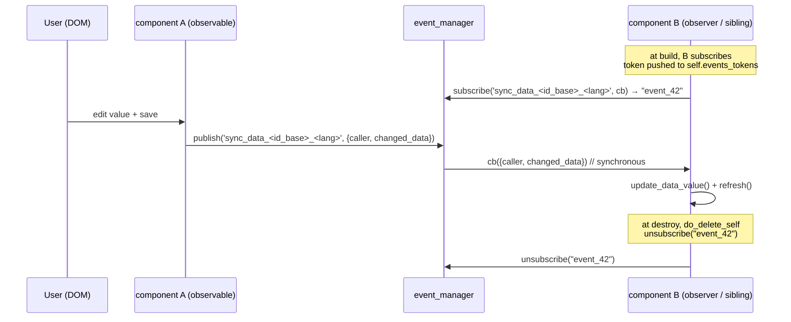

# event_manager (client)

> The browser-side publish/subscribe bus — the single channel every client module uses to talk to every other module without holding a direct reference.

> See also: [Events catalog](../events.md) · [Components: observers and observables](../components/index.md#observers-and-observables) · [Architecture overview](../architecture_overview.md)

This page is the **developer reference** for the client `event_manager`. For the
full catalog of event *names* emitted across the frontend, read
[Events](../events.md). For how the ontology declares observer/observable
relationships (and how the *server*-side counterpart differs), read
[Components — Observers and observables](../components/index.md#observers-and-observables).

## Role

`event_manager` (in `core/common/js/event_manager.js`) is the Dédalo v7 client's
**observer/observable bus**. The client is a thin DOM builder: every element is a
live JS instance, and instances must never reference each other directly. Instead
they **publish** named events and **subscribe** to the events they care about.
Section records, components, tools, services and search modules all coordinate
through this one bus.

The module exports a single pre-instantiated **singleton** named
`event_manager`, and additionally registers it on `window.event_manager` so that
tool iframes can reach it via `parent.window.event_manager` (or
`top_window.event_manager` / `window_base.event_manager`) without an ES-module
import across the frame boundary. Application code must **import and use this
singleton**, never construct `event_manager_class` itself.

```js
import {event_manager} from '../../common/js/event_manager.js'
```

!!! note "One bus, one process"
    A subscription made in one module (say a `section` record) is always visible
    to a publisher in another (say a search tool) because there is exactly one
    `event_manager` instance per page. This is what makes the
    observer/observable model possible without cross-references.

## Key concepts

### Tokens, not callbacks, identify a subscription

`subscribe(event_name, callback)` returns an opaque string **token** of the form
`event_N` (an ever-increasing integer). The token — not the callback — identifies
the subscription. Subscribing the same callback twice produces **two independent
subscriptions** with two tokens, and the callback fires twice per publish. Callers
keep their tokens and pass them back to `unsubscribe(token)` later.

In Dédalo instances, tokens are accumulated in `self.events_tokens` (an array
seeded empty in `common.init`) so that teardown can unsubscribe them all in one
pass (see [Lifecycle integration](#lifecycle-integration)).

### Two internal maps, O(1) everywhere

```text
eventMap : Map<event_name, Set<callback>>   // who listens to what
tokenMap : Map<token, {event_name, callback}>   // reverse index for fast unsubscribe
```

- `eventMap` allows O(1) callback lookup at publish time and automatic
  deduplication via `Set` semantics.
- `tokenMap` lets `unsubscribe(token)` find and remove the right callback in O(1)
  without scanning subscriber lists.
- When an event's `Set` becomes empty it is **deleted** from `eventMap`, so the
  bus does not accumulate dead event entries.

### Synchronous, insertion-ordered dispatch

`publish(event_name, data = {})` invokes every subscribed callback
**synchronously, in subscription order**, passing each the same `data`. It
collects the callbacks' return values into an array and returns it. When there are
**no subscribers it returns `false`** (not an empty array), so callers can tell
"no listeners" apart from "listeners returned nothing".

!!! warning "Callbacks are not wrapped in try/catch"
    A throwing subscriber aborts the remaining callbacks for that publish. Keep
    subscriber callbacks defensive; do not assume every subscriber will run if an
    earlier one throws.

### Scoped event names

Most application events embed identity into the **name** so a publish reaches only
the intended listeners. The common scoping keys are the instance id and the
language-qualified id_base:

```js
// self.id        = tipo + section_tipo + section_id + mode + lang (the instance key)
// self.id_base   = section_tipo + '_' + section_id + '_' + tipo
event_manager.publish('render_'   + self.id, result_node)       // per-instance
event_manager.publish('destroy_'  + self.id)                    // per-instance
event_manager.publish('sync_data_'+ self.id_base + '_' + self.lang, payload) // per-field, per-lang
```

This is how the ontology's `observe` property targets a specific observable:
the observer subscribes to `event + '_' + section_tipo + '_' + section_id + '_' + component_tipo`
(equivalently `event + '_' + id_base`), so it only reacts to *that* component in
*that* record. See [Events — Automatic subscription](../events.md#automatic-subscription).

## Client vs. server observers

The ontology can declare an `observe` block with both a `client` and a `server`
side. They are different mechanisms that happen to share configuration:

| | Client observer | Server observer |
| --- | --- | --- |
| Transport | `event_manager` pub/sub (this file) | direct method call during save |
| Trigger | a user action that `publish`es a named event | a data change on the observable |
| Typical action | `refresh`, activate, recalc, change own DOM | recompute and (optionally) save own data |
| Entry point | the observer's subscribed callback | `set_data_external()` |

On the **server**, the observable's change drives
`component_relation_common::set_data_external()`
(`core/component_relation_common/class.component_relation_common.php`), which
loads the observer component and runs the configured `function` against the
observable's data — persisting if `params.save` is true. On the **client**, the
same configuration's `client.event` / `client.perform` is wired into an
`event_manager.subscribe()` so the observer reacts to user interaction in the
browser. The contract reference for the `observe` JSON shape lives in
[Components — Observers and observables](../components/index.md#observers-and-observables).

## JS reference

All of the following are methods of `event_manager_class`, exposed via the
`event_manager` singleton. File: `core/common/js/event_manager.js`.

| method | purpose |
| --- | --- |
| `subscribe(event_name, callback)` | Register `callback` for the event. Returns an opaque `event_N` token. In `SHOW_DEBUG` mode, re-registering the same callback reference for the same event logs an error and alerts (a dev guard, not a thrown error). |
| `subscribe_once(event_name, callback)` | Subscribe a callback that unsubscribes **itself before firing**, guaranteeing a single execution. Returns the token of the internal wrapper — so `event_exists(name, callback)` returns `false` for it; use the token to cancel before the first fire. |
| `publish(event_name, data = {})` | Fire the event synchronously to every subscriber in insertion order. Returns the array of return values, or `false` when there are no subscribers. |
| `unsubscribe(token)` | Remove the subscription for `token`. Returns `true` if removed, `false` (silently) if the token is unknown/stale. Deletes the event entry when its last subscriber is gone. |
| `event_exists(event_name, callback)` | `true` if that exact callback **reference** is subscribed to the event (O(1), identity comparison). |
| `event_name_exists(event_name)` | Returns the callback `Set` (truthy) or `undefined` (falsy) — **not a boolean**. Used to guard against double-subscribing an event. Do not compare with `=== true`. |
| `clear_event(event_name)` | Remove all subscriptions for one event name (O(n) scan of `tokenMap`). Returns `true` if the event existed. |
| `clear_all()` | Remove every subscription and reset to a clean state (teardown / test reset). All outstanding tokens become invalid. |
| `get_events()` | Snapshot array `[{event_name, token, callback}]` of all active subscriptions, for debugging/introspection (not live). |
| `get_event_count(event_name)` | Number of subscribers for one event (O(1)); `0` if none. |
| `get_total_events()` | Total active subscriptions across all events (O(1)); counts subscriptions, not unique names. |

Module exports:

- `event_manager` — the singleton instance (`export const`).
- `window.event_manager` — the same instance, set only in browser contexts.

## Lifecycle integration

The bus is woven into the standard instance lifecycle in `core/common/js/common.js`:

- **build** publishes `built_<id>` once the instance is ready
  (`common.js`, around the `built_` publish), and per-component
  `events_subscription` modules push their tokens into `self.events_tokens`.
- **render** publishes `render_<id>` with the result node (`common.js`,
  `render`), which deferred placements and search-mode hilite logic subscribe to.
- **destroy** runs `do_delete_self(self)` (`common.js`): it **reverse-iterates
  `self.events_tokens` and calls `event_manager.unsubscribe()` on each**, tears
  down dependencies, removes the instance from `instances_map`, nulls heavy
  references, and finally publishes `destroy_<id>`.

Per-component subscriptions are registered by `events_subscription.js` modules.
The shared one (`core/component_common/js/events_subscription.js`) wires two
cross-cutting subscriptions on every component:

- `render_<id>` (search mode only) — toggles the `hilite_element` class when the
  field carries a value/operator, deferred via `dd_request_idle_callback`.
- `sync_data_<id_base>_<lang>` (all modes except `tm`) — after a save,
  sibling DOM copies of the same field absorb the change and re-render
  (`time_machine` instances are excluded so historical snapshots are not
  overwritten).



## Worked example

A component instance subscribes during build and cleans up during destroy. This
mirrors the real pattern in `events_subscription.js`: store the token, react in
the callback, and let `destroy()` unsubscribe it.

```js
import {event_manager} from '../../common/js/event_manager.js'

// --- during build: subscribe and KEEP the token ---
const id_base_lang = self.id_base + '_' + self.lang

const sync_data_handler = (options) => {
    // The publisher includes itself in the broadcast; ignore the echo.
    if (options.caller.id === self.id) {
        return
    }
    if (options.changed_data) {
        self.update_data_value(options.changed_data)
    }
    self.refresh({ render_level: 'content' })
}

self.events_tokens.push(
    event_manager.subscribe('sync_data_' + id_base_lang, sync_data_handler)
)

// --- elsewhere: a sibling saved, so it broadcasts to the channel ---
event_manager.publish('sync_data_' + id_base_lang, {
    caller       : self,        // the originating instance (echo is filtered out)
    changed_data : { key: 0, value: 'new value', action: 'update' }
})
// returns an array of subscriber return values, or false if nobody listens

// --- during destroy (handled centrally by do_delete_self): ---
// every token in self.events_tokens is unsubscribed, so this is automatic.
// Manual form, if you ever own the token outside the lifecycle:
//   event_manager.unsubscribe(token)
```

!!! tip "Guard before re-subscribing"
    To avoid double subscriptions for a shared, page-level event, gate with
    `event_name_exists` (remember: it returns the `Set` or `undefined`, not a
    boolean):

    ```javascript
    if (!event_manager.event_name_exists('user_navigation')) {
        event_manager.subscribe('user_navigation', fn_user_navigation)
    }
    ```

!!! warning "Always store and release tokens"
    A subscription that is never unsubscribed keeps its callback — and everything
    the closure captures — alive for the life of the page. Push tokens into
    `self.events_tokens` so `destroy` releases them; or, for one-shot reactions,
    prefer `subscribe_once`.

## Related

- [Events catalog](../events.md) — the full list of event names emitted across
  the frontend, with their emitters and payload shapes.
- [Components — Observers and observables](../components/index.md#observers-and-observables)
  — how the ontology `observe` property declares client/server observers.
- [Sections](../sections/index.md) — how a section composes its child components,
  each of which subscribes/publishes through this bus.
- [Architecture overview](../architecture_overview.md) — where the client bus
  sits relative to the transport and the server.
