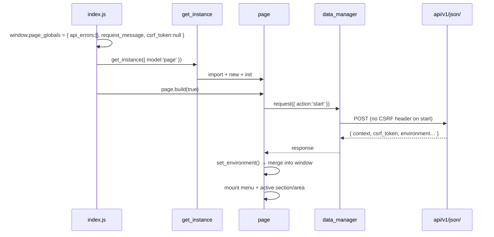

# The browser client

> The Dédalo v7 **browser client**: a thin DOM builder over a server that is the
> single source of truth — the bootstrap, the instance registry, the render
> layer, the event bus and the RQO transport.

> See also: [Architecture overview](../architecture_overview.md) ·
> [Components](../components/index.md) · [Sections](../sections/index.md) ·
> [UI building blocks](../ui/index.md)

## Role

The client is a **thin DOM builder**: the server describes, the client draws. For
every element the server ships a **ddo** (Dédalo data object) — a `context` (model,
label, view, permissions, properties, tools, request_config, css, ddo_map) plus
`data` (the record values). The browser never invents structure: it instantiates a
JS class per element, feeds it the ddo, and renders the standard three-layer DOM.

Three singletons carry the whole client:

- **one transport** — `data_manager.request` → `api/v1/json/` (every server call);
- **one bus** — `event_manager` (every inter-module message);
- **one registry** — `instances_map` (every live object).

If you understand those three plus the `init → build → render` lifecycle, you
understand the client.

## The client in one paragraph

The page boots from `core/page/js/index.js`, which seeds `window.page_globals`
and constructs the singleton [`page`](../ui/page.md). `page.build(true)` fires the
server `start` action through `data_manager.request`; the response is merged into
`window` (`page_globals`, `get_label`, the `DEDALO_*` globals) and the active
area/section is mounted. From there everything is the same cycle: `get_instance(…)`
resolves the model, dynamically imports the matching ES module, constructs it,
runs `init → build → render`, and the render layer turns the ddo into DOM with the
`ui.*` builders. User intent is republished as `event_manager` events; siblings
react without ever holding a direct reference to each other.

## The pieces

| piece | file | role |
| --- | --- | --- |
| **bootstrap** | `core/page/js/index.js` | Seed `page_globals` + CSRF slot, construct the `page` singleton, fire the `start` request, render the app. |
| **registry / factory** | `core/common/js/instances.js` | `get_instance` — the unified async factory; the module-private `instances_map`; key building and lookup/delete helpers. |
| **render layer** | `core/common/js/common.js` (`render`) + `core/common/js/ui.js` (`ui.*`) | `common.prototype.render` is the dispatcher; `ui.*` builders emit the standard wrapper / content_data / content_value DOM. |
| **event bus** | `core/common/js/event_manager.js` | `event_manager` singleton — `subscribe` / `publish` / `unsubscribe` pub/sub. |
| **transport / cache** | `core/common/js/data_manager.js` | `data_manager.request` — RQO transport, retry/timeout, CSRF, streaming, IndexedDB cache. |
| **lifecycle** | `core/common/js/common.js` | `init → build → render → refresh → destroy`; `create_source` / `build_rqo_show` / `build_rqo_search` RQO construction. |

!!! note "common.js vs render_common.js"
    The render *dispatcher* (`render`, the lifecycle, RQO construction) lives in
    `core/common/js/common.js`. `core/common/js/render_common.js` is a separate
    file of shared rendering **utilities** (e.g. `render_server_response_error`,
    `render_stream`) that `common.js` imports — do not confuse the two.

## Bootstrap



The literal seed object in `index.js` sets only `api_errors`, `request_message`
and `csrf_token` (plus `window.get_label` and the debug flags). The richer
`page_globals` fields the rest of the client reads — `dedalo_data_lang`,
`recovery_mode`, `fallback_image`, `stream_readers`, `api_errors`, plus the
`DEDALO_API_URL` / `DEDALO_TOOLS_URLS` globals — are injected from the server
`start` response by `page`'s `set_environment()`. The CSRF token starts `null` so
the very first `start` request goes out unauthenticated (the server exempts
`start`); thereafter the token is read from `page_globals.csrf_token`, sent as the
`X-Dedalo-Csrf-Token` header, and refreshed from each response. A single
transparent retry handles the bootstrap race (`csrf_failed`).

## Key concepts

### 1. instances — factory and registry

`get_instance(options)` (in `instances.js`) is the unified async factory:

1. resolves `model` / `lang` — if `model` is absent it calls
   `data_manager.get_element_context` and injects the returned `context` into
   `options` to avoid a second call;
2. builds a canonical key via `key_instances_builder`, joining non-empty values in
   the fixed `key_order`: `model, tipo, section_tipo, section_id, mode, lang,
   parent, matrix_id, id_variant, column_id`;
3. returns the cached entry from `instances_map` (a module-private `Map`) on a hit;
4. on a miss, dynamically `import()`s the ES module from a model-prefix-derived
   path (`tool_*` → tools root or the `DEDALO_TOOLS_URLS` absolute URL,
   `service_*` → `core/services/<model>/js/<model>.js`, else
   `core/<model>/js/<model>.js`), `new`-constructs the export named exactly like
   the model, sets `instance.id = key` and
   `instance.id_base = [section_tipo, section_id, tipo].join('_')`, `await`s
   `instance.init(options)`, and registers it in `instances_map`.

!!! warning "The module's named export must match the model exactly"
    `get_instance` does `new module[model]()`. If the ES module does not export a
    function named exactly like the model string, the import succeeds but the
    instance cannot be built (a warning is logged and `null` is returned).

Helpers: `get_all_instances`, `get_instances_custom_map`, `add_instance`,
`get_instance_by_id` (synchronous; also on `window` for iframes), `find_instances`
(linear scan on tipo / section_tipo / section_id / mode / lang), `delete_instance(key)`,
and `delete_instances(options)` (wildcard-matched bulk removal). Destruction is
driven by `common.destroy` → `do_delete_self`, which calls `delete_instance(self.id)`.

### 2. render — ddo to standard DOM

`common.prototype.render(options)` (in `common.js`) is the dispatcher. It:

- guards `page_globals.api_errors` (renders `render_server_response_error`),
  missing context, and `permissions < 1` (renders a `no_access` span);
- runs a status state-machine (`building` / `built` / `rendering` / `rendered`)
  with smart concurrency — identical in-progress requests join one waiter,
  differing requests queue last-write-wins;
- calls the **mode-named method** on the instance — `self[render_mode](…)` where
  `render_mode` defaults to `self.mode` (`edit` / `list` / `search` / `tm`) and
  falls back to `list` when the method is missing.

`render_level` is `full` (build the whole wrapper into `self.node`, then
`replaceWith` the old node) or `content` (regenerate only `self.node.content_data`
and splice it in). It publishes `render_<id>` with the result node and, in edit
mode, schedules `ui.activate_tooltips`.

The standard DOM is built by the `ui.*` builders (`ui.js`):

```text
wrapper_<type>  (build_wrapper_edit | build_wrapper_list | build_wrapper_mini | build_wrapper_search)
├── label
├── buttons_container   (only when permissions > 1; ui.add_tools materialises instance.tools[])
├── filter / paginator  (optional)
└── content_data        (build_content_data)
    └── content_value   (the component's own render)
```

Standard CSS classes are `wrapper_<type>`, `<model>`, `<tipo>`,
`<section_tipo>_<tipo>`, `<mode>`, `view_<view>`; ontology CSS (`context.css`) is
injected via `set_element_css`. The wrapper keeps live pointers (`wrapper.label`,
`wrapper.content_data`) so `content`-level re-renders swap just the inner node.
`ui.create_dom_element` is the universal node factory (class / style / dataset /
inner_html / text_content with XSS-safe `text_node`); `ui.update_node_content`
clears and reinserts content. There are matching `ui.area.*`, `ui.tool.*` and
`ui.widget.*` wrapper builders for non-component elements.

### 3. event_manager — the bus

A single `event_manager_class` instance (also `window.event_manager` for iframes),
in `event_manager.js`. It keeps `eventMap` (event_name → `Set<callback>`) and
`tokenMap` (token → `{event_name, callback}`) for O(1) publish and unsubscribe:

- `subscribe(name, cb)` returns an opaque `event_N` token;
- `subscribe_once` self-unsubscribes before firing;
- `publish(name, data)` invokes callbacks synchronously in insertion order and
  returns the array of return values, or `false` when there are no subscribers
  (callbacks are **not** wrapped in try/catch — a throwing callback aborts the rest);
- `unsubscribe(token)`, `clear_event`, `clear_all`, `event_exists`,
  `event_name_exists` and counters round it out.

This is the **observer/observable model**: instances do not reference each other;
they publish/subscribe. Lifecycle events are keyed by instance id (`built_<id>`,
`render_<id>`, `destroy_<id>`); subscription tokens are stored in
`self.events_tokens` and unsubscribed in `do_delete_self`. Common application
events include `activate_component` / `deactivate_component`, `change_value` /
`update_value` / `update_data`, `sync_data_<id_base_lang>`, `change_search_element`,
`api_response_errors` and `notification`.

### 4. data_manager — RQO transport and caching

`data_manager.request(options)` (in `data_manager.js`) serializes `options.body`
to JSON, attaches the CSRF header, injects `recovery_mode` from page_globals,
resets `page_globals.api_errors`, and dispatches via
`_fetch_with_retry_and_timeout` (default 5 retries, 500 ms base, 5 s timeout).
That driver does exponential backoff with a per-attempt `AbortController`,
schedules a mid-attempt `check_server_health` probe that cancels the abort when
the server is alive-but-busy, retries only on statuses
`[408, 429, 500, 502, 503, 504]`, and surfaces progress through
`render_msg_to_inspector`. Responses refresh `page_globals.csrf_token`; non-fatal
`errors` publish `api_response_errors`; fatal errors are recorded via
`_record_api_error` for the page renderer.

Specialized actions: `get_element_context` (with `prevent_lock:true`),
`resolve_model` (cached in `page_globals.models`), `get_matrix_ontology_locator`
(cached in `page_globals.ontology_info`), `get_page_element`, and streaming via
`request_stream` / `request_fetch_stream` + `read_stream` (SSE/NDJSON, readers
tracked in `page_globals.stream_readers`).

**RQO construction** lives in `common.js`. `create_source(self, action)` builds the
`{typo:'source', type, action, model, tipo, section_tipo, section_id, mode, view,
lang}` descriptor (plus `source_add`, `matrix_id`, `data_source`,
`caller_dataframe`, `properties`). `build_rqo_show` clones the request_config,
attaches the source, resolves the `sqo` (with pagination and an auto
`filter_by_locators` from section_tipo/section_id) → `{action:'read', source, sqo}`.
`build_rqo_search` walks the `ddo_map` via `get_ar_inverted_paths` to assemble a
`filter_free` of `{q, path}` clauses plus `sqo_options`.

**Local caching** uses IndexedDB (`dedalo`, schema v11) via `get_local_db` with
stores `rqo`, `context`, `status`, `data`, `ontology`, `pagination`. When a request
carries `cache_handler:{handler:'localdb', id}`, the response is short-circuit-read
before the network and written back afterwards. UI state (activate/deactivate
last-selection, section_group collapse, stream PIDs) is persisted to the `status`
store via the `*_local_db*` helpers. `worker_data.js` is a minimal self-contained
replica of `request` for an optional background Worker (currently deactivated in
`request` — `use_worker` defaults to `false`).

### 5. Lifecycle and section composition

The lifecycle is `init → build → render → (events) → refresh → destroy`, with
status `initializing → initialized → building → built → rendering → rendered →
destroyed`:

- **init** seeds baseline properties from options (model / tipo / section_tipo /
  section_id / mode / lang / context / data / datum, plus empty `events_tokens`
  and `ar_instances`).
- **build** fetches/hydrates context+data, calls `set_context_vars` (which wires
  `view` / `properties` / `permissions` as getters/setters backed by `context`,
  and assembles `show_interface`), subscribes events, and publishes `built_<id>`.
- **render** emits the DOM (above).
- **refresh** does destroy-dependencies → build → render at `content` level
  (optionally reusing an injected `tmp_api_response`).
- **destroy** unsubscribes all tokens, tears down paginator / services / inspector
  / filter, recursively destroys `ar_instances`, removes itself from
  `instances_map` and from `caller.ar_instances`, nulls heavy references, and
  publishes `destroy_<id>`.

A **section composes its components** on the client by reading its
`request_config` / `ddo_map`, deriving columns with `get_columns_map` (handling
line / mosaic / default grouping and the synthetic `ddinfo` column), and calling
`get_instance` per child component (passing the section as `caller` and pushing
each child into `section.ar_instances`). Children render their own wrapper /
content_data and append into the section DOM; deferred placements (e.g.
`component_filter` into the inspector) use `ui.place_element`, which appends
immediately if the target is `rendered`, or defers via a `render_<target.id>`
subscription otherwise. Tearing down the section cascades `destroy` to all
`ar_instances`, keeping the registry and the event bus leak-free.

## Worked example: instantiate, render, listen, destroy

```js
import { get_instance, delete_instance } from '../../common/js/instances.js'
import { event_manager }                from '../../common/js/event_manager.js'

// 1. get_instance: resolves the model, imports core/component_input_text/js/…,
//    builds the canonical key, runs init → build (the build issues the RQO via
//    data_manager.request and receives the ddo {context, data}).
const input = await get_instance({
    model        : 'component_input_text',
    tipo         : 'oh15',
    section_tipo : 'oh1',
    section_id   : '42',
    mode         : 'edit',
    lang         : 'lg-eng'
})
// input.id === 'component_input_text_oh15_oh1_42_edit_lg-eng'

// 2. render: dispatches to input.edit(), builds the standard wrapper DOM,
//    and publishes 'render_<id>' with the result node.
const node = await input.render()
document.querySelector('#main').appendChild(node)

// 3. listen on the bus — no direct reference to the publisher.
const token = event_manager.subscribe('change_value', (data) => {
    console.log('a value changed', data)
})

// 4. teardown — unsubscribes tokens, removes from instances_map, publishes destroy_<id>.
event_manager.unsubscribe(token)
await input.destroy(true) // delete_dependencies = true
// delete_instance(input.id) is called internally by do_delete_self
```

## Related

- [Architecture overview](../architecture_overview.md) — the
  server-describes / client-draws split, the `{context, data}` datum and the
  [request lifecycle](../architecture_overview.md#the-request-lifecycle) the
  client sits at the end of.
- [UI building blocks](../ui/index.md) — the presentation surfaces the render
  layer feeds: [page](../ui/page.md) (the bootstrap host), [menu](../ui/menu.md),
  [inspector](../ui/inspector.md), [paginator](../ui/paginator.md),
  [buttons](../ui/buttons.md).
- [Components](../components/index.md) — the field abstraction, the ddo
  `{context, data}` shape, client instantiation via `instances.js`, the standard
  component DOM and the observer/observable configuration.
- [Sections](../sections/index.md) — the central client caller that composes
  components, owns the paginator and builds the inspector.
- [dd_object / ddo](../dd_object.md) — the normalized object the server ships and
  the client consumes.
- [Events](../events.md) — the event catalogue published and subscribed through
  `event_manager`.
- [Locator](../locator.md) — the typed pointer carried inside relation data.
