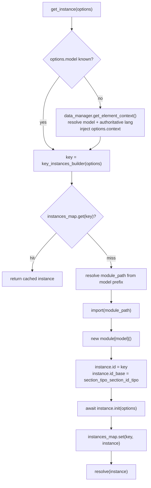
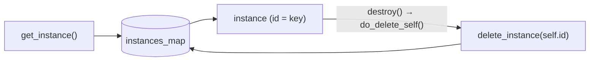

# Client instances

> The client-side **factory and registry** for every live Dédalo object (component, section, area, widget, service, tool). One canonical key, one in-memory `Map`, one async entry point: `get_instance()`.

> See also: [Components](../components/index.md) · [Sections](../sections/index.md) · [Events](../events.md) · [RQO](../rqo.md)

## Role

`core/common/js/instances.js` is the **single source of truth for live client
objects**. The Dédalo browser client is a thin DOM builder over a server that
ships, for every element, a *ddo* (context + data). The client never invents
structure: it instantiates one JS class per element, feeds it the ddo, and
renders the standard DOM. Those live instances are not referenced ad-hoc by each
other — they all live in one module-private registry (`instances_map`), keyed by
a deterministic string, and are created/looked-up/destroyed exclusively through
the functions exported here.

This is the client analogue of the server's `component_common::get_instance()`
and `section::get_instance()` factories: same idea (resolve model → cache key →
reuse or build), expressed for the browser as an async ES-module factory.

!!! note "One factory, one registry, one key"
    Everything funnels through `get_instance(options)`. The cache key is built by
    `key_instances_builder(options)` and becomes the instance's `id`. There is
    no second way to mint an instance id — keep options consistent and the key
    is consistent.

## Key concepts

### The canonical key

A key is the non-empty `options` values joined with `_`, visited in the fixed
`key_order` sequence:

```js
const key_order = ['model','tipo','section_tipo','section_id','mode','lang','parent','matrix_id','id_variant','column_id'];
```

`undefined` / `null` / `''` values are skipped so they never create spurious
underscore segments. The resulting string is identical to the `id` that
`get_instance` assigns to each new instance, e.g.:

```text
component_input_text_oh15_oh1_42_edit_lg-eng
```

!!! warning "key_order is part of the contract"
    Reordering `key_order` silently invalidates every cached-key comparison in
    the codebase. Treat any change as breaking.

### Reuse vs. build

`get_instance` is async, but the common case is synchronous-fast: when the
caller already knows `model`, no network call is made, the key is built, and a
**cache hit returns the existing instance immediately** — no dynamic import, no
`init`. Only on a cache miss does the factory go to work (resolve model, import
module, construct, `init`, register).

### Registry, not graph

Instances do **not** hold direct references to each other for discovery. They
publish/subscribe through the [event bus](../events.md) and are found through the
registry helpers below. A parent (e.g. a section) does keep its children in
`self.ar_instances` for ordered teardown, and each child keeps a back-pointer in
`self.caller` — but lookups by identity go through `instances_map`.

## The factory: `get_instance(options)`



The miss path resolves the module path **from the model's naming prefix**
(inlined here, not delegated to `utils/util.js`, to avoid a circular import):

| model prefix | module path |
| --- | --- |
| `tool_*` | `DEDALO_TOOLS_URLS[model]/js/<model>.js` (absolute, additional-root tools) or `../../../tools/<model>/js/<model>.js` (primary root) |
| `service_*` | `../../../core/services/<model>/js/<model>.js` |
| *default* | `../../../core/<model>/js/<model>.js` |

!!! info "The module export must match the model exactly"
    `get_instance` does `new module[model]()`. The ES module **must** export a
    function named exactly like the model (e.g. `component_input_text`). If it
    does not, the import succeeds but the module is unusable and the factory
    resolves to `null` with a console warning.

`get_instance` returns `Promise<Object|null>`. It resolves to `null` (and logs)
when `tipo` is absent and `model` cannot be resolved, when the element-context
API returns no model, when the module cannot be imported, or when the export
does not match the model name.

## Exported API

All in `core/common/js/instances.js`:

| export | sync? | purpose |
| --- | --- | --- |
| `get_instance(options)` | async | Primary factory / cache accessor (build-or-reuse). |
| `key_instances_builder(options)` | ✓ | Build the canonical underscore key from options in `key_order` sequence. |
| `get_instance_by_id(key)` | ✓ | Direct key lookup; returns the instance or `null`. Also on `window.get_instance_by_id` for iframes/inline scripts. |
| `find_instances(options)` | ✓ | Linear O(n) scan matching the five fixed props `tipo`, `section_tipo`, `section_id`, `mode`, `lang`. |
| `get_all_instances()` | ✓ | Shallow-copy array of every registered instance. |
| `get_instances_custom_map(custom_key_builder)` | ✓ | New `Map` re-keyed by a caller-supplied function (falsy key → entry skipped). |
| `add_instance(key, instance)` | ✓ | Manually register a pre-built instance (tests / synthetic wrappers). |
| `delete_instance(key)` | ✓ | Remove one entry by key; returns `true` when it existed. No-ops with a warning on empty key. |
| `delete_instances(options)` | ✓ | Bulk-remove every entry matching all `options` props (a `null`/`undefined` expected value is a wildcard). Rejects empty `options` to prevent wholesale wipe. Returns the count removed. |

!!! note "`find_instances` checks exactly five properties"
    It does **not** match on `model`, `parent`, `matrix_id`, `id_variant` or
    `column_id`. When those discriminate, build the full key and use
    `get_instance_by_id` instead.

## Lifecycle and destruction

`get_instance` is the only birth path; **destruction is driven by
`common.prototype.destroy`** (in `core/common/js/common.js`), which delegates to
the internal `do_delete_self(self)`. That teardown, in order:

1. Unsubscribes every token in `self.events_tokens` (reverse-iterated for safe splicing).
2. Destroys `self.paginator` if present.
3. Destroys all `self.services` in parallel (`Promise.all`).
4. Destroys `self.inspector` if present.
5. Destroys `self.filter` if present.
6. Removes the instance from the registry via `delete_instance(self.id)`.
7. Splices itself out of `self.caller.ar_instances` (no stale parent reference).
8. Nulls heavy references (`context`, `data`, `datum`, `ar_instances`, `events_tokens`, `caller`, `request_config`) to release closures.

Because `self.id` *is* the `instances_map` key, step 6 is just
`delete_instance(self.id)`. Tearing down a section cascades `destroy` to all its
`ar_instances`, keeping both the registry and the [event bus](../events.md)
leak-free.



## Worked example

### Importing

```js
import {get_instance} from '../../common/js/instances.js'
```

### Build or reuse a component

```js
// Programmatic instantiation: model is known, so no element-context API call.
const input = await get_instance({
    model        : 'component_input_text',
    tipo         : 'oh15',
    section_tipo : 'oh1',
    section_id   : '42',
    mode         : 'edit',
    lang         : 'lg-eng'
})

// input.id === 'component_input_text_oh15_oh1_42_edit_lg-eng'
// A second call with the same options returns the very same object (cache hit).
const same = await get_instance({
    model        : 'component_input_text',
    tipo         : 'oh15',
    section_tipo : 'oh1',
    section_id   : '42',
    mode         : 'edit',
    lang         : 'lg-eng'
})
// same === input  → true
```

### Build by tipo only (model resolved by the server)

```js
// model omitted: get_instance calls data_manager.get_element_context to learn
// the model and the authoritative lang, and injects options.context to avoid a
// second round-trip during init().
const element = await get_instance({
    tipo         : 'oh15',
    section_tipo : 'oh1',
    section_id   : '42',
    mode         : 'edit'
})
```

### How a section composes its children

A section reads its `ddo_map` / `columns_map` and calls `get_instance` per child,
passing itself as `caller` so the child registers a back-pointer and the section
keeps it in `ar_instances` for ordered teardown:

```js
const child = await get_instance({
    model        : column.model,
    tipo         : column.tipo,
    section_tipo : self.section_tipo,
    section_id   : self.section_id,
    mode         : self.mode,
    lang         : self.lang,
    caller       : self            // owning section instance
})
self.ar_instances.push(child)
```

### Lookup, scan and teardown

```js
import {
    get_instance_by_id,
    find_instances,
    delete_instances
} from '../../common/js/instances.js'

// direct lookup by the key stored on a DOM node
const found = get_instance_by_id(node.dataset.instanceId)

// linear scan by the five fixed props
const edits = find_instances({
    tipo         : 'oh15',
    section_tipo : 'oh1',
    section_id   : '42',
    mode         : 'edit',
    lang         : 'lg-eng'
})

// bulk-remove every registry entry for one section_id (wildcards on omitted props)
const removed = delete_instances({ section_tipo:'oh1', section_id:'42' })
```

!!! warning "Prefer `destroy()` over raw `delete_instance`"
    `delete_instance` / `delete_instances` only drop the registry entry. They do
    **not** unsubscribe events, tear down paginator/inspector/filter/services,
    or null heavy references. To fully release an instance, call its
    `destroy()` (which runs `do_delete_self`). Use the raw removers only for
    registry hygiene when you know the instance has already been torn down.

## Related

- [Components](../components/index.md) — client instantiation of components via `get_instance`, ddo (context + data), permissions.
- [Sections](../sections/index.md) — the section composes its child components and owns their teardown through `ar_instances`.
- [Events](../events.md) — the `event_manager` bus; instances subscribe/publish instead of referencing each other, tokens stored in `events_tokens`.
- [RQO](../rqo.md) — the request format `get_instance`'s build path issues through `data_manager` (e.g. `get_element_context`).
- [Request config](../request_config.md) — the configuration the server ships in the ddo `context` that instances consume.
