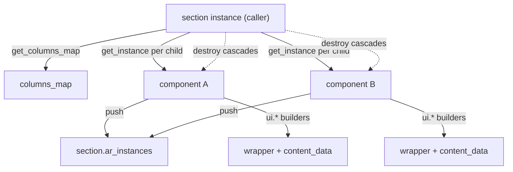

# Client lifecycle

> The end-to-end browser-client journey of a Dédalo UI element — page bootstrap → build instance → request data → render DOM → wire events → user edits → save → refresh/destroy — and how the four client cornerstones (`instances.js`, `data_manager.js`, the render layer, `event_manager.js`) compose to deliver it.

> See also: [RQO](../rqo.md) · [section_list](../sections/section_list.md) · [Components](../components/index.md) · [Events](../events.md) · [UI building blocks](../ui/index.md) · [api](../system/api.md)

This page is the **integration reference** for the client. The four cornerstone
modules each have their own behavior (factory/registry, transport, render,
bus); this document ties them together into the **one lifecycle** every
component, section, area, widget, service and tool follows, and then walks
through editing a single field end to end.

## Role

The Dédalo client is a **thin DOM builder over a server that is the single
source of truth**. The browser never invents structure: for every element the
server ships a **ddo** (Dédalo data object) — a `context` (model, label, view,
permissions, properties, tools, request_config, css, ddo_map) plus `data` (the
record values). The client instantiates one JS class per element, feeds it the
ddo, and renders the standard three-layer DOM.

Three singletons make this work, and every interaction flows through exactly
one of them:

| concern | singleton | file |
| --- | --- | --- |
| **transport** — all server traffic | `data_manager` | `core/common/js/data_manager.js` |
| **bus** — all inter-module messages | `event_manager` | `core/common/js/event_manager.js` |
| **registry** — all live objects | `instances_map` (via `get_instance`) | `core/common/js/instances.js` |

The shared object machinery (`init` / `build` / `render` / `refresh` /
`destroy`, RQO construction, context wiring) lives in `common.js` and is
specialised per model (`component_common.js`, `section.js`, `area_*`, …).

!!! note "Reading order"
    If you only read one other page first, read [RQO](../rqo.md) — it defines
    the request envelope (`{action, source, sqo|data}`) that the *request* and
    *save* steps below assemble. For how a section composes its children into a
    list, read [section_list](../sections/section_list.md).

## The lifecycle in one sequence

The status field on every instance walks a fixed machine:

```text
initializing → initialized → building → built → rendering → rendered → destroyed
```

driven by the methods `init → build → render → (events) → refresh → destroy`.

```mermaid
sequenceDiagram
    autonumber
    participant DOM as #main (page/index.js)
    participant INST as get_instance (instances.js)
    participant DM as data_manager
    participant API as api/v1/json
    participant REN as render layer (common.render + ui.*)
    participant EM as event_manager

    DOM->>INST: get_instance({model:'page'})
    INST->>INST: key_instances_builder → instances_map
    INST->>INST: new page(); init(options)
    DOM->>INST: page_instance.build(true)
    INST->>DM: request({body: start RQO})
    DM->>API: POST (X-Dedalo-Csrf-Token)
    API-->>DM: {result:{context,data}}, csrf_token
    DM-->>INST: ddo
    INST->>EM: publish built_<id>
    DOM->>REN: page_instance.render()
    REN->>REN: self.edit()/list() → ui.* builders
    REN->>EM: publish render_<id>
    REN-->>DOM: wrapper node (replaces "Starting…")
    Note over INST,EM: section composes children via get_instance per component
    EM->>EM: user edits → change_value → save RQO
    EM->>REN: refresh (content level) / destroy
```

## Step by step

### 1. Page bootstrap

`core/page/js/index.js` is the first module evaluated. Its async IIFE:

1. Initialises `window.page_globals` (with `api_errors: []`,
   `request_message: null`, `csrf_token: null`), `window.get_label`, and debug
   flags.
2. Calls `events_init()` (from `events.js`) to attach application-level
   listeners (save, `visibilitychange`).
3. Injects a `Starting.. Please wait.` placeholder into `#main`.
4. `await get_instance({model:'page'})` — first call dynamically imports
   `page.js` and constructs the singleton.
5. `await page_instance.build(true)` — fires the `start` API action that
   authenticates the session and downloads the application context.
6. `await page_instance.render()` — produces the full shell, then swaps the
   placeholder for the rendered node and removes the `hide` class.

The very first `start` request goes out **without** a CSRF header (the server
exempts `start`); every subsequent request carries
`X-Dedalo-Csrf-Token`, refreshed from each response (see
[step 3](#3-request-data-data_manager--rqo)).

### 2. Build the instance — `instances.js`

`get_instance(options)` is the unified async factory and the only correct way
to obtain a live element. It:

1. Resolves `model` / `lang`. If `options.model` is absent it calls
   `data_manager.get_element_context` and **injects the returned `context`**
   into `options` so `init`/`build` need no second context call; it also
   adopts the server's authoritative `lang`.
2. Builds the canonical key via `key_instances_builder`, which joins non-empty
   values in the fixed `key_order` sequence:
   `model, tipo, section_tipo, section_id, mode, lang, parent, matrix_id, id_variant, column_id`.
3. Returns the cached entry from the module-private `instances_map` on a hit.
4. On a miss, dynamically `import()`s the ES module from a model-prefix-derived
   path — `tool_*` → tools root (or a `DEDALO_TOOLS_URLS` absolute URL),
   `service_*` → `core/services/<model>/js/<model>.js`, else
   `core/<model>/js/<model>.js`. It `new`-constructs the export **named exactly
   like the model**, sets `instance.id = key` and
   `instance.id_base = [section_tipo, section_id, tipo].join('_')`, `await`s
   `instance.init(options)`, registers it in `instances_map`, then resolves.

`common.init` (in `common.js`) seeds the baseline properties from options
(`model` / `tipo` / `section_tipo` / `section_id` / `mode` / `lang` /
`context` / `data` / `datum`), plus empty `events_tokens` and `ar_instances`,
the `caller` pointer, and `standalone` (default `true`); status goes
`initializing → initialized`.

Synchronous registry helpers: `get_all_instances`, `get_instances_custom_map`,
`add_instance`, `get_instance_by_id` (also on `window` for iframes),
`find_instances` (linear scan on tipo/section_tipo/section_id/mode/lang),
`delete_instance(key)`, `delete_instances(options)` (wildcard bulk removal).

### 3. Request data — `data_manager` + RQO

`build` hydrates the instance. When `autoload === true`,
`component_common.build` assembles an RQO and calls the transport:

```js
const rqo = {
    source : create_source(self, 'get_data'),
    action : 'read'
}
const api_response = await data_manager.request({ body: rqo })
```

When the caller (a `section_record`, a portal, …) injects context/data,
`autoload` is `false` and no request is made.

`create_source(self, action)` (in `common.js`) builds the
`{typo:'source', type, action, model, tipo, section_tipo, section_id, mode, view, lang}`
descriptor; `build_rqo_show` clones the request_config, attaches the source,
resolves the `sqo` (pagination + an auto `filter_by_locators` from
section_tipo/section_id) into `{action:'read', source, sqo}`; `build_rqo_search`
walks the `ddo_map` (`get_ar_inverted_paths`) into a `filter_free`. See
[RQO](../rqo.md) for the full envelope.

`data_manager.request(options)`:

- serializes `options.body` to JSON and attaches `X-Dedalo-Csrf-Token` from
  `page_globals.csrf_token` (without overwriting a caller-set header);
- injects `recovery_mode` from page_globals and resets
  `page_globals.api_errors` / `request_message`;
- dispatches through `_fetch_with_retry_and_timeout` (default **5 retries,
  500 ms base delay, 5 s timeout**) with exponential backoff and a per-attempt
  `AbortController`; a mid-attempt `check_server_health` probe cancels the abort
  when the server is alive-but-busy; only statuses
  `[408, 429, 500, 502, 503, 504]` are retried; progress surfaces through
  `render_msg_to_inspector`;
- refreshes `page_globals.csrf_token` from the response; non-fatal `errors`
  publish `api_response_errors`; fatal errors are recorded via
  `_record_api_error` for the page renderer.

A single transparent retry handles the bootstrap CSRF race (`csrf_failed`).

Specialised actions: `get_element_context` (with `prevent_lock:true`),
`resolve_model` (cached in `page_globals.models`),
`get_matrix_ontology_locator` (cached in `page_globals.ontology_info`),
`get_page_element`, and streaming via
`request_stream` / `request_fetch_stream` + `read_stream` (SSE / NDJSON,
readers tracked in `page_globals.stream_readers`).

!!! info "Local caching (IndexedDB)"
    `get_local_db` opens the `dedalo` DB (v11) with stores `rqo`, `context`,
    `status`, `data`, `ontology`, `pagination`. A request carrying
    `cache_handler:{handler:'localdb', id}` is short-circuit-read before the
    network and written back on idle. UI state (last selection from
    `activate`/`deactivate`, section_group collapse, stream PIDs) is persisted
    to the `status` store. `worker_data.js` is a minimal self-contained replica
    of `request` for an optional background Worker (currently deactivated in
    `request`).

After the response lands, `build` runs `set_context_vars(self)`, which wires
`view` / `properties` / `permissions` as getters/setters backed by
`self.context` (keeping the context object the single source of truth),
assembles `show_interface` (merging the component override over
`default_show_interface`), subscribes events, and publishes `built_<id>`.

### 4. Render — ddo to standard DOM

`common.prototype.render(options)` is the dispatcher. It:

1. **Guards** — renders `render_server_response_error` when
   `page_globals.api_errors` is non-empty; an `invalid context` error for a
   component with no context; a `no_access` span when `permissions < 1`.
2. **Status machine** with smart concurrency — `building` waits for
   `built_<id>` then re-calls; `rendering` joins the in-progress waiter for an
   identical request or queues the latest for a differing one (last-write-wins);
   `rendered` returns the existing node when the level matches.
3. **Delegates to the mode-named method** on the instance —
   `self.edit()` / `self.list()` / `self.search()` / `self.tm()`, falling back
   to `list` when no method matches.
4. Publishes `render_<id>` with the result node and, in edit mode, schedules
   `ui.activate_tooltips`.

`render_level` is `full` (build the whole wrapper into `self.node`,
`replaceWith` the old node) or `content` (regenerate only
`self.node.content_data` and splice it in — used by `refresh`).

Each mode method delegates to per-component render files
(`render_<mode>_<component>.js`) and view files (`view_<view>_<mode>.js`),
which use the `ui.*` builders to emit the standard three-layer DOM:

```text
wrapper_<type>  (classes: <model>, <tipo>, <section_tipo>_<tipo>, <mode>, view_<view>)
├── label
├── buttons_container        (only when permissions > 1)
├── filter / paginator       (optional)
└── content_data             (classes: content_data + type + context.css.content_data)
    └── content_value        (the actual editable/displayed value)
```

The wrapper is built by `ui.component.build_wrapper_edit` /
`build_wrapper_list` / `build_wrapper_mini` / `build_wrapper_search` (and
`ui.area/tool/widget.build_wrapper_edit`); `ui.component.build_content_data`
builds the `content_data` node; ontology CSS (`context.css`) is injected via
`set_element_css`. The wrapper keeps live pointers (`wrapper.label`,
`wrapper.content_data`) so `content`-level re-renders swap just the inner node.
`ui.create_dom_element` is the universal node factory (class / style / dataset /
inner_html / text_content with XSS-safe `text_node`); `ui.update_node_content`
clears and reinserts content; `ui.add_tools` materializes `instance.tools[]`
into the buttons container. See [UI building blocks](../ui/index.md).

### 5. Wire events — `event_manager`

A single `event_manager_class` instance (also `window.event_manager` for
iframes) keeps `eventMap` (event_name → `Set<callback>`) and `tokenMap`
(token → `{event_name, callback}`) for O(1) publish and unsubscribe.

- `subscribe(name, cb)` returns an opaque `event_N` token; `subscribe_once`
  self-unsubscribes before firing.
- `publish(name, data)` invokes callbacks **synchronously in insertion order**,
  returns the array of return values or `false` when there are no subscribers
  (callbacks are **not** try/caught).
- `unsubscribe(token)`, `clear_event`, `clear_all`, `event_exists`,
  `event_name_exists`, and counters round it out.

This is the **observer/observable model**: instances never reference each other;
they publish/subscribe. Lifecycle events are keyed by instance id —
`built_<id>`, `render_<id>`, `destroy_<id>`. Subscription tokens are stored in
`self.events_tokens` and unsubscribed in `do_delete_self`. Common application
events: `activate_component` / `deactivate_component` (from
`ui.component.activate`/`deactivate`), `change_value` / `update_value` /
`update_data`, `sync_data_<id_base_lang>` (TM/sibling refresh),
`change_search_element`, `api_response_errors`, and `notification` (driven by
`render_msg_to_inspector`). See [Events](../events.md).

### 6. User edits → save

When the user changes a value, the component calls
`component_common.change_value(options)`:

1. Queues overlapping calls (`status === 'changing'`) to avoid server
   concurrency; for a `remove` action it raises a confirm dialog.
2. Applies each `changed_data` item to the in-memory instance via
   `update_data_value`.
3. Calls `self.save(changed_data)`.
4. On success, resets `self.data.changed_data = []`, and (when not standalone)
   `update_datum(api_response.result)`.
5. Optionally `refresh`es, then publishes `sync_data_<id_base_lang>` (refresh
   sibling/TM DOM) and `update_value_<id_base>` (fire ontology-configured
   observers).

`component_common.save(new_changed_data)` is the persistence chokepoint:

```js
const data   = clone(self.data); data.changed_data = changed_data
const source = create_source(self, null)
const rqo    = { action: 'save', source: source, data: data }
const api_response = await data_manager.request({ use_worker:false, body:rqo })
```

It guards against double-saves (`self.saving`), skips when an `update` batch is
unchanged (`is_equal` against `db_data.entries`), toggles `saving` / `loading`
/ `error` / `save_success` classes on `self.node` for UI feedback, and on the
`not_logged` error subscribes to `login_successful` and retries the save. The
save RQO is the same `{action, source, data}` envelope described in
[RQO](../rqo.md).

### 7. Refresh / destroy

`refresh(options)` runs **destroy-dependencies → build → render at `content`
level** (optionally reusing an injected `tmp_api_response`), so the wrapper and
its DOM position survive while the inner value is regenerated.

`destroy(delete_self, delete_dependencies, remove_dom)`:

- unsubscribes every token in `self.events_tokens`;
- tears down paginator / services / inspector / filter;
- recursively destroys `ar_instances`;
- removes itself from `instances_map` (via `do_delete_self` →
  `delete_instance(self.id)`) and from `caller.ar_instances`;
- nulls heavy references and publishes `destroy_<id>`.

This keeps both the registry and the event bus leak-free.

## How a section composes its components

A **section composes its components on the client** by reading its
`request_config` / `ddo_map`, deriving columns with `get_columns_map`
(line / mosaic / default grouping plus the synthetic `ddinfo` column), and
calling `get_instance` per child component — passing the section as `caller`
and pushing each child into `section.ar_instances`. Children render their own
wrapper / content_data via the `ui.*` builders and append into the section DOM;
deferred placements (e.g. `component_filter` into the inspector) use
`ui.place_element`, which appends immediately when the target is `rendered` or
defers via a `render_<target.id>` subscription otherwise.

Tearing down the section cascades `destroy` to all `ar_instances`. See
[section_list](../sections/section_list.md) for the list-mode composition in
detail.



## Worked example: editing one `component_input_text`

A user is editing a record in section `rsc197`, and changes the *Summary*
field `rsc110` from `"old"` to `"new"`.

1. **The field already exists.** During the section's list/edit build,
   `get_instance({ model:'component_input_text', tipo:'rsc110', section_tipo:'rsc197', section_id:'1', mode:'edit', lang:'lg-eng' })`
   produced the instance with
   `id = component_input_text_rsc110_rsc197_1_edit_lg-eng` and
   `id_base = rsc197_1_rsc110`. Its `<input>` lives inside
   `content_data → content_value`.

2. **Focus → activate.** On focus, `ui.component.activate` publishes
   `activate_component`; the previously active component receives
   `deactivate_component`, validates, and saves itself if dirty. The bus is
   synchronous, so this completes before the user types.

3. **Blur → change_value.** On change, the component calls `change_value` with
   `changed_data: [{ action:'update', key:0, value:['new'], lang:'lg-eng' }]`.
   `update_data_value` writes `['new']` into `self.data` in memory.

4. **Save RQO.** `save` clones `self.data`, attaches `changed_data`, builds
   `source = create_source(self, null)` and the envelope
   `{ action:'save', source, data }`, and calls `data_manager.request`:

    ```json
    {
      "action": "save",
      "source": {
        "typo": "source",
        "type": "save",
        "model": "component_input_text",
        "tipo": "rsc110",
        "section_tipo": "rsc197",
        "section_id": "1",
        "mode": "edit",
        "lang": "lg-eng"
      },
      "data": {
        "tipo": "rsc110",
        "section_tipo": "rsc197",
        "section_id": "1",
        "lang": "lg-eng",
        "changed_data": [
          { "action": "update", "key": 0, "value": ["new"], "lang": "lg-eng" }
        ]
      }
    }
    ```

    The request carries `X-Dedalo-Csrf-Token`; the server validates
    permissions, persists through the section's `section_record`, returns
    `{ result: {...}, csrf_token: "…" }`, and the client refreshes
    `page_globals.csrf_token`. The `<input>` wrapper flashes `saving` then
    clears it.

5. **Propagate.** `change_value` resets `self.data.changed_data = []`, then
   publishes `sync_data_rsc197_1_rsc110_lg-eng` (sibling/TM DOM refresh) and
   `update_value_rsc197_1_rsc110` (any ontology-configured observer — e.g. an
   info component that recomputes — reacts here).

6. **No teardown.** Because nothing requested `refresh:true`, the wrapper stays
   in place; only the value and the live pointers changed. When the section is
   closed, its `destroy` cascade unsubscribes this component, removes
   `component_input_text_rsc110_rsc197_1_edit_lg-eng` from `instances_map`, and
   publishes `destroy_<id>`.

## Files & functions

| file | key symbols |
| --- | --- |
| `core/page/js/index.js` | bootstrap IIFE: `page_globals` init, `events_init`, `get_instance({model:'page'})`, `build(true)`, `render()` |
| `core/common/js/instances.js` | `get_instance`, `key_instances_builder`, `key_order`, `get_instance_by_id`, `find_instances`, `delete_instance`, `delete_instances`, `instances_map` |
| `core/common/js/common.js` | `init`, `build`, `set_context_vars`, `render`, `refresh`, `destroy`, `create_source`, `build_rqo_show`, `build_rqo_search`, `do_delete_self` |
| `core/component_common/js/component_common.js` | `init`, `build` / `do_build`, `change_value`, `save`, `update_data_value`, `save_unsaved_components` |
| `core/common/js/data_manager.js` | `request`, `_fetch_with_retry_and_timeout`, `check_server_health`, `get_element_context`, `resolve_model`, `get_matrix_ontology_locator`, `get_page_element`, `request_stream` / `request_fetch_stream` / `read_stream`, `get_local_db`, `_record_api_error` |
| `core/common/js/event_manager.js` | `event_manager_class`, `subscribe`, `subscribe_once`, `publish`, `unsubscribe`, `clear_event`, `clear_all`, `event_exists` |
| `core/common/js/render_common.js`, `core/common/js/ui.js` | render delegates and the `ui.*` builders (`create_dom_element`, `build_wrapper_*`, `build_content_data`, `add_tools`, `place_element`, `activate`/`deactivate`) |
| `core/common/js/worker_data.js` | self-contained `request` replica for the optional background Worker (deactivated in `request`) |

!!! warning "Always go through the three singletons"
    Do not `fetch` directly (use `data_manager.request`), do not hold direct
    references between instances (use `event_manager`), and do not `new` a
    component class yourself (use `get_instance`, so the canonical key,
    `id_base`, registry entry and event cleanup are all wired correctly).
    Bypassing any of these is the usual source of leaked subscriptions and
    duplicate instances.

## Related

- [RQO](../rqo.md) — the request envelope (`{action, source, sqo|data}`)
  assembled by the *request* and *save* steps.
- [section_list](../sections/section_list.md) — how a section composes its
  child components into a list on the client.
- [Components](../components/index.md) — the per-element classes, the ddo
  (`context` + `data`), and the standard DOM structure.
- [Events](../events.md) — the `event_manager` bus and the active application
  events.
- [UI building blocks](../ui/index.md) — the `ui.*` render builders the mode
  methods delegate to.
- [api](../system/api.md) — the server-side dispatcher that answers every
  `data_manager.request`.
