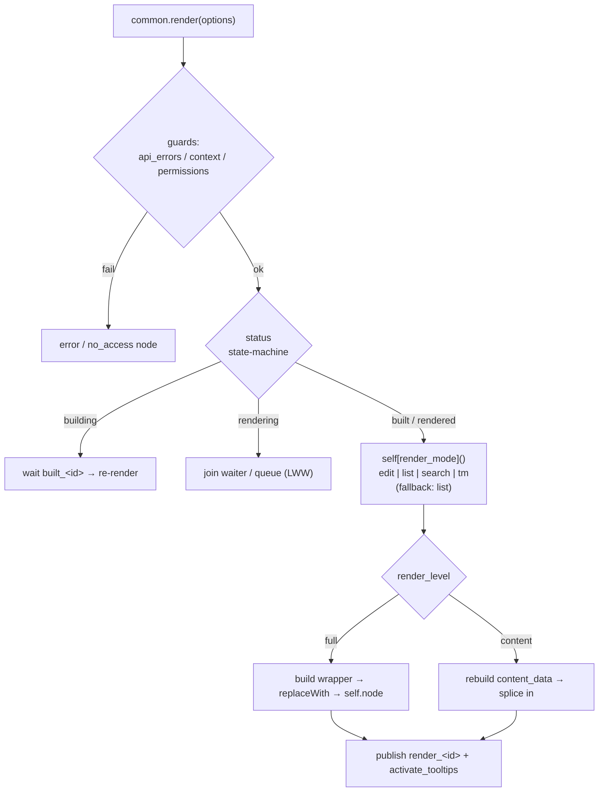

# Render and views

> How the Dédalo client turns a `{context, data}` datum (ddo) into the standard
> DOM: the `common.prototype.render` dispatcher, the per-mode / per-view render
> files, and the shared `ui.*` builders that emit the `wrapper → label →
> buttons_container → content_data → content_value → value` layers.

> See also: [Architecture overview](../architecture_overview.md) ·
> [Components](../components/index.md) · [UI building blocks](../ui/index.md) ·
> [Sections](../sections/index.md)

## Role

Dédalo's golden rule is **the server describes, the client draws**. For every
element the server ships a single **ddo** (datum) of shape `{context, data}`:
`context` is the *description* (model, label, view, permissions, properties,
css, tools, request_config, ddo_map) and `data` is the *values*. The render
layer is the client half that consumes that datum and produces the standard
three-layer DOM. It is **mode-** and **view-aware**: one shared dispatcher
(`common.prototype.render`) picks the right *mode* method on the instance
(`edit` / `list` / `search` / `tm`), which in turn picks the right *view*
builder (`default` / `line` / `mini` / `mosaic` / `text` / …) — and every node
is emitted through the shared `ui.*` factory so the class set and the structure
are identical across all components.

The browser never invents structure: it instantiates one JS class per element
(see [instances](../components/index.md#instantiation)), feeds it the ddo, and
renders the standard wrapper. The render code lives in three layers:

| layer | file pattern | role |
| --- | --- | --- |
| **dispatcher** | `core/common/js/common.js` (`common.prototype.render`) | guards, status state-machine, mode dispatch, DOM splice, lifecycle events |
| **mode / view** | `core/<model>/js/render_<mode>_<component>.js` + `view_<view>_<mode>_<component>.js` | per-component, per-mode, per-view DOM emitter |
| **builders** | `core/common/js/ui.js` (`ui.component.*`, `ui.area.*`, `ui.tool.*`, `ui.widget.*`, `ui.create_dom_element`, …) | the universal node factory and the wrapper/content_data builders |
| **shared utils** | `core/common/js/render_common.js` | cross-feature render helpers (errors, streams, component pickers) |

## The standard DOM

The standard hierarchy is the contract every component honours. In **edit**
mode, the `default` view emits the full tree:

```text
wrapper_component               ← ui.component.build_wrapper_edit
├── label                       ← built or custom (instance.label)
├── buttons_container           ← only when permissions > 1
│   └── buttons_fold            ← add/remove buttons + ui.add_tools(...)
└── content_data                ← ui.component.build_content_data
    └── content_value           ← one per data entry
        └── value (input/…)     ← the editable/displayed value
```

In **list** mode the same wrapper is far flatter — a read-only display node and
one `<span>` value per entry:

```text
wrapper_component   ← ui.component.build_wrapper_list
└── <span>value</span> [<span>value</span> …]
```

!!! note "These are the same nodes documented per-component"
    This is the client-side reality behind the abstract DOM trees in
    [Components → DOM structure](../components/index.md#dom-structure). The
    wrapper keeps **live pointers** (`wrapper.label`, `wrapper.content_data`) so
    a `content`-level re-render can swap just the inner node without rebuilding
    the wrapper.

### Standard CSS classes

Every wrapper carries an ontology-derived class set (built in
`ui.component.build_wrapper_edit` / `build_wrapper_list`):

```text
wrapper_<type>          e.g. wrapper_component
<model>                 e.g. component_input_text
<tipo>                  e.g. rsc26
<section_tipo>_<tipo>   e.g. oh1_rsc26
<mode>                  edit | list | search
view_<view>             view_default | view_line | view_mini | …
```

The `content_data` node carries `content_data`, the `<type>`, and any
`context.css.content_data` classes. Read-only components (`permissions < 2`)
also get `disabled_component`. **Ontology CSS** declared in `context.css` is not
inlined: it is registered as a rule under a selector keyed by
`<section_tipo>_<tipo>.<tipo>.<mode>` via `set_element_css`
(imported from `core/page/js/css.js`).

## The dispatcher — `common.prototype.render`

`common.prototype.render(options)` (in `core/common/js/common.js`) is the single
entry point for rendering any instance. It runs **before** any component-specific
code:

1. **Pre-render guards** (each short-circuits to an error/empty node):
    - `page_globals.api_errors` is non-empty → renders
      `render_server_response_error(...)` (full-page error panel).
    - `type === 'component'` and `context` is falsy → renders an
      `invalid context` error.
    - `permissions < 1` → renders a `<span class="no_access">` and returns.
2. **Status state-machine** (`building` / `built` / `rendering` / `rendered`)
   with *smart concurrency*:
    - `building` → waits for `built_<id>`, then re-calls `render(options)`.
    - `rendering` → an **identical** request (same `render_level` +
      `render_mode`) **joins** the in-progress waiter; a **different** request
      is queued (last-write-wins) and fires after the current render via the
      `render_<id>` event.
    - `rendered` → if `render_level` is unchanged, returns the existing node.
3. **Mode dispatch.** It calls the **mode-named method** on the instance —
   `self[render_mode](render_options)`, e.g. `self.edit()`, `self.list()`,
   `self.search()`, `self.tm()`. If no such method exists it **falls back to
   `list`** (`current_render_mode`).
4. **DOM splice by `render_level`:**
    - `full` (default) — the mode method returns the whole wrapper; if a prior
      `self.node` exists in the DOM it is swapped with `node.replaceWith(...)`,
      and `self.node` is updated.
    - `content` — only the inner node is rebuilt; the old `self.node.content_data`
      is `replaceWith`-ed and the `wrapper.content_data` pointer is updated. Used
      by `refresh()` to avoid a full teardown on data updates.
5. **Post-render.** Sets status `rendered`, publishes `render_<id>` with the
   result node, and — in `edit` mode — schedules `ui.activate_tooltips` via an
   idle callback.



## Modes and views

The dispatcher selects the **mode**; each mode method selects the **view**.

### Modes

A *mode* is a method named exactly like the value (`edit`, `list`, `search`,
`tm`). For components it is bound from a `render_<mode>_<component>.js` file; for
sections the bindings are explicit in `core/section/js/section.js`:

```js
// core/section/js/section.js
section.prototype.edit      = render_edit_section.edit
section.prototype.list      = render_list_section.list
section.prototype.tm        = render_list_section.list   // tm reuses list
section.prototype.activity  = render_list_section.list
```

A component's `render_<mode>` file is a thin **view switch** — it normalises a
default (`fields_separator`), reads `self.context.view`, and delegates to the
matching `view_*` builder. From `render_edit_component_input_text.js`:

```js
render_edit_component_input_text.prototype.edit = async function(options) {
    const self = this
    const view = self.context.view || 'default'
    switch(view) {
        case 'mini':        return view_mini_input_text.render(self, options)
        case 'text':        return view_text_input_text.render(self, options)
        case 'line':        return view_line_edit_input_text.render(self, options)
        case 'colorpicker': return view_colorpicker_edit_input_text.render(self, options)
        case 'print':       self.permissions = 1   // falls through to default, read-only
        case 'default':
        default:            return view_default_edit_input_text.render(self, options)
    }
}
```

### Views

A *view* is the visual variant of a mode, taken from `context.view`
(default `'default'`). Each view is a `view_<view>_<mode>_<component>.js` file
exposing a `render(self, options)`. Common views:

| view | typical use |
| --- | --- |
| `default` | the full wrapper + label + buttons + content_data |
| `line` | same as default but without a label (inline rows) |
| `mini` | a compact inline `<span>` badge (`ui.component.build_wrapper_mini`) — e.g. inside relation chips / autocomplete |
| `text` | a clean `<span>` value with no chrome |
| `mosaic` | grid/card layout (media, list mosaics) |
| `print` | reuses `default` but forces `permissions = 1` (read-only) |

!!! info "File nomenclature"
    `render_<mode>_<component>.js` = the mode switch;
    `view_<view>_<mode>_<component>.js` = the per-view emitter. See
    [Components → File nomenclature](../components/index.md#file-nomenclature).

## The `ui.*` builders

The render files never build raw DOM by hand. They go through `core/common/js/ui.js`.

### `ui.create_dom_element(options)` — the universal node factory

The most-called helper in the client. A flat options object → a fully configured
element, optionally appended to `parent` in the same call. Key options:
`element_type` (default `div`), `id`, `type`, `class_name`, `style`,
`dataset`/`data_set`, `value`, `title`/`title_label` (HTML stripped),
`inner_html`, `text_node`, `text_content`, `draggable`, `parent`.

Text-content precedence is `inner_html` > `text_node` > `text_content`.
`inner_html` is parsed as HTML (`insertAdjacentHTML`); `text_node` and
`text_content` are XSS-safe (`textContent`, never parsed). `ui.update_node_content(node, value)`
clears a node (`replaceChildren()`) and reinserts content.

### `ui.component.*` — the wrapper builders

| builder | mode | shape |
| --- | --- | --- |
| `build_wrapper_edit(instance, {label, top, buttons, content_data, list_body, add_styles})` | edit / search | full wrapper; appends `label`, then `buttons` **only when `permissions > 1`**, then async `filter`/`paginator` containers, then `content_data`; wires the `mousedown → ui.component.activate` listener |
| `build_wrapper_list(instance, {value_string, add_styles})` | list | flat read-only wrapper; optional pre-rendered `value_string` span |
| `build_wrapper_mini(instance, {value_string})` | mini | compact inline `<span class="mini <model>_mini">` |
| `build_wrapper_search(instance, {label, content_data})` | search | like edit but the label is prefixed with `>` per ddo-path depth and titled with the section-path chain; always adds `tooltip_toggle`; activation on `click` |
| `build_content_data(instance)` | any | the `content_data` `<div>` with classes `content_data` + `<type>` + `context.css.content_data` |
| `build_buttons_container(instance)` | edit | empty `<div class="buttons_container">` |
| `build_button_exit_edit(instance)` | edit | the close button that deactivates and `change_mode`s back to `list` |

There are sibling namespaces for non-component instances:
`ui.area.build_wrapper_edit` (top-level areas — label includes the lang
abbreviation, no activation events, supports `context.css.add_class`),
`ui.tool.build_wrapper_edit` (tool header + body) and `ui.widget.build_wrapper_edit`
(widgets hosted inside `component_info`).

### `ui.add_tools(self, buttons_container)`

Materialises `instance.tools[]` into the buttons container, one button per tool
(`ui.tool.build_component_tool_button` for components, else
`build_section_tool_button`), skipping any tool whose model equals the caller's
model (prevents a tool embedding itself), and wiring ontology-declared keyboard
shortcuts from `tool_context.properties.events`.

### `ui.place_element(options)` — deferred placement

Places a source node into a target instance's DOM. If the target is already
`rendered`, it appends/replaces immediately under `container_selector`; otherwise
it subscribes to `render_<target.id>` and places the node when the target's
wrapper is ready (the token is pushed to `source_instance.events_tokens` for
cleanup). Primary use: a `section_record` sends `component_filter` nodes into the
inspector panel, which may not be in the DOM yet.

## How a section composes its children

A section does not build its components' DOM itself — it **delegates** through
the instance factory. The flow (edit mode):

1. `section.edit` → `view_default_edit_section.render` resolves the record rows
   (`get_section_records`) and builds the section `content_data` wrapper.
2. Each `section_record` instance, when rendering, derives its columns from the
   section's `request_config`/`ddo_map` via `get_columns_map`
   (handling line/mosaic/default grouping and the synthetic `ddinfo` column).
3. For each column it calls `get_instance(instance_options)` with the section
   record as **caller** and pushes the returned child into the parent's
   `ar_instances`:

   ```javascript
   // core/section_record/js/section_record.js
   const current_instance = await get_instance(instance_options)  // caller: self
   // …
   self.ar_instances.push(current_instance)
   ```

4. Each child renders its own `wrapper / content_data / content_value` via the
   `ui.*` builders and is appended into the section DOM. Deferred placements
   (e.g. `component_filter` into the inspector) use `ui.place_element`.

Tearing down the section cascades `destroy` to every `ar_instances` entry, so the
registry (`instances_map`) and the [event bus](../events.md) stay leak-free. See
[section](../sections/section.md) and [section_record](../sections/section_record.md)
for the orchestration side.

## Worked example: an `input_text` ddo becomes DOM (edit, default)

Given a ddo for a single-line text field:

```json
{
    "context" : {
        "model"        : "component_input_text",
        "tipo"         : "oh14",
        "section_tipo" : "oh1",
        "label"        : "Title",
        "mode"         : "edit",
        "view"         : "default",
        "permissions"  : 2,
        "css"          : { ".wrapper_component": { "grid-column": "span 7" } }
    },
    "data" : {
        "value"   : [{ "lang": "lg-eng", "value": "Hello world" }],
        "entries" : [{ "id": 0, "lang": "lg-eng", "value": "Hello world" }]
    }
}
```

The render path:

1. `common.render()` passes the guards (`permissions = 2 ≥ 1`), dispatches to
   `self.edit()`.
2. `render_edit_component_input_text.edit` reads `context.view === 'default'`
   and calls `view_default_edit_input_text.render(self, options)`.
3. That view builds `content_data` (`ui.component.build_content_data`), one
   `content_value` per entry (`get_content_value` → an `input.input_value`
   carrying the value), the `buttons_container` (only because `permissions > 1`),
   then the wrapper (`ui.component.build_wrapper_edit`), and sets
   `wrapper.content_data = content_data`.

Resulting DOM:

```text
<div class="wrapper_component component_input_text oh14 oh1_oh14 edit view_default">
  <div class="label">Title</div>
  <div class="buttons_container">
    <div class="buttons_fold"><span class="button add"></span> … tools …</div>
  </div>
  <div class="content_data component">
    <div class="content_value">
      <input class="input_value" value="Hello world">
    </div>
  </div>
</div>
```

The ontology CSS (`context.css`) is registered as a rule for
`oh1_oh14.oh14.edit` via `set_element_css` — never inlined. A later
data edit triggers `render({render_level:'content'})`, which rebuilds only the
`content_data` node and splices it via `wrapper.content_data.replaceWith(...)`,
leaving the wrapper, label and buttons untouched.

The same ddo in **list** mode (`self.list()` →
`view_default_list_input_text.render`) collapses to:

```text
<div class="wrapper_component component_input_text oh14 oh1_oh14 list view_default">
  <span>Hello world</span>
</div>
```

## Shared render utilities — `render_common.js`

`core/common/js/render_common.js` collects cross-feature render helpers used by
search, `tool_export`, portals and the page shell (not the per-component views):

| export | purpose |
| --- | --- |
| `render_server_response_error(errors)` | full-page error panel from a server `errors` array (the dispatcher uses this for `page_globals.api_errors`); handles `not_logged`, `invalid_page_element` and generic `data_manager` cases |
| `render_stream(options)` | a live SSE/NDJSON progress panel (spinner + info + Stop), returning `update_info_node()` to drive on each chunk |
| `render_error(error)` | a standard inline error block (`wrapper_error` → `error_wrap` → type/msg/info) from a single error or array |
| `render_components_list(options)` | a draggable component/section-group picker for a section, with recursive portal/autocomplete drill-down |
| `render_lang_behavior_check(self)` | the "search in all languages" toggle for translatable search components; mutates `self.data.q_lang` and publishes `change_search_element` |

## Related

- [Architecture overview](../architecture_overview.md) — the
  server-describes / client-draws split and the `{context, data}` datum every
  render consumes.
- [Components](../components/index.md) — the field abstraction, the datum
  (`context`/`data`), and the per-component DOM structure these builders emit.
- [UI building blocks](../ui/index.md) — the surrounding chrome (page, menu,
  inspector, paginator, buttons, widgets, themes) that consumes the same datum.
- [Sections](../sections/index.md) · [section_record](../sections/section_record.md)
  — the composition side: how a section instances and lays out its children.
- [Events](../events.md) — the `event_manager` bus (`built_<id>`, `render_<id>`,
  `activate_component`, …) the render layer publishes and subscribes to.
- [Request config](../request_config.md) · [RQO](../rqo.md) · [SQO](../sqo.md)
  — the request/query objects that produce the ddo the render layer draws.
