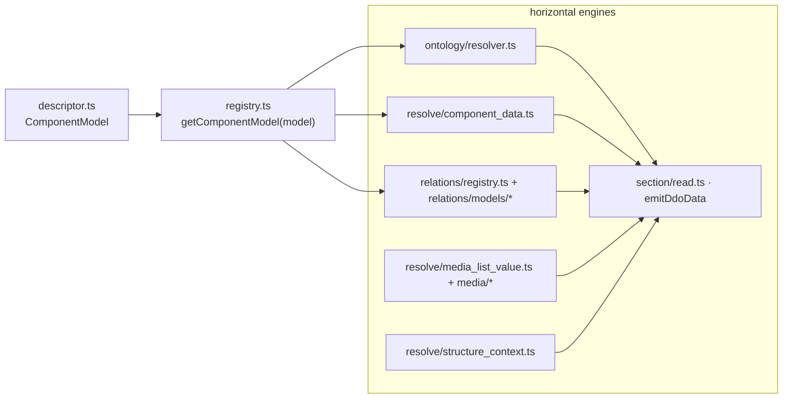

# Component model descriptors

In the PHP server, every Dédalo component was a small concrete class that
extended a shared base (`component_common` → `component_string_common` /
`component_media_common` / `component_relation_common` → the concrete class); the
bases held the logic and the concrete classes mostly added type-specific
constants and a handful of overrides.

The TS rewrite keeps the **concepts** but replaces the **mechanism**. There is no
class-per-model inheritance tree anymore. Behaviour is now **horizontal**: it
lives in shared engines (`src/core/resolve/`, `src/core/relations/`,
`src/core/search/`, `src/core/section/`) that dispatch on the `model` string, and
each model's per-model deltas live in one declarative **descriptor**. This
document explains the descriptor, the engines that read it, the literal / media /
related / info typologies, and how to add a **new** component model.

For the per-component contracts (modes, views, data/value shapes, default tools)
see the individual pages linked from the [components index](index.md).

## The resolution stack

Where PHP had a four-layer class chain, the TS server has a descriptor read by a
registry and consumed by horizontal engines:

```text
component_<model>/descriptor.ts     # what THIS model IS (small, declarative)
        │
        ▼
registry.ts  getComponentModel(model)   # collects all descriptors + boot integrity check
        │
        ▼
horizontal engines (dispatch on model)
  ├── ontology/resolver.ts        getColumnNameByModel · getModelByTipo (alias)
  ├── resolve/component_data.ts   data read + class-translation gate + string fallback
  ├── relations/registry.ts       getRelationResolver · search coverage
  ├── resolve/media_list_value.ts + media/  file discovery, qualities, URLs
  ├── resolve/structure_context.ts context (label, properties, css, permissions, view)
  └── section/read.ts  emitDdoData orchestrates all of the above per ddo_map element
```



!!! note "Reading the diagram"
    The old class layers survive only as **conventions in the descriptor**. A
    string model sets `classSupportsTranslation: true`; a media model sets
    `column: 'media'`; a related model sets `column: 'relation'` and names a
    `resolveData` resolver. The two related models that in PHP extended a sibling
    rather than the common base are just descriptors with their own resolver:
    `component_filter_master` reuses the filter resolver and
    `component_dataframe` reuses the portal resolver.

---

## Layer 1 — the descriptor (`ComponentModel`)

`src/core/components/types.ts` defines the descriptor interface. It is
**declarative**: it holds only the fields the engines actually read and links out
(via file comments) to the modules that carry heavier behaviour. It must never
grow inline logic, or it rots into a god-registry
(`src/core/components/README.md`).

| Field | Meaning | Consumed by |
| --- | --- | --- |
| `model` | canonical model name (identity + file name) | the registry key |
| `column` | matrix jsonb column storing this model's data (`string`, `number`, `date`, `iri`, `geo`, `media`, `relation`, `misc`) | `getColumnNameByModel` |
| `alias` | obsolete v5/v6 stored model name → canonical runtime model | `getModelByTipo` |
| `classSupportsTranslation` | CLASS-level translation gate (independent of the ontology `translatable` flag) | `resolve/component_data.ts` |
| `resolveData` | the relation resolver (relation-column models only) | `getRelationResolver` |
| `search` | relation search coverage `{status:'ported'\|'unported', reason?}` | the search dispatcher |

A minimal literal descriptor is three lines:

```ts
export const component_input_text: ComponentModel = {
    model: 'component_input_text',
    column: 'string',
    classSupportsTranslation: true,
};
```

A relation descriptor names its resolver and search face:

```ts
export const component_portal: ComponentModel = {
    model: 'component_portal',
    column: 'relation',
    resolveData: portalResolver,        // relations/models/portal.ts
    search: { status: 'ported' },
};
```

An alias descriptor carries no behaviour of its own — it points at the canonical
model that stores the data:

```ts
export const component_autocomplete: ComponentModel = {
    model: 'component_autocomplete',
    alias: 'component_portal',          // legacy name → portal
};
```

---

## Layer 2 — the registry

`src/core/components/registry.ts` imports every `component_<model>/descriptor.ts`
into `ALL_DESCRIPTORS` and builds a `model → descriptor` map. It runs a
**load-time integrity check**: it throws at boot on a duplicate model, on an
alias pointing at an unknown model, or on an alias whose target stores no data
(no `column`). What used to be scattered runtime surprises is now a boot-time
guarantee. `getComponentModel(model)` is the single accessor; equivalence against
the old PHP lookup tables is pinned by
`test/unit/component_registry.test.ts`.

Adding a component model is: add its `component_<model>/descriptor.ts` and one
array line here — **nothing else in the engines changes**.

---

## Layer 3 — the engines

Three engine paths specialize the generic datum flow for the three families that
in PHP had an intermediate base. They read the descriptor and dispatch; the
per-model particularities live in the linked-out modules, not in the descriptor.

### The literal / string path

Literal models store a final value in their descriptor's `column` and are read by
`readComponentItems()` (`src/core/resolve/component_data.ts`), which slices the
item array stored under the component's `tipo`.

The string family — `component_input_text`, `component_text_area`,
`component_email`, `component_password` (all `column: 'string'`) and
`component_iri` (`column: 'iri'`) — set `classSupportsTranslation: true`. That
flag is the class gate: only these lang-filter their items on read (PHP
`component_common::supports_translation`, deliberately independent of the ontology
`translatable` flag). `resolveComponentValue()` implements the language **fallback
chain** for them: requested lang → install main lang → `lg-nolan` → every other
project lang, first non-empty wins (`component_iri` opts out of the fallback
machinery and emits an empty array instead).

!!! warning "String hardening / truncation not re-asserted in TS"
    The PHP string base also carried stored-XSS `sanitize_text` (SEC-034) and the
    `truncate_text` / `truncate_html` display helpers. The TS server's string
    path currently ports the **language fallback** only; a dedicated stored-XSS
    sanitize on the save path is not in evidence in `src/core/section/record/`.
    Treat client-side rendering safety and truncation as not-yet-ported here
    (verify against STATUS.md before relying on them server-side).

Other literal models (`component_number` → `number`, `component_date` → `date`,
`component_geolocation` → `geo`, `component_json` → `misc`,
`component_security_access` / `component_filter_records` → `misc`,
`component_section_id` — no column, synthesized from the record's own id) manage a
final value without the string helpers, so their descriptor omits
`classSupportsTranslation`.

### The media path

The five media models — `component_image`, `component_av`, `component_3d`,
`component_pdf`, `component_svg` — all set `column: 'media'`. Binary is **never**
stored in the matrix: the `media` column holds a thin JSON pointer, and the files
live on disk. The media engine resolves them:

- `resolve/media_list_value.ts` — `isMediaModel()` gates the media branch;
  `getMediaListValue()` projects the LIST-mode value (list qualities only).
- `media/files_info.ts` `scanFilesInfo()` — live per-quality/extension file
  discovery (PHP re-scanned the disk on every read; the stored copy is a cache,
  which matters for `component_av`, whose derivatives finish transcoding
  asynchronously).
- `media/path.ts` — deterministic identifier/URL construction
  (`{component_tipo}_{section_tipo}_{section_id}` + quality bucket).
- `section/read.ts` (`emitDdoData` media branch) attaches the mode-specific
  envelope: EDIT/viewer modes ship the full stored items plus image
  `external_source` / `base_svg_url`, AV/3D carry `posterframe_url` (and AV its
  `subtitles` descriptor in edit mode).

Access to the files is enforced fail-closed by the web server via
`media_protection`; the auth-cookie and `.publication/` marker rules are
maintained by the Bun `diffusion/api/v1/lib/media_index.ts` (see the
media-protection skill / MEDIA_SPEC.md).

### The relation path

Everything that stores **locators** instead of a literal value sets
`column: 'relation'` and names a `resolveData` resolver.
`relations/registry.ts` `getRelationResolver(model)` returns it (and throws
loudly for a relation-column model with no resolver — an uncovered-scope guard).
The resolvers live in `src/core/relations/models/`:

| Resolver (`relations/models/`) | Models it serves |
| --- | --- |
| `portal.ts` `portalResolver` | `component_portal`, `component_relation_parent`, `component_dataframe`, `component_external`, `component_autocomplete_hi` |
| `portal.ts` `filterResolver` | `component_filter`, `component_filter_master` |
| `select_family.ts` `selectFamilyResolver` | `component_select`, `component_select_lang`, `component_check_box`, `component_radio_button` |
| `relation_children.ts` | `component_relation_children` |
| `relation_index.ts` | `component_relation_index` |
| `relation_related.ts` | `component_relation_related` |

The descriptor also carries the model's **search coverage**. Relation-column
search dispatches through `relations/registry.ts`; a model whose PHP search is a
dedicated, not-yet-ported pipeline is marked `search: { status: 'unported',
reason }` and makes the search dispatcher **throw its ledgered reason** rather
than silently mis-search. The most locator-relevant unported cases:
`component_external` (`reason: 'remote external data is not searchable (no PHP
trait)'`) and the relation_children search pipeline (see STATUS.md). The generic
relation fragment builder is `search/builders/builder_relation.ts`.

A relation resolver's distinctive logic is **not** in the descriptor — the
descriptor points to it. `component_relation_parent` reuses `portalResolver` for
row emission (a parent cell renders like any relation cell) and its
hierarchy/ancestor-walk/sibling-order behaviour lives in `relations/parent.ts` and
`relations/dataframe.ts`, signposted by a comment in the descriptor.

### The context and save paths (shared by all)

- `resolve/structure_context.ts` builds each element's context
  (`StructureContextEntry`): label, model, `translatable`, `properties`, `css`,
  view, plus the per-request stamp (permissions, parent, lang), cached by
  `tipo_sectionTipo_mode`. Tools/buttons are deferred in the current server
  (emitted as `tools: []`).
- Saving flows through the section record
  (`src/core/section/record/save_component.ts`) — a component never touches the
  database directly; the section persists its column + counter. Server-side
  observers recompute from `resolve/observers.ts` (partial, ledgered coverage).

---

## The four typologies

| Typology | Descriptor shape | Stores | Value comes from | Examples |
| --- | --- | --- | --- | --- |
| **Literal (direct)** | `column: 'string'\|'number'\|'date'\|'iri'\|'geo'\|'misc'` (+ `classSupportsTranslation` for the string family) | a final literal value | itself | input_text, number, date, iri, json |
| **Media** | `column: 'media'` | a file pointer in `media` | files on disk | image, av, 3d, pdf, svg |
| **Related** | `column: 'relation'` + `resolveData` + `search` | locators in `relation` | the **target** record | portal, select, check_box, dataframe |
| **Info** | `column: 'misc'` | a computed literal | other components, then saved | info, inverse |

Info models are literal at rest: they need other components to *calculate* their
value, but the result is stored and read like any literal (`column: 'misc'`), so
they carry no resolver.

See the [components index](index.md#typologies-of-components) for the full prose
description of the literal / media / related / info typologies.

Permission is an integer giving the access level for a component instance:

| Permission | Level |
| --- | --- |
| 0 | no access |
| 1 | read only |
| 2 | read and write |
| 3 | read, write and admin |

The per-element ACL derivation is not yet fully wired in the TS server (see
[permissions in the index](index.md#permissions) and STATUS.md).

---

## Decision guide — writing a new component model

Work top-down and stop at the first match. In every case the whole change is one
`component_<model>/descriptor.ts` plus one line in `registry.ts` — no engine is
touched.

1. **Does it store locators pointing at other sections/components?**
   → `column: 'relation'`, name a `resolveData` resolver (reuse `portalResolver`
   or `selectFamilyResolver` if row emission matches, or add a new resolver in
   `relations/models/`), and declare its `search` coverage. Locator
   normalization/validation, the relations bag slicing, directionality and
   dataframe cascade all live in the relations engine, not in your descriptor.

2. **Does it manage files on disk (binary media)?**
   → `column: 'media'`. The media engine
   (`resolve/media_list_value.ts` + `media/`) handles file discovery, qualities,
   URLs, naming and access control; the model's type-specific constants /
   conversion specifics live in the media modules (`concepts/media.ts` and the
   media pipeline), not in the descriptor.

3. **Is it a single- or multi-line text/string value (translatable, wants the
   language fallback)?**
   → `column: 'string'`, `classSupportsTranslation: true`. You inherit the
   language fallback chain in `resolve/component_data.ts` for free.

4. **None of the above** — a literal value with its own format (numbers, dates,
   IRIs, JSON, geolocation, computed/info values, ids):
   → pick the matching `column` (`number`, `date`, `iri`, `geo`, `misc`) and omit
   `classSupportsTranslation`. Any format-specific reading lives in the engine
   path for that column (e.g. the `search/builders/builder_<type>.ts` fragment),
   not in the descriptor.

!!! tip "Keep descriptors declarative"
    A descriptor holds small data and REFERENCES behaviour. If you find yourself
    wanting to put datum load/save, permissions, request_config or search logic
    *into* the descriptor, put it in the relevant engine instead and point at it
    with a comment — otherwise the registry rots into the god-object the rewrite
    was designed to remove.

!!! warning "The registry is the source of truth"
    Every model must be registered and pass the boot-time integrity check.
    Adding a descriptor without registering it (or aliasing a model that stores
    no data) fails at import, not at request time.

---

## Related documentation

- [Introduction to components](index.md) — file nomenclature, model resolution,
  datum, context, data, permissions, observers/observables.
- [Locators](../locator.md) — the locator object used by related components.
- `src/core/components/README.md` — the per-model home layout and the
  descriptor-is-declarative discipline.
- Per-component pages: [input_text](component_input_text.md),
  [text_area](component_text_area.md), [email](component_email.md),
  [image](component_image.md), [av](component_av.md), [3d](component_3d.md),
  [pdf](component_pdf.md), [svg](component_svg.md),
  [portal](component_portal.md), [check_box](component_check_box.md),
  [dataframe](component_dataframe.md), [info](component_info.md),
  [inverse](component_inverse.md).
