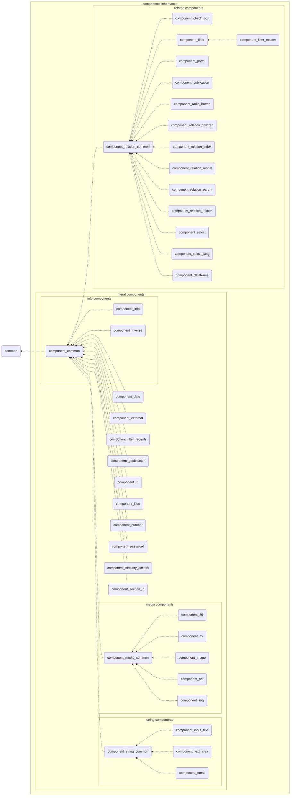

# Component base classes

Every Dédalo component is a small concrete class that extends a shared base. The
bases hold the logic; the concrete classes (`component_input_text`,
`component_image`, `component_portal`, …) mostly add type-specific constants and
a handful of overrides. This document explains the class hierarchy, what each
layer contributes, the literal / media / related / info typologies, and how to
decide which base a **new** component should extend.

For the per-component contracts (modes, views, data/value shapes, default tools)
see the individual pages linked from the [components index](index.md).

## The inheritance chain

The chain is four layers deep:

```text
common
 └── component_common                (abstract)
      ├── component_string_common     (literal / string)
      ├── component_media_common      (abstract, media)
      ├── component_relation_common   (related / locators)
      └── (direct subclasses)         (other literal + info)
```

In server context, component classes inherit from common classes depending on
the component typology. The root is `common`; the main component base is
`component_common`; and some families share an intermediate base such as
`component_media_common` or `component_relation_common`.



!!! note "`component_email` extends the string base"
    Although the components index groups `component_email` with the direct
    literal components, in code `component_email` extends
    `component_string_common` (alongside `component_input_text` and
    `component_text_area`). See `component_string_common::get_string_components()`.

---

## Layer 1 — `common`

`abstract class common` (`core/common/class.common.php`) is the root of every
`dd_object` in Dédalo, not just components. It provides the cross-cutting
machinery that components, sections, areas and tools all share:

- **Ontology accessors** — `get_model()`, `get_properties()`, `get_css()` and
  the `request_config` layer (the `request_config_utils` / `request_config_ddo`
  / `request_config_v6` / `request_config_v5` traits used via `use`). The
  `request_config_ddo` map processor stamps `ddo->properties`, applies
  permission drops and emits `config_warnings`. `get_request_config_object()`
  returns the parsed `request_config_object`. v5 is the default builder.
- **Permissions seed** — `common::get_permissions(?parent_tipo, ?tipo)` returns
  the base integer level (`0` when not logged in). Components layer their
  special cases on top of this (see `get_component_permissions()` below).
- **Tools** — `get_tools()` returns the default tools exposed in the datum
  `context` toolbar; nested tools/buttons are read-only context.
- **Context cache helpers** — `context_key()` (dedup identity = tipo +
  section_tipo + mode), `merge_unique_context()`, and `manage_cache_size()`
  (`MAX_CACHE_SIZE = 1000`) protect the persistent-worker statics from growing
  unbounded; the static caches are cleared in `common::clear()`.

Anything truly universal to all ontology-backed objects lives here. A component
base should never re-implement what `common` already offers.

---

## Layer 2 — `component_common`

`abstract class component_common extends common`
(`core/component_common/class.component_common.php`) is **the** component base.
It defines the full datum lifecycle that every component shares. Concrete
components are never `new`-ed directly — they are built through the factory.

### Instantiation & lifecycle

```php
final public static function get_instance(
    ?string $component_name = null,
    ?string $tipo           = null,            // mandatory, validated with safe_tipo()
    mixed   $section_id     = null,
    string  $mode           = 'edit',
    string  $lang           = DEDALO_DATA_LANG,
    ?string $section_tipo   = null,            // mandatory (no auto-resolution)
    bool    $cache          = true,
    ?object $caller_dataframe = null,
    bool    $is_temporal    = false
) : ?object
```

- `tipo` is mandatory and validated; `component_name` is derived from the
  ontology model (`ontology_node::get_model_by_tipo`) and any mismatch is
  force-corrected.
- `section_tipo` is mandatory; auto-resolution was removed, so an empty value
  returns `null`.
- With `cache=true` and a real `section_id`, a shared instance is returned,
  keyed by `tipo_section-tipo_section-id_lang_mode[_tmp][_dataframe-keys]` from
  `component_instances_cache`. Otherwise (cache off, empty `section_id`, or
  `mode==='update'`) a fresh, uncached instance is built.
- The protected `__construct` calls `load_structure_data()` (loads tipo, model,
  order_number, label, `translatable`, `properties` from the ontology node),
  sets `with_lang_versions`, forces `lang=DEDALO_DATA_NOLAN` for non-translatable
  components (unless `with_lang_versions`), and in `edit` mode applies
  `set_data_default()` from `properties->dato_default`.

### Datum structure

The persisted/transmitted unit is an object `{context, data}`:

- `data` carries **values only** — an array of items `{id, value, lang?}`
  (`value` is the literal/locator payload; `lang` present only when
  translatable).
- `context` carries the **description** — tipo, model, mode, label,
  `properties`, `css`, `request_config`, permissions, tools — never the values.

PHP reads with `get_data()` / `get_value()` and writes with `set_data(?array)`.
`set_data` normalizes empties (`[]`, `[null]`, `['']` → `null`), wraps bare
scalars into `{value,(lang)}`, assigns missing ids via the counter
(`set_data_item_counter`), and snapshots prior data into `db_data`.

### Read / save through the section

A component never touches the database. `save()` resolves
`get_my_section_record()`, builds a `save_path` of `{column, key}` entries (the
component's data column + `meta` counter, plus `relation_search` for
autocomplete_hi) and delegates to `$section_record->save_component_data()` — the
section is responsible for persisting. Saving is refused in `search` / `tm`
modes and short-circuited when `save_to_database===false`. Time Machine rows are
written after, keyed by `matrix_id` (skipped for excluded section_tipos /
temporal instances).

### Modes

`edit` (read/write a real record; applies defaults, propagates diffusion),
`list` (read-only listing), `search` (build SQO filters; saves blocked), `tm`
(Time Machine read via `matrix_id` / `data_source='tm'`; saves blocked).
`related_list` exists for relation/text_area custom sections.

### Translatability

`is_translatable()` / `$this->translatable` comes from
`ontology_node::get_is_translatable()`. Translatable items store per-`lang` rows;
non-translatable ("lg-nolan") store one value under `DEDALO_DATA_NOLAN`.
`with_lang_versions` lets otherwise non-translatable components (e.g. iri,
input_text) keep a tool lang.

### Permissions

`get_component_permissions() : int` caches and delegates to
`resolve_component_read_permission(section_tipo, tipo, section_id, mode)` — the
single source of truth for special cases (thesaurus / metadata /
autocomplete-save in search → 2, TM read-only, IRI dd560 writable,
security-admin downgrade), seeded by `common::get_permissions()`.

### Resolution outputs shared by all components

`get_value()`, `get_grid_value(?ddo)` (returns a `dd_grid_cell_object`),
`get_export_value(?export_context)` (returns an `export_value`), and the
diffusion output. Subclasses override these where their value is not a plain
literal.

| Permission | Level |
| --- | --- |
| 0 | no access |
| 1 | read only |
| 2 | read and write |
| 3 | read, write and admin |

---

## Layer 3 — the typology bases

Three intermediate bases specialize `component_common` for the three families
that need shared behaviour beyond the generic datum lifecycle.

### `component_string_common` — literal / string components

`class component_string_common extends component_common`
(`core/component_string_common/class.component_string_common.php`). Abstract base
for text/string components, implementing the `component_string_interface`.

Extended by the three string components listed in
`get_string_components()`:
[`component_input_text`](component_input_text.md),
[`component_text_area`](component_text_area.md), and
[`component_email`](component_email.md).

What this layer adds on top of `component_common`:

- **`$supports_translation = true`** and **`$default_records_separator = ' | '`**
  class vars (the latter for joining multiple values on display/export).
- **`is_empty(mixed $data_item)`** — string-aware emptiness check that treats
  whitespace and `' '` as empty while keeping `'0'` / `0` as present.
- **`sanitize_text(string)`** — server-side stored-XSS hardening (SEC-034):
  strips `<script>`/`<noscript>`, dangerous container/embed tags, inline
  `on*=` event handlers, and `javascript:` / `vbscript:` / `data:text/html`
  URLs in href/src/action/etc. Denylist hardening, not a full allowlist.
- **Language fallback** — `get_data_lang_with_fallback()`,
  `get_component_data_fallback()` and the static
  `get_value_with_fallback_from_data()` implement the fallback hierarchy
  (current lang → main/default lang → NOLAN → any other project lang → null),
  optionally decorating untranslated values.
- **Display truncation** — `truncate_text()` (multibyte, word-boundary aware)
  and `truncate_html()` (truncates while keeping HTML tags balanced).
- **String search traits** — `search_component_string_common` and
  `search_component_string_common_tm`.

Other literal "direct" components ([`component_date`](component_date.md),
[`component_number`](component_number.md), [`component_iri`](component_iri.md),
[`component_geolocation`](component_geolocation.md),
[`component_json`](component_json.md),
[`component_password`](component_password.md),
[`component_section_id`](component_section_id.md),
`component_external`,
[`component_filter_records`](component_filter_records.md),
`component_security_access`) extend `component_common` **directly** — they manage
a final literal value but do not share the string-specific helpers above.

### `component_media_common` — media components

`class component_media_common extends component_common`
(`core/component_media_common/class.component_media_common.php`). Abstract base
for the five media components, implementing the `component_media_interface`.

Extended by: [`component_3d`](component_3d.md), [`component_av`](component_av.md),
[`component_image`](component_image.md), [`component_pdf`](component_pdf.md),
[`component_svg`](component_svg.md). Concrete classes only supply type-specific
constants and conversion logic; everything structural lives in the base.

- **Data shape** — binary is never stored in the matrix; the `media` column
  holds a thin JSON pointer: `[{ original_normalized_name,
  modified_normalized_name, external_source? }]` (a single-element array).
- **Live file discovery** — `get_files_info()` scans disk per quality/extension
  returning `{quality, file_name, file_path, file_url, file_size, file_time,
  upload_file_name, upload_date, upload_user}` (image adds `lib_data`);
  `get_url()` yields the displayable URL.
- **Quality model** — each component declares `get_ar_quality()`,
  `get_default_quality()`, `get_original_quality()`. The original (and any
  retouched/modified) file is preserved under its own quality folder keeping its
  source extension; derived qualities are generated from it. `build_version()`
  builds a quality via media_engine (`Ffmpeg`, `ImageMagick`) or `create_thumb()`.
- **Deterministic naming/storage** — filename = `id . '.' . extension` where
  `id = {component_tipo}_{section_tipo}_{section_id}` (`_lang` when translatable,
  e.g. PDF). `get_media_path_dir()` / `get_media_url_dir()` run
  `sanitize_quality()` (SEC-065) to keep client values out of the filesystem path.
- **Resolution overrides** — `get_diffusion_value()` / `get_export_value()`
  (cell_type `img`) reduce to the default-quality URL or `external_source`.
- **Access control** — files are guarded by `media_protection`
  (`DEDALO_MEDIA_ACCESS_MODE`: `false` / `private` / `publication`), enforced
  fail-closed by the web server (`.htaccess` / nginx). The auth-cookie and
  `.publication/` marker rules are maintained by the Bun `media_index.ts`.
- **Media search trait** — `search_component_media_common`.

Upload flows through `dd_utils_api::upload()` (permission-gated write=2, chunked
support) and `tool_upload` / `process_uploaded_file`, which normalize the file
and generate qualities.

### `component_relation_common` — related components

`class component_relation_common extends component_common`
(`core/component_relation_common/class.component_relation_common.php`). Abstract
base for everything that stores **locators** instead of literal values. The full
family is enumerated in `get_components_with_relations()`:
[`component_portal`](component_portal.md),
`component_autocomplete(_hi)`,
[`component_select`](component_select.md) / `component_select_lang`,
[`component_check_box`](component_check_box.md),
[`component_radio_button`](component_radio_button.md),
`component_relation_related`,
[`component_relation_parent`](component_relation_parent.md),
[`component_relation_children`](component_relation_children.md),
`component_relation_index`,
[`component_relation_model`](component_relation_model.md),
`component_relation_struct`,
[`component_filter`](component_filter.md) /
[`component_filter_master`](component_filter_master.md),
[`component_publication`](component_publication.md),
[`component_inverse`](component_inverse.md), and
[`component_dataframe`](component_dataframe.md).

- **Locator shape** — `{type, section_tipo, section_id, from_component_tipo}`
  (plus `lang` for translatable, optional `id`, `tag_id`, `type_rel` for
  related). `validate_data_element()` injects `type`, forces
  `from_component_tipo` to the owning component's own `tipo` (cloning first),
  rejects auto-references and malformed locators, and de-dupes via
  `get_locator_properties_to_check()`.
- **Default relation type** — `$default_relation_type` set in the constructor
  from `properties->config_relation->relation_type`. Portal → `dd151` (generic
  link), parent → `dd47`, children → `dd48`, related → `dd89`.
- **Storage & filtering** — a component's locators live in its matrix `relation`
  column as `{component_tipo: [locators]}`; the section maintains a global
  `relations` bag (`section::get_relations('relations')`). Components and
  `relation_list` slice their subset by matching `from_component_tipo` (and
  `section_tipo`).
- **Value resolution** — the displayed value is resolved from the **target**
  section/component. `get_locator_value()` defaults to
  `ts_object::get_term_by_locator()`; with `$ar_components_related` it
  instantiates each named target component and collects `get_value()`; with
  `$show_parents` it walks
  `component_relation_parent::get_parents_recursive()`. `get_grid_value()` /
  `get_export_value()` resolve sub-columns per the `ddo_map`.
- **Directionality** — `$relation_type_rel` (locator `type_rel`):
  unidirectional `dd620` (default for related), bidirectional `dd467`,
  multidirectional `dd621`. Bi/multidirectional write the inverse locator into
  the target so the relation is queryable from both sides.
- **Inherited behaviours** — `add_locator_to_data` / `remove_locator_from_data`
  (with dataframe cascade), the `$save_to_database_relations` flag, JSON
  diffusion output, parent-reference cleanup on delete, and the shared search
  traits (`search_component_relation_common(_tm)`).

---

## The four typologies

| Typology | Base class | Stores | Value comes from | Examples |
| --- | --- | --- | --- | --- |
| **Literal (direct)** | `component_common` or `component_string_common` | a final literal value | itself | input_text, number, date, iri, json |
| **Media** | `component_media_common` | a file pointer in `media` | files on disk | image, av, 3d, pdf, svg |
| **Related** | `component_relation_common` | locators in `relation` | the **target** record | portal, select, check_box, dataframe |
| **Info** | `component_common` | a computed literal | other components, then saved | info, inverse |

Info components are literal at rest: they need other components to *calculate*
their value, but the result is saved and read like any other literal value, so
they extend `component_common` directly (`component_inverse` also participates in
the relation family for its locator-driven calculation).

See the [components index](index.md#typologies-of-components) for the full
prose description of literal / media / related typologies.

---

## Decision guide — which base should a new component extend?

Work top-down and stop at the first match:

1. **Does it store locators pointing at other sections/components?**
   → extend **`component_relation_common`**. You get locator
   normalization/validation, the global relations bag slicing, directionality,
   dataframe cascade, and relation search for free. Define your
   `$default_relation_type` (and `$relation_type_rel` if directional). Examples:
   any picker, portal, select, or parent/children relation.

2. **Does it manage files on disk (binary media)?**
   → extend **`component_media_common`**. Implement the `component_media_interface`
   contract — at minimum `get_ar_quality()`, `get_default_quality()`,
   `get_original_quality()`, `get_folder()`, allowed extensions, and the
   conversion specifics (`build_version` source selection); the base handles
   paths, URLs, upload binding, access control, and grid/export/diffusion.

3. **Is it a single- or multi-line text / string value (translatable, needs
   sanitisation, truncation or language fallback)?**
   → extend **`component_string_common`** and add your model to
   `get_string_components()`. You inherit `sanitize_text`, the fallback
   hierarchy, `is_empty`, truncation helpers, and string search.

4. **None of the above** — a literal value with its own format (numbers, dates,
   IRIs, JSON, computed/info values, geolocation, passwords, ids):
   → extend **`component_common`** directly and override only the format-specific
   pieces (`get_value`, validation, `get_export_value`/diffusion as needed). Do
   not duplicate string/media/relation machinery you do not use.

!!! warning "Never `new` a component"
    Regardless of base, always build instances through
    `component_common::get_instance()` so the ontology model, caching, defaults,
    and translatability handling are applied consistently. Direct construction
    bypasses `load_structure_data()` and the instance cache.

!!! tip "Keep concrete classes thin"
    A correct new component is usually just constants (folder, qualities,
    relation type, allowed extensions), a couple of overrides, and its
    controller/JS/CSS files. If you find yourself re-implementing datum
    load/save, permissions, request_config or search, you are probably extending
    the wrong base.

---

## Related documentation

- [Introduction to components](index.md) — file nomenclature, datum, context,
  data, permissions, observers/observables.
- [Locators](../locator.md) — the locator object used by related components.
- Per-component pages: [input_text](component_input_text.md),
  [text_area](component_text_area.md), [email](component_email.md),
  [image](component_image.md), [av](component_av.md), [3d](component_3d.md),
  [pdf](component_pdf.md), [svg](component_svg.md),
  [portal](component_portal.md), [check_box](component_check_box.md),
  [dataframe](component_dataframe.md), [info](component_info.md),
  [inverse](component_inverse.md).
