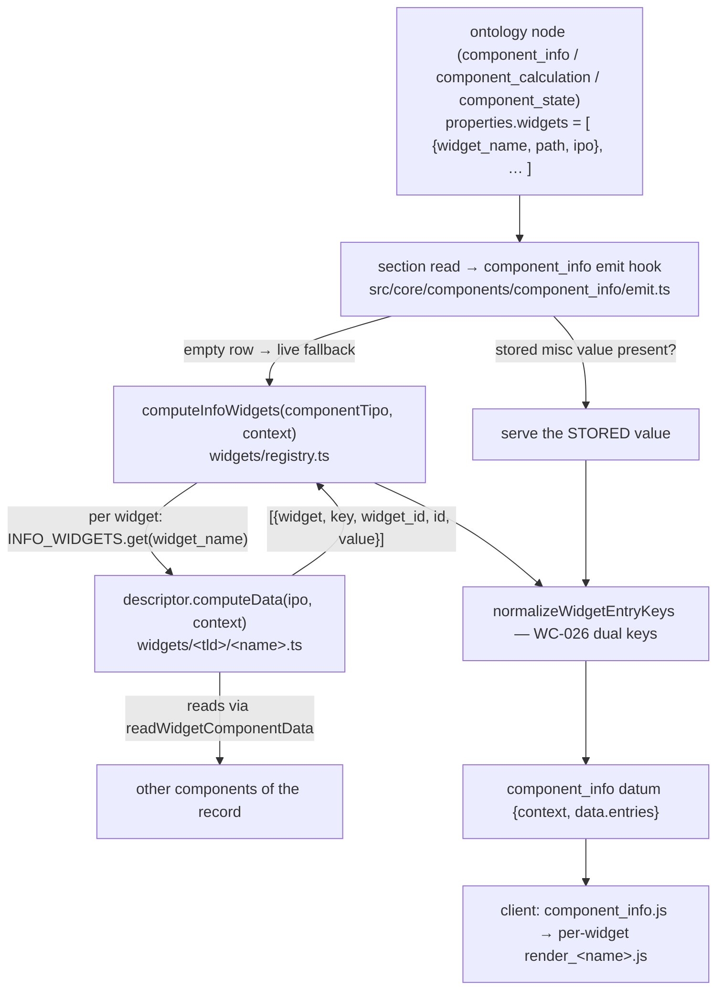

# component_info

> The **IPO** (Import–Process–Output) component: a read-only field that hosts
> one or more **widgets** which *import* data from other components, *process*
> it, and *output* the result. It computes; it does not store user input.

> See also: [widgets](../ui/widgets.md) (the framework reference) ·
> [Add a widget](../../development/extending/add_a_widget.md) (the how-to) ·
> [component_info cookbook](component_info_cookbook.md) (recipes) ·
> [Components](index.md) · [Architecture overview](../architecture_overview.md)

## Why it exists

Many catalogue screens need a synthesised, read-only panel that summarises or
links to information living **elsewhere** in the record: a strip of media-icon
shortcuts into the transcription / indexation / translation tools, a
completion-state percentage across the project languages, the descriptor
roll-up of an oral-history record, an aggregated weight/diameter statistic over
a coin archive, a computed sum of date spans. `component_info` is the building
block for all of these. It reads other components, runs each configured
widget's **IPO** formula, and presents the result — the cataloguer never edits
it directly.

!!! note "Typology — an *info* literal component"
    `component_info` is a **literal** component (`is_literal: true`) whose value
    is **computed from widgets** rather than typed by a cataloguer. It is one of
    the two *info* models (`component_inverse` is the other). Two more ontology
    models — `component_calculation` and `component_state` — **alias to
    `component_info` at runtime** (their descriptors set
    `alias: 'component_info'`), so everything on this page applies to them too.
    As the [components index](index.md#info-components) puts it: *"Info
    components need other components to calculate their own data, but the result
    is saved as direct data, so the component reads and saves like any other
    literal component."*

**When to use it**

- A dashboard-style panel that aggregates data already stored in other
  components of the section (an oral-history record's *Information* block).
- Computed read-outs that are derived, not entered: archive state, digitization
  percentage, a roll-up of descriptors across linked tapes.
- Contextual tool shortcuts (indexation / transcription / translation) computed
  against the current media.

**When *not* to use it**

- Free text the cataloguer types → [component_input_text](component_input_text.md) /
  [component_text_area](component_text_area.md).
- A pointer to another record → a relation component such as
  [component_portal](component_portal.md) / [component_select](component_select.md).
- A "who points at me" reverse listing with no per-widget computation →
  [component_inverse](component_inverse.md).
- A static numeric field → [component_number](component_number.md).

## How the pieces fit



On a section read the info **emit hook**
(`src/core/components/component_info/emit.ts`) is reached for every
`component_info` instance. If the matrix row already holds a **stored** value it
is served verbatim; otherwise the hook falls back to **live compute** through
`computeInfoWidgets()` (`widgets/registry.ts`), which reads the node's
`properties.widgets` and, for each non-async widget, looks its `widget_name` up
in the registry and runs the descriptor's `computeData()`. Both branches pass
through `normalizeWidgetEntryKeys` (the WC-026 dual-key fix — see
[The wire contract](#the-wire-contract)). The client (`component_info.js`) then
hands each widget its slice of `data.entries` and dynamically imports its
render module.

!!! info "Where the code lives (the TS/Bun home)"
    The whole framework is under
    `src/core/components/component_info/widgets/` — `widget_common.ts` (the
    `InfoWidgetDescriptor` contract + shared IPO helpers), `registry.ts` (the
    ONE dispatch home: `INFO_WIDGETS` map + `computeInfoWidgets`), one module
    per widget under `<tld>/<name>.ts`, `calculation/functions.ts` (the static
    process-fn registry) and `grid.ts` (dd_grid builders). On the PHP oracle
    each widget was a `class.<name>.php extends widget_common` loaded from the
    ontology-authored path; the TS server dispatches by **name** through the
    registry and never loads code from a path. The developer checklist lives in
    `src/core/components/component_info/widgets/README.md`; the framework
    invariants are gated by `test/unit/info_widget_registry_tripwire.test.ts`.

## The wire contract

The datum is the standard `{context, data}` shape. The client
`component_info.js::get_widgets()` reads **`context.properties.widgets`** and
**`data.entries`**, so both are load-bearing.

### context.properties.widgets — a HARD client requirement

The client iterates `context.properties.widgets` to know which widget modules
to import; a **missing or non-array** `widgets` throws a `TypeError` in the
browser and the whole field fails to render. The TS structure-context carries it
straight from the ontology node's `properties`. Each entry is:

```json
{
    "widget_name": "media_icons",
    "path"       : "/oh/media_icons",
    "widget_info": "Create a simple list of media element icons …",
    "ipo": [ /* one or more Input–Process–Output blocks */ ]
}
```

- **`widget_name`** — the dispatch key. The registry (`widgets/registry.ts`)
  switches on it; the client imports `core/widgets<path>/js/<widget_name>.js`.
  An ontology `widget_name` with no registry entry throws
  `WidgetNotRegisteredError` on the server (PHP fatals on its include too) —
  widgets never silently render empty (the never-narrow law).
- **`path`** — the client import path (leading slash), also the folder under
  `core/widgets`. The server never uses it to load code; the registry tripwire
  only **verifies** each descriptor's `path` resolves to a real client module.
- **`ipo`** — the Input–Process–Output config (see
  [The IPO config](../ui/widgets.md#ipo--input--process--output)).

### data.entries — the widget outputs (WC-026)

`data.entries` is a **flat array** of the widgets' output items, concatenated in
declaration order. Each item is widget-specific but uniform in its head:

```jsonc
[
  // a descriptors item — a top-level scalar output, dualised by WC-026:
  { "widget": "descriptors", "key": 0, "id": "indexation", "widget_id": "indexation", "value": 90, "locator": { … } },
  // a media_icons item — a ROW object keyed by column id; each column value is a
  // CELL object, so the outer `id` key is NOT dualised (nested shapes pass through):
  { "widget": "media_icons",
    "id":            { "widget": "media_icons", "widget_id": "id",    "value": 42, "locator": { … } },
    "tc":            { "widget": "media_icons", "widget_id": "tc",    "value": "00:12:34.000", "locator": { … } },
    "transcription": { "widget": "media_icons", "widget_id": "transcription", "tool_context": { … }, "locator": { … } } }
]
```

!!! warning "WC-026 — every item carries BOTH `id` and `widget_id`"
    This is the motivating bug of the rebuild ("widgets are not working"). The
    byte-identical **client** widget renders match entries on **`widget_id`**
    (`render_get_archive_weights.js`, `render_calculation.js`, …), while the
    **grid/export** builders match on **`id`**. PHP emits only *one* of the two
    keys per widget class (live weights/state → `widget_id`, live calculation →
    `id`) and **all stored misc values are `id`-keyed** — so the PHP client
    renders every stored archive (17,087 numisdata records, verified live
    2026-07-10) *and* every live calculation **blank**.

    The TS server satisfies the client's contract by emitting **both** keys at
    the emit boundary via `normalizeWidgetEntryKeys`
    (`widgets/widget_common.ts`). Only top-level string keys are dualised —
    `media_icons` row objects (whose `id` key holds a *cell* object), nested
    shapes (`state`'s `value.widget_id`) and the `tags` widget's leading raw
    text items (no `widget` tag) pass through verbatim. Ledger:
    [engineering/WIRE_CONTRACT.md → WC-026](../../../engineering/WIRE_CONTRACT.md).

### The stored-misc-wins / live-fallback rule

The emit hook serves the **stored** misc value when the client save cycle has
persisted one (`{id, key, value, widget}` items), and falls back to live widget
compute only when the row holds nothing. This mirrors PHP's `get_db_data`
(stored-first, live-compute-fallback). In practice **stored misc values are
legacy** — current PHP never writes them (measured 2026-07-10), so the live
compute path is the one that matters, and observer recomputes deliberately do
**not** touch the live misc column either (see [Observers](#observers)).

### Edit-mode datalist

In **edit** mode the emit hook additionally attaches a `datalist` to the data
item (`decorateItem`), the concatenation of every widget's `computeDataList`
output. Only the `state` widget implements it today; its client render
(`render_edit_state.js`) resolves option labels from `self.datalist` and
**TypeErrors to blank without it**. The datalist is attached only in edit mode
and only when non-empty (PHP `component_info_json.php` parity).

## The `get_widget_data` API action

Async widgets — and any widget the client chooses to build lazily — fetch their
data through the `dd_component_info` API class, whose single allowed action is
`get_widget_data` (`API_ACTIONS = ['get_widget_data']`,
`src/core/api/handlers/dd_component_info.ts`). The byte-identical client issues
it from the shared `widget_common.js` `build(autoload=true)` path.

**Request** (RQO):

```json
{
  "dd_api" : "dd_component_info",
  "action" : "get_widget_data",
  "source" : { "tipo": "dd1633", "section_tipo": "dd64", "section_id": 42, "mode": "edit" },
  "options": { "widget_name": "user_activity" }
}
```

**Response** — success is the widget's raw item array in `result`; failures ride
as HTTP 200 with the **PHP error-envelope bytes** preserved verbatim:

```jsonc
// success
{ "result": [ { "widget": "user_activity", "key": 0, "widget_id": "totals", "value": { … } } ],
  "msg": "OK. Request done successfully", "errors": [] }

// unknown widget_name
{ "result": false, "msg": [" Empty widget_obj for widget user_activity"], "errors": [] }

// a widgets-less tipo
{ "result": false, "msg": [" Empty defined widgets for dd_component_info : <label> [<tipo>] "], "errors": [] }
```

!!! note "TS is stronger on one axis (AUTHZ-01)"
    A widget computes **over a record**, so the handler gates the record with
    `principalCanAccessRecord(section_tipo, section_id, principal)` **before any
    compute** — PHP computes for any coordinates a logged-in user names. A
    forbidden record returns `{result:false, msg:[' Forbidden record'],
    errors:['forbidden']}`. This is a permitted (stronger-only) divergence.
    This channel is the **only** delivery path for async widgets — it computes
    them (the read-time aggregate skips them).

## The widget census

All **11** widgets of the PHP census are ported. Discipline TLD folders mirror
PHP `core/widgets/<tld>/<name>/` and the byte-identical client
`client/dedalo/core/widgets/<tld>/<name>/js/`.

| widget | TLD | descriptor `path` | purpose | facets |
|---|---|---|---|---|
| `calculation` | — | `/calculation` | Generic IPO calculator: read `current`-scope components, run a static process fn (`summarize` / `to_euros` / `calculate_period`), emit `output` items. | emits `id` (not `widget_id`) |
| `state` | — | `/state` | Per-record completion **state** %: follow each IPO path to a select/check_box pointing at the `dd174`/`dd501` vocabulary, emit per-column `detail` + `total` items. | **`computeDataList`** (edit datalist) |
| `user_activity` | `dd` | `/dd/user_activity` | Three-tier user activity stats (saved range + today supplement + live full-range fallback). | **`isAsync`** — delivered only via `get_widget_data` |
| `get_archive_states` | `dmm` | `/dmm/get_archive_states` | Aggregate radio_button state values (`answer`/`closed`, affirmative/negative counts + %) over linked records; 14 keyed outputs. | shape-gated (no instance declares it) |
| `sum_dates` | `mdcat` | `/mdcat/sum_dates` | Sum date_in/date_out spans into a `DateInterval`-shaped total, with estimate/bridge handling. | **`computeDataParsed`** (grid/export humanizer) |
| `get_archive_weights` | `numisdata` | `/numisdata/get_archive_weights` | Weight/diameter mean/max/min/count over the coins linked via the source portal. | — |
| `get_coins_by_period` | `numisdata` | `/numisdata/get_coins_by_period` | Count/group coins by chronological period (thesaurus-driven). | — |
| `descriptors` | `oh` | `/oh/descriptors` | Oral-history indexation count + merged descriptor **term grid** for a record. | edit-only (`list` mode → `[]`) |
| `media_icons` | `oh` | `/oh/media_icons` | One row per linked media record: id + tc value columns + one tool-launch column per declared tool. | row objects; user-scoped tools |
| `tags` | `oh` | `/oh/tags` | Transcription tag statistics over the current record's transcription text. | leads with raw text items (PHP quirk) |
| `test_info` | `test` | `/test/test_info` | Minimal reference widget used by tests/samples; emits both `id` and `widget_id` natively. | reference stub |

!!! note "Coverage state lives in the ledger, not here (S2-45)"
    Which widgets are byte-parity gated vs shape-gated, and the open reconcile
    rows, live in [rewrite/LEDGER.md](../../../rewrite/LEDGER.md). This page
    describes behaviour; the ledger tracks state.

## IPO — the widget config

The widget's behaviour is **data**, not code: the `ipo` array read from the
ontology. Each block has up to three parts — `input` (what to read), `process`
(optional transform, only `calculation` uses it), `output` (`{id, …}` maps, one
item per `id`). Full field reference: [widgets → IPO](../ui/widgets.md#ipo--input--process--output).

Two input shapes appear in the real ontology:

- **object input** with `type` + `source` + `paths` (`media_icons`,
  `descriptors`, `state`, `calculation`) — `source` names the origin
  component(s) with `current` sentinels for this record; `paths` walk to the
  leaf component;
- **array input** of typed entries scanned by `type` (`get_archive_weights`,
  `get_coins_by_period`, `sum_dates`, `get_archive_states`) — e.g. `{type:
  'source'}`, `{type: 'used'}`, `{type: 'data_diamenter'}`.

Verified `get_archive_weights` block from **numisdata595** (note the persistent
ontology typo `data_diamenter` — it is a wire contract, kept verbatim):

```json
{
  "widget_name": "get_archive_weights",
  "path": "/numisdata/get_archive_weights",
  "ipo": [
    {
      "input": [
        { "type": "source",         "section_tipo": "numisdata3", "component_tipo": "numisdata77"  },
        { "type": "used",           "section_tipo": "numisdata4", "component_tipo": "numisdata57"  },
        { "type": "duplicated",     "section_tipo": "numisdata4", "component_tipo": "numisdata157" },
        { "type": "data_weights",   "section_tipo": "numisdata4", "component_tipo": "numisdata133" },
        { "type": "data_diamenter", "section_tipo": "numisdata4", "component_tipo": "numisdata135" }
      ],
      "output": [
        { "id": "media_weight", "value": "float" }, { "id": "max_weight", "value": "float" },
        { "id": "min_weight", "value": "float" },   { "id": "total_elements_weights", "value": "float" },
        { "id": "media_diameter", "value": "float" }, { "id": "max_diameter", "value": "float" },
        { "id": "min_diameter", "value": "float" },   { "id": "total_elements_diameter", "value": "float" }
      ]
    }
  ]
}
```

More real examples to read: **oh87** (media_icons + descriptors over the oh25
portal), **rsc19** (state over eight `self` select paths, `component_state`
alias), **test212** (test_info over test52), and the copied client samples under
`client/dedalo/core/component_info/samples/`.

## Observers

Two distinct ontology keys wire the observer graph, and they must not be
confused:

- **`observe`** — *what I watch.* Declared on the info component:
  `{component_tipo, server:{filter|config|perform}, client:{event,perform}}`.
- **`observers`** — *who watches me.* Declared on the **observed** component: a
  list of `[{section_tipo, component_tipo}]` naming the info components to
  recompute.

When an observed component saves, `propagateToObservers`
(`src/core/api/handlers/observers.ts`) walks its `observers`, and for each
info-model observer recomputes the widgets. Two server `filter` shapes are
covered (oracle-verified on scratch twins 2026-07-10):

| shape | example | targets | what lands |
|---|---|---|---|
| **`filter:{SQO}`** | numisdata595 ← numisdata57 (observed lives on **another** section) | fill every clause's `q` with the saved record's locator (+ `from_component_tipo` from the clause's last path step) and search the observer's section for the referencing records | ONE `matrix_time_machine` row per target (lg-nolan, raw computed shape); live misc **untouched**; no response item (cross-section) |
| **`filter:false`** | rsc19 ← rsc156 (same-record observer) | the saved record itself | TM row **plus** the recomputed item merged into the **save response** (PHP `observers_data`), so the actively-edited record's panel refreshes |

Real shapes: numisdata57 (a `component_radio_button`) carries
`observers: [{"info": "Coins. Property used for server side only",
"section_tipo": "numisdata3", "component_tipo": "numisdata595"}]`; the info
component numisdata595 carries the matching `observe` block with a
`server.filter` `$and` clause whose path is the numisdata77 portal. rsc19
(`component_state`) carries eight `observe` entries with `server:{filter:false}`.

!!! note "One TM row, never the live misc column"
    Per target PHP writes exactly one `matrix_time_machine` row per save and —
    measured, deliberate — does **not** write the live misc column (stored misc
    values are legacy). TS matches this. Gated in
    `test/parity/info_observer_differential.test.ts`.

## Render views & modes (client)

The client was copied as-is. Views come from `context.view` (default `default`)
and dispatch through the per-mode render files (`render_edit_component_info.js`,
`render_list_component_info.js`); the `component_info` prototype maps `tm` → the
list renderer and `search` → the edit renderer.

| View | edit | list / tm | Notes |
| --- | :---: | :---: | --- |
| `default` | yes | yes | Full wrapper: `label`, `buttons` (edit + write perms only), `content_data` with one `content_value` per widget. Each shows a "Loading widget.." placeholder, then builds and fades in the widget node. |
| `line` | yes | — | Same as default with `label: null` (compact inline). |
| `print` | yes | — | Falls through to `default` but forces `permissions = 1` (read-only). |
| `mini` | yes | yes | Minimal `wrapper_mini`; joins `data.entries` with `context.fields_separator` as a plain string (autocomplete / datalist contexts). |

DOM (edit / default): `wrapper_component component_info <tipo> <mode>` → `label`,
`buttons_container`, `content_data` → one `content_value widget_item_<name>` per
widget → the widget's own `wrapper_widget` node. `content_data` uses
`display: contents` so widgets participate directly in the parent grid.

## Import / export

**Import.** `component_info` owns no user-entered data and defines no
`conform_import_data()` — there is nothing to import; the value is recomputed
each load. See [importing data](../importing_data.md).

**Export / grid.** The PHP contract is **one atom per widget IPO `output`
entry**, built by walking each output `id`. On the TS side the grid/export
consumer for widgets is partial — the shared dd_grid cell tree is built by
`widgets/grid.ts` (`buildPortalGridValue`, consumed by `descriptors`), and
`sum_dates` ships a `computeDataParsed` humanizer as its grid/export face; the
full one-column-per-`output` consumer is not universally wired. Check the code
before relying on an exact column layout. See [exporting data](../exporting_data.md).

## Honest notes on PHP-side defects

These are live **PHP-oracle** defects the TS twin documents factually (they are
the "why" of some divergences):

- **`calculation` `summarize` crashes PHP on non-empty input** — `array_sum()`
  on the flat *string* `get_calculation_data` returns kills the whole request.
  TS emits `[]` for that case instead (the effective outcome); with all inputs
  empty both engines emit `total 0`. Pinned in
  `test/parity/info_widget_differential.test.ts` and the code comment in
  `widgets/calculation/functions.ts`.
- **`user_activity`'s saved-stats tier never decodes on live PHP** — only
  today/live-fallback tiers show, and its `who` dimension is dead. The TS
  three-tier pipeline is faithful to the *intended* behaviour.
- **PHP insert save double-fires** — an insert save runs twice, so PHP writes
  two identical observer TM rows where TS writes one; the observer differential
  compares TM **counts deduped** for this reason.

## Related

- [widgets](../ui/widgets.md) — the framework reference (registry, descriptor
  contract, IPO field reference, async widgets, SEC-052 static fn registry).
- [Add a widget](../../development/extending/add_a_widget.md) — the step-by-step
  how-to.
- [component_info cookbook](component_info_cookbook.md) — practical recipes
  (declare, extend, async, datalist, observers, test, debug).
- [component_inverse](component_inverse.md) — the other *info* model.
- [engineering/WIRE_CONTRACT.md](../../../engineering/WIRE_CONTRACT.md) — WC-026.
