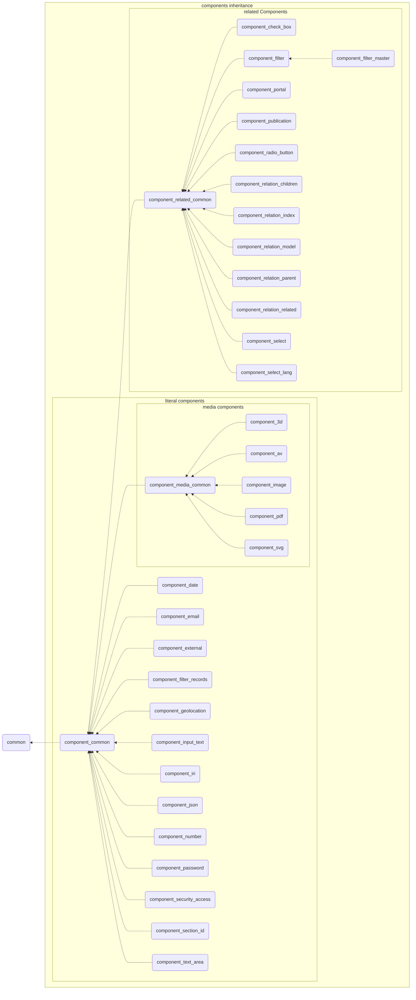

# Introduction to components

Components are re-usable objects that can be instantiated by the ontology definition. Components are part of the sections and are used as fields with specific properties.

## Nomenclature of files

Every component definition has its own class, controller, and views. The components have a server part, develop in PHP language, and client part, develop in JavaScript and CSS.

CSS are develop with LESS language and it's not complied by itself, the final CSS is included as part of page.css.

The nomenclature of files follow this paths:

1. **Server files:**

    Sever files are stored directly in the main directory of the component.

    Class: `class.component_xxx.php`

    Controller: `component_xxx_json.php`

2. **Client files:**

    Client files with logical, render and views are stored inside a `/js` directory

    Class: `component_xxx.js`

    Render: `render_yyy_component_xxx_.js`

    View: `zzz_yyy_component_xxx_.js`

    CSS client files are stored inside a `/css` directory.

    Style: `component_xxx.less`

-------------

- xxx = specific name, (input_text | text_area | image | etc. )
- yyy = mode, (edit | list | search)
- zzz = view (default | line | mini | text | mosaic | etc.)

Example of component_input_text

``` shell
component_input_text
    ├── class.component_input_text.php
    ├── component_input_text_json.php
    ├── css
    │   ├── component_input_text.less
    │   ├── view_default_input_text.less
    │   ├── view_line_input_text.less
    │   ├── view_mini_input_text.css
    │   └── view_mini_input_text.less
    └── js
        ├── component_input_text.js
        ├── events_subscription.js
        ├── render_edit_component_input_text.js
        ├── render_list_component_input_text.js
        ├── render_search_component_input_text.js
        ├── view_default_edit_input_text.js
        ├── view_default_list_input_text.js
        ├── view_ip_list_input_text.js
        ├── view_line_edit_input_text.js
        ├── view_mini_input_text.js
        └── view_text_input_text.js
```

## Typologies of components

Mainly Dédalo define two different behavior for components; literal components and related components. This typologies defines if the component has a related data or his data its managed by itself.

### Literal components

Literal components manage direct data, final data, this data is independent of other ontology parts or components, this components save his data and does not need resolve it with others.

Literal components has three different ways to manage data; direct, media and info.

- Direct components manage and control the format used.
- Media components share his data format definition between other media components.
- Info components give data from other components as information or calculations (summaries, state, etc ).

!!! note "About info as literal component"
    Info components need other components to calculate his own data, but the result is save as direct data, so the component read and save like any other literal component.

#### Direct components

- [component_date](component_date.md)
- [component_email](component_email.md)
- component_external
- component_filter_records
- component_geolocation
- [component_input_text](component_input_text.md)
- [component_iri](component_iri.md)
- component_json
- [component_number](component_number.md)
- component_password
- component_security_access
- component_section_id
- component_text_area

This components extend component_common.php class

#### Media components

- component_3d
- component_av
- component_image
- component_pdf
- component_svg
  
This components extend component_media_common.php class

#### Info components

- component_info
- component_inverse
  
This components extend component_common.php class

### Related components

Related components manage [locators](../locator.md) to point at other sections or components, sections pointed could be the same of the related component or other sections. The locator can specify if the pointed components is a literal or other related component.

- [component_check_box](component_check_box.md)
- component_filter
- component_filter_master
- component_portal
- component_publication
- component_radio_button
- component_relation_children
- component_relation_index
- component_relation_model
- component_relation_parent
- component_relation_related
- component_select
- component_select_lang

This components extend component_relation_common.php class

## Inheritance

In server context. components classes inherit from common classes dependent of the component typology. The main component class is `component_common.php` and some components, as media components, share his own common class as `component_media_common.php`



## Instantiation

Usually components are called by sections but it's possible instantiate any component directly.

To instantiate a component is necessary indicate:

1. His `model`, his name.
2. His ontology `tipo`
3. His `section_tipo` (some components could be instantiated in different sections)
4. The language to be loaded and used.

In the server the components are instantiated with `get_instance()` method in `component_common.php` class.

```php
$component = component_common::get_instance(
    string $model               = null, // model or name of the component
    string $tipo                = null, // ontology tipo
    mixed $section_id           = null, // section id or null when is not known
    string $mode                = 'edit', // mode used to load the component with the data used to edit or list
    string $lang                = DEDALO_DATA_LANG, // language 
    string $section_tipo        = null,  // the ontology section tipo of the component
    bool $cache                 = true, // load from cache if exist
    object $caller_dataframe    = null // if the component is inside a subsection or dataframe.
 );
```

In the client the components are instantiated by `instances.js` class.

```javascript
const component = get_instance({
    model           : model,        // string, model or name of the component
    tipo            : tipo,         // string, ontology tipo
    section_tipo    : section_tipo, // string, ontology section tipo of the component
    section_id      : section_id,   // string || int, section id
    mode            : mode,         // string, mode used to load the component with data used to edit or list
    lang            : lang          // string, language 
})
```

!!! info "JavaScript instantiation"

    The `instances.js` class is a ES6 module and it can be include in this way:

    ```javascript
    import {get_instance} from '../../common/js/instances.js'
    ```
    
## DOM structure
Components follow a standardized basic DOM structure for main modes and views.

- Mode 'edit' view 'default'

``` shell
── wrapper_component
   ├── label
   ├── buttons_container
   └── content_data
       └── content_value  
           └── value  
```

- Mode 'list' view 'default'

``` shell
── wrapper_component
   └── value 
```

## Data management

Components manage his own data, but their are not connected directly to the database, only sections can get and save data in the database, so, components get and save his data through their own section.

## Translatable property

Dédalo is a multilingual system, all information can be translatable in several languages. Components are translatable by default, but some components may be non-translatable such as component_number, non-translatable components have to define this property specifically as `false`.

### Translatable components

Translatable components manage only the instance in the current language and their data will be only the instantiated language part of the data, for example, a component_input_text instantiated in the Català language will only manage the Català part of its data, the component will get its data from the section but you can only get one language at a time.

### Non-translatable components

Every component has a language. Language need to be set when the component is instantiated, for non-translatable components language is defined as `lg-nolan`, and the component works in the same way that translatable component.

### Transliterate components

In special cases, such as personal names, the component can be define as transliterate[^1], in these cases the language is define as `lg-nolan` by default, but the component can handle other languages as English `lg-eng`.

[^1]: To express or represent in the characters of another alphabet.

## Properties

The ontology defines the properties that will be used when the component will be instantiated. Properties define specific context of the component, such as CSS styles or the RQO to be used.

Properties are write in JSON.

## Datum

Datum is a JSON object with all needed to build and render the components. Datum object has two properties; `context` and `data`, `data` has a `value` property with the database value of the component.

Datum structure in JSON

```json
{
    "context":{},
    "data":{
        "value":[]
    }
}
```

## context

Context defines his part of the ontology and all needs to build the component in client side.
Components create his own context when the component is instantiated.

Related components would need a subcontext to be instantiated such as component_portal, it needs all context of all components pointed in order to be built.

Example of context for the *Birth town* [rsc91](https://dedalo.dev/ontology/rsc91) a component_portal.

```json
{
    "context" : {
        "label"          : "Birth town", // resolution of the name of the component in the application lang
        "tipo"           : "rsc91", // ontology tipo
        "section_tipo"   : "rsc197", // ontology section tipo
        "model"          : "component_portal", // component model to be instantiated
        "legacy_model"   : "component_autocomplete_hi", // old component model in versions <v6
        "parent"         : "rsc197", // parent node in ontology
        "parent_grouper" : "rsc76", // parent grouper in ontology
        "lang"           : "lg-nolan", // lang to be instantiated
        "mode"           : "edit", // mode to get data from database (edit, list, search, ...)
        "translatable"   : false, // specify if the component could be translatable
        "properties"     : {
            "source": {
                "mode": "autocomplete",
                "request_config": [{
                    "sqo": {
                        "section_tipo": [{
                            "value": [2],
                            "source": "hierarchy_types"
                        }]
                    },
                    "show": {
                        "ddo_map": [{
                            "tipo": "hierarchy25",
                            "parent": "self",
                            "section_tipo": "self",
                            "value_with_parents": true
                        }],
                        "fields_separator": ", "
                    },
                    "choose": {
                        "ddo_map": [
                            {
                                "tipo": "hierarchy25",
                                "parent": "self",
                                "section_tipo": "self",
                                "value_with_parents": true
                            },{
                                "tipo": "hierarchy27",
                                "parent": "self",
                                "section_tipo": "self"
                            }
                        ],
                        "sqo_config": {
                            "limit": 30
                        },
                        "fields_separator": " | "
                    }
                }]
            }
        }, // properties defined in ontology
        "css" : {
            ".wrapper_component": {
                "grid-column": "span 7"
            }
        }, // style defined in ontology
        "permissions"       : 2, // user permissions of the component
        "buttons"           : [], // specific buttons
        "request_config"    : [{
            "api_engine": "dedalo",
            "type": "main",
            "sqo": {
                "section_tipo": [
                    {
                        "typo": "ddo",
                        "tipo": "es1",
                        "model": "section",
                        "label": "Spain"
                    },
                    {
                        "typo": "ddo",
                        "tipo": "fr1",
                        "model": "section",
                        "label": "France"
                    }
                ],
                "limit": 10
            },
            "show": {
                "ddo_map": [
                    {
                        "tipo": "hierarchy25",
                        "parent": "rsc91",
                        "section_tipo": [
                            "fr1",
                            "es1"
                        ],
                        "value_with_parents": true,
                        "label": "Term",
                        "mode": "list",
                        "model": "component_input_text",
                        "view": "text",
                        "column_id": "rsc91"
                    }
                ],
                "fields_separator": ", ",
                "sqo_config": {
                        "full_count": false,
                        "limit": 10,
                        "offset": 0,
                        "mode": "edit",
                        "operator": "$or"
                    }
                },
                "search": null,
                "choose": {
                    "ddo_map": [
                        {
                            "tipo": "hierarchy25",
                            "parent": "rsc91",
                            "section_tipo": [
                                "fr1",
                                "es1"
                            ],
                            "value_with_parents": true,
                            "label": "Term",
                            "mode": "list"
                        },
                        {
                            "tipo": "hierarchy27",
                            "parent": "rsc91",
                            "section_tipo": [
                                "fr1",
                                "es1"
                            ],
                            "label": "Model",
                            "mode": "list"
                        }
                    ],
                    "sqo_config": {
                        "limit": 30
                    },
                    "fields_separator": " | "
                }
        }], // parsed request config, ready to be used.
        "columns_map"       : [], // columns to be render with the components
        "tools"             : [{
            "typo": "ddo",
            "model": "tool_propagate_component_data",
            "name": "tool_propagate_component_data",
            "label": "Propagates component data",
            "section_tipo": "dd1324",
            "mode": "edit",
            "properties": null,
            "css": {
                "url": "/dedalo/tools/tool_propagate_component_data/css/tool_propagate_component_data.css"
            },
            "icon": "/dedalo/tools/tool_propagate_component_data/img/icon.svg",
            "show_in_inspector": true,
            "show_in_component": true,
            "type": "tool"
        },
        {
            "typo": "ddo",
            "model": "tool_time_machine",
            "name": "tool_time_machine",
            "label": "Time machine",
            "section_tipo": "dd1324",
            "mode": "edit",
            "properties": {
                "open_as": "window",
                "windowFeatures": null
            },
            "css": {
                "url": "/dedalo/tools/tool_time_machine/css/tool_time_machine.css"
            },
            "icon": "/dedalo/tools/tool_time_machine/img/icon.svg",
            "show_in_inspector": true,
            "show_in_component": true,
            "type": "tool"
        }], // tools active for the component
        "sortable"    : true, // indicate if the components can be used to sort in list,
        "type"        : "component", // type of the context object
        "typo"        : "ddo", // 
        "view"        : "line", // view to be used in render process
        "sample_data" : [{"show":{"ddo_map":[{"mode":"edit","tipo":"test80","parent":"test3","section_tipo":"test3"}]}}] // is used to obtain an example of data to easily understand the expected value
    }
}
```

## data

Every component defines his own data structure, but all components have a `value` property with the stored database value. As all components store their data as an array, so the value is always an array.

Example of data for the Birth town [rsc91](https://dedalo.dev/ontology/rsc91) a component_portal (relation component)

```json
{
    "section_id": "1", // section_id of the component instance
    "section_tipo": "rsc197", // section_tipo of the component instance
    "tipo": "rsc91", // ontology tipo of the component instance
    "lang": "lg-nolan", // language of the component instance
    "from_component_tipo": "rsc91", // sub-data component_tipo (used to be linked if the component is called by other component)
    "value": [
        {
            "type": "dd151",
            "section_id": "3896",
            "section_tipo": "es1",
            "from_component_tipo": "rsc91",
        }
    ], // database value
    "parent_tipo": "rsc197", // section or component that call to this component
    "parent_section_id": "1", // section_id of the section or that call to this component 
    "pagination": {
        "total": 1,
        "limit": 10,
        "offset": 0
    },
    "row_section_id": "1",
    "changed_data": [] // to set with new data or modify existing data
}
```

## Permissions

Components can handle data and save. Permissions defines if the user can access, read, write or admin the component.

In server context permissions are set with the data saved in database, and it's checked every time that the system is required to load, save, etc.

In client context, permissions are set and checked in every API call, they control the render and behavior of the component.

!!! warning "unauthorized changes in permissions"
    To avoid unauthorized changes in permissions, every call to load and save is checked in the server context, previous to execute the call.

Permission is set as int with the level of the access to the component instance.

| permission | level |
| --- |--- |
| 0 | no access |
| 1 | read only |
| 2 | read and write |
| 3 | read, write and admin |

## tools

Defines with tools can be used in the component instance. Tools add some functionalities to extend the standard behavior. For example if a component is translatable it will load the `tool_lang`.

## Observers and observables

Components can be configured to be observable by other components or observe other components.

Dédalo use two different configurations to create the observer/observable spaces. The server context and the client context. The main difference is that, in server context, observable/observer configuration is related to data changes, in client context can be configured to do other tasks as activate it, perform calculations, change his own data, etc.

### Server context

When a component is set as observable in server context, any change of his data will be send to the observer. Observer component can be configured to do actions as update values or change his own data depending of the value of the observable component.

### Client context

In client context components use the event_manager to subscribe and publish his actions. The configuration is set in the ontology properties.

When a component is set as observable in client context, any action do it by the user will be publish in the event_manager, any other components could to subscribe itself to this actions and perform some tasks.

For example, when a component is activate by the user, the component will publish an `activate` action, and all other components, as are subscribe to this action, will be inactivated.

Some components perform actions in other components, as component_text_area to control the component_av time position, when the user click in the time_code tag of a transcription the component_av jump to the specific time code.

### configuration

The observers and observables are configured in ontology properties of the components. The component the is observing the actions and changes has two way, what happen when is fire a event of the observable, what perform, in the client and in the server. Sometimes the perform action has parameters to configure the execution.

Example of observer configuration:

When a Numismatic Object define his own Type [numisdata161](https://dedalo.dev/ontology/numisdata161), the Type [numisdata3](https://dedalo.dev/ontology/numisdata3) related and his equivalents types [numisdata36](https://dedalo.dev/ontology/numisdata36) will need to be update his own Coins field [numisdata77](https://dedalo.dev/ontology/numisdata77). The coins field in types get all coins in the equivalents types, so, when one type change all need to be update. In this situation the coins portal is observing the types field in numismatic object, the observable, any change in it will fire the process to update using `set_dato_external` function.

Coins Update his own data when tipo is set in numismatic object:

```json
"observe": [{
        "client": {
            "event": "update_value",
            "perform": {
                "function": "refresh"
            }
        },
        "server": {
            "config": {
                "use_self_section": true,
                "use_observable_dato": true
            },
            "perform": {
                "params": {
                    "save": true,
                    "changed": false,
                    "current_dato": false,
                    "references_limit": 0
                },
                "function": "set_dato_external"
            }
        },
        "component_tipo": "numisdata36"
 }]
```

And the observable has a list of the components that observe it.

```json
"observers": [
    {
        "section_tipo": "numisdata3",
        "component_tipo": "numisdata36"
    }
]
```

See the full definition of every component properties.
