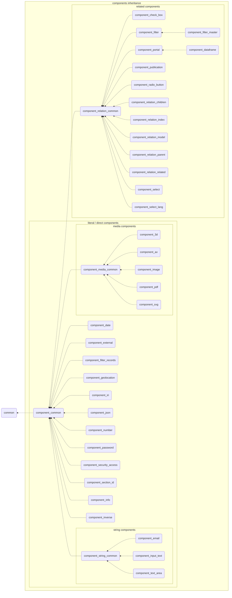

# Introduction to components

> See also: [Architecture overview](../architecture_overview.md) · [Sections](../sections/index.md) · [Base classes](base_classes.md)

Components are reusable objects instantiated from the ontology definition. They belong to sections and act as the fields of a record, each with its own properties.

## File nomenclature

Every component definition has its own class, controller and views. A component has a server part, written in PHP, and a client part, written in JavaScript and CSS.

The CSS is written in LESS. It is not compiled on its own; the final CSS is included as part of `page.css`.

File names follow these paths:

1. **Server files**

    Server files are stored directly in the component's main directory.

    Class: `class.component_xxx.php`

    Controller: `component_xxx_json.php`

2. **Client files**

    Client files (logic, render and views) are stored inside a `/js` directory.

    Class: `component_xxx.js`

    Render: `render_yyy_component_xxx_.js`

    View: `zzz_yyy_component_xxx_.js`

    CSS client files are stored inside a `/css` directory.

    Style: `component_xxx.less`

-------------

- xxx = specific name (input_text | text_area | image | etc.)
- yyy = mode (edit | list | search)
- zzz = view (default | line | mini | text | mosaic | etc.)

Example of `component_input_text`:

```text
component_input_text
    ├── class.component_input_text.php
    ├── component_input_text_json.php
    ├── css
    │   ├── component_input_text.less
    │   ├── view_default_input_text.less
    │   ├── view_line_input_text.less
    │   ├── view_mini_input_text.css
    │   └── view_mini_input_text.less
    └── js
        ├── component_input_text.js
        ├── events_subscription.js
        ├── render_edit_component_input_text.js
        ├── render_list_component_input_text.js
        ├── render_search_component_input_text.js
        ├── view_default_edit_input_text.js
        ├── view_default_list_input_text.js
        ├── view_ip_list_input_text.js
        ├── view_line_edit_input_text.js
        ├── view_mini_input_text.js
        └── view_text_input_text.js
```

## Typologies of components

Dédalo defines two main behaviours for components: literal components and related components. The typology says whether the component points at related data or manages its own data directly.

### Literal components

Literal components manage direct, final data. This data is independent of other ontology nodes or components: a literal component saves its own value and does not need to resolve it against any other component.

Literal components manage data in three different ways: direct, media and info.

- Direct components own and control the value format they use.
- Media components share their data-format definition with the other media components.
- Info components derive their data from other components as information or calculations (summaries, state, and so on).

!!! note "Info as a literal component"
    Info components need other components to calculate their own data, but the result is saved as direct data, so an info component reads and saves like any other literal component.

#### Direct components

- [component_date](component_date.md) — dates and time values; non-translatable, stored in `lg-nolan`.
- [component_email](component_email.md) — e-mail addresses as plain strings, with client and server format validation.
- [component_external](component_external.md) — retrieves and displays data live from a remote external API.
- [component_filter_records](component_filter_records.md) — per-record access control stored in the section `misc` data.
- [component_geolocation](component_geolocation.md) — a geographic position (and optional vector shapes) edited on a Leaflet map.
- [component_input_text](component_input_text.md) — the basic single-line plain-text field; the default literal building block.
- [component_iri](component_iri.md) — Internationalized Resource Identifiers (IRI / URI): web addresses and persistent identifiers.
- [component_json](component_json.md) — an arbitrary, free-form JSON value stored as a single monovalue.
- [component_number](component_number.md) — numeric data (integer / float) with controlled type and precision; non-translatable.
- [component_password](component_password.md) — a single hashed user password value.
- [component_security_access](component_security_access.md) — per-profile permission levels over every reachable ontology element.
- [component_section_id](component_section_id.md) — read-only, virtual component exposing the record's own `section_id`.
- [component_text_area](component_text_area.md) — rich / multi-paragraph (formatted) text content.

These components extend the `component_common` class (the string-based ones — `component_input_text`, `component_text_area`, `component_email` — through the shared `component_string_common` base). See [base classes](base_classes.md).

#### Media components

- [component_3d](component_3d.md) — 3D model files, rendered with an interactive WebGL (three.js) viewer.
- [component_av](component_av.md) — audio and video media, with quality versions, poster frames, subtitles and timecodes.
- [component_image](component_image.md) — raster images, with quality versions, alternative formats and SVG overlay regions.
- [component_pdf](component_pdf.md) — PDF and office documents, with thumbnails, text extraction and optional OCR.
- [component_svg](component_svg.md) — Scalable Vector Graphics files with normalized storage and raster thumbnails.

These components extend the `component_media_common` class. See [base classes](base_classes.md).

#### Info components

- [component_info](component_info.md) — a container for widgets that compute their data dynamically from other components of the record.
- [component_inverse](component_inverse.md) — displays the backlinks of a record (which records point at me) without storing anything.

These components extend the `component_common` class. See [base classes](base_classes.md).

### Related components

Related components manage [locators](../locator.md) that point at other sections or components. The pointed section can be the related component's own section or a different one. The locator can specify whether the pointed component is a literal or another related component.

- [component_check_box](component_check_box.md) — multi-select of a closed list of values; each check stores a locator.
- [component_dataframe](component_dataframe.md) — frame records (uncertainty, qualifiers, sources) paired to individual items of a main component.
- [component_filter](component_filter.md) — assigns a record to one or more projects, controlling per-project user visibility.
- [component_filter_master](component_filter_master.md) — the User-section variant of `component_filter` declaring a user's project membership.
- [component_portal](component_portal.md) — the relational workhorse: links the record to one or more records in a target section.
- [component_publication](component_publication.md) — publication yes/no switch stored as a locator into the shared yes/no section.
- [component_radio_button](component_radio_button.md) — single-select of a closed list of values; one locator, replaced on change.
- [component_relation_children](component_relation_children.md) — read-only downstream view of a parent/child hierarchy.
- [component_relation_index](component_relation_index.md) — indexation backlinks (`dd96`): which records index this one.
- [component_relation_model](component_relation_model.md) — model-type relation (`dd98`) to an ontology-model-derived target section.
- [component_relation_parent](component_relation_parent.md) — the parent reference(s) of the record; upward edge of a tree.
- [component_relation_related](component_relation_related.md) — associative (see-also / RT) relationships between thesaurus terms.
- [component_select](component_select.md) — single-choice dropdown of a target section's records, stored as one locator.
- [component_select_lang](component_select_lang.md) — language picker; stores a locator into the languages section and resolves a language code/name.

These components extend the `component_relation_common` class. See [base classes](base_classes.md).

## Inheritance

In server context, component classes inherit from common classes according to the component typology. The main component class is `component_common.php`, and some families, such as media components, share an intermediate common class such as `component_media_common.php`.


```mermaid
    flowchart RL
       B("component_common") -.-> A("common")
         subgraph inheritance["components inheritance"]
            BSC("component_string_common") -.-> B
            BA("component_media_common") -.-> B
            BB("component_relation_common") -.-> B
            subgraph literal["literal / direct components"]
                BC("component_date") -.-> B
                BE("component_external") -.-> B
                BF("component_filter_records") -.-> B
                BG("component_geolocation") -.-> B
                BI("component_iri") -.-> B
                BJ("component_json") -.-> B
                BK("component_number") -.-> B
                BL("component_password") -.-> B
                BM("component_security_access") -.-> B
                BN("component_section_id") -.-> B
                BINFO("component_info") -.-> B
                BINV("component_inverse") -.-> B
                subgraph strings["string components"]
                   BD("component_email") -.-> BSC
                   BH("component_input_text") -.-> BSC
                   BO("component_text_area") -.-> BSC
                end
                subgraph media["media components"]
                   BAA("component_3d") -.-> BA
                   BAB("component_av") -.-> BA
                   BAC("component_image") -.-> BA
                   BAD("component_pdf") -.-> BA
                   BAF("component_svg") -.-> BA
                end
            end
            subgraph related["related components"]
                BBA("component_check_box") -.-> BB
                BBB("component_filter") -.-> BB
                BBBA("component_filter_master") -.-> BBB
                BBC("component_portal") -.-> BB
                BBDF("component_dataframe") -.-> BBC
                BBD("component_publication") -.-> BB
                BBE("component_radio_button") -.-> BB
                BBF("component_relation_children") -.-> BB
                BBG("component_relation_index") -.-> BB
                BBH("component_relation_model") -.-> BB
                BBI("component_relation_parent") -.-> BB
                BBJ("component_relation_related") -.-> BB
                BBK("component_select") -.-> BB
                BBL("component_select_lang") -.-> BB
            end
        end
```

!!! note "Reading the diagram"
    `component_string_common` (the base of `component_input_text`, `component_text_area` and `component_email`) and `component_media_common` and `component_relation_common` all extend `component_common`. Two related components do **not** extend `component_relation_common` directly: `component_filter_master` extends `component_filter`, and `component_dataframe` extends `component_portal`. See [base classes](base_classes.md) for what each layer adds.

## Instantiation

Components are usually called by sections, but any component can also be instantiated directly.

To instantiate a component you must supply:

1. Its `model` (its name).
2. Its ontology `tipo`.
3. Its `section_tipo` (some components can be instantiated in different sections).
4. The language to load and use.

In the server, components are instantiated with the `get_instance()` method of the `component_common.php` class.

```php
$component = component_common::get_instance(
    string $model               = null, // model or name of the component
    string $tipo                = null, // ontology tipo
    mixed $section_id           = null, // section id or null when is not known
    string $mode                = 'edit', // mode used to load the component with the data used to edit or list
    string $lang                = DEDALO_DATA_LANG, // language 
    string $section_tipo        = null,  // the ontology section tipo of the component
    bool $cache                 = true, // load from cache if exist
    object $caller_dataframe    = null // if the component is inside a subsection or dataframe.
 );
```

In the client, components are instantiated through the `instances.js` class.

```javascript
const component = get_instance({
    model           : model,        // string, model or name of the component
    tipo            : tipo,         // string, ontology tipo
    section_tipo    : section_tipo, // string, ontology section tipo of the component
    section_id      : section_id,   // string || int, section id
    mode            : mode,         // string, mode used to load the component with data used to edit or list
    lang            : lang          // string, language 
})
```

!!! info "JavaScript instantiation"

    The `instances.js` class is an ES6 module and can be imported like this:

    ```javascript
    import {get_instance} from '../../common/js/instances.js'
    ```
    
## DOM structure

Components follow a standardized basic DOM structure for the main modes and views.

- Mode `edit`, view `default`:

```text
── wrapper_component
   ├── label
   ├── buttons_container
   └── content_data
       └── content_value
           └── value
```

- Mode `list`, view `default`:

```text
── wrapper_component
   └── value
```

## Data management

Components manage their own data, but they are not connected directly to the database: only sections can read and save data in the database. A component therefore reads and saves its data through its own section.

## Translatable property

Dédalo is a multilingual system, so all information can be translated into several languages. Components are translatable by default, but some, such as `component_number`, are non-translatable; a non-translatable component must set this property explicitly to `false`.

### Translatable components

A translatable component manages only the instance in the current language: its data is just the part of the value for the instantiated language. For example, a `component_input_text` instantiated in Catalan manages only the Catalan part of its data. The component gets its data from the section, but you can only work with one language at a time.

### Non-translatable components

Every component has a language. The language must be set when the component is instantiated. For non-translatable components the language is fixed to `lg-nolan`, and the component otherwise works the same way as a translatable one.

### Transliterate components

In special cases, such as personal names, a component can be defined as transliterate[^1]. The language then defaults to `lg-nolan`, but the component can also handle other languages, such as English (`lg-eng`).

[^1]: To express or represent in the characters of another alphabet.

## Properties

The ontology defines the properties used when the component is instantiated. Properties set the component's specific context, such as its CSS styles or the RQO to use.

Properties are written in JSON.

## Datum

The datum is a JSON object holding everything needed to build and render a component. It has two properties: `context` and `data`. The `data` property carries a `value` property with the component's database value.

Datum structure in JSON:

```json
{
    "context":{},
    "data":{
        "value":[]
    }
}
```

## context

The context describes the component's part of the ontology and everything needed to build the component on the client side. A component creates its own context when it is instantiated.

A related component may need a subcontext to be built. For example, `component_portal` needs the context of every component it points at.

Example of the context for *Birth town* [rsc91](https://dedalo.dev/ontology/rsc91), a `component_portal`:

```json
{
    "context" : {
        "label"          : "Birth town", // component name resolved in the application language
        "tipo"           : "rsc91", // ontology tipo
        "section_tipo"   : "rsc197", // ontology section_tipo
        "model"          : "component_portal", // component model to instantiate
        "legacy_model"   : "component_autocomplete_hi", // old component model in versions before v6
        "parent"         : "rsc197", // parent node in the ontology
        "parent_grouper" : "rsc76", // parent grouper in the ontology
        "lang"           : "lg-nolan", // language to instantiate
        "mode"           : "edit", // mode used to read data from the database (edit, list, search, ...)
        "translatable"   : false, // whether the component can be translatable
        "properties"     : {
            "source": {
                "mode": "autocomplete",
                "request_config": [{
                    "sqo": {
                        "section_tipo": [{
                            "value": [2],
                            "source": "hierarchy_types"
                        }]
                    },
                    "show": {
                        "ddo_map": [{
                            "tipo": "hierarchy25",
                            "parent": "self",
                            "section_tipo": "self",
                            "value_with_parents": true
                        }],
                        "fields_separator": ", "
                    },
                    "choose": {
                        "ddo_map": [
                            {
                                "tipo": "hierarchy25",
                                "parent": "self",
                                "section_tipo": "self",
                                "value_with_parents": true
                            },{
                                "tipo": "hierarchy27",
                                "parent": "self",
                                "section_tipo": "self"
                            }
                        ],
                        "sqo_config": {
                            "limit": 30
                        },
                        "fields_separator": " | "
                    }
                }]
            }
        }, // properties defined in ontology
        "css" : {
            ".wrapper_component": {
                "grid-column": "span 7"
            }
        }, // style defined in ontology
        "permissions"       : 2, // user permissions of the component
        "buttons"           : [], // specific buttons
        "request_config"    : [{
            "api_engine": "dedalo",
            "type": "main",
            "sqo": {
                "section_tipo": [
                    {
                        "typo": "ddo",
                        "tipo": "es1",
                        "model": "section",
                        "label": "Spain"
                    },
                    {
                        "typo": "ddo",
                        "tipo": "fr1",
                        "model": "section",
                        "label": "France"
                    }
                ],
                "limit": 10
            },
            "show": {
                "ddo_map": [
                    {
                        "tipo": "hierarchy25",
                        "parent": "rsc91",
                        "section_tipo": [
                            "fr1",
                            "es1"
                        ],
                        "value_with_parents": true,
                        "label": "Term",
                        "mode": "list",
                        "model": "component_input_text",
                        "view": "text",
                        "column_id": "rsc91"
                    }
                ],
                "fields_separator": ", ",
                "sqo_config": {
                        "full_count": false,
                        "limit": 10,
                        "offset": 0,
                        "mode": "edit",
                        "operator": "$or"
                    }
                },
                "search": null,
                "choose": {
                    "ddo_map": [
                        {
                            "tipo": "hierarchy25",
                            "parent": "rsc91",
                            "section_tipo": [
                                "fr1",
                                "es1"
                            ],
                            "value_with_parents": true,
                            "label": "Term",
                            "mode": "list"
                        },
                        {
                            "tipo": "hierarchy27",
                            "parent": "rsc91",
                            "section_tipo": [
                                "fr1",
                                "es1"
                            ],
                            "label": "Model",
                            "mode": "list"
                        }
                    ],
                    "sqo_config": {
                        "limit": 30
                    },
                    "fields_separator": " | "
                }
        }], // parsed request config, ready to be used.
        "columns_map"       : [], // columns to render alongside the component
        "tools"             : [{
            "typo": "ddo",
            "model": "tool_propagate_component_data",
            "name": "tool_propagate_component_data",
            "label": "Propagates component data",
            "section_tipo": "dd1324",
            "mode": "edit",
            "properties": null,
            "css": {
                "url": "/dedalo/tools/tool_propagate_component_data/css/tool_propagate_component_data.css"
            },
            "icon": "/dedalo/tools/tool_propagate_component_data/img/icon.svg",
            "show_in_inspector": true,
            "show_in_component": true,
            "type": "tool"
        },
        {
            "typo": "ddo",
            "model": "tool_time_machine",
            "name": "tool_time_machine",
            "label": "Time machine",
            "section_tipo": "dd1324",
            "mode": "edit",
            "properties": {
                "open_as": "window",
                "windowFeatures": null
            },
            "css": {
                "url": "/dedalo/tools/tool_time_machine/css/tool_time_machine.css"
            },
            "icon": "/dedalo/tools/tool_time_machine/img/icon.svg",
            "show_in_inspector": true,
            "show_in_component": true,
            "type": "tool"
        }], // tools active for the component
        "sortable"    : true, // whether the component can be used to sort a list
        "type"        : "component", // type of the context object
        "typo"        : "ddo", // ontology object type
        "view"        : "line", // view to use when rendering
        "sample_data" : [{"show":{"ddo_map":[{"mode":"edit","tipo":"test80","parent":"test3","section_tipo":"test3"}]}}] // an example of the expected data, to clarify the shape
    }
}
```

## data

Every component defines its own data structure, but all components share a `value` property carrying the stored database value. Because all components store their data as an array, the value is always an array.

Example of the data for *Birth town* [rsc91](https://dedalo.dev/ontology/rsc91), a `component_portal` (a relation component):

```json
{
    "section_id": "1", // section_id of the component instance
    "section_tipo": "rsc197", // section_tipo of the component instance
    "tipo": "rsc91", // ontology tipo of the component instance
    "lang": "lg-nolan", // language of the component instance
    "from_component_tipo": "rsc91", // sub-data component_tipo (used to link back when the component is called by another component)
    "value": [
        {
            "type": "dd151",
            "section_id": "3896",
            "section_tipo": "es1",
            "from_component_tipo": "rsc91"
        }
    ], // database value
    "parent_tipo": "rsc197", // section or component that calls this component
    "parent_section_id": "1", // section_id of the section or component that calls this component
    "pagination": {
        "total": 1,
        "limit": 10,
        "offset": 0
    },
    "row_section_id": "1",
    "changed_data": [] // to set with new data or modify existing data
}
```

## Permissions

Components can read and save data. Permissions define whether the user can access, read, write or administer the component.

In server context, permissions are derived from the data saved in the database and are checked every time the system is asked to load, save, and so on.

In client context, permissions are set and checked on every API call; they control how the component is rendered and behaves.

!!! warning "Unauthorized changes in permissions"
    To prevent unauthorized permission changes, every load and save call is checked in server context before it runs.

Permission is an integer giving the access level for the component instance.

| permission | level |
| --- |--- |
| 0 | no access |
| 1 | read only |
| 2 | read and write |
| 3 | read, write and admin |

## tools

This defines which tools the component instance can use. Tools add functionality that extends the standard behaviour. For example, a translatable component loads `tool_lang`.

## Observers and observables

A component can be configured to be observable by other components, or to observe other components.

Dédalo uses two separate configurations to set up the observer/observable spaces: one for server context and one for client context. The main difference is that in server context the observer/observable configuration is about data changes, whereas in client context it can be configured for other tasks, such as activating a component, performing calculations, or changing its own data.

### Server context

When a component is set as observable in server context, any change to its data is sent to the observer. The observer component can be configured to take actions such as updating values or changing its own data depending on the value of the observable component.

### Client context

In client context, components use the `event_manager` to subscribe to and publish their actions. The configuration is set in the ontology properties.

When a component is set as observable in client context, any action the user performs on it is published in the `event_manager`. Other components subscribed to that action can then perform their own tasks.

For example, when the user activates a component, it publishes an `activate` action, and every other component subscribed to that action is deactivated.

Some components act on other components. For instance, `component_text_area` controls the `component_av` playback position: when the user clicks a time-code tag in a transcription, `component_av` jumps to that time code.

### Configuration

Observers and observables are configured in the components' ontology properties. The observing component declares, for each event of the observable, what happens and what it performs, both on the client and on the server. Sometimes the performed action takes parameters that configure its execution.

Example of observer configuration:

When a Numismatic Object sets its own Type [numisdata161](https://dedalo.dev/ontology/numisdata161), the related Type [numisdata3](https://dedalo.dev/ontology/numisdata3) and its equivalent types [numisdata36](https://dedalo.dev/ontology/numisdata36) must update their own Coins field [numisdata77](https://dedalo.dev/ontology/numisdata77). The Coins field in a type collects all coins from its equivalent types, so when one type changes they all need updating. Here the Coins portal observes the Type field of the Numismatic Object (the observable); any change to it triggers the update through the `set_data_external` function.

Coins updates its own data when the tipo is set in the Numismatic Object:

```json
"observe": [{
        "client": {
            "event": "update_value",
            "perform": {
                "function": "refresh"
            }
        },
        "server": {
            "config": {
                "use_self_section": true,
                "use_observable_dato": true
            },
            "perform": {
                "params": {
                    "save": true,
                    "changed": false,
                    "current_data": false,
                    "references_limit": 0
                },
                "function": "set_data_external"
            }
        },
        "component_tipo": "numisdata36"
 }]
```

And the observable keeps a list of the components that observe it:

```json
"observers": [
    {
        "section_tipo": "numisdata3",
        "component_tipo": "numisdata36"
    }
]
```

See the per-component pages for the full definition of each component's properties.
