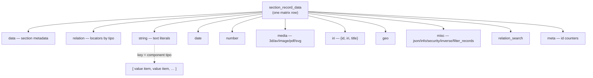

# The Dédalo data model

> See also: [Architecture overview](../architecture_overview.md) · [Sections](../sections/index.md) · [Components](../components/index.md) · [Locator](../locator.md) · [Glossary](../glossary.md)

This is the deep explanation of **how a value actually lives** inside Dédalo: the
JSON/JSONB foundation, the typed columns of the `matrix` row, the consolidated v7
**value item** envelope, and the path a value travels from the database to the
browser and back. Read [Sections](../sections/index.md) first if you want the
record-level picture (the `matrix` table, the section/`section_record` split);
this page zooms one level deeper, into the *shape of the data itself*.

The Dédalo data model is **not** a per-field SQL schema. It is one compact,
self-describing JSON model that every component shares — and v7 is the point
where that model was consolidated into a single, predictable contract. The whole
of this document explains that contract.

---

## 1. The JSON / JSONB foundation

Dédalo abandoned the per-entity SQL schema long ago: there is no `people` table
with a `name` column. Instead, every record of every section is **one row** of a
single matrix table, identified by the composite key
**`(section_tipo, section_id)`**, and the record's payload is stored as
**PostgreSQL `jsonb`**.

A record row is therefore not a flat set of scalar fields. It is a small set of
**typed JSONB columns**, and inside each column the payload is a `stdClass`
object **keyed by component ontology tipo** (`dd25`, `oh1`, `rsc85`, …). A
component never owns a database column of its own; it owns a *key* inside one of
the shared typed columns.

In the PHP server the in-memory mirror of one such row is
**`section_record_data`** (`core/section_record/class.section_record_data.php`).
It decodes each column **lazily**: the raw JSON string from the database is
parked in `$raw_data` and only promoted to a decoded object on first read
(`ensure_decoded()`), which keeps list mode cheap. It then exposes two access
levels:

- **column level** — `get_column_data($column)` / `set_column_data($column, $obj)`
- **key level** — `get_key_data($column, $key)` / `set_key_data($column, $key, $data)`,
  where *key* is the **component tipo**

```php
// read one component's data from the right typed column
$section_record->get_component_data( $tipo, $column );   // → array of value items

// write it back (still in memory)
$section_record->set_component_data( $tipo, $column, $data );

// flush to the database (one transaction)
$section_record->save_key_data( $save_path );
```

The TS server reads the same JSONB row through the passive `MatrixRecord`
struct (`readMatrixRecord`, `src/core/db/matrix.ts`) — parsed columns plus
their raw `::text` twins for byte-exact parity diffing — threaded explicitly
through the read pipeline instead of living on a stateful per-request object.
The column-level / key-level split above is re-expressed as pure functions over
that struct: `readComponentItems(record, tipo, model)` and
`filterItemsByLang(items, lang)` in `src/core/resolve/component_data.ts`
(`resolveComponentValue()` is the language-fallback wrapper the read pipeline
calls). Writes go through the chokepoint in `src/core/db/matrix_write.ts` /
`src/core/section/record/save_component.ts` — see `engineering/SECTION_SPEC.md` for
the write path.

!!! info "Two layers, one model"
    The [Sections](../sections/index.md) page describes the `matrix` row and the
    typed columns from the *storage* side. This page describes what is *inside*
    each key — the value item envelope every component reads and writes. They are
    the same data viewed at two altitudes.

---

## 2. The matrix typed columns

The authoritative column set is declared in
`section_record_data::$columns_name`. Each column decodes to a `stdClass`, and
(except for `data`) the object is keyed by component tipo.

| Column | Decoded shape | Stores (keyed by component tipo) |
| --- | --- | --- |
| `data` | `stdClass` | section-level metadata: label, `diffusion_info`, `created_by_user_id`, etc. (**not** keyed by tipo) |
| `relation` | `stdClass` | [locator](../locator.md) arrays grouped by tipo: `{"dd20":[locator,…], "dd35":[…]}` |
| `string` | `stdClass` | string literals (`component_input_text`, `component_text_area`, `component_email`, `component_password`) |
| `date` | `stdClass` | date objects (`component_date`) |
| `iri` | `stdClass` | IRI objects, e.g. `{"dd85":[{"id":1,"iri":"https://…","title":"…"}]}` (`component_iri`) |
| `geo` | `stdClass` | geolocation payloads (`component_geolocation`) |
| `number` | `stdClass` | numeric values (`component_number`) |
| `media` | `stdClass` | media descriptors (`component_3d`, `component_av`, `component_image`, `component_pdf`, `component_svg`) |
| `misc` | `stdClass` | direct-object components (`component_json`, `component_security_access`, `component_info`, `component_inverse`, `component_filter_records`) |
| `relation_search` | `stdClass` | auxiliary relation data for hierarchical / parent search (e.g. toponymy) |
| `meta` | `stdClass` | per-component id counters: `{"dd750":[{"count":3}], "dd201":[{"count":1}]}` |

Which column a given component writes into is **not** hardcoded inside the
component. In PHP it is resolved through the static registry
`section_record_data::$column_map` via `get_column_name($model)`:

```php
section_record_data::$column_map = [
    'component_input_text'  => 'string',
    'component_select'      => 'relation',
    'component_image'       => 'media',
    'component_json'        => 'misc',
    'component_date'        => 'date',
    'component_iri'         => 'iri',
    'component_number'      => 'number',
    'component_section_id'  => 'section_id',   // virtual integer PK, not a JSONB column
    'section'               => 'data',          // section metadata routing
    // …
];
```

Each PHP component instance caches its resolved column in `$data_column_name`.

The TS server resolves the same routing through `getColumnNameByModel(model)`
(`src/core/ontology/resolver.ts`), which reads the `column` field off each
model's descriptor in the component registry (`src/core/components/registry.ts`,
e.g. `component_input_text/descriptor.ts` declares `column: 'string'`) — the
one central table has become one field per model's own file, plus a small
`NON_COMPONENT_COLUMN_MAP` for the non-component `section → data` entry that
has no descriptor of its own. Two entries are special:

- **`component_section_id → 'section_id'`** is the integer primary-key column —
  *virtual*, not a JSONB column; callers handle it separately.
- **`'section' → 'data'`** routes section-level metadata into the `data` column.

```text
matrix row  (section_tipo = "rsc197", section_id = 1)
├─ data            { label, diffusion_info, created_by_user_id, … }
├─ string          { "rsc85":[{id,lang,value}], "rsc86":[…] }
├─ relation        { "rsc200":[locator, locator], … }
├─ date            { "rsc120":[date item] }
├─ number          { "rsc7":[{id,value}] }
├─ media           { "rsc44":[media descriptor] }
├─ iri · geo · misc · relation_search
└─ meta            { "rsc85":[{count:2}], "rsc200":[{count:5}] }
```



**Diagram — typed-column storage.** One `matrix` row is a set of typed JSONB
columns. Inside each column (except `data`) the object is keyed by component
tipo, and each key holds an **array of value items** — the multivalue model
described next.

---

## 3. The consolidated v7 VALUE ITEM `{id, lang?, value}`

Inside a column, a component's data for one tipo is **always an ARRAY of item
objects** — never a bare scalar. This is the multivalue model: even a so-called
"mono-value" component stores `[item]`, a one-element array. The consolidated v7
item envelope is:

```json
{ "id": 1, "lang": "lg-spa", "value": "L'Horta Sud" }
```

| Property | Meaning |
| --- | --- |
| **`id`** | A stable, **server-minted per-item identity** (integer). Unique within the component's items in this record, never recycled. It is the pairing key for [dataframes](../components/component_dataframe.md) and Time Machine, and the addressing key for client-driven edits. |
| **`lang`** | `lg-xxx` (`lg-spa`, `lg-eng`, …) for translatable components, or `lg-nolan` (`DEDALO_DATA_NOLAN`) for non-language values. The flat array interleaves all languages. |
| **`value`** | The payload. A scalar string/number for the value-property components. Structural components (date, iri, geo, media) **flatten their payload fields directly onto the item** instead of using a `value` wrapper. Empty values are **deliberately preserved** (not pruned). |

!!! note "Empty is not nothing"
    `{"value":""}` and `{"value":null}` are kept on purpose. A preserved empty
    item holds a multivalue position and keeps any [dataframe](../components/component_dataframe.md)
    attachment (paired by `id`) alive. Pruning empties would silently break
    pairing and Time Machine references.

### Which models carry an explicit `value`

The set of models whose item carries an explicit `value` property — the
`{id, value}` form — is the registry
`component_common::$components_using_value_property`:

```php
$components_using_value_property = [
    'component_email',
    'component_filter_records',
    'component_info',
    'component_input_text',
    'component_json',
    'component_number',
    'component_password',
    'component_text_area'
];
```

!!! info "TS status"
    The TS server does not yet carry an explicit port of
    `$components_using_value_property` / `$components_monovalue` as registries;
    the value-property vs. structural vs. locator split above is still
    documented from the PHP source of truth. Callers that need it today read
    the shape at the point of use (e.g. `resolveComponentValue()` in
    `src/core/resolve/component_data.ts` treats every model uniformly except
    for the translation gate, `descriptor.classSupportsTranslation`). Porting
    these two registries onto the component descriptor (alongside `column` and
    `classSupportsTranslation`) is open work — see `rewrite/STATUS.md`.

**Relation components do not use `value`.** Their item *is* a
[locator](../locator.md):

```json
{ "section_tipo": "oh1", "section_id": 7, "type": "dd63", "from_component_tipo": "rsc200" }
```

A relation item may additionally carry a `lang` and an `id` (for dataframe
pairing / ordering), but the locator object itself is the value — there is no
`value` wrapper.

### Mono-value vs multivalue

`component_common::$components_monovalue` lists the models that store an array
but use only `[0]` (e.g. the media components, `component_select`,
`component_geolocation`, `component_json`, `component_password`,
`component_text_area`). The storage shape is identical — an array — so a
mono-value field can become multivalue (or gain languages) without any data
rewrite.

```json
// component_input_text "rsc85", translatable, two languages
[
  { "id": 1, "lang": "lg-spa", "value": "Alicia" },
  { "id": 1, "lang": "lg-eng", "value": "Alicia" }
]
```

```json
// component_iri "dd85", structural payload flattened onto the item (no `value` wrapper)
[
  { "id": 1, "lang": "lg-nolan", "iri": "https://mysite.org", "title": "My site" }
]
```

---

## 4. `data` vs `value` vs the `datum.data` layer

Three distinct notions live close together. v7 uses the term **`data`**
throughout (not the v6 term `dato`).

=== "Raw stored data"

    The array of value-item envelopes exactly as persisted in the JSONB column.

    - Read via `section_record::get_component_data($tipo, $column)` →
      `section_record_data::get_key_data($column, $key)`.
    - The component-level accessor is **`get_data()`** (returns `data_resolved`
      when already resolved, else reads the section_record; has a Time-Machine
      branch when `data_source === 'tm'`).
    - `get_data_unchanged()` exposes the unguarded internal property for
      save-time comparison.
    - `get_data()` on a relation component returns **locators**, never resolved
      labels.

=== "Resolved value"

    The flattened, human-readable representation for display.

    - **`get_value()`** returns the flat string, delegating to the export atoms
      contract: `get_export_value()->to_flat_string()`. For relations this
      dereferences locators into labels.
    - **`get_grid_value()`** is the client visual-cell adapter over the same
      atoms.

=== "datum.data layer"

    The server→client transport.

    - `common::get_subdatum()` builds `$subdatum = {context, data}`, where `data`
      (`$ar_subdata`) is the per-locator resolved data the client consumes,
      paired with the structure `context`.

!!! warning "Do not confuse the three"
    `get_data()` is the raw envelope array (locators stay locators).
    `get_value()` is the resolved display string. `datum.data` is the
    client-facing transport object. Code that resolves labels belongs in the
    value/atoms path, never in `get_data()`.

See the [context & data layers](../request_config.md) flow for how `context` and
`data` are paired and delivered.

---

## 5. Server-minted stable item ids

Item ids are the backbone of v7's robustness. When `set_data($data)` runs, every
item lacking a valid id (`property_exists($el,'id') && id !== null && id !== ''`)
is passed to `set_data_item_counter()`, which calls
`section_record::allocate_component_ids($tipo, 1)`.

Allocation is **atomic**:

1. A PostgreSQL **session advisory lock** keyed by
   `table_section-tipo_section-id_tipo` guards the operation.
2. The persisted counter is re-read from `meta->$tipo->0->count`.
3. The new counter is `max(persisted, in_memory)`.
4. It is persisted **immediately** via `jsonb_set` and the freshly allocated
   range is returned.

The counter lives in the **`meta`** column
(`get_component_counter` / `set_component_counter`). Imports and migrations that
carry explicit ids are absorbed by `raise_component_counter()`, and `set_data()`
raises the counter to `max($ar_id)` — so original ids survive without future
collision.

!!! info "TS re-implementation, same guarantee"
    The TS server keeps the identical **counter law** — never-recycled ids,
    raised to `max(persisted, incoming)`, never lowered — but implements
    allocation without an explicit advisory lock:
    `allocateComponentItemId()` (`src/core/db/matrix_write.ts`) does the
    increment as a single `UPDATE … SET meta = jsonb_set(…, count+1) RETURNING`,
    relying on Postgres's own row-level lock to serialize concurrent callers
    (two allocations against the same row can never observe the same
    pre-increment count). Absorbing explicit ids from imports/migrations is a
    separate function, `absorbComponentItemIds()`, which raises the counter to
    `GREATEST(persisted, incoming max)` — the direct equivalent of
    `raise_component_counter()`. See the counter-law note in
    `src/core/concepts/section_record.ts`.

!!! tip "Why ids matter — dataframes and Time Machine"
    Because ids are **never recycled**, the [dataframe](../components/component_dataframe.md)
    `id_key` pairing (uncertainty / qualifiers / context attach to an item *by
    id*) and Time Machine references stay valid across edits, deletions and
    reorderings. Targeting by `id` — not by array index — is what makes an edit
    survive pagination and re-sorting. An array index is a position; an `id` is
    an identity.

---

## 6. The lang dimension

Translation is governed by the component flag **`$supports_translation`**, which
is *independent* of the ontology `$translatable` flag (a component may support
translation while its node is configured non-translatable).

- **When `false`** — language methods collapse to the full-data path and the
  single item uses `lg-nolan`. `get_data_lang()` simply returns `get_data()`.
- **When `true`** — the data array holds one logical position per language.
  `set_data_lang($data_lang, $lang)` clones items, stamps `lang`, strips the old
  slice for that lang, and merges. `get_data_lang($lang)` filters the flat array
  by `el->lang === $lang`.

```php
// get_data_lang filters the interleaved flat array by language
return (isset($el->lang) && $el->lang === $safe_lang);
```

`get_id_from_key` / `get_key_from_id` bridge the flat `[{id,lang,value}]` array
and per-language array positions (grouping by `lang`, then indexing by key
position). The flat array therefore interleaves every language, and the language
view is derived on demand.

The TS server carries the same class-level/ontology split as
`descriptor.classSupportsTranslation` on each model's descriptor (e.g.
`component_input_text/descriptor.ts` sets `classSupportsTranslation: true`),
read by `resolveComponentValue()` (`src/core/resolve/component_data.ts`) to
decide whether to lang-filter a component's items — independent of the
ontology's own `translatable` flag (`getTranslatableByTipo()`,
`src/core/ontology/resolver.ts`), exactly mirroring the PHP split above.

---

## 7. Server → client representation, and the change/save shape

The client receives data inside **`datum.data`** (paired with `context`), as
arrays of the same `{id, lang?, value|locator}` envelopes the server stores.
Edits are sent back as a **`changed_data`** object processed by
`update_data_value()` (called by `dd_core_api` on save):

| Field | Meaning |
| --- | --- |
| `action` | `insert` · `update` · `remove` · `set_data` · `sort_data` · `sort_by_column` · `add_new_element` · `force_save` |
| `id` | the stable item id targeted (`null` for `insert` → new id minted; `null` for `remove` → remove all) |
| `value` | the payload: a single item object, an array for `set_data`, or `null` |

```json
// insert a new item (id minted server-side)
{ "action": "insert", "id": null, "value": { "value": "New", "lang": "lg-eng" } }
```

```json
// update an existing item, addressed by its stable id
{ "action": "update", "id": "1", "value": { "value": "Updated", "lang": "lg-eng" } }
```

```json
// reorder items (positions, not ids)
{ "action": "sort_data", "source_key": 0, "target_key": 2 }
```

On save, `set_data` snapshots the prior state into `$db_data` (a JSON clone) so
the diff against the new data drives **Time Machine** versioning.
`get_time_machine_data_to_save()` merges the component's language slice with all
its [dataframe](../components/component_dataframe.md) items under the main tipo
(reverse-split on TM playback). Targeting by **`id`**, not array index, is what
makes these edits robust to reordering and pagination.

```mermaid
flowchart LR
    DB[("matrix row<br/>JSONB columns")] -->|get_component_data| RAW["raw value items<br/>[{id,lang,value|locator}]"]
    RAW -->|get_value / atoms| VAL["resolved value (string)"]
    RAW -->|get_subdatum| SUB["datum = {context, data}"]
    SUB -->|JSON API| CLIENT["browser model"]
    CLIENT -->|changed_data {action,id,value}| UDV["update_data_value()"]
    UDV -->|set_data + id minting| DB
```

**Diagram — the round trip.** Raw value items leave the typed columns; the atoms
path resolves them for display; `get_subdatum` pairs them with structure context
for the client; the client returns `changed_data` keyed by stable `id`;
`update_data_value()` applies it, mints any missing ids, and writes back.

---

## 8. v7 consolidation — the solid foundation of a long evolution

Dédalo's data model has evolved across many versions. v7 is the release that
**consolidated** it into a single, predictable contract — the foundation
everything else now builds on:

- **One envelope for everything.** Every component, literal or relational, reads
  and writes the same `{id, lang?, value|locator}` array. No bespoke per-field
  shapes.
- **`value` made explicit.** Value-bearing models declare themselves in
  `$components_using_value_property`; relations carry locators. The shape is
  discoverable from a registry, not guessed.
- **Stable, server-minted ids.** Identity is decoupled from array position,
  which is what made [dataframes](../components/component_dataframe.md) and a
  reliable Time Machine possible.
- **Column routing by registry.** `$column_map` resolves storage centrally;
  adding a component does not touch the storage layer.
- **Empties preserved.** Multivalue positions and dataframe attachments survive
  blank values.
- **`data` (not `dato`).** v7 settled the vocabulary: raw `data`, resolved
  `value`, transport `datum.data`.

This is why the per-type pages below can each be described with the *same* small
set of questions — what the value item looks like, which column it lives in, and
which components produce it. The model is uniform by design.

---

## The data types — index

Each data type is one shape of the value item (or one typed column) in the model
above. The pages below document each in the per-type format (what it is,
canonical JSON shape, its database column and keying, producing components,
server class, client model, examples, and a v7 consolidation note).

| Data type | Column | Value item shape | Produced by |
| --- | --- | --- | --- |
| **[String](string.md)** | `string` | `{id, lang?, value: string}` | `component_input_text`, `component_text_area`, `component_email`, `component_password` |
| **[Number](number.md)** | `number` | `{id, value: number}` | `component_number` |
| **[Date](dd_date.md)** | `date` | `{start, end?, period?, …}` (payload flattened) | `component_date` |
| **[IRI](iri.md)** | `iri` | `{id, iri, title?, lang?}` (payload flattened) | `component_iri` |
| **[Geo](geolocation.md)** | `geo` | GeoJSON item (payload flattened) | `component_geolocation` |
| **[Media](media.md)** | `media` | media descriptor | `component_3d`, `component_av`, `component_image`, `component_pdf`, `component_svg` |
| **[Relation (locator)](../locator.md)** | `relation` | `{section_tipo, section_id, type, from_component_tipo, lang?, id?}` | `component_select`, `component_portal`, `component_check_box`, `component_relation_*`, `component_dataframe`, `component_filter`, … |
| **[Misc / direct object](misc.md)** | `misc` | direct `stdClass` | `component_json`, `component_security_access`, `component_info`, `component_inverse`, `component_filter_records` |
| **[Meta (id counters)](misc.md#the-meta-column)** | `meta` | `{count: int}` per tipo | the id-minting machinery (`allocate_component_ids`) |
| **[Section metadata](#2-the-matrix-typed-columns)** | `data` | section-level object (not keyed by tipo) | the `section` node |

---

## See also

- [Sections](../sections/index.md) — the `matrix` row, the typed-column storage
  and the section/`section_record` split that owns it.
- [Components](../components/index.md) — the fields that produce each data type.
- [Locator](../locator.md) — the value item of every relation component.
- [`component_dataframe`](../components/component_dataframe.md) — how items are
  paired by stable `id` (`id_key`).
- [Request config](../request_config.md) — how `context` and `data` are paired
  and delivered to the client.
- [Glossary](../glossary.md) — tipo, model, locator, subdata, ddo, datum.
- [Architecture overview](../architecture_overview.md) — where the data model
  sits in the wider system.
