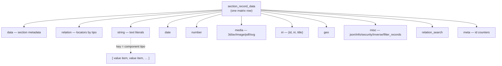

# The Dédalo data model

> See also: [Architecture overview](../architecture_overview.md) · [Sections](../sections/index.md) · [Components](../components/index.md) · [Locator](../locator.md) · [Glossary](../glossary.md)

This is the deep explanation of **how a value actually lives** inside Dédalo: the
JSON/JSONB foundation, the typed columns of the `matrix` row, the consolidated v7
**value item** envelope, and the path a value travels from the database to the
browser and back. Read [Sections](../sections/index.md) first if you want the
record-level picture (the `matrix` table, the section/`section_record` split);
this page zooms one level deeper, into the *shape of the data itself*.

The Dédalo data model is **not** a per-field SQL schema. It is one compact,
self-describing JSON model that every component shares — and v7 is the point
where that model was consolidated into a single, predictable contract. The whole
of this document explains that contract.

---

## 1. The JSON / JSONB foundation

Dédalo abandoned the per-entity SQL schema long ago: there is no `people` table
with a `name` column. Instead, every record of every section is **one row** of a
single matrix table, identified by the composite key
**`(section_tipo, section_id)`**, and the record's payload is stored as
**PostgreSQL `jsonb`**.

A record row is therefore not a flat set of scalar fields. It is a small set of
**typed JSONB columns** (`MATRIX_JSONB_COLUMNS`, `src/core/db/matrix.ts`), and
inside each column the payload is an object **keyed by component ontology
tipo** (`dd25`, `oh1`, `rsc85`, …). A component never owns a database column of
its own; it owns a *key* inside one of the shared typed columns.

The server reads a matrix row through the passive `MatrixRecord` struct
(`readMatrixRecord`, `src/core/db/matrix.ts`) — parsed columns plus their raw
`::text` twins for byte-exact parity diffing — threaded explicitly through the
read pipeline instead of living on a stateful per-request object. Column-level
and key-level access are pure functions over that struct: `readComponentItems(record, tipo, model)`
reads one component's array of value items from the right typed column, and
`filterItemsByLang(items, lang)` narrows it by language (both in
`src/core/resolve/component_data.ts`; `resolveComponentValue()` is the
language-fallback wrapper the read pipeline calls). Writes go through the
chokepoint in `src/core/db/matrix_write.ts` / `src/core/section/record/save_component.ts`.

!!! info "Two layers, one model"
    The [Sections](../sections/index.md) page describes the `matrix` row and the
    typed columns from the *storage* side. This page describes what is *inside*
    each key — the value item envelope every component reads and writes. They are
    the same data viewed at two altitudes.

---

## 2. The matrix typed columns

The authoritative column set is `MATRIX_JSONB_COLUMNS` (`src/core/db/matrix.ts`).
Each column decodes to an object, and (except for `data`) that object is keyed
by component tipo.

| Column | Decoded shape | Stores (keyed by component tipo) |
| --- | --- | --- |
| `data` | `stdClass` | section-level metadata: label, `diffusion_info`, `created_by_user_id`, etc. (**not** keyed by tipo) |
| `relation` | `stdClass` | [locator](../locator.md) arrays grouped by tipo: `{"dd20":[locator,…], "dd35":[…]}` |
| `string` | `stdClass` | string literals (`component_input_text`, `component_text_area`, `component_email`, `component_password`) |
| `date` | `stdClass` | date objects (`component_date`) |
| `iri` | `stdClass` | IRI objects, e.g. `{"dd85":[{"id":1,"iri":"https://…","title":"…"}]}` (`component_iri`) |
| `geo` | `stdClass` | geolocation payloads (`component_geolocation`) |
| `number` | `stdClass` | numeric values (`component_number`) |
| `media` | `stdClass` | media descriptors (`component_3d`, `component_av`, `component_image`, `component_pdf`, `component_svg`) |
| `misc` | `stdClass` | direct-object components (`component_json`, `component_security_access`, `component_info`, `component_inverse`, `component_filter_records`) |
| `relation_search` | `stdClass` | auxiliary relation data for hierarchical / parent search (e.g. toponymy) |
| `meta` | `stdClass` | per-component id counters: `{"dd750":[{"count":3}], "dd201":[{"count":1}]}` |

Which column a given component writes into is **not** hardcoded inside the
component. It is resolved through `getColumnNameByModel(model)`
(`src/core/ontology/resolver.ts`), which reads the `column` field off each
model's descriptor in the component registry (`src/core/components/registry.ts`,
e.g. `component_input_text/descriptor.ts` declares `column: 'string'`) — one
field per model's own file, plus a small `NON_COMPONENT_COLUMN_MAP` for the
non-component `section → data` entry that has no descriptor of its own. Two
entries are special:

- **`component_section_id → 'section_id'`** is the integer primary-key column —
  *virtual*, not a JSONB column; callers handle it separately.
- **`'section' → 'data'`** routes section-level metadata into the `data` column.

```text
matrix row  (section_tipo = "rsc197", section_id = 1)
├─ data            { label, diffusion_info, created_by_user_id, … }
├─ string          { "rsc85":[{id,lang,value}], "rsc86":[…] }
├─ relation        { "rsc200":[locator, locator], … }
├─ date            { "rsc120":[date item] }
├─ number          { "rsc7":[{id,value}] }
├─ media           { "rsc44":[media descriptor] }
├─ iri · geo · misc · relation_search
└─ meta            { "rsc85":[{count:2}], "rsc200":[{count:5}] }
```



**Diagram — typed-column storage.** One `matrix` row is a set of typed JSONB
columns. Inside each column (except `data`) the object is keyed by component
tipo, and each key holds an **array of value items** — the multivalue model
described next.

---

## 3. The consolidated v7 VALUE ITEM `{id, lang?, value}`

Inside a column, a component's data for one tipo is **always an ARRAY of item
objects** — never a bare scalar. This is the multivalue model: even a so-called
"mono-value" component stores `[item]`, a one-element array. The consolidated v7
item envelope is:

```json
{ "id": 1, "lang": "lg-spa", "value": "L'Horta Sud" }
```

| Property | Meaning |
| --- | --- |
| **`id`** | A stable, **server-minted per-item identity** (integer). Unique within the component's items in this record, never recycled. It is the pairing key for [dataframes](../components/component_dataframe.md) and Time Machine, and the addressing key for client-driven edits. |
| **`lang`** | `lg-xxx` (`lg-spa`, `lg-eng`, …) for translatable components, or `lg-nolan` (`DEDALO_DATA_NOLAN`) for non-language values. The flat array interleaves all languages. |
| **`value`** | The payload. A scalar string/number for the value-property components. Structural components (date, iri, geo, media) **flatten their payload fields directly onto the item** instead of using a `value` wrapper. Empty values are **deliberately preserved** (not pruned). |

!!! note "Empty is not nothing"
    `{"value":""}` and `{"value":null}` are kept on purpose. A preserved empty
    item holds a multivalue position and keeps any [dataframe](../components/component_dataframe.md)
    attachment (paired by `id`) alive. Pruning empties would silently break
    pairing and Time Machine references.

### Which models carry an explicit `value`

The set of models whose item carries an explicit `value` property — the
`{id, value}` form — is the eight descriptors that declare
`importValueProperty: true` (`src/core/components/types.ts`), checked through
`usesImportValueProperty(model)` (`src/core/components/registry.ts`):

```text
component_email · component_filter_records · component_info ·
component_input_text · component_json · component_number ·
component_password · component_text_area
```

**Relation components do not use `value`.** Their item *is* a
[locator](../locator.md):

```json
{ "section_tipo": "oh1", "section_id": 7, "type": "dd63", "from_component_tipo": "rsc200" }
```

A relation item may additionally carry a `lang` and an `id` (for dataframe
pairing / ordering), but the locator object itself is the value — there is no
`value` wrapper.

### Mono-value vs multivalue

Some fields are conceptually single-valued (one geolocation, one JSON blob)
while others hold many. The storage shape does not distinguish them: both are
an array of value items, a single-valued field simply never grows past one
element. Because the shape is identical, a field can become multivalue (or
gain languages) later without any data rewrite.

```json
// component_input_text "rsc85", translatable, two languages
[
  { "id": 1, "lang": "lg-spa", "value": "Alicia" },
  { "id": 1, "lang": "lg-eng", "value": "Alicia" }
]
```

```json
// component_iri "dd85", structural payload flattened onto the item (no `value` wrapper)
[
  { "id": 1, "lang": "lg-nolan", "iri": "https://mysite.org", "title": "My site" }
]
```

---

## 4. `data` vs `value` vs the `datum.data` layer

Three distinct notions live close together. v7 uses the term **`data`**
throughout (not the v6 term `dato`).

=== "Raw stored data"

    The array of value-item envelopes exactly as persisted in the JSONB column.

    - Read via `readComponentItems(record, tipo, model)`
      (`src/core/resolve/component_data.ts`) — the per-component array of
      value items pulled from the record's typed column.
    - A save reads this same current item array first, applies each change,
      then writes the FULL updated array back — not a delta
      (`src/core/section/record/save_component.ts`) — and appends a Time
      Machine audit row with the new snapshot.
    - Raw data for a relation component is the **locator array**, never
      resolved labels.

=== "Resolved value"

    The flattened, human-readable representation for display.

    - **`resolveCellValue()`** (`src/core/resolve/relation_list.ts`) returns the
      flat string, dispatching on each model's declared `flatValue` family
      (`getFlatValueFamily`, `src/core/components/registry.ts`) — `string`,
      `datalist` (locators dereferenced to labels), `date`, `iri`, `media` or
      `section_id`.
    - The export path (`src/diffusion/export/atoms.ts`) builds the same
      flattened strings for tabular export.

=== "datum.data layer"

    The server→client transport.

    - `emitDdoData` (`src/core/section/read.ts`) builds `{context, data}`,
      where `data` is the per-locator resolved data the client consumes,
      paired with the structure `context`.

!!! warning "Do not confuse the three"
    `readComponentItems()` returns the raw envelope array (locators stay
    locators). `resolveCellValue()` returns the resolved display string.
    `datum.data` is the client-facing transport object. Code that resolves
    labels belongs in the flatValue/export-atoms path, never in the raw item
    read.

See the [context & data layers](../request_config.md) flow for how `context` and
`data` are paired and delivered.

---

## 5. Server-minted stable item ids

Item ids are the backbone of v7's robustness. Every item lacking a valid id
(present, non-null, non-empty) is allocated one when the component's data is
saved (`src/core/section/record/save_component.ts`).

Allocation is **atomic**: `allocateComponentItemId()`
(`src/core/db/matrix_write.ts`) does the increment as a single `UPDATE … SET
meta = jsonb_set(…, count + 1) RETURNING`, relying on Postgres's own
row-level lock to serialize concurrent callers — two allocations against the
same row can never observe the same pre-increment count. The counter lives in
the **`meta`** column, e.g. `{"dd750":[{"count":3}]}`. Imports and migrations
that carry explicit ids are absorbed by `absorbComponentItemIds()`, which
raises the counter to `GREATEST(persisted, incoming max)` — **never lowers
it** — so original ids survive without future collision. See the counter-law
note in `src/core/concepts/section_record.ts`.

!!! tip "Why ids matter — dataframes and Time Machine"
    Because ids are **never recycled**, the [dataframe](../components/component_dataframe.md)
    `id_key` pairing (uncertainty / qualifiers / context attach to an item *by
    id*) and Time Machine references stay valid across edits, deletions and
    reorderings. Targeting by `id` — not by array index — is what makes an edit
    survive pagination and re-sorting. An array index is a position; an `id` is
    an identity.

---

## 6. The lang dimension

Translation is governed by the component's CLASS-level `classSupportsTranslation`
flag, declared on each model's descriptor (e.g. `component_input_text/descriptor.ts`
sets `classSupportsTranslation: true`) — deliberately *independent* of the
ontology's own `translatable` flag (`getTranslatableByTipo()`,
`src/core/ontology/resolver.ts`). A component may support translation while its
ontology node is configured non-translatable.

`resolveComponentValue()` (`src/core/resolve/component_data.ts`) reads
`classSupportsTranslation` to decide whether to lang-filter a component's
items:

- **When `false`** — the full item array is returned unfiltered, and the
  single item uses `lg-nolan`.
- **When `true`** — the data array holds one logical position per language,
  all interleaved in the same flat array. `filterItemsByLang(items, lang)`
  narrows it to the items whose `lang` matches.

The flat array interleaves every language; the per-language view is derived
on demand rather than stored separately.

---

## 7. Server → client representation, and the change/save shape

The client receives data inside **`datum.data`** (paired with `context`), as
arrays of the same `{id, lang?, value|locator}` envelopes the server stores.
Edits are sent back as a **`changed_data`** object processed by
`update_data_value()` (called by `dd_core_api` on save):

| Field | Meaning |
| --- | --- |
| `action` | `insert` · `update` · `remove` · `set_data` · `sort_data` · `sort_by_column` · `add_new_element` · `force_save` |
| `id` | the stable item id targeted (`null` for `insert` → new id minted; `null` for `remove` → remove all) |
| `value` | the payload: a single item object, an array for `set_data`, or `null` |

```json
// insert a new item (id minted server-side)
{ "action": "insert", "id": null, "value": { "value": "New", "lang": "lg-eng" } }
```

```json
// update an existing item, addressed by its stable id
{ "action": "update", "id": "1", "value": { "value": "Updated", "lang": "lg-eng" } }
```

```json
// reorder items (positions, not ids)
{ "action": "sort_data", "source_key": 0, "target_key": 2 }
```

On save, `set_data` snapshots the prior state into `$db_data` (a JSON clone) so
the diff against the new data drives **Time Machine** versioning.
`get_time_machine_data_to_save()` merges the component's language slice with all
its [dataframe](../components/component_dataframe.md) items under the main tipo
(reverse-split on TM playback). Targeting by **`id`**, not array index, is what
makes these edits robust to reordering and pagination.

```mermaid
flowchart LR
    DB[("matrix row<br/>JSONB columns")] -->|get_component_data| RAW["raw value items<br/>[{id,lang,value|locator}]"]
    RAW -->|get_value / atoms| VAL["resolved value (string)"]
    RAW -->|get_subdatum| SUB["datum = {context, data}"]
    SUB -->|JSON API| CLIENT["browser model"]
    CLIENT -->|changed_data {action,id,value}| UDV["update_data_value()"]
    UDV -->|set_data + id minting| DB
```

**Diagram — the round trip.** Raw value items leave the typed columns; the atoms
path resolves them for display; `get_subdatum` pairs them with structure context
for the client; the client returns `changed_data` keyed by stable `id`;
`update_data_value()` applies it, mints any missing ids, and writes back.

---

## 8. v7 consolidation — the solid foundation of a long evolution

Dédalo's data model has evolved across many versions. v7 is the release that
**consolidated** it into a single, predictable contract — the foundation
everything else now builds on:

- **One envelope for everything.** Every component, literal or relational, reads
  and writes the same `{id, lang?, value|locator}` array. No bespoke per-field
  shapes.
- **`value` made explicit.** Value-bearing models declare themselves in
  `$components_using_value_property`; relations carry locators. The shape is
  discoverable from a registry, not guessed.
- **Stable, server-minted ids.** Identity is decoupled from array position,
  which is what made [dataframes](../components/component_dataframe.md) and a
  reliable Time Machine possible.
- **Column routing by registry.** `$column_map` resolves storage centrally;
  adding a component does not touch the storage layer.
- **Empties preserved.** Multivalue positions and dataframe attachments survive
  blank values.
- **`data` (not `dato`).** v7 settled the vocabulary: raw `data`, resolved
  `value`, transport `datum.data`.

This is why the per-type pages below can each be described with the *same* small
set of questions — what the value item looks like, which column it lives in, and
which components produce it. The model is uniform by design.

---

## The data types — index

Each data type is one shape of the value item (or one typed column) in the model
above. The pages below document each in the per-type format (what it is,
canonical JSON shape, its database column and keying, producing components,
server class, client model, examples, and a v7 consolidation note).

| Data type | Column | Value item shape | Produced by |
| --- | --- | --- | --- |
| **[String](string.md)** | `string` | `{id, lang?, value: string}` | `component_input_text`, `component_text_area`, `component_email`, `component_password` |
| **[Number](number.md)** | `number` | `{id, value: number}` | `component_number` |
| **[Date](dd_date.md)** | `date` | `{start, end?, period?, …}` (payload flattened) | `component_date` |
| **[IRI](iri.md)** | `iri` | `{id, iri, title?, lang?}` (payload flattened) | `component_iri` |
| **[Geo](geolocation.md)** | `geo` | GeoJSON item (payload flattened) | `component_geolocation` |
| **[Media](media.md)** | `media` | media descriptor | `component_3d`, `component_av`, `component_image`, `component_pdf`, `component_svg` |
| **[Relation (locator)](../locator.md)** | `relation` | `{section_tipo, section_id, type, from_component_tipo, lang?, id?}` | `component_select`, `component_portal`, `component_check_box`, `component_relation_*`, `component_dataframe`, `component_filter`, … |
| **[Misc / direct object](misc.md)** | `misc` | direct `stdClass` | `component_json`, `component_security_access`, `component_info`, `component_inverse`, `component_filter_records` |
| **[Meta (id counters)](misc.md#the-meta-column)** | `meta` | `{count: int}` per tipo | the id-minting machinery (`allocate_component_ids`) |
| **[Section metadata](#2-the-matrix-typed-columns)** | `data` | section-level object (not keyed by tipo) | the `section` node |

---

## See also

- [Sections](../sections/index.md) — the `matrix` row, the typed-column storage
  and the section/`section_record` split that owns it.
- [Components](../components/index.md) — the fields that produce each data type.
- [Locator](../locator.md) — the value item of every relation component.
- [`component_dataframe`](../components/component_dataframe.md) — how items are
  paired by stable `id` (`id_key`).
- [Request config](../request_config.md) — how `context` and `data` are paired
  and delivered to the client.
- [Glossary](../glossary.md) — tipo, model, locator, subdata, ddo, datum.
- [Architecture overview](../architecture_overview.md) — where the data model
  sits in the wider system.
