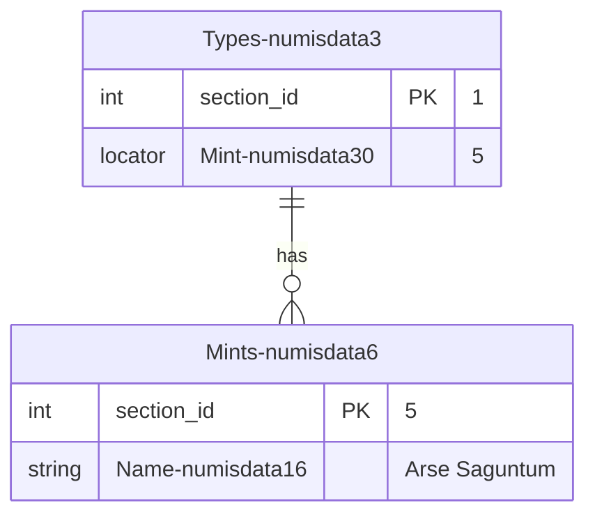

# Importing data

## Introduction

To import data is a important part of Dédalo projects. Dédalo is a high structured data system, it manage relations between data and the data normalization is in the core of the application. Dédalo use a list, thesaurus, resources and other related section to define his data.

Dédalo data model has a abstraction layer that use the ontology definitions to create components (as fields) and sections (as tables).

??? note "About pain text / non-normalized data"

    Lots of catalogues in museums have a previous cataloging system, sometimes do it by itself in commercial applications as FileMaker, Access, etc. and sometimes this data has not structure and is saved as plain text without normalization. This situation create a lots of data inconsistences that could generate a very difficult situations to resolve. Dédalo can import plain text without any structuring but it is not recommended. If you want import this kind of data, we recommend to do a clean process before import to Dédalo.

## Format

Dédalo use the [standard csv](https://datatracker.ietf.org/doc/html/rfc4180) to import data with [UTF-8](http://www.unicode.org/versions/latest/) codification without BOM (Byte Order Mark).

!!! warning

    Any other encoding different of UTF are not supported. Bad encoding files could break the import process at any time and the data imported could has typos and errors.

??? note "Byte Order Mark (BOM)"

    BOM is accepted in some cases, but in general and according to the Unicode standard, the [BOM for UTF-8](http://www.unicode.org/versions/Unicode15.0.0/ch02.pdf) files is not recommended:

    ***2.6 Encoding Schemes***

    *... Use of a BOM is neither required nor recommended for UTF-8, but may be encountered in contexts where UTF-8 data is converted from other encoding forms that use a BOM or where the BOM is used as a UTF-8 signature. See the “Byte Order Mark” subsection in Section 23.8, Specials, for more information...*

By default Dédalo use a stringify JSON encoding in UTF-8 with double quotes `""` escaped marks for the data.

Example of [locator](locator.md):

```json
[{
    "type":"dd151",
    "section_id":"2",
    "section_tipo":"rsc723"
}]
```

Will need to be encoded in csv format as:

> "\[{""type"":""dd151"",""section_id"":""2"",""section_tipo"":""rsc723""}]"

But is possible to use a plain text to import flat data.

Example of text:

```txt
My plain text without double quotes
```

Will need to be encoded in csv format as:

> My plain text without double quotes

Example of text with double quotes inside:

```txt
my plain text with "double quotes"
```

Will need to be encoded in csv format as:

> "my plain text with ""double quotes"""

## File nomenclature (optional)

Is highly recommended to use only [accii](https://itscj.ipsj.or.jp/ir/006.pdf) characters in the name of import files, so try to use names without spaces, accents or any special character.

### Adding the section to the filename

Filenames can be using to detect the section automatically when import, is possible specify it in this way:

> my_name_to_identify_data-section_tipo.csv

Example, file with interviews data to import in Interviews section [oh1](https://dedalo.dev/ontology/oh1):

> interviews_2015-oh1.csv

But is possible indicate the destination section in the import csv tool.

## Using editors

Is possible use a editor to create the csv import files. If you want to use spreadsheet editor as LibreOffice [Calc](https://www.libreoffice.org/discover/calc/), remember that you will need to export csv with UTF-8 encoding.

## Using a spreadsheet

Dédalo data can be represented as a spreadsheet, with columns and rows, columns represent the components(fields), rows represent the records.

Every csv import file represent a section, if you need import multiple sections you will need a csv file for every section. To import in Types section [numisdata3](https://dedalo.dev/ontology/numisdata3), the name of the csv must be has this section_tipo as:

> my_import_types-numisdata3.csv

Every column represent a component(field) and every row represent a record, data will be the cell that crosses the column and the row.

| column A | column B | column X |
| ---------- | ---------- | ---------- |
| data1A   | data1B   | data1X   |
| data1B   | data2B   | data2X   |

### Defining the target component in the column name

Every column in the first row in the file, the head, will content the ontology tipo of the target component of the section to be imported. At least one column need to be set as the section_id to identify the column with the unique id, by convention it will be the first one, but it is not mandatory.

To import the component `Key` [numisdata81](https://dedalo.dev/ontology/numisdata81) and the component `Number` [numisdata27](https://dedalo.dev/ontology/numisdata27) as fields do the `Types` section [numisdata3](https://dedalo.dev/ontology/numisdata3), you will need to create a csv as:

| section_id | numisdata81 | numisdata27 |
| --- | --- | --- |
| 1 | \["key1"] | \["062"]  |
| 2 | \["key2"] | \["685a"]  |

!!! note "Columns with names instead ontology tipo"
    Is possible use "human" names in the columns, but the import tool will not match with the component and you will need to set manually before import.

    the previous csv could be named in this way:

    | id | Key | Number |
    | --- |   --- |   --- |
    | 1 | \["key1"] | \["062"]  |
    | 2 | \["key2"] | \["685a"]  |

    But it will not match and you will need to set the component tipo inside the import tool.

You can know the ontology tipo of the component picking one component and Dédalo will show it inside the info part of the inspector:


Besides, Dédalo will show the component data format and it is possible to copy it. In this case `["062"]`

Also you can check the ontology [here](https://dedalo.dev/ontology).

## Data formats

In general Dédalo import a [stringify](https://developer.mozilla.org/en-US/docs/Web/JavaScript/Reference/Global_Objects/JSON/stringify) [JSON](https://www.json.org/json-en.html) for every data. But, for create a useful and easy import process, is possible use a string representation formats of data.

---

### Plain text

By default import model use the JSON format of his data, an object with lang properties and values in array.

```json
{
    "lg-spa" : ["mi dato para importar", "Otro dato"],
    "lg-eng" : ["my import data", "Other data to import"]
}
```

As Dédalo import use a csv without format, JSON data need to be stringified in this way:

The table to import

| section_id    | oh14                                              |
| ------------  | :----------------------------------------------:  |
| 1             | {"lg-spa": \["mi dato para importar","Otro dato"]} |

Will be encoded in csv format as:

```csv
section_id;rsc86
1;"{""lg-spa"":[""mi dato para importar"",""Otro dato""]}"
```

#### Alternative formats to import text

1. An array of string values

    ```json
    ["mi dato para importar", "Otro dato"]
    ```

    In this case the import process assume the Dédalo data lang defined by the user in menu and will save into this lang, or if the component is non translatable will use `lg-nolan` to save import data.

    Example:

    section_id | oh14
    --- | ---
    1 | \["mi dato para importar","Otro dato"]

2. Plain text

    ```json
    new data to import
    ```

    Example:

    section_id | oh14
    --- | ---
    1 | new data to import

    In this case the import process assume the Dédalo data lang defined by the user in menu and will import the value as unique value in the array, if exists previous data it will be replace with a new array with the import value.

    If the data in database is:

    ```json
    {
        "lg-spa" : ["mi dato importado", "Otro dato"],
        "lg-eng" : ["my imported data", "Other data"]
    }
    ```

    and the Dédalo data lang is set to English, after import plain text, the final data will be:

     ```json
    {
        "lg-spa" : ["mi dato importado", "Otro dato"],
        "lg-eng" : ["new data to import"]
    }
    ```

    Plain text is easy to import, but it is limited in the data control. take account of the language set in the menu.

---

### Numbers

By default import model use the JSON format of his value, as the component do not use languages the main format to import is the array of values.

```json
[104,-75.35]
```

As Dédalo import use a csv without format, JSON data need to be stringified in this way:

The table to import

| section_id    | numisdata133     |
| ------------  | :--------------: |
| 1             | \[104,-75.35]    |

Will be encoded in csv format as:

```csv
section_id;rsc86
1;[104,-75.35]
```

#### Alternative formats to import numbers

1. Plain number

    ```json
    33.85
    ```

    Example:

    section_id   | numisdata133
    ------------ | :--------------:
    1            | 33.85

    In this case the import process assume this data as the full data, if exists previous data it will be replace with a new array with the import value.

    If the data in database is:

    ```json
    {
        "lg-nolan" : [104,-75.35]
    }
    ```

    after import plain number, the final data will be:

     ```json
    {
        "lg-nolan" : [33.85]
    }
    ```

    Plain number is easy to import, but it is limited in the data control.

---

### Dates

By default import model use the JSON format of his value, as the component do not use languages the main format to import is the array of dd_date objects.

```json
[{
   "start" : {
        "year": 1238,
        "month": 10,
        "day": 9
    }
}]
```

As Dédalo import use a csv without format, JSON data need to be stringified in this way:

The table to import

| section_id    | tch56     |
| ------------  | :--------------: |
| 1             | \[{"start":{"year":1238,"month":10,"day":9}}]   |

Will be encoded in csv format as:

```csv
section_id;tch56
1;"[{""start"":{""year"":1238,""month"":10,""day"":9}}]"
```

#### Alternative formats to import dates

1. A punctual date in flat string :

    ```json
    -205/05
    ```

    Example:

    section_id   | tch56
    ------------ | :--------------:
    1            | -205/05

    It's allowed to use different [formats](#using-other-date-formats) indicating it in the name of the header as tch56_dmy.

    section_id   | tch56_dmy
    ------------ | :--------------:
    1            | 05/-205

    It's allowed to use different separator between [values of elements](#using-other-separators).

    ```json
    -205-05
    15-11--50
    15.11.-50
    ```

2. A range of dates in flat string:

     ```json
    2023/10/26<>2023/10/27
    ```

    The '<>' separator indicate the range with the start date at left and end date at right.

    ```json
    [{
        "start" : {
            "year": 2023,
            "month": 10,
            "day": 26
        },
        "end" : {
            "year": 2023,
            "month": 10,
            "day": 27
        }
    }]
    ```

    Is possible to leave spaces between dates and the separator.

     ```json
    -150 <>      238
    ```

    Is a valid range date, but the separator will be always in same format, a space between marks are not allowed:

     ```json
    -150< >238
    ```

    it's not a valid range.

    It's allowed to use different [formats](#using-other-date-formats) indicating it in the name of the header as tch56_dmy.

    section_id   | tch56_mdy
    ------------ | :--------------:
    1            | 10/26/2023<>10/27/2023

     It's allowed to use different separator between [values of elements](#using-other-separators).

    ```json
    10-26-2023<>10-27-2023
    10.26.2023<>10.27.2023
    ```

3. Multi value date in flat string

    ```json
    2023/10/26|1853/02/18
    ```

    The '|' separator indicate multiple values. The values are not a star <> end dates, both are start dates, the second one is the start date of the second value.

    The previous string date will be parse as:

     ```json
    [
        {
            "start" : {
                "year": 2023,
                "month": 10,
                "day": 26
            }
        },
        {
            "start" : {
                "year": 1853,
                "month": 02,
                "day": 18
            }
        }
    ]
    ```

    Is possible to leave spaces between dates and the separator.

    ```json
    -150 |          -25
    ```

    It's allowed to use different [formats](#using-other-date-formats) indicating it in the name of the header as tch56_dmy.

    section_id   | tch56_mdy
    ------------ | :--------------:
    1            | 10/26/2023\|02/18/1853

    It's allowed to use different separator between [values of elements](#using-other-separators).

    ```json
    10-26-2023\|02-18-1853
    10.26.2023\|02.18.1853
    ```

4. Combination of multi value and range

    ```json
    2023/10/26<>2023/10/27|1853/02/18
    ```

    To define multiple values with ranges is possible to use a combination of the '|' to indicate the multi value and the '<>' to indicate the range.

     The previous string date will be parse as two date values with the range of the first value with star and end dates:

     ```json
    [
        {
            "start" : {
                "year": 2023,
                "month": 10,
                "day": 26
            },
            "end" : {
                "year": 2023,
                "month": 10,
                "day": 27
            }
        },
        {
            "start" : {
                "year": 1853,
                "month": 02,
                "day": 18
            }
        }
    ]
    ```

    Is possible leave a part of the range blank:

     ```json
    2023/10/26|<>1853/02/18
    ```

     ```json
    [
        {
            "start" : {
                "year": 2023,
                "month": 10,
                "day": 26
            }
        },
        {
            "end" : {
                "year": 1853,
                "month": 02,
                "day": 18
            }
        }
    ]
    ```

    Is possible to leave spaces between dates and the separators.

    ```json
    2023/10/26 |   <>  1853/02/18
    ```

    It's allowed to use different [formats](#using-other-date-formats) indicating it in the name of the header as tch56_dmy.

    section_id   | tch56_mdy
    ------------ | :--------------:
    1            | 10/26/2023\|<>02/18/1853

    It's allowed to use different separator between [values of elements](#using-other-separators).

    ```json
    10-26-2023\|<>02-18-1853
    10.26.2023\|<>02.18.1853

##### Using other date formats

By default the string date formats use \[-]y/m/d, but its possible to import the date in other formats indicating in the column header the format as second parameter after the tipo, using the '_' as character between them.

section_id   | tch56_dmy
------------ | :--------------:
1            | 05/-205

Is possible to use this formats

Format | Description
--- | ---
ymd | year/moth/day as 2023/10/26
mdy | moth/day/year as 10/26/2023
dmy | day/moth/year as 26/10/2023

##### Using other separators

Default separator between day moth and year is `/` but is possible to use `-` and `.`

```json
20-10-1945
2023-10-26|<>1853-02-18
-200<>50-11|-150-10
11-12--200|28-10-5
```

```json
20.10.1945
2023.10.26|<>1853.02.18
-200<>50.11|-150.10
11.12.-200|28.10.5
```

---

### Related data

#### Understanding relationships between data

Dédalo use a data relation model based in [locators](locator.md), sections are connected between them with locators. Any related data is connected by locators, a list showed in a select is connected by locators, a image inside a section is connected by locators. Dédalo uses locators everywhere.

Locators are extensible connection between data and can be point to full section, component inside section or a part of the components inside a section. Besides, locators can create links to external data.

When you want to import data with relations, you will use locators.

Basic locator has only two properties:

- section_tipo
- section_id

`section_tipo` is the ontology tipo of the target section, `section_id` is the unique id of the target section.

Also the locator has a `type`, that defines the relation type and `from_component_tipo` that defines the origin component (the field that point to target section, the portal).

Data linked as:



It say that Type 1 has a link with Mint 5.
The field Mint [numisdata30](https://dedalo.dev/ontology/numisdata30) in the section Types [numisdata3](https://dedalo.dev/ontology/numisdata3) has lint to id 5 of section Mints [numisdata6](https://dedalo.dev/ontology/numisdata6)

In Dédalo format it will be:

```json
{
    "section_id": 1,
    "section_tipo": "numisdata3",
    "data":
    {
        "relations": 
        [
            {
                "section_id":"5",
                "section_tipo":"numisdata6",
                "from_component_tipo": "numisdata30"
            }
        ]
    }
}
```

And it could be represented in csv spreadsheet columns in this way:

> types-numisdata3.csv

| section_id    | numisdata30 |
| ------------  | :--------:  |
| 1             | \[{"section_id":"5","section_tipo":"numisdata6","from_component_tipo": "numisdata30"}] |

#### Importing

By default import model use the JSON format of his data, an array of [locator](locator.md).

```json
[{"type":"dd151","section_id":"2","section_tipo":"rsc723","from_component_tipo":"tch191"}]
```

As Dédalo import use a csv without format, JSON data need to be stringified in this way:

The table to import

| section_id    | tch191 |
| ------------  | :----: |
| 1             | \[{"type":"dd151","section_id":"2","section_tipo":"rsc723","from_component_tipo":"tch191"}] |

Will need to be encoded in csv format as:

```csv
section_id;tch191
1;"[{""type"":""dd151"", ""section_id"":""2"", ""section_tipo"":""rsc723"", ""from_component_tipo"":""tch191""}]"
```

It's possible remove the `type` and `from_component_tipo` properties because the head of the columns specify the value of `from_component_tipo` and the component knows his own `type`. So, is possible to define previous locator to import in this way:

```json
[{"section_id":"2","section_tipo":"rsc723"}]
```

##### Alternative formats to import related data

1. A comma separate int (as destination section_id):

    ```json
    1,4,6
    ```

    To import this data, is necessary specify, in the column head of the component, the section_tipo using the '_' character to between them:

    `component_tipo + '_' + section_tipo`

    Example:

     **tch191_rsc723**

    In this case the import process assume that all int values are section_id, the section_tipo become from the second tipo in the name of column head, from_component_tipo become from the first tipo in the name of column head and type is calculated asking to the component in server.

    Example:

    section_id | tch191_rsc723
    --- | ---
    1 | 1,4,6

    will be parse as:

    ```json
    [
        {"type":"dd151","section_id":"1","section_tipo":"rsc723","from_component_tipo":"tch191"},
        {"type":"dd151","section_id":"4","section_tipo":"rsc723","from_component_tipo":"tch191"},
        {"type":"dd151","section_id":"6","section_tipo":"rsc723","from_component_tipo":"tch191"}
    ]
    ```

    When the component point to multiple sections this import way will not respect other sections values in his data. Previous data pointed to other sections, than the section indicate in the head, will be removed.

    1. Importing unique values

        Is possible import unique int as section_tipo

        Example:

        section_id | tch191_rsc723
        --- | ---
        1 | 6

    2. Removing section_tipo reference in head.

        Is possible remove the section_tipo in the head of the column when the component use only 1 pointed section.

        Example:

        section_id | tch191
        --- | ---
        1 | 1,4,6

        !!! warning "Components using with multiple sections"
            This possibility is only available when the component point to 1 section. Multiple sections are not allowed to import in this way.

        In this case the import process will ask to component in the server to get the section_tipo to be used, if the component has multiple sections it will fail to import, to avoid errors and inconsistences.
