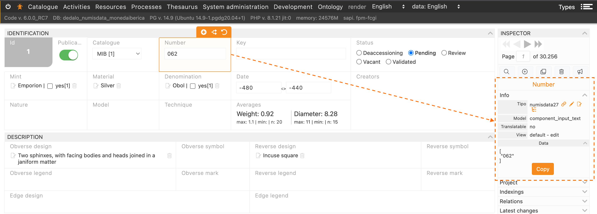
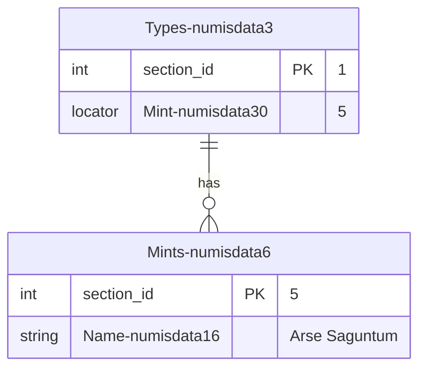

# Importing data

## Introduction

To import data is an important part of Dédalo projects. Dédalo is a high structured data system, Dédalo manage literal data and relationships between data. Data normalization is inside the core of the application. Mainly Dédalo use lists, thesaurus, resources and other related sections to define his data.

Dédalo data model has a abstraction layer that use the ontology definitions to create components (as fields) and sections (as tables).

??? note "About plain text / non-normalized data"

    Lots of catalogues in museums have a previous cataloging system, sometimes do it by itself in commercial applications as FileMaker, Access, etc. and sometimes this data has not structure and is saved as plain text without normalization. This situation create a lots of data inconsistencies that could generate a very difficult situations to resolve. Dédalo can import plain text without any structuring but it is not recommended. If you want import this kind of data, we recommend to do a clean process before import to Dédalo.

## Format

Dédalo use the [standard CSV](https://datatracker.ietf.org/doc/html/rfc4180) to import data with [UTF-8](http://www.unicode.org/versions/latest/) encoding without BOM (Byte Order Mark).

!!! warning

    Any other encoding different of UTF are not supported. Bad encoding files could break the import process at any time and the data imported could has typos and errors.

??? note "Byte Order Mark (BOM)"

    BOM is accepted in some cases, but in general and according to the Unicode standard, the [BOM for UTF-8](http://www.unicode.org/versions/Unicode15.0.0/ch02.pdf) files is not recommended:

    ***2.6 Encoding Schemes***

    *... Use of a BOM is neither required nor recommended for UTF-8, but may be encountered in contexts where UTF-8 data is converted from other encoding forms that use a BOM or where the BOM is used as a UTF-8 signature. See the “Byte Order Mark” subsection in Section 23.8, Specials, for more information...*

By default Dédalo use a stringify JSON encoding in UTF-8 with double quotes `""` escaped marks for the data.

Example of [locator](locator.md):

```json
[{
    "type":"dd151",
    "section_id":"2",
    "section_tipo":"rsc723"
}]
```

Will need to be encoded in CSV format as:

> "\[{""type"":""dd151"",""section_id"":""2"",""section_tipo"":""rsc723""}]"

But is possible to use a plain text to import flat data.

Example of text:

```text
My plain text without double quotes
```

It will need to be encoded in CSV format as:

> My plain text without double quotes

Example of text with double quotes inside:

```text
my plain text with "double quotes"
```

It will need to be encoded in CSV format as:

> "my plain text with ""double quotes"""

## File nomenclature (optional)

Is highly recommended to use only [accii](https://itscj.ipsj.or.jp/ir/006.pdf) characters in the name of import files, so try to use names without spaces, accents or any special character.

### Adding the section to the filename

Filenames can be using to detect the section automatically when import, is possible specify it in this way:

> my_name_to_identify_data-section_tipo.csv

Example, file with interviews data to import in Interviews section [oh1](https://dedalo.dev/ontology/oh1):

> interviews_2015-oh1.csv

But is possible indicate the destination section in the import CSV tool.

## Using editors

Is possible use a editor to create the CSV import files. If you want to use spreadsheet editor as LibreOffice [Calc](https://www.libreoffice.org/discover/calc/), remember that you will need to export CSV with UTF-8 encoding.

## Using a spreadsheet

Dédalo data can be represented as a spreadsheet with columns and rows. The columns represent the components (fields), and the rows represent the records.

Every CSV import file represents a single section. If you need to import multiple sections, you will need a separate CSV file for each one. To import into the "Types" section [numisdata3](https://dedalo.dev/ontology/numisdata3), the CSV file must be named using its section_tipo as follows:

> my_import_types-numisdata3.csv

Every column represent a component(field) and every row represent a record, data will be the cell that crosses the column and the row.

| column A | column B | column X |
| -------- | -------- | -------- |
| data1A   | data1B   | data1X   |
| data1B   | data2B   | data2X   |

### Defining the target component in the column name

Every column in the first row in the file, the head, will content the ontology tipo of the target component of the section to be imported. At least one column need to be set as the section_id to identify the column with the unique id, by convention it will be the first one, but it is not mandatory.

To import the component `Key` [numisdata81](https://dedalo.dev/ontology/numisdata81) and the component `Number` [numisdata27](https://dedalo.dev/ontology/numisdata27) as fields do the `Types` section [numisdata3](https://dedalo.dev/ontology/numisdata3), you will need to create a CSV as:

| section_id | numisdata81 | numisdata27 |
| --- | --- | --- |
| 1 | \[{"value":"key1"}] | \[{"value":"062"}] |
| 2 | \[{"value":"key2"}] | \[{"value":"685a"}] |

!!! note "Columns with names instead ontology tipo"

    Is possible use "human" names in the columns, but the import tool will not match with the component and you will need to set manually before import.

    the previous CSV could be named in this way:

    | id  | Key | Number |
    | --- | --- | ------ |
    | 1 | \[{"value":"key1"}] | \[{"value":"062"}]  |
    | 2 | \[{"value":"key2"}] | \[{"value":"685a"}]  |

    But it will not match and you will need to set the component tipo inside the import tool.

!!! warning "The header must match the mapped column exactly"

    During the import, every CSV header is compared with its mapped column name and they must match **exactly**, including suffixes as `tch56_dmy` (date format) or `tch191_rsc723` (relation target). Columns whose header does not match are **silently skipped** — no data is imported for them and no error is reported. Review the column mapping in the import tool before launching the import.

You can know the ontology tipo of the component picking one component and Dédalo will show it inside the info part of the inspector:



Besides, Dédalo will show the component data format and it is possible to copy it, as `[{"value":"062"}]`.

Also you can check the ontology [here](https://dedalo.dev/ontology).

## Data formats

### The v7 data format

Dédalo v7 stores component data as **arrays of objects**. Every object in the array is one value of the component, and the property that holds the data depends on the component type:

| Component type | v7 format | Data property |
| --- | --- | --- |
| `component_input_text` | `[{"value":"Hello"}]` | `value` |
| `component_text_area` / `component_html_text` | `[{"value":"<p>Hello</p>"}]` | `value` |
| `component_email` | `[{"value":"a@b.com"}]` | `value` |
| `component_number` | `[{"value":5.87}]` | `value` |
| `component_json` | `[{"value":{"any":"JSON"}}]` | `value` |
| `component_date` | `[{"start":{"year":2023,"month":10,"day":26}}]` | `start` / `end` |
| `component_iri` | `[{"iri":"https://dedalo.dev"}]` | `iri` |
| `component_geolocation` | `[{"lat":39.4625,"lon":-0.3762,"zoom":16,"alt":0}]` | `lat` / `lon` |
| Relation components (select, portals, etc.) | `[{"section_id":"2","section_tipo":"rsc723"}]` | `section_id` / `section_tipo` |

The **v7 format is the canonical import format**: what you see in the component inspector and in raw exports is what you import.

!!! note "id and lang properties"

    Stored data also carries `id` and `lang` properties, as `[{"value":"Hello","lang":"lg-eng","id":1}]`. Both are **auto-assigned by the import process** when omitted. The `lang` property can be set explicitly to import multiple languages at once (see [Multiple languages](#multiple-languages)); the `id` property should be omitted, except for `component_iri` where it pairs the value with its label dataframe.

??? note "v6 legacy format (accepted)"

    Dédalo v6 stored plain value arrays as `["Hello"]` or `[104,-75.35]`. This input is still accepted and automatically normalized to the v7 format on save, so old v6 CSV files import without changes.

Besides the JSON formats, every component accepts simple **flat string** alternatives (a plain text, a number, a date as `2023/10/26`, a list of ids as `1,4,6`...) described in each component section below. Flat strings are the easiest way to write a CSV by hand.

### The dedalo_data wrapper

Data exported with the tool export in `dedalo_raw` format is wrapped with the `dedalo_data` property:

```json
{"dedalo_data":[{"value":"Hello","lang":"lg-eng","id":1}]}
```

The wrapper identifies externally that the content is Dédalo format data and not any other generic value. The import process detects and unwraps it transparently, so a raw exported CSV can be re-imported without any change (round-trip). Un-wrapped v7/v6 values remain fully accepted; the wrapper is only mandatory to disambiguate `component_json` data (see [JSON](#json)).

!!! note "What is not wrapped"

    Two cases are exported **without** the wrapper, and both re-import correctly as-is: the `section_id` column (a plain int, used as the record key on import) and components without data (empty cells). The wrapper is detected only when `dedalo_data` is the **only** property of the cell object — a JSON value that merely contains a `dedalo_data` property among others is treated as a normal value.

### The dataframe envelope

Components whose values carry paired [dataframe](components/component_dataframe.md) rows export them alongside the dato:

```json
{"dedalo_data":{"dato":[{"value":"Hello","lang":"lg-eng","id":1}],"dataframe":[{"type":"dd490","section_tipo":"dd1706","section_id":"3","id_key":1,"from_component_tipo":"dd560","main_component_tipo":"rsc217"}]}}
```

The `id_key` of each frame locator pairs it with the dato item carrying the same `id` (this is why explicit item ids round-trip). On import, the dato is conformed and saved as usual, then the frames are written replacing the component's previous frames in each slot (frames of other components sharing the slot are preserved). A `{"dedalo_data":{"dataframe":[...]}}` envelope without `dato` writes only the frames and leaves the component data untouched.

### Empty cells

!!! warning "An empty cell clears the existing data"

    An empty CSV cell is imported as `null` and **clears the existing data** of that component for that record (and for the current data language when the component is translatable). If you don't want to touch a component in some records, don't include its column in the CSV file, or split the import into several files.

---

### Text

Component: `component_input_text`.

Canonical v7 input, array of objects with `value`:

```json
[{"value":"my import data"},{"value":"Other data"}]
```

#### Multiple languages

For translatable components, is possible to import multiple languages at once in two equivalent ways:

1. **Flat v7 array** (the stored v7 format, as produced by the raw export): every item carries its own `lang` property:

    ```json
    [
        {"value":"mi dato para importar","lang":"lg-spa"},
        {"value":"my import data","lang":"lg-eng"}
    ]
    ```

2. **Lang keyed object**: one property per language, each holding its items:

    ```json
    {
        "lg-spa" : [{"value":"mi dato para importar"}, {"value":"Otro dato"}],
        "lg-eng" : [{"value":"my import data"}, {"value":"Other data to import"}]
    }
    ```

Encoded in CSV format as:

```text
section_id;rsc86
1;"{""lg-spa"":[{""value"":""mi dato para importar""},{""value"":""Otro dato""}]}"
```

In both cases every language present in the import value replaces that language data, and the languages not present are preserved. Items without `lang` are saved into the Dédalo data lang defined by the user in menu.

#### Alternative formats to import text

1. Plain text (the simplest)

    section_id | oh14
    --- | ---
    1 | new data to import

    The import process assume the Dédalo data lang defined by the user in menu and will import the value as unique value in the array. If exists previous data in that lang it will be replaced with a new array with the import value.

2. An array of string values (v6 format)

    section_id | oh14
    --- | ---
    1 | \["mi dato para importar","Otro dato"]

    The import process assume the Dédalo data lang defined by the user in menu and will save into this lang, or if the component is non translatable will use `lg-nolan`. Each string will be automatically wrapped into a v7 object with `value` property.

3. Multi-language object with plain strings

    ```json
    {"lg-eng":"My value","lg-spa":"Mi valor"}
    ```

    Each lang value is normalized to the v7 format and saved into its own language.

---

### Formatted text

Components: `component_text_area` and `component_html_text`.

Dédalo uses standard HTML format to import formatted text. As Dédalo use ck-editor as text editor, HTML tags accepted are the same than [ck-editor](https://ckeditor.com/docs/ckeditor5/latest/features/basic-styles.html#available-text-styles):

1. `text_area` accepts:

    ```html
    <p></p> // a Paragraph
    <strong></strong> // Bold text
    <i></i> // Italic text
    <u></u> // Underscore text
    ```

2. `html_text` accepts:

    ```html
    <p></p> // a Paragraph
    <strong></strong> // Bold text
    <i></i> // italic text
    <u></u> // underscore text
    <s></s> // Strikethrough text
    <Code></Code> // programming code
    <sub></sub> // Subscript text
    <sup></sup> // Superscript text
    ```

!!! note "Import behavior for text_area vs html_text"

    Both components use the same import format and data structure. The difference is only in which HTML tags are preserved after import. `text_area` will strip unsupported tags (like `<s>`, `<code>`, `<sub>`, `<sup>`), while `html_text` preserves them.

Besides, import format text support some compatible elements and CSS styles:

```html
<b>             <* style="font-weight: bold"> // (or numeric values that are greater or equal 600)
<em>            <* style="font-style: italic">
                <* style="text-decoration: underline">
<del><strike>   <* style="text-decoration: line-through">
                <* style="word-wrap: break-word">
                <* style="vertical-align: sub">
                <* style="vertical-align: super">
```

!!! note
    This elements and styles will be changed to elements supported in the import process.

Canonical v7 input:

```json
[{"value":"<p>El meu text per <strong>importar</strong></p>"},{"value":"<p>Altra dada</p>"}]
```

Multi-language input, as flat v7 array (per-item `lang`, the raw export format) or as lang keyed object — see [Multiple languages](#multiple-languages):

```json
[
    {"value":"<p>Les meves dades per <strong>importar</strong></p>","lang":"lg-cat"},
    {"value":"<p>My data to <strong>import</strong></p>","lang":"lg-eng"}
]
```

```json
{
    "lg-cat" : [{"value":"<p>Les meves dades per <strong>importar</strong></p><p>&nbsp;</p><p>Amb 2 paragraphs</p>"}],
    "lg-eng" : [{"value":"<p>My data to <strong>import</strong></p><p>&nbsp;</p><p>With 2 paragraphs</p>"}]
}
```

Encoded in CSV format as:

```text
section_id;numisdata18
1;"{""lg-cat"": [{""value"":""<p>El meu text per <strong>importar</strong></p>""},{""value"":""<p>Altra dada</p>""}]}"
```

#### Alternative formats to import formatted text

1. Formatted text (flat string, the simplest)

    section_id | numisdata18
    --- | ---
    1 | `<p>Nou text per <strong>importar</strong></p>`

2. Plain text (without HTML)

    section_id | numisdata18
    --- | ---
    1 | new data to import

    The text will be wrapped automatically into `<p></p>` paragraphs, and line returns become new paragraphs.

3. An array of string values (v6 format)

    section_id | oh14
    --- | ---
    1 | `["<p>El meu text per <strong>importar</strong></p>","<p>Altra dada</p>"]`

In the flat string cases the import process assume the Dédalo data lang defined by the user in menu and will import the value as unique value in the array, replacing previous data of that lang.

#### Indexation tags

Dédalo use a non standard HTML tags to define `indexation` `tags`, `tc`, `person`, `language`, `notes` and `references`.

The main format of this tags follow this rules:

1. The tag is enclosing by `[]`
2. the element are separated by `-` character
3. the first element is `tag_name` with the standard name of the tag
4. the second element is the `state` of the tag with n|r|d options, n=normal, r=to review, d=deleted.
5. unique id of the tag, int.
6. data::data enclosing the locator in the case that this tag has a link to any data.
7. locator is stringify version with double quotes `"` remplace with simple quotes `'`

```text
[tag_name-state-id-label-data:locator:data]
```

##### index

index tag define a fragment inside of formatted text, index tag has a in and out format, the fragment will be in the middle of this tags.

###### indexIn

Mark the initial position of the indexation fragment.

Example:

> \[index-n-1-my tag label-data::data]

###### indexOut

Mark the out position of the indexation fragment.

Example:

> \[index-n-1-my tag label-data::data]

##### tc

Tc tag are using to point a specific audiovisual timecode at the beginning of paragraphs, it use to create a time relation between text and his audiovisual time.

tc tags has his own format, the tc is enclosing by `TC_` and `_TC` marks.

```text
[TC_hh:mm:ss.ms_TC]
```
Example:

> \[TC_00:01:25.627_TC]

##### lang

The lang tag is used to mark the change from the previous language. Example, an interview in Catalan in which the interviewee begin to speak in French.

> \[lang-a-1-spa-data:['lg-spa']:data]

##### svg

The svg tag is used to add a graphic within the text. The tag uses a locator to point to the svg section. Example to add an Iberian symbol inside a legend text.

Example:

> \[svg-n-1--data:{'section_tipo':'sccmk1','section_id':'2','component_tipo':'hierarchy95'}:data]

##### geo

The geo tag is used to add some features as, polygons, points, or marks.

Example:

> \[geo-n-10-10-data::data]

##### page

The page tag is used to mark a page break inside text.

Example:

> \[page-n-3]

##### person

The person tag is used to mark a person that is begin to talk. The tag use a locator to point into People under study [rsc197](https://dedalo.dev/ontology/rsc197) section.

> \[person-a-1-Pedpi-data:{'section_tipo':'rsc197','section_id':'1','component_tipo':'oh24'}:data]

##### note

The note tag is used to add a annotation in text. The annotation use a locator to point to Annotations [rsc326](https://dedalo.dev/ontology/rsc326) section. The state of the note could be a | b, a=private, b=public.

Example:

> \[note-a-1-1-data:{'section_tipo':'rsc326','section_id':1}:data]

##### reference

The reference tag is used to a link to any other section. It use the locator to point at any other sections. The reference works pointed as HTML `<a href><a>` element. References has a in and out tag to indicate the beginning and end fo the reference.

###### referenceIn

> \[reference-n-1-reference 1-data:\[{'section_tipo':'fr1','section_id':'1','type':'dd151'}]:data]

###### referenceOut

> \[/reference-n-1-reference 1-data:\[{'section_tipo':'fr1','section_id':'1','type':'dd151'}]:data]

---

### Numbers

Component: `component_number`. The component do not use languages.

Canonical v7 input:

```json
[{"value":104},{"value":-75.35}]
```

Encoded in CSV format as:

```text
section_id;numisdata133
1;"[{""value"":104},{""value"":-75.35}]"
```

#### Alternative formats to import numbers

1. Plain number (the simplest)

    | section_id  | numisdata133 |
    | ----------- | ------------ |
    | 1           | 33.85        |

    The import process assume this data as the full data, if exists previous data it will be replaced with a new array with the import value.

    The decimal separator (`.` or `,`) can be selected in the import tool for every number column.

2. An array of numbers (v6 format)

    | section_id  | numisdata133 |
    | ----------- | ------------ |
    | 1           | \[104,-75.35] |

---

### Email

Component: `component_email`. The component do not use languages.

Canonical v7 input:

```json
[{"value":"user@example.com"},{"value":"admin@example.com"}]
```

Encoded in CSV format as:

```text
section_id;tch442
1;"[{""value"":""user@example.com""},{""value"":""admin@example.com""}]"
```

#### Alternative formats to import emails

1. Plain email string (the simplest)

    | section_id  | tch442 |
    | ----------- | ------ |
    | 1           | user@example.com |

2. Multiple emails with the ` | ` separator

    | section_id  | tch442 |
    | ----------- | ------ |
    | 1           | user@example.com \| admin@example.com |

    will be parse as:

    ```json
    [{"value":"user@example.com"},{"value":"admin@example.com"}]
    ```

    !!! note "Fixed separator"

        The ` | ` separator (space, pipe, space) is fixed and not configurable. An address containing a literal ` | ` cannot be imported as flat string: use the JSON array format instead.

3. An array of strings (v6 format)

    | section_id  | tch442 |
    | ----------- | ------ |
    | 1           | \["user@example.com","admin@example.com"] |

---

### Dates

Component: `component_date`. The component do not use languages. The main format to import is the array of objects with `start` and optional `end` dd_date values.

Canonical v7 input:

```json
[{
   "start" : {
        "year": 1238,
        "month": 10,
        "day": 9
    }
}]
```

Encoded in CSV format as:

```text
section_id;tch56
1;"[{""start"":{""year"":1238,""month"":10,""day"":9}}]"
```

#### Alternative formats to import dates

1. A punctual date in flat string :

    ```text
    -205/05
    ```

    Example:

    | section_id | tch56   |
    | ---------- | ------- |
    | 1          | -205/05 |

    It's allowed to use different [formats](#using-other-date-formats) indicating it in the name of the header as tch56_dmy.

    section_id   | tch56_dmy
    ------------ | :--------------:
    1            | 05/-205

    It's allowed to use different separator between [values of elements](#using-other-separators).

    ```text
    -205-05
    15-11--50
    15.11.-50
    ```

2. A range of dates in flat string:

    ```text
    2023/10/26<>2023/10/27
    ```

    The '<>' separator indicate the range with the start date at left and end date at right.

    ```json
    [{
        "start" : {
            "year": 2023,
            "month": 10,
            "day": 26
        },
        "end" : {
            "year": 2023,
            "month": 10,
            "day": 27
        }
    }]
    ```

    Is possible to leave spaces between dates and the separator.

    ```text
    -150 <>      238
    ```

    Is a valid range date, but the separator will be always in same format, a space between marks are not allowed:

    ```text
    -150< >238
    ```

    it's not a valid range.

    It's allowed to use different [formats](#using-other-date-formats) indicating it in the name of the header as tch56_dmy.

    | section_id | tch56_mdy |
    | ---------- | --------- |
    | 1          | 10/26/2023<>10/27/2023 |

     It's allowed to use different separator between [values of elements](#using-other-separators).

    ```text
    10-26-2023<>10-27-2023
    10.26.2023<>10.27.2023
    ```

3. Multi value date in flat string

    ```text
    2023/10/26|1853/02/18
    ```

    The '|' separator indicate multiple values. The values are not a star <> end dates, both are start dates, the second one is the start date of the second value.

    The previous string date will be parse as:

    ```json
    [
        {
            "start" : {
                "year": 2023,
                "month": 10,
                "day": 26
            }
        },
        {
            "start" : {
                "year": 1853,
                "month": 02,
                "day": 18
            }
        }
    ]
    ```

    Is possible to leave spaces between dates and the separator.

    ```text
    -150 |          -25
    ```

    It's allowed to use different [formats](#using-other-date-formats) indicating it in the name of the header as tch56_dmy.

    | section_id | tch56_mdy |
    | ---------- | --------- |
    | 1          | 10/26/2023\|02/18/1853 |

    It's allowed to use different separator between [values of elements](#using-other-separators).

    ```text
    10-26-2023|02-18-1853
    10.26.2023|02.18.1853
    ```

4. Combination of multi value and range

    ```text
    2023/10/26<>2023/10/27|1853/02/18
    ```

    To define multiple values with ranges is possible to use a combination of the '|' to indicate the multi value and the '<>' to indicate the range.

        The previous string date will be parse as two date values with the range of the first value with star and end dates:

    ```json
    [
        {
            "start" : {
                "year": 2023,
                "month": 10,
                "day": 26
            },
            "end" : {
                "year": 2023,
                "month": 10,
                "day": 27
            }
        },
        {
            "start" : {
                "year": 1853,
                "month": 02,
                "day": 18
            }
        }
    ]
    ```

    Is possible leave a part of the range blank:

    ```text
    2023/10/26|<>1853/02/18
    ```

    ```json
    [
        {
            "start" : {
                "year": 2023,
                "month": 10,
                "day": 26
            }
        },
        {
            "end" : {
                "year": 1853,
                "month": 02,
                "day": 18
            }
        }
    ]
    ```

    Is possible to leave spaces between dates and the separators.

    ```text
    2023/10/26 |   <>  1853/02/18
    ```

    It's allowed to use different [formats](#using-other-date-formats) indicating it in the name of the header as tch56_dmy.

    | section_id   | tch56_mdy |
    | ------------ | --------- |
    | 1            | 10/26/2023\|<>02/18/1853 |

    It's allowed to use different separator between [values of elements](#using-other-separators).

    ```text
    10-26-2023\|<>02-18-1853
    10.26.2023\|<>02.18.1853
    ```

##### Using other date formats

By default the string date formats use \[-]y/m/d, but its possible to import the date in other formats indicating in the column header the format as second parameter after the tipo, using the `_ as character between them.

| section_id | tch56_dmy |
| ---------- | --------- |
| 1          | 05/-205   |

Is possible to use this formats

| Format | Description |
| --- | --- |
| ymd | year/moth/day as 2023/10/26 |
| mdy | moth/day/year as 10/26/2023 |
| dmy | day/moth/year as 26/10/2023 |

##### Using other separators

Default separator between day moth and year is `/` but is possible to use `-` and `.`

```text
20-10-1945
2023-10-26|<>1853-02-18
-200<>50-11|-150-10
11-12--200|28-10-5
```

```text
20.10.1945
2023.10.26|<>1853.02.18
-200<>50.11|-150.10
11.12.-200|28.10.5
```

---

### Related data

#### Understanding relationships between data

Dédalo use a data relation model based in [locators](locator.md), sections are connected between them with locators. Any related data is connected by locators, a list showed in a select is connected by locators, a image inside a section is connected by locators. Dédalo uses locators everywhere.

Locators are extensible connection between data and can be point to full section, component inside section or a part of the components inside a section. Besides, locators can create links to external data.

When you want to import data with relations, you will use locators.

Basic locator has only two properties:

- section_tipo
- section_id

`section_tipo` is the ontology tipo of the target section, `section_id` is the unique id of the target section.

Also the locator has a `type`, that defines the relation type and `from_component_tipo` that defines the origin component (the field that point to target section, the portal).

Data linked as:


```mermaid
erDiagram
    Types-numisdata3 ||--o{ Mints-numisdata6 : has
    Types-numisdata3 {
        int section_id PK "1"
        locator Mint-numisdata30 "5"
    }
    Mints-numisdata6 {
        int section_id PK "5"
        string Name-numisdata16 "Arse Saguntum"
    }
```

It say that Type 1 has a link with Mint 5.
The field Mint [numisdata30](https://dedalo.dev/ontology/numisdata30) in the section Types [numisdata3](https://dedalo.dev/ontology/numisdata3) has lint to id 5 of section Mints [numisdata6](https://dedalo.dev/ontology/numisdata6)

In Dédalo format it will be:

```json
{
    "section_id": 1,
    "section_tipo": "numisdata3",
    "data":
    {
        "relations": 
        [
            {
                "section_id":"5",
                "section_tipo":"numisdata6",
                "from_component_tipo": "numisdata30"
            }
        ]
    }
}
```

And it could be represented in CSV spreadsheet columns in this way:

> types-numisdata3.csv

| section_id    | numisdata30 |
| ------------  | ----------- |
| 1             | \[{"section_id":"5","section_tipo":"numisdata6","from_component_tipo": "numisdata30"}] |

#### Importing

By default import model use the JSON format of his data, an array of [locator](locator.md).

```json
[{"type":"dd151","section_id":"2","section_tipo":"rsc723","from_component_tipo":"tch191"}]
```

Because the Dédalo import process uses a plain CSV file, the JSON data must be stringified in the following way:

The table to import

| section_id    | tch191 |
| ------------  | :----: |
| 1             | \[{"type":"dd151","section_id":"2","section_tipo":"rsc723","from_component_tipo":"tch191"}] |

Will need to be encoded in CSV format as:

```text
section_id;tch191
1;"[{""type"":""dd151"", ""section_id"":""2"", ""section_tipo"":""rsc723"", ""from_component_tipo"":""tch191""}]"
```

It's possible remove the `type` and `from_component_tipo` properties because the head of the columns specify the value of `from_component_tipo` and the component knows his own `type`. So, is possible to define previous locator to import in this way:

```json
[{"section_id":"2","section_tipo":"rsc723"}]
```

##### Alternative formats to import related data

1. A comma separate int (as destination section_id):

    ```text
    1,4,6
    ```

    To import this data, is necessary specify, in the column head of the component, the section_tipo using the `_ character to between them:

    `component_tipo + '_' + section_tipo`

    Example:

     **tch191_rsc723**

    In this case the import process assume that all int values are section_id, the section_tipo become from the second tipo in the name of column head, from_component_tipo become from the first tipo in the name of column head and type is calculated asking to the component in server.

    Example:

    | section_id | tch191_rsc723 |
    | --- | --- |
    | 1   | 1,4,6 |

    will be parse as:

    ```json
    [
        {"type":"dd151","section_id":"1","section_tipo":"rsc723","from_component_tipo":"tch191"},
        {"type":"dd151","section_id":"4","section_tipo":"rsc723","from_component_tipo":"tch191"},
        {"type":"dd151","section_id":"6","section_tipo":"rsc723","from_component_tipo":"tch191"}
    ]
    ```

    When the component point to multiple sections this import way will not respect other sections values in his data. Previous data pointed to other sections, than the section indicate in the head, will be removed.

    1. Importing unique values

        Is possible import unique int as section_tipo

        Example:

        | section_id | tch191_rsc723 |
        | --- | --- |
        | 1 | 6 |

    2. Removing section_tipo reference in head.

        Is possible remove the section_tipo in the head of the column when the component use only 1 pointed section.

        Example:

        | section_id | tch191 |
        | --- | --- |
        | 1 | 1,4,6 |

        !!! warning "Components using with multiple sections"
            This possibility is only available when the component point to 1 section. Multiple sections are not allowed to import in this way.

        In this case the import process will ask to component in the server to get the section_tipo to be used, if the component has multiple sections it will fail to import, to avoid errors and inconsistencies

---

### Languages (select_lang)

Component: `component_select_lang`. It is a relation component pointing to the Dédalo languages section, used to specify the language of a content (e.g. the language of a text or an audiovisual).

Canonical v7 input, array of locators:

```json
[{"section_tipo":"lg1","section_id":"17344"}]
```

#### Alternative formats to import languages

1. A lang code in flat string (the simplest)

    | section_id | rsc36 |
    | --- | --- |
    | 1 | lg-spa |

2. Multiple lang codes separated by comma

    | section_id | rsc36 |
    | --- | --- |
    | 1 | lg-spa, lg-eng |

3. A JSON array of lang codes

    | section_id | rsc36 |
    | --- | --- |
    | 1 | \["lg-spa","lg-eng"] |

Every code is resolved to its locator in the languages section. An unresolvable code (e.g. `lg-zzz`) produces a failed row and the value is ignored.

Lang codes must be **lowercase** alphanumeric with the `lg-` prefix (`lg-spa`, `lg-eng`, `lg-vlca`); uppercase variants as `LG-SPA` are not recognized as lang codes.

!!! note "Languages not configured in the project"

    A valid lang code that is **not part of the project configured languages** (DEDALO_PROJECTS_DEFAULT_LANGS) is imported anyway, and the import report shows a **warning**: the value is saved but it will not be accessible until the project languages include it.

---

### Geolocation

Component: `component_geolocation`. The component do not use languages. The data is an array with one item defining the map center (`lat`, `lon`), the map state (`zoom`, `alt`) and, optionally, the drawn shapes as GeoJSON layers (`lib_data`).

Canonical v7 input:

```json
[{
    "lat"  : 39.4625,
    "lon"  : -0.3762,
    "zoom" : 16,
    "alt"  : 0
}]
```

With drawn shapes:

```json
[{
    "lat"  : 39.4625,
    "lon"  : -0.3762,
    "zoom" : 16,
    "alt"  : 0,
    "lib_data" : [{
        "layer_id"   : 1,
        "layer_data" : {
            "type"     : "FeatureCollection",
            "features" : [{
                "type"       : "Feature",
                "properties" : {"layer_id":1},
                "geometry"   : {"type":"Point","coordinates":[-0.3762,39.4625]}
            }]
        }
    }]
}]
```

#### Alternative formats to import geolocation

1. Coordinates in flat string (the simplest), as `lat, lon[, zoom[, alt]]` with dot decimals:

    | section_id | tch102 |
    | --- | --- |
    | 1 | 39.4625, -0.3762 |
    | 2 | 39.4625, -0.3762, 15 |

    !!! note "Coordinate order"

        The flat string order is **latitude first** (human convention, as map applications show). Note that GeoJSON `coordinates` use the opposite `[lon, lat]` order.

2. A bare GeoJSON FeatureCollection:

    ```json
    {"type":"FeatureCollection","features":[{"type":"Feature","properties":{},"geometry":{"type":"Point","coordinates":[-0.3762,39.4625]}}]}
    ```

    The map center is taken from the first `Point` feature and the full collection is stored as the layer 1 shapes.

Latitude must be in range \[-90, 90] and longitude in \[-180, 180]; `zoom` defaults to 16 and `alt` to 0 when omitted.

---

### JSON

Component: `component_json`. The component do not use languages and stores **any arbitrary JSON** as a single value (monovalue).

By default, the **entire cell content becomes the value**, whatever it is:

| section_id | test18 |
| --- | --- |
| 1 | {"config":{"a":1}} |
| 2 | \[1,2,3] |
| 3 | hello world |
| 4 | 42 |

Row 1 will be saved as `[{"value":{"config":{"a":1}}}]`, row 4 as `[{"value":42}]`, etc.

!!! note "The dedalo_data wrapper as disambiguator"

    Because any JSON is a valid value, a v7 envelope like `[{"value":1},{"value":2}]` is indistinguishable from a literal JSON value with the same shape — so by default it is imported **entirely inside `value`**:

    ```json
    [{"value":[{"value":1},{"value":2}]}]
    ```

    To import data already in Dédalo v7 format (e.g. re-importing a raw export), wrap it with the `dedalo_data` property:

    ```json
    {"dedalo_data":[{"value":{"config":{"a":1}},"id":1}]}
    ```

    The raw export produces this wrapper automatically, so export → import round-trips work without changes.

---

### URI

Component: `component_iri`. If the component does not use languages the main format to import is the array of `dd_iri` objects.

!!! info "Data format in version 6.8.0"
    Data version for iri component has changed in version 6.8.0. `title` property has deprecated and will be removed in future verions.
    In version >= 6.8.0 use the property `label_id` to define the title.

```json
[{
    "iri"      : "https://dedalo.dev",
    "id"       : 1,
    "label_id" : 5
}]
```

- `iri` property, **mandatory**. Defines the URL, it needs to have the protocol and a valid structure with domain.
- `id` property **optional**. Defines the unique id of the data, it will be used to be linked with the label dataframe. If omitted, it is auto-assigned on save.
- `label_id` property **optional**. Defines the target id (section_id) to be used as value of the label in dataframe.

!!! note "id exception for component_iri"

    In general the `id` property is auto-assigned by the import process and should not be included in the CSV data. The IRI component is the exception: because the label dataframe is paired with the value through its `id`, is possible to set it explicitly to control that pairing.

Encoded in CSV format as:

```text
section_id;tch442
1;"[{""iri"":""https://dedalo.dev"",""id"":1,""label_id"":5}]"
```

#### Multiple values

To import multiple values in the same component/field, add new object to the array in this way:

```json
[
    {
        "iri"      : "https://dedalo.dev",
        "id"       : 1,
        "label_id" : 5
    },
    {
        "iri"      : "http://monedaiberica.org",
        "id"       : 2,
        "label_id" : 6
    }
]
```

#### Languages

The import will marked this data as `lg-nolan` because the component interpreted that the URI has not language by default. But sometimes you will manage multilingual URI's, as wikipedia articles, so in those cases is possible identify the language of the URI in this way:

```json
{
    "lg-spa": [{
        "iri" : "https://es.wikipedia.org/wiki/Escrituras_paleohispánicas"
    }],
    "lg-deu": [{
        "iri" : "https://de.wikipedia.org/wiki/Althispanische_Schriften"
    }]

}
```

The table to import

| section_id    | tch442  |
| ------------  | ------ |
| 1             | {"lg-spa":\[{"iri":"https://es.wikipedia.org/wiki/Escrituras_paleohispánicas"}\],"lg-deu":\[{"iri":"https://de.wikipedia.org/wiki/Althispanische_Schriften"}\]} |

#### Alternative formats to import URI's

1. Flat string (the simplest):

    ```text
    https://dedalo.dev
    ```

    | section_id    | tch442  |
    | ------------  | ------ |
    | 1             | https://dedalo.dev |

    it will be parse as:

    ```json
    [{
        "iri":"https://dedalo.dev"
    }]
    ```

2. Array of strings:

    Used to import multiple URI's into the component / field.

    ```json
    ["https://dedalo.dev","https://dedalo.dev/docs"]
    ```

    | section_id    | tch442  |
    | ------------  | ------ |
    | 1             |  \["https://dedalo.dev","https://dedalo.dev/docs"]

    will be parse as:

    ```json
    [
        {"iri":"https://dedalo.dev"},
        {"iri":"https://dedalo.dev/docs"}
    ]
    ```

3. String with id label

    To import the id label to be used to point specific value of the list of labels for the URI use the `, ` separator in this way:

    ```text
    8, https://dedalo.dev
    ```

    | section_id    | tch442  |
    | ------------  | ------ |
    | 1             | 8, https://dedalo.dev |

    It will be parse as:

    ```json
    [{
        "iri"      : "https://dedalo.dev",
        "label_id" : 8
    }]
    ```
    And it will be processed to create the label relation with a `component_dataframe` pointing to the value 8 and create the relation with the `component_iri`.
    The `component_dataframe` will point to the `section_id` 8 that is the `Dédalo` label.

    !!! tip "Separator format"

        Dédalo interpreted the `, ` separator between data to differentiate two parts, left of the comma is the id label and the right of the comma will be the URI, if you are using this separator is important to add the space between comma and the URI, because is possible identify the comma when the URI is clear, sometimes the title or the URI can use this character. To minimized errors ensure that the space is after the comma in the separator.

4. String with label

    To import the a new label or string value of the label you can use the `, ` separator in this way:

    ```text
    Dédalo, https://dedalo.dev
    ```

    | section_id    | tch442  |
    | ------------  | ------ |
    | 1             | Dédalo, https://dedalo.dev |

    The string value will be checked in the import process. If the string value exists in the value list, it will be set with its own id(section_id), if not exist will create new value in the list.

5. String of multiple values

    To import multiple values of the URI use the ` | ` separator in this way:

    ```text
    https://dedalo.dev | https://dedalo.dev/docs
    ```

    | section_id    | tch442  |
    | ------------  | ------- |
    | 1             | https://dedalo.dev \| https://dedalo.dev/docs |

    it will be parse as:

    ```json
    [
        {"iri":"https://dedalo.dev"},
        {"iri":"https://dedalo.dev/docs"}
    ]
    ```

    !!! tip "Separator format"

        Dédalo interpreted the ` | ` separator between data to differentiate two or more values. Is possible that some URI's will use this character inside the variables. To minimized errors ensure that the space is before and after of the separator character.

6. String of multiple values with label id

    Is possible combine the label string or id with the separator `, ` and the values separator ` | ` in the same string in this way:

    ```text
    Dédalo, https://dedalo.dev | https://dedalo.dev/docs
    ```

    | section_id    | tch442  |
    | ------------  | ------- |
    | 1             |  Dédalo, https://dedalo.dev \| https://dedalo.dev/docs |

    it will be parse as:

    ```json
    [
        {
            "iri":"https://dedalo.dev",
            "label_id": 8
        },
        {
            "iri":"https://dedalo.dev/docs"
        }
    ]
    ```

#### Version format < 6.8.0 (deprecated)

!!! warning "Deprecated format"

    The `title` property in IRI data was deprecated in version 6.8.0 and replaced by `label_id`. If you have CSV files using the old `title` property, they will still be accepted by the import process, but the `title` value will be ignored. Use `label_id` instead to preserve the label relationship.

```json
[{
    "iri" : "https://dedalo.dev",
    "title": "Dédalo website"
}]
```

!!! note "Migration from title to label_id"

    To migrate from the deprecated `title` property to `label_id`, replace the title string with the `section_id` of the corresponding label in the label list. For example, if the label "Dédalo website" has `section_id` 8 in the label list, change `"title":"Dédalo website"` to `"label_id":8`. The alternative string format `Dédalo website, https://dedalo.dev` (shown above) will automatically resolve the label for you.
