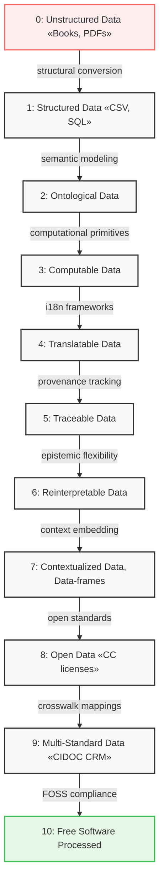
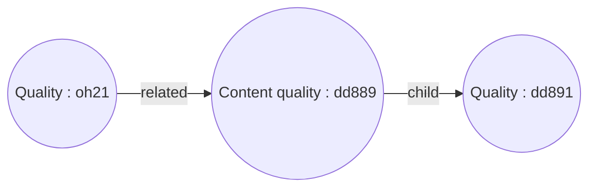
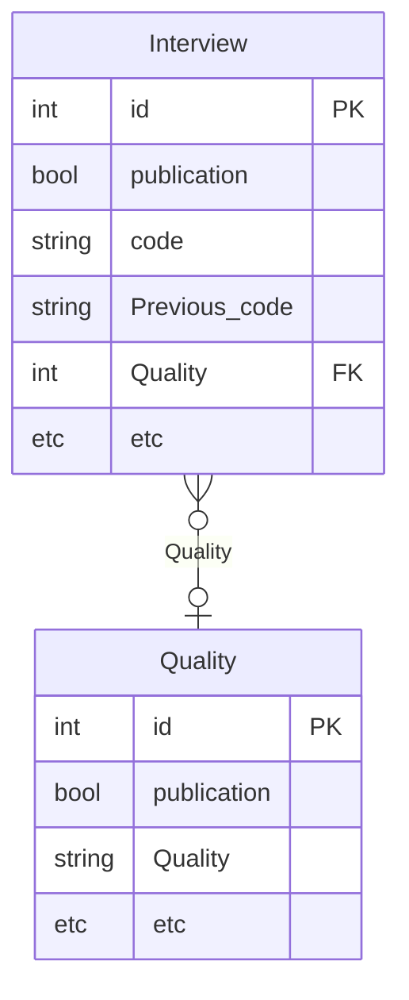

# Introduction

## What is Dédalo?

Dédalo is a open source project to create a Cultural Heritage Management System. It has two main systems, work system and diffusion system and both has a server side and client side. Server side is builds on top of PHP. Client side is builds on top of standard HTML, CSS, and JavaScript.

Dédalo use a multiple abstraction layers, from the database schema to the data definition or the relations between data. The data structure and program behavior is defined and controlled by his ontology.

## Why Dédalo is necessary?

The project is focused in Cultural Heritage and Memory archives. With tools for Archeology, Ethnology, Oral Memory, Numismatics etc. Dédalo is building thinking in the day to day work of researches or curators in cultural projects.

The common CMS as Drupal, WordPress etc. are designed to create web pages, Dédalo instead, is designed to create archives, census, inventories or catalogs than will be publish in websites.

Dédalo provide tools for the researches in humanities as bibliography or multiple thesaurus (toponymy, onomastic, thematic, etc).

Our goal is to create a management system for humanities and cultural heritage for the digital era.

## Data focused project

Data is the center of the Dédalo project. It is important to emphasize the significance of heritage asset data. From our perspective, the Dedalian community, cultural heritage data is important, very important. It is the information we have about ourselves, and this information is on the same or even higher level of importance as health, defense, and other such data. In other words, one of the most crucial functions of any branch of the humanities is to generate, disseminate, research, and preserve our past and our identity with good data, with good information.

A detail that is often overlooked is the complexity of humanities data. It may seem simple, we’re not talking about quantum physics, but humanities data poses serious challenges and defies the determinism of programming.

However, not all data are equally valid, the data must meet stringent quality standards and be computationally tractable. This requirement is not solely to ensure machine readability, but more critically, to enable human interpretability and meaningful engagement. It is imperative to properly contextualize the data, establish rigorous frameworks, and develop structured models capable of representing its inherent complexity. High-quality data is not merely advantageous, it constitutes the foundational pillar of our project.

The overarching objective is to construct robust, computationally viable data models that comprehensively encapsulate the multidimensional facets of cultural heritage: its physical artifacts, intangible attributes, dynamic processes, and the socio-historical narratives embedded within.

### The Raspa Data Quality Score: A Cumulative Scale for Cultural Heritage Data Assessment

To ensure the effective documentation, processing, and long-term preservation of cultural heritage information, the **Dédalo project** proposes the **Raspa Data Quality Score** a cumulative metric that evaluates data across ten progressive levels of computational readiness, semantic richness, and ethical transparency. This scale reflects the project's commitment to structured, interoperable, and ethically-managed data built entirely on **Free and Open Source Software (FOSS)**.

The Raspa data quality score has two dimensions; **Technical dimension** and **Community / social dimension**

#### Technical dimension

The Raspa score begins at **Level 0**, assigned to **unstructured data** such as books, Word documents, and PDFs. While these formats may contain valuable knowledge, they remain machine-opaque and unsuitable for computational processing without prior transformation. Their human readability is not sufficient for automated reasoning or integration into structured knowledge systems like Dédalo (Dédalo can handle this data but it is used as media).

At **Level 1**, **structured data formats** such as spreadsheets (CSV, Excel) and relational databases (SQL) become machine-readable and receive 1 Raspa point. However, they exhibit significant limitations: structural rigidity, limited support for semantic relationships, and insufficient compatibility with the conceptual models required in cultural heritage documentation.

**Level 2** introduces **ontologically modeled data**, where information is structured using formal ontologies. These representations enable the explicit definition of entities and relationships, domain-specific modeling, and support for inferencing, critical capabilities for managing complex heritage knowledge.

Advancing to **Level 3**, **computable data** employs standardized computational primitives (e.g., [TC39 Temporal](https://tc39.es/proposal-temporal/docs/cookbook.html) for time representation), eliminating syntactic ambiguities and enabling precise temporal and spatial reasoning.

At **Level 4**, data becomes **traceable**, incorporating robust provenance tracking and version control. These systems record the full history of modifications, including who made each change, when it occurred, and the rationale behind it, ensuring transparency, accountability, and scholarly reproducibility. Traceable data enables users to assess the origin, evolution, and reliability of the information, supporting responsible reuse and long-term stewardship.

**Level 5** assesses the **epistemological flexibility** of the model, awarding points to data structures capable of representing multiple perspectives, evolving knowledge, and supporting non-destructive schema changes. This capacity is particularly relevant for heritage knowledge, which is inherently interpretive and temporally dynamic.

At **Level 6**, **contextualization** becomes paramount. Data is enriched with metadata that articulates certainty levels, establishes source attribution chains, and embeds domain-specific framing—allowing users to assess the reliability and interpretative lens of the information.

#### Community / Social dimension

**Level 7** recognizes **translatable data**, where linguistic content is decoupled from core data structures. Systems at this level support internationalization and localization, preserving semantic meaning across multiple languages, an essential requirement for global cultural heritage platforms.

**Level 8** concerns **openness**, recognizing data that is made publicly accessible under clear licensing terms (e.g., Creative Commons) and distributed via REST APIs or equivalent open standards. This level ensures that data is not only reusable but also free from proprietary constraints that hinder scholarly and public access.

At **Level 9**, data demonstrates **multi-standard interoperability**. Such datasets maintain compliance with multiple domain standards (e.g., CIDOC CRM, Dublin Core, Nomisma) and support lossless transformation between schemas, ensuring semantic alignment across institutions, disciplines, and technologies.

Finally, **Level 10** is reserved for data that is **processed entirely through Free and Open Source Software**. This level guarantees end-to-end transparency, reproducibility, and ethical integrity by eliminating dependencies on proprietary tools. It reflects the Dédalo project's core philosophy: that cultural heritage data should be freely accessible, verifiably processed, and ethically managed within open infrastructures.

##### Extra point

Sustainable data.
Data that is sustainable over time receives the an extra Raspa score, reflecting its resilience, long-term accessibility, and preservation-readiness. Sustainable data is not only well-structured and ethically processed, but also designed to withstand technological, organizational, and epistemological change.

Key characteristics of sustainable data include:

- Format durability: Use of open, standardized, and non-obsolete formats (e.g., JSON, XML, TIFF).
- Long-term storage strategy: Integration with digital preservation infrastructures.
- Documentation continuity: Thorough metadata, contextual notes, and technical documentation that support future interpretation and migration.
- Community stewardship and participation: Maintained by active institutions or open communities that ensure updates, backups, and governance.

Sustainable data ensures that cultural heritage remains accessible, intelligible, and reusable not just today, but decades into the future, even as technologies evolve.

### The Raspa score table

#### Technical dimension

| Raspa Score | Data Quality Tier | Key Characteristics | Technical Requirements |
| --- | ---| --- | ---|
| 0 | Unstructured Data | Human-readable only (books, PDFs) | No computational structure |
| 1 | Basic Structured Data | Machine-readable tables (CSV, Excel, SQL) | Relational schemas |
| 2 | Ontologically Modeled | Formal semantic relationships | Domain ontologies |
| 3 | Computable Data | Native machine processing ([ECMA TC39 temporal dates]([TC39 temporal](https://tc39.es/proposal-temporal/docs/cookbook.html)), [geocoordinates as geojson](https://datatracker.ietf.org/doc/html/rfc7946)) | Data type standardization |
| 5 | Traceable Data | Full provenance tracking | Immutable logs, version control (W3C PROV) |
| 6 | Reinterpretable Data | Epistemic flexibility for future revisions | Non-destructive schema evolution |
| 7 | Contextualized Data | Embedded certainty levels and source attribution | Data-frame metadata structures |

#### Community and social dimension

| Raspa Score | Data Quality Tier | Key Characteristics | Technical Requirements |
| --- | ---| --- | ---|
| 7 | Translatable Data | Language-agnostic representation | Internationalization frameworks, Unicode compliance |
| 8 | Open Data | Standards-compliant public access | Open APIs (REST, GraphQL, etc.), CC licensing |
| 9 | Multi-Standard Interoperable | Crosswalk capability across schemas | CIDOC CRM, Dublin Core, schema.org,, etc. mappings |
| 10 | Free Software Processed | End-to-end open toolchain | FOSS stack verification |
| +1 | Sustainable data | Log-term preservation and community evolve | Standardized formats, checksums and backups, network working data |

### The Raspa score diagram



### Raspa Acronym Definition

**R** – Reliable & Reproducible

**A** – Adaptable & Aligned

**S** – Structured & Sustainable

**P** – Public & Participatory

**A** – Actionable & Archivable

## Dédalo ecosystem

From the beginning in 1998 the project was built following the Internet and web standards. Nowadays Dédalo is using common free and open source technologies as httpd, javascript, css, html, postgreSQL or PHP. The project is licensed by AGLP (GNU Affero General Public License v3.0) and his code is updating every day.

To run Dédalo you will need a internet server running GNU / Linux; Ubuntu, Debian, RedHat, etc. and for development you can also install it in MacOs X and, of course, if you want play in Ninja mode, you can try to install it in Windows (but by your own...).

All data is stored and management in JSON format. Dédalo use PostgreSQL JSON functionalities to store data in the database. In publication system Dédalo use any other classical SQL database, by default MariaDB or MySQL, but you can choose any other SQL, for publication data Dédalo store classical SQL schema with data in columns

Dédalo has two different APIs, with different options and functionalities, to connect client and server for every system. First for work system and second to publication system. If you only want to get public data to create a webpage or connecting with other portals you will need to learn the diffusion API. If you want to develop some tools or adding components, services, etc. you will need to learn the Dédalo API (working system).

In old Dédalo versions data was render in html webpages in server before sent to client, in recent versions the server only work and transmit data and the html is created in client side.

### Definitions of Dédalo's nomenclature

Since v4 Dédalo does not work with the standard SQL schema, and we define a NoSQL model thinking about the abstraction of the database and the data will be stored in it. Dédalo had grown into different fields of cultural heritage and the SQL model became unwieldy, too many tables and columns to handle. In v4 the project created its own schema system and we started naming our own nomenclature for common things like "table" which we call "section" because the abstraction tables in the database are not the same as of the SQL tables .

Confused? look at this scenario.

We have a postgreSQL database with one unique table for lot of different data of Dédalo, this table is named "matrix" yeah, cool name!, in this table we have only 4 columns, `id`, `section_id`, `section_tipo` and `data`. The data column is a json column with all information about lots of different things; people, interviews, audiovisual, images, etc. In classic SQL all these things will have a table with his own columns, but we are no stored the data in his specific tables! Dédalo store data in common table, we have only 1 table for all these things. So, we do not want use the name "table" to name it, because it is not a database table and "section" name arise. For us "section" is like a table with his specific columns, and lots of sections are stored in the matrix table.

Of course Dédalo has more tables than the matrix table but in total Dédalo only has 28 tables and 24 of these are the same concept, 4 columns with the data column with all information in json. Do you think that 28 table are a lot? well, a full Dédalo schema has around 1100 different sections (tables) with around 16.000 columns/fields, its a huge schema.

And the same thing happened with the columns/fields, we call it "components" because in the matrix table we only have 4 columns and the data must have the equivalent of the column concept to store different information, so we use components to define the properties of the data.

For ex in classic SQL you will have a people table as:

| id | name   | surname   |
| ---- | -------- | ----------- |
| 1  | Alicia | Gutierrez |

But in Dédalo we have only a column for data and we will store the previous data in this way:

```json
{
    "section"       : "people",
    "section_id"    : 1,
    "name"          : "Alicia",
    "surname"       : "Gutierrez"
}
```

But, we do not stop here!, the previous example has the columns / properties in English... why in English? the Dédalo project born in Valencia, Spain, why not use our main language, Català, or Español... why use English?, well, we determine that Dédalo will be used with any language and all field names need to be translated, so the fields / properties were abstracted with codes, alphanumeric codes and it will defined by an ontology (do not worry if you do not know what ontology is... it will appear after in this document, but you can think that is a hierarchy with definitions).

So for create new sections and components we built a nodes in the ontology with all definitions and codes in this way:

```json
[
    {
        "tipo"      : "rsc197",
        "model"     : "section",
        "lg-eng"    : "People",
        "lg-spa"    : "Personas",
        "lg-cat"    : "Persones"
    },
    {
        "tipo"      : "rsc85",
        "model"     : "component_input_text",
        "lg-eng"    : "Name",
        "lg-spa"    : "Nombre",
        "lg-cat"    : "Nom"
    },
    {
        "tipo"      : "rsc86",
        "model"     : "component_input_text",
        "lg-eng"    : "Surname",
        "lg-spa"    : "Apellidos",
        "lg-cat"    : "Cognoms"
    }
]
```

And the data is referenced to this definitions in this way:

```json
{
    "section"       : "rsc197",
    "section_id"    : 1,
    "rsc85"         : "Alicia",
    "rsc86"         : "Gutierrez"
}
```

Beautiful! an abstraction of a table and columns with translatable fields! if we are working in English we can go to the node definition in the ontology and get the label of the field in English or if we are working in Català so we will get the label in Català... changing the ontology names do not affect to the data and we can rename it without change the schema... great!

But... some names appear here, "section_id"? why? why not id? because id is used in the matrix table as typical id and the homonymy in this case could be confusing. It is not the same the unique id of the table than the id of the section, the id of the section is unique for the section but it is not unique for the table and make sense use the name section_id.

See a example:

| id | section_id | section_tipo | data |
| ---- | ---- | ---- | ---- |
| 1  | 1 | "rsc197" | { "section" : "rsc197", "section_id": 1, "rsc85" : "Alicia","rsc86" : "Gutierrez"} |
| 2  | 1 | "oh1" | { "section" : "oh1", "section_id": 1, "oh2" : "Interview"} |

We have two section_id = 1 because rsc197 is a section (remember as a table) for persons and oh1 is a section for interviews. So, section_id is linked directly to sections in the same way than id is linked to tables.

Dédalo nomenclature table:

| name | equivalent | definition |
| ---- | ---- | ---- |
| area | | Group of things as sections, an area could be "Intangible Heritage" that has sections as "Oral History" or "Intangible Cultural Assets", the areas will showed in menu because their are at the top of the hierarchy |
| section       | SQL table with format and logic  | A group of records the same thing|
| component     | SQL column with format and logic | A field with data management his data has specific format          |
| tipo| code       | Alphanumeric code to identify every thing in the ontology, tipo is the Spanish name of type and it is the acronym of Typology of Indirect Programming Objects :-D    |
| section_tipo  | specific table       | A unique definition of a table in ontology   |
| component_tipo| specific column      | A unique definition of a column in ontology  |
| model         | typology   | An unique definition of a typology in ontology, a model defines what node is in the ontology, a model could be 'component_input_text' to define that the node will work with text data and will use the input_text logic, so a tipo has a model:[oh1](https://dedalo.dev/ontology/oh1) -> section (oral history interview), [rsc85](https://dedalo.dev/ontology/rsc85) -> component_input_text (person name) |
| context       || Small piece of the ontology that defines every element as section, component, tool, etc, used to create the instances or modify it.  |
| subcontext    || Small piece of the ontology with all necessary elements to build the main element, for a section it will be the components inside it, for a component_portal will be the components pointed in other sections.   |
| section_id    | id         | In combination with section_tipo: specific record /row of the table, unique id for his section_tipo|
| data|| Data container with value and optional values as datalist or fallbacks of the value      |
| value         || Stored data in database|
| subdata       | column value         | All necessary data of other elements that is necessary to build the main element, in section will be all component data, for a a component_portal will be the data of the pointed section and components.        |
| Search Quey Object (sqo)  | SQL query  | Abstraction of SQL syntax in json format, inspired by[mango query](https://docs.couchdb.org/en/stable/api/database/find.html) project and adapted to Dédalo schema  |
| Request Quey Object (rqo) | API request| Object to do request to Dédalo API to request sections, components, tools, and every thing that client need to process, it can contains a sqo |
| locator       | relation   | Pointer between data, unidirectional, bidirectional o multidirectional       |
| ontology      | schema     | Active definition of Dédalo behavior and his schema, ontology defines tables, columns, relations between data, tools, sections, components, etc, the changes in ontology will apply in real time to the Dédalo behavior.   |
| dd_object (ddo)           || Dédalo object, a normalized object to be used in rqo, sqo and classes to build and instantiate sections, components, etc.           |
| dd_date       || Dédalo date, a normalized object to representative dates          |
| ts_object     || Dédalo thesaurus, a normalized object to representative thesaurus hierarchies           |
| dd_grid       || Dédalo grid table, a normalized object to representative tables with rows and columns, dd_grid resolve data relations and build tables of flat data       |
| tool|| specific interface and logic for do a task, tools in Dédalo could be a work process as 'transcription interviews' or actions as "propagate data between records"    |
| service       || Specific interface and logic shared between components, sections or tools in Dédalo a service could be a "text processor" used by text areas or html text components, or "upload files" process than could be used by image, pdf or audiovisuals components |
| widget        || Specific piece of code to do a task as summarize some components, collect data from sections, etc  |

### Dédalo ontology

You can find lots definitions for ontology:

In The American Heritage® Dictionary of the English Language, 5th Edition, defines [ontology](https://www.ahdictionary.com/word/search.html?q=ontology&submit.x=46&submit.y=29) as:

1. The branch of metaphysics that deals with the nature of being.
2. *Computers* A system for naming, classifying, and defining objects.

In GNU Collaborative International Dictionary of English defines [ontology](https://gcide.gnu.org.ua/?q=ontology&define=Define&strategy=.) as:

1. That department of the science of metaphysics which investigates and explains the nature and essential properties and relations of all beings, as such, or the principles and causes of being.
2. (Computers) A systematic arrangement of all of the important categories of objects or concepts which exist in some field of discourse, showing the relations between them. When complete, an ontology is a categorization of all of the concepts in some field of knowledge, including the objects and all of the properties, relations, and functions needed to define the objects and specify their actions. A simplified ontology may contain only a hierarchical classification (a taxonomy) showing the type subsumption relations between concepts in the field of discourse. An ontology may be visualized as an abstract graph with nodes and labeled arcs representing the objects and relations. The concepts included in an ontology and the hierarchical ordering will be to a certain extent arbitrary, depending upon the purpose for which the ontology is created. This arises from the fact that objects are of varying importance for different purposes, and different properties of objects may be chosen as the criteria by which objects are classified. In addition, different degrees of aggregation of concepts may be used, and distinctions of importance for one purpose may be of no concern for a different purpose.

In wiktionary defines [ontology](https://en.wiktionary.org/wiki/ontology) as:

1. (uncountable, philosophy) The branch of metaphysics that addresses the nature or essential characteristics of being and of things that exist; the study of being qua being.
2. (uncountable, philosophy) In a subject view, or a world view, the set of conceptual or material things or classes of things that are recognised as existing, or are assumed to exist in context, and their interrelations; in a body of theory, the ontology comprises the domain of discourse, the things that are defined as existing, together with whatever emerges from their mutual implications.
3. (countable, philosophy) The theory of a particular philosopher or school of thought concerning the fundamental types of entity in the universe.
4. (logic) A logical system involving theory of classes, developed by [Stanislaw Lesniewski](https://plato.stanford.edu/entries/lesniewski/) (1886-1939).
5. (countable, computer science, information science) A structure of concepts or entities within a domain, organized by relationships; a system model.

The origin of the concept became from humanities, from philosophy, and was created to describe things. Computer science get this concept and adapt to define a system, a model, a depiction.

Dédalo ontology is this; a data schema description, a description of relationships between tables, columns, an organization of concepts, a structuring definition for cultural heritage. But we introduce a little different point, Dédalo ontology is active, not passive, it's not only a definition, it is totally dynamic system. When the ontology change, the behavior of Dédalo change to adapt it to the new definitions. The ontology is consulted in execution time to resolve sections(tables), components (columns), relation data, or format of the data, dynamically. Ontology is the core of Dédalo.

Dynamic and active ontology?

Yes. A change in the definitions is apply in real time to the schema, data and behavior (with some limitations). Ex: A component with a select list of values could be changed to be a component with autocomplete changing only his definition, it's not necessary change the database or columns or change the data of the component. This change is possible because the data of the component, the schema in the database and the logic of Dédalo has lots of abstraction layers. All definitions are dependents of the ontology and Dédalo doesn't call things directly. For resolve a data from database, Dédalo needs to get the part of the ontology definition for this data, and many times it will need to do new request to other parts of the ontology to defines what this data is.

Of course, abstraction layers has a cost. The time to resolve data is not the same that direct data. And the complexity to resolve a record grow exponentially. In other hand Dédalo is a super flexible system to change information and adapt it to new requirements or needs and Dédalo can change the data to many formats or standards because the final format is dependent of the ontology definition. Dédalo can transform data from Nomisma, Dublin Core, Marc21, CIDOC, or any other standard, to do that only is necessary define it in the ontology, so, Dédalo does not have limits.

Abstraction is nice, but it's hard to develop, at the beginning the ontology was not the concept that we are working now, the ontology begun as a simple definition and version to version it was adding more and more levels of abstraction, in data and the code. And of course, it's not finished. The first version was builded in the v3 thesaurus adapting it for the programming needs of v4, for ex: the first data definitions was not interchangeable between components, or some properties was very rigid creating limitations... and the develop process has to balance between compatibility of previous versions and changes for new situations, so it is a slow process done it a step by step.

Ok, ok, but, what is exactly the ontology in Dédalo?. The first version of the ontology was a fork of the v3 thesaurus, so, his interface and his management is a... thesaurus hierarchy. It is not different of other thesaurus, nodes inside other nodes, parent, children, related with his own properties, translations, and definitions, but in these case it defines how Dédalo will work. See it:


The hierarchy has areas, sections components, and his relations with other parts of ontology and his properties, some properties are for data, as data default, some of them are used for render the component as css.

In the previous image, you can see that quality node is a component_select connected to other part of the ontology, the  "Content quality" section and the "Quality" component that is a component_input_text.



To get the data resolution of the Quality component : oh21 , Dédalo will need to follow this path and ask to "content quality" section : dd889, what data is inside Quality : dd891 component

Is classical SQL you will need to create two tables with his own schema and connect the column Quality with the id of the table Quality:



Then you will need to create the logic with the specific query to get all posible values of the select.

```SQL
SELECT Quality.id, Quality."Quality"
FROM "Quality" 
```

Or doing a join if you want to see it in list mode (without all results). With the data you will need to build the html code to create the select.

The problem here are the changes, because the schema, the logic and the render is specific and rigid, if you need  change quality, you will need change the schema of the database, the logic in your code and the html associated. In simple cases or specific uses than not has changes it is not a problem, but in a large and complex situation it could be very hard. Dédalo ontology is a abstraction of all of this process and you will not change your databases or the logic associated opening the possibility to grow and change in a flexible way.

You can find specific documentation on the Dedalo ontology [here.](./ontology/index.md)
