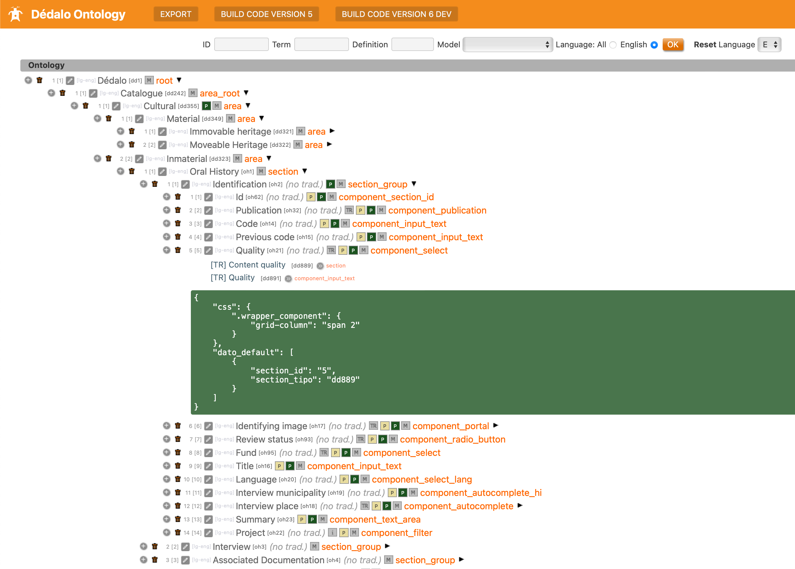
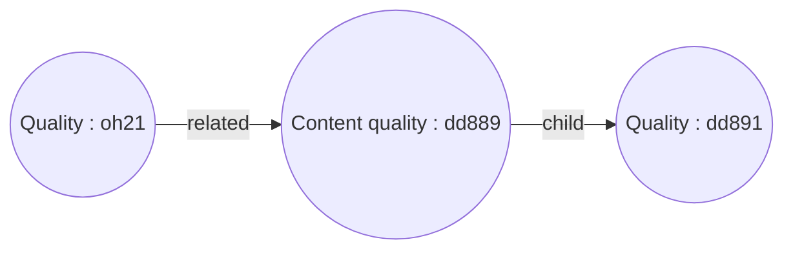
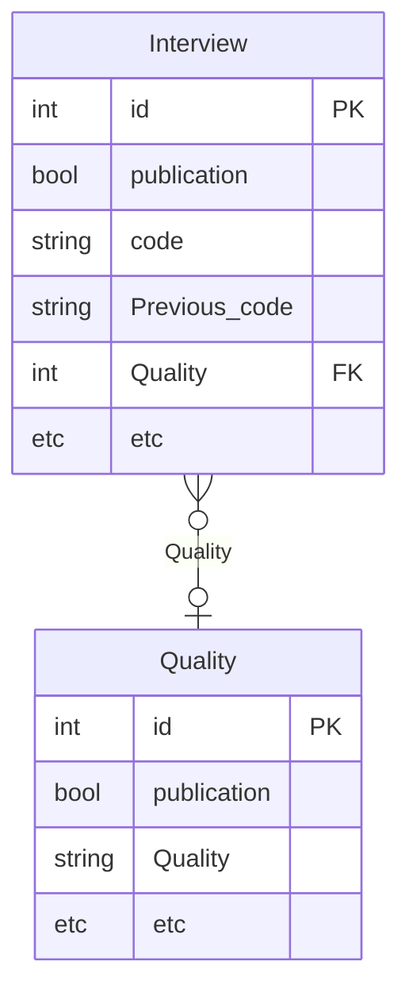

# Introduction

> See also: [Architecture overview](architecture_overview.md) · [Glossary](glossary.md) · [Ontology](ontology/index.md)

Dédalo is an open-source Cultural Heritage Management System. This page introduces what it is, why it exists, and the nomenclature you need before reading any other core document.

## What is Dédalo?

Dédalo is an open-source project that builds a Cultural Heritage Management System. It has two main systems, the work system and the diffusion system, and both have a server side and a client side. The server side is built on PHP. The client side is built on standard HTML, CSS and JavaScript.

Dédalo uses multiple abstraction layers, from the database schema to the data definition and the relations between data. The data structure and program behavior are defined and controlled by its ontology.

## Why is Dédalo necessary?

The project focuses on cultural heritage and memory archives, with tools for archaeology, ethnology, oral memory, numismatics and more. Dédalo is built around the day-to-day work of researchers and curators in cultural projects.

Common content management systems such as Drupal or WordPress are designed to build web pages. Dédalo is instead designed to build archives, censuses, inventories and catalogs that are then published on websites.

Dédalo provides tools for researchers in the humanities, such as bibliography and multiple thesauri (toponymy, onomastic, thematic, etc.).

Our goal is to create a management system for the humanities and cultural heritage for the digital era.

## A data-focused project

Data is at the center of the Dédalo project. It is important to emphasize the significance of heritage-asset data. From the perspective of our community, the Dedalian community, cultural heritage data is important, very important. It is the information we have about ourselves, and this information is at the same or even higher level of importance as health, defense and other such data. In other words, one of the most crucial functions of any branch of the humanities is to generate, disseminate, research and preserve our past and our identity with good data, with good information.

A detail that is often overlooked is the complexity of humanities data. It may seem simple — we are not talking about quantum physics — but humanities data poses serious challenges and defies the determinism of programming.

However, not all data are equally valid, the data must meet stringent quality standards and be computationally tractable. This requirement is not solely to ensure machine readability, but more critically, to enable human interpretability and meaningful engagement. It is imperative to properly contextualize the data, establish rigorous frameworks, and develop structured models capable of representing its inherent complexity. High-quality data is not merely advantageous, it constitutes the foundational pillar of our project.

The overarching objective is to construct robust, computationally viable data models that comprehensively encapsulate the multidimensional facets of cultural heritage: its physical artifacts, intangible attributes, dynamic processes, and the socio-historical narratives embedded within.

To assess data quality across projects (including Dédalo itself), Dédalo proposes the [Raspa Data Quality Score](raspa_score.md) as an evaluation metric. {width="20"}

## Dédalo ecosystem

Since it began in 1998, the project has been built following Internet and web standards. Today Dédalo uses common free and open-source technologies such as httpd, JavaScript, CSS, HTML, PostgreSQL and PHP. The project is licensed under the AGPL (GNU Affero General Public License v3.0) and its code is updated every day.

To run Dédalo you need an Internet server running GNU/Linux (Ubuntu, Debian, RedHat, etc.). For development you can also install it on macOS X and, of course, if you want to play in Ninja mode, you can try to install it on Windows (but at your own risk...).

All data is stored and managed in JSON format. Dédalo uses PostgreSQL's JSON functionality to store data in the database. In the publication system Dédalo uses a classic SQL database — by default MariaDB or MySQL, but you can choose any other SQL — where publication data is stored in a classic SQL schema with data in columns.

Dédalo has two different APIs, with different options and functionality, to connect client and server for each system: one for the work system and one for the publication system. If you only want to get public data to build a web page or to connect with other portals, you need to learn the diffusion API. If you want to develop tools or add components, services, etc., you need to learn the Dédalo API (the work system).

In old Dédalo versions, data was rendered as HTML web pages on the server before being sent to the client. In recent versions the server only processes and transmits data, and the HTML is created on the client side.

### Definitions of Dédalo's nomenclature

Since v4 Dédalo does not work with the standard SQL schema; we defined a NoSQL model, thinking about the abstraction of the database and the data stored in it. Dédalo had grown into different fields of cultural heritage and the SQL model became unwieldy — too many tables and columns to handle. In v4 the project created its own schema system, and we started naming common things ourselves: "table", for instance, we call "section", because the abstract tables in the database are not the same as SQL tables.

Confused? Look at this scenario.

We have a PostgreSQL database with one single table for many different kinds of Dédalo data. This table is named "matrix" (yeah, cool name!). It has only 4 columns: `id`, `section_id`, `section_tipo` and `data`. The data column is a JSON column with all the information about many different things: people, interviews, audiovisuals, images, etc. In classic SQL all these things would have a table with their own columns, but we do not store the data in specific tables! Dédalo stores data in a common table — we have only one table for all these things. So we do not want to use the name "table" for it, because it is not a database table, and the name "section" arises. For us a "section" is like a table with its specific columns, and many sections are stored in the matrix table.

Of course Dédalo has more tables than the matrix table, but in total Dédalo has only 28 tables, and 24 of them share the same concept: 4 columns, with the data column holding all the information in JSON. Do you think 28 tables are a lot? Well, a full Dédalo schema has around 1,100 different sections (tables) with around 16,000 columns/fields. It is a huge schema.

The same thing happened with the columns/fields: we call them "components" because the matrix table has only 4 columns, and the data needs the equivalent of the column concept to store different information. So we use components to define the properties of the data.

For example, in classic SQL you would have a people table like this:

| id | name   | surname   |
| ---- | -------- | ----------- |
| 1  | Alicia | Gutierrez |

But in Dédalo we have only one column for data, and we store the data above like this:

```json
{
    "section"       : "people",
    "section_id"    : 1,
    "name"          : "Alicia",
    "surname"       : "Gutierrez"
}
```

But we do not stop here! The example above has the columns/properties in English... Why in English? The Dédalo project was born in Valencia, Spain, so why not use our main languages, Català or Español? Why use English? Well, we decided that Dédalo would be used in any language and that all field names need to be translated, so the fields/properties were abstracted as codes — alphanumeric codes — defined by an ontology (do not worry if you do not know what an ontology is; it appears later in this document, but you can think of it as a hierarchy with definitions).

So to create new sections and components we build nodes in the ontology with all the definitions and codes, like this:

```json
[
    {
        "tipo"      : "rsc197",
        "model"     : "section",
        "lg-eng"    : "People",
        "lg-spa"    : "Personas",
        "lg-cat"    : "Persones"
    },
    {
        "tipo"      : "rsc85",
        "model"     : "component_input_text",
        "lg-eng"    : "Name",
        "lg-spa"    : "Nombre",
        "lg-cat"    : "Nom"
    },
    {
        "tipo"      : "rsc86",
        "model"     : "component_input_text",
        "lg-eng"    : "Surname",
        "lg-spa"    : "Apellidos",
        "lg-cat"    : "Cognoms"
    }
]
```

And the data references these definitions like this:

```json
{
    "section"       : "rsc197",
    "section_id"    : 1,
    "rsc85"         : "Alicia",
    "rsc86"         : "Gutierrez"
}
```

Beautiful! An abstraction of a table and columns with translatable fields. If we are working in English we can go to the node definition in the ontology and get the label of the field in English; if we are working in Català we get the label in Català. Changing the ontology names does not affect the data, and we can rename it without changing the schema. Great!

But some new names appear here. "section_id"? Why? Why not just "id"? Because `id` is used in the matrix table as the usual id, and the homonymy here could be confusing. The unique id of the table is not the same as the id of the section: the id of the section is unique for the section but not unique for the table, so it makes sense to use the name `section_id`.

See an example:

| id | section_id | section_tipo | data |
| ---- | ---- | ---- | ---- |
| 1  | 1 | "rsc197" | { "section" : "rsc197", "section_id": 1, "rsc85" : "Alicia","rsc86" : "Gutierrez"} |
| 2  | 1 | "oh1" | { "section" : "oh1", "section_id": 1, "oh2" : "Interview"} |

We have two records with `section_id = 1` because `rsc197` is a section (remember, like a table) for people and `oh1` is a section for interviews. So `section_id` is tied directly to sections in the same way that `id` is tied to tables.

Dédalo nomenclature table:

| name | equivalent | definition |
| ---- | ---- | ---- |
| area | | A group of things such as sections. An area could be "Intangible Heritage", containing sections such as "Oral History" or "Intangible Cultural Assets". Areas are shown in the menu because they sit at the top of the hierarchy. |
| section       | SQL table with format and logic  | A group of records of the same kind. |
| component     | SQL column with format and logic | A field that manages data; its data has a specific format. |
| tipo| code       | Alphanumeric code that identifies everything in the ontology. *tipo* is the Spanish word for "type" and is also the acronym of Typology of Indirect Programming Objects :-D    |
| section_tipo  | specific table       | A unique definition of a table in the ontology. |
| component_tipo| specific column      | A unique definition of a column in the ontology. |
| model         | typology   | A unique definition of a typology in the ontology. A model defines what a node is in the ontology; a model could be `component_input_text`, defining that the node works with text data and uses the input_text logic. So a tipo has a model: [oh1](https://dedalo.dev/ontology/oh1) → section (oral history interview), [rsc85](https://dedalo.dev/ontology/rsc85) → component_input_text (person name). |
| context       || A small piece of the ontology that describes every element (section, component, tool, etc.), used to create instances or modify them. |
| subcontext    || A small piece of the ontology with all the elements needed to build the main element: for a section, the components inside it; for a component_portal, the components pointed at in other sections. |
| section_id    | id         | In combination with section_tipo, a specific record/row of the table; unique for its section_tipo. |
| data|| A data container with the value and optional companions such as the datalist or value fallbacks. |
| value         || The data stored in the database. |
| subdata       | column value         | All the data of other elements needed to build the main element: for a section, all component data; for a component_portal, the data of the pointed section and components. |
| Search Query Object (sqo)  | SQL query  | An abstraction of SQL syntax in JSON format, inspired by the [Mango query](https://docs.couchdb.org/en/stable/api/database/find.html) language and adapted to the Dédalo schema. |
| Request Query Object (rqo) | API request| An object used to make requests to the Dédalo API for sections, components, tools and everything the client needs to process; it can contain an sqo. |
| locator       | relation   | A pointer between data: unidirectional, bidirectional or multidirectional. |
| ontology      | schema     | The active definition of Dédalo's behavior and schema. The ontology defines tables, columns, relations between data, tools, sections, components, etc. Changes in the ontology apply in real time to Dédalo's behavior. |
| dd_object (ddo)           || A Dédalo object: a normalized object used in rqo, sqo and classes to build and instantiate sections, components, etc. |
| dd_date       || A Dédalo date: a normalized object that represents dates. |
| ts_object     || A Dédalo thesaurus object: a normalized object that represents thesaurus hierarchies. |
| dd_grid       || A Dédalo grid: a normalized object that represents tables with rows and columns. dd_grid resolves data relations and builds tables of flat data. |
| tool|| A specific interface and logic for performing a task. A tool in Dédalo could be a work process such as "transcription of interviews" or an action such as "propagate data between records". |
| service       || A specific interface and logic shared between components, sections or tools. A service in Dédalo could be a "text processor" used by text areas or HTML text components, or an "upload files" process used by image, PDF or audiovisual components. |
| widget        || A specific piece of code that performs a task, such as summarizing some components or collecting data from sections. |

### Dédalo ontology

You can find lots definitions for ontology:

In The American Heritage® Dictionary of the English Language, 5th Edition, defines [ontology](https://www.ahdictionary.com/word/search.html?q=ontology&submit.x=46&submit.y=29) as:

1. The branch of metaphysics that deals with the nature of being.
2. *Computers* A system for naming, classifying, and defining objects.

In GNU Collaborative International Dictionary of English defines [ontology](https://gcide.gnu.org.ua/?q=ontology&define=Define&strategy=.) as:

1. That department of the science of metaphysics which investigates and explains the nature and essential properties and relations of all beings, as such, or the principles and causes of being.
2. (Computers) A systematic arrangement of all of the important categories of objects or concepts which exist in some field of discourse, showing the relations between them. When complete, an ontology is a categorization of all of the concepts in some field of knowledge, including the objects and all of the properties, relations, and functions needed to define the objects and specify their actions. A simplified ontology may contain only a hierarchical classification (a taxonomy) showing the type subsumption relations between concepts in the field of discourse. An ontology may be visualized as an abstract graph with nodes and labeled arcs representing the objects and relations. The concepts included in an ontology and the hierarchical ordering will be to a certain extent arbitrary, depending upon the purpose for which the ontology is created. This arises from the fact that objects are of varying importance for different purposes, and different properties of objects may be chosen as the criteria by which objects are classified. In addition, different degrees of aggregation of concepts may be used, and distinctions of importance for one purpose may be of no concern for a different purpose.

In wiktionary defines [ontology](https://en.wiktionary.org/wiki/ontology) as:

1. (uncountable, philosophy) The branch of metaphysics that addresses the nature or essential characteristics of being and of things that exist; the study of being qua being.
2. (uncountable, philosophy) In a subject view, or a world view, the set of conceptual or material things or classes of things that are recognised as existing, or are assumed to exist in context, and their interrelations; in a body of theory, the ontology comprises the domain of discourse, the things that are defined as existing, together with whatever emerges from their mutual implications.
3. (countable, philosophy) The theory of a particular philosopher or school of thought concerning the fundamental types of entity in the universe.
4. (logic) A logical system involving theory of classes, developed by [Stanislaw Lesniewski](https://plato.stanford.edu/entries/lesniewski/) (1886-1939).
5. (countable, computer science, information science) A structure of concepts or entities within a domain, organized by relationships; a system model.

The concept originated in the humanities, in philosophy, and was created to describe things. Computer science took this concept and adapted it to define a system, a model, a depiction.

The Dédalo ontology is this: a data-schema description, a description of relationships between tables and columns, an organization of concepts, a structuring definition for cultural heritage. But we introduce one difference: the Dédalo ontology is active, not passive. It is not only a definition; it is a fully dynamic system. When the ontology changes, Dédalo's behavior changes to adapt to the new definitions. The ontology is consulted at execution time to resolve sections (tables), components (columns), relation data and data formats, dynamically. The ontology is the core of Dédalo.

A dynamic and active ontology?

Yes. A change in the definitions is applied in real time to the schema, data and behavior (with some limitations). For example, a component with a select list of values can be changed into a component with autocomplete by changing only its definition; there is no need to change the database, the columns or the data of the component. This is possible because the data of the component, the schema in the database and the logic of Dédalo have many abstraction layers. All definitions depend on the ontology, and Dédalo does not call things directly. To resolve a piece of data from the database, Dédalo needs the part of the ontology definition for that data, and often it needs to make new requests to other parts of the ontology to define what this data is.

Of course, abstraction layers have a cost. The time to resolve data is not the same as for direct data, and the complexity of resolving one record grows exponentially. On the other hand, Dédalo is a highly flexible system for changing information and adapting it to new requirements or needs, and Dédalo can convert the data to many formats or standards because the final format depends on the ontology definition. Dédalo can transform data to Nomisma, Dublin Core, MARC21, CIDOC or any other standard; to do that you only need to define it in the ontology, so Dédalo has no limits.

Abstraction is nice, but it is hard to develop. At the beginning the ontology was not the concept we work with now; it started as a simple definition and, version after version, added more and more levels of abstraction in both the data and the code. And of course, it is not finished. The first version was built on the v3 thesaurus, adapting it for the programming needs of v4 — for example, the first data definitions were not interchangeable between components, and some properties were very rigid and created limitations. The development process has to balance compatibility with previous versions against changes for new situations, so it is a slow, step-by-step process.

OK, OK, but what exactly is the ontology in Dédalo? The first version of the ontology was a fork of the v3 thesaurus, so its interface and its management are... a thesaurus hierarchy. It is no different from any other thesaurus — nodes inside other nodes, with parents, children and related nodes, each with its own properties, translations and definitions — but in this case it defines how Dédalo works. See it:



The hierarchy holds areas, sections and components, along with their relations to other parts of the ontology and their properties. Some properties are for data, such as the data default; some are used to render the component, such as CSS.

In the image above, you can see that the Quality node is a component_select connected to another part of the ontology: the "Content quality" section and the "Quality" component, which is a component_input_text.


```mermaid
flowchart LR
    A((Quality : oh21)) --related--> B((Content quality : dd889))
    B --child--> C((Quality : dd891))
```

To resolve the data of the Quality component (oh21), Dédalo follows this path and asks the "Content quality" section (dd889) what data is inside the Quality component (dd891).

In classic SQL you would need to create two tables, each with its own schema, and connect the Quality column with the id of the Quality table:


```mermaid
erDiagram
    Interview {
        int id PK
        bool publication
        string code
        string Previous_code
        int Quality FK
        etc etc
    }
    Quality {
        int id PK
        bool publication
        string Quality
        etc etc
    }
    Interview }o--o| Quality : Quality
```

Then you would need to create the logic, with a specific query, to get all the possible values of the select.

```sql
SELECT Quality.id, Quality."Quality"
FROM "Quality"
```

Or a join if you want to see it in list mode (without all results). With the data you would then build the HTML to create the select.

The problem here is change, because the schema, the logic and the rendering are specific and rigid. If you need to change Quality, you have to change the database schema, the logic in your code and the associated HTML. In simple cases, or for specific uses that do not change, this is not a problem, but in a large and complex situation it can be very hard. The Dédalo ontology is an abstraction of this whole process: you do not change your databases or the associated logic, which opens up the possibility of growing and changing in a flexible way.

You can find specific documentation on the [Dédalo ontology here](./ontology/index.md).

## Core documentation

### Start here

- **[Architecture overview](./architecture_overview.md)** — the recommended starting point: the two systems, the matrix data model, the active ontology, and how data flows from server build to client render.
- **[Data model](./data_model/index.md)** — the data architecture: how a value actually lives inside Dédalo (the JSON/JSONB foundation, the typed `matrix` columns, the consolidated v7 value-item envelope) and the per-type pages that document each data type — [locator](./locator.md), [date](./data_model/dd_date.md), [string](./data_model/string.md), [number](./data_model/number.md), [IRI](./data_model/iri.md), [geolocation](./data_model/geolocation.md), [media](./data_model/media.md), [relations](./data_model/relations.md) and [misc](./data_model/misc.md).
- **[Sections](./sections/index.md)** — the table abstraction (a group of records of the same kind) in depth.
- **[Components](./components/index.md)** — the field abstraction: typologies, inheritance, datum, and the full per-component reference.
- **[Browser client](./client/index.md)** — the thin DOM builder over the server: bootstrap, instance registry, render layer, event bus and RQO transport. Per-page references: [lifecycle](./client/lifecycle.md), [instances](./client/instances.md), [render & views](./client/render_and_views.md), [data_manager](./client/data_manager.md), [event_manager](./client/event_manager.md).
- **[Glossary](./glossary.md)** — the full Dédalo nomenclature (section, component, tipo, locator, sqo, rqo, ddo, dd_date, …).

### Domains

The rest of the core documentation is organised into domain indexes:

- **[Areas](./areas/index.md)** — areas, the top-of-hierarchy groupers that gather sections and surface them in the menu.
- **[Ontology](./ontology/index.md)** — the active schema: how sections, components, relations and tools are defined as nodes, plus request-config presets.
- **[User interface](./ui/index.md)** — the client side: how the server-built context/subcontext is rendered in the browser.
- **[System & infrastructure](./system/index.md)** — the underpinnings: persistence, APIs, caching, workers and operational concerns.

### Request configuration

The `request_config` system defines how sections and components retrieve and display data. It bridges the ontology definition with API requests.

- **[Request config architecture](./request_config.md)** — complete technical documentation.
- **[Request config examples](./request_config_examples.md)** — practical examples for common scenarios.

### Query objects

- **[Request Query Object (RQO)](./rqo.md)** — the API request structure.
- **[Search Query Object (SQO)](./sqo.md)** — the database query abstraction.

### Semantic search & RAG

- **[RAG & semantic search](./rag.md)** — the meaning layer over the structured archive: why vectorizing cultural heritage and memory matters, how semantic search and Retrieval-Augmented Generation change humanities research, and how the subsystem (a separate pgvector store, structure-aware semantic chunking, hybrid retrieval, per-record ACL, grounded Q&A with citations) plugs into the Dédalo data model. Written for both researchers and developers.

### Data objects

- **[Data model](./data_model/index.md)** — how a value lives in Dédalo: the JSONB foundation, the typed `matrix` columns and the consolidated v7 value item, plus the per-type pages.
- **[Value item](./data_model/value_item.md)** — the consolidated `{id, lang?, value}` envelope every component reads and writes.
- **[dd_object (ddo)](./dd_object.md)** — the normalized object behind every request.
- **[Locator](./locator.md)** — the pointer between data (the value item of every relation component).
- **[dd_date](./data_model/dd_date.md)** — date representation.

### Ontology

- **[Ontology documentation](./ontology/index.md)** — schema and definitions.
- **[Ontology authoring](./ontology/authoring.md)** — writing the ontology: node shape, creating/editing sections, components, groups and tools, the `properties` grammar, TLD management.
- **[section_map](./ontology/section_map.md)** — the global scope/term resolver: which component tipos play role X for a section, with the main → thesaurus → relation_list fallback.
- **[Request config presets](./ontology/request_config_presets.md)** — user-defined layouts.

### Components

- **[Component documentation](./components/index.md)** — available components.

