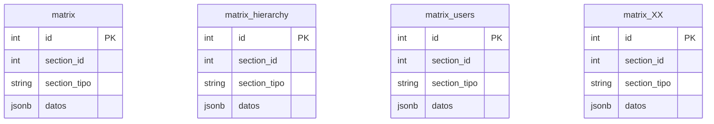
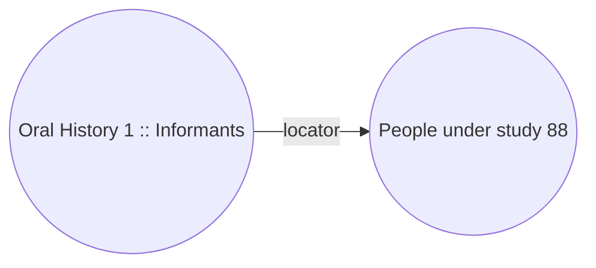

# Locator

## Introduction

Locator is the connection, the relation, between data. Dédalo uses a NoSQL model to store data in database, it is a flexible way to create schemas that can change by the time, usually NoSQL models has not relations between data, but we want to have data relations as classical SQL has, relation data is great, you have only 1 record with the information and is called by lots of other records. One change in the related data is automatically update in the caller. No duplicate data make than your catalogue could be maintainable in the time. Dédalo use the best of this two wolds the flexibility of NoSQL and the relations of SQL, why we need to choose one?

## locator definition

./core/common/class.locator.php

**locator** `object`

Locators are the way to connect data in Dédalo, besides locators are the own data for multiple components; selects, portals, check boxes, etc. These components uses locators to point and resolve his data.

Locator is an extensible object, it depends of the data pointed and his properties could be extended by specific uses.

### Function and structure

To understand how locator works, keep in mind that Dédalo uses a few tables to store lot of sections named, this tables are named as "matrix_XXX" and all of these tables has the same schema:



The column `datos` contain all data of the section in json format.

!!! note "JSON storage"
    We use the JSONB (binary json) definition of PostgreSQL instead string json format.

The columns section_id and section_tipo are the most basic format of locator:

```json
{
    "section_id": 1,
    "section_tipo": "oh1"
}
```

When a component need to call to other section and get his data will use a locator.

Locator has a direction, the basic format is a unidirectional pointer; point to data (to).



The component "Informants" ([oh24](https://dedalo.dev/ontology/oh24)) of "Oral History" section ([oh1](https://dedalo.dev/ontology/oh1)) with section_id = 1 point to "People under study" section ([rsc197](https://dedalo.dev/ontology/rsc197)) amb section_id = 88. In these case the locator is store into "Informants" component and the data of this component_portal will be:

```json
{
    "section_id": 88,
    "section_tipo": "rsc197"
}
```

Every time that the Oral history 1 will load the component informants will use the locator to call to People under study 88 to get his data.

The locator resolution will use the columns section_id and section_tipo in matrix tables to locate the specific row of the database.

See it as tables:

Table: **matrix**

| id | section_id | section_tipo | datos |
| --- | --- | --- | --- |
| 345 | 1 | oh1 | \[{"oh24":\[{"section_id": 88, "section_tipo": "rsc97"}]}] |

table: **matrix**

| id | section_id | section_tipo | datos |
| --- | --- | --- | --- |
| 654 | 88 | rsc197 | \[{"rsc85":\["Adela"]},{"rsc86":\["García"]}] |

When ask to informants field it will answer with the data in People under study 88, with the name ([rsc85](https://dedalo.dev/ontology/rsc85)) and surname ([rsc86](https://dedalo.dev/ontology/rsc86)) of the informant.

Then the result will be:

| id | section_id | section_tipo | datos |
| --- | --- | --- | --- |
| 345 | 1 | oh1 | Adela García |

Locators can point to:

- sections : with `section_id` and `section_tipo`
- components : with `component_tipo`
- tags (parts or fragments of components) : with `tag_id`

Locator defines the source with the prefix *from*:

`from_section_tipo`: the section that has the component that store the locator, the caller, the source.

### Properties

- **section_id** : `string` destination section_id **Mandatory** | ex : 1
- **section_tipo** : `string` destination section_tipo **Mandatory** | ex : rsc197
- **component_tipo** : `string` destination component tipo | ex : rsc85
- **from_section_tipo** : `string` source section_tipo, used as from section_tipo | ex : oh1
- **from_section_id** : `string` source section_id, used as from section_id | ex : a
- **from_component_tipo** : `string` source component tipo | ex : oh25
- **tag_id** : `string` destination tag inside component_tipo | ex : 1
- **tag_component_tipo** : `string` component that has the tag in the same section | ex : rsc36
- **type** : `string` defines the locator relation type (link, external link, parent, child, related, model ) | ex : dd151
- **section_id_key** : `int` data-frame index array number of the data that reference | ex : 1
- **section_tipo_key** : `string` data-frame index array tipo of the data that reference | ex : rsc197
- **section_top_tipo** : `string` source section_tipo  **Deprecated** use *from_section_tipo* | ex : oh1
- **section_top_id** : `string` source section_id **Deprecated** use *from_section_id* | ex : 1

## Flat version

Normal locator is a object, but, in some cases, is useful a string version of the locator, for example to be used as filename of images, pdf or audiovisual files. The flat version of the locator is a chained plain locator string without the properties name.

Example; the section_id 3 of an image could pointed in this way:

```json
{
    "section_id": 3,
    "section_tipo": "rsc170",
    "component_tipo": "rsc29"
}
```

The locator says: get the record 3 (section_id) section image (section_tipo [rsc170](https://dedalo.dev/ontology/rsc170)) and give me the field of the image (component_tipo [rsc29](https://dedalo.dev/ontology/rsc29))

Flat version only uses the values of the locator and always has this structure:

component_tipo_section_tipo_section_id

The '_' character is use to separate the values, and the result of previous locator in his flat version will be: **rsc29_rsc170_3**

As the flat version is used to named the media files, the image is stored as: rsc29_rsc170_3.jpg in the server.

It's possible to get flat version calling to the `get_flat()` function of the locator class.