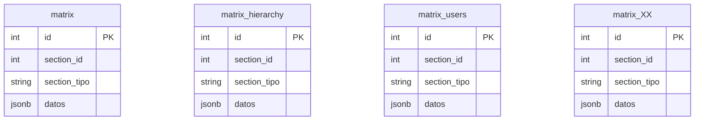
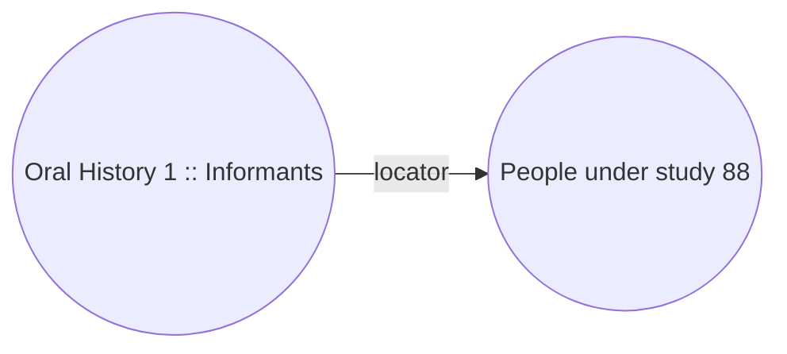
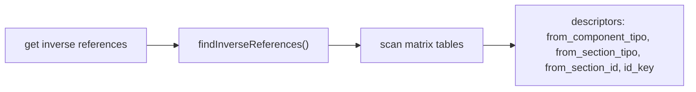
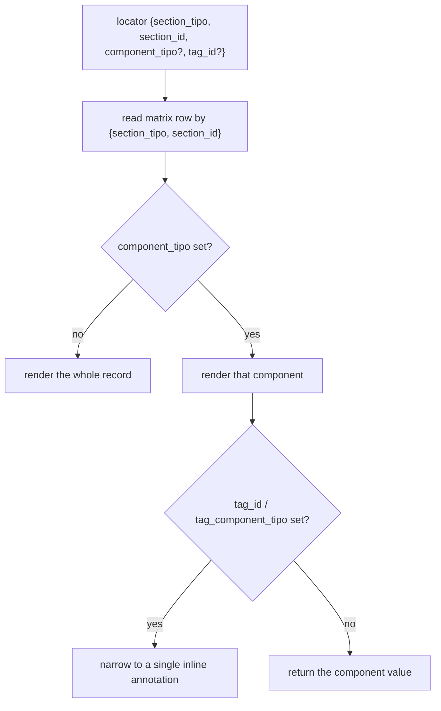

# Locator

> See also: [Sections](sections/index.md) · [Component portal](components/component_portal.md) · [Component dataframe](components/component_dataframe.md) · [Glossary](glossary.md)

A locator is the pointer Dédalo uses to connect data — a relative, directional reference from one record to another. This page covers what a locator is, its full property set, the relation `type` values, how it is stored and resolved, and its flat string form.

## Introduction

A locator is the connection, the relation, between data. Dédalo uses a NoSQL model to store data in the database; it is a flexible way to create schemas that can change over time. NoSQL models usually have no relations between data, but we want data relations like classic SQL has. Related data is great: you keep the information in a single record that many other records point to. One change in the related data automatically updates every caller. Avoiding duplicate data keeps your catalogue maintainable over time. Dédalo takes the best of these two worlds — the flexibility of NoSQL and the relations of SQL. Why should we have to choose just one?

## Locator definition

`src/core/concepts/locator.ts` defines the locator as `locatorSchema`/`Locator` — a plain, `zod`-validated object. See [Property reference](#property-reference) for its full field set.

**locator** `object`

Locators are how Dédalo connects data. In addition, locators are the actual data of several components — selects, portals, check boxes, etc. These components use locators to point at and resolve their data.

A locator is an extensible object: it depends on the data it points at, and its properties can be extended for specific uses.

A locator is the universal **value object (DTO)** that addresses a single entity in Dédalo's data model: a section record, a component within it, an inline tag, or a language record. `locatorSchema` is a `.passthrough()` object, so callers may attach ad-hoc pseudo-properties (`id`, `paginated_key`, `label`) that survive JSON round-trips. **Properties are sparse**: only meaningful fields are set, and absent ones simply do not serialize.

!!! note "How locators graft SQL relations onto NoSQL"
    Each section lives in a `matrix_*` table (`id PK, section_id, section_tipo, datos jsonb`), and the two-field pair `{section_tipo, section_id}` is the minimal locator that pins a row. Relation components (portal, select, check_box, autocomplete, etc.) store *arrays of locators* as their own data, so one canonical record can be pointed at by many. Resolving a locator means reading the target row and rendering the requested component.

### Function and structure

To understand how a locator works, keep in mind that Dédalo uses a few tables to store many sections. These tables are named `matrix_XXX`, and they all share the same schema:


```mermaid
erDiagram
    matrix {
        int id PK
        int section_id
        string section_tipo
        jsonb datos
    }
    matrix_hierarchy {
        int id PK
        int section_id
        string section_tipo
        jsonb datos
    }
     matrix_users {
        int id PK
        int section_id
        string section_tipo
        jsonb datos
    }
    matrix_XX {
        int id PK
        int section_id
        string section_tipo
        jsonb datos
    }
```

The `datos` column holds all the data of the section in JSON format.

!!! note "JSON storage"
    We use the JSONB (binary JSON) type of PostgreSQL instead of the string JSON format.

The `section_id` and `section_tipo` columns are the most basic form of a locator:

```json
{
    "section_id": 1,
    "section_tipo": "oh1"
}
```

When a component needs to call another section and get its data, it uses a locator.

A locator has a direction. The basic form is a unidirectional pointer: it points to data (to).


```mermaid
    graph LR
    A((Oral History 1 :: Informants)) --locator--> B((People under study 88))
```

The component "Informants" ([oh24](https://dedalo.dev/ontology/oh24)) of the "Oral History" section ([oh1](https://dedalo.dev/ontology/oh1)) with `section_id = 1` points to the "People under study" section ([rsc197](https://dedalo.dev/ontology/rsc197)) with `section_id = 88`. In this case the locator is stored in the "Informants" component, and the data of this component_portal is:

```json
{
    "section_id": 88,
    "section_tipo": "rsc197"
}
```

Every time Oral History 1 loads the Informants component, it uses the locator to call People under study 88 and get its data.

Locator resolution uses the `section_id` and `section_tipo` columns of the matrix tables to locate the specific row in the database.

See it as tables:

Table: **matrix**

| id | section_id | section_tipo | datos |
| --- | --- | --- | --- |
| 345 | 1 | oh1 | \[{"oh24":\[{"section_id": 88, "section_tipo": "rsc197"}]}] |

table: **matrix**

| id | section_id | section_tipo | datos |
| --- | --- | --- | --- |
| 654 | 88 | rsc197 | \[{"rsc85":\["Adela"]},{"rsc86":\["García"]}] |

When you ask for the Informants field, it answers with the data of People under study 88: the name ([rsc85](https://dedalo.dev/ontology/rsc85)) and surname ([rsc86](https://dedalo.dev/ontology/rsc86)) of the informant.

Then the result is:

| id | section_id | section_tipo | datos |
| --- | --- | --- | --- |
| 345 | 1 | oh1 | Adela García |

Locators can point to:

- **sections** : with `section_id` and `section_tipo`
- **components** : with `component_tipo`
- **tags** (parts or fragments of components) : with `tag_id`
- **languages** : a record of the languages section, addressed the same way as any other section record (`section_id`/`section_tipo`)

A locator names its source with the *from* prefix:

`from_section_tipo`: the section holding the component that stores the locator — the caller, the source.

## Property reference

A locator is sparse: a portal link may carry only `{section_tipo, section_id, type, from_component_tipo}`, while a dataframe locator adds `id_key`, and a tag locator adds `tag_id`/`tag_component_tipo`. Only `section_tipo` and `section_id` are always required, shape-checked by `locatorSchema` in `src/core/concepts/locator.ts`, with tipo-charset validation at the identifier gate, `assertValidTipo()` in `src/core/search/identifier_gate.ts`.

`Locator` (`src/core/concepts/locator.ts`) is a plain object validated as a whole by `locatorSchema` — a `zod` `.passthrough()` object, so unmodeled keys survive a parse/serialize round-trip. Every field below is simply an optional property on that object.

### Mandatory

| Property | Type | Meaning | Example |
| --- | --- | --- | --- |
| **section_tipo** | `string` | Ontology tipo of the **target** section | `rsc197` |
| **section_id** | `string` | Record id of the **target** section (accepts the sentinel `'unknown'` for pre-creation) | `88` |

### Destination addressing (optional)

| Property | Type | Meaning | Example |
| --- | --- | --- | --- |
| **component_tipo** | `string` | Destination component within the target section; narrows the pointer from whole-record to one field | `rsc85` |
| **tag_id** | `string` | Id of an inline tag inside a `component_text_area` | `1` |
| **tag_component_tipo** | `string` | Tipo of the component (typically a text_area) that holds the tag | `rsc36` |
| **tag_type** | `string` | Ontology tipo of the tag kind (index / reference / draw …), stored as a tipo, not a label | _tipo_ |
| **lang** | `string` | Language code of the target | `lg-spa` |
| **tipo** | `string` | Generic tipo for term-node locators (neither section nor component) | `rsc36` |

### Source / directionality (the `from_*` prefix marks the caller side)

| Property | Type | Meaning | Example |
| --- | --- | --- | --- |
| **from_section_tipo** | `string` | Source section_tipo (the section owning the component that stored the locator) | `oh1` |
| **from_section_id** | `string` | Source section_id | `1` |
| **from_component_tipo** | `string` | Source component tipo; needed to navigate a relation back to its origin | `oh25` |
| **from_component_top_tipo** | `string` | Originating top-level component in nested-grid traversal | `oh1` |
| **type** | `string` | Relation type tipo — see [Relation `type` values](#relation-type-values) | `dd151` |
| **type_rel** | `string` | Directionality descriptor: `unidirectional` / `bidirectional` / `multidirectional` | `bidirectional` |

### Dataframe pairing

| Property | Type | Meaning | Example |
| --- | --- | --- | --- |
| **id_key** | `int` | The stable `id` of the main-component data item this dataframe locator extends — the unified pairing contract | `3` |
| **main_component_tipo** | `string` | Used by a dataframe to identify its own parent component | `rsc85` |
| **section_id_key** | `int` | **@deprecated** legacy dataframe pairing key, retired by `id_key`; no longer read by live code — used only by the old-CSV import and the v6→v7 update | `1` |
| **section_tipo_key** | `string` | **@deprecated** legacy pairing tipo, retired by the `id_key` unification (old-CSV import / v6→v7 update only) | `rsc197` |

### Deprecated hierarchical anchors (v6, being abandoned)

| Property | Type | Replacement | Example |
| --- | --- | --- | --- |
| **section_top_tipo** | `string` | use **from_section_tipo** | `oh1` |
| **section_top_id** | `string` | use **from_section_id** | `1` |

These were a top-level parent section anchor for deeply nested grid components; v7 maps them to the `from_section_*` fields.

### Transient pseudo-properties

The `.passthrough()` schema lets callers attach throwaway fields that are never part of a normalized stored locator:

| Property | Used by |
| --- | --- |
| **id** | Attaches the literal component item id to a pseudo-locator so subdatum resolution can match it without a real section_id |
| **paginated_key** | Zero-based pagination index; stripped before persisting a relation |
| **label** | Select-widget option display; discarded on hydration |

## Relation `type` values

The `type` property is a **real ontology tipo, not a label**. The constants are declared where needed, split across `src/core/ontology/ontology_tipos.ts` (`RELATION_TYPE_LINK`/`_PARENT`/`_CHILDREN`/`_INDEX`), `src/core/relations/related.ts` (`RELATED_UNIDIRECTIONAL`/`_BIDIRECTIONAL`/`_MULTIDIRECTIONAL`) and `src/core/concepts/subdatum.ts` (`DATAFRAME_RELATION_TYPE`) — there is no single central constants file:

| Constant | Value | Meaning |
| --- | --- | --- |
| `DEDALO_RELATION_TYPE_LINK` | `dd151` | Generic portal/select **link** (the default for most relations) |
| `DEDALO_RELATION_TYPE_PARENT_TIPO` | `dd47` | Hierarchy **parent** |
| `DEDALO_RELATION_TYPE_CHILDREN_TIPO` | `dd48` | Hierarchy **child** |
| `DEDALO_RELATION_TYPE_RELATED_TIPO` | `dd89` | **Related** record |
| `DEDALO_RELATION_TYPE_RELATED_UNIDIRECTIONAL_TIPO` | `dd620` | Related, unidirectional variant |
| `DEDALO_RELATION_TYPE_RELATED_BIDIRECTIONAL_TIPO` | `dd467` | Related, bidirectional variant |
| `DEDALO_RELATION_TYPE_RELATED_MULTIDIRECTIONAL_TIPO` | `dd621` | Related, multidirectional variant |
| `DEDALO_RELATION_TYPE_MODEL_TIPO` | `dd98` | **Model** |
| `DEDALO_RELATION_TYPE_INDEX_TIPO` | `dd96` | Index relation |
| `DEDALO_RELATION_TYPE_FILTER` | `dd675` | Project / access **filter** |
| `DEDALO_RELATION_TYPE_ONTOLOGY` | `dd77` | Ontology relation |
| `DEDALO_RELATION_TYPE_DATAFRAME` | `dd490` | Positive marker of **dataframe-pairing** locators |

Conceptually the addressing surface lists: **link / external link / parent / child / related / model**. "External link" is the external-source variant of a link.

A component's `type` comes from the ontology's `properties.config_relation.relation_type`, falling back to the component model's `defaultRelationType`. There is no single constructor hook for this — each relation write site stamps the correct `type` directly where it builds/persists the locator (e.g. `src/core/relations/save.ts`, `src/core/relations/models/portal.ts`).

### Directionality (`type_rel`)

For **related** relations the `type_rel` descriptor records direction, read from `properties.config_relation.relation_type_rel` and consumed by `src/core/relations/related.ts`:

- `unidirectional` — A points at B; B does not point back.
- `bidirectional` — both sides hold a matching locator.
- `multidirectional` — many-to-many web.

## How a locator is stored

### In the `relation` JSONB column, keyed by component tipo

Relation-component data lives in the matrix table's **`relation`** JSONB column, **keyed by component tipo**:

```json
{
    "oh24": [
        { "section_tipo": "rsc197", "section_id": "88", "type": "dd151", "from_component_tipo": "oh24" }
    ]
}
```

Reading a component's data means reading the same `relation` JSONB column off the row returned by `readMatrixRecord()` (`src/core/db/matrix.ts`) and taking the array under that component's tipo key.

### In the `relation_search` auxiliary column

Hierarchical-search components additionally write ancestor locators into the auxiliary **`relation_search`** column (`maintainRelationSearchIndex()` in `src/core/relations/save.ts` walks the parent chain), so a search for a node also matches its descendants.

## Inverse relations and resolution

### Locators are stored only on the forward (pointing) side

The inverse — "who points at me" — is **computed**, not stored:


```mermaid
graph LR
    A["get inverse references"] --> B["findInverseReferences()"]
    B --> C["scan matrix tables"]
    C --> D["descriptors: from_component_tipo, from_section_tipo, from_section_id, id_key"]
```

`src/core/search/search_related.ts` (`findInverseReferences()`) does this scan — used e.g. by the delete path and by the server-side observer engine (`src/core/api/handlers/observers.ts`) to recompute an "external relation" component's value from its live inverse references.

This drives referential-integrity cleanup on delete (`src/core/section/record/delete_record.ts`) and the inverse view of `relation_list`.

On the diffusion side this materialises as the **`dd_relations`** column, refactored from the legacy v6 `jer_dd_relations` column. The publication API's `resolve_inverse_relations` option resolves it, e.g.:

```json
{
    "type": "dd48",
    "section_id": "33",
    "section_tipo": "aa1",
    "from_component_tipo": "hierarchy49",
    "from_section_tipo": "aa1",
    "from_section_id": "4"
}
```

### Resolution to a value (locator → target row → value)


```mermaid
graph TD
    L["locator {section_tipo, section_id, component_tipo?, tag_id?}"] --> R["read matrix row by {section_tipo, section_id}"]
    R --> C{"component_tipo set?"}
    C -- "no" --> W["render the whole record"]
    C -- "yes" --> F["render that component"]
    F --> T{"tag_id / tag_component_tipo set?"}
    T -- "yes" --> A["narrow to a single inline annotation"]
    T -- "no" --> V["return the component value"]
```

1. Read the target `matrix` row by `{section_tipo, section_id}`.
2. If `component_tipo` is set, render that component (otherwise the whole record).
3. `tag_id`/`tag_component_tipo` narrow further to a single inline annotation.
4. For **dataframe** locators, `id_key` pairs the supplementary frame record to the exact main-component item (`section_id_key`/`section_tipo_key` are retired — read only by the old-CSV import and v6→v7 update).

### Helper functions

The **Locator law** gate (`test/unit/locator_law.test.ts`, 25 tests) pins these functions' semantics byte-for-byte.

| Function (`src/core/concepts/locator.ts`) | Purpose | Example |
| --- | --- | --- |
| `getTermIdFromLocator(loc)` | `section_tipo` + `section_id` joined by `_` (thesaurus/search term id) | `es1_185` |
| `compareLocators(l1, l2, properties?, excludeProperties?)` | Property-by-property equality (loose comparison only for `section_id`) | — |
| `isLocatorInArray(loc, arr, properties?)` | Membership test via composite hash key | — |
| `buildLocatorLookupKey(loc, properties?)` | Underscore-delimited composite key for O(1) dedup | `rsc197_88_dd151_oh24_` |

A `Locator` is already a plain `zod`-parsed object, not a class instance, so there is no separate "strip class identity" step. Validation of the mandatory fields runs through `locatorSchema.safeParse()`/`.parse()` — `.parse()` throws, `.safeParse()` returns `{success, data}` / `{success: false, error}` for the caller to report.

## Client-side (JS)

On the browser the locator is a **plain JavaScript object** — there is no locator class. Components manipulate it directly:

```javascript
// building a link locator from a term selection
locator.tag_id              = tag_id
locator.tag_component_tipo  = tag_component_tipo
locator.type                = DD_TIPOS.DEDALO_RELATION_TYPE_LINK ?? 'dd151'
Object.assign(locator, top_locator) // merge from_* anchors from tool_indexation
const result = await self.link_record(locator)
```

Notes for client work:

- Relation-type constants are exposed as `DD_TIPOS.DEDALO_RELATION_TYPE_*` (e.g. `dd151`), served to the client by the environment bootstrap (`DD_TIPOS` map in `src/core/resolve/environment.ts`).
- `link_record` / `unlink_record` add and remove locators from a relation component's value array. Unlink keys off `locator.id`.
- Transient UI-only fields (e.g. `close_modal`, `id`) may ride on the client locator; the server discards anything it does not recognise as a normalized property.
- Search/list flows generate single-record locators on the fly from `self.section_tipo` + `self.section_id` (`filter_by_locators`) when none is provided.

## Flat version

A normal locator is an object, but in some cases a string version of the locator is useful — for example, as the filename of image, PDF or audiovisual files. The flat version of the locator is a plain, chained locator string without the property names.

Example: the `section_id` 3 of an image can be pointed at like this:

```json
{
    "section_id": 3,
    "section_tipo": "rsc170",
    "component_tipo": "rsc29"
}
```

The locator says: get record 3 (`section_id`) of the image section (`section_tipo` [rsc170](https://dedalo.dev/ontology/rsc170)) and give me the image field (`component_tipo` [rsc29](https://dedalo.dev/ontology/rsc29)).

The flat version uses only the values of the locator and always has this structure:

`component_tipo_section_tipo_section_id`

The `_` character separates the values, and the flat version of the locator above is **rsc29_rsc170_3**.

Because the flat version is used to name media files, the image is stored on the server as `rsc29_rsc170_3.jpg`.

!!! note "Where the flat id is built"
    There is no `get_flat()` method anywhere on the `Locator` type. The flat id is built where media components need it — format `{component_tipo}_{section_tipo}_{section_id}` (e.g. `dd522_dd128_1`), used for file naming and URL generation — by `buildMediaIdentifier()` in `src/core/media/path.ts`, plus an optional trailing `_{lang}` for translatable media. `from_section_tipo`/`from_section_id` are, like every other field, plain optional properties on the `Locator` object — nothing constructs or validates them specially.

## See also

- [Sections](sections/index.md) — the `matrix_*` rows that locators address.
- [Component portal](components/component_portal.md) — the canonical relation component storing arrays of locators.
- [Component dataframe](components/component_dataframe.md) — the `id_key` pairing contract.
- [relation_list](ontology/relation_list.md) — forward and inverse relation views.
- [hierarchy](ontology/hierarchy.md) — parent/child relation locators (`dd47` / `dd48`).
