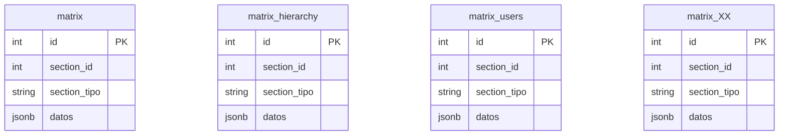
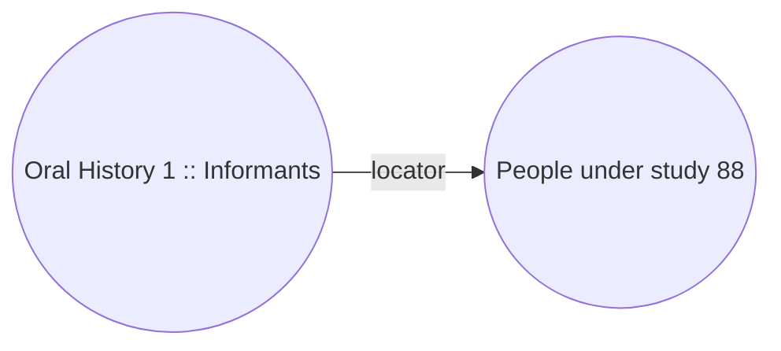
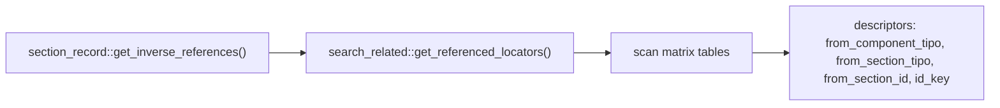
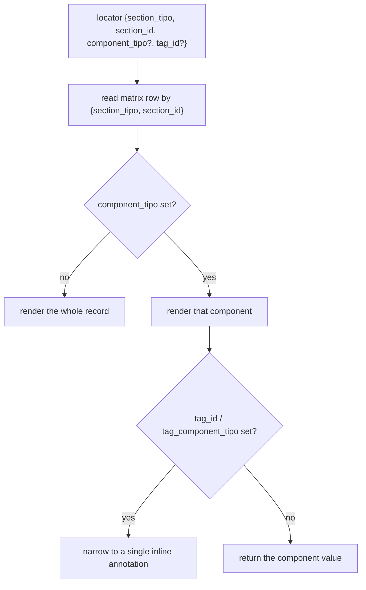

# Locator

## Introduction

Locator is the connection, the relation, between data. Dédalo uses a NoSQL model to store data in database, it is a flexible way to create schemas that can change by the time, usually NoSQL models has not relations between data, but we want to have data relations as classical SQL has, relation data is great, you have only 1 record with the information and is called by lots of other records. One change in the related data is automatically update in the caller. No duplicate data make than your catalogue could be maintainable in the time. Dédalo use the best of this two wolds the flexibility of NoSQL and the relations of SQL, why we need to choose one?

## locator definition

`./core/common/class.locator.php`

**locator** `object`

Locators are the way to connect data in Dédalo, besides locators are the own data for multiple components; selects, portals, check boxes, etc. These components uses locators to point and resolve his data.

Locator is an extensible object, it depends of the data pointed and his properties could be extended by specific uses.

A locator is the universal **value object (DTO)** that addresses a single entity in Dédalo's data model: a section record, a component within it, an inline tag, or a language record. The class `extends stdClass`, so callers may attach ad-hoc pseudo-properties (`id`, `paginated_key`, `label`) that survive JSON round-trips. **Properties are sparse**: only meaningful fields are set, and absent ones simply do not serialize.

!!! note "How locators graft SQL relations onto NoSQL"
    Each section lives in a `matrix_*` table (`id PK, section_id, section_tipo, datos jsonb`), and the two-field pair `{section_tipo, section_id}` is the minimal locator that pins a row. Relation components (portal, select, check_box, autocomplete, etc.) store *arrays of locators* as their own data, so one canonical record can be pointed at by many. Resolving a locator means reading the target row and rendering the requested component.

### Function and structure

To understand how locator works, keep in mind that Dédalo uses a few tables to store lot of sections named, this tables are named as "matrix_XXX" and all of these tables has the same schema:


```mermaid
erDiagram
    matrix {
        int id PK
        int section_id
        string section_tipo
        jsonb datos
    }
    matrix_hierarchy {
        int id PK
        int section_id
        string section_tipo
        jsonb datos
    }
     matrix_users {
        int id PK
        int section_id
        string section_tipo
        jsonb datos
    }
    matrix_XX {
        int id PK
        int section_id
        string section_tipo
        jsonb datos
    }
```

The column `datos` contain all data of the section in json format.

!!! note "JSON storage"
    We use the JSONB (binary json) definition of PostgreSQL instead string json format.

The columns section_id and section_tipo are the most basic format of locator:

```json
{
    "section_id": 1,
    "section_tipo": "oh1"
}
```

When a component need to call to other section and get his data will use a locator.

Locator has a direction, the basic format is a unidirectional pointer; point to data (to).


```mermaid
    graph LR
    A((Oral History 1 :: Informants)) --locator--> B((People under study 88))
```

The component "Informants" ([oh24](https://dedalo.dev/ontology/oh24)) of "Oral History" section ([oh1](https://dedalo.dev/ontology/oh1)) with section_id = 1 point to "People under study" section ([rsc197](https://dedalo.dev/ontology/rsc197)) amb section_id = 88. In these case the locator is store into "Informants" component and the data of this component_portal will be:

```json
{
    "section_id": 88,
    "section_tipo": "rsc197"
}
```

Every time that the Oral history 1 will load the component informants will use the locator to call to People under study 88 to get his data.

The locator resolution will use the columns section_id and section_tipo in matrix tables to locate the specific row of the database.

See it as tables:

Table: **matrix**

| id | section_id | section_tipo | datos |
| --- | --- | --- | --- |
| 345 | 1 | oh1 | \[{"oh24":\[{"section_id": 88, "section_tipo": "rsc97"}]}] |

table: **matrix**

| id | section_id | section_tipo | datos |
| --- | --- | --- | --- |
| 654 | 88 | rsc197 | \[{"rsc85":\["Adela"]},{"rsc86":\["García"]}] |

When ask to informants field it will answer with the data in People under study 88, with the name ([rsc85](https://dedalo.dev/ontology/rsc85)) and surname ([rsc86](https://dedalo.dev/ontology/rsc86)) of the informant.

Then the result will be:

| id | section_id | section_tipo | datos |
| --- | --- | --- | --- |
| 345 | 1 | oh1 | Adela García |

Locators can point to:

- **sections** : with `section_id` and `section_tipo`
- **components** : with `component_tipo`
- **tags** (parts or fragments of components) : with `tag_id`
- **languages** : a record of the languages section (see `lang_to_locator`)

Locator defines the source with the prefix *from*:

`from_section_tipo`: the section that has the component that store the locator, the caller, the source.

## Property reference

A locator is sparse: a portal link may carry only `{section_tipo, section_id, type, from_component_tipo}`, while a dataframe locator adds `id_key`, and a tag locator adds `tag_id`/`tag_component_tipo`. Only `section_tipo` and `section_id` are always required (enforced by `check_locator()` via `safe_tipo`/`safe_section_id` + `ontology_utils::check_tipo_is_valid`).

### Mandatory

| Property | Type | Setter | Meaning | Example |
| --- | --- | --- | --- | --- |
| **section_tipo** | `string` | `set_section_tipo` (validates `get_tld_from_tipo`) | Ontology tipo of the **target** section | `rsc197` |
| **section_id** | `string` | `set_section_id` (accepts sentinel `'unknown'` for pre-creation) | Record id of the **target** section | `88` |

### Destination addressing (optional)

| Property | Type | Setter | Meaning | Example |
| --- | --- | --- | --- | --- |
| **component_tipo** | `string` | `set_component_tipo` | Destination component within the target section; narrows the pointer from whole-record to one field | `rsc85` |
| **tag_id** | `string` | `set_tag_id` (positive int) | Id of an inline tag inside a `component_text_area` | `1` |
| **tag_component_tipo** | `string` | `set_tag_component_tipo` | Tipo of the component (typically a text_area) that holds the tag | `rsc36` |
| **tag_type** | `string` | `set_tag_type` (stored as a tipo, not a label) | Ontology tipo of the tag kind (index / reference / draw …) | _tipo_ |
| **lang** | `string` | `set_lang` (enforces `lg-` prefix) | Language code of the target | `lg-spa` |
| **tipo** | `string` | `set_tipo` | Generic tipo for term-node locators (neither section nor component) | `rsc36` |

### Source / directionality (the `from_*` prefix marks the caller side)

| Property | Type | Setter | Meaning | Example |
| --- | --- | --- | --- | --- |
| **from_section_tipo** | `string` | _no typed setter — assigned dynamically via `__construct`/property write_ | Source section_tipo (the section owning the component that stored the locator) | `oh1` |
| **from_section_id** | `string` | _dynamic-assignment path_ | Source section_id | `1` |
| **from_component_tipo** | `string` | `set_from_component_tipo` (validated) | Source component tipo; needed to navigate a relation back to its origin | `oh25` |
| **from_component_top_tipo** | `string` | `set_from_component_top_tipo` | Originating top-level component in nested-grid traversal | `oh1` |
| **type** | `string` | `set_type` (allow-list check currently commented out) | Relation type tipo — see [Relation `type` values](#relation-type-values) | `dd151` |
| **type_rel** | `string` | `set_type_rel` (no validation) | Directionality descriptor: `unidirectional` / `bidirectional` / `multidirectional` | `bidirectional` |

### Dataframe pairing

| Property | Type | Setter | Meaning | Example |
| --- | --- | --- | --- | --- |
| **id_key** | `int` | `set_id_key` (positive int) | The stable `id` of the main-component data item this dataframe locator extends — the unified pairing contract | `3` |
| **main_component_tipo** | `string` | `set_main_component_tipo` | Used by a dataframe to identify its own parent component | `rsc85` |
| **section_id_key** | `int` | `set_section_id_key` | **@deprecated** legacy dataframe pairing key, retired by `id_key`; no longer read by live code — used only by the old-CSV import and v6→v7 update | `1` |
| **section_tipo_key** | `string` | `set_section_tipo_key` | **@deprecated** legacy pairing tipo, retired by the `id_key` unification (old-CSV import / v6→v7 only) | `rsc197` |

### Deprecated hierarchical anchors (v6, being abandoned)

| Property | Type | Setter | Replacement | Example |
| --- | --- | --- | --- | --- |
| **section_top_tipo** | `string` | `set_section_top_tipo` | use **from_section_tipo** | `oh1` |
| **section_top_id** | `string` | `set_section_top_id` | use **from_section_id** | `1` |

These were a top-level parent section anchor for deeply nested grid components; v7 maps them to the `from_section_*` fields.

### Transient pseudo-properties

`extends stdClass` lets callers attach throwaway fields that are never part of a normalized stored locator:

| Property | Setter | Used by |
| --- | --- | --- |
| **id** | `set_id` | `component_common::get_subdatum` — attaches the literal component item id to a pseudo-locator so subdatum resolution can match it without a real section_id |
| **paginated_key** | `set_paginated_key` | zero-based pagination index; **stripped** by `section::add_relation` before persisting |
| **label** | `set_label` (no-op) | select-widget option display; discarded on hydration |

## Relation `type` values

The `type` property is a **real ontology tipo, not a label**. Constants live in `core/base/dd_tipos.php`:

| Constant | Value | Meaning |
| --- | --- | --- |
| `DEDALO_RELATION_TYPE_LINK` | `dd151` | Generic portal/select **link** (the default for most relations) |
| `DEDALO_RELATION_TYPE_PARENT_TIPO` | `dd47` | Hierarchy **parent** |
| `DEDALO_RELATION_TYPE_CHILDREN_TIPO` | `dd48` | Hierarchy **child** |
| `DEDALO_RELATION_TYPE_RELATED_TIPO` | `dd89` | **Related** record |
| `DEDALO_RELATION_TYPE_RELATED_UNIDIRECTIONAL_TIPO` | `dd620` | Related, unidirectional variant |
| `DEDALO_RELATION_TYPE_RELATED_BIDIRECTIONAL_TIPO` | `dd467` | Related, bidirectional variant |
| `DEDALO_RELATION_TYPE_RELATED_MULTIDIRECTIONAL_TIPO` | `dd621` | Related, multidirectional variant |
| `DEDALO_RELATION_TYPE_MODEL_TIPO` | `dd98` | **Model** |
| `DEDALO_RELATION_TYPE_INDEX_TIPO` | `dd96` | Index relation |
| `DEDALO_RELATION_TYPE_FILTER` | `dd675` | Project / access **filter** |
| `DEDALO_RELATION_TYPE_ONTOLOGY` | `dd77` | Ontology relation |
| `DEDALO_RELATION_TYPE_DATAFRAME` | `dd490` | Positive marker of **dataframe-pairing** locators |

Conceptually the addressing surface lists: **link / external link / parent / child / related / model**. "External link" is the external-source variant of a link.

A component's `type` is initialised in `component_relation_common::__construct` from `properties->config_relation->relation_type`, falling back to each subclass's `default_relation_type`.

### Directionality (`type_rel`)

For **related** relations the `type_rel` descriptor records direction, consumed by `component_relation_related`:

- `unidirectional` — A points at B; B does not point back.
- `bidirectional` — both sides hold a matching locator.
- `multidirectional` — many-to-many web.

## How a locator is stored

### In the `relation` JSONB column, keyed by component tipo

Relation-component data lives in the matrix table's **`relation`** JSONB column, **keyed by component tipo**:

```json
{
    "oh24": [
        { "section_tipo": "rsc197", "section_id": "88", "type": "dd151", "from_component_tipo": "oh24" }
    ]
}
```

`section_record::get_component_data('oh24','relation')` returns the locator array under key `oh24`.

### In the section-owned `relations` array

Separately, each section carries a **`relations` container** inside its `datos`:

- `section::get_relations($container='relations')` reads it.
- `section::add_relation($locator)` appends to it. It **requires `$locator->type`**, strips the transient `paginated_key`, dedupes via `locator::in_array_locator`, and **mutates in-memory only** — the caller must Save.

### In the `relation_search` auxiliary column

Hierarchical-search components additionally write ancestor locators into the auxiliary **`relation_search`** column (`get_relations_search_value` walks `get_parents_recursive`), so a search for a node also matches its descendants.

## Inverse relations and resolution

### Locators are stored only on the forward (pointing) side

The inverse — "who points at me" — is **computed**, not stored:


```mermaid
graph LR
    A["section_record::get_inverse_references()"] --> B["search_related::get_referenced_locators()"]
    B --> C["scan matrix tables"]
    C --> D["descriptors: from_component_tipo, from_section_tipo, from_section_id, id_key"]
```

This drives `remove_all_inverse_references()` on delete (referential integrity) and the inverse view of `relation_list`.

On the diffusion side this materialises as the **`dd_relations`** column (refactored from v6 `jer_dd_relations` by `v6_to_v7::refactor_jer_dd_relations`). The publication API's `resolve_inverse_relations` option resolves it, e.g.:

```json
{
    "type": "dd48",
    "section_id": "33",
    "section_tipo": "aa1",
    "from_component_tipo": "hierarchy49",
    "from_section_tipo": "aa1",
    "from_section_id": "4"
}
```

### Resolution to a value (locator → target row → value)


```mermaid
graph TD
    L["locator {section_tipo, section_id, component_tipo?, tag_id?}"] --> R["read matrix row by {section_tipo, section_id}"]
    R --> C{"component_tipo set?"}
    C -- "no" --> W["render the whole record"]
    C -- "yes" --> F["render that component"]
    F --> T{"tag_id / tag_component_tipo set?"}
    T -- "yes" --> A["narrow to a single inline annotation"]
    T -- "no" --> V["return the component value"]
```

1. Read the target `matrix` row by `{section_tipo, section_id}`.
2. If `component_tipo` is set, render that component (otherwise the whole record).
3. `tag_id`/`tag_component_tipo` narrow further to a single inline annotation.
4. For **dataframe** locators, `id_key` pairs the supplementary frame record to the exact main-component item (`section_id_key`/`section_tipo_key` are retired — read only by the old-CSV import and v6→v7 update).

### Helper methods

| Method | Purpose | Example |
| --- | --- | --- |
| `get_term_id_from_locator($loc)` | `section_tipo` + `section_id` joined by `_` (thesaurus/search term id) | `es1_185` |
| `get_section_id_from_locator($loc)` | Safe accessor returning `null` if absent | — |
| `lang_to_locator($lang)` | Lang code → locator into the languages section | `lg-spa` → `{section_tipo:"<langs>", section_id:17344}` |
| `compare_locators($l1,$l2,...)` | Property-by-property equality (loose `!=` only for `section_id`) | — |
| `in_array_locator($loc,$arr,...)` | Membership test via composite hash key | — |
| `get_key_in_array_locator($loc,$arr,...)` | Array index of first match (or `false`) | — |
| `build_locator_lookup_key($loc,$props)` | Underscore-delimited composite key for O(1) dedup | `rsc197_88_dd151_oh24_` |
| `get_std_class($loc)` | Strip class identity (JSON encode/decode) for cache/JSON | — |
| `check_locator()` | Validate mandatory fields; returns `{result, msg, errors}` — **does NOT throw** | — |

## Client-side (JS)

On the browser the locator is a **plain JavaScript object** — there is no locator class. Components manipulate it directly:

```javascript
// component_portal.js — building a link locator from a term selection
locator.tag_id              = tag_id
locator.tag_component_tipo  = tag_component_tipo
locator.type                = DD_TIPOS.DEDALO_RELATION_TYPE_LINK ?? 'dd151'
Object.assign(locator, top_locator) // merge from_* anchors from tool_indexation
const result = await self.link_record(locator)
```

Notes for client work:

- Relation-type constants are exposed as `DD_TIPOS.DEDALO_RELATION_TYPE_*` (mirroring the PHP `dd_tipos.php` values, e.g. `dd151`).
- `link_record` / `unlink_record` add and remove locators from a relation component's value array. Unlink keys off `locator.id`.
- Transient UI-only fields (e.g. `close_modal`, `id`) may ride on the client locator; the server discards anything it does not recognise as a normalized property.
- Search/list flows generate single-record locators on the fly from `self.section_tipo` + `self.section_id` (`filter_by_locators`) when none is provided.

## Flat version

Normal locator is a object, but, in some cases, is useful a string version of the locator, for example to be used as filename of images, pdf or audiovisual files. The flat version of the locator is a chained plain locator string without the properties name.

Example; the section_id 3 of an image could pointed in this way:

```json
{
    "section_id": 3,
    "section_tipo": "rsc170",
    "component_tipo": "rsc29"
}
```

The locator says: get the record 3 (section_id) section image (section_tipo [rsc170](https://dedalo.dev/ontology/rsc170)) and give me the field of the image (component_tipo [rsc29](https://dedalo.dev/ontology/rsc29))

Flat version only uses the values of the locator and always has this structure:

`component_tipo_section_tipo_section_id`

The '_' character is use to separate the values (the class constant `locator::DELIMITER`), and the result of previous locator in his flat version will be: **rsc29_rsc170_3**

As the flat version is used to named the media files, the image is stored as: `rsc29_rsc170_3.jpg` in the server.

!!! warning "Documentation drift — `get_flat()`"
    Older docs refer to a `get_flat()` method of the locator class, but **no such method exists in `class.locator.php` today**. The flat id is built where media components need it: `component_media_common::$id`, documented format `{component_tipo}_{section_tipo}_{section_id}` (e.g. `dd522_dd128_1`), used for file naming and URL generation. Likewise, typed `set_from_section_tipo` / `set_from_section_id` setters are referenced in some places but are not implemented — the `from_section_*` fields are populated via the dynamic `__construct` / property-write path.

## See also

- [Sections](sections/index.md) — the `matrix_*` rows that locators address.
- [Component portal](components/component_portal.md) — the canonical relation component storing arrays of locators.
- [Component dataframe](components/component_dataframe.md) — the `id_key` pairing contract.
- [relation_list](ontology/relation_list.md) — forward and inverse relation views.
- [hierarchy](ontology/hierarchy.md) — parent/child relation locators (`dd47` / `dd48`).
