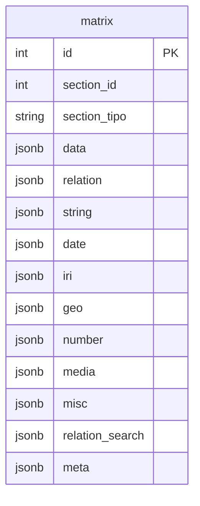
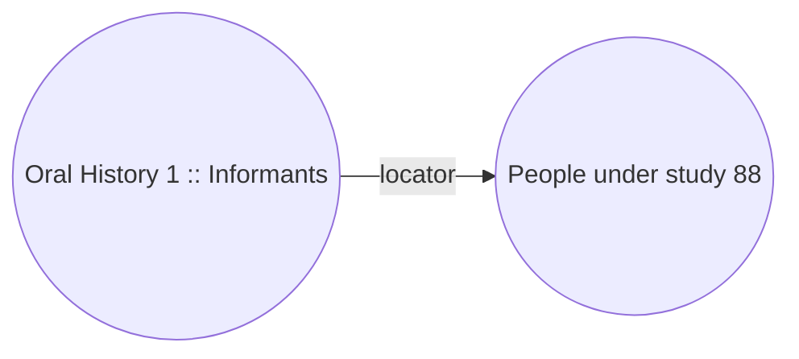
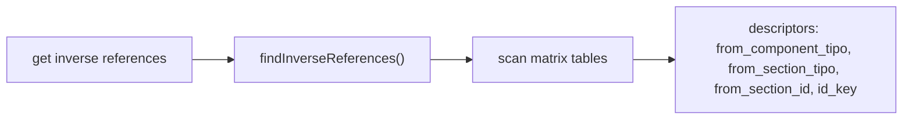
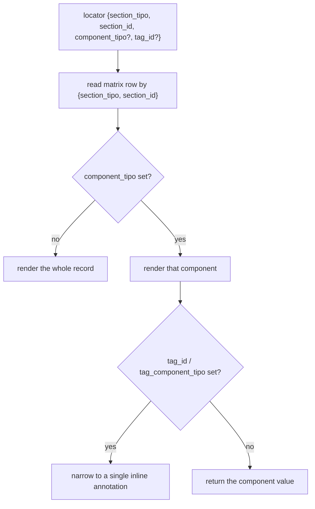

# Locator

> See also: [Sections](sections/index.md) · [Component portal](components/component_portal.md) · [Component dataframe](components/component_dataframe.md) · [Glossary](glossary.md)

A locator is the pointer Dédalo uses to connect data — a relative, directional reference from one record to another. This page covers what a locator is, its full property set, the relation `type` values, how it is stored and resolved, and its flat string form.

## Introduction

A locator is the connection, the relation, between data. Dédalo uses a NoSQL model to store data in the database; it is a flexible way to create schemas that can change over time. NoSQL models usually have no relations between data, but we want data relations like classic SQL has. Related data is great: you keep the information in a single record that many other records point to. One change in the related data automatically updates every caller. Avoiding duplicate data keeps your catalogue maintainable over time. Dédalo takes the best of these two worlds — the flexibility of NoSQL and the relations of SQL. Why should we have to choose just one?

## Locator definition

`src/core/concepts/locator.ts` defines the locator as `locatorSchema`/`Locator` — a plain, `zod`-validated object. See [Property reference](#property-reference) for its full field set.

**locator** `object`

Locators are how Dédalo connects data. In addition, locators are the actual data of several components — selects, portals, check boxes, etc. These components use locators to point at and resolve their data.

A locator is an extensible object: it depends on the data it points at, and its properties can be extended for specific uses.

A locator is the universal **value object (DTO)** that addresses a single entity in Dédalo's data model: a section record, a component within it, an inline tag, or a language record. `locatorSchema` is a `.passthrough()` object, so callers may attach ad-hoc keys that survive JSON round-trips — most of the fields this page documents are **modeled** on the schema; only a handful ride through on passthrough (see [Property reference](#property-reference)). **Properties are sparse**: only meaningful fields are set, and absent ones simply do not serialize.

!!! note "How locators graft SQL relations onto NoSQL"
    Each section record is one row in a `matrix_*` table, addressed by the pair `{section_tipo, section_id}` — the minimal locator. Relation components (portal, select, check_box, autocomplete, etc.) store *arrays of locators* as their own data, so one canonical record can be pointed at by many. Resolving a locator means reading the target row and rendering the requested component. The row's payload is **not** one blob: v7 splits it across typed JSONB columns, so a relation locator lives in `relation`, a literal value in `string`, and so on — see [Function and structure](#function-and-structure).

### Function and structure

To understand how a locator works, keep in mind that Dédalo uses a few tables to store many sections. Every standard matrix table (`matrix`, `matrix_dd`, `matrix_hierarchy`, `matrix_users`, `matrix_dataframe`, `matrix_list`, `matrix_notes`, …) shares **one** schema — three structural columns plus eleven typed JSONB payload columns:


```mermaid
erDiagram
    matrix {
        int id PK
        int section_id
        string section_tipo
        jsonb data
        jsonb relation
        jsonb string
        jsonb date
        jsonb iri
        jsonb geo
        jsonb number
        jsonb media
        jsonb misc
        jsonb relation_search
        jsonb meta
    }
```

`(section_id, section_tipo)` is the logical key — a `UNIQUE` constraint on every standard table — while `id` is only the surrogate primary key. **Which** table a section lives in is resolved from the ontology, never hardcoded (`getMatrixTableFromTipo()` in `src/core/ontology/resolver.ts`); the identifier allowlist `MATRIX_TABLE_ALLOWLIST` in `src/core/db/matrix.ts` is the gate. So there is no such thing as "the `matrix_XX` of a section" in prose — you ask the ontology.

There is **no single `datos` column**. That was the v6 shape; v7 splits a record's payload by component model, and `getColumnNameByModel()` (`src/core/ontology/resolver.ts`) is the mapping — a `component_portal` writes into `relation`, a `component_input_text` into `string`, a `component_date` into `date`, and so on. The TS mirror of the column set is `MATRIX_JSONB_COLUMNS` (`src/core/db/matrix.ts`); a read comes back as a `MatrixRecord` (`{id, section_id, section_tipo, columns, rawText}`).

!!! warning "`data` is section metadata, not component values"
    The `data` column carries **record-level metadata** — `label`, `created_date`, `created_by_user_id`, `diffusion_info` — not the components' values. Looking for a component's value in `data` finds nothing; look in the column its model maps to.

A few tables deliberately depart from the standard shape (`src/core/db/matrix.ts` documents each): `matrix_activity` / `matrix_activity_diffusion` add a `timestamp` column on top of the standard set; `matrix_time_machine` is a flat audit table (`id, bulk_process_id, section_id, section_tipo, tipo, lang, timestamp, user_id, bulk_process_temp, data`); `matrix_counter` / `matrix_counter_dd` are `(tipo, value, ref)`; `matrix_updates` and `matrix_notifications` are `(id, data)` queues.

!!! note "JSON storage"
    We use the JSONB (binary JSON) type of PostgreSQL instead of the string JSON format. Each table carries btree indexes on `section_id`, `section_tipo` and `(section_tipo, section_id DESC)`, GIN `jsonb_path_ops` indexes on the searchable payload columns, and expression GINs over flattened relation locators — which is what makes a locator probe cheap.

Two further tables, `matrix_string_search` and `matrix_relation_index`, are **derived and never authoritative**: trigger-maintained accelerators, safe to truncate and re-backfill (`src/core/db/db_pg_definitions.json`).

The `section_id` and `section_tipo` columns are the most basic form of a locator:

```json
{
    "section_id": 1,
    "section_tipo": "oh1"
}
```

When a component needs to call another section and get its data, it uses a locator.

A locator has a direction. The basic form is a unidirectional pointer: it points to data (to).


```mermaid
    graph LR
    A((Oral History 1 :: Informants)) --locator--> B((People under study 88))
```

The component "Informants" ([oh24](https://dedalo.dev/ontology/oh24)) of the "Oral History" section ([oh1](https://dedalo.dev/ontology/oh1)) with `section_id = 1` points to the "People under study" section ([rsc197](https://dedalo.dev/ontology/rsc197)) with `section_id = 88`. In this case the locator is stored in the "Informants" component, and the data of this component_portal is:

```json
{
    "section_id": 88,
    "section_tipo": "rsc197"
}
```

Every time Oral History 1 loads the Informants component, it uses the locator to call People under study 88 and get its data.

Locator resolution uses the `section_id` and `section_tipo` columns of the matrix tables to locate the specific row in the database.

See it as rows. The caller's locator sits in the **`relation`** column, in an object **keyed by the component tipo that stores it** (only the relevant column is shown; the other ten are omitted):

Table: **matrix**

| id | section_id | section_tipo | relation |
| --- | --- | --- | --- |
| 345 | 1 | oh1 | `{"oh24":[{"id":1,"type":"dd151","section_id":88,"section_tipo":"rsc197","from_component_tipo":"oh24"}]}` |

The target's literal values sit in the **`string`** column of its own row, keyed the same way — one entry per language, each with its own item `id`:

Table: **matrix**

| id | section_id | section_tipo | string |
| --- | --- | --- | --- |
| 654 | 88 | rsc197 | `{"rsc85":[{"id":1,"lang":"lg-nolan","value":"Adela"}],"rsc86":[{"id":1,"lang":"lg-nolan","value":"García"}]}` |

When you ask for the Informants field, it answers with the data of People under study 88: the name ([rsc85](https://dedalo.dev/ontology/rsc85)) and surname ([rsc86](https://dedalo.dev/ontology/rsc86)) of the informant.

So the resolved value of `oh24` on Oral History 1 is **Adela García** — assembled at read time from the target row, never copied into the caller's own row.

!!! warning "The two shapes examples get wrong"
    The column is **`relation`**, singular — not `relations`. And it is an **object keyed by component tipo**, not a flat array of locators. `{"relations": [ … ]}` is wrong on both counts.

Locators can point to:

- **sections** : with `section_id` and `section_tipo`
- **components** : with `component_tipo`
- **tags** (parts or fragments of components) : with `tag_id`
- **languages** : a record of the languages section, addressed the same way as any other section record (`section_id`/`section_tipo`)

A locator names its source with the *from* prefix:

`from_section_tipo`: the section holding the component that stores the locator — the caller, the source.

## Property reference

A locator is sparse: a portal link may carry only `{section_tipo, section_id, type, from_component_tipo}`, while a dataframe locator adds `id_key`, and a tag locator adds `tag_id`/`tag_component_tipo`. Only `section_tipo` and `section_id` are always required, shape-checked by `locatorSchema` in `src/core/concepts/locator.ts`, with tipo-charset validation at the identifier gate, `assertValidTipo()` in `src/core/search/identifier_gate.ts`.

`Locator` (`src/core/concepts/locator.ts`) is a plain object validated as a whole by `locatorSchema` — a `zod` `.passthrough()` object. That splits the field set in two, and the difference is real:

- **Modeled** fields are declared on the schema: they are typed, validated, and the engine writes them. These are `section_tipo`, `section_id`, `component_tipo`, `from_component_tipo`, `type`, `type_rel`, `lang`, `tag_id`, `tag_component_tipo`, `tag_type`, `id_key`, `section_id_key`, `section_tipo_key`, `main_component_tipo`, `id`, `paginated_key`.
- **Passthrough** fields are not on the schema at all. `.passthrough()` means they survive a parse/serialize round-trip untouched (byte-compat with stored data), but nothing validates their type and the core write path does not stamp them: `from_section_tipo`, `from_section_id`, `from_component_top_tipo`, `section_top_tipo`, `section_top_id`, `label`.

Every modeled field except the two mandatory ones is optional.

### Mandatory

| Property | Type | Meaning | Example |
| --- | --- | --- | --- |
| **section_tipo** | `string` | Ontology tipo of the **target** section | `rsc197` |
| **section_id** | `int` | Record id of the **target** section — always an integer, negatives included (accepts the sentinel `'unknown'` for pre-creation, and an external-service remote id as a string; see [Canonical form of `section_id`](#canonical-form-of-section_id)) | `88` |

### Destination addressing (optional)

| Property | Type | Meaning | Example |
| --- | --- | --- | --- |
| **component_tipo** | `string` | Destination component within the target section; narrows the pointer from whole-record to one field | `rsc85` |
| **tag_id** | `string` | Id of an inline tag inside a `component_text_area` | `1` |
| **tag_component_tipo** | `string` | Tipo of the component (typically a text_area) that holds the tag | `rsc36` |
| **tag_type** | `string` | Ontology tipo of the tag kind (index / reference / draw …), stored as a tipo, not a label | _tipo_ |
| **lang** | `string` | Language code of the target | `lg-spa` |

### Relation flavour (modeled)

| Property | Type | Meaning | Example |
| --- | --- | --- | --- |
| **from_component_tipo** | `string` | Source component tipo — the component that CREATED the relation; needed to navigate a relation back to its origin | `oh25` |
| **type** | `string` | Relation type tipo — see [Relation `type` values](#relation-type-values) | `dd151` |
| **type_rel** | `string` | Directionality descriptor: `unidirectional` / `bidirectional` / `multidirectional` | `bidirectional` |

Note that `type` and `type_rel` are **not** `from_*` fields: they describe the relation itself, not the caller side.

### Dataframe pairing

| Property | Type | Meaning | Example |
| --- | --- | --- | --- |
| **id_key** | `int` | The stable `id` of the main-component data item this dataframe locator extends — the unified pairing contract | `3` |
| **main_component_tipo** | `string` | Used by a dataframe to identify its own parent component | `rsc85` |
| **section_id_key** | `int` | **@deprecated** legacy dataframe pairing key, retired by `id_key`; read only as a BC fallback (e.g. legacy dataframe order resolution in `ts_object/node_repository.ts` `pickOrderValueForParent()`) and by the old-CSV import / v6→v7 update — never written anew | `1` |
| **section_tipo_key** | `string` | **@deprecated** legacy pairing tipo, retired by the `id_key` unification; read only as a BC fallback (same `ts_object/node_repository.ts` order path) and by the old-CSV import / v6→v7 update — never written anew | `rsc197` |

### Passthrough fields

These are **not** on `locatorSchema`. They ride through unvalidated, and the core relation write path does not stamp them — so do not expect to find them on an arbitrary stored locator.

| Property | Type | Where it actually comes from |
| --- | --- | --- |
| **section_top_tipo** | `string` | **Live, not deprecated.** The top-level record anchor of an indexation locator: `src/core/section/indexation_grid.ts` defaults it to the locator's own `section_tipo` and groups the indexation grid by it. |
| **section_top_id** | `int` \| `string` | Its id twin, canonicalized through `canonicalizeStoredSectionId()` on read (same file). |
| **from_component_top_tipo** | `string` | The originating top-level component of an index relation; `src/core/resolve/relation_index.ts` derives it from `from_component_tipo` when projecting an index entry. |
| **from_section_tipo** | `string` | Appears in **read/ordering** paths (`src/core/search/order_path.ts` prepends it for a subdatum ddo, so the sort join chain starts at the section being listed) and in stored `component_inverse` payloads. The engine does not stamp it on locators it stores, and diffusion never emits it. |
| **from_section_id** | `string` | Its id twin, same readers. **The int law does not reach it**: `ADDRESS_KEYS` in `src/core/update/transform/section_id_intify.ts` is exactly `section_id`, `section_id_key`, `parent_section_id`, so the data sweep never converted `from_section_id` and stored payloads keep the string form. Semantically an address, mechanically untouched — do not "fix" it to an int. |
| **label** | `string` | Select-widget option display; discarded on hydration. The only genuinely throwaway field of the set. |

!!! warning "`section_top_*` is not a legacy alias of `from_section_*`"
    Earlier documentation claimed v7 maps `section_top_tipo`/`section_top_id` onto `from_section_tipo`/`from_section_id`. No such mapping exists, in either direction. They are separate fields with separate readers.

### Modeled convenience fields

| Property | Type | Meaning |
| --- | --- | --- |
| **id** | `int` \| `string` | Item id: on a stored relation entry it is the entry's own stable id; on a pseudo-locator it carries the literal component item id so subdatum resolution can match it without a real `section_id`. |
| **paginated_key** | `int` | Zero-based pagination index (paginated portals); stripped before persisting a relation. |

## Relation `type` values

The `type` property is a **real ontology tipo, not a label**. The constants are declared where needed, split across `src/core/ontology/ontology_tipos.ts` (`RELATION_TYPE_LINK`/`_PARENT`/`_CHILDREN`/`_INDEX`), `src/core/relations/related.ts` (`RELATED_UNIDIRECTIONAL`/`_BIDIRECTIONAL`/`_MULTIDIRECTIONAL`) and `src/core/concepts/subdatum.ts` (`DATAFRAME_RELATION_TYPE`) — there is no single central constants file:

| Constant (TS export) | Declared in | Value | Meaning |
| --- | --- | --- | --- |
| `RELATION_TYPE_LINK` | `ontology_tipos.ts` | `dd151` | Generic portal/select **link** (the default for most relations) |
| `RELATION_TYPE_PARENT` | `ontology_tipos.ts` | `dd47` | Hierarchy **parent** |
| `RELATION_TYPE_CHILDREN` | `ontology_tipos.ts` | `dd48` | Hierarchy **child** |
| `RELATION_TYPE_INDEX` | `ontology_tipos.ts` | `dd96` | Index relation |
| `RELATED_UNIDIRECTIONAL` | `relations/related.ts` | `dd620` | Related, unidirectional variant |
| `RELATED_BIDIRECTIONAL` | `relations/related.ts` | `dd467` | Related, bidirectional variant |
| `RELATED_MULTIDIRECTIONAL` | `relations/related.ts` | `dd621` | Related, multidirectional variant |
| `DATAFRAME_RELATION_TYPE` | `concepts/subdatum.ts` | `dd490` | Positive marker of **dataframe-pairing** locators |
| `RELATION_TYPE_FILTER` | `section/record/record_defaults.ts` | `dd675` | Project / access **filter** |

Two more relation types have **no constant**: they are literals on the component descriptor that defaults to them — `dd89` (**related** record, `component_relation_related`) and `dd98` (**model**, `component_relation_model`), each the `defaultRelationType` in that model's `descriptor.ts`.

!!! note "Names, not `DEDALO_*`"
    The exported names are the bare ones above. The `DEDALO_RELATION_TYPE_*` spelling belongs to the ontology's own constant naming (and to the client `DD_TIPOS` map); it is not what you import in TS.

Conceptually the addressing surface lists: **link / external link / parent / child / related / model**. "External link" is the external-source variant of a link.

A component's `type` comes from the ontology's `properties.config_relation.relation_type`, falling back to the component model's `defaultRelationType`. There is no single constructor hook for this — each relation write site stamps the correct `type` directly where it builds/persists the locator (e.g. `src/core/relations/save.ts`, `src/core/relations/models/portal.ts`).

### Directionality (`type_rel`)

For **related** relations the `type_rel` descriptor records direction, read from `properties.config_relation.relation_type_rel` and consumed by `src/core/relations/related.ts`:

- `unidirectional` — A points at B; B does not point back.
- `bidirectional` — both sides hold a matching locator.
- `multidirectional` — many-to-many web.

## How a locator is stored

### Canonical form of `section_id`

A record address is **always a safe integer** — negatives included (`-1` is the root/superuser record, `-666` the activity sentinel — the invariant is *integer*, never *positive* integer). Every writer mints the int form (`canonicalizeStoredSectionId()` in `src/core/concepts/section_id.ts`), and every app-API emission — reads, echoes, datalists, lock events — carries the int.

Three values are **not** addresses and are stored/echoed verbatim, never converted:

| value | what it is |
| --- | --- |
| `"001338683"`, `"Q42"` | an [external-service](system/external_services.md) remote id — the padding or the opaque token *is* the identifier. Protected by its own shape: a true remote id is never strict-numeric-without-leading-zeros |
| `"search_1"`, `"tmp_export_2"` | a synthetic client token that addresses no record |
| `"unknown"` | the pre-creation sentinel |

Reads stay tolerant of the legacy string form (`"88"`) so an install whose data has not yet been swept keeps working, and locator comparison is loose on `section_id`. Because jsonb `@>` containment is type-strict, every locator search probe runs in **dual form** — int and string — until the stock is converted. A numeric string arriving on the wire coerces at the boundary, but is deprecated and counted (see [Metrics](../development/metrics.md#the-counters-endpoint)).

Two edges keep the string form as contract, not legacy: the diffusion → published-database shape, and locator markers serialized inside text values (inline tags), both consumed by external readers.

Law: `engineering/wire_contract/WC-2026-08-10-section-id-int-canonical.md`.

### In the `relation` JSONB column, keyed by component tipo

Relation-component data lives in the matrix table's **`relation`** JSONB column, **keyed by component tipo**:

```json
{
    "oh24": [
        { "section_tipo": "rsc197", "section_id": 88, "type": "dd151", "from_component_tipo": "oh24" }
    ]
}
```

Reading a component's data means reading the same `relation` JSONB column off the row returned by `readMatrixRecord()` (`src/core/db/matrix.ts`) and taking the array under that component's tipo key.

### In the `relation_search` auxiliary column

Hierarchical-search components additionally write ancestor locators into the auxiliary **`relation_search`** column (`maintainRelationSearchIndex()` in `src/core/relations/save.ts` walks the parent chain), so a search for a node also matches its descendants.

## Inverse relations and resolution

### Locators are stored only on the forward (pointing) side

The inverse — "who points at me" — is **computed**, not stored:


```mermaid
graph LR
    A["get inverse references"] --> B["findInverseReferences()"]
    B --> C["scan matrix tables"]
    C --> D["descriptors: from_component_tipo, from_section_tipo, from_section_id, id_key"]
```

`src/core/search/search_related.ts` (`findInverseReferences()`) does this scan — used e.g. by the delete path and by the [server-side observer engine](system/observers.md) (`src/core/section/record/observers.ts`) to recompute an "external relation" component's value from its live inverse references.

This drives referential-integrity cleanup on delete (`src/core/section/record/delete_record.ts`) and the inverse view of `relation_list`.

On the diffusion side this materialises as the **`dd_relations`** column, refactored from the legacy v6 `jer_dd_relations` column. The publication API's `resolve_inverse_relations` option resolves it. The `relation_list` projection that fills the column emits **two keys only**, with the id as a string (`src/diffusion/resolve/resolver.ts`, the `relation_list` locator build):

```json
[
    { "section_tipo": "hierarchy20", "section_id": "33" }
]
```

An **index edge** publishes a wider locator — `type`, `section_tipo`, `section_id`, `component_tipo`, `tag_id`, `section_top_id`, `section_top_tipo`, `from_component_top_tipo`, `from_component_tipo`, in that key order — again with every id stringified (`src/diffusion/resolve/rewriters.ts`).

!!! warning "The published shape is stringified, and carries no `from_section_*`"
    Diffusion mints `String(sectionId)` on the way out, so the app wire's int law stops at this boundary — see [the `section_id` canonical form](#canonical-form-of-section_id). And no diffusion path emits `from_section_tipo`/`from_section_id`: those belong to `component_inverse` payloads and the read/ordering path, not to `dd_relations`.

### Resolution to a value (locator → target row → value)


```mermaid
graph TD
    L["locator {section_tipo, section_id, component_tipo?, tag_id?}"] --> R["read matrix row by {section_tipo, section_id}"]
    R --> C{"component_tipo set?"}
    C -- "no" --> W["render the whole record"]
    C -- "yes" --> F["render that component"]
    F --> T{"tag_id / tag_component_tipo set?"}
    T -- "yes" --> A["narrow to a single inline annotation"]
    T -- "no" --> V["return the component value"]
```

1. Read the target `matrix` row by `{section_tipo, section_id}`.
2. If `component_tipo` is set, render that component (otherwise the whole record).
3. `tag_id`/`tag_component_tipo` narrow further to a single inline annotation.
4. For **dataframe** locators, `id_key` pairs the supplementary frame record to the exact main-component item (`section_id_key`/`section_tipo_key` are retired — read only as a BC fallback, e.g. legacy dataframe order resolution in `ts_object/node_repository.ts`, and by the old-CSV import / v6→v7 update; never written anew).

### Helper functions

The **Locator law** gate (`test/unit/locator_law.test.ts`, 25 tests) pins these functions' semantics byte-for-byte.

| Function (`src/core/concepts/locator.ts`) | Purpose | Example |
| --- | --- | --- |
| `getTermIdFromLocator(loc)` | `section_tipo` + `section_id` joined by `_` (thesaurus/search term id) | `es1_185` |
| `compareLocators(l1, l2, properties?, excludeProperties?)` | Property-by-property equality (loose comparison only for `section_id`) | — |
| `isLocatorInArray(loc, arr, properties?)` | Membership test via composite hash key | — |
| `buildLocatorLookupKey(loc, properties?)` | Underscore-delimited composite key for O(1) dedup | `rsc197_88_dd151_oh24_` |

A `Locator` is already a plain `zod`-parsed object, not a class instance, so there is no separate "strip class identity" step. Validation of the mandatory fields runs through `locatorSchema.safeParse()`/`.parse()` — `.parse()` throws, `.safeParse()` returns `{success, data}` / `{success: false, error}` for the caller to report.

## Client-side (JS)

On the browser the locator is a **plain JavaScript object** — there is no locator class. Components manipulate it directly:

```javascript
// building a link locator from a term selection
locator.tag_id              = tag_id
locator.tag_component_tipo  = tag_component_tipo
locator.type                = DD_TIPOS.DEDALO_RELATION_TYPE_LINK ?? 'dd151'
Object.assign(locator, top_locator) // merge from_* anchors from tool_indexation
const result = await self.link_record(locator)
```

Notes for client work:

- The `DD_TIPOS` map served by the environment bootstrap (`src/core/resolve/environment.ts`) is **small and closed** — exactly five keys, not the full constant set: `DEDALO_RELATION_TYPE_LINK` (`dd151`), `DEDALO_RELATION_TYPE_INDEX_TIPO` (`dd96`), `DEDALO_SECTION_INFO_INVERSE_RELATIONS` (`dd1596`), `DEDALO_SECTION_RESOURCES_IMAGE_TIPO` (`rsc170`), `DEDALO_COMPONENT_RESOURCES_IMAGE_TIPO` (`rsc29`). Anything else must come from the payload, which is why the snippet above keeps a `?? 'dd151'` fallback.
- `link_record` / `unlink_record` add and remove locators from a relation component's value array. Unlink keys off `locator.id`.
- Transient UI-only fields (e.g. `close_modal`, `id`) may ride on the client locator; the server discards anything it does not recognise as a normalized property.
- Search/list flows generate single-record locators on the fly from `self.section_tipo` + `self.section_id` (`filter_by_locators`) when none is provided.

## Flat version

A normal locator is an object, but in some cases a string version of the locator is useful — for example, as the filename of image, PDF or audiovisual files. The flat version of the locator is a plain, chained locator string without the property names.

Example: the `section_id` 3 of an image can be pointed at like this:

```json
{
    "section_id": 3,
    "section_tipo": "rsc170",
    "component_tipo": "rsc29"
}
```

The locator says: get record 3 (`section_id`) of the image section (`section_tipo` [rsc170](https://dedalo.dev/ontology/rsc170)) and give me the image field (`component_tipo` [rsc29](https://dedalo.dev/ontology/rsc29)).

The flat version uses only the values of the locator and always has this structure:

`component_tipo_section_tipo_section_id`

The `_` character separates the values, and the flat version of the locator above is **rsc29_rsc170_3**.

Because the flat version is used to name media files, the image is stored on the server as `rsc29_rsc170_3.jpg`.

!!! note "Where the flat id is built"
    There is no `get_flat()` method anywhere on the `Locator` type. The flat id is built where media components need it — format `{component_tipo}_{section_tipo}_{section_id}` (e.g. `dd522_dd128_1`), used for file naming and URL generation — by `buildMediaIdentifier()` in `src/core/media/path.ts`, plus an optional trailing `_{lang}` for translatable media.

!!! warning "The flat form narrows the section_id rule"
    A record address is an integer *including negatives*, but `buildMediaIdentifier()` requires a **positive** integer and throws `media.invalid_identifier` otherwise. A file name has to survive a filesystem and a URL, so the sentinel ids (`-1`, `-666`) are refused here rather than turned into a `-` in a path. Both tipos also pass the identifier gate before interpolation.

## See also

- [Sections](sections/index.md) — the `matrix_*` rows that locators address.
- [Component portal](components/component_portal.md) — the canonical relation component storing arrays of locators.
- [Component dataframe](components/component_dataframe.md) — the `id_key` pairing contract.
- [relation_list](ontology/relation_list.md) — forward and inverse relation views.
- [hierarchy](ontology/hierarchy.md) — parent/child relation locators (`dd47` / `dd48`).
