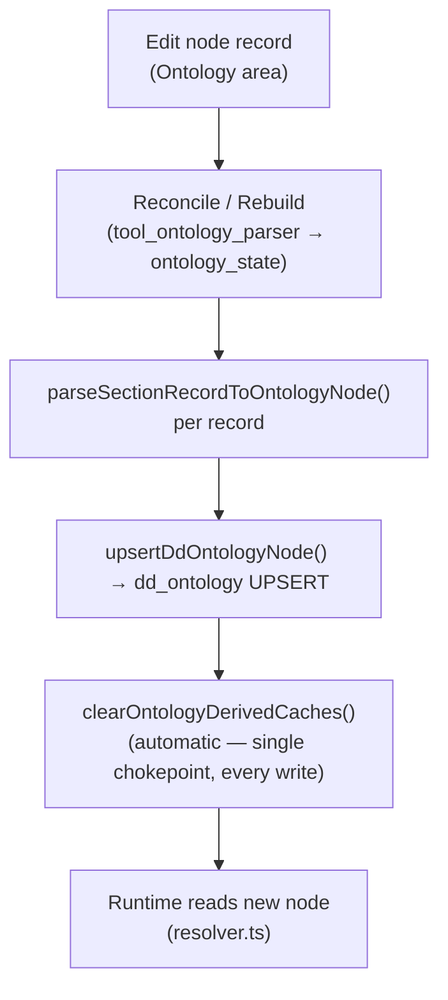

# Ontology authoring

> A developer/curator reference for **writing** the ontology: the shape of an ontology node, how to create and edit a section / component / group / tool through the Ontology area, the `properties` descriptor grammar, TLD creation and management, and how an edit becomes live.

> See also: [Ontology concept](index.md) · [ontology (build layer)](ontology_write.md) · [Ontology engine](ontology_engine.md) · [area_ontology](../areas/area_ontology.md) · [request_config](../request_config.md) · [request_config examples](../request_config_examples.md) · [Sections](../sections/index.md) · [Components](../components/index.md)

This page is the **authoring** reference. For *what the ontology is*
(model/node correspondence, TLDs, shared vs local), read [Ontology](index.md)
first. For the *runtime read* surface read
[Ontology engine](ontology_engine.md); for the *build/compile* surface read
[ontology (build layer)](ontology_write.md). This document does not repeat those
at length — it focuses on the editing experience and the data you are actually
editing.

## Role

In Dédalo there is no separate schema file: **the ontology is the schema, and
the schema is data you edit in the back office.** Defining a section, adding a
component to it, grouping fields, attaching a tool, or wiring a portal to a
target section are all done by creating and editing **ontology nodes** — never by
writing server code or SQL. The runtime then builds the live resolved structures
from those nodes on every request (see
[Architecture overview](../architecture_overview.md)).

This reference covers the three things an author touches:

1. **The node** — the unit you create/edit (`tipo`, `model`, `parent`,
   `order_number`, `tld`, `term`/`lg-*`, `relations`, `properties`).
2. **The descriptors inside a node** — chiefly `properties`
   (`source`/`request_config`, `css`, `observers`, …).
3. **The lifecycle** — TLD creation, where nodes are stored while editing, and
   the regenerate step that makes an edit live.

!!! warning "Two storage layers — edit one, the runtime reads the other"
    What you edit in the Ontology area is stored as **ordinary Dédalo records**
    (the *editable* layer). The runtime engine reads a separate **flat
    `dd_ontology` table** (the *compiled* layer). An edit is not live until the
    editable record is **compiled** into `dd_ontology`. See
    [How changes apply live](#how-changes-apply-live).

## Key concepts

### The node and its two representations

| layer | where | who writes it | who reads it |
| --- | --- | --- | --- |
| **Editable** | `matrix_ontology_main` (`ontology35`) + per-TLD section `<tld>0` (e.g. `dd0`, `oh0`) | the curator, through the [Ontology area](../areas/area_ontology.md) | the compiler ([`ontology_write.ts` + `parser.ts`](ontology_write.md)) |
| **Compiled / runtime** | the flat `dd_ontology` table, one row per `tipo` | the compiler, via `upsertDdOntologyNode()` (`src/core/db/dd_ontology.ts`) | [`resolver.ts`](ontology_engine.md) on every request |

The editable layer is just sections and components, so curators edit the
ontology with the *same* UI they use for any other data. The compiler
([`parseSectionRecordToOntologyNode()`](ontology_write.md#compile-editable-records--dd_ontology),
`src/core/ontology/parser.ts`) turns each editable record into one `dd_ontology`
row.

```mermaid
flowchart LR
    AREA["Ontology area<br/>(area_ontology)"]
    EDIT["Editable records<br/>matrix_ontology_main (ontology35)<br/>&lt;tld&gt;0 nodes (dd0, oh0, …)"]
    ONT["ontology_write.ts + parser.ts<br/>(compiler)"]
    DDONT[("dd_ontology<br/>flat runtime table")]
    NODE["resolver.ts<br/>(cached runtime read)"]
    APP["section/read.ts / relations engines /<br/>request_config / search …"]
    AREA -->|create / edit records| EDIT
    EDIT -->|"regenerate<br/>parseSectionRecordToOntologyNode()"| ONT
    ONT -->|"upsertDdOntologyNode()"| DDONT
    DDONT -->|"getModelByTipo / getTermByTipo /<br/>getNode / getMatrixTableFromTipo"| NODE
    NODE --> APP
```



### `tipo` grammar

Every node has a unique `tipo` = **TLD + sequential id** (`getTldFromTipo()` /
`getSectionIdFromTipo()` in `src/core/ontology/tld.ts`):

- `oh1` → TLD `oh`, id `1`; `rsc197` → TLD `rsc`, id `197`.
- A local `safeTipo()` helper (in `src/core/ts_object/node_repository.ts`)
  enforces the grammar `^[a-z]+[0-9]+$`; `safeTld()` (`tld.ts`) enforces
  `^[a-z]{2,}$`. Anything else is rejected before it reaches the database.
- The **main / root** node of a TLD is `<tld>0` (`dd0`, `oh0`) and carries
  `is_main = true`. Nodes start at `1`; id `0` is reserved for the root and lives
  in `matrix_ontology_main`, never in a matrix table.

The editable record's `section_id` *is* the node's numeric id: a record with
`section_id = 12` under section `oh0` compiles to node `oh12`
(`` const tipo = `${tld}${sectionId}` ``, in
`parseSectionRecordToOntologyNode()`, `src/core/ontology/parser.ts`).

## The ontology node JSON shape

A `dd_ontology` row (the compiled node the runtime reads) is a flat object. The
authoritative field list is the `DdOntologyRow` / `DdOntologyNode` interface in
`src/core/db/dd_ontology.ts` — a 13-column shape. Example (a `section`):

```jsonc
{
    "tipo":            "oh1",                 // string  — node id (TLD + number)
    "parent":          "dd324",              // string|null — immediate container tipo
    "term":            { "lg-eng": "Oral History Interview",
                         "lg-spa": "Entrevista" }, // object|null — labels per language
    "model":           "section",            // string|null — functional role
    "model_tipo":      "dd6",                // string|null — tipo of the model node (dd6 = section)
    "order_number":    5,                    // int|null — position among siblings
    "tld":             "oh",                 // string — namespace (Oral History)
    "relations":       [ { "tipo": "tch7" }, { "tipo": "rsc167" } ], // array|null — linked nodes
    "properties":      { "color": "#2d8894" }, // object|null — config descriptor (see below)
    "is_model":        false,                // bool — true only for model nodes (dd2 subtree)
    "is_translatable": false,                // bool — true ⇒ data stored per language
    "is_main":         false,                // bool — true only for <tld>0 root nodes
    "propiedades":     "{}"                  // string — DEPRECATED v5 JSON, compatibility only
}
```

Reading a node has two surfaces, split by what the engines need:

| field | surface | notes |
| --- | --- | --- |
| `tipo` | the key you call `getNode(tipo)` / `readDdOntologyRow(tipo)` with | The node id. |
| `parent` | `getNode(tipo).parent` (`resolver.ts`, cached) | The immediate container. `null` for `dd1`/`dd2` roots. |
| `term` / `lg-*` | `getTermByTipo(tipo, lang)` (`resolver.ts`) or the raw `term` object off `getNode`/`readDdOntologyRow` | `term` is a `{lg-*: value}` object; `getTermByTipo()` falls back to the structure lang (`lg-spa`) then any non-empty term. |
| `model` | `getModelByTipo(tipo)` (`resolver.ts`, cached) | Resolves the runtime model via forced/temporal tipo overrides (`FORCED_MODELS`), the stored `model` column, the component registry's `alias`, then the residual structural replacement map (e.g. `section_group_div` → `section_group`). |
| `model_tipo` | `readDdOntologyRow(tipo).model_tipo` (`db/dd_ontology.ts`, uncached raw row) | The tipo of the *model node* whose term names the model. |
| `order_number` | `readDdOntologyRow(tipo).order_number` | Sibling ordering. |
| `tld` | `readDdOntologyRow(tipo).tld`, or `getTldFromTipo(tipo)` (`tld.ts`) from the string itself | The namespace. |
| `relations` | `getNode(tipo).relations` (cached) — an array of `{tipo}` | Unidirectional links. Each engine (relations, request_config, RAG, …) filters the array for its own purpose; `relatedTipoByModel()` (`resolver.ts`) is the cached "first related node of model X" lookup. |
| `properties` | `getNode(tipo).properties` (cached) | Plain read of the parsed JSONB object — treat it as read-only. |
| `is_model` | `readDdOntologyRow(tipo).is_model` | Model nodes (the `section`, `component_*`, `tool_*`, `area_*` definitions) live under `dd2`. |
| `is_translatable` | `getTranslatableByTipo(tipo)` (`resolver.ts`, cached) or `readDdOntologyRow(tipo).is_translatable` | Controls per-language storage. |
| `is_main` | `readDdOntologyRow(tipo).is_main` | `<tld>0` roots. |
| `propiedades` | `readDdOntologyRow(tipo).propiedades` | **Do not author** — v5/v6 carry-over, kept only for old imports; stored as pretty-printed JSON text so legacy readers see byte-identical output. |

The **cached** registry (`resolver.ts`) only exposes the fields the horizontal
engines actually consume (`model`, `parent`, `translatable`, `properties`,
`relations`); the full 13-column row (including `tld`, `model_tipo`, `is_model`,
`is_main`, `order_number`, `propiedades`) is read uncached via
`readDdOntologyRow()` — used by the parser/write pipeline, which needs the
current on-disk state rather than the process-wide cache.

!!! note "`parent` vs `parent_grouper`"
    The node only stores **`parent`** (its structural container). The
    **`parent_grouper`** you see in a built context is *not* a separate ontology
    column — it is the node's `parent` stamped onto the structure-context
    (`node.parent` → `parent_grouper` in `src/core/resolve/structure_context.ts`;
    re-stamped per call for nested portal/dataframe children). When authoring,
    you set `parent`; the `parent_grouper` follows automatically.

### `model` — what kind of node you are creating

The `model` decides what the runtime builds for the node. The families an author
creates:

| `model` | role | `model_tipo` |
| --- | --- | --- |
| `section` | a record type (an SQL-table-equivalent) | `dd6` |
| `component_*` | a field inside a section (`component_input_text`, `component_portal`, `component_select`, `component_date`, …) | the component's model node |
| `section_group`, `section_group_div`, `section_tab`, `tab` | **groupers**: layout-only, carry no data (recognized via `INCLUDE_GROUPER_MODELS` in `src/core/resolve/section_elements_context.ts`) | their model nodes |
| `area_*` | a back-office area (menu grouping) | the area model node |
| `tool_*` | a tool attached to a section/component | the tool model node |

`getModelByTipo()` normalizes a few removed/renamed models (e.g.
`component_autocomplete` → `component_portal`, `tab` → `section_tab`,
`section_group_div` → `section_group`), so an old node still resolves to a live
model.

### How a node is wired into the tree

- **`parent`** places the node in the hierarchy. To extend a shared section, set
  your new node's `parent` to that section's tipo (e.g. add a component to the
  Objects section `tch1` by giving the component `parent = tch1`). A node whose
  `parent` points nowhere reachable still works but won't appear in any
  menu/tree.
- **`relations`** are unidirectional cross-links (`[{tipo}]`) used by e.g.
  portals/selects to reach related models, by the search-type list, and by
  diffusion. Each caller reads `getNode(tipo).relations` directly and filters it
  for its own purpose.
- **`order_number`** orders siblings; for sections the ordered **children**
  locator list lives on the parent's `component_relation_children`
  (`ontology14`) and is what actually drives display order.

## Creating and editing a node via the Ontology area

The Ontology area is the back-office editor for the ontology tree. It is the
**same** tree editor as the Thesaurus area, retargeted at the ontology
hierarchy — see [area_ontology](../areas/area_ontology.md). The only difference
is where it points: the ontology area's hierarchy section is `ontology35` and
its main table is `matrix_ontology_main`; everything else is the shared
thesaurus-tree behaviour.

### Where it lives in the menu

`Ontology → Instances → <typology> → <ontology name>`. For the core ontology the
two roots under `dd0` are **`dd1`** (general terms, i.e. real sections/areas) and
**`dd2`** (models). You create descriptor nodes under `dd1` (or under a TLD's own
tree); you almost never touch `dd2` (the model definitions).

### The editing record (what the form fields map to)

An editable node record carries one component per node field. The constants are
defined in `src/core/ontology/ontology_tipos.ts`; the compiler reads exactly
these in `parseSectionRecordToOntologyNode()` (`src/core/ontology/parser.ts`):

| node field | editing component (`tipo`) | constant | model |
| --- | --- | --- | --- |
| TLD (mandatory) | `ontology7` | `ONTOLOGY_TLD` | `component_input_text` |
| parent | `ontology15` | `ONTOLOGY_PARENT` | relation (locator) |
| model | `ontology6` | `ONTOLOGY_MODEL` | `component_portal` |
| order | `ontology41` | `ONTOLOGY_ORDER` | `component_number` |
| translatable (yes/no) | `ontology8` | `ONTOLOGY_TRANSLATABLE` | `component_radio_button` |
| is_model (yes/no) | `ontology30` | `ONTOLOGY_IS_MODEL` | `component_radio_button` |
| relations (connected-to) | `ontology10` | `ONTOLOGY_CONNECTED_TO` | autocomplete/portal |
| term (`lg-*`) | `ontology5` | `ONTOLOGY_TERM` | `component_input_text` (multilingual) |
| properties — general | `ontology18` | `ONTOLOGY_PROPERTIES` | `component_json` |
| properties — css | `ontology16` | `ONTOLOGY_CSS` | `component_json` |
| properties — source / request_config | `ontology17` | `ONTOLOGY_SOURCE` | `component_json` |
| propiedades — v5 (legacy) | `ontology19` | `ONTOLOGY_PROPIEDADES_V5` | `component_json` |

So `properties` is authored across **three** components and recombined at
compile time: the general blob (`ontology18`) plus the dedicated `css`
(`ontology16` → `properties.css`) and `source` (`ontology17` →
`properties.source`) sub-components.

### Step-by-step: add a section, component, group, or tool

1. **Open the parent in the tree.** Navigate to the node that will contain your
   new element (a TLD root for a section, a section for a component/group/tool).
   The client can deep-link via `search_tipos` (the "open in tree" button), which
   sets the per-tipo `section_tipo` to `<tld>0` and highlights the node.
2. **Create a new child record.** This creates an editable record under the TLD's
   `<tld>0` section; its `section_id` becomes the node's numeric id.
3. **Set `model`** (e.g. `section`, `component_input_text`, `section_tab`,
   `tool_export`). For groupers pick one of the layout-only models
   (`section_group`, `section_group_div`, `section_tab`) — they are recognized
   via the `INCLUDE_GROUPER_MODELS` set in
   `src/core/resolve/section_elements_context.ts`; they store no data.
4. **Set `parent`** to the container node (auto-set when you create under a node).
5. **Set the term (`lg-*`)** — the label shown in the UI, per language.
6. **Set `translatable`** (only meaningful for string-storing components),
   **`order`**, and any **`relations`** (e.g. a portal's target models).
7. **Fill `properties`** as needed (next section) — `css` in `ontology16`,
   `source`/`request_config` in `ontology17`, everything else in `ontology18`.
8. **Regenerate** so the edit goes live (see
   [How changes apply live](#how-changes-apply-live)).

!!! note "`is_model` is never overwritable locally; `model` is"
    A local-ontology override (`localontology0`) may override a shared node's
    term, properties, translatable, relations **and model**. Only **`is_model`**
    is always read from the canonical node, never from the override, because
    structural model-ness must never change from a local override.
    `model`/`model_tipo` themselves ARE overwrite-aware.

## The `properties` descriptor grammar

`properties` is a free-form JSON object (read at runtime through
`getNode(tipo).properties` / `getPropertiesByTipo(tipo)`) that configures a
node's behaviour, options and layout. The keys an author uses most:

### `source` / `request_config`

`properties.source` holds the data-source configuration. For relation-bearing
elements (sections, portals, selects, filters) it carries the
**`request_config`** array — the server-side description of what columns to show
and how to search/choose records. The full grammar is documented separately:

- [request_config](../request_config.md) — the architecture, the `ddo_map`,
  search/choose layouts, the `section_tipo` source vocabulary, pagination,
  caching and the 3-stage build.
- [request_config examples](../request_config_examples.md) — a cookbook of real
  ontology `request_config` JSON.
- [request_config presets](request_config_presets.md) — per-user/role layout
  overrides of the ontology default.

Authoring touch-points (verified against
`src/core/relations/request_config/{build,v5,v6,filters,external}.ts`):

- The server reads `properties->source->request_config` (the V6 explicit path,
  `request_config/v6.ts`). When absent, it falls back to the V5
  ontology-derived build (`request_config/v5.ts`) — V5 is the **default**
  builder.
- The list columns come from `properties->source->columns_map`
  (resolved in `request_config/build.ts`), or are derived from the `ddo_map`
  when absent.

### `css`

`properties.css` (authored in `ontology16`) is a map of **selector fragments →
CSS-property objects**. The client (`client/dedalo/core/page/js/css.js`,
`set_element_css()`) scopes each rule to the element's runtime key
(`<section_tipo>_<tipo>`):

```jsonc
{
    "css": {
        ".wrapper_component": { "grid-column": "span 2" },  // → .oh1_oh25.wrapper_component { grid-column: span 2 }
        "> .content_data":    { "width": "50%" },           // → .oh1_oh25 > .content_data { width: 50% }
        "@media (max-width: 768px)": { ".wrapper_component": { "grid-column": "span 1" } }
    }
}
```

- A fragment starting with `.wrapper` is appended to the key class directly
  (`.${key}${selector}`); any other fragment is scoped as a descendant
  (`.${key} > ${selector}`).
- In `list` mode the edit-only css is dropped unless the node has a
  `section_list` child carrying its own css (see
  `src/core/resolve/structure_context.ts`).
- A **virtual/section-level override** is possible: a `component_*` node's css can
  be set from the *section's* `properties.css->{component_tipo}` (used by virtual
  sections, e.g. `rsc170`).

!!! note "v7 `css` vs v5 `propiedades`"
    The v7 shape above (selector → property object) is **not** the legacy v5
    `propiedades` shape (`{".wrap_component": {"mixin": [".vertical"], "style":
    {"width": "25%"}}}`). Author css in `properties.css`; leave `propiedades`
    alone.

### `observers`

`properties.observers` declares **server-side reactive fan-out**: after the
observed component saves, Dédalo recomputes the listed observer components.
`propagateToObservers()` (`src/core/api/handlers/observers.ts`) runs the
post-save cascade, driven from `src/core/section/record/save_component.ts`:

```jsonc
{
    "observers": [
        { "section_tipo": "numisdata3", "component_tipo": "numisdata595" }
    ]
}
```

Each entry names a `section_tipo` + `component_tipo` to refresh; the observer's
own `observe` config (also in its `properties`) decides which records to update
and how. Only the actively-edited section's result is sent back to the client;
the rest are saved silently.

Most observer configs on a typical ontology are **client-only** (no `server`
key), so nothing runs on the server for them. The server-side shapes that are
implemented are the `{config: {use_observable_dato}, perform: set_dato_external}`
family and the `component_info` observers (both `filter: {SQO}` and
`filter: false` forms). Any other `server.filter` + `perform` shape is a logged
skip — never guessed.

### Other common keys

| key | used by | meaning |
| --- | --- | --- |
| `color` | sections / TLD roots | UI accent; read as `node.properties.color`, falling back to `#b9b9b9` at each call site (e.g. `src/core/relations/request_config/v6.ts`). |
| `tool_config` | sections/components | per-tool config keyed by tool name, overlaid onto the tool's ontology properties. |
| `main_tld` | `<tld>0` roots | the official TLD string for the namespace. |
| `mode` | tools | restrict a tool to one mode (`edit`/`list`/…); tools whose `mode` ≠ the current mode are skipped. |
| `dato_default`, `render`, `target`, `widgets` | various components | default value, render hints, relation target, widget wiring. |

`properties` is authored in the ontology and nowhere else: there is no runtime
property-injection hook. If a node needs different behaviour, edit its
`properties` and regenerate.

## TLD creation and management

A TLD (Top-Level Domain) is the namespace prefix of a `tipo`. Creating one
registers a whole **local ontology** you can grow independently of the shared
core. The four mandatory core TLDs (`dd`, `ontology`, `lg`, `hierarchy`) cannot
be removed.

### Create a TLD (UI)

From [Ontology](index.md): `Ontology → Ontologies main`, create a new record,
set the TLD code + name + main language + typology, ensure the *Real section
tipo* is `ontology1`, then press **Create ontology** in the inspector. Use a
unique institutional prefix (e.g. `mupreva`); never reuse a shared TLD.

### What "Create ontology" does

The lifecycle functions in `src/core/ontology/ontology_write.ts` run in
sequence:

1. **`addMainSection(fileItem)`** — create/update the `matrix_ontology_main`
   record for the TLD: project filter, active flags, main language (defaults to
   `lg-spa`), name/term, the TLD string, the `target_section_tipo` (`<tld>0`),
   and typology. `active_in_thesaurus` defaults to **yes only for `dd`**; other
   TLDs are off by default and the admin turns them on manually.
2. **`createParentGrouper(parentGroup, tld, typologyId)`** — ensure the typology
   grouper exists in both `dd_ontology` and the matrix so the TLD shows under
   its typology in the menu (creating a missing parent on the fly during a
   partial bootstrap). Returns the grouper tipo used as the new root's `parent`.
3. **`createDdOntologyRootNode(fileItem)`** — create/UPSERT the `<tld>0` root
   node in `dd_ontology` via `upsertDdOntologyNode()`: `model = section`
   (`model_tipo = dd6` / `SECTION_MODEL_TIPO`), `is_model = false`,
   non-translatable, `is_main = true`, relations `[{ontology1},{dd1201}]`, and
   `properties.main_tld` + `properties.color`.

After that the TLD's first node is created from
`Ontology → Instances → <typology> → <Your ontology name>`.

### Delete a TLD

Deleting a TLD is **trigger-based, not a standalone call**: deleting a record of
the `hierarchy1`/`ontology35` registry sections cascades through
`deleteOntologyMain()` (`src/core/ontology/ontology_delete.ts`). It purges every
`dd_ontology` node of that TLD (parameterized on the validated TLD, refusing on
an empty/unsafe value), deletes the registry record itself, then every node
record of the TLD's `<tld>0` section — through the normal per-record delete
pipeline, Time Machine snapshots included. Global-admin gated.

## How changes apply live

Editing a node updates the **editable** record only. The runtime keeps reading
the old compiled `dd_ontology` row until you **regenerate**. The full path:



1. **Edit** the node record in the Ontology area.
2. **Reconcile (or Rebuild).** The developer-gated tool `tools/tool_ontology_parser`
   drives `src/core/ontology/ontology_state.ts` — the single reconcile authority.
   `reconcile_ontologies` calls `ensureOntology(tld)`: it diffs the runtime
   projection against the parsed source and applies only the delta (upsert the
   missing/stale nodes, delete the orphaned ones) — **incremental and
   non-destructive**, a no-op on a TLD already in sync. `regenerate_ontologies`
   calls `rebuildOntology(tld)`: a **transactional** wipe-and-rebuild for
   structural corruption the reconcile cannot fix (delete + reinsert in one
   `withTransaction`, rolled back on failure — no backup table). Both then rebuild
   the LLM map (`exportLlmMap()`), merging any of its errors into the response.
3. **Compile one section (or one record)** without a full regenerate with
   `setRecordsInDdOntology({sectionTipo, sectionId})` (`tools/tool_ontology`).
   With no `sectionId`, list mode is a **full-section scan**: every record of
   the section is recompiled.
4. **Compile a single node** with
   `insertDdOntologyRecord(sectionTipo, sectionId)`.
5. **Cache invalidation is automatic, not a manual step.** Every `dd_ontology`
   write (`upsertDdOntologyNode`, `updateDdOntologyColumns`, `deleteTldNodes`,
   `restoreFromBackupTable`) ends by calling `clearOntologyDerivedCaches()` —
   the single chokepoint in `src/core/ontology/cache_invalidation.ts` that every
   cache-owning module (the resolver's node/matrix-table/filter caches,
   `section_map.ts`, `term_resolver.ts`, the active-TLD set, …) registers with at
   load time. There is no reset call to remember.

!!! warning "Rebuild is a heavy write-side operation; prefer Reconcile"
    `rebuildOntology()` / `setRecordsInDdOntology()` parse and upsert a node for
    *every* matched record. `ensureOntology()` (Reconcile) touches only what
    drifted and is the everyday action; a full rebuild belongs to the recovery
    flow, not a normal request. Normal reads always go through `resolver.ts`.

## Examples

### Read a node you just authored (runtime surface)

```ts
import { getNode, getModelByTipo, getTermByTipo } from
  'src/core/ontology/resolver.ts';
import { readDdOntologyRow } from 'src/core/db/dd_ontology.ts';

const node = await getNode('oh1');
node.model;        // 'section'
node.parent;        // 'dd324'
node.relations;     // [{tipo:'tch7'}, {tipo:'rsc167'}]
node.properties;    // object | null (plain read, treat as read-only)
node.translatable;  // false

const label = await getTermByTipo('oh1', 'lg-eng'); // 'Oral History Interview'
const modelName = await getModelByTipo('oh25');      // 'component_input_text'

// full raw row (tld, model_tipo, is_model, is_main, order_number, propiedades)
const row = await readDdOntologyRow('oh1');
row.tld;          // 'oh'
row.order_number; // 5
```

### Compile one edited node into the runtime table

```ts
import { insertDdOntologyRecord } from 'src/core/ontology/ontology_write.ts';

// after editing the record oh0 / section_id 12 (node 'oh12')
const tipo = await insertDdOntologyRecord('oh0', 12); // 'oh12' | null on failure

// no manual cache-purge step needed — upsertDdOntologyNode() already fanned
// out clearOntologyDerivedCaches() as part of the write.
```

### Reconcile a TLD into the runtime table (the live-apply step)

```ts
import { inspectOntology, ensureOntology } from 'src/core/ontology/ontology_state.ts';

// see what drifted, without writing
const state = await inspectOntology('oh');
// state: { tld:'oh', inSync:false, drift:[{tipo:'oh12', kind:'stale', diffColumns:['term']}], … }

// apply only the delta (idempotent; a synced TLD is a no-op)
const outcome = await ensureOntology('oh');
// outcome: { result, msg, errors, state, applied:['~ oh12 (term)'] }

// for structural corruption a reconcile cannot fix, wipe-and-rebuild (transactional):
//   import { rebuildOntology } from 'src/core/ontology/ontology_state.ts'
//   await rebuildOntology('oh')
```

### Author a node's css / observers (the properties you write)

```jsonc
// ontology16 (properties.css)
{ ".wrapper_component": { "grid-column": "span 2" } }

// ontology17 (properties.source)
{ "request_config": [ { "api_engine": "dedalo", "sqo": { "limit": 50 } } ] }

// ontology18 (general properties)
{ "observers": [ { "section_tipo": "numisdata3", "component_tipo": "numisdata595" } ],
  "color": "#2d8894" }
```

## Related

- [Ontology concept](index.md) — what the ontology is, TLDs, model/node, shared
  vs local ontologies.
- [ontology (build layer)](ontology_write.md) — the compiler
  (`ontology_write.ts` + `parser.ts`) and TLD lifecycle functions referenced
  throughout this page.
- [Ontology engine](ontology_engine.md) — the runtime read surface
  (`resolver.ts`) and the cache-invalidation hub.
- [area_ontology](../areas/area_ontology.md) — the back-office tree editor you
  author in.
- [common](../system/common.md) — the structure-context build
  (`src/core/resolve/structure_context.ts`), css resolution and the
  structure-context cache.
- [request_config](../request_config.md) · [request_config examples](../request_config_examples.md)
  · [request_config presets](request_config_presets.md) — the `source` /
  `request_config` grammar inside `properties` and its per-role overrides.
- [Sections](../sections/index.md) · [Components](../components/index.md) — the
  record-bearing nodes the ontology defines.
- [Architecture overview](../architecture_overview.md) — the ontology as the
  active schema and the server-build / client-render flow.
- [Locator](../locator.md) — the pointer type used in `relations` and parent
  links.
