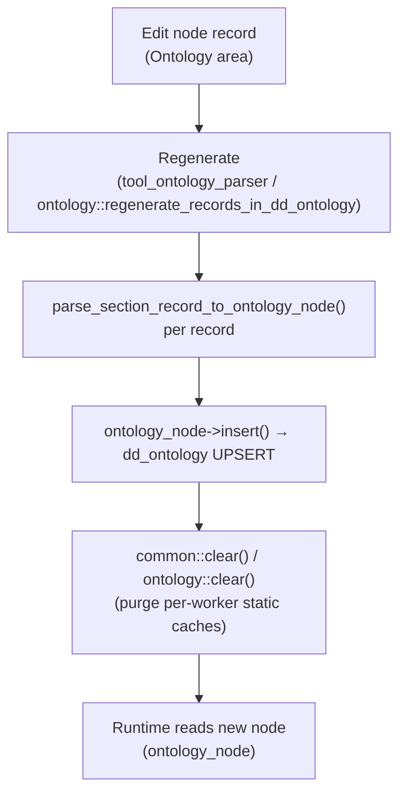

# Ontology authoring

> A developer/curator reference for **writing** the ontology: the shape of an ontology node, how to create and edit a section / component / group / tool through the Ontology area, the `properties` descriptor grammar, TLD creation and management, and how an edit becomes live.

> See also: [Ontology concept](index.md) · [`ontology` class (build layer)](ontology_class.md) · [`ontology_node` engine](ontology_engine.md) · [area_ontology](../areas/area_ontology.md) · [request_config](../request_config.md) · [request_config examples](../request_config_examples.md) · [Sections](../sections/index.md) · [Components](../components/index.md)

This page is the **authoring** reference. For *what the ontology is*
(model/node correspondence, TLDs, shared vs local), read [Ontology](index.md)
first. For the *runtime read* surface read [`ontology_node`](ontology_engine.md);
for the *build/compile* surface read [`ontology`](ontology_class.md). This
document does not repeat those at length — it focuses on the editing experience
and the data you are actually editing.

## Role

In Dédalo there is no separate schema file: **the ontology is the schema, and
the schema is data you edit in the back office.** Defining a section, adding a
component to it, grouping fields, attaching a tool, or wiring a portal to a
target section are all done by creating and editing **ontology nodes** — never by
writing PHP or SQL. The runtime then builds live PHP/JS objects from those nodes
on every request (see [Architecture overview](../architecture_overview.md)).

This reference covers the three things an author touches:

1. **The node** — the unit you create/edit (`tipo`, `model`, `parent`,
   `order_number`, `tld`, `term`/`lg-*`, `relations`, `properties`).
2. **The descriptors inside a node** — chiefly `properties`
   (`source`/`request_config`, `css`, `observers`, …).
3. **The lifecycle** — TLD creation, where nodes are stored while editing, and
   the regenerate step that makes an edit live.

!!! warning "Two storage layers — edit one, the runtime reads the other"
    What you edit in the Ontology area is stored as **ordinary Dédalo records**
    (the *editable* layer). The runtime engine reads a separate **flat
    `dd_ontology` table** (the *compiled* layer). An edit is not live until the
    editable record is **compiled** into `dd_ontology`. See
    [How changes apply live](#how-changes-apply-live).

## Key concepts

### The node and its two representations

| layer | where | who writes it | who reads it |
| --- | --- | --- | --- |
| **Editable** | `matrix_ontology_main` (`ontology35`) + per-TLD section `<tld>0` (e.g. `dd0`, `oh0`) | the curator, through the [Ontology area](../areas/area_ontology.md) | the [`ontology`](ontology_class.md) compiler |
| **Compiled / runtime** | the flat `dd_ontology` table, one row per `tipo` | the `ontology` compiler (`ontology_node->insert()`) | [`ontology_node`](ontology_engine.md) on every request |

The editable layer is just sections and components, so curators edit the
ontology with the *same* UI they use for any other data. The compiler
([`ontology::parse_section_record_to_ontology_node()`](ontology_class.md#compile-editable-records--dd_ontology))
turns each editable record into one `dd_ontology` row.

```mermaid
flowchart LR
    AREA["Ontology area<br/>(area_ontology)"]
    EDIT["Editable records<br/>matrix_ontology_main (ontology35)<br/>&lt;tld&gt;0 nodes (dd0, oh0, …)"]
    ONT["class ontology<br/>(compiler)"]
    DDONT[("dd_ontology<br/>flat runtime table")]
    NODE["ontology_node<br/>(runtime read)"]
    APP["section / component_common /<br/>request_config / search …"]
    AREA -->|create / edit records| EDIT
    EDIT -->|"regenerate<br/>parse_section_record_to_ontology_node()"| ONT
    ONT -->|"ontology_node-&gt;insert()"| DDONT
    DDONT -->|"get_model_by_tipo / get_term_by_tipo /<br/>get_ar_children / get_relation_nodes"| NODE
    NODE --> APP
```



### `tipo` grammar

Every node has a unique `tipo` = **TLD + sequential id** (`get_tld_from_tipo()` /
`get_section_id_from_tipo()` in `shared/core_functions.php`):

- `oh1` → TLD `oh`, id `1`; `rsc197` → TLD `rsc`, id `197`.
- `safe_tipo()` enforces the grammar `^[a-z]{2,}[0-9]+$`; `safe_tld()` enforces
  `^[a-z]{2,}$`. Anything else is rejected before it reaches the database.
- The **main / root** node of a TLD is `<tld>0` (`dd0`, `oh0`) and carries
  `is_main = true`. Nodes start at `1`; id `0` is reserved for the root and lives
  in `matrix_ontology_main`, never in a matrix table.

The editable record's `section_id` *is* the node's numeric id: a record with
`section_id = 12` under section `oh0` compiles to node `oh12`
(`$tipo = $tld . $section_id`, verified in `parse_section_record_to_ontology_node()`).

## The ontology node JSON shape

A `dd_ontology` row (the compiled node `ontology_node` reads) is a flat object.
The authoritative field list is the docblock on `ontology_node::$data`
(`core/ontology_engine/class.ontology_node.php`). Example (a `section`):

```jsonc
{
    "tipo":            "oh1",                 // string  — node id (TLD + number)
    "parent":          "dd324",              // string|null — immediate container tipo
    "term":            { "lg-eng": "Oral History Interview",
                         "lg-spa": "Entrevista" }, // object|null — labels per language
    "model":           "section",            // string|null — functional role / class name
    "model_tipo":      "dd6",                // string|null — tipo of the model node (dd6 = section)
    "order_number":    5,                    // int|null — position among siblings
    "tld":             "oh",                 // string — namespace (Oral History)
    "relations":       [ { "tipo": "tch7" }, { "tipo": "rsc167" } ], // array|null — linked nodes
    "properties":      { "color": "#2d8894" }, // object|null — config descriptor (see below)
    "is_model":        false,                // bool — true only for model nodes (dd2 subtree)
    "is_translatable": false,                // bool — true ⇒ data stored per language
    "is_main":         false,                // bool — true only for <tld>0 root nodes
    "propiedades":     "{}"                  // string — DEPRECATED v5 JSON, compatibility only
}
```

Read each field with its accessor on `ontology_node` (all verified):

| field | accessor | notes |
| --- | --- | --- |
| `tipo` | `get_tipo()` | The node id. |
| `parent` | `get_parent()` | The immediate container. `null` for `dd1`/`dd2` roots. |
| `term` / `lg-*` | `get_term_data()` / `get_term($lang)` | `term` is a `{lg-*: value}` object; `get_term()` applies the lang fallback (`DEDALO_STRUCTURE_LANG` → any). |
| `model` | `get_model()` | Resolves the implementing class via forced/temporal overrides, the `model` column, the legacy `model_tipo` fallback, then a name-replacement map (e.g. `component_html_text` → `component_text_area`). |
| `model_tipo` | `get_model_tipo()` | The tipo of the *model node* whose term is the class name. |
| `order_number` | `get_order_number()` | Sibling ordering. |
| `tld` | `get_tld()` | The namespace. |
| `relations` | `get_relations()` / `get_relation_tipos()` / `get_relation_nodes($tipo, …, $simple)` | Unidirectional links; each entry is `{tipo}`. |
| `properties` | `get_properties()` | Returns a **deep clone** so callers can never mutate the cached node. |
| `is_model` | `get_is_model()` | Model nodes (the `section`, `component_*`, `tool_*`, `area_*` definitions) live under `dd2`. |
| `is_translatable` | `get_is_translatable()` / `get_translatable($tipo)` | Controls per-language storage. |
| `is_main` | `get_is_main()` | `<tld>0` roots. |
| `propiedades` | `get_propiedades($json_decode)` | **Do not author** — v5/v6 carry-over, kept only for old imports. |

!!! note "`parent` vs `parent_grouper`"
    The node only stores **`parent`** (its structural container). The
    **`parent_grouper`** you see in a built context is *not* a separate ontology
    column — it is the node's `parent` (`get_parent()`) stamped onto the
    structure-context by `build_structure_context_core()` in
    [`common`](../system/common.md) (and re-stamped per call for nested
    portal/dataframe children). When authoring, you set `parent`; the
    `parent_grouper` follows automatically.

### `model` — what kind of node you are creating

The `model` decides which PHP class / JS module / CSS the runtime builds. The
families an author creates:

| `model` | role | `model_tipo` |
| --- | --- | --- |
| `section` | a record type (an SQL-table-equivalent) | `dd6` |
| `component_*` | a field inside a section (`component_input_text`, `component_portal`, `component_select`, `component_date`, …) | the component's model node |
| `section_group`, `section_group_div`, `section_tab`, `tab` | **groupers**: layout-only, carry no data (see `section::get_ar_grouper_models()`) | their model nodes |
| `area_*` | a back-office area (menu grouping) | the area model node |
| `tool_*` | a tool attached to a section/component | the tool model node |

`get_model()` normalizes a few removed/renamed models (e.g.
`component_autocomplete` → `component_portal`, `tab` → `section_tab`,
`section_group_div` → `section_group`), so an old node still resolves to a live
class.

### How a node is wired into the tree

- **`parent`** places the node in the hierarchy. To extend a shared section, set
  your new node's `parent` to that section's tipo (e.g. add a component to the
  Objects section `tch1` by giving the component `parent = tch1`). A node whose
  `parent` points nowhere reachable still works but won't appear in any
  menu/tree.
- **`relations`** are unidirectional cross-links (`[{tipo}]`) used by e.g.
  portals/selects to reach related models, by the search-type list, and by
  diffusion. `get_relation_nodes($tipo, true, true)` returns the flat tipo list.
- **`order_number`** orders siblings; for sections the ordered **children**
  locator list lives on the parent's `component_relation_children`
  (`ontology14`) and is what actually drives display order (see
  `ontology::reorder_nodes_from_dd_ontology()`).

## Creating and editing a node via the Ontology area

The Ontology area is the back-office editor for the ontology tree. It is the
**same** tree editor as the Thesaurus area, retargeted at the ontology
hierarchy — see [area_ontology](../areas/area_ontology.md) for the class detail.
`area_ontology` overrides only `get_hierarchy_section_tipo()` (→ `ontology35`)
and `get_main_table()` (→ `matrix_ontology_main`); everything else is inherited
from `area_thesaurus`.

### Where it lives in the menu

`Ontology → Instances → <typology> → <ontology name>`. For the core ontology the
two roots under `dd0` are **`dd1`** (general terms, i.e. real sections/areas) and
**`dd2`** (models). You create descriptor nodes under `dd1` (or under a TLD's own
tree); you almost never touch `dd2` (the model definitions).

### The editing record (what the form fields map to)

An editable node record carries one component per node field. The constants are
defined in `core/base/dd_tipos.php`; the compiler reads exactly these in
`parse_section_record_to_ontology_node()`:

| node field | editing component (`tipo`) | constant | model |
| --- | --- | --- | --- |
| TLD (mandatory) | `ontology7` | `DEDALO_ONTOLOGY_TLD_TIPO` | `component_input_text` |
| parent | `ontology15` | `DEDALO_ONTOLOGY_PARENT_TIPO` | relation (locator) |
| model | `ontology6` | `DEDALO_ONTOLOGY_MODEL_TIPO` | `component_portal` |
| order | `ontology41` | `DEDALO_ONTOLOGY_ORDER_TIPO` | `component_number` |
| translatable (yes/no) | `ontology8` | `DEDALO_ONTOLOGY_TRANSLATABLE_TIPO` | `component_radio_button` |
| is_model (yes/no) | `ontology30` | `DEDALO_ONTOLOGY_IS_MODEL_TIPO` | `component_radio_button` |
| relations (connected-to) | `ontology10` | `DEDALO_ONTOLOGY_CONNECTED_TO_TIPO` | autocomplete/portal |
| term (`lg-*`) | `ontology5` | `DEDALO_ONTOLOGY_TERM_TIPO` | `component_input_text` (multilingual) |
| properties — general | `ontology18` | — | `component_json` |
| properties — css | `ontology16` | — | `component_json` |
| properties — source / request_config | `ontology17` | — | `component_json` |
| propiedades — v5 (legacy) | `ontology19` | — | `component_json` |

So `properties` is authored across **three** components and recombined at
compile time: the general blob (`ontology18`) plus the dedicated `css`
(`ontology16` → `properties.css`) and `source` (`ontology17` →
`properties.source`) sub-components.

### Step-by-step: add a section, component, group, or tool

1. **Open the parent in the tree.** Navigate to the node that will contain your
   new element (a TLD root for a section, a section for a component/group/tool).
   The client can deep-link via `search_tipos` (the "open in tree" button), which
   sets the per-tipo `section_tipo` to `<tld>0` and highlights the node.
2. **Create a new child record.** This creates an editable record under the TLD's
   `<tld>0` section; its `section_id` becomes the node's numeric id.
3. **Set `model`** (e.g. `section`, `component_input_text`, `section_tab`,
   `tool_export`). For groupers pick a model from
   `section::get_ar_grouper_models()`; they store no data.
4. **Set `parent`** to the container node (auto-set when you create under a node).
5. **Set the term (`lg-*`)** — the label shown in the UI, per language.
6. **Set `translatable`** (only meaningful for string-storing components),
   **`order`**, and any **`relations`** (e.g. a portal's target models).
7. **Fill `properties`** as needed (next section) — `css` in `ontology16`,
   `source`/`request_config` in `ontology17`, everything else in `ontology18`.
8. **Regenerate** so the edit goes live (see
   [How changes apply live](#how-changes-apply-live)).

!!! note "Models and is_model are not overwritable locally"
    A local-ontology override (`localontology0`) may override a shared node's
    term, properties, translatable and relations — but **`model` and `is_model`
    are always read from the canonical node** (verified in
    `parse_section_record_to_ontology_node()`). You cannot change what kind of
    thing a shared node is from a local override.

## The `properties` descriptor grammar

`properties` is a free-form JSON object (`get_properties()`) that configures a
node's behaviour, options and layout. The keys an author uses most:

### `source` / `request_config`

`properties.source` holds the data-source configuration. For relation-bearing
elements (sections, portals, selects, filters) it carries the
**`request_config`** array — the server-side description of what columns to show
and how to search/choose records. The full grammar is documented separately:

- [request_config](../request_config.md) — the architecture, the `ddo_map`,
  search/choose layouts, the `section_tipo` source vocabulary, pagination,
  caching and the 3-stage build.
- [request_config examples](../request_config_examples.md) — a cookbook of real
  ontology `request_config` JSON.
- [request_config presets](request_config_presets.md) — per-user/role layout
  overrides of the ontology default.

Authoring touch-points (all verified in `core/common/trait.request_config_*.php`):

- The server reads `properties->source->request_config` (the V6 explicit path).
  When absent, it falls back to the V5 ontology-derived build — V5 is the
  **default** builder.
- Pagination limit is resolved from
  `properties->source->request_config[api_engine=dedalo]->sqo->limit`
  (`resolve_limit()`).
- The list columns come from `properties->source->columns_map`
  (`get_columns_map()`), or are derived from the `ddo_map` when absent.

!!! warning "request_config is validated at compile time (non-blocking)"
    When you regenerate, `parse_section_record_to_ontology_node()` runs
    `request_config_object::validate_config()` on
    `properties->source->request_config` and logs any structural issues as
    **warnings** — the node is still compiled. Watch the log after a regenerate
    so a malformed config surfaces there, not as an empty panel later.

### `css`

`properties.css` (authored in `ontology16`) is a map of **selector fragments →
CSS-property objects**. The client (`core/page/js/css.js`,
`set_element_css()`) scopes each rule to the element's runtime key
(`<section_tipo>_<tipo>`):

```jsonc
{
    "css": {
        ".wrapper_component": { "grid-column": "span 2" },  // → .oh1_oh25.wrapper_component { grid-column: span 2 }
        "> .content_data":    { "width": "50%" },           // → .oh1_oh25 > .content_data { width: 50% }
        "@media (max-width: 768px)": { ".wrapper_component": { "grid-column": "span 1" } }
    }
}
```

- A fragment starting with `.wrapper` is appended to the key class directly
  (`.${key}${selector}`); any other fragment is scoped as a descendant
  (`.${key} > ${selector}`).
- In `list` mode the edit-only css is dropped unless the node has a
  `section_list` child carrying its own css (see `build_structure_context_core()`
  in [`common`](../system/common.md)).
- A **virtual/section-level override** is possible: a `component_*` node's css can
  be set from the *section's* `properties.css->{component_tipo}` (used by virtual
  sections, e.g. `rsc170`).

!!! note "v7 `css` vs v5 `propiedades`"
    The v7 shape above (selector → property object) is **not** the legacy v5
    `propiedades` shape (`{".wrap_component": {"mixin": [".vertical"], "style":
    {"width": "25%"}}}`). Author css in `properties.css`; leave `propiedades`
    alone.

### `observers`

`properties.observers` declares **server-side reactive fan-out**: after the
observed component saves, Dédalo updates the listed observer components
(`component_common::propagate_to_observers()`):

```jsonc
{
    "observers": [
        { "section_tipo": "numisdata3", "component_tipo": "numisdata595" }
    ]
}
```

Each entry names a `section_tipo` + `component_tipo` to refresh; the observer's
own `observe` config (also in its `properties`) decides which records to update
and how. Only the actively-edited section's result is sent back to the client;
the rest are saved silently.

### Other common keys

| key | used by | meaning |
| --- | --- | --- |
| `color` | sections / TLD roots | UI accent; `ontology_node::get_color()` defaults to `#b9b9b9`. |
| `tool_config` | sections/components | per-tool config keyed by tool name, overlaid onto the tool's ontology properties. |
| `main_tld` | `<tld>0` roots | the official TLD string for the namespace. |
| `mode` | tools | restrict a tool to one mode (`edit`/`list`/…); tools whose `mode` ≠ the current mode are skipped. |
| `dato_default`, `render`, `target`, `widgets` | various components | default value, render hints, relation target, widget wiring. |

Inject overrides at runtime (without editing the ontology) with
`common::set_properties()`, which marks `properties_injected` and extends the
structure-context cache key — see [`common`](../system/common.md).

## TLD creation and management

A TLD (Top-Level Domain) is the namespace prefix of a `tipo`. Creating one
registers a whole **local ontology** you can grow independently of the shared
core. The four mandatory core TLDs (`dd`, `ontology`, `lg`, `hierarchy`) cannot
be removed.

### Create a TLD (UI)

From [Ontology](index.md): `Ontology → Ontologies main`, create a new record,
set the TLD code + name + main language + typology, ensure the *Real section
tipo* is `ontology1`, then press **Create ontology** in the inspector. Use a
unique institutional prefix (e.g. `mupreva`); never reuse a shared TLD.

### What "Create ontology" does (verified)

The lifecycle methods on [`ontology`](ontology_class.md) run in sequence:

1. **`add_main_section($file_item)`** — create/update the `matrix_ontology_main`
   record for the TLD: project filter, active flags, main language (defaults to
   `lg-spa`), name/term, the TLD string, the `target_section_tipo` (`<tld>0`),
   and typology. `active_in_thesaurus` defaults to **yes only for `dd`**; other
   TLDs are off by default and the admin turns them on manually.
2. **`create_parent_grouper(parent_group, tld, typology_id)`** — ensure the
   typology grouper exists in both `dd_ontology` and the matrix so the TLD shows
   under its typology in the menu (creating a missing parent on the fly during a
   partial bootstrap). Returns the grouper tipo used as the new root's `parent`.
3. **`create_dd_ontology_ontology_section_node($file_item)`** — create/UPSERT the
   `<tld>0` root node in `dd_ontology` via `ontology_node->insert()`: `model =
   section` (`model_tipo = dd6` / `SECTION_MODEL`), `is_model = false`,
   non-translatable, `is_main = true`, relations `[{ontology1},{dd1201}]`, and
   `properties.main_tld` + `properties.color`.

After that the TLD's first node is created from
`Ontology → Instances → <typology> → <Your ontology name>`.

### Bootstrap / wiring helpers

When recreating an ontology from a parsed dump (recovery / import), the editable
records are built first, then relations and order are wired once all targets
exist:

- `create_ontology_records($rows)` / `add_section_record_from_dd_ontology($row)`
  — build editable matrix records from `dd_ontology` rows.
- `assign_relations_from_dd_ontology($tld)` — set each node's `relations`
  (`ontology10`) as locators to the related matrix records.
- `reorder_nodes_from_dd_ontology($tld)` — write the ordered children locator
  list into each node's `component_relation_children` (`ontology14`).

### Delete a TLD

`ontology::delete_ontology($tld)` (or `delete_main($options)`) removes the
`dd_ontology` nodes, the main section, every node record, resets the counter, and
invalidates the diffusion section-map cache. Returns a response object.

## How changes apply live

Editing a node updates the **editable** record only. The runtime keeps reading
the old compiled `dd_ontology` row until you **regenerate**, and even then the
per-worker caches must be cleared. The full path:



1. **Edit** the node record in the Ontology area.
2. **Regenerate.** The developer-gated tool
   `tools/tool_ontology_parser` (`regenerate_ontologies()`) calls
   `ontology::regenerate_records_in_dd_ontology($tlds)`, which wraps
   `set_records_in_dd_ontology($sqo)`. For each matched editable record it runs
   `parse_section_record_to_ontology_node()` and
   `ontology_node->insert()` (UPSERT) into `dd_ontology`; main records take the
   TLD path (delete nodes when the TLD is inactive, else (re)create the
   `<tld>0` node). It also rebuilds the LLM map and invalidates the diffusion
   section-map cache.
3. **Compile a single node** without a full regenerate with
   `ontology::insert_dd_ontology_record($section_tipo, $section_id)`.
4. **Cache purge.** `ontology_node` keeps **static, per-worker** caches
   (`$instances`, `$label_by_tipo_cache`, `$model_by_tipo_cache`,
   `$ar_children_of_this_stat_data`, …). These survive across requests in a
   persistent worker, so they must be cleared after an ontology change —
   `common::clear()` / `ontology::clear()` do this. Until they are cleared, a
   long-lived worker can still serve the previous definition.

!!! warning "Regenerate is a heavy write-side operation"
    `regenerate_records_in_dd_ontology()` / `set_records_in_dd_ontology()`
    instantiate a component for *every* definition field of *every* matched
    record. They belong to the ontology update/rebuild flow, not a normal
    request. Normal reads always go through `ontology_node`.

## Examples

### Read a node you just authored (runtime surface)

```php
$node = ontology_node::get_instance('oh1');

$model        = $node->get_model();        // 'section'
$parent       = $node->get_parent();       // 'dd324'
$label        = $node->get_term('lg-eng'); // 'Oral History Interview'
$tld          = $node->get_tld();          // 'oh'
$order        = $node->get_order_number(); // 5
$relations    = $node->get_relation_tipos(); // ['tch7','rsc167']
$properties   = $node->get_properties();   // object (deep clone) | null
$translatable = $node->get_is_translatable(); // false

// static convenience wrappers
$model_name   = ontology_node::get_model_by_tipo('oh25'); // 'component_input_text'
$children     = ontology_node::get_ar_children('oh1');    // ordered child tipos
```

### Compile one edited node into the runtime table

```php
// after editing the record oh0 / section_id 12 (node 'oh12')
$tipo = ontology::insert_dd_ontology_record('oh0', 12); // 'oh12' (null on failure)

// then drop per-worker caches so the new definition is read
common::clear();
```

### Regenerate a whole TLD (the live-apply step)

```php
$response = ontology::regenerate_records_in_dd_ontology(['oh']);
// $response = { result:bool, msg:string, errors:array, total:int, processed_count:int }
```

### Author a node's css / observers (the properties you write)

```jsonc
// ontology16 (properties.css)
{ ".wrapper_component": { "grid-column": "span 2" } }

// ontology17 (properties.source)
{ "request_config": [ { "api_engine": "dedalo", "sqo": { "limit": 50 } } ] }

// ontology18 (general properties)
{ "observers": [ { "section_tipo": "numisdata3", "component_tipo": "numisdata595" } ],
  "color": "#2d8894" }
```

## Related

- [Ontology concept](index.md) — what the ontology is, TLDs, model/node, shared
  vs local ontologies.
- [`ontology` class (build layer)](ontology_class.md) — the compiler and TLD
  lifecycle methods referenced throughout this page.
- [`ontology_node` engine](ontology_engine.md) — the runtime read surface and the
  per-worker caches that must be cleared after an edit.
- [area_ontology](../areas/area_ontology.md) — the back-office tree editor you
  author in.
- [common](../system/common.md) — `load_structure_data()`, `get_properties()` /
  `set_properties()`, css resolution and the structure-context cache.
- [request_config](../request_config.md) · [request_config examples](../request_config_examples.md)
  · [request_config presets](request_config_presets.md) — the `source` /
  `request_config` grammar inside `properties` and its per-role overrides.
- [Sections](../sections/index.md) · [Components](../components/index.md) — the
  record-bearing nodes the ontology defines.
- [Architecture overview](../architecture_overview.md) — the ontology as the
  active schema and the server-build / client-render flow.
- [Locator](../locator.md) — the pointer type used in `relations` and parent
  links.
