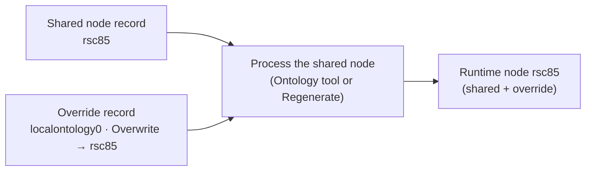

# Overriding shared ontology nodes (local ontology)

> See also: [Ontology](index.md) · [Ontology authoring](authoring.md) · [Ontology tool](../../tools/using_ontology.md) · [Ontology parser tool](../../tools/using_ontology_parser.md) · [ontology (build layer)](ontology_write.md)

An installation often needs a shared node to look or read slightly differently: a
field label that suits your institution better, a highlighted field, a property
switched off. Editing the shared node itself is the wrong fix: the next ontology
update replaces it with the community version, and your change is gone.

A **local override** solves this. You write the change in a record of your own
**local ontology** (`localontology`). The record points at the shared node and
states only what should differ. Dédalo applies it on top of the shared definition
every time that node is processed, including after an ontology update.

This page is for **administrators** who maintain an installation's ontology.

!!! warning "Developer/administrator access"
    Overrides are created in the Ontology area and applied with the
    [Ontology tool](../../tools/using_ontology.md). Both are restricted to
    developers/superusers. An override applies to the **whole installation** —
    every user, project and profile sees the overridden node.

## How it works

| Piece | Where | Role |
| --- | --- | --- |
| **Shared node** | its own TLD, e.g. the *Name* field `rsc85` of the *People* section `rsc75` | The community definition. You never edit it. |
| **Override record** | a record of the local ontology section (`localontology0`) | States what differs for your installation. Linked to the shared node through its **Overwrite** field (`ontology42`). |
| **Runtime node** | `dd_ontology` | What the running application reads. Built from the shared node **plus** its override. |

The override is applied **when the shared node is processed** into the runtime
table, by the [Ontology tool](../../tools/using_ontology.md) or by a
**Regenerate** in the [Ontology parser tool](../../tools/using_ontology_parser.md).
Saving the override record alone changes nothing visible: you always finish by
processing the **shared** node.



## Before you start: the local ontology TLD

Overrides live in the TLD named exactly **`localontology`**. Set it up once per
installation:

1. Open `Ontology → Ontologies main` and search for the TLD `localontology`. If a
   record exists and is active, skip to step 4.
2. Create a new record: TLD `localontology`, a name (e.g. *Local ontology*), the
   main language, and a typology (*Others* is a good choice). Set *Real section
   tipo* to `ontology1`, like any other ontology TLD (see
   [Creating a new TLD](index.md#creating-a-new-tld)).
3. Press **Create ontology** in the inspector.
4. Open the [Ontology parser tool](../../tools/using_ontology_parser.md), tick
   `localontology` and press **Refresh status**. It must report the TLD in sync
   with its main node present. If it does not, press **Regenerate** for it.

Your override records are then reachable from
`Ontology → Instances → <typology> → <name>` — for example
`Ontology → Instances → Others → Local ontology`.

!!! danger "Never delete the `localontology` record in *Ontologies main*"
    Deleting a TLD's record in *Ontologies main* deletes **every** record of
    that TLD with it. For `localontology`, that is every override you have
    written. To remove a single override, delete that override record instead
    (see [Remove an override](#sample-5-remove-an-override)).

## Create an override, step by step

1. **Find the shared node.** Note its tipo, e.g. `rsc85`, and look at its current
   values in the Ontology area: term, CSS, properties.
2. **Create a record in the local ontology section**
   (`Ontology → Instances → <typology> → Local ontology` → *New*).
3. **Link it.** In the **Overwrite** field (`ontology42`, group *Relations*),
   search for the shared node and select it. Use **only** this field to link —
   *Connected to* (`ontology10`) and *Parent* (`ontology15`) are values the
   override may change, not links.
4. **Fill only what should differ** (see [What you can override](#what-you-can-override)).
   Leave every other field empty: an empty field means "keep the shared value".
5. **Process the shared node.** Open the shared node's record (here, record `85`
   of the `rsc` ontology) and run the [Ontology tool](../../tools/using_ontology.md)
   on it (**Process**, or Ctrl+S). The tool does not appear on override records
   on purpose: an override is not a node of its own.
6. **Check the result** in the section that uses the node (for `rsc85`, the edit
   form of a *People* record). Reload the page if it was already open.

## What you can override

| Field on the override record | Tipo | Rule |
| --- | --- | --- |
| **Term** | `ontology5` | **Merged per language.** The languages you fill replace the shared ones; the others keep the shared value. Empty values do not count. |
| **CSS** | `ontology16` | **Replaces** the shared CSS **whole**. It is a property key like any other — see below. |
| **Source** | `ontology17` | **Replaces** the shared source (request config) **whole**. |
| **Properties** | `ontology18` | **Per top-level key.** Each key you state replaces the shared key whole; keys you leave out are kept; a key set to `null` is **removed**. `css` and `source` can be removed here too. |
| **Parent** | `ontology15` | Replaces the shared parent when filled (moves the node). |
| **Model** | `ontology6` | Replaces the shared model when filled. |
| **Connected to** | `ontology10` | Replaces the shared relations when filled. |
| **v5 Properties** | `ontology19` | Replaces the shared legacy value when filled. |

Never taken from an override, whatever the record says:

| Field | Tipo | Why |
| --- | --- | --- |
| **tld** | `ontology7` | It is the node's identity (`rsc` + `85` = `rsc85`). |
| **Translatable** | `ontology8` | It decides how the field's data is **stored** (per language or not); changing it would hide existing values. A new override record shows *Translatable* filled by default — it is ignored. |
| **Is model** | `ontology30` | Structural. **Model nodes cannot be overridden at all.** |
| **Order** | `ontology41` | The node keeps its shared position. |

## Samples

All samples override the *Name* field `rsc85` (a `component_input_text` in the
*People* section `rsc75`). Its shared definition is:

```jsonc
// term (ontology5)
{ "lg-eng": "Name", "lg-spa": "Nombre", "lg-cat": "Nom", "lg-fra": "Prénom", … }

// CSS (ontology16)
{ ".wrapper_component": { "grid-column": "span 4" } }

// Properties (ontology18)
{ "mandatory": true, "multi_value": true, "with_lang_versions": true,
  "DES_unique": { "check": true, "disable_save": false, "server_check": false } }
```

### Sample 1: relabel a field in one language

Fill **Term** in English only: `Full name`. Leave the other languages empty.

Result after processing `rsc85`:

```jsonc
{ "lg-eng": "Full name", "lg-spa": "Nombre", "lg-cat": "Nom", "lg-fra": "Prénom", … }
```

To relabel several languages, switch the record's data language and fill each one.

### Sample 2: restyle a field (CSS)

Give the field a pale yellow background. Your CSS **replaces** the shared CSS
whole, so **repeat the shared rules you want to keep** — here `grid-column`, or
the field shrinks to its default width.

```json
{
    ".wrapper_component": {
        "grid-column": "span 4",
        "background-color": "#fefed5"
    },
    ".wrapper_component .input_value": {
        "font-size": "1.2em",
        "font-weight": "600"
    }
}
```

Result: the runtime CSS of `rsc85` is exactly this object. The other properties
(`mandatory`, `multi_value`, …) are untouched — CSS is one key among them.

!!! tip "Start from the shared CSS"
    Copy the shared node's CSS into the override first, then edit it. What you
    see in the override is then exactly what the field gets.

### Sample 3: change one property

Stop highlighting the field when it is empty. In **Properties**, state only that
key:

```json
{ "mandatory": false }
```

Result: `mandatory` becomes `false`; `multi_value`, `with_lang_versions`,
`DES_unique` and the CSS keep their shared values.

### Sample 4: remove a property

Set the key to `null` in **Properties**. To drop the shared CSS entirely and
remove `mandatory`:

```json
{ "css": null, "mandatory": null }
```

Result: the runtime node has no `css` and no `mandatory`; every other key is kept.

!!! danger "Removing and filling the same key is refused"
    `{"css": null}` in **Properties** while the **CSS** field is also filled is a
    contradiction. Processing the node then **fails** with an *ontology node
    definition is unusable* error and the runtime node is left as it was; the
    server log names the override record and the key. Clear one of the two.

### Sample 5: remove an override

1. Delete the override record (or clear its **Overwrite** link).
2. Process the shared node again.

The runtime node goes back to the shared definition.

## How the CSS is applied

A component's CSS is scoped to that component in that section and mode. For
`rsc85` in the *People* edit form, the client prefixes each selector with the
component's own classes:

| You write | The page gets |
| --- | --- |
| `.wrapper_component` | `.rsc75_rsc85.rsc85.edit.wrapper_component` (the field's own wrapper) |
| `.wrapper_component .input_value` | `.rsc75_rsc85.rsc85.edit.wrapper_component .input_value` |
| `.content_data` | `.rsc75_rsc85.rsc85.edit > .content_data` (a direct child) |

Two rules decide whether your CSS shows at all:

- **List views do not use a component's CSS.** It applies to the edit form and
  the other non-list views. List columns take their CSS from the section's list
  definition.
- **A section can override its components' CSS.** When the section node's own
  properties carry `css` keyed by the component tipo (for example
  `"css": { "rsc85": { … } }` on the section), that CSS **wins** over the
  component's, override included. If your override has no visible effect, check
  the section node first.

## Overrides and ontology updates

An ontology update replaces the shared TLDs you selected (`rsc`, `dd`, …) with the
master's version and then re-processes them. Your override records are not part
of those TLDs, so they are kept, and they are **re-applied automatically** when
the updated nodes are processed.

!!! danger "Never add `localontology` to the ontologies to update"
    The update widget lets you choose which TLDs to pull from the master
    (`ACTIVE_ONTOLOGY_TLDS` in `../private/.env`, or the list in the widget). If
    `localontology` is in that list and the master serves one, the master's
    local ontology **replaces yours**, and every override is lost. Keep it out of
    the list.

After an update, check that each override still makes sense: if the shared node
changed (new properties, a different CSS), your override may now replace values
you would rather keep. That is the cost of the strict replace rule — and the
reason to keep overrides small.

## Tips

- **Override as little as possible.** Every field you fill stops following the
  shared ontology. Fill one language, one key — not a copy of the whole node.
- **One override per node.** If several override records point at the same node,
  only the one with the **lowest record id** is used. Keep one, delete the rest.
- **Name the record after what it changes**, e.g. *rsc85 — highlight Name*, in
  its term or description, so the local ontology list reads as a change log.
- **Do not override the model** of a field that already holds data. The stored
  values were written for the shared model.
- **Moving a node with Parent** (`ontology15`) is possible, but keep it within
  the same section: a component's data belongs to the section it was defined for.
- **Verify with the parser.** Editing an override without processing the shared
  node leaves the runtime stale. The
  [Ontology parser tool](../../tools/using_ontology_parser.md) reports it: tick the
  shared TLD (`rsc`), **Refresh status**, and the node shows as *stale* until you
  process it.
- **Back up before large changes.** Override records are ordinary ontology
  records in your database, so they travel with your database backups.

## Troubleshooting

| Symptom | Likely cause | Fix |
| --- | --- | --- |
| Nothing changed after saving the override | The shared node was not processed | Run the [Ontology tool](../../tools/using_ontology.md) on the **shared** node's record. |
| Still nothing changed | The override is linked through *Connected to* or *Parent*, not **Overwrite** | Link it in **Overwrite** (`ontology42`). |
| The field shrank or lost its layout | Your CSS replaced the shared CSS whole and dropped `grid-column` | Repeat the shared rules you want to keep ([Sample 2](#sample-2-restyle-a-field-css)). |
| CSS shows in the edit form but not in the list | List views do not use component CSS | Expected — see [How the CSS is applied](#how-the-css-is-applied). |
| CSS has no effect anywhere | The section node overrides this component's CSS | Check the section's `css` keyed by the component tipo. |
| The override is ignored | The node is a model, or another override record with a lower id points at it | Models cannot be overridden; keep a single override per node. |
| Processing fails: *ontology node definition is unusable* | A key is removed (`null`) in **Properties** and filled in **CSS** / **Source** (the server log names the record) | Clear one of the two. |
| *Translatable* on the override has no effect | Translatability is never overridden | Expected — it decides how the data is stored. |
| The Ontology tool is missing on the override record | Override records are not nodes | Process the shared node instead. |

## Related

- [Ontology](index.md) — shared and local ontologies, creating a TLD.
- [Ontology authoring](authoring.md) — the node fields and the `properties` grammar.
- [Ontology tool](../../tools/using_ontology.md) — process one record or a section.
- [Ontology parser tool](../../tools/using_ontology_parser.md) — inspect drift and regenerate a whole TLD.
- [ontology (build layer)](ontology_write.md) — how a node is parsed into the runtime table.
