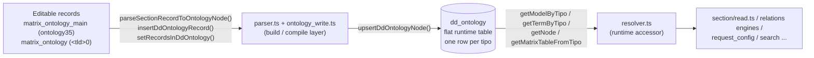

# ontology (build layer)

> The TS ontology **write/compile** layer — the successor of the PHP server class `ontology`, which managed the **editable** ontology stored in the matrix tables and compiled it into the flat runtime `dd_ontology` table that drives every request.

> See also: [Ontology concept](index.md) · [request_config presets](request_config_presets.md) · [Sections](../sections/index.md) · [Components](../components/index.md) · [Architecture overview](../architecture_overview.md)

This page is the **module-level reference** for the ontology write/compile
layer. For the conceptual model — *what the ontology is*, TLDs, the model/node
correspondence, shared vs local ontologies — read [Ontology](index.md) first;
this document does not repeat that material.

!!! warning "This is the *build* layer, not the runtime accessor"
    The module application code uses at request time to read a node (model,
    label, parent, translatable, relations) is **`resolver.ts`**
    (`src/core/ontology/resolver.ts`), *not* the modules on this page. The
    modules described here manage the editable definitions and **compile** them
    into the `dd_ontology` table that `resolver.ts` then reads. Regular code
    should treat ontology nodes as read-only and go through `resolver.ts`;
    structural changes go through the write drivers below. See
    [How it fits with the rest of Dédalo](#how-it-fits-with-the-rest-of-dedalo).

## Role

PHP's `ontology` (`core/ontology/class.ontology.php`) was a **stateless static
utility class** — no instance state, every method `public static`. The TS
rewrite keeps that statelessness but splits the class's two concerns into
**separate modules** rather than one god-object, matching the horizontal-engine
architecture the rest of the rewrite uses:

| concern | PHP | TS module |
| --- | --- | --- |
| Parse ONE editable record into a node | `parse_section_record_to_ontology_node()` + private helpers (`get_overwrite`, `get_term_id_from_locator`, …) | `src/core/ontology/parser.ts` |
| Orchestrate writes (single/bulk/regenerate/provisioning) | `insert_dd_ontology_record()`, `set_records_in_dd_ontology()`, `regenerate_records_in_dd_ontology()`, `add_main_section()`, `create_parent_grouper()`, `create_dd_ontology_ontology_section_node()` | `src/core/ontology/ontology_write.ts` |
| The `dd_ontology` table's own read/write primitives (PHP `dd_ontology_db_manager`) | `dd_ontology_db_manager::create/read/update/delete/search`, `ontology_utils::check_active_tld/delete_tld_nodes`, the backup-table protocol | `src/core/db/dd_ontology.ts` |
| Cascade-delete a whole TLD | `delete_ontology()` / `delete_main()` | `src/core/resolve/ontology_delete.ts` (`deleteOntologyMain`) — trigger-based: it fires when a `hierarchy1`/`ontology35` registry record is deleted, not as a standalone call |

Together they operate on the same two-tier representation PHP used:

1. **The editable representation** — the ontology as ordinary Dédalo records,
   so curators can edit it in the back office like any other data:
   - `matrix_ontology_main` (section `ontology35`, `ONTOLOGY_MAIN_SECTION` in
     `src/core/ontology/ontology_tipos.ts`) — one record per **TLD** (the
     "ontology main": its name, TLD code, `target_section_tipo`, main language,
     typology, order, active flags).
   - `matrix_ontology` per-TLD section (`<tld>0`, e.g. `dd0`, `oh0`,
     `ontologytype3`) — one record per **node** (its tld, parent, model,
     order, translatable flag, relations, term, properties).

2. **The runtime representation** — the flat `dd_ontology` table, one row per
   `tipo`, holding the parsed/denormalized node that `resolver.ts` reads on
   every request. `parser.ts` + `ontology_write.ts` are the **compiler** that
   walks the editable records and upserts `dd_ontology` rows
   (`parseSectionRecordToOntologyNode()` → `upsertDdOntologyNode()`).



## Responsibilities

- **Compile editable records → `dd_ontology`.** Parse one section record into a
  `DdOntologyNode` (`parseSectionRecordToOntologyNode()`) and upsert it
  (`insertDdOntologyRecord()`); do it in bulk for a section
  (`setRecordsInDdOntology()`) or for whole TLDs
  (`regenerateRecordsInDdOntology()`). **Divergence from PHP:** bulk "list
  mode" in TS is a **full-section scan**; PHP filters by the session's
  search-query-object, which TS keeps no twin of (ledgered in
  `ontology_write.ts`).
- **Resolve node fields from the editable side.** Read each definition
  component (tld, parent, model, order, translatable, relations, term,
  properties) off the matrix record, applying the **local-overwrite**
  resolution (`getOverwriteLocator()`) so project-specific overrides win.
- **TLD ↔ section-tipo mapping.** `mapTldToTargetSectionTipo()` (`dd` → `dd0`,
  throws on an unsafe TLD) in `src/core/ontology/tld.ts`; build a node's `tipo`
  and term-id from a locator (`getTermIdFromLocator()`, `parser.ts`). PHP's
  `map_target_section_tipo_to_tld()` (the inverse, `dd0` → `dd`) has **no
  standalone TS port** — every current caller already has the TLD in hand via
  `getTldFromTipo()`.
- **Ontology-main (TLD) metadata.** Look up the main record by TLD
  (`getOntologyMainFromTld()`); read a TLD's TLD string, typology, and full
  name/term data (`getMainTld()`, `getMainTypologyId()`, `getMainNameData()`,
  all in `ontology_write.ts`). The active-elements tree-boot projection (PHP
  `get_active_elements()` / `row_to_element()`) lives in
  `src/core/area/tree.ts` (the area_thesaurus/area_ontology boot payload), not
  in the ontology write module — it is a *read*, so it sits with the resolver
  side of the split. `get_main_order()` is ported too, but relocated: a
  private `getMainOrder()` helper local to `src/core/ts_object/search.ts`
  (the thesaurus search's root-order lookup), not a reusable export of
  `ontology_write.ts`.
- **Lifecycle of a whole ontology (TLD).** Create the main section + parent
  grouper + ontology-section node (`addMainSection()`, `createParentGrouper()`,
  `createDdOntologyRootNode()`); cascade-delete a TLD
  (`deleteOntologyMain()`, `src/core/resolve/ontology_delete.ts`). PHP's
  bootstrap/recovery helpers that rebuild editable records from a parsed
  `dd_ontology` dump (`create_ontology_records()`,
  `add_section_record_from_dd_ontology()`, `assign_relations_from_dd_ontology()`,
  `reorder_nodes_from_dd_ontology()`) have **no TS port** (gap — exercised only
  by ontology recovery/import, not by normal editing).
- **Thesaurus/tree roots.** PHP's `get_root_terms()` (children that seed a tree
  view) is folded into the tree-boot projection in `src/core/area/tree.ts`
  (`root_terms` from `hierarchy45`/`hierarchy59`). `get_siblings()` /
  `get_order_from_locator()` have **no TS port** (gap; the write-side sibling
  reorder is `syncOrderToDdOntology()`, consumed by the tree's `save_order` —
  see [`dedalo-tree-ts`](../../../src/core/ts_object/) for that surface).
- **Version gate.** PHP's `dd_ontology_version_is_valid()` (checks the `dd1`
  root node's date against a minimum, gating the update flow) has **no TS
  port** — the migration catalog itself is PHP-owned in the coexistence period
  (see `rewrite/STATUS.md`, "update_code/update_ontology" refusal).
- **Worker hygiene — structurally eliminated, not "ported."** PHP's two static
  caches (`$cache_ontology_sections`, `$cache_active_ontology_elements`) needed
  a manual `ontology::clear()` on the persistent-worker reset hook. TS has no
  such hazard: every `dd_ontology` write ends by calling
  `clearOntologyDerivedCaches()` (`src/core/ontology/cache_invalidation.ts`),
  the single chokepoint every cache-owning module registers with — no manual
  reset call exists or is needed.

## Key concepts / data model

| concept | where | meaning |
| --- | --- | --- |
| **ontology main** | `matrix_ontology_main` = `ontology35` (`ONTOLOGY_MAIN_SECTION`) | One record per TLD. Holds the TLD code (`hierarchy6`), `target_section_tipo`, name/term, main lang, typology, order and active flags. |
| **target section tipo** | derived: `<tld>0` | The section under which a TLD's nodes live. `dd` → `dd0`, `oh` → `oh0`. The mapping is purely string concatenation (`mapTldToTargetSectionTipo()`, `src/core/ontology/tld.ts`). |
| **node record** | `matrix_ontology` under `<tld>0` | One editable record per node, with definition components: tld (`ontology7`), parent (`ontology15`), model (`ontology6`), order (`ontology41`), translatable (`ontology8`), relations (`ontology10`), term (`ontology5`), properties (`ontology18` + css `ontology16` + rqo `ontology17` + v5 `ontology19`). All named in `src/core/ontology/ontology_tipos.ts`. |
| **dd_ontology row** | `dd_ontology` table | The compiled, flat runtime node keyed by `tipo`. Read by `resolver.ts`, written by `src/core/db/dd_ontology.ts`. |
| **tipo** | `<tld><section_id>` | A node's runtime id, built from its TLD + the editable record's `section_id` (`` `${tld}${sectionId}` ``). |
| **overwrite (local ontology)** | section `localontology0` | A local record that points at a shared node and overrides selected fields. `getOverwriteLocator()` (`parser.ts`) finds it; the parser favours the overwrite locator for most fields. **`is_model` is never overwritten** (always read from the canonical node); `model`/`model_tipo` themselves ARE overwrite-aware (the TS parser pins the live PHP *code*, which disagrees with its own docblock on this point). |

!!! note "What `parseSectionRecordToOntologyNode()` resolves"
    For each node it reads (overwrite-favoured where applicable): **TLD**
    (mandatory — returns `null` if empty), **parent** (term-id of the parent
    locator; `null` for the `dd1`/`dd2` roots), **is_model** (canonical-only),
    **model** + **model_tipo** (overwrite-aware; `model` = strict `lg-spa` term
    of the model node, no lang fallback), **order_number** (canonical-only,
    `(int)`-cast, empty → `null`), **is_translatable** (default `true` when
    missing), **is_main** (`tipo === <tld>0`), **relations** (each resolved to
    `{tipo}`), **properties** (merging css and source/`request_config`
    sub-components — the PHP non-blocking `request_config_object::validate_config()`
    warning is **not reproduced**, ledgered), legacy **propiedades** (v5,
    pretty-printed byte-identical to PHP `json_encode(..., JSON_PRETTY_PRINT)`
    via `phpPrettyJsonEncode()`), and the **term** (`{lg-*: value}`).

## Instantiation & lifecycle

There is **nothing to instantiate** — every function is a plain exported
`async function`, called directly:

```ts
import { setRecordsInDdOntology, insertDdOntologyRecord } from
  'src/core/ontology/ontology_write.ts';

// Compile every editable ontology record of a section into dd_ontology
const response = await setRecordsInDdOntology({ sectionTipo: 'oh0' }); // list mode: full-section scan
// response = { result, msg, errors, total, processed_count }

// Compile a single node and UPSERT it into dd_ontology; returns its tipo
const tipo = await insertDdOntologyRecord('oh0', 12); // e.g. 'oh12' (null if TLD empty)
```

No cache-reset call is needed afterward — `upsertDdOntologyNode()` (the
underlying write primitive in `src/core/db/dd_ontology.ts`) already fans out
`clearOntologyDerivedCaches()` on every write. PHP's `ontology::clear()` (and
`common::clear()`) had to be called explicitly by the persistent-worker reset
hook; that hazard is structurally gone in the single long-lived Bun process
with request-scoped context.

## Public API

Grouped by concern, mirroring the PHP method groups above but naming the real
TS export and its module. Return shapes are taken from the TS signatures/JSDoc.

### Compile editable records → dd_ontology

| function | module | purpose |
| --- | --- | --- |
| `parseSectionRecordToOntologyNode(sectionTipo, sectionId)` | `ontology/parser.ts` | Build a `DdOntologyNode` from one editable matrix record: resolve tld/parent/model/order/translatable/relations/term/properties (overwrite-favoured). Returns the node, or `null` if the mandatory TLD value is empty. |
| `insertDdOntologyRecord(sectionTipo, sectionId)` | `ontology/ontology_write.ts` | Parse one record (above) then `upsertDdOntologyNode()` it into `dd_ontology`. Returns the resulting `tipo`, or `null` on failure. |
| `setRecordsInDdOntology(target)` | `ontology/ontology_write.ts` | Bulk compile: edit mode (`sectionId` given) processes one record; list mode processes **every** record of the section (TS full-section scan — PHP filters by the session SQO, a documented divergence). Main-section records take the TLD path (delete nodes when the TLD is inactive, else (re)create the `<tld>0` node via `createDdOntologyRootNode()`). Returns `{result, msg, errors, total, processed_count}`. |
| `regenerateRecordsInDdOntology(tlds, userId?)` | `ontology/ontology_write.ts` | Full rebuild for the given TLDs: backup table → parse ALL matrix records in memory → delete tld nodes → upsert all → refresh main section + root node. The `dd_ontology_bk` backup table **is** the rollback (not a transaction — matches PHP and the two-server coexistence period) and is **left behind on success** (PHP-pinned). Returns `{result, msg, errors, total_insert}`. |
| `build_cache_file()` (PHP) | — | **Not ported.** PHP's experimental opcode-cache dump was explicitly "not for production"; the TS resolver's in-process `Map` cache serves the same role without a file. |

### Node-field resolution helpers

| function | module | purpose |
| --- | --- | --- |
| `getTermIdFromLocator(locator)` | `ontology/parser.ts` | Build a node's term-id (`<tld><section_id>`, e.g. `dd55`) from a locator: fast path from the TLD string, slow fallback reading the TLD component off the pointed record. Returns `null` if unresolvable. |
| `getOverwriteLocator(sectionTipo, sectionId)` | `ontology/parser.ts` | Find the local-ontology override (`localontology0`) pointing at this node, or `null`. Returns `null` for model nodes and for local-ontology records themselves. |
| `root_terms` projection | `area/tree.ts` | The children that seed a thesaurus tree view (`hierarchy45`, or `hierarchy59` in the model view) — folded into the tree-area boot payload rather than a standalone helper. |
| `get_siblings()` / `get_order_from_locator()` (PHP) | — | **Not ported** (gap). The write-side analog is `syncOrderToDdOntology()` (below), consumed by the tree's reorder flow. |

### TLD ↔ section-tipo mapping

| function | module | purpose |
| --- | --- | --- |
| `mapTldToTargetSectionTipo(tld)` | `ontology/tld.ts` | `<tld>` → `<tld>0` (e.g. `dd` → `dd0`). Throws if the TLD is unsafe. |
| `map_target_section_tipo_to_tld()` (PHP) | — | **Not ported** as a standalone function — every current TS caller already holds the TLD via `getTldFromTipo()` (a general tipo-prefix extractor, not TLD-specific). |

### Ontology-main (per-TLD) lookups

| function | module | purpose |
| --- | --- | --- |
| `getOntologyMainFromTld(tld)` | `ontology/ontology_write.ts` | Find the `matrix_ontology_main` row (`{section_id}`) for a TLD, or `null`. TLD is sanitised (`safeTld`). |
| `getMainTld(sectionId, sectionTipo)` | `ontology/ontology_write.ts` | The lowercased TLD of a main record (`hierarchy6`), or `null`. |
| `getMainTypologyId(tld)` | `ontology/ontology_write.ts` | The TLD's typology id (defaults to `15`, "others"), or `null` if no main record. |
| `getMainNameData(tld)` | `ontology/ontology_write.ts` | The TLD's full name/term data (all language translations), or `null`. |
| `get_main_order()` (PHP) | `getMainOrder(tld)` *(private)* | `ts_object/search.ts` | Reads `matrix_ontology_main`/`ontology35`'s `hierarchy48` for the TLD (not `ontology_write.ts` — relocated to where the thesaurus search needed a root-node display order). No ontology-main record → `null`; otherwise the `(int)`-cast value, default `0`. |
| `get_all_ontology_sections()` / `get_all_main_ontology_records()` (PHP) | — | — | **Not ported** (gap). |
| tree-boot active elements | `area/tree.ts` | The active-hierarchies/ontologies projection consumed by the thesaurus/ontology tree areas — the TS locus for PHP's `get_active_elements()` / `row_to_element()`, byte-parity gated (`area_hierarchy_differential.test.ts`). |

### Ontology lifecycle (create / regenerate / delete a TLD)

| function | module | purpose |
| --- | --- | --- |
| `addMainSection(fileItem, userId?)` | `ontology/ontology_write.ts` | Idempotently create/update the `matrix_ontology_main` record for a TLD from a parsed file item (`{tld, section_tipo?, typology_id?, name_data?}`). Reuses the existing row (matched by TLD) or creates a new `ontology35` record. Returns the main `section_id`. |
| `createDdOntologyRootNode(fileItem, userId?)` | `ontology/ontology_write.ts` | Create/UPSERT the `dd_ontology` node that *represents the ontology section itself* (`<tld>0`) so the TLD appears in the tree/menu. Returns the tipo. |
| `createParentGrouper(parentGroup, tld, typologyId, userId?)` | `ontology/ontology_write.ts` | Ensure the grouper node that organizes a TLD under its typology in the menu exists (creating the mandatory main grouper in matrix on the fly during a partial bootstrap). Returns the grouper tipo. |
| `create_ontology_records()` / `add_section_record_from_dd_ontology()` / `assign_relations_from_dd_ontology()` / `reorder_nodes_from_dd_ontology()` (PHP) | — | **Not ported** (gap — recovery/import bootstrap path, not exercised by normal editing/regenerate). |
| `deleteOntologyMain(sectionTipo, sectionId, deleteRecord)` | `src/core/resolve/ontology_delete.ts` | The TS equivalent of `delete_main()`/`delete_ontology()`, but **trigger-based**: fires when a `hierarchy1`/`ontology35` registry record is deleted — purges every `dd_ontology` node of the TLD (parameterized, refusing on empty/unsafe tld), the registry record itself, then every node record of the `<tld>0` section (through the normal per-record delete pipeline, Time Machine included). |

### Versioning & worker hygiene

| function | module | purpose |
| --- | --- | --- |
| `dd_ontology_version_is_valid()` (PHP) | — | **Not ported** — the update/migration catalog is PHP-owned during coexistence. |
| `clearOntologyDerivedCaches()` | `ontology/cache_invalidation.ts` | The TS successor of `ontology::clear()`/`common::clear()`, but automatic: called by every `dd_ontology` write, not a manual per-worker reset hook. |
| (cache size cap) | `ontology/resolver.ts` | `MAX_CACHE_ENTRIES = 10000` on the node cache, mirroring PHP's `manage_cache_size()` (`MAX_CACHE_SIZE = 1000`) worker-safety cap, oldest-entries-dropped-first. |

## How it fits with the rest of Dédalo

The write/compile layer described here is the write half of a clear split with
the read half, `resolver.ts`:

- **[`resolver.ts`](../../../src/core/ontology/resolver.ts)** is the runtime,
  read-only, request-agnostic cached registry over `dd_ontology`. It is what
  `section/read.ts`, the relations engines, `request_config`, `search`, etc.
  call to learn a node's model, translatable flag, parent, relations and
  matrix table — e.g. `getModelByTipo()`, `getTranslatableByTipo()`,
  `getMatrixTableFromTipo()`, `getComponentFilterTipo()`,
  `getRecursiveChildrenTipos()`, `getTermByTipo()`. The write layer *produces*
  the rows those functions read (via `upsertDdOntologyNode()`), and itself
  calls `getModelByTipo()` / `getMatrixTableFromTipo()` while parsing.
- **`src/core/db/dd_ontology.ts`** provides the low-level `dd_ontology`
  operations the write layer leans on: `getActiveTlds()` /
  `deleteTldNodes()` (PHP `ontology_utils::check_active_tld()` /
  `delete_tld_nodes()`), plus the backup-table protocol
  (`createBackupTable()` / `restoreFromBackupTable()` / `dropBackupTable()`)
  regenerate uses as its rollback.
- **Import/export (PHP `ontology_data_io`)** — the sibling that moved *shared*
  ontologies between installations as files. **Not ported to TS.** The
  developer-only `tools/tool_ontology_parser` deliberately does **not**
  register an `export_ontologies` action (refused as `unauthorized_method`);
  only `get_ontologies` (list) and `regenerate_ontologies` are wired.
- **Sections & components** — the editable ontology is just ordinary records,
  so it is created/read/deleted through the same section/matrix machinery as
  any other data (`src/core/section/record/create_record.ts`,
  `src/core/resolve/read_rows.ts`, the delete pipeline).
- **Diffusion** — PHP's `set_records_in_dd_ontology()` / `delete_ontology()`
  invalidate the diffusion section-map cache after a change
  (`diffusion_utils::delete_section_map_cache_file()`). **Not reproduced** in
  the TS write drivers (gap; see the diffusion unit's own cache surfaces).
- **Thesaurus / tree** — the tree-boot `root_terms` projection
  (`src/core/area/tree.ts`) and `syncOrderToDdOntology()` feed the
  thesaurus/ontology tree builders (see
  [`ts_object`](../../../src/core/ts_object/)).

## Examples

### Resolve a TLD's main metadata

```ts
import { getOntologyMainFromTld, getMainTypologyId, getMainNameData } from
  'src/core/ontology/ontology_write.ts';

const tld = 'oh';

const main = await getOntologyMainFromTld(tld); // {section_id} | null
if (main !== null) {
	const typologyId = await getMainTypologyId(tld); // e.g. 5
	const nameData = await getMainNameData(tld);     // [{lang, value}, ...] | null
}
```

### Build a node's tipo / term-id from a locator

```ts
import { getTermIdFromLocator } from 'src/core/ontology/parser.ts';

const tipo = await getTermIdFromLocator({ section_tipo: 'dd0', section_id: 55 });
// 'dd55' (null if unresolvable)
```

### Tear down a TLD (trigger-based, not a standalone call)

```ts
import { deleteOntologyMain } from 'src/core/resolve/ontology_delete.ts';

// fires as part of deleting the TLD's hierarchy1/ontology35 registry record
const outcome = await deleteOntologyMain('ontology35', mainSectionId, deleteRecord);
// outcome.result === true on success; deletedNodes/deletedRecords counted.
```

!!! warning "Compilation is a heavy, write-side operation"
    `setRecordsInDdOntology()` / `regenerateRecordsInDdOntology()` rebuild
    `dd_ontology` rows by re-reading every definition field of every matched
    record. They are part of the ontology *update/rebuild* flow, not something
    to call in a normal request. Normal reads go through `resolver.ts`.

## Related

- [Ontology concept](index.md) — what the ontology is, TLDs, model/node, shared
  vs local ontologies.
- [request_config presets](request_config_presets.md) — the `request_config`
  carried in node `properties`.
- [Sections](../sections/index.md) · [section class reference](../sections/section.md)
  — the records that store the editable ontology.
- [Components](../components/index.md) · [Base classes](../components/base_classes.md)
  — the component descriptors read while parsing a node.
- [Architecture overview](../architecture_overview.md) — "the ontology is the
  active schema", the abstraction layers and the request lifecycle.
- [Locator](../locator.md) — the pointer type used throughout node resolution.
