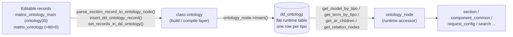

# ontology

> The server class `ontology` — the management/build layer for the **editable** ontology stored in the matrix tables, and the compiler that turns those editable records into the flat runtime `dd_ontology` table that drives every request.

> See also: [Ontology concept](index.md) · [request_config presets](request_config_presets.md) · [Sections](../sections/index.md) · [Components](../components/index.md) · [Architecture overview](../architecture_overview.md)

This page is the **class-level reference** for `ontology`. For the conceptual
model — *what the ontology is*, TLDs, the model/node correspondence, shared vs
local ontologies — read [Ontology](index.md) first; this document does not repeat
that material.

!!! warning "`ontology` is the *build* layer, not the runtime accessor"
    The class that application code uses at request time to read a node (model,
    label, parent, children, relations) is **`ontology_node`**
    (`core/ontology_engine/class.ontology_node.php`), *not* this class. The
    `ontology` class manages the editable definitions and **compiles** them into
    the `dd_ontology` table that `ontology_node` then reads. Regular code should
    treat ontology nodes as read-only and go through `ontology_node`; structural
    changes go through `ontology`. See
    [How it fits with the rest of Dédalo](#how-it-fits-with-the-rest-of-dedalo).

## Role

`ontology` (in `core/ontology/class.ontology.php`) is a **stateless static
utility class** — `class ontology` with **no `extends`**: it does not inherit
from `common` and holds no per-instance state (no `get_instance()`, no
constructor). Everything it offers is a `public static function`.

Its job is to operate on the two-tier representation of the ontology:

1. **The editable representation** — the ontology as ordinary Dédalo records,
   so curators can edit it in the back office like any other data:
   - `matrix_ontology_main` (section `ontology35`, `DEDALO_ONTOLOGY_SECTION_TIPO`)
     — one record per **TLD** (the "ontology main": its name, TLD code,
     `target_section_tipo`, main language, typology, order, active flags).
   - `matrix_ontology` per-TLD section (`<tld>0`, e.g. `dd0`, `oh0`,
     `ontologytype3`) — one record per **node** (its tld, parent, model,
     order, translatable flag, relations, term, properties).

2. **The runtime representation** — the flat `dd_ontology` table, one row per
   `tipo`, holding the parsed/denormalized node that `ontology_node` reads on
   every request. The `ontology` class is the **compiler** that walks the
   editable records and writes/UPSERTs `dd_ontology` rows
   (`parse_section_record_to_ontology_node()` → `ontology_node->insert()`).

So `ontology` sits *between* the editor (sections/components storing the
definition as data) and the runtime resolver (`ontology_node`), plus it provides
the TLD-level lifecycle (create / regenerate / delete a whole ontology).



## Responsibilities

- **Compile editable records → `dd_ontology`.** Parse one section record into an
  `ontology_node` (`parse_section_record_to_ontology_node()`) and insert/UPSERT
  it (`insert_dd_ontology_record()`); do it in bulk by SQO
  (`set_records_in_dd_ontology()`) or for whole TLDs
  (`regenerate_records_in_dd_ontology()`).
- **Resolve node fields from the editable side.** Read each definition component
  (tld, parent, model, order, translatable, relations, term, properties) off the
  matrix record, applying the **local-overwrite** resolution
  (`get_overwrite()`) so project-specific overrides win.
- **TLD ↔ section-tipo mapping.** `map_tld_to_target_section_tipo()` (`dd` →
  `dd0`) and `map_target_section_tipo_to_tld()` (`dd0` → `dd`); build a node's
  `tipo` and term-id from a locator (`get_term_id_from_locator()`).
- **Ontology-main (TLD) metadata.** Look up the main record by TLD or by target
  section tipo; read a TLD's name, typology, order, lang and active flags
  (`get_main_*`, `row_to_element()`, `get_active_elements()`,
  `get_all_ontology_sections()`).
- **Lifecycle of a whole ontology (TLD).** Create the main section + parent
  grouper + ontology-section node (`add_main_section()`,
  `create_parent_grouper()`, `create_dd_ontology_ontology_section_node()`),
  bootstrap editable records from a parsed `dd_ontology` dump
  (`create_ontology_records()`, `add_section_record_from_dd_ontology()`), wire
  relations and order after a build (`assign_relations_from_dd_ontology()`,
  `reorder_nodes_from_dd_ontology()`), and delete everything for a TLD
  (`delete_ontology()`, `delete_main()`).
- **Thesaurus/tree roots.** `get_root_terms()` returns the children that seed a
  tree view; `get_siblings()` / `get_order_from_locator()` resolve ordering.
- **Version gate.** `dd_ontology_version_is_valid()` checks the `dd1` root node's
  date against a minimum, to decide whether an ontology update is required.
- **Worker hygiene.** Two static caches (`$cache_ontology_sections`,
  `$cache_active_ontology_elements`) are purged in `clear()` so state never
  bleeds across persistent-worker requests; both are size-bounded via
  `manage_cache_size()` (`MAX_CACHE_SIZE = 1000`).

## Key concepts / data model

| concept | where | meaning |
| --- | --- | --- |
| **ontology main** | `matrix_ontology_main` = `ontology35` (`DEDALO_ONTOLOGY_SECTION_TIPO`) | One record per TLD. Holds the TLD code (`hierarchy6`), `target_section_tipo`, name/term, main lang, typology, order and active flags. |
| **target section tipo** | derived: `<tld>0` | The section under which a TLD's nodes live. `dd` → `dd0`, `oh` → `oh0`. The mapping is purely string concatenation (`map_tld_to_target_section_tipo()`). |
| **node record** | `matrix_ontology` under `<tld>0` | One editable record per node, with definition components: tld (`ontology7`), parent (`ontology15`), model (`ontology6`), order (`ontology41`), translatable (`ontology8`), relations (`ontology10`), term (`ontology5`), properties (`ontology18` + css `ontology16` + rqo `ontology17` + v5 `ontology19`). |
| **dd_ontology row** | `dd_ontology` table | The compiled, flat runtime node keyed by `tipo`. Read by `ontology_node`. |
| **tipo** | `<tld><section_id>` | A node's runtime id, built from its TLD + the editable record's `section_id` (`$tld . $section_id`). |
| **overwrite (local ontology)** | section `localontology0` | A local record that points at a shared node and overrides selected fields. `get_overwrite()` finds it; the parser favours the overwrite locator for most fields. **Models are never overwritten** (`is_model` nodes return `null`), and `is_model` itself is read from the main node, never the overwrite. |

!!! note "What `parse_section_record_to_ontology_node()` resolves"
    For each node it reads (overwrite-favoured where applicable): **TLD**
    (mandatory — returns `null` if empty), **parent** (term-id of the parent
    locator; `null` for the `dd1`/`dd2` roots), **is_model** (from the main node
    only), **model** + **model_tipo**, **order_number**, **is_translatable**
    (`section_id`-encoded yes/no, default `true`), **is_main** (`tipo === <tld>0`),
    **relations** (each resolved to `{tipo}`), **properties** (merging css and
    rqo/`source` sub-components, with non-blocking `request_config` validation via
    `request_config_object::validate_config`), legacy **propiedades** (v5), and the
    **term** (`{lg-*: value}`).

## Instantiation & lifecycle

There is **nothing to instantiate** — `ontology` is never `new`-ed and has no
`get_instance()`. Call its static methods directly:

```php
// Compile every editable ontology record matching an SQO into dd_ontology
$sqo = new search_query_object();
    $sqo->set_section_tipo([ ontology::map_tld_to_target_section_tipo('oh') ]); // 'oh0'
    $sqo->set_limit(0);
$response = ontology::set_records_in_dd_ontology($sqo);
// $response = { result:bool, msg:string, errors:array, total:int, processed_count:int }

// Compile a single node and UPSERT it into dd_ontology; returns its tipo
$tipo = ontology::insert_dd_ontology_record('oh0', 12); // e.g. 'oh12' (null if TLD empty)
```

The two static caches it owns are reset by the persistent-worker hook:

```php
ontology::clear(); // empties $cache_ontology_sections and $cache_active_ontology_elements
```

## Public API

Grouped by concern. All methods are **static** (the *static?* column is kept for
template parity; every row is `✓`). Return shapes are taken from the source
docblocks/signatures.

### Compile editable records → dd_ontology

| method | static? | purpose |
| --- | --- | --- |
| `parse_section_record_to_ontology_node($section_tipo, $section_id)` | ✓ | Build an `ontology_node` from one editable matrix record: resolve tld/parent/model/order/translatable/relations/term/properties (overwrite-favoured). Returns the node, or `null` if the mandatory TLD value is empty. |
| `insert_dd_ontology_record($section_tipo, $section_id)` | ✓ | Parse one record (above) then `ontology_node->insert()` (UPSERT) it into `dd_ontology`. Returns the resulting `tipo`, or `null` on failure. |
| `set_records_in_dd_ontology($sqo)` | ✓ | Bulk compile: search the editable records named by the SQO and process each — main records go through the TLD path (delete nodes when the TLD is inactive, else (re)create the ontology-section node), regular records through `insert_dd_ontology_record()`. Returns `{result, msg, errors, total, processed_count}`; invalidates the diffusion section-map cache on change. |
| `regenerate_records_in_dd_ontology($tld)` | ✓ | The per-TLD wrapper over `set_records_in_dd_ontology()` used by the update/rebuild flow. Returns a response object. |
| `build_cache_file()` | ✓ | **Experimental, not for production.** Dump every `dd_ontology` row to a `cache_ontology.php` opcode-cache file. |

### Node-field resolution helpers

| method | static? | purpose |
| --- | --- | --- |
| `get_term_id_from_locator($locator)` | ✓ | Build a node's term-id (`<tld><section_id>`, e.g. `dd55`) from a locator: map `section_tipo`→TLD via the main ontology, falling back to reading the TLD off the record. Returns `null` if unresolvable. |
| `get_siblings($parent_locator)` | ✓ | Return the parent node's children data (`ontology14`) as the sibling array. |
| `get_order_from_locator($locator, $siblings)` | ✓ | Return the 1-based position of `$locator` within `$siblings` (defaults to `1` if absent). |
| `get_overwrite($section_tipo, $section_id)` | ✓ | Find the local-ontology override (`localontology0`) pointing at this node, or `null`. Returns `null` for model nodes and for local-ontology records themselves. |
| `get_root_terms($section_tipo, $section_id, $is_model=false)` | ✓ | Return the children that seed a thesaurus tree view (`hierarchy45`, or `hierarchy59` when `$is_model`). |

> The per-field private resolvers used by `parse_section_record_to_ontology_node()`
> are `get_node_component_data()`, `resolve_translatable()`, `resolve_relations()`
> and `resolve_term()`. They are `private` — listed here only so the parse flow is
> traceable; they are not part of the public API.

### TLD ↔ section-tipo mapping

| method | static? | purpose |
| --- | --- | --- |
| `map_tld_to_target_section_tipo($tld)` | ✓ | `<tld>` → `<tld>0` (e.g. `dd` → `dd0`). Throws if the TLD is unsafe. |
| `map_target_section_tipo_to_tld($target_section_tipo)` | ✓ | `<tld>0` → `<tld>` (e.g. `dd0` → `dd`). Returns `false` when no TLD can be parsed. |

### Ontology-main (per-TLD) lookups

| method | static? | purpose |
| --- | --- | --- |
| `get_ontology_main_from_tld($tld)` | ✓ | Find the `matrix_ontology_main` row (`{section_id, section_tipo}`) for a TLD, or `null`. TLD is sanitised (`safe_tld`). |
| `get_ontology_main_form_target_section_tipo($target_section_tipo)` | ✓ | Same lookup keyed by the TLD's `target_section_tipo`, or `null`. |
| `get_all_ontology_sections()` | ✓ | Return all TLD target section tipos (`dd0`, `ontologytype3`, …) from `matrix_ontology_main`. Cached. |
| `get_all_main_ontology_records()` | ✓ | Run an unfiltered (projects-filter-skipped) search over `matrix_ontology_main` and return the `db_result` (or `false`). |
| `get_active_elements()` | ✓ | Search the *active* main records (`hierarchy4 = 1`) and return them as normalized elements (`row_to_element()`). Cached. |
| `row_to_element($row)` | ✓ | Normalize one main row into an object: `{section_id, section_tipo, name, name_data, tld, target_section_tipo, target_section_model_tipo, main_lang, typology_id, typology_name, order, active_in_thesaurus}`. |
| `get_main_tld($section_id, $section_tipo)` | ✓ | The lowercased TLD of a main record (`hierarchy6`), or `null`. |
| `get_main_typology_id($tld)` | ✓ | The TLD's typology id (defaults to `15`, "others"), or `null` if no main record. |
| `get_main_name_data($tld)` | ✓ | The TLD's full name/term data (all language translations), or `null`. |
| `get_main_order($tld)` | ✓ | The TLD's display order used to sort root nodes in tree views (defaults to `0`), or `null` if no main record. |

### Ontology lifecycle (create / regenerate / delete a TLD)

| method | static? | purpose |
| --- | --- | --- |
| `add_main_section($file_item)` | ✓ | Create the `matrix_ontology_main` record for a TLD from a parsed file item (`{tld, section_tipo, typology_id, name_data}`). Returns the new main `section_id`. |
| `create_dd_ontology_ontology_section_node($file_item)` | ✓ | Create/UPSERT the `dd_ontology` node that *represents the ontology section itself* (`<tld>0`) so the TLD appears in the tree/menu. Returns the term-id. |
| `create_parent_grouper($parent_group='ontology40', $tld='ontologytype', $typology_id=15)` | ✓ | Ensure the grouper node that organizes a TLD under its typology in the menu exists (creating the mandatory main grouper in matrix if a child is processed before its parent). Returns the grouper tipo. |
| `create_ontology_records($dd_ontology_rows)` | ✓ | Recreate editable matrix records from parsed `dd_ontology` rows (bootstrap/recover an ontology). |
| `add_section_record_from_dd_ontology($dd_ontology_row)` | ✓ | Create one editable matrix node record from a single parsed `dd_ontology` row. |
| `assign_relations_from_dd_ontology($tld)` | ✓ | After records exist, set each node's `relations` column as `component_portal` locators pointing at the related matrix records. |
| `reorder_nodes_from_dd_ontology($tld)` | ✓ | After records exist, apply the `dd_ontology` ordering to the matrix node records. |
| `delete_main($options)` | ✓ | Resolve the TLD from a main record (`{section_id, section_tipo}`) and delegate to `delete_ontology()`. |
| `delete_ontology($tld)` | ✓ | Delete everything for a TLD: the `dd_ontology` nodes, the main section, every `matrix_ontology` node record, reset the counter, and invalidate the diffusion section-map cache. Returns a response object. |

### Versioning & worker hygiene

| method | static? | purpose |
| --- | --- | --- |
| `dd_ontology_version_is_valid($min_date)` | ✓ | Read the `dd1` root node's date (from `properties.date`, else parsed from the term) and return whether it meets `$min_date`. |
| `clear()` | ✓ | Purge `$cache_ontology_sections` and `$cache_active_ontology_elements` (persistent-worker reset hook). |
| `manage_cache_size(&$cache)` | (protected) | Trim a cache to the most-recent `MAX_CACHE_SIZE` (1000) entries. |

## How it fits with the rest of Dédalo

`ontology` is the *write/compile* half of a clear split with the *read* half,
`ontology_node`:

- **[`ontology_node`](../../../core/ontology_engine/class.ontology_node.php)**
  (`core/ontology_engine/`) is the runtime, mostly read-only wrapper around a
  single compiled `dd_ontology` row, resolved by `tipo`. It is what `section`,
  `component_common`, `request_config`, `search`, etc. call to learn a node's
  model, label, parent, children and relations — e.g.
  `ontology_node::get_model_by_tipo()`, `get_term_by_tipo()`, `get_ar_children()`,
  `get_ar_recursive_children()`, `get_relation_nodes()`,
  `get_ar_tipo_by_model_and_relation()`. The `ontology` class *produces* the rows
  those methods read (via `ontology_node->insert()`), and itself calls
  `ontology_node::get_instance()` / `get_model_by_tipo()` while parsing.
- **[`ontology_utils`](../../../core/ontology_engine/class.ontology_utils.php)**
  provides the low-level `dd_ontology` operations `ontology` leans on:
  `check_active_tld()` and `delete_tld_nodes()`.
- **[`ontology_data_io`](../../../core/ontology/class.ontology_data_io.php)** is
  the import/export sibling: it moves *shared* ontologies between installations as
  files (it does not touch local ontologies). `ontology` is the in-DB
  build/compile counterpart.
- **[`common`](../components/base_classes.md)** — note `ontology` does **not**
  extend `common` (unlike `section` / `component_common`). It uses sections and
  components only as the *storage* of the editable definition: it instantiates
  `component_common` in `list` mode to read each definition field, and
  `section` / `sections` to create and delete the definition records.
- **Sections & components** — the editable ontology is just ordinary records, so
  it is created and deleted through `section::create_record()` and
  `sections::delete()`, and read through `component_common::get_instance()`.
- **Diffusion** — because the published "sections with diffusion" map is derived
  purely from the ontology, both `set_records_in_dd_ontology()` and
  `delete_ontology()` call `diffusion_utils::delete_section_map_cache_file()`
  after a change.
- **Thesaurus / tree** — `get_root_terms()` / `get_siblings()` feed the
  thesaurus/ontology tree builders (see [TS tree](../../../core/ts_object)).

## Examples

### Resolve a TLD's main metadata

```php
$tld = 'oh';

$main = ontology::get_ontology_main_from_tld($tld); // {section_id, section_tipo} | null
if ($main!==null) {
    $typology_id = ontology::get_main_typology_id($tld); // e.g. 5
    $name_data   = ontology::get_main_name_data($tld);   // [{lang, value}, ...]
    $order       = ontology::get_main_order($tld);       // int
}

// All active ontologies/hierarchies as normalized elements
$active = ontology::get_active_elements();
// each: {section_id, section_tipo, name, name_data, tld, target_section_tipo,
//        target_section_model_tipo, main_lang, typology_id, typology_name,
//        order, active_in_thesaurus}
```

### Build a node's tipo / term-id from a locator

```php
$loc = new locator();
    $loc->set_section_tipo('dd0'); // the dd TLD's section
    $loc->set_section_id(55);
$tipo = ontology::get_term_id_from_locator($loc); // 'dd55' (null if unresolvable)
```

### Tear down a whole local ontology

```php
$response = ontology::delete_ontology('mupreva'); // a local/custom TLD
// $response->result === true on success; also resets the TLD counter and
// invalidates the diffusion section-map cache.
```

!!! warning "Compilation is a heavy, write-side operation"
    `set_records_in_dd_ontology()` / `regenerate_records_in_dd_ontology()` rebuild
    `dd_ontology` rows by instantiating components for every definition field of
    every matched record. They are part of the ontology *update/rebuild* flow, not
    something to call in a normal request. Normal reads go through `ontology_node`.

## Related

- [Ontology concept](index.md) — what the ontology is, TLDs, model/node, shared
  vs local ontologies.
- [request_config presets](request_config_presets.md) — the `request_config`
  carried in node `properties` (validated non-blockingly during compilation).
- [Sections](../sections/index.md) · [section class reference](../sections/section.md)
  — the records that store the editable ontology.
- [Components](../components/index.md) · [Base classes](../components/base_classes.md)
  — read through `component_common` while parsing a node.
- [Architecture overview](../architecture_overview.md) — "the ontology is the
  active schema", the abstraction layers and the request lifecycle.
- [Locator](../locator.md) — the pointer type used throughout node resolution.
