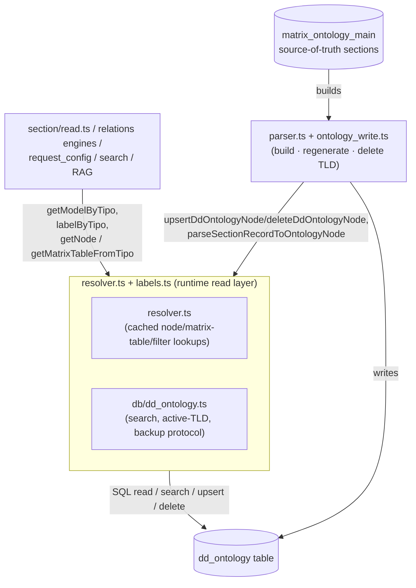

# ontology_engine (runtime read layer)

> The runtime read/resolve layer over the `dd_ontology` table: the TS
> successor of PHP's `ontology_node` (per-node wrapper) and `ontology_utils`
> (multi-node/TLD helpers).

> See also: [Ontology concept](index.md) · [Architecture overview](../architecture_overview.md) · [Sections](../sections/index.md) · [Components](../components/index.md)

This page is the **subsystem reference** for the ontology runtime-read layer —
`src/core/ontology/resolver.ts` plus the read primitives of
`src/core/db/dd_ontology.ts` and the label resolver `src/core/ontology/labels.ts`.
For the conceptual model — *what the ontology is*, that it **is** the active
schema, the TLD + sequence `tipo`, and the per-node JSON shape — read
[Ontology](index.md) first; this document does not repeat that material at
length.

## Role

PHP's `core/ontology_engine/` was a **two-class, server-side subsystem** that
gave the rest of Dédalo read-only, cached access to the active ontology: it was
the layer every `get_instance()` reached for first. The TS rewrite keeps that
responsibility — "resolve a `tipo`'s model, label, parent, relations before
anything else runs" — but drops the two-class OOP shape for a set of plain,
request-agnostic cached functions, matching the rest of the rewrite's
horizontal-engine style:

| PHP class | TS module | role |
| --- | --- | --- |
| **`ontology_node`** | `src/core/ontology/resolver.ts` | Cached, read-only access to the fields the engines actually consume: `model`, `parent`, `translatable`, `properties`, `relations`, plus the derived `getMatrixTableFromTipo()` / `getComponentFilterTipo()` / `getRecursiveChildrenTipos()` lookups. Keyed by `tipo`, module-level `Map` caches (no per-tipo object instance). |
| **`ontology_node` (full row)** | `src/core/db/dd_ontology.ts` — `readDdOntologyRow()` | The full 13-column row (adds `tld`, `model_tipo`, `is_model`, `is_main`, `order_number`, `propiedades`) — **uncached**, used by the parser/write pipeline which needs the current on-disk state, not the process-wide cache. |
| **`ontology_utils`** | `src/core/db/dd_ontology.ts` | The multi-node/TLD helpers that survived the port: `searchDdOntology()` (generic column-filter search), `getActiveTlds()` / the active-TLD set, `deleteTldNodes()`, and the backup-table protocol (`createBackupTable()` / `restoreFromBackupTable()` / `dropBackupTable()`). |
| **label resolution** | `src/core/ontology/labels.ts` | `labelByTipo(tipo, lang)` — the common UI-label entry point (app-lang first, then first non-empty), cached per `(lang, tipo)`. |

Both TS modules sit **on top of** the raw `dd_ontology` SQL (in
`db/dd_ontology.ts` itself — there is no separate data-access-object layer
below them, unlike PHP's `dd_ontology_db_manager`) and **below** every
resolving engine (`section/read.ts`, the relations engines, `request_config`,
search, RAG, …). They are the runtime *reader* of the ontology.

!!! important "resolver.ts reads; parser.ts + ontology_write.ts write the structure"
    This layer is deliberately **read-mostly**. Structural changes to the
    ontology — compiling `dd_ontology` from the `matrix_ontology_main` source
    sections, regenerating or deleting a whole TLD, parsing a section record
    into a node — are the job of the separate write/compile layer described in
    [`ontology` (build layer)](ontology_class.md). Import/export of a shared
    ontology as files (PHP `ontology_data_io`) has **no TS port** at all (gap).

!!! note "Loading"
    PHP explicitly included the two engine classes in the loader
    (`core/base/class.loader.php`) because they were needed very early in
    almost every request, unlike the on-demand-autoloaded `ontology` builder.
    This distinction doesn't apply to TS: there is no autoloader or worker
    warm-up step — `import`s are resolved once at process start and every
    module is available from the first request.

## Responsibilities

- **Per-node metadata resolution** (`resolver.ts`) — given a `tipo`, return its
  model (with legacy/forced/temporal model remapping via `getModelByTipo()`),
  parent, relations, translatable flag and `properties` (`getNode()`); its
  matrix table (`getMatrixTableFromTipo()`); its `component_filter` gate
  (`getComponentFilterTipo()`); and (`labels.ts`) its label with language
  fallback (`labelByTipo()`). The **full row** (`tld`, `model_tipo`,
  `order_number`, `is_model`, `is_main`, `propiedades`) is read uncached via
  `readDdOntologyRow()` (`db/dd_ontology.ts`) — the parser/write pipeline's
  entry point, not the request-time hot path.
- **Tree navigation** — **not centralized**, unlike PHP's single
  `ontology_node` object with `get_ar_children`/`get_ar_recursive_children`/
  `get_ar_parents_of_this`/`get_ar_siblings_of_this`/`get_relation_nodes`.
  Each TS caller walks `parent`/`relations` for its own purpose instead:
  `getRecursiveChildrenTipos()` (resolver.ts, RAG's embeddable-component
  enumeration — descends by `parent`, stopping at nested sections/areas),
  `getComponentFilterTipo()` (resolver.ts, same descent shape, stops at the
  first `component_filter`), `getSectionIdComponentTipo()`
  (`ontology/section_id_component.ts`, same shape again, stops at
  `component_section_id`), and the general depth-first section-content walker
  in `src/core/resolve/section_elements_context.ts` (every component/grouper
  of a section, in ontology order, with a grouper-model allowlist). There is
  no reusable "recursive children with an arbitrary model-exclude list"
  primitive — each of the above hardcodes its own stop condition.
- **Lazy load + caching** (`resolver.ts`) — `getNode()` loads a row once per
  `tipo` into a module-level `Map` (`nodeCache`, capped at
  `MAX_CACHE_ENTRIES = 10000`, oldest-10%-dropped on overflow — the TS mirror
  of PHP's `manage_cache_size()` worker-safety trim). `getMatrixTableFromTipo()`
  and `getComponentFilterTipo()` keep their own per-tipo `Map` caches, **not**
  size-capped (an asymmetry with `nodeCache` worth knowing if a huge
  multi-tenant ontology ever makes this a concern).
- **Cross-cutting lookups** (`db/dd_ontology.ts`) — `searchDdOntology(filters)`
  is a generic, allowlisted column/operator search (the TS analog of
  `ontology_utils::get_ar_tipo_by_model`/`get_ar_all_models`/
  `get_ar_all_tipo_of_model_tipo`, expressed as one parameterized primitive
  rather than three named wrappers — no caller currently wraps it with those
  specific names, so treat this as "the mechanism exists, the convenience
  wrappers don't" rather than a byte-identical port).
- **TLD-level concerns** (`db/dd_ontology.ts`) — the active/installed TLD list
  (`getActiveTlds()`, module-cached, cleared via the invalidation hub — PHP
  additionally persisted this to an on-disk `cache_active_tlds.php` file,
  which TS has no need of in a single long-lived process), and the destructive
  TLD-node delete plus backup/restore-table operations used during
  `regenerateRecordsInDdOntology()`.
- **Node-level structural writes** — `upsertDdOntologyNode()` /
  `deleteDdOntologyNode()` (`db/dd_ontology.ts`) are the TS analogs of
  `ontology_node::insert()`/`delete()`: called by the write/compile layer and
  by ontology maintenance tooling, not by request-time reads.

## Data model

A node is one row of the `dd_ontology` table. TS exposes it as a plain typed
object — `ResolvedNode` (the narrow, cached shape `resolver.ts` returns from
`getNode()`) or `DdOntologyRow` (the full 13-column shape,
`db/dd_ontology.ts`), not a class instance:

| field | type | meaning | on `ResolvedNode`? |
| --- | --- | --- | --- |
| `parent` | `string\|null` | tipo of the parent node (`null` for a root) | yes |
| `term` | *(not on either shape directly — resolved via `labelByTipo()`/`getTermByTipo()`)* | the multilingual label, e.g. `{"lg-eng":"Object"}` | — |
| `model` | `string\|null` | the model name (e.g. `section`, `component_portal`) | yes |
| `model_tipo` | `string\|null` | tipo of the model node, e.g. `dd6` → `section` | `DdOntologyRow` only |
| `order_number` | `int\|null` | position among siblings | `DdOntologyRow` only |
| `relations` | `array\|null` | typed relation objects, e.g. `[{"tipo":"tch7"}]` | yes |
| `tld` | `string` | the Top-Level-Domain namespace (`dd`, `rsc`, `oh`, …) | `DdOntologyRow` only |
| `properties` | `object\|null` | the per-node JSONB descriptor (behaviour/options/layout) | yes |
| `is_model` | `bool` | true when the node is a *model* node, not a descriptor | `DdOntologyRow` only |
| `is_translatable` | `bool` (as `translatable`) | true when the node's data is translatable | yes |
| `is_main` | `bool` | true for a TLD root node (`tipo` = `tld` + `0`) | `DdOntologyRow` only |
| `propiedades` | `string\|null` | **deprecated** v5/v6 JSON-string properties, kept for compatibility | `DdOntologyRow` only |

!!! note "`properties` vs `propiedades`"
    v7 uses the JSONB `properties` object. The legacy `propiedades` string
    column is read only via `readDdOntologyRow().propiedades` for v5/v6
    compatibility — do not use it in new code (matches the v7 *"only
    `properties`"* convention).

### Caches (module-level, request-agnostic)

Unlike PHP's per-request static-class caches (reset by a worker-boundary
`clear()` call), TS's ontology caches are **process-wide** `Map`s that live for
the whole long-lived Bun process and are invalidated **by content**, not by
request or worker boundary:

- `nodeCache` (`resolver.ts`) — capped at `MAX_CACHE_ENTRIES = 10000`, keyed by
  `tipo`.
- `matrixTableCache`, `componentFilterTipoCache` (`resolver.ts`) — per-tipo,
  uncapped.
- `activeTldsCache` (`db/dd_ontology.ts`) — a single cached array, no on-disk
  mirror (PHP additionally wrote `cache_active_tlds.php`; unnecessary here).
- `labelCache` (`labels.ts`) — keyed by `` `${lang} ${tipo}` ``, uncapped.

All of these except `labelCache` register a clear function with
`clearOntologyDerivedCaches()` (`src/core/ontology/cache_invalidation.ts`), the
single chokepoint every `dd_ontology` write calls. `labelCache` currently keeps
its own `clearLabelCache()` but does **not** register with that hub — worth
knowing if you rename a node's term and expect every cached label to update
immediately in the same running process.

!!! note "Worker hygiene — a different shape of the same concern"
    PHP needed `ontology_node`/`ontology_utils` caches to survive *within* one
    persistent-worker lifetime but be manually reset (via `common::clear()`) on
    ontology change, else a long-lived worker would keep serving pre-change
    data. TS keeps the same architecture (module-level `Map`s across many
    requests in one process) but the pre-change hazard is **structurally
    handled automatically** for every clearer that registers with the
    invalidation hub — see [How changes apply live](authoring.md#how-changes-apply-live).

## Instantiation & lifecycle

There is **no factory / singleton object** — `getNode()` and its siblings are
plain exported `async function`s that read-through a module-level cache:

```ts
import { getNode, getModelByTipo } from 'src/core/ontology/resolver.ts';
import { labelByTipo } from 'src/core/ontology/labels.ts';

// resolve a node's model and label
const model = await getModelByTipo('rsc197');       // 'section'
const label = await labelByTipo('rsc197', 'lg-eng'); // 'People' (with fallback)

// getNode() itself (cached; returns null when the tipo does not exist)
const node = await getNode('rsc197');
node?.model; // 'section' (already resolved through getNode, unlike getModelByTipo's
             // additional forced/alias/replacement layer — see below)
```

Note the split: `getNode(tipo).model` is the **raw stored** model column;
`getModelByTipo(tipo)` additionally applies the forced-tipo overrides
(`FORCED_MODELS`), the component registry's `alias`, and the residual
structural replacement map. Prefer `getModelByTipo()` whenever you need the
*runtime* model, not the raw column.

There is no `safe_tipo()` gate inside the resolver itself — malformed tipos
simply miss the cache and the row lookup returns nothing (`getNode()` resolves
to `null`); callers that must reject a malformed tipo up front use
`safeTld()`/`getTldFromTipo()` (`ontology/tld.ts`) directly.

## Public API

Grouped by concern, naming the real TS export and its module in place of each
PHP method. A row with **no TS export** listed is an honest gap.

### Per-tipo metadata resolution

| PHP | TS | module | purpose |
| --- | --- | --- | --- |
| `get_instance($tipo)` / `load_data()` / `get_data()` | `getNode(tipo)` | `resolver.ts` | Cached row lookup — returns `ResolvedNode \| null`. |
| — (full row, uncached) | `readDdOntologyRow(tipo)` | `db/dd_ontology.ts` | The full 13-column row; used by the parser/write pipeline. |
| `get_parent()` | `getNode(tipo).parent` | `resolver.ts` | Parent tipo, or `null` for a root. |
| `get_term_data()` / `get_term($lang,$fallback)` | `labelByTipo(tipo, lang)` | `labels.ts` | The label in `lang`, falling back to the first non-empty term. |
| — (RAG-specific term lookup) | `getTermByTipo(tipo, lang)` | `resolver.ts` | A second, narrower label lookup used by the RAG chunker: `lang` → `lg-spa` → first non-empty (a different fallback CHAIN than `labelByTipo`'s — verify which one a new caller actually needs). |
| `get_model()` | `getModelByTipo(tipo)` | `resolver.ts` | The resolved model name, applying forced/temporal maps, the component registry's alias, then the structural replacement map. |
| `get_legacy_model()` | *(inline, not a function)* | `resolve/structure_context.ts` | `node.model !== resolvedModel ? node.model : null` — computed ad hoc where a structure-context entry needs it (`legacy_model` field), not exposed as a reusable resolver. |
| `get_order_number()` | `readDdOntologyRow(tipo).order_number` | `db/dd_ontology.ts` | Position among siblings (full-row only). |
| `get_relations()` / `get_relation_tipos()` | `getNode(tipo).relations` | `resolver.ts` | Raw `[{tipo}]` array; flattening to tipos is a one-line `.map()` at each call site. |
| `get_tld()` | `readDdOntologyRow(tipo).tld` or `getTldFromTipo(tipo)` | `db/dd_ontology.ts` / `ontology/tld.ts` | The node's TLD namespace — from the stored column or derived from the tipo string. |
| `get_properties()` | `getNode(tipo).properties` | `resolver.ts` | Plain JSONB read — no deep-clone (request-scoped reads never mutate the cache). |
| `get_propiedades($json_decode)` | `readDdOntologyRow(tipo).propiedades` | `db/dd_ontology.ts` | The deprecated legacy string, undecoded. |
| `get_model_tipo()` | `readDdOntologyRow(tipo).model_tipo` | `db/dd_ontology.ts` | Full-row only. |
| `get_is_model()` / `get_is_main()` | `readDdOntologyRow(tipo).is_model` / `.is_main` | `db/dd_ontology.ts` | Full-row only. |
| `get_is_translatable()` | `getTranslatableByTipo(tipo)` | `resolver.ts` | Cached boolean. |
| `get_tipo_from_model($model)` | — | — | **Not ported** (gap). |
| `get_color($section_tipo)` | *(inline)* `node.properties?.color ?? '#b9b9b9'` | e.g. `relations/request_config/v6.ts` | Read at each call site, not a shared getter. |
| `get_column_name` (data-column resolver) | `getColumnNameByModel(model)` | `resolver.ts` | model → matrix jsonb column (PHP `section_record_data::get_column_name`). |

### Per-node setters & structural writes

| PHP | TS | module | purpose |
| --- | --- | --- | --- |
| `set_parent()` / `set_term_data()` / … (in-memory mutators before `insert()`) | *(none — build a plain object literal)* | — | TS has no mutable node object to set fields on. Callers of `upsertDdOntologyNode()` build a full `DdOntologyNode` object literal (e.g. in `ontology_write.ts`'s `createDdOntologyRootNode()`) and upsert it whole. |
| `insert()` | `upsertDdOntologyNode(node)` | `db/dd_ontology.ts` | Whole-row `INSERT … ON CONFLICT (tipo) DO UPDATE` — an omitted/cleared field overwrites the existing column with its default, so a re-parse never leaves stale data. |
| — (partial update) | `updateDdOntologyColumns(tipo, values)` | `db/dd_ontology.ts` | Partial `SET`, with an INSERT fallback on 0 matched rows (the `syncOrderToDdOntology()` sibling-reorder path relies on this fallback). |
| `delete()` | `deleteDdOntologyNode(tipo)` | `db/dd_ontology.ts` | Delete one row by tipo. |

### Tree navigation

| PHP | TS | module | purpose |
| --- | --- | --- | --- |
| `get_ar_children_of_this()` / `get_ar_children($tipo)` | *(no direct port)* | — | See "Tree navigation" under Responsibilities — each caller walks `parent` for its own purpose. |
| `get_ar_recursive_children(...)` | `getRecursiveChildrenTipos(sectionTipo)` | `resolver.ts` | Descends by `parent`, stopping before `section`/`area*` models — RAG's embeddable-component enumeration, not general-purpose. |
| `get_ar_parents_of_this()` | *(no direct port)* | — | Not ported (gap). |
| `get_ar_siblings_of_this()` | *(no direct port)* | — | Not ported; the write-side sibling-order sync is `syncOrderToDdOntology()` (`ontology_write.ts`), consumed by the tree's reorder flow. |
| `get_relation_nodes(...)` | `getNode(tipo).relations` | `resolver.ts` | Raw read; no dedicated "simple tipos" flattening helper. |
| `get_ar_tipo_by_model_and_relation(...)` | *(no direct port)* | — | Not ported (gap). |

### Multi-node & TLD helpers

| PHP (`ontology_utils`) | TS | module | purpose |
| --- | --- | --- | --- |
| `get_ar_tipo_by_model($model_name)` / `get_ar_all_models()` / `get_ar_all_tipo_of_model_tipo(...)` | `searchDdOntology({model: ...}, ...)` | `db/dd_ontology.ts` | A generic allowlisted column/operator search covers the same queries, but there is no dedicated wrapper by these names (gap in convenience, not in mechanism). |
| `check_tipo_is_valid($tipo)` | — | — | **Not ported** (gap). |
| `get_active_tlds()` | `getActiveTlds()` | `db/dd_ontology.ts` | The installed-TLD list, module-cached (no on-disk mirror). |
| `check_active_tld($tipo)` | — | — | **Not ported** (gap) — `getActiveTlds()` gives the raw list; no dedicated per-tipo check exists yet. |
| `delete_tld_nodes($tld)` | `deleteTldNodes(tld)` | `db/dd_ontology.ts` | Destructive: delete every `dd_ontology` row of a TLD (`safeTld`-checked, refuses on a mismatch). |
| `create_bk_table($tlds)` / `delete_bk_table()` / `restore_from_bk_table($tlds)` | `createBackupTable(tlds)` / `dropBackupTable()` / `restoreFromBackupTable(tlds)` | `db/dd_ontology.ts` | The `dd_ontology_bk` snapshot/restore protocol `regenerateRecordsInDdOntology()` uses as its rollback. |

## How it fits with the rest of Dédalo

The read layer sits in the same three-part stack PHP had, with the class
boundaries redrawn:



- **Above it** sit the resolving engines. `section/read.ts` calls
  `getModelByTipo()` to resolve a section's runtime shape;
  `resolve/structure_context.ts` calls `getNode()` while stamping
  `parent_grouper`/`legacy_model`; every component descriptor resolves its
  label and `properties` through `labelByTipo()`/`getNode()`. See
  [Sections](../sections/index.md) and [Components](../components/index.md).
- **Below it** sits `db/dd_ontology.ts` itself — unlike PHP, there is no
  separate data-access-object class beneath the engine; the same module both
  serves the resolver's raw-row reads and owns every SQL statement against
  `dd_ontology`.
- **Beside it** sits the **write/compile layer**
  ([`ontology`](ontology_class.md), `parser.ts` + `ontology_write.ts`), the
  *structural-write* counterpart. It compiles `dd_ontology` from the
  `matrix_ontology_main` source sections and calls **into** this layer
  (`upsertDdOntologyNode()`/`deleteDdOntologyNode()`, `getModelByTipo()`,
  `getMatrixTableFromTipo()`) to materialise individual nodes. For the
  conceptual picture of why the ontology *is* the active schema, see
  [Architecture overview](../architecture_overview.md#the-ontology-is-the-active-schema).
- The HTTP surface that exposes ontology operations is the tool dispatch in
  `tools/tool_ontology/server/tool_ontology.ts` and
  `tools/tool_ontology_parser/server/tool_ontology_parser.ts` (developer-only),
  the TS successor of `core/api/v1/common/class.dd_ontology_api.php`.

## Examples

### Resolve a section's data-bearing component children

```ts
import { getRecursiveChildrenTipos } from 'src/core/ontology/resolver.ts';

const peopleTipo = 'rsc197';

// every recursive descendant, stopping before nested sections/areas
// (RAG's embeddable-component enumeration — not a general model-exclude API)
const children = await getRecursiveChildrenTipos(peopleTipo);
```

### Check whether a TLD is installed

```ts
import { getActiveTlds } from 'src/core/db/dd_ontology.ts';

const activeTlds = await getActiveTlds();
if (!activeTlds.includes('oh')) {
	// the 'oh' namespace has no dd_ontology rows — not installed
}
```

!!! note "No `check_tipo_is_valid()` / `check_active_tld()` equivalent"
    Callers currently either check `getNode(tipo) !== null` (existence) or
    inline an `activeTlds.includes(getTldFromTipo(tipo))` check as shown above
    — there is no single ported function name for either PHP check (gap).

### Read a node's properties

```ts
import { getNode } from 'src/core/ontology/resolver.ts';

const node = await getNode('rsc91');

// getNode() returns the cached object directly — no deep clone. Do not mutate
// the returned `properties`; treat it as read-only, same discipline PHP's
// deep-clone enforced structurally.
if (node?.properties && typeof node.properties === 'object') {
	const source = (node.properties as { source?: unknown }).source;
}
```

!!! note "Read, don't mutate, in application code"
    Treat `resolver.ts`'s return values as read-only outside ontology
    maintenance tooling. The mutating primitives (`upsertDdOntologyNode()`,
    `updateDdOntologyColumns()`, `deleteDdOntologyNode()`) exist for the
    write/compile layer; normal request code should only call the resolver
    functions above.

## Related

- [Ontology concept](index.md) — what the ontology is, TLDs, the node JSON shape.
- [Architecture overview](../architecture_overview.md) — the ontology as the
  active schema and the abstraction layers.
- [Sections / `section`](../sections/section.md) — the biggest consumer of the
  engine's children/model resolvers.
- [Components](../components/index.md) — how a component context resolves its
  model, label and `properties` through `resolver.ts`.
- [request_config](../request_config.md) — how `properties.request_config` flows
  from the node into the rendered context.
- [Locator](../locator.md) — the typed pointers stored in node `relations` and in
  record data.
