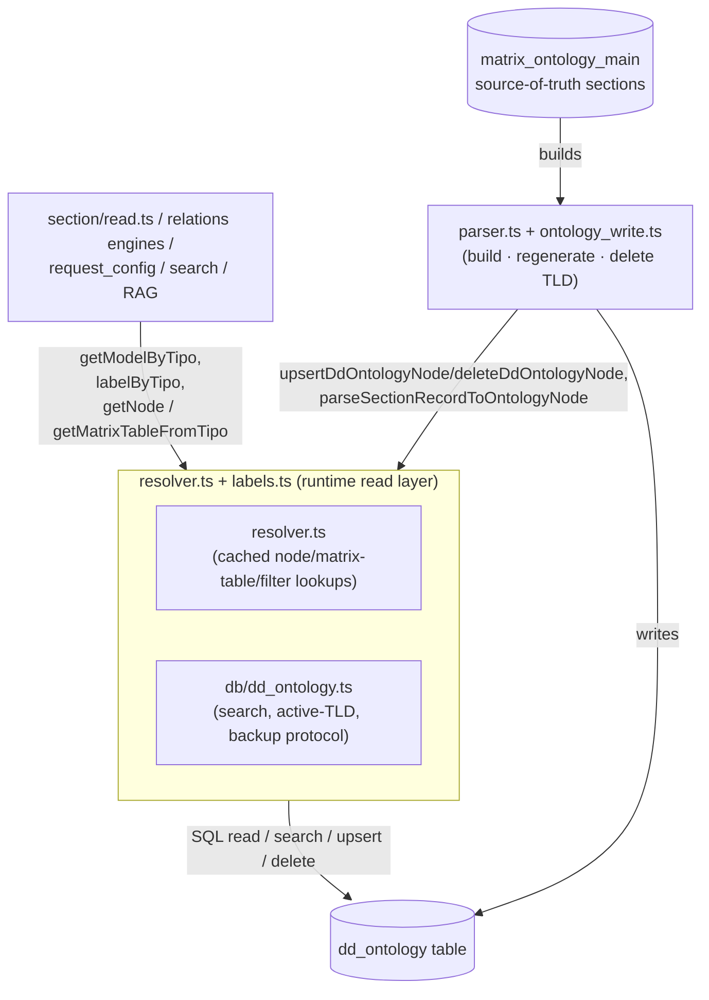

# Ontology engine (runtime read layer)

> The runtime read/resolve layer over the `dd_ontology` table: the cached
> per-node accessor plus the multi-node/TLD helpers every request depends on.

> See also: [Ontology concept](index.md) · [Architecture overview](../architecture_overview.md) · [Sections](../sections/index.md) · [Components](../components/index.md)

This page is the **subsystem reference** for the ontology runtime-read layer —
`src/core/ontology/resolver.ts` plus the read primitives of
`src/core/db/dd_ontology.ts` and the label resolver `src/core/ontology/labels.ts`.
For the conceptual model — *what the ontology is*, that it **is** the active
schema, the TLD + sequence `tipo`, and the per-node JSON shape — read
[Ontology](index.md) first; this document does not repeat that material at
length.

## Role

The engine gives the rest of Dédalo read-only, cached access to the active
ontology. It answers "resolve this `tipo`'s model, label, parent, relations"
before anything else runs, and it does so through plain, request-agnostic
cached functions rather than per-node objects:

| module | role |
| --- | --- |
| `src/core/ontology/resolver.ts` | Cached, read-only access to the fields the engines actually consume: `model`, `parent`, `translatable`, `properties`, `relations`, plus the derived `getMatrixTableFromTipo()` / `getComponentFilterTipo()` / `getRecursiveChildrenTipos()` lookups and the ordered subtree walkers. Keyed by `tipo`, module-level `Map` caches (no per-tipo object instance). |
| `src/core/db/dd_ontology.ts` — `readDdOntologyRow()` | The full 13-column row (adds `tld`, `model_tipo`, `is_model`, `is_main`, `order_number`, `propiedades`) — **uncached**, used by the parser/write pipeline which needs the current on-disk state, not the process-wide cache. |
| `src/core/db/dd_ontology.ts` — the rest | The multi-node/TLD helpers: `searchDdOntology()` (generic column-filter search), `getActiveTlds()`, `deleteTldNodes()`, and the backup-table protocol (`createBackupTable()` / `restoreFromBackupTable()` / `dropBackupTable()`). |
| `src/core/ontology/labels.ts` | `labelByTipo(tipo, lang)` — the common UI-label entry point (app-lang first, then first non-empty), cached per `(lang, tipo)`. |
| `src/core/ontology/alias.ts` | Alias resolution: a node may point at another node for its data (`resolveDataTipo()`, `resolveAliasTargetTipo()`, `getEffectivePropertiesByTipo()`). |

These modules sit **on top of** the raw `dd_ontology` SQL (in
`db/dd_ontology.ts` itself — there is no separate data-access-object layer
below them) and **below** every resolving engine (`section/read.ts`, the
relations engines, `request_config`, search, RAG, …). They are the runtime
*reader* of the ontology.

!!! important "resolver.ts reads; parser.ts + ontology_write.ts write the structure"
    This layer is deliberately **read-mostly**. Structural changes to the
    ontology — compiling `dd_ontology` from the `matrix_ontology_main` source
    sections, regenerating or deleting a whole TLD, parsing a section record
    into a node, importing or exporting a shared ontology as files — are the job
    of the separate write/compile layer described in
    [ontology (build layer)](ontology_write.md).

Every module is available from the first request: `import`s are resolved once
at process start, so there is no autoloader step and no warm-up.

## Responsibilities

- **Per-node metadata resolution** (`resolver.ts`) — given a `tipo`, return its
  model (with legacy/forced/alias model remapping via `getModelByTipo()`),
  parent, relations, translatable flag and `properties` (`getNode()`,
  `getPropertiesByTipo()`); its matrix table (`getMatrixTableFromTipo()`); its
  `component_filter` gate (`getComponentFilterTipo()`); and (`labels.ts`) its
  label with language fallback (`labelByTipo()`). The **full row** (`tld`,
  `model_tipo`, `order_number`, `is_model`, `is_main`, `propiedades`) is read
  uncached via `readDdOntologyRow()` (`db/dd_ontology.ts`) — the parser/write
  pipeline's entry point, not the request-time hot path.
- **Tree navigation.** `compareSiblingOrder()` is the single source of truth for
  sibling order (`order_number` ASC, NULLs last, lexicographic `tipo` tiebreak).
  On top of it: `getChildrenNodes(parentTipo)` (the direct children, in
  canonical order) and `getOrderedSubtree(rootTipo, options)` (a recursive walk
  that by default does **not** descend through nested `section`/`area` nodes;
  pass `crossSections: true` for a full structural walk). Narrower, cached
  lookups sit beside them: `findFirstDescendantTipoByModel()`,
  `relatedTipoByModel()`, `getRecursiveChildrenTipos()`,
  `getComponentFilterTipo()`, and `getSectionIdComponentTipo()`
  (`ontology/section_id_component.ts`). The general depth-first
  section-content walker (every component/grouper of a section, in ontology
  order, with a grouper-model allowlist) is
  `src/core/resolve/section_elements_context.ts`.
- **Lazy load + caching** (`resolver.ts`) — `getNode()` loads a row once per
  `tipo` into a module-level `Map` (`nodeCache`, capped at
  `MAX_CACHE_ENTRIES = 10000`, oldest-10%-dropped on overflow).
  `getMatrixTableFromTipo()` and `getComponentFilterTipo()` keep their own
  per-tipo `Map` caches, **not** size-capped (an asymmetry with `nodeCache`
  worth knowing if a huge multi-tenant ontology ever makes this a concern).
- **Cross-cutting lookups** (`db/dd_ontology.ts`) — `searchDdOntology(filters)`
  is a generic, allowlisted column/operator search: one parameterized primitive
  answers "every tipo of this model", "every tipo of this model_tipo", and so
  on. `listSectionNodes()` (`resolver.ts`) is the cached section census (every
  node of model `section` with its multilingual term) — the discovery backbone
  for name→tipo resolution.
- **TLD-level concerns** (`db/dd_ontology.ts`) — the active/installed TLD list
  (`getActiveTlds()`, module-cached, cleared via the invalidation hub) and the
  destructive TLD-node delete plus backup/restore-table operations used during
  `regenerateRecordsInDdOntology()`.
- **Node-level structural writes** — `upsertDdOntologyNode()` /
  `deleteDdOntologyNode()` / `updateDdOntologyColumns()` (`db/dd_ontology.ts`)
  are called by the write/compile layer and by ontology maintenance tooling,
  not by request-time reads.

## Data model

A node is one row of the `dd_ontology` table. It is exposed as a plain typed
object — `ResolvedNode` (the narrow, cached shape `resolver.ts` returns from
`getNode()`) or `DdOntologyRow` (the full 13-column shape,
`db/dd_ontology.ts`), never a class instance:

| field | type | meaning | on `ResolvedNode`? |
| --- | --- | --- | --- |
| `parent` | `string\|null` | tipo of the parent node (`null` for a root) | yes |
| `term` | *(not on either shape directly — resolved via `labelByTipo()`/`getTermByTipo()`)* | the multilingual label, e.g. `{"lg-eng":"Object"}` | — |
| `model` | `string\|null` | the model name (e.g. `section`, `component_portal`) | yes |
| `model_tipo` | `string\|null` | tipo of the model node, e.g. `dd6` → `section` | `DdOntologyRow` only |
| `order_number` | `int\|null` | position among siblings | `DdOntologyRow` only |
| `relations` | `array\|null` | typed relation objects, e.g. `[{"tipo":"tch7"}]` | yes |
| `tld` | `string` | the Top-Level-Domain namespace (`dd`, `rsc`, `oh`, …) | `DdOntologyRow` only |
| `properties` | `object\|null` | the per-node JSONB descriptor (behaviour/options/layout) | yes |
| `is_model` | `bool` | true when the node is a *model* node, not a descriptor | `DdOntologyRow` only |
| `is_translatable` | `bool` (as `translatable`) | true when the node's data is translatable | yes |
| `is_main` | `bool` | true for a TLD root node (`tipo` = `tld` + `0`) | `DdOntologyRow` only |
| `propiedades` | `string\|null` | **deprecated** v5/v6 JSON-string properties, kept for compatibility | `DdOntologyRow` only |

!!! note "`properties` vs `propiedades`"
    v7 uses the JSONB `properties` object. The legacy `propiedades` string
    column is read only via `readDdOntologyRow().propiedades` for v5/v6
    compatibility — do not use it in new code (matches the v7 *"only
    `properties`"* convention).

### Caches (module-level, request-agnostic)

The ontology caches are **process-wide** `Map`s that live for the whole
long-lived Bun process and are invalidated **by content**, not by request
boundary:

- `nodeCache` (`resolver.ts`) — capped at `MAX_CACHE_ENTRIES = 10000`, keyed by
  `tipo`.
- `matrixTableCache`, `componentFilterTipoCache` (`resolver.ts`) — per-tipo,
  uncapped.
- `descendantByModelCache`, `relatedTipoByModelCache`, `sectionCensusCache`
  (`resolver.ts`) — the derived lookups, all hub-registered.
- `activeTldsCache` (`db/dd_ontology.ts`) — a single cached array.
- `labelCache` (`labels.ts`) — keyed by `` `${lang} ${tipo}` ``, uncapped.

All of these except `labelCache` register a clear function with
`clearOntologyDerivedCaches()` (`src/core/ontology/cache_invalidation.ts`), the
single chokepoint every `dd_ontology` write calls. `labelCache` currently keeps
its own `clearLabelCache()` but does **not** register with that hub — worth
knowing if you rename a node's term and expect every cached label to update
immediately in the same running process.

!!! note "Why the invalidation hub matters"
    The caches deliberately outlive a request, so an ontology edit must reach
    them or the process keeps serving pre-change data. Registering with the hub
    is what makes that automatic — see
    [How changes apply live](authoring.md#how-changes-apply-live).

## Instantiation & lifecycle

There is **no factory / singleton object** — `getNode()` and its siblings are
plain exported `async function`s that read-through a module-level cache:

```ts
import { getNode, getModelByTipo } from 'src/core/ontology/resolver.ts';
import { labelByTipo } from 'src/core/ontology/labels.ts';

// resolve a node's model and label
const model = await getModelByTipo('rsc197');       // 'section'
const label = await labelByTipo('rsc197', 'lg-eng'); // 'People' (with fallback)

// getNode() itself (cached; returns null when the tipo does not exist)
const node = await getNode('rsc197');
node?.model; // 'section' (already resolved through getNode, unlike getModelByTipo's
             // additional forced/alias/replacement layer — see below)
```

Note the split: `getNode(tipo).model` is the **raw stored** model column;
`getModelByTipo(tipo)` additionally applies the forced-tipo overrides
(`FORCED_MODELS`), the component registry's `alias`, and the residual
structural replacement map. Prefer `getModelByTipo()` whenever you need the
*runtime* model, not the raw column.

There is no tipo-validity gate inside the resolver itself — a malformed tipo
simply misses the cache and the row lookup returns nothing (`getNode()`
resolves to `null`); callers that must reject a malformed tipo up front use
`safeTld()`/`getTldFromTipo()` (`ontology/tld.ts`) directly.

## Public API

Grouped by concern, naming the real export and its module.

### Per-tipo metadata resolution

| function | module | purpose |
| --- | --- | --- |
| `getNode(tipo)` | `resolver.ts` | Cached row lookup — returns `ResolvedNode \| null`. Carries `parent`, `model`, `relations`, `translatable`, `properties`. |
| `readDdOntologyRow(tipo)` | `db/dd_ontology.ts` | The full 13-column row, **uncached**; used by the parser/write pipeline. Adds `tld`, `model_tipo`, `order_number`, `is_model`, `is_main`, `propiedades`. |
| `getModelByTipo(tipo)` | `resolver.ts` | The resolved runtime model name, applying forced/temporal maps, the component registry's alias, then the structural replacement map. |
| `getTranslatableByTipo(tipo)` | `resolver.ts` | Cached boolean. |
| `getPropertiesByTipo(tipo)` | `resolver.ts` | The node's raw `properties` JSON through the cached loader — so a properties read right after an ontology write is hub-coherent instead of racing a stale cache. |
| `labelByTipo(tipo, lang)` | `labels.ts` | The label in `lang`, falling back to the first non-empty term. The common UI entry point. |
| `getTermByTipo(tipo, lang)` | `resolver.ts` | A second, narrower label lookup used by the RAG chunker: `lang` → `lg-spa` → first non-empty. A **different** fallback chain from `labelByTipo()`'s — check which one a new caller actually needs. |
| `getMatrixTableFromTipo(sectionTipo)` | `resolver.ts` | The matrix table a section's records live in. Cached. |
| `getColumnNameByModel(model)` | `resolver.ts` | model → matrix jsonb column. |
| `resolveDataTipo(tipo)` · `resolveAliasTargetTipo(tipo)` · `getEffectivePropertiesByTipo(tipo)` | `ontology/alias.ts` | Alias resolution: follow a node's pointer to the node that actually owns its data / properties. |
| `getTldFromTipo(tipo)` · `safeTld(tld)` | `ontology/tld.ts` | Derive and validate a TLD from a tipo string, without touching the database. |

### Tree navigation

| function | module | purpose |
| --- | --- | --- |
| `compareSiblingOrder(a, b)` | `resolver.ts` | **The** canonical sibling-order policy: `order_number` ASC, NULLs last, lexicographic `tipo` tiebreak. Every ordered walk sorts through this one comparator. |
| `getChildrenNodes(parentTipo)` | `resolver.ts` | The direct children of one node, in canonical sibling order. |
| `getOrderedSubtree(rootTipo, options)` | `resolver.ts` | Recursive ordered walk. By default it does not descend through nested `section`/`area` nodes (the pruned node itself is still returned); `crossSections: true` gives the full structural walk. Not cached — full-tree consumers cache their own derived structures. |
| `getRecursiveChildrenTipos(sectionTipo)` | `resolver.ts` | Descends by `parent`, stopping before `section`/`area*` models — RAG's embeddable-component enumeration. |
| `findFirstDescendantTipoByModel(rootTipo, model, options)` | `resolver.ts` | The first descendant of a given model, cached per `(root, model, fallback)`. |
| `getComponentFilterTipo(sectionTipo)` | `resolver.ts` | The section's `component_filter` gate, same descent shape, stopping at the first match. |
| `getSectionIdComponentTipo(sectionTipo)` | `ontology/section_id_component.ts` | Same shape again, stopping at `component_section_id`. |
| `relatedTipoByModel(tipo, model)` | `resolver.ts` | Walk a node's `relations` to the first related node of a given model (e.g. the transcription text ↔ AV player pairing). Cached. |
| `listSectionNodes()` | `resolver.ts` | The section census: every node of model `section` with its raw multilingual term. Cached, hub-cleared. Carries **no** permission semantics — callers apply their own ACL. |

### Structural writes

| function | module | purpose |
| --- | --- | --- |
| `upsertDdOntologyNode(node)` | `db/dd_ontology.ts` | Whole-row `INSERT … ON CONFLICT (tipo) DO UPDATE` — an omitted/cleared field overwrites the existing column with its default, so a re-parse never leaves stale data. Callers build a full `DdOntologyNode` object literal and upsert it whole; there is no mutable node object to set fields on. |
| `updateDdOntologyColumns(tipo, values)` | `db/dd_ontology.ts` | Partial `SET`, with an INSERT fallback on 0 matched rows (the `syncOrderToDdOntology()` sibling-reorder path relies on that fallback). |
| `deleteDdOntologyNode(tipo)` | `db/dd_ontology.ts` | Delete one row by tipo. |

### Multi-node & TLD helpers

| function | module | purpose |
| --- | --- | --- |
| `searchDdOntology(filters, ...)` | `db/dd_ontology.ts` | A generic allowlisted column/operator search: "every tipo of this model", "every tipo of this model_tipo", and so on, as one parameterized primitive. |
| `getActiveTlds()` | `db/dd_ontology.ts` | The installed-TLD list, module-cached. |
| `deleteTldNodes(tld)` | `db/dd_ontology.ts` | Destructive: delete every `dd_ontology` row of a TLD (TLD-validated, refuses on a mismatch). |
| `createBackupTable(tlds)` / `dropBackupTable()` / `restoreFromBackupTable(tlds)` | `db/dd_ontology.ts` | The `dd_ontology_bk` snapshot/restore protocol `regenerateRecordsInDdOntology()` uses as its rollback. |

## How it fits with the rest of Dédalo



- **Above it** sit the resolving engines. `section/read.ts` calls
  `getModelByTipo()` to resolve a section's runtime shape;
  `resolve/structure_context.ts` calls `getNode()` while stamping
  `parent_grouper`/`legacy_model`; every component descriptor resolves its
  label and `properties` through `labelByTipo()`/`getNode()`. See
  [Sections](../sections/index.md) and [Components](../components/index.md).
- **Below it** sits `db/dd_ontology.ts` itself — there is no separate
  data-access-object layer beneath the engine; the same module both serves the
  resolver's raw-row reads and owns every SQL statement against `dd_ontology`.
- **Beside it** sits the **write/compile layer**
  ([ontology (build layer)](ontology_write.md), `parser.ts` +
  `ontology_write.ts`), the *structural-write* counterpart. It compiles
  `dd_ontology` from the `matrix_ontology_main` source sections and calls
  **into** this layer (`upsertDdOntologyNode()`/`deleteDdOntologyNode()`,
  `getModelByTipo()`, `getMatrixTableFromTipo()`) to materialise individual
  nodes. For the conceptual picture of why the ontology *is* the active schema,
  see
  [Architecture overview](../architecture_overview.md#the-ontology-is-the-active-schema).
- The HTTP surface that exposes ontology operations is the tool dispatch in
  `tools/tool_ontology/server/tool_ontology.ts` and
  `tools/tool_ontology_parser/server/tool_ontology_parser.ts` (developer-only).

## Examples

### Resolve a section's data-bearing component children

```ts
import { getRecursiveChildrenTipos } from 'src/core/ontology/resolver.ts';

const peopleTipo = 'rsc197';

// every recursive descendant, stopping before nested sections/areas
const children = await getRecursiveChildrenTipos(peopleTipo);
```

### Walk one node's direct children in canonical order

```ts
import { getChildrenNodes } from 'src/core/ontology/resolver.ts';

// order_number ASC, NULLs last, lexicographic tipo tiebreak
const children = await getChildrenNodes('rsc197');
for (const child of children) {
	console.log(child.tipo, child.model, child.orderNumber);
}
```

### Check whether a TLD is installed

```ts
import { getActiveTlds } from 'src/core/db/dd_ontology.ts';
import { getTldFromTipo } from 'src/core/ontology/tld.ts';

const activeTlds = await getActiveTlds();
if (!activeTlds.includes(getTldFromTipo('oh1') ?? '')) {
	// the 'oh' namespace has no dd_ontology rows — not installed
}
```

### Read a node's properties

```ts
import { getNode } from 'src/core/ontology/resolver.ts';

const node = await getNode('rsc91');

// getNode() returns the cached object directly — no deep clone. Do not mutate
// the returned `properties`; treat it as read-only.
if (node?.properties && typeof node.properties === 'object') {
	const source = (node.properties as { source?: unknown }).source;
}
```

!!! note "Read, don't mutate, in application code"
    Treat `resolver.ts`'s return values as read-only outside ontology
    maintenance tooling. The mutating primitives (`upsertDdOntologyNode()`,
    `updateDdOntologyColumns()`, `deleteDdOntologyNode()`) exist for the
    write/compile layer; normal request code should only call the resolver
    functions above.

## Related

- [Ontology concept](index.md) — what the ontology is, TLDs, the node JSON shape.
- [Architecture overview](../architecture_overview.md) — the ontology as the
  active schema and the abstraction layers.
- [Sections / `section`](../sections/section.md) — the biggest consumer of the
  engine's children/model resolvers.
- [Components](../components/index.md) — how a component context resolves its
  model, label and `properties` through `resolver.ts`.
- [request_config](../request_config.md) — how `properties.request_config` flows
  from the node into the rendered context.
- [Locator](../locator.md) — the typed pointers stored in node `relations` and in
  record data.
