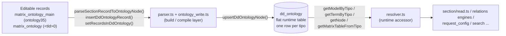

# ontology (build layer)

> The ontology **write/compile** layer: it manages the **editable** ontology stored in the matrix tables and compiles it into the flat runtime `dd_ontology` table that drives every request.

> See also: [Ontology concept](index.md) · [request_config presets](request_config_presets.md) · [Sections](../sections/index.md) · [Components](../components/index.md) · [Architecture overview](../architecture_overview.md)

This page is the **module-level reference** for the ontology write/compile
layer. For the conceptual model — *what the ontology is*, TLDs, the model/node
correspondence, shared vs local ontologies — read [Ontology](index.md) first;
this document does not repeat that material.

!!! warning "This is the *build* layer, not the runtime accessor"
    The module application code uses at request time to read a node (model,
    label, parent, translatable, relations) is **`resolver.ts`**
    (`src/core/ontology/resolver.ts`), *not* the modules on this page. The
    modules described here manage the editable definitions and **compile** them
    into the `dd_ontology` table that `resolver.ts` then reads. Regular code
    should treat ontology nodes as read-only and go through `resolver.ts`;
    structural changes go through the write drivers below. See
    [How it fits with the rest of Dédalo](#how-it-fits-with-the-rest-of-dedalo).

## Role

The build layer is **stateless**: no instances, no per-request objects — a set
of plain exported functions, split by concern across separate modules rather
than concentrated in one god-object, matching the horizontal-engine
architecture used throughout the engine.

| concern | module |
| --- | --- |
| Parse ONE editable record into a node | `src/core/ontology/parser.ts` |
| Orchestrate writes (single / bulk / regenerate / provisioning) | `src/core/ontology/ontology_write.ts` |
| The `dd_ontology` table's own read/write primitives | `src/core/db/dd_ontology.ts` |
| Cascade-delete a whole TLD | `src/core/ontology/ontology_delete.ts` (`deleteOntologyMain`) — trigger-based: it fires when a `hierarchy1`/`ontology35` registry record is deleted, not as a standalone call |
| Import / export a whole ontology as files | `src/core/ontology/data_io.ts` + `src/core/ontology/data_io_import.ts` |
| Version update (fetch a newer shared ontology and apply it) | `src/core/ontology/ontology_update.ts` |

Together they operate on a **two-tier representation**:

1. **The editable representation** — the ontology as ordinary Dédalo records,
   so curators can edit it in the back office like any other data:
   - `matrix_ontology_main` (section `ontology35`, `ONTOLOGY_MAIN_SECTION` in
     `src/core/ontology/ontology_tipos.ts`) — one record per **TLD** (the
     "ontology main": its name, TLD code, `target_section_tipo`, main language,
     typology, order, active flags).
   - `matrix_ontology` per-TLD section (`<tld>0`, e.g. `dd0`, `oh0`,
     `ontologytype3`) — one record per **node** (its tld, parent, model,
     order, translatable flag, relations, term, properties).

2. **The runtime representation** — the flat `dd_ontology` table, one row per
   `tipo`, holding the parsed/denormalized node that `resolver.ts` reads on
   every request. `parser.ts` + `ontology_write.ts` are the **compiler** that
   walks the editable records and upserts `dd_ontology` rows
   (`parseSectionRecordToOntologyNode()` → `upsertDdOntologyNode()`).



## Responsibilities

- **Compile editable records → `dd_ontology`.** Parse one section record into a
  `DdOntologyNode` (`parseSectionRecordToOntologyNode()`) and upsert it
  (`insertDdOntologyRecord()`); do it in bulk for a section
  (`setRecordsInDdOntology()`) or reconcile whole TLDs
  (`ensureOntology()` — incremental — or `rebuildOntology()`). Bulk "list mode" is a **full-section
  scan** — every record of the section is recompiled, not a filtered subset.
- **Resolve node fields from the editable side.** Read each definition
  component (tld, parent, model, order, translatable, relations, term,
  properties) off the matrix record, applying the **local-overwrite**
  resolution (`getOverwriteLocator()`) so project-specific overrides win.
- **TLD ↔ section-tipo mapping.** `mapTldToTargetSectionTipo()` (`dd` → `dd0`,
  throws on an unsafe TLD) in `src/core/ontology/tld.ts`; build a node's `tipo`
  and term-id from a locator (`getTermIdFromLocator()`, `parser.ts`). The
  inverse direction needs no dedicated function: `getTldFromTipo()` (a general
  tipo-prefix extractor) already gives every caller the TLD it holds.
- **Ontology-main (TLD) metadata.** Look up the main record by TLD
  (`getOntologyMainFromTld()`); read a TLD's TLD string, typology, and full
  name/term data (`getMainTld()`, `getMainTypologyId()`, `getMainNameData()`,
  all in `ontology_write.ts`). The active-elements tree-boot projection lives in
  `src/core/area/tree.ts` (the area_thesaurus/area_ontology boot payload), not
  in the ontology write module — it is a *read*, so it sits with the resolver
  side of the split. A TLD's root-node display order is read by a private
  `getMainOrder()` helper local to `src/core/ts_object/search.ts`, where the
  thesaurus search needs it.
- **Lifecycle of a whole ontology (TLD).** Create the main section + parent
  grouper + ontology-section node (`addMainSection()`, `createParentGrouper()`,
  `createDdOntologyRootNode()`); cascade-delete a TLD (`deleteOntologyMain()`,
  `src/core/ontology/ontology_delete.ts`).
- **Thesaurus/tree roots.** The children that seed a tree view are folded into
  the tree-boot projection in `src/core/area/tree.ts` (`root_terms` from
  `hierarchy45`/`hierarchy59`). The write-side sibling reorder is
  `syncOrderToDdOntology()`, consumed by the tree's `save_order` action — see
  [`ts_object`](ts_object.md) for that surface.
- **Cache invalidation is structural, not a manual step.** Every `dd_ontology`
  write ends by calling `clearOntologyDerivedCaches()`
  (`src/core/ontology/cache_invalidation.ts`), the single chokepoint every
  cache-owning module registers with. There is no reset hook to remember.

## Key concepts / data model

| concept | where | meaning |
| --- | --- | --- |
| **ontology main** | `matrix_ontology_main` = `ontology35` (`ONTOLOGY_MAIN_SECTION`) | One record per TLD. Holds the TLD code (`hierarchy6`), `target_section_tipo`, name/term, main lang, typology, order and active flags. |
| **target section tipo** | derived: `<tld>0` | The section under which a TLD's nodes live. `dd` → `dd0`, `oh` → `oh0`. The mapping is purely string concatenation (`mapTldToTargetSectionTipo()`, `src/core/ontology/tld.ts`). |
| **node record** | `matrix_ontology` under `<tld>0` | One editable record per node, with definition components: tld (`ontology7`), parent (`ontology15`), model (`ontology6`), order (`ontology41`), translatable (`ontology8`), relations (`ontology10`), term (`ontology5`), properties (`ontology18` + css `ontology16` + rqo `ontology17` + v5 `ontology19`). All named in `src/core/ontology/ontology_tipos.ts`. |
| **dd_ontology row** | `dd_ontology` table | The compiled, flat runtime node keyed by `tipo`. Read by `resolver.ts`, written by `src/core/db/dd_ontology.ts`. |
| **tipo** | `<tld><section_id>` | A node's runtime id, built from its TLD + the editable record's `section_id` (`` `${tld}${sectionId}` ``). |
| **overwrite (local ontology)** | section `localontology0` | A local record that points at a shared node and overrides selected fields. `getOverwriteLocator()` (`parser.ts`) finds it; the parser favours the overwrite locator for most fields. **`is_model` is never overwritten** (always read from the canonical node); `model`/`model_tipo` themselves ARE overwrite-aware. |

!!! note "What `parseSectionRecordToOntologyNode()` resolves"
    For each node it reads (overwrite-favoured where applicable): **TLD**
    (mandatory — returns `null` if empty), **parent** (term-id of the parent
    locator; `null` for the `dd1`/`dd2` roots), **is_model** (canonical-only),
    **model** + **model_tipo** (overwrite-aware; `model` = strict `lg-spa` term
    of the model node, no lang fallback), **order_number** (canonical-only,
    integer-cast, empty → `null`), **is_translatable** (default `true` when
    missing), **is_main** (`tipo === <tld>0`), **relations** (each resolved to
    `{tipo}`), **properties** (merging css and source/`request_config`
    sub-components), legacy **propiedades** (v5, stored as pretty-printed JSON
    text so legacy readers see byte-identical output), and the **term**
    (`{lg-*: value}`).

## Instantiation & lifecycle

There is **nothing to instantiate** — every function is a plain exported
`async function`, called directly:

```ts
import { setRecordsInDdOntology, insertDdOntologyRecord } from
  'src/core/ontology/ontology_write.ts';

// Compile every editable ontology record of a section into dd_ontology
const response = await setRecordsInDdOntology({ sectionTipo: 'oh0' }); // list mode: full-section scan
// response = { result, msg, errors, total, processed_count }

// Compile a single node and UPSERT it into dd_ontology; returns its tipo
const tipo = await insertDdOntologyRecord('oh0', 12); // e.g. 'oh12' (null if TLD empty)
```

No cache-reset call is needed afterward — `upsertDdOntologyNode()` (the
underlying write primitive in `src/core/db/dd_ontology.ts`) already fans out
`clearOntologyDerivedCaches()` on every write.

## Public API

Grouped by concern, naming the real export and its module. Return shapes are
taken from the TypeScript signatures.

### Compile editable records → dd_ontology

| function | module | purpose |
| --- | --- | --- |
| `parseSectionRecordToOntologyNode(sectionTipo, sectionId)` | `ontology/parser.ts` | Build a `DdOntologyNode` from one editable matrix record: resolve tld/parent/model/order/translatable/relations/term/properties (overwrite-favoured). Returns the node, or `null` if the mandatory TLD value is empty. |
| `insertDdOntologyRecord(sectionTipo, sectionId)` | `ontology/ontology_write.ts` | Parse one record (above) then `upsertDdOntologyNode()` it into `dd_ontology`. Returns the resulting `tipo`, or `null` on failure. |
| `setRecordsInDdOntology(target)` | `ontology/ontology_write.ts` | Bulk compile: edit mode (`sectionId` given) processes one record; list mode processes **every** record of the section. Main-section records take the TLD path (delete nodes when the TLD is inactive, else (re)create the `<tld>0` node via `createDdOntologyRootNode()`). Returns `{result, msg, errors, total, processed_count}`. |
| `syncOrderToDdOntology(...)` | `ontology/ontology_write.ts` | Write the sibling display order back into `dd_ontology` after a tree reorder. Called by the `save_order` tree action (`src/core/ts_object/ts_api.ts`). |

### Reconcile / rebuild a TLD — the single authority

`dd_ontology` is a projection of `matrix_ontology`; keeping the two consistent lives in **one**
module, `src/core/ontology/ontology_state.ts`. Nothing else wipe-and-rebuilds a TLD (guarded by
`test/unit/ontology_single_writer_tripwire.test.ts`). This replaced the retired
`regenerateRecordsInDdOntology`, whose only rollback was a leftover `dd_ontology_bk` table.

| function | module | purpose |
| --- | --- | --- |
| `inspectOntology(tld)` | `ontology/ontology_state.ts` | **Pure read.** The drift of one TLD: nodes `missing` / `stale` / `orphaned` vs the parsed source, plus `mainNodeOk` and `inSync`. Compared by meaning (jsonb key order normalized, empty ≡ null, `propiedades` parsed) so formatting is not false drift. |
| `ensureOntology(tld, userId?)` | `ontology/ontology_state.ts` | **Idempotent incremental reconcile.** Upsert the missing/stale nodes, delete the orphaned ones, bootstrap the main node if absent — apply only the delta, never wipe. A TLD in sync is a no-op (`applied: []`). |
| `rebuildOntology(tld, userId?)` | `ontology/ontology_state.ts` | **Transactional wipe-and-rebuild** for structural corruption the reconcile cannot fix. The delete + reinsert run in one `withTransaction`; a failure rolls back with no empty window and no backup table. |

### Node-field resolution helpers

| function | module | purpose |
| --- | --- | --- |
| `getTermIdFromLocator(locator)` | `ontology/parser.ts` | Build a node's term-id (`<tld><section_id>`, e.g. `dd55`) from a locator: fast path from the TLD string, slow fallback reading the TLD component off the pointed record. Returns `null` if unresolvable. |
| `getOverwriteLocator(sectionTipo, sectionId)` | `ontology/parser.ts` | Find the local-ontology override (`localontology0`) pointing at this node, or `null`. Returns `null` for model nodes and for local-ontology records themselves. |
| `root_terms` projection | `area/tree.ts` | The children that seed a thesaurus tree view (`hierarchy45`, or `hierarchy59` in the model view) — folded into the tree-area boot payload rather than a standalone helper. |

### TLD ↔ section-tipo mapping

| function | module | purpose |
| --- | --- | --- |
| `mapTldToTargetSectionTipo(tld)` | `ontology/tld.ts` | `<tld>` → `<tld>0` (e.g. `dd` → `dd0`). Throws if the TLD is unsafe. |
| `getTldFromTipo(tipo)` | `ontology/tld.ts` | The inverse direction: extract the TLD prefix from any `tipo`. |
| `safeTld(tld)` | `ontology/tld.ts` | Validate a TLD before it reaches a query or a table name. |

### Ontology-main (per-TLD) lookups

| function | module | purpose |
| --- | --- | --- |
| `getOntologyMainFromTld(tld)` | `ontology/ontology_write.ts` | Find the `matrix_ontology_main` row (`{section_id}`) for a TLD, or `null`. The TLD is sanitised first. |
| `getMainTld(sectionId, sectionTipo)` | `ontology/ontology_write.ts` | The lowercased TLD of a main record (`hierarchy6`), or `null`. |
| `getMainTypologyId(tld)` | `ontology/ontology_write.ts` | The TLD's typology id (defaults to `15`, "others"), or `null` if no main record. |
| `getMainNameData(tld)` | `ontology/ontology_write.ts` | The TLD's full name/term data (all language translations), or `null`. |
| tree-boot active elements | `area/tree.ts` | The active-hierarchies/ontologies projection consumed by the thesaurus/ontology tree areas. |

### Ontology lifecycle (create / reconcile / delete a TLD)

| function | module | purpose |
| --- | --- | --- |
| `addMainSection(fileItem, userId?)` | `ontology/ontology_write.ts` | Idempotently create/update the `matrix_ontology_main` record for a TLD from a parsed file item (`{tld, section_tipo?, typology_id?, name_data?}`). Reuses the existing row (matched by TLD) or creates a new `ontology35` record. Returns the main `section_id`. |
| `createDdOntologyRootNode(fileItem, userId?)` | `ontology/ontology_write.ts` | Create/UPSERT the `dd_ontology` node that *represents the ontology section itself* (`<tld>0`) so the TLD appears in the tree/menu. Returns the tipo. |
| `createParentGrouper(parentGroup, tld, typologyId, userId?)` | `ontology/ontology_write.ts` | Ensure the grouper node that organizes a TLD under its typology in the menu exists (creating the mandatory main grouper in matrix on the fly during a partial bootstrap). Returns the grouper tipo. |
| `deleteOntologyMain(sectionTipo, sectionId, deleteRecord)` | `ontology/ontology_delete.ts` | Cascade-delete a whole TLD, but **trigger-based**: it fires when a `hierarchy1`/`ontology35` registry record is deleted. Purges every `dd_ontology` node of the TLD (parameterized, refusing on an empty/unsafe TLD), the registry record itself, then every node record of the `<tld>0` section (through the normal per-record delete pipeline, Time Machine included). |

### Import, export and version update

| function | module | purpose |
| --- | --- | --- |
| `getActiveOntologies(...)` | `ontology/data_io.ts` | The active-ontologies census: every `matrix_ontology_main` record with its UI metadata. Backs the `get_ontologies` action of `tool_ontology_parser`. |
| `exportToFile(tld)` | `ontology/data_io.ts` | Export one TLD's ontology to a file (forks its own `psql \copy … TO PROGRAM 'gzip'`). Driven by the `export_ontologies` pipeline (`tools/tool_ontology_parser/server/`), which also refreshes the ontology info, the private lists and the LLM map. The per-TLD exports are independent, so the pipeline runs them **bounded-parallel** (≤ `EXPORT_CONCURRENCY`) rather than one at a time. |
| `exportPrivateListsToFile()` · `exportLlmMap()` · `exportOntologyInfo()` | `ontology/data_io.ts` | The three companion exports of the same pipeline. |
| `importOntologyFile(...)` · `importPrivateListsFile(...)` | `ontology/data_io_import.ts` | Import a downloaded ontology / private-lists file. Enforces hard caps (max file size, max decompressed size, decompression ratio, manifest file count) and a confined destination path. |
| `checkRemoteServer(server)` · `downloadRemoteOntologyFile(...)` | `ontology/data_io_import.ts` | Preflight and fetch an ontology file from a shared-ontology master. TLS verification is asserted on. |
| `updateOntology(options)` | `ontology/ontology_update.ts` | The update orchestrator: download per file → per-TLD import → `dd_ontology` reindex per TLD → schema snapshot → cache purge. Everything is staged and validated **before** the first destructive statement; a per-table snapshot is taken before import and auto-restored on failure; each file's load is one transaction, so the update is all-or-nothing. |
| `buildRecoveryVersionFile(...)` · `restoreDdOntologyRecoveryFromFile(...)` | `ontology/recovery_file.ts` | Build (and restore) the compressed `dd_ontology` recovery slice under `install/db/`. Restoring recreates a `dd_ontology_recovery` table; it deliberately does **not** overwrite `dd_ontology` — the merge is an explicit operator step. |

### Cache invalidation

| function | module | purpose |
| --- | --- | --- |
| `clearOntologyDerivedCaches()` | `ontology/cache_invalidation.ts` | The single invalidation hub: called by every `dd_ontology` write, it fans out to every registered cache-owning module. |
| (cache size cap) | `ontology/resolver.ts` | `MAX_CACHE_ENTRIES = 10000` on the node cache, oldest entries dropped first, so a long-lived process cannot grow the cache without bound. |

## How it fits with the rest of Dédalo

The write/compile layer described here is the write half of a clear split with
the read half, `resolver.ts`:

- **`src/core/ontology/resolver.ts`** is the runtime, read-only,
  request-agnostic cached registry over `dd_ontology`. It is what
  `section/read.ts`, the relations engines, `request_config`, `search`, etc.
  call to learn a node's model, translatable flag, parent, relations and
  matrix table — e.g. `getModelByTipo()`, `getTranslatableByTipo()`,
  `getMatrixTableFromTipo()`, `getComponentFilterTipo()`,
  `getRecursiveChildrenTipos()`, `getTermByTipo()`. The write layer *produces*
  the rows those functions read (via `upsertDdOntologyNode()`), and itself
  calls `getModelByTipo()` / `getMatrixTableFromTipo()` while parsing.
- **`src/core/db/dd_ontology.ts`** provides the low-level `dd_ontology`
  operations the write layer leans on: `getActiveTlds()` / `deleteTldNodes()`,
  plus the backup-table protocol (`createBackupTable()` /
  `restoreFromBackupTable()` / `dropBackupTable()`) that regenerate uses as its
  rollback.
- **Import/export** moves *shared* ontologies between installations as files
  (`data_io.ts` / `data_io_import.ts`), driven by the developer-only
  `tool_ontology_parser` (actions `get_ontologies`, `inspect_ontologies`,
  `reconcile_ontologies`, `regenerate_ontologies`, `export_ontologies`).
- **Sections & components** — the editable ontology is just ordinary records,
  so it is created/read/deleted through the same section/matrix machinery as
  any other data (`src/core/section/record/create_record.ts`, the section read
  engine, the delete pipeline).
- **Thesaurus / tree** — the tree-boot `root_terms` projection
  (`src/core/area/tree.ts`) and `syncOrderToDdOntology()` feed the
  thesaurus/ontology tree builders (see [`ts_object`](ts_object.md)).

## Examples

### Resolve a TLD's main metadata

```ts
import { getOntologyMainFromTld, getMainTypologyId, getMainNameData } from
  'src/core/ontology/ontology_write.ts';

const tld = 'oh';

const main = await getOntologyMainFromTld(tld); // {section_id} | null
if (main !== null) {
	const typologyId = await getMainTypologyId(tld); // e.g. 5
	const nameData = await getMainNameData(tld);     // [{lang, value}, ...] | null
}
```

### Build a node's tipo / term-id from a locator

```ts
import { getTermIdFromLocator } from 'src/core/ontology/parser.ts';

const tipo = await getTermIdFromLocator({ section_tipo: 'dd0', section_id: 55 });
// 'dd55' (null if unresolvable)
```

### Tear down a TLD (trigger-based, not a standalone call)

```ts
import { deleteOntologyMain } from 'src/core/ontology/ontology_delete.ts';

// fires as part of deleting the TLD's hierarchy1/ontology35 registry record
const outcome = await deleteOntologyMain('ontology35', mainSectionId, deleteRecord);
// outcome.result === true on success; deletedNodes/deletedRecords counted.
```

!!! warning "Compilation is a heavy, write-side operation"
    `setRecordsInDdOntology()` / `rebuildOntology()` rebuild
    `dd_ontology` rows by re-reading every definition field of every matched
    record. They are part of the ontology *update/rebuild* flow, not something
    to call in a normal request. Normal reads go through `resolver.ts`.

## Related

- [Ontology concept](index.md) — what the ontology is, TLDs, model/node, shared
  vs local ontologies.
- [request_config presets](request_config_presets.md) — the `request_config`
  carried in node `properties`.
- [Sections](../sections/index.md) · [`section` reference](../sections/section.md)
  — the records that store the editable ontology.
- [Components](../components/index.md) · [Base classes](../components/base_classes.md)
  — the component descriptors read while parsing a node.
- [Architecture overview](../architecture_overview.md) — "the ontology is the
  active schema", the abstraction layers and the request lifecycle.
- [Locator](../locator.md) — the pointer type used throughout node resolution.
