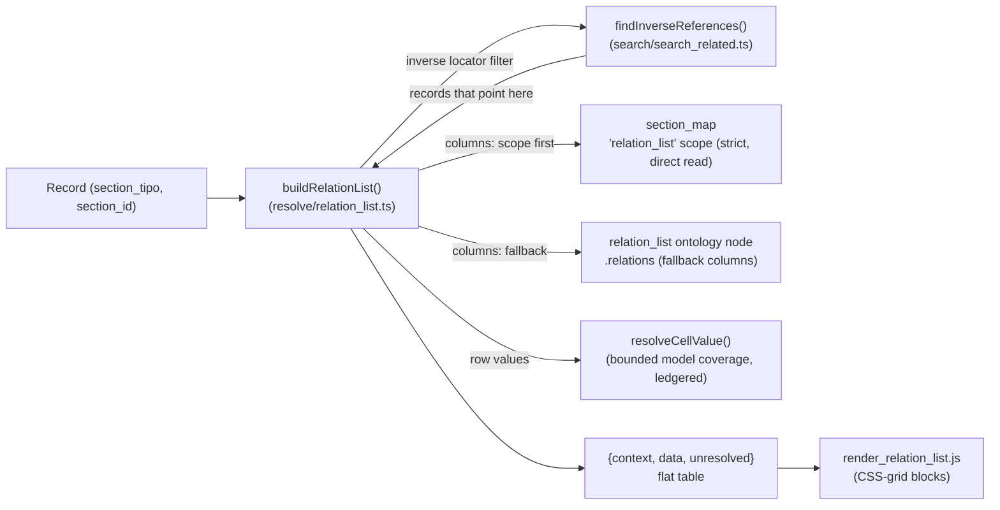

# relation_list

> The server logic that answers the question *"who points at this record?"* — it resolves the **inverse references** of a `(section_tipo, section_id)` and renders them as a grouped grid of related records.

> See also: [Components](../components/index.md) · [component_portal](../components/component_portal.md) · [component_dataframe](../components/component_dataframe.md) · [Sections](../sections/index.md) · [Locator](../locator.md) · [SQO](../sqo.md)

## Role

`relation_list` is neither a component nor a section: it is an ontology model in
its own right (`model = 'relation_list'`). Its behaviour is a plain function,
`buildRelationList()` in `src/core/resolve/relation_list.ts`, dispatched by the
`get_relation_list` action in `src/core/api/dispatch.ts`. It sits on the
**inverse** side of the relational graph that
[`component_portal`](../components/component_portal.md) and the other related
components build:

- A *related component* (portal, select, check_box, …) stores **forward**
  locators: "this record points at those records". Their selectable options
  are the *datalist* job — see
  [Components — related components](../components/index.md#related-components).
- `relation_list` answers the **reverse** question: "which records *out
  there* point back at this one?". It runs the inverse-locator search engine
  (`findInverseReferences()`, `src/core/search/search_related.ts`) and shapes the
  answer as a flat-table `{context, data}` grid, one block per related
  `section_tipo`.

A `relation_list` node is a **child of a section** in the ontology, and its
`relations` array can name the fallback column tipos. The preferred column
source is the [`section_map`](section_map.md) `relation_list` scope.

`buildRelationList()` is a plain function taking every input explicitly: there
is no instance identity, no chainable setters, and no cache to purge.

## Responsibilities

- **Resolve inverse references** — given `(section_tipo, section_id)`,
  `findInverseReferences()` (`search/search_related.ts`) returns every record
  that links back. `buildRelationList()` calls it with the host locator as
  the filter and `sectionTipos: 'all'`.
- **Build the relation-list grid** — group those inverse records by their
  `section_tipo`, resolve the column set for each (`getRelationListColumns()`:
  the `section_map` `relation_list` scope, falling back to the `relation_list`
  ontology node's `relations`), and emit a `{context, data}` flat table.
- **Resolve cell values** — `resolveCellValue()` covers a wide, explicitly
  bounded model set (see
  [Value scope](#value-scope-what-resolvecellvalue-covers) below).
- **Serve the edit/count JSON** — `get_relation_list` in
  `src/core/api/dispatch.ts` returns the grid for `mode === 'edit'` and an
  **empty shell** (`{context:[], data:[]}`) for any other mode. A **separate**
  action (`countInverseReferences()` under `mode:'related'` SQO counts) serves
  the count path.

!!! note "The edit panel resolves every referencing section"
    `buildRelationList()` — the panel you see in the record editor — always
    resolves against **every** referencing section and **every** referencing
    component. There is no way to narrow its scope. The diffusion path is
    different: it *does* narrow, per ddo — see
    [Diffusion](#diffusion-publishing-backlinks).

## Key concepts

### Inverse references (the core idea)

A *forward* relation is a locator stored on a record:
`{type, section_id, section_tipo, from_component_tipo}` pointing **out** at a
target. An **inverse reference** is the discovery of that locator from the
*target's* point of view: starting from `(this section_tipo, this
section_id)`, find every record whose `relations` bag contains a locator
pointing here. `findInverseReferences()` performs that search;
`buildRelationList()` calls it exactly this way:

```ts
const hits = await findInverseReferences(
	[{ section_tipo: hostSectionTipo, section_id: String(hostSectionId) }],
	{ sectionTipos: 'all', limit: options.limit ?? false, offset: options.offset },
);
```

The dedicated `related` SQO mode is routed to its own search engine:
`findInverseReferences()`/`countInverseReferences()` live in
`src/core/search/search_related.ts`.

### Column resolution: section_map scope, then ontology fallback

For each related `section_tipo` in the result, `getRelationListColumns()`
(`resolve/relation_list.ts`) resolves the columns in strict order:

1. **`section_map` `relation_list` scope** (preferred) — a direct read of
   the section's `section_map` child node's `properties.relation_list.term`.
   When present, its term tipos *are* the columns.
2. **`relation_list` ontology node fallback** — the section's own
   `relation_list`-model child node's `relations` array; each entry yields
   one column (component tipo).

Step 1 reads the `section_map` properties **directly** rather than through the
shared `getSectionMapValue()` resolver, precisely because it needs a *strict*
scope lookup with **no chain fallback**: a section that does not declare a
`relation_list` scope must fall through to step 2, not silently inherit `main`'s
columns. See the [section_map page](section_map.md#key-concepts).

If neither source yields columns, zero grid columns are emitted for that
section.

### Value scope: what `resolveCellValue()` covers

Cell values are resolved directly, and the coverage is **explicitly bounded and
ledgered**:

| model family | how the cell value is built |
| --- | --- |
| `component_section_id` | the record's own numeric id, as a string |
| string family (`component_input_text`, `component_text_area`, `component_email`, `component_number`) | lang-sliced literal values, multi-item joined with the separator (default `' \| '`, per-component `fields_separator` at deeper recursion levels) |
| `component_date` | the flat date atom: year-only, or `d-m-Y`; a range renders `start <> end` |
| `component_iri` | the iri value plus its `dd560` label-dataframe pairing (id_key-matched), joined `', '` |
| datalist-resolvable relation models (`component_select`, `component_radio_button`, `component_check_box`, `component_autocomplete`, `component_autocomplete_hi`, `component_relation_model`, `component_portal`) | the resolved datalist label per locator, **or** — when the component declares export-atom children (a `section_list`-style config) — each child's own flat value, joined by the child's `fields_separator` |
| media models (`component_image`, `component_svg`, `component_pdf`, `component_av`) | the absolute URL of the model's default quality (`1.5MB`/`web`/`404`) under `DEDALO_MEDIA_BASE_URL`; a missing env value or an unmapped default quality is **ledgered as unresolved**, never guessed |
| anything else | **ledgered as unresolved** — the cell value is `null` (key omitted from the row) and the model name is collected in `RelationListResult.unresolved`, surfaced to the caller as `errors` rather than silently guessed |

This "ledger, never guess" contract is deliberate: the resolver enumerates the
models it has verified and **reports** anything outside that set rather than
fabricating a value.

### The `{context, data}` flat-table shape

- **`context`** is the *header* — a flat array of column descriptors. The
  first per-section entry is always the synthetic `id` column, then one entry
  per resolved relation component:

  ```json
  { "section_tipo": "oh1", "section_label": "Oral History",
    "component_tipo": "oh22", "component_label": "title" }
  ```

- **`data`** is the *rows* — a flat array where each record begins with an
  `id` marker row `{section_tipo, section_id, component_tipo:"id"}` followed
  by one value row per column `{section_tipo, section_id, component_tipo,
  value}` (the `value` key is **omitted**, not `null`, when
  `resolveCellValue()` returns `null` — check for its absence, not for a null,
  when consuming this on the client).

The client (`client/dedalo/core/relation_list/js/render_relation_list.js`)
re-groups this flat list by `section_tipo` and renders one CSS-grid block per
related section.

## Data model / state

There is **no persistent state** for this subsystem — every input is an explicit
function parameter and nothing is cached across calls:

| input | where it comes from |
| --- | --- |
| host record | `hostSectionTipo`, `hostSectionId` parameters to `buildRelationList()` |
| `mode` | checked once in `dispatch.ts` before calling — a non-`edit` mode never reaches `buildRelationList()` |
| pagination | `options.limit` / `options.offset` |
| counts | a **separate** dispatch branch (`countInverseReferences()` under a `mode:'related'` SQO), not a flag on the same function |

## Instantiation & lifecycle

There is no constructor — call `buildRelationList()` directly:

```ts
import { buildRelationList } from 'src/core/resolve/relation_list.ts';

// who points at oral-history record oh1/1 ?
const grid = await buildRelationList('oh1', 1, { limit: false, lang: 'lg-eng' });
// grid = { context: [...columns...], data: [...rows...], unresolved: [...model names...] }
```

The API entry point is the `get_relation_list` branch of
`src/core/api/dispatch.ts`: it validates `source.section_tipo`/`section_id`,
gates on read permission (≥1) to the **host** section, returns the empty shell
for any `mode` other than `'edit'`, and otherwise calls `buildRelationList()`
and wraps the result as `{result:{context,data}, msg, errors?}` — `errors` is
populated from `grid.unresolved` when any cell model went unresolved.

```ts
// src/core/api/dispatch.ts (get_relation_list branch, abbreviated)
if (source.action === 'get_relation_list') {
	if ((source.mode ?? 'list') !== 'edit') {
		return { status: 200, body: { result: { context: [], data: [] }, msg: 'OK' } };
	}
	const relationList = await buildRelationList(hostSectionTipo, hostSectionId, {
		limit: sqoOptions.limit ?? false,
		offset: sqoOptions.offset,
		lang: source.lang,
	});
	// ...
}
```

## Public API

| function | module | purpose |
| --- | --- | --- |
| `buildRelationList(hostSectionTipo, hostSectionId, options)` | `resolve/relation_list.ts` | Group inverse references by section, resolve columns, build the `{context, data}` grid. The single entry point — there is no "just the locators, no grid" variant. |
| `resolveCellValue(...)` | `resolve/relation_list.ts` | Per-cell value resolution, with the bounded model coverage above. Row building is inlined into `buildRelationList()`'s loop. |
| `findInverseReferences(locators, options)` | `search/search_related.ts` | Run the inverse-locator search and return the matching records. |
| `countInverseReferences(locators, options)` | `search/search_related.ts` | The count-only path (also used by the tree's "U" indexation icon). |
| the `get_relation_list` dispatch branch | `api/dispatch.ts` | Permission gate + mode check + envelope. |

## Diffusion: publishing backlinks

Backlinks **are** publishable. The diffusion engine resolves a `relation_list`
hop through `relationListLocators()` (`src/diffusion/resolve/resolver.ts`),
which calls the same `findInverseReferences()` engine — and, unlike the edit
panel, it **narrows** the result per ddo:

- `section_filter` restricts which owning sections count as referrers;
- `component_filter` restricts which relation component the reference must
  originate from;
- results are ordered `section_id` ASC, and `section_id` is kept as a **string**
  on the wire (the output formats are byte-sensitive to `["4649"]` vs `[4649]`).

Results are memoized per `(record, section_filter, component_filter)` for the
duration of a diffusion run. See
[diffusion data flow](../../diffusion/diffusion_data_flow.md).

## How it fits with the rest of Dédalo



**Prose:** A record asks `buildRelationList()` "who points at me?". It builds
the inverse-locator filter and hands it to `findInverseReferences()`, which
returns the records that link back. For each distinct related section, it
resolves the display columns — first from the `section_map` `relation_list`
scope, otherwise from the `relation_list` ontology node's `relations` — then
resolves each column's cell value via `resolveCellValue()`'s bounded, ledgered
model coverage. The result is a flat `{context, data}` table the client
re-groups into one CSS-grid block per related section.

Concrete neighbours:

- **[component_portal](../components/component_portal.md)** and the other
  [related components](../components/index.md#related-components) create the
  **forward** locators `findInverseReferences()` discovers in reverse.
- **[component_dataframe](../components/component_dataframe.md)** stores its
  frame relations in the same `relations` bag, so a relation-list grid over a
  frame's target surfaces dataframe-originated locators too. In the edit panel
  there is no way to scope them out; in diffusion, a ddo `component_filter`
  does exactly that.
- **[section_map](section_map.md)** is the preferred column source via its
  `relation_list` scope (read strictly and directly, not through
  `getSectionMapValue()`).
- **[search / SQO](../sqo.md)** — the `related` search mode; the engine is
  `src/core/search/search_related.ts`.
- **Diffusion** — see [above](#diffusion-publishing-backlinks).

## Examples

### Resolve a record's backlinks as a grid (API path)

```ts
import { buildRelationList } from 'src/core/resolve/relation_list.ts';

// who points at oral-history record oh1/1 ?
const grid = await buildRelationList('oh1', 1, { limit: false, offset: 0, lang: 'lg-eng' });
// grid = { context: [...columns...], data: [...rows...], unresolved: [] }
```

### Handling an unresolved cell model

```ts
const grid = await buildRelationList('rsc197', 7);
if (grid.unresolved.length > 0) {
	// surfaced to the API caller as `errors: ["unresolved relation_list cell
	// model: <model>", ...]` — the cell's `value` key is simply absent, never
	// a guessed or null placeholder.
}
```

## Related

- [component_portal](../components/component_portal.md) — the canonical
  **forward** relation that `relation_list` discovers in reverse.
- [component_dataframe](../components/component_dataframe.md) — frame relations
  stored in the same `relations` bag.
- [Related components](../components/index.md#related-components) — every
  component that writes forward locators.
- [Sections / relations bag](../sections/section.md#relations-section-owned) —
  where the locators `relation_list` reads actually live.
- [SQO](../sqo.md) — the `related`-mode query; the engine is
  `src/core/search/search_related.ts`.
- [Locator](../locator.md) — the typed pointer at both ends of the relation.
- [section_map](section_map.md) — the preferred column-source resolver.
