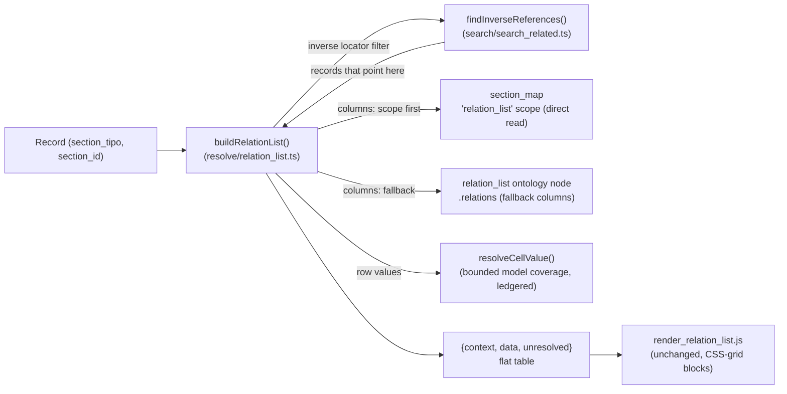

# relation_list

> The server logic that answers the question *"who points at this record?"* — it resolves the **inverse references** of a `(section_tipo, section_id)` and renders them as a grouped grid of related records. The TS rewrite ports the read/grid side; the diffusion backlink adapter is **not yet ported**.

> See also: [Components](../components/index.md) · [component_portal](../components/component_portal.md) · [component_dataframe](../components/component_dataframe.md) · [Sections](../sections/index.md) · [Locator](../locator.md) · [SQO](../sqo.md)

## Role

PHP's `relation_list` (`class relation_list extends common`) was **not** a
component and **not** a section: an ontology model in its own right (`model =
'relation_list'`), instantiated directly with `new`. The TS rewrite has no
class to mirror — the same responsibility is a plain function,
`buildRelationList()` in `src/core/resolve/relation_list.ts`, dispatched by
the `get_relation_list` action in `src/core/api/dispatch.ts`. It sits on the
same **inverse** side of the relational graph
[`component_portal`](../components/component_portal.md) and the other related
components build:

- A *related component* (portal, select, check_box, …) stores **forward**
  locators: "this record points at those records". Their selectable options
  are the *datalist* job — see
  [Components — related components](../components/index.md#related-components).
- `relation_list` answers the **reverse** question: "which records *out
  there* point back at this one?". It runs the inverse-locator search engine
  (`findInverseReferences()`, `src/core/search/search_related.ts` — the TS
  port of PHP's `related`-mode `search_related`) and shapes the answer as a
  flat-table `{context, data}` grid, one block per related `section_tipo`.

A `relation_list` node is still a **child of a section** in the ontology
(unchanged schema), and its `relations` array can still name the fallback
column tipos. The v7-preferred column source — the
[`section_map`](../ontology/section_map.md) `relation_list` scope — is
unchanged too.

!!! note "No base-class inheritance to preserve"
    PHP's `relation_list extends common` (inheriting the magic accessor,
    `build_element_json_output()`, the static `clear()` contract) has no TS
    analog: `buildRelationList()` is a plain function taking every input
    explicitly. There is no per-instance identity object, no chainable
    setters, and no worker-lifetime cache to purge — see
    [Data model / state](#data-model--state).

## Responsibilities

- **Resolve inverse references** — given `(section_tipo, section_id)`,
  `findInverseReferences()` (`search/search_related.ts`) returns every record
  that links back. `buildRelationList()` calls it with the host locator as
  the filter and `sectionTipos: 'all'`.
- **Build the relation-list grid** — group those inverse records by their
  `section_tipo`, resolve the column set for each (`getRelationListColumns()`:
  the `section_map` `relation_list` scope, falling back to the `relation_list`
  ontology node's `relations`), and emit a `{context, data}` flat table.
- **Resolve cell values** — `resolveCellValue()` covers a wide, explicitly
  bounded model set (see [Value scope](#value-scope-what-resolvecellvalue-covers)
  below) rather than instantiating a component object per cell (TS has none).
- **Serve the edit/count JSON** — `get_relation_list` in
  `src/core/api/dispatch.ts` returns the grid for `mode === 'edit'` and the
  PHP-parity **empty shell** (`{context:[], data:[]}`) for any other mode; a
  **separate** action (`countInverseReferences()` under `mode:'related'` SQO
  counts) serves the count path PHP folded into `relation_list`'s own `count`
  flag.
- **Filter scope** — **not ported.** PHP's `set_section_filter()` /
  `set_component_filter()` chainable narrowing has no TS equivalent;
  `buildRelationList()` always resolves against every referencing section and
  every referencing component (gap).
- **Diffusion adapter** — **not ported.** PHP's `get_diffusion_dato()` /
  `get_diffusion_value()` / `get_diffusion_data()` (publishing a backlink
  field's value to a diffusion target) have no TS equivalent; `model ===
  'relation_list'` diffusion branching is not wired (gap — see
  [How it fits](#how-it-fits-with-the-rest-of-dedalo)).

## Key concepts

### Inverse references (the core idea, unchanged)

A *forward* relation is a locator stored on a record:
`{type, section_id, section_tipo, from_component_tipo}` pointing **out** at a
target. An **inverse reference** is the discovery of that locator from the
*target's* point of view: starting from `(this section_tipo, this
section_id)`, find every record whose `relations` bag contains a locator
pointing here. TS's `findInverseReferences()` performs the same search;
`buildRelationList()` calls it exactly this way:

```ts
const hits = await findInverseReferences(
	[{ section_tipo: hostSectionTipo, section_id: String(hostSectionId) }],
	{ sectionTipos: 'all', limit: options.limit ?? false, offset: options.offset },
);
```

The concept of a dedicated `related` SQO mode routed to a separate search
engine is preserved — `findInverseReferences()`/`countInverseReferences()`
live in `src/core/search/search_related.ts`, the TS twin of PHP's
`search_related`.

### Column resolution: section_map scope, then ontology fallback (unchanged order)

For each related `section_tipo` in the result, `getRelationListColumns()`
(`resolve/relation_list.ts`) resolves the columns in the same strict order
PHP used:

1. **`section_map` `relation_list` scope** (preferred, v7) — a direct read of
   the section's `section_map` child node's `properties.relation_list.term`.
   When present, its term tipos *are* the columns.
2. **`relation_list` ontology node fallback** — the section's own
   `relation_list`-model child node's `relations` array; each entry yields
   one column (component tipo).

Unlike PHP's `section_map::get_scope(..., 'relation_list', /*strict*/ true)`,
this is a direct SQL read of the `section_map` properties rather than a call
through the general `section_map.ts` resolver — see the strict-scope gap
noted on the [section_map page](section_map.md#key-concepts). If neither
source yields columns, TS silently emits zero grid columns for that section
(no `WARNING` log equivalent — logging is out of scope for this port).

### Value scope: what `resolveCellValue()` covers

TS resolves cell values directly (there is no component object to call
`get_value()` on), and the coverage is **explicitly bounded and ledgered**,
not a byte-for-byte port of every PHP component's `get_value()`:

| model family | how the cell value is built |
| --- | --- |
| `component_section_id` | the record's own numeric id, as a string |
| string family (`component_input_text`, `component_text_area`, `component_email`, `component_number`) | lang-sliced literal values, multi-item joined with the separator (default `' \| '`, per-component `fields_separator` at deeper recursion levels) |
| `component_date` | the flat date atom: year-only, or `d-m-Y`; a range renders `start <> end` |
| `component_iri` | the iri value plus its `dd560` label-dataframe pairing (id_key-matched), joined `', '` |
| datalist-resolvable relation models (`component_select`, `component_radio_button`, `component_check_box`, `component_autocomplete`, `component_autocomplete_hi`, `component_relation_model`, `component_portal`) | the resolved datalist label per locator, **or** — when the component declares export-atom children (a `section_list`-style config) — each child's own flat value, joined by the child's `fields_separator`, matching the PHP `get_export_value` recursion rule |
| media models (`component_image`, `component_svg`, `component_pdf`, `component_av`) | the absolute URL of the model's default quality (`1.5MB`/`web`/`404`) under `DEDALO_MEDIA_BASE_URL`; missing env or an unmapped default quality is **ledgered as unresolved**, never guessed |
| anything else | **ledgered as unresolved** — the cell value is `null` (key omitted from the row) and the model name is collected in `RelationListResult.unresolved`, surfaced to the caller as `errors` rather than silently guessed |

This "ledger, never guess" contract is a deliberate TS-side discipline: PHP's
`get_value()` covers every component by construction (it instantiates the
real component object); TS enumerates the models it has verified and reports
anything outside that set rather than fabricating a value.

### The `{context, data}` flat-table shape (unchanged)

Same envelope PHP emitted:

- **`context`** is the *header* — a flat array of column descriptors. The
  first per-section entry is always the synthetic `id` column, then one entry
  per resolved relation component:

  ```json
  { "section_tipo": "oh1", "section_label": "Oral History",
    "component_tipo": "oh22", "component_label": "title" }
  ```

- **`data`** is the *rows* — a flat array where each record begins with an
  `id` marker row `{section_tipo, section_id, component_tipo:"id"}` followed
  by one value row per column `{section_tipo, section_id, component_tipo,
  value}` (the `value` key is **omitted**, not `null`, when
  `resolveCellValue()` returns `null` — check for its absence, not a null
  check, when consuming this on the client).

The client (`client/dedalo/core/relation_list/js/render_relation_list.js` or
equivalent — unchanged, vanilla JS) re-groups this flat list by `section_tipo`
and renders one CSS-grid block per related section.

## Data model / state

Unlike PHP's per-instance identity fields and process-static diffusion
caches, TS has no persistent state at all for this subsystem — every input
is an explicit function parameter and nothing is cached across calls:

| PHP field | TS equivalent |
| --- | --- |
| `tipo` / `section_id` / `section_tipo` / `mode` (constructor args) | `hostSectionTipo`, `hostSectionId` parameters to `buildRelationList()`; `mode` is checked once in `dispatch.ts` before calling it (non-`edit` never reaches it) |
| `sqo` | `options.limit` / `options.offset` on `buildRelationList()` |
| `count` | a **separate** dispatch branch (`countInverseReferences()` under a `mode:'related'` SQO), not a flag on the same function |
| `section_filter` / `component_filter` | **not ported** (gap) |
| `diffusion_properties`, `diffusion_dato_cache`, `diffusion_value_cache` | **not ported** — the whole diffusion adapter is a gap (see [Responsibilities](#responsibilities)) |

!!! note "No worker-hygiene caveat needed"
    PHP's warning about `$diffusion_dato_cache`/`$diffusion_value_cache` being
    process-static and NOT purged by `common::clear()` doesn't apply to TS:
    there is no such cache to begin with, and no persistent-worker boundary
    for it to leak across.

## Instantiation & lifecycle

There is no constructor — call `buildRelationList()` directly:

```ts
import { buildRelationList } from 'src/core/resolve/relation_list.ts';

// who points at oral-history record oh1/1 ?
const grid = await buildRelationList('oh1', 1, { limit: false, lang: 'lg-eng' });
// grid = { context: [...columns...], data: [...rows...], unresolved: [...model names...] }
```

The API entry point is the `get_relation_list` branch of
`src/core/api/dispatch.ts`: it validates `source.section_tipo`/`section_id`,
gates on read permission (≥1) to the **host** section, returns the PHP-parity
empty shell for any `mode` other than `'edit'`, and otherwise calls
`buildRelationList()` and wraps the result as `{result:{context,data}, msg,
errors?}` — `errors` is populated from `grid.unresolved` when any cell model
went unresolved.

```ts
// src/core/api/dispatch.ts (get_relation_list branch, abbreviated)
if (source.action === 'get_relation_list') {
	if ((source.mode ?? 'list') !== 'edit') {
		return { status: 200, body: { result: { context: [], data: [] }, msg: 'OK' } };
	}
	const relationList = await buildRelationList(hostSectionTipo, hostSectionId, {
		limit: sqoOptions.limit ?? false,
		offset: sqoOptions.offset,
		lang: source.lang,
	});
	// ...
}
```

## Public API

### Resolution & rendering

| PHP | TS | module | purpose |
| --- | --- | --- | --- |
| `get_inverse_references($sqo)` | `findInverseReferences(locators, options)` | `search/search_related.ts` | Run the inverse-locator search and return the matching records. |
| `get_data()` | *(folded into `buildRelationList()`)* | `resolve/relation_list.ts` | No standalone "just the locators, no grid" entry point — every caller gets the full grid. |
| `get_relation_list_obj(...)` | `buildRelationList(hostSectionTipo, hostSectionId, options)` | `resolve/relation_list.ts` | Group inverse references by section, resolve columns, build the `{context, data}` grid. |
| `get_ar_data(...)` | `resolveCellValue(...)` (per cell) | `resolve/relation_list.ts` | Per-record row building is inlined into `buildRelationList()`'s loop rather than a separate per-record helper. |
| `get_json(...)` | the `get_relation_list` dispatch branch | `api/dispatch.ts` | Permission gate + mode check + envelope. |

### Filters

| PHP | TS |
| --- | --- |
| `set_section_filter(...)` / `set_component_filter(...)` | **Not ported** (gap) — `buildRelationList()` always resolves every referencing section/component. |

### Diffusion

| PHP | TS |
| --- | --- |
| `get_diffusion_dato()` / `get_diffusion_value(...)` / `get_diffusion_data(...)` | **Not ported** (gap). `model === 'relation_list'` diffusion branching does not exist in the TS diffusion engine (`diffusion/api/v1/`); publishing a backlink field is not yet supported. See [diffusion data flow](../../diffusion/diffusion_data_flow.md) for what IS ported. |

## How it fits with the rest of Dédalo



**Prose:** A record asks `buildRelationList()` "who points at me?". It builds
the inverse-locator filter and hands it to `findInverseReferences()`, which
returns the records that link back. For each distinct related section, it
resolves the display columns — first from the `section_map` `relation_list`
scope, otherwise from the `relation_list` ontology node's `relations` — then
resolves each column's cell value directly (no component instantiation) via
`resolveCellValue()`'s bounded, ledgered model coverage. The result is a flat
`{context, data}` table the unchanged client re-groups into one CSS-grid
block per related section.

Concrete neighbours:

- **[component_portal](../components/component_portal.md)** and the other
  [related components](../components/index.md#related-components) create the
  **forward** locators `findInverseReferences()` discovers in reverse.
- **[component_dataframe](../components/component_dataframe.md)** stores its
  frame relations in the same `relations` bag; a relation-list grid over a
  frame's target surfaces dataframe-originated locators too — with **no**
  `set_component_filter()`-equivalent way to scope them out (gap).
- **[section_map](section_map.md)** is the preferred column source via its
  `relation_list` scope (read directly here, not through the shared
  `getSectionMapValue()` resolver — see [Key concepts](#key-concepts)).
- **[search / SQO](../sqo.md)** — `search_related.ts` is the TS twin of the
  PHP `related` search mode.
- **Diffusion** — not wired for `relation_list`; see
  [Responsibilities](#responsibilities).

## Examples

### Resolve a record's backlinks as a grid (API path)

```ts
import { buildRelationList } from 'src/core/resolve/relation_list.ts';

// who points at oral-history record oh1/1 ?
const grid = await buildRelationList('oh1', 1, { limit: false, offset: 0, lang: 'lg-eng' });
// grid = { context: [...columns...], data: [...rows...], unresolved: [] }
```

### Handling an unresolved cell model

```ts
const grid = await buildRelationList('rsc197', 7);
if (grid.unresolved.length > 0) {
	// surfaced to the API caller as `errors: ["unresolved relation_list cell
	// model: <model>", ...]` — the cell's `value` key is simply absent, never
	// a guessed or null placeholder.
}
```

## Related

- [component_portal](../components/component_portal.md) — the canonical
  **forward** relation that `relation_list` discovers in reverse.
- [component_dataframe](../components/component_dataframe.md) — frame relations
  stored in the same `relations` bag (no TS-side filter to scope them away).
- [Related components](../components/index.md#related-components) — every
  component that writes forward locators.
- [Sections / relations bag](../sections/section.md#relations-section-owned) —
  where the locators `relation_list` reads actually live.
- [SQO](../sqo.md) — the `related`-mode query; the engine is
  `src/core/search/search_related.ts`.
- [Locator](../locator.md) — the typed pointer at both ends of the relation.
- [section_map](section_map.md) — the preferred column-source resolver.
- The **forward** option-list machinery (the datalist of
  select/check_box/radio_button/portal) is the complement to this inverse
  resolver — see [Components](../components/index.md#related-components).
