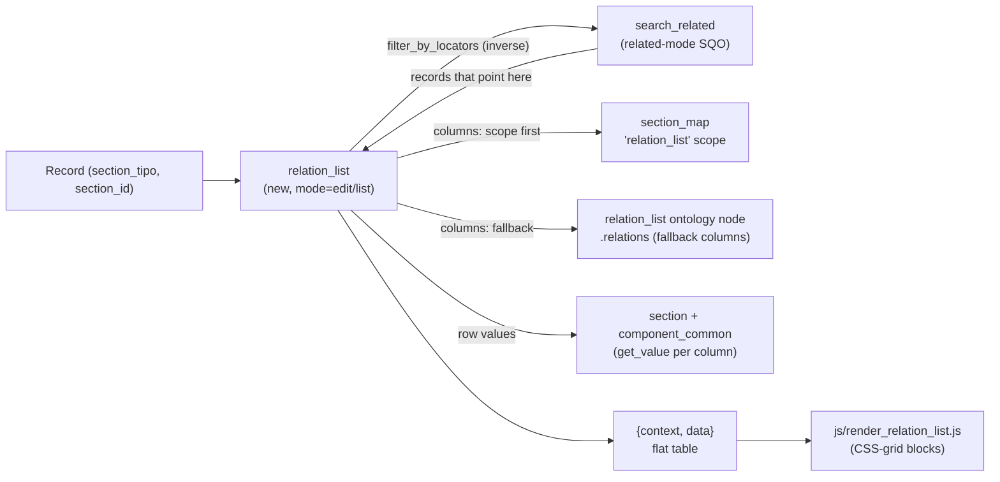

# relation_list

> The server object that answers the question *"who points at this record?"* — it resolves the **inverse references** of a `(section_tipo, section_id)` and renders them as a grouped, paginated grid of related records, and it is the diffusion adapter that publishes those backlinks.

> See also: [Components](../components/index.md) · [component_portal](../components/component_portal.md) · [component_dataframe](../components/component_dataframe.md) · [Sections](../sections/index.md) · [Locator](../locator.md) · [SQO](../sqo.md)

## Role

`relation_list` (in `core/relation_list/class.relation_list.php`,
`class relation_list extends common`) is **not** a component and **not** a
section. It is an ontology model in its own right (`model = 'relation_list'`),
instantiated directly with `new` (it defines its own `__construct`, *not* a
cached `get_instance()` factory). It sits on the **inverse** side of the
relational graph that [`component_portal`](../components/component_portal.md) and
the other related components build:

- A *related component* (portal, select, check_box, …) stores **forward**
  locators: "this record points at those records". Their selectable options are
  the *datalist* job of `component_common::get_list_of_values()` (see
  [Components — related components](../components/index.md#related-components)).
- `relation_list` answers the **reverse** question: "which records *out there*
  point back at this one?". It runs a `related`-mode search (the inverse-locator
  engine in `core/search/class.search_related.php`) and shapes the answer as a
  flat-table `{context, data}` grid, one block per related `section_tipo`.

It lives next to `section` in the ontology tree: a `relation_list` node is a
**child of a section** (resolved via
`section::get_ar_children_tipo_by_model_name_in_section($section_tipo, ['relation_list'], …)`),
and its `relations` array names the component tipos that become the grid's
columns. In v7 that column source has a preferred replacement — the
[`section_map`](../../../core/section/class.section_map.php) `relation_list`
scope (see [Key concepts](#key-concepts)).

!!! note "Inheritance"
    `relation_list extends common`, so it inherits the shared identity fields
    (`$tipo`, `$section_tipo`, `$section_id`, `$mode`, `$lang`, …), the magic
    `get_X()`/`set_X()` accessor, `build_element_json_output()` and the static
    `clear()` worker-reset contract. It does **not** extend
    `component_common` or `component_relation_common`, so it has *no*
    `get_data()`-as-array, `set_dato()`, datalist, or save path of its own —
    its `get_data()` returns the **inverse references**, which is a different
    contract from a component's stored value.

## Responsibilities

- **Resolve inverse references** — given `(section_tipo, section_id)`, build a
  `related`-mode SQO filtered by an inverse-locator and return every record that
  links back (`get_inverse_references()`, `get_data()`).
- **Build the relation-list grid** — group those inverse records by their
  `section_tipo`, resolve the column set for each (from the `section_map`
  `relation_list` scope, falling back to the `relation_list` ontology node's
  `relations`), and emit a `{context, data}` flat table
  (`get_relation_list_obj()`, `get_ar_data()`).
- **Serve the edit/count JSON** — `relation_list_json.php` returns the grid for
  `mode === 'edit'`, or the raw inverse references when `count === true`.
- **Filter scope** — narrow the result to specific target sections
  (`set_section_filter()`) or to the originating component tipos
  (`set_component_filter()`).
- **Diffusion adapter** — compute the value published for this backlink field
  in the diffusion targets: `get_diffusion_dato()` (filtered inverse locators),
  `get_diffusion_value()` (the `data_to_be_used` switch: `dato` / `valor` /
  `dato_full` / `filtered_values` / `custom`), and the v7 chain-processor entry
  point `get_diffusion_data()`.

## Key concepts

### Inverse references (the core idea)

A *forward* relation is a locator stored on a record:
`{type, section_id, section_tipo, from_component_tipo}` pointing **out** at a
target. An **inverse reference** is the discovery of that locator from the
*target's* point of view: starting from `(this section_tipo, this section_id)`,
find every record whose `relations` bag contains a locator pointing here.

`relation_list` produces this by building a `search_query_object` in
`related` mode:

```php
$sqo->set_section_tipo(['all']);   // search every section
$sqo->set_mode('related');         // → search_related (inverse-locator engine)
$sqo->set_filter_by_locators([$filter_locator]); // locator pointing AT me
```

`mode === 'related'` is what routes the query to
`core/search/class.search_related.php` (see `search::get_instance()`'s
`switch($mode)`), which computes the inverse locators rather than matching a
stored value. The result rows are full section records
(`{section_tipo, section_id, datos:{…relations…}}`).

### Column resolution: section_map scope, then ontology fallback

For each related `section_tipo` in the result, the grid needs a set of columns.
`get_relation_list_obj()` resolves them in this strict order:

1. **`section_map` `relation_list` scope** (preferred, v7) —
   `section_map::get_scope($section_tipo, 'relation_list', /*strict*/ true)`.
   When present, its `term` tipos *are* the columns. This is the global
   scope/term resolver implemented in
   [`section_map`](../../../core/section/class.section_map.php); the
   `relation_list` scope is its dedicated, strict (no-chain) entry for this grid.
2. **`relation_list` ontology node fallback** — locate the section's
   `relation_list` child element
   (`section::get_ar_children_tipo_by_model_name_in_section(... ['relation_list'] ...)`,
   trying the section as-is first then the resolved *real* section for virtual
   sections) and read its `relations` array via
   `ontology_node::get_instance($child)->get_relations()`. Each entry yields one
   column (component tipo).

If neither source yields columns, a `WARNING` is logged
(`"Section without relation_list. Please, define relation_list for section: …"`)
and that section contributes only its `id` column.

### The `{context, data}` flat-table shape

`relation_list` emits a **flat-table** datum, not the component datum. It is the
same envelope name (`{context, data}`) but the semantics differ from a
component's `{context, data:{value:[]}}`:

- **`context`** is the *header* — a flat array of column descriptors. The first
  per-section entry is always the synthetic `id` column, then one entry per
  resolved relation component:

  ```json
  { "section_tipo": "oh1", "section_label": "Oral History",
    "component_tipo": "oh22", "component_label": "title" }
  ```

- **`data`** is the *rows* — a flat array where each record begins with an `id`
  marker row `{section_tipo, section_id, component_tipo:"id"}` followed by one
  value row per column `{section_tipo, section_id, component_tipo, value}`.

The client (`js/render_relation_list.js`) re-groups this flat list by
`section_tipo` and renders one CSS-grid block per related section, with a
counter and a per-row "open record" click. Different sections may have a
different number/kind of columns in the same response.

## Data model / state

| field | type | meaning |
| --- | --- | --- |
| `tipo` | `string` (inherited) | the `relation_list` element tipo (constructor arg). |
| `section_id` | mixed (inherited) | the record whose backlinks are resolved. |
| `section_tipo` | `string` (inherited) | the section of that record. |
| `mode` | `string` (inherited) | `'list'` / `'edit'`; only `edit` produces a grid in the JSON controller. |
| `sqo` | `?object` | the SQO used by the JSON controller path (set via `set_sqo()` from the API). |
| `count` | `?int` | when set `true` by the caller, the JSON controller returns raw inverse references instead of the grid. |
| `section_filter` | `?array` (protected) | limits which target `section_tipo`s are returned (`set_section_filter()`). |
| `component_filter` | `?array` (protected) | limits inverse references to those whose `from_component_tipo` is in the list (`set_component_filter()`). |
| `diffusion_properties` | `?object` | injected diffusion-element properties driving `get_diffusion_value()` / `get_diffusion_dato()`. |
| `diffusion_dato_cache` | `static array` | per-process cache of `get_diffusion_dato()` results. |
| `diffusion_value_cache` | `static array` | per-process cache of `get_diffusion_value()` results. |

!!! warning "Static caches and worker hygiene"
    `relation_list::$diffusion_dato_cache` and `$diffusion_value_cache` are
    process-static. Their keys include `tipo`, `section_tipo`, `section_id` and
    a serialized properties/arguments fragment, but they are **not** purged by
    `common::clear()` (which only resets the `common`-owned statics). Under
    persistent workers they persist for the worker's lifetime; they are keyed by
    record identity, so the risk is staleness across an edit within one worker
    rather than cross-user bleed. Treat them as a per-request optimisation, not a
    durable cache.

## Instantiation & lifecycle

`relation_list` is constructed **directly** — there is no `get_instance()`
factory and no instance cache:

```php
public function __construct(
    string $tipo,         // the relation_list element tipo
    mixed  $section_id,   // the record whose inverse references we resolve
    string $section_tipo, // that record's section
    string $mode = 'list' // 'list' | 'edit'
)
```

Typical server construction (the diffusion chain processor and RDF builder use
exactly this form):

```php
// build the backlink resolver for one record
$relation_list = new relation_list(
    $tipo,          // e.g. 'numisdata1021'
    $section_id,    // e.g. 1
    $section_tipo,  // e.g. 'numisdata1'
    'list'
);

// narrow scope (both optional, chainable)
$relation_list
    ->set_section_filter(['dmm480'])     // only these target sections
    ->set_component_filter(['rsc29']);   // only locators from these components

// the inverse references as plain {section_tipo, section_id} objects
$data = $relation_list->get_data();
```

The API entry point (`dd_core_api`, action `get_relation_list`) builds it from
the request, injects the SQO and lets `get_json()` run the controller:

```php
// core/api/v1/common/class.dd_core_api.php (action 'get_relation_list')
$element = new relation_list($tipo, $section_id, $section_tipo, $mode);
$element->set_sqo($sqo);
$element->set_build_options($build_options); // inherited common property
$element_json = $element->get_json($get_json_options); // → {context, data}
```

`get_json()` includes `relation_list_json.php` in the instance scope (the same
mechanism `common::get_json()` uses); that controller checks permissions
(`common::get_permissions($section_tipo, $tipo)`), and for `mode === 'edit'`
returns either the raw inverse references (when `count === true`) or the full
grid from `get_relation_list_obj()`.

## Public API

Grouped by concern. *static?* marks class-level (static) methods. All
non-static methods read the identity set on the constructor.

### Resolution & rendering

| method | static? | purpose |
| --- | --- | --- |
| `get_inverse_references($sqo)` | | Run the given `related`-mode SQO through `sections::get_instance(null, $sqo, $section_tipo, $mode)->get_data()->fetch_all()` and return the array of inverse-reference records (full section datos). |
| `get_data()` | | Build the default inverse-locator SQO (honouring `section_filter` / `component_filter`), resolve inverse references, and return them mapped to plain `{section_tipo, section_id}` objects. *Not* a component value. |
| `get_relation_list_obj($ar_inverse_references)` | | Group the inverse references by `section_tipo`, resolve each section's columns (section_map scope → ontology fallback), and build the `{context, data}` flat-table grid. |
| `get_ar_data($current_record, $ar_components)` | | Build the data rows for one related record: an `id` marker row plus one `{…, value}` row per relation component (each instanced in `list` mode via `component_common::get_instance()` → `get_value()`). |
| `get_json($request_options=null)` | | Include `relation_list_json.php` in instance scope and return its `{context, data}` (or raw references when counting). |

### Filters

| method | static? | purpose |
| --- | --- | --- |
| `set_section_filter(?array $section_filter)` | | Limit which target `section_tipo`s are returned; returns `$this` (chainable). |
| `set_component_filter(?array $component_filter)` | | Limit inverse references to locators whose `from_component_tipo` is in the list; returns `$this` (chainable). |

### Diffusion

| method | static? | purpose |
| --- | --- | --- |
| `get_diffusion_dato()` | | Resolve filtered inverse **locators** for publication: build the inverse SQO, clean references that actually point here, apply `filter_section` / `filter_component` from the diffusion properties, drop non-publishable targets (`diffusion_utils::is_publishable()`), optionally reformat (e.g. `format: 'section_id'`). Cached in `$diffusion_dato_cache`. |
| `get_diffusion_value(?string $lang=null)` | | The diffusion value adapter (mirrors `component_common::get_diffusion_value`). Switches on `diffusion_properties->data_to_be_used`: `dato` (default → `get_diffusion_dato()`), `valor` (→ a relation-list grid), `dato_full` (all publishable locators), `filtered_values` (inject each locator into a target component and read its processed value), `custom` (the `custom_map` walker, incl. deep recursive `relation_list`). Cached in `$diffusion_value_cache`. |
| `get_diffusion_data(object $ddo, ?string $diffusion_element_tipo=null)` | | The v7 chain-processor entry point: wrap the resolved value in a `diffusion_data_object`. Supports a per-`ddo` custom `fn`, `section_filter` / `component_filter` and `data_slice`. Consumed by `diffusion_chain_processor`. |

!!! warning "v6 `process_dato` is not migrated"
    Inside `get_diffusion_value()`'s `custom` branch, any ontology config that
    still relies on the v6 `diffusion_sql::resolve_value` / `process_dato`
    handlers resolves to `null` and logs an `ERROR` pointing at
    `diffusion/migration/migrate_diffusion_properties.php`. In v7 diffusion
    values are processed by the Bun engine parsers — see the
    [diffusion data flow](../../diffusion/diffusion_data_flow.md). Treat any such
    log line as an un-migrated node, not a runtime bug.

### Inherited accessors used by callers

`set_sqo()` / `set_count()` / `set_build_options()` are *not* defined on
`relation_list`; they resolve through `common`'s magic `__call` accessor against
the matching properties (`sqo`, `count`, and the inherited `build_options`),
which is why they exist on instances but not in this class file.

## How it fits with the rest of Dédalo



**Prose:** A record asks `relation_list` "who points at me?". `relation_list`
builds a `related`-mode SQO whose `filter_by_locators` is a locator pointing *at*
the record, and hands it to `search_related`, which returns the records that
link back. For each distinct related section, `relation_list` resolves the
display columns — first from the `section_map` `relation_list` scope, otherwise
from the `relation_list` ontology node's `relations` — then instances each
column component in `list` mode and reads its `get_value()`. The result is a
flat `{context, data}` table that `render_relation_list.js` re-groups into one
CSS-grid block per related section.

Concrete neighbours:

- **[component_portal](../components/component_portal.md)** and the other
  [related components](../components/index.md#related-components) create the
  **forward** locators that `relation_list` discovers in reverse. The
  record-wide `relations` bag they all write into (owned by
  [`section`](../sections/section.md#relations-section-owned)) is exactly what
  the inverse search reads.
- **[component_dataframe](../components/component_dataframe.md)** stores its
  frame relations in that same bag; a `relation_list` over a frame's target will
  surface dataframe-originated locators, sliced by `from_component_tipo` — use
  `set_component_filter()` to scope to (or away from) them.
- **[section_map](../../../core/section/class.section_map.php)** is the
  preferred column source via its strict `relation_list` scope; the legacy
  `relation_list` ontology node is the fallback.
- **[search / SQO](../sqo.md)** — `relation_list` is a pure consumer of the
  `related` search mode; it never writes SQL.
- **Diffusion** — `diffusion_chain_processor` and `diffusion_rdf` branch on
  `model === 'relation_list'` to publish backlinks; see the
  [diffusion data flow](../../diffusion/diffusion_data_flow.md).

## Examples

### Resolve a record's backlinks as a grid (API path)

```php
// who points at oral-history record oh1/1 ?
$relation_list = new relation_list('oh_rl_node', 1, 'oh1', 'edit');

$sqo = new search_query_object((object)[
    'section_tipo'       => ['all'],
    'mode'               => 'related',
    'limit'              => false,
    'offset'             => 0,
    'filter_by_locators' => [ (object)['section_tipo' => 'oh1', 'section_id' => 1] ]
]);
$relation_list->set_sqo($sqo);

$json = $relation_list->get_json(); // { context:[…columns…], data:[…rows…] }
```

### Inverse references scoped to one source section + component

```php
$relation_list = new relation_list($tipo, $section_id, $section_tipo, 'list');
$relation_list
    ->set_section_filter(['rsc197'])    // only People records that point here
    ->set_component_filter(['rsc91']);  // only via the 'Birth town' portal

$backlinks = $relation_list->get_data();
// → [ {section_tipo:'rsc197', section_id:7}, … ]
```

### Diffusion: publish backlinks as the field value

```php
// inside the diffusion chain (model resolved as 'relation_list')
$relation_list = new relation_list($current_tipo, $section_id, $section_tipo, 'list');
$relation_list->diffusion_properties = $diffusion_properties; // data_to_be_used etc.

$diffusion_data = $relation_list->get_diffusion_data($ddo, $diffusion_element_tipo);
// → [ diffusion_data_object{ value: [locators|grid|…] } ]
```

## Related

- [component_portal](../components/component_portal.md) — the canonical
  **forward** relation that `relation_list` discovers in reverse.
- [component_dataframe](../components/component_dataframe.md) — frame relations
  stored in the same `relations` bag; filter with `set_component_filter()`.
- [Related components](../components/index.md#related-components) — every
  component that writes forward locators.
- [Sections / relations bag](../sections/section.md#relations-section-owned) —
  where the locators `relation_list` reads actually live.
- [SQO](../sqo.md) — the `related`-mode query `relation_list` builds; the engine
  is [`search_related`](../../../core/search/class.search_related.php).
- [Locator](../locator.md) — the typed pointer at both ends of the relation.
- [section_map](../../../core/section/class.section_map.php) — the preferred
  column-source resolver (the strict `relation_list` scope).
- The **forward** option-list machinery (`component_common::get_list_of_values()`,
  the datalist of select/check_box/radio_button/portal) is the complement to this
  inverse resolver — see [Components](../components/index.md#related-components).
