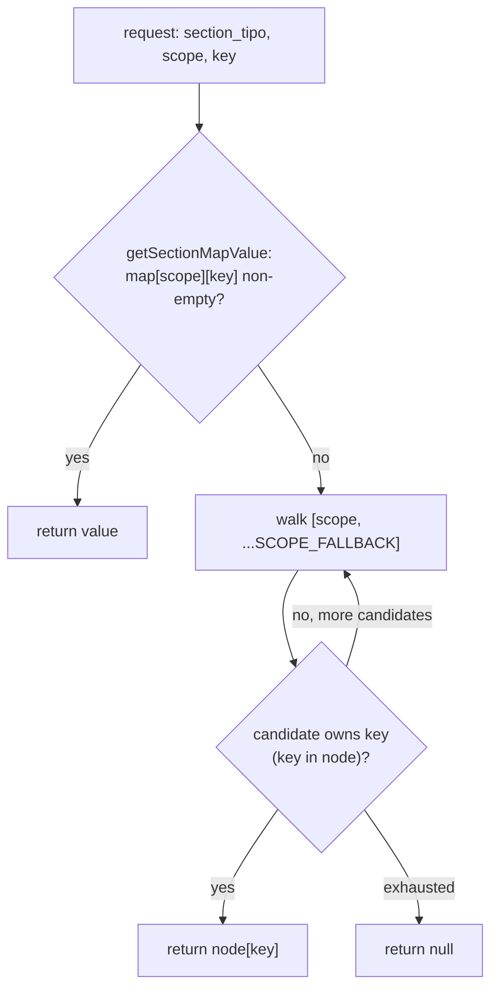
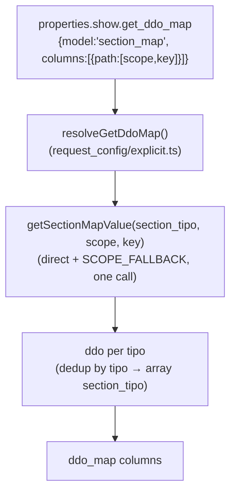

# section_map

> The global **scope/term-configuration resolver** — reads a section's ontology `section_map` property and answers "which component tipos play role *X* (term, model, order, parent, is_indexable, …) for this section, under scope *Y*?", applying a `main → thesaurus → relation_list` fallback chain.

> See also: [common](../system/common.md) · [section](../sections/section.md) · [request_config](../request_config.md) · [relation_list](relation_list.md) · [ts_object](ts_object.md) · [hierarchy](hierarchy.md)

This page is the reference for the `section_map` resolver
(`src/core/ontology/section_map.ts`) and its client mirror
(`client/dedalo/core/common/js/section_map.js`). It documents the resolution
contract — the scope fallback chain, the per-key walk, and the
separator-travels-with-term rule — plus where the term **string** cache lives
(it does *not* live in `section_map.ts`) and how `request_config` consumes the
`section_map` model to build a dynamic `ddo_map`.

## Role

`src/core/ontology/section_map.ts` is a **pure service**: plain exported
`async function`s, no instance state, owning its own raw-map cache
(`sectionMapCache`) read straight from `dd_ontology`.

A *section map* is an ontology-defined object stored as the `properties` of a
section's first-level `section_map` child element:

```json
{
  "main":          { "term": ["tch22"] },
  "thesaurus":     { "term": ["tch22","tch25"], "fields_separator": " ",
                     "model": "tch27", "order": "tch276", "parent": "tch38",
                     "is_indexable": "tch68", "is_descriptor": "tch67" },
  "relation_list": { "term": ["tch21","tch25","tch32"] }
}
```

Each top-level key (`main`, `thesaurus`, `relation_list`, …) is a **scope
node**. Inside a scope node, each key (`term`, `model`, `order`, `parent`,
`is_indexable`, `is_descriptor`, …) is a **role**, whose value is one component
tipo, an array of tipos, or a boolean flag. `fields_separator` is the optional
glue string used when joining multiple `term` values (default `', '`).

!!! note "Server resolver and client mirror"
    The server resolver is `src/core/ontology/section_map.ts`; the client mirror
    is `client/dedalo/core/common/js/section_map.js`. They are a deliberate
    server↔client pair implementing the same resolution rules, but the server
    side is **narrower** — see the API tables below for exactly where.

## Responsibilities

- **Raw map access** — `getSectionMap(sectionTipo)` reads the `section_map`
  child node directly off `dd_ontology` (`parent = sectionTipo, model =
  'section_map'`), falling back to the real section for a virtual one (via the
  node's own `relations[0].tipo`). Cached per `sectionTipo`.
- **Combined scope + per-key resolution** — `getSectionMapValue(sectionTipo,
  scope, key)` is **one** function that does both: try the requested scope
  directly, then walk `[scope, ...SCOPE_FALLBACK]` until a scope *owns* the key.
  There is no standalone scope-only resolver exported from `section_map.ts`.
- **Separator resolution** — `getFieldsSeparator()` (private to
  `ts_object/term_resolver.ts`, **not** in `section_map.ts`) returns the
  `fields_separator` from the same scope that supplied `term`.
- **Term resolution entry points** — `getTermByLocator()` /
  `getTermDataByLocator()` (`ts_object/term_resolver.ts`) call
  `section_map.ts`'s `getSectionMap()` directly and run their own private
  `getTermTipos()`/`resolveKeyScope()` — a second implementation of the per-key
  scope walk, specialized for the `term` role, not a reuse of
  `getSectionMapValue()`. See
  [Where the term cache lives](#where-the-term-cache-lives).

## Key concepts

### Per-key resolution, and no strict mode on the server

`getSectionMapValue()` resolves **per key**: a scope node that exists but does
not own the requested key is *skipped*, and the walk continues.

There is **no `strict` (no-fallback) mode** on the server: every lookup can fall
through the chain. A caller needing "does this section explicitly declare a
`relation_list` scope, with no fallback" has no dedicated server function for it.
The **client mirror does** have that strict check (`resolve_scope_name(…, true)`
/ `get_scope(…, true)`), and uses it — see
[Client mirror](#client-mirror).

`getSectionMapValue()`'s direct-lookup step treats an **empty string** as absent
(it falls through to the chain), rather than as an explicitly-owned value. No
current role value is an empty string, so this has not been observed to matter,
but it is worth knowing if you add a new role.

### The scope fallback chain

```
SCOPE_FALLBACK = ['main', 'thesaurus', 'relation_list']
```

The same constant lives in both `section_map.ts` and
`ts_object/term_resolver.ts` (each module keeps its own copy). Resolution order
for `getSectionMapValue()`:

1. Try the **requested** scope directly.
2. If empty/absent, walk `[scope, ...SCOPE_FALLBACK]` in order (duplicating
   the requested scope in the list is harmless — it is a "first match wins"
   walk).
3. Return `null` when the chain is exhausted.



### The separator travels with the term

`getFieldsSeparator()` (private, `ts_object/term_resolver.ts`) does **not** read
the separator from the requested scope. It first resolves *which scope supplied
`term`* via its own `resolveKeyScope()`, then reads `fields_separator` from
**that** scope, falling back to `DEFAULT_FIELDS_SEPARATOR` (`', '`) when the
winning term-scope defines none.

### Where the term cache lives

`section_map.ts` resolves *configuration* (tipos, scopes, separators). The
expensive part — reading the `term` component(s)' values per language and
joining them into a string — is done by `ts_object/term_resolver.ts`, which
calls `getSectionMap()` directly and does its own scope/key resolution for
`term`.

The **term-string cache lives entirely in `ts_object/term_resolver.ts`**, not in
`section_map.ts`:

- `termByLocatorCache` is keyed `` `${section_tipo}_${section_id}_${scope}_${lang}` ``
  (the `scope` segment is the empty string when the caller passed `null`).
- It is bounded to 1000 entries and **fully dropped on overflow** — an O(1)
  eviction, not an LRU trim.
- `invalidateNode(sectionTipo, sectionId)` evicts by the `` `${tipo}_${id}_` ``
  prefix so every lang × scope combination for a node goes together after a
  tree write — the tree calls this directly, not just via the ontology-write
  hook.
- `clearTermCache()` is registered with `clearOntologyDerivedCaches()`
  (`src/core/ontology/cache_invalidation.ts`) — the automatic, single chokepoint
  every `dd_ontology` write fans out to. `clearSectionMapCache()` registers with
  the same hub.

So the data flow is: **`section_map.ts` (raw map) → `term_resolver.ts`'s own
scope walk (which key wins, and what the separator is) → joined string,
cached in `term_resolver.ts`.**

## Public API

### Constants

| constant | value | module |
| --- | --- | --- |
| `SCOPE_FALLBACK` | `['main', 'thesaurus', 'relation_list']` | `ontology/section_map.ts` **and** `ts_object/term_resolver.ts` (duplicated) |
| `DEFAULT_FIELDS_SEPARATOR` | `', '` | `ts_object/term_resolver.ts` only (`section_map.ts` has no separator concept of its own) |

### Raw map & resolution

| function | module | purpose |
| --- | --- | --- |
| `getSectionMap(sectionTipo)` | `ontology/section_map.ts` | The raw `section_map` object; virtual-section-aware (falls back to the node's `relations[0].tipo`). `null` when absent. Cached per `sectionTipo`, hub-cleared. |
| `getSectionMapValue(sectionTipo, scope, key)` | `ontology/section_map.ts` | Direct lookup + `SCOPE_FALLBACK` walk in one call. Returns `null` when nothing owns the key. |
| `clearSectionMapCache()` | `ontology/section_map.ts` | Drop the raw-map cache. Registered with the ontology invalidation hub. |
| `resolveKeyScope()` *(private)* | `ts_object/term_resolver.ts` | Which scope owns the `term` key — used inside the term resolver only. |
| `getTermTipos(sectionTipo, scope)` | `ts_object/term_resolver.ts` | Normalizes the `term` role's value to a string array. |
| `getFieldsSeparator()` *(private)* | `ts_object/term_resolver.ts` | The separator from the scope that supplied `term`. |

Callers that need a single tipo from a possibly-array role value inline
`Array.isArray(value) ? value[0] : value` themselves (e.g.
`request_config/explicit.ts`'s `resolveGetDdoMap()`); there is no dedicated
single-tipo collapse helper.

### Term resolution

| function | module | purpose |
| --- | --- | --- |
| `getTermByLocator(locator, lang, fromCache, scope)` | `ts_object/term_resolver.ts` | The human-readable string label, with the term cache. Called directly — there is no `section_map` delegate layer. |
| `getTermDataByLocator(locator, scope)` | `ts_object/term_resolver.ts` | The merged raw data array across all `term` tipos of the resolved scope. Not cached. |

### Client mirror

`client/dedalo/core/common/js/section_map.js` is a pure-function mirror
operating on a `section_map` object received in the datum/section context. It
implements the same scope/per-key/separator rules **plus** a `strict` scope
check the server resolver does not expose. It does **not** resolve term values —
those arrive in the datum.

| export | notes |
| --- | --- |
| `SCOPE_FALLBACK`, `DEFAULT_FIELDS_SEPARATOR` | same constants as the server |
| `resolve_scope_name(section_map, scope=null, strict=false)` | scope-level resolution — **`strict` disables the fallback chain** |
| `get_scope(section_map, scope=null, strict=false)` | the resolved scope node |
| `get_element_tipo(section_map, key, scope=null)` | per-key raw value (always non-strict) |
| `get_term_tipos(section_map, scope=null)` | normalized array |
| `get_fields_separator(section_map, scope=null)` | separator from the term scope |

Known client consumers: `client/dedalo/core/section/js/build_graph_data.js`
(graph node labels) and `client/dedalo/core/search/js/render_search.js`, which
calls `get_scope(section_map, 'thesaurus', true)` to *strictly* detect a
thesaurus section — the one check that has no server-side equivalent.

## How request_config uses the section_map model

`request_config` lets an ontology author build a `ddo_map` (the list of
columns to show) **dynamically** from the section_map instead of hardcoding
every column. The directive is resolved by `resolveGetDdoMap()` in
`src/core/relations/request_config/explicit.ts`:

```json
{
  "show": {
    "get_ddo_map": {
      "model": "section_map",
      "columns": [
        { "path": ["thesaurus", "term"] },
        { "path": ["thesaurus", "model"], "mode": "list" }
      ]
    }
  }
}
```

For `model === 'section_map'`, `resolveGetDdoMap()`:

1. For each resolved target section, for each column's `path` (`[scope, key]`),
   calls `getSectionMapValue(sectionTipo, scope, key)` — which already **is**
   the scope-fallback-aware lookup, so no separate two-step is needed.
2. Normalizes the value to an array of component tipos and builds one `ddo`
   object per tipo (`{tipo, section_tipo, parent, ...extraColumnProps}`,
   `path` excluded).
3. **Deduplicates:** when the same component tipo appears under multiple
   target sections, the existing ddo's `section_tipo` is extended into an
   array rather than emitting a duplicate ddo.

It returns `[]` (never `null`) when the directive is `false`/malformed/empty, or
when `columns` is absent, so the caller can merge the result into a literal
`ddo_map` without a null guard. A bare-array column (`["thesaurus","term"]`
instead of `{path: [...]}`) is still accepted for compatibility.



## Examples

### Resolve a term label (server)

```ts
import { getTermByLocator } from 'src/core/ts_object/term_resolver.ts';

// the usual path: let term_resolver.ts do the value read + caching
const label = await getTermByLocator(
	{ section_tipo: 'tch1', section_id: 42 },
	'lg-eng',
	false,
	'thesaurus',
);
```

### Per-key fallback for a config role

```ts
import { getSectionMapValue } from 'src/core/ontology/section_map.ts';

// 'main' exists but only declares 'term'; 'is_indexable' lives on 'thesaurus'
const isIndexable = await getSectionMapValue('tch1', 'main', 'is_indexable');
// falls through main → thesaurus and returns tch1's thesaurus-scope value
// (boolean false is preserved as a valid, present value — never coerced away)
```

### Client label resolution (JS)

```js
import { get_term_tipos, get_fields_separator } from '../../common/js/section_map.js'

const section_map = datum.context_item?.section_map // arrives in the datum context
const term_tipos  = get_term_tipos(section_map)     // normalized array (chain from 'main')
// …read each term value from the datum, then:
const label = parts.join(get_fields_separator(section_map))
```

## How it fits with the rest of Dédalo

- **The section engine** does not own a second raw-map cache: `getSectionMap()`
  (`ontology/section_map.ts`) reads `dd_ontology` directly and its
  `sectionMapCache` is dropped by the same ontology invalidation hub every other
  ontology cache uses.
- **`ts_object/term_resolver.ts`** consumes `getSectionMap()` (running its own
  scope walk for the `term` role) and **owns the term cache** that
  `getTermByLocator()`/`getTermDataByLocator()` populate. See
  [ts_object](ts_object.md).
- **`hierarchy`** ([hierarchy](hierarchy.md)) leans on `getSectionMapValue()`
  for its tree configuration lookups.
- **`relation_list`** ([relation_list](relation_list.md)) needs a *strict*
  `relation_list` scope for its grid columns, so it does **not** go through
  `getSectionMapValue()`: it reads the `section_map` node's
  `properties.relation_list.term` directly, with no chain fallback.
- **`request_config`** ([request_config](../request_config.md#get_ddo_map--dynamic-ddo_map))
  uses the `section_map` model in `resolveGetDdoMap()`
  (`relations/request_config/explicit.ts`) to build dynamic `ddo_map` columns, via
  `getSectionMapValue()`.

## Related

- [common](../system/common.md) — the request_config pipeline that hosts
  `resolveGetDdoMap()`.
- [section](../sections/section.md) — the section engine's own virtual-section
  resolution.
- [request_config](../request_config.md#get_ddo_map--dynamic-ddo_map) — the
  `get_ddo_map` directive that consumes the section_map model.
- [relation_list](relation_list.md) — the inverse view that reads the
  `relation_list` scope.
- [ts_object](ts_object.md) — the thesaurus tree node builder and
  `term_resolver.ts`, the owner of the term-string cache.
- [hierarchy](hierarchy.md) — the TLD/tree config layer.
- [Locator](../locator.md) — the pointer type passed to term resolution.
