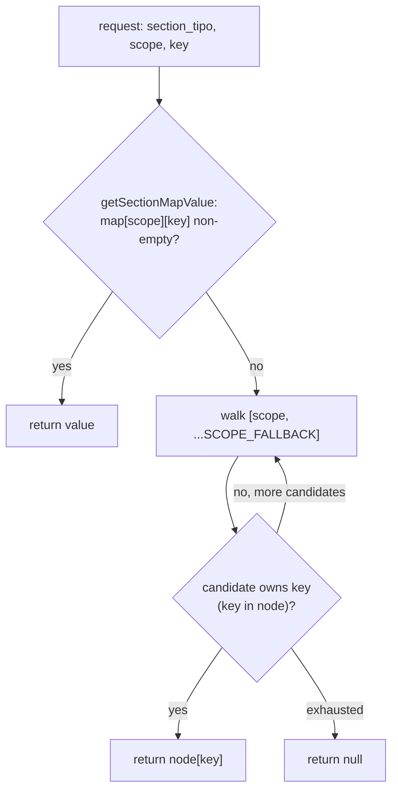
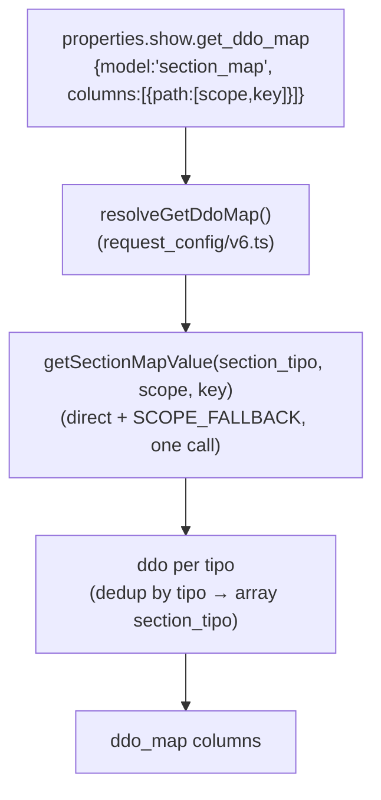

# section_map

> The global **scope/term-configuration resolver** — reads a section's ontology `section_map` property and answers "which component tipos play role *X* (term, model, order, parent, is_indexable, …) for this section, under scope *Y*?", applying a `main → thesaurus → relation_list` fallback chain.

> See also: [common](../system/common.md) · [section](../sections/section.md) · [request_config](../request_config.md) · [relation_list](relation_list.md) · [ts_object](ts_object.md) · [hierarchy](hierarchy.md)

This page is the reference for the TS `section_map` resolver
(`src/core/ontology/section_map.ts`) and its **unchanged** client mirror
(`client/dedalo/core/common/js/section_map.js` — the vanilla-JS client is
copied as-is by the rewrite). It documents the resolution contract — the scope
fallback chain, the per-key walk, and the separator-travels-with-term rule —
plus where the term **string** cache lives (it does *not* live in
`section_map.ts`) and how `request_config` consumes the `section_map` model to
build a dynamic `ddo_map`.

## Role

PHP's `section_map` (`class.section_map.php`) was a **pure static service**: no
instance state, reading the raw map through `section::get_section_map()`
(itself the owner of the raw-map cache). The TS port,
`src/core/ontology/section_map.ts`, keeps the same shape — plain exported
`async function`s, no class — but owns its **own** raw-map cache directly
(`sectionMapCache`, reading `dd_ontology` itself) rather than delegating to a
separate section-level cache module.

A *section map* is an ontology-defined object stored as the `properties` of a
section's first-level `section_map` child element — unchanged schema:

```json
{
  "main":          { "term": ["tch22"] },
  "thesaurus":     { "term": ["tch22","tch25"], "fields_separator": " ",
                     "model": "tch27", "order": "tch276", "parent": "tch38",
                     "is_indexable": "tch68", "is_descriptor": "tch67" },
  "relation_list": { "term": ["tch21","tch25","tch32"] }
}
```

Each top-level key (`main`, `thesaurus`, `relation_list`, …) is a **scope
node**. Inside a scope node, each key (`term`, `model`, `order`, `parent`,
`is_indexable`, `is_descriptor`, …) is a **role**, whose value is one component
tipo, an array of tipos, or a boolean flag. `fields_separator` is the optional
glue string used when joining multiple `term` values (default `', '`).

!!! note "Where the resolver lives vs. where the file lives"
    The TS resolver is `src/core/ontology/section_map.ts`; the client mirror is
    `client/dedalo/core/common/js/section_map.js` (unmodified from PHP-era
    Dédalo — the vanilla-JS client ships as-is). The two remain a deliberate
    server↔client pair implementing the same resolution rules, though the TS
    server side is **narrower** than PHP's — see the API table below for what
    did and did not survive the port.

## Responsibilities

- **Raw map access** — `getSectionMap(sectionTipo)` reads the `section_map`
  child node directly off `dd_ontology` (`parent = sectionTipo, model =
  'section_map'`), falling back to the real section for a virtual one (via the
  node's own `relations[0].tipo`). Cached per `sectionTipo`.
- **Combined scope+per-key resolution** — `getSectionMapValue(sectionTipo,
  scope, key)` merges what PHP split into `get_element_tipo()` (direct,
  non-fallback) and the `SCOPE_FALLBACK` chain into **one** function: try the
  requested scope directly, then walk `[scope, ...SCOPE_FALLBACK]`. There is
  **no separate PHP-style `resolve_scope_name()`/`get_scope()`** exported
  from `section_map.ts` — see [Key concepts](#key-concepts) for what that
  means for `strict` (no-fallback) callers.
- **Separator resolution** — `getFieldsSeparator()` (private to
  `ts_object/term_resolver.ts`, **not** in `section_map.ts`) returns the
  `fields_separator` from the same scope that supplied `term` — the concept is
  preserved, but the implementation now lives with the term resolver rather
  than the section_map module (see below).
- **Term resolution entry points** — there is no `section_map.get_term()` /
  `get_term_data()` delegate layer in TS: `getTermByLocator()` /
  `getTermDataByLocator()` (`ts_object/term_resolver.ts`) call directly into
  `section_map.ts`'s `getSectionMap()` and their own private
  `getTermTipos()`/`resolveKeyScope()` — a second, **duplicated**
  implementation of the per-key scope walk, not a reuse of
  `getSectionMapValue()`. See [Where the term cache lives](#where-the-term-cache-lives).

## Key concepts

### Scope vs. per-key resolution — narrower in TS

PHP had two distinct resolution levels:

| level | PHP method | a scope node that exists but lacks the key is… |
| --- | --- | --- |
| **scope** | `resolve_scope_name()` / `get_scope()` | **returned** (the node exists, that's enough) |
| **per-key** | `resolve_key_scope()` (and everything built on it) | **skipped** (the walk continues until a scope *owns* the key) |

TS only ports the **per-key** level, and only as the combined
`getSectionMapValue()` — there is no standalone scope-only resolver, and
critically **no `strict` (no-fallback) mode**. PHP used `get_scope($tipo,
'relation_list', true)` to strictly detect a `relation_list`-scoped section
(no chain fallback) for e.g. `render_search.js`'s thesaurus detection; the TS
server side has no equivalent strict lookup — a caller needing "does this
section explicitly declare a `relation_list` scope, with no fallback" has
**no dedicated TS function** for that (gap; the client mirror below still has
it, since the client is unchanged).

`getSectionMapValue()`'s direct-lookup step also differs subtly from PHP's
strict `property_exists()` semantics: it treats an **empty string** as absent
(falls through to the chain), where PHP's own-property check would have
treated an explicitly-set empty string as "owned." In practice no current role
value is an empty string, so this has not been observed to matter, but it is
a real, verified divergence worth knowing if you add a new role.

### The scope fallback chain

```
SCOPE_FALLBACK = ['main', 'thesaurus', 'relation_list']
```

Unchanged constant, ported verbatim to both `section_map.ts` and
`ts_object/term_resolver.ts` (each module keeps its own copy — see the
duplication note above). Resolution order for `getSectionMapValue()`:

1. Try the **requested** scope directly.
2. If empty/absent, walk `[scope, ...SCOPE_FALLBACK]` in order (duplicating
   the requested scope in the list is harmless — a `Map`-style "first match
   wins" walk).
3. There is no `strict` parameter — every TS lookup can fall through the
   chain; a strict, chain-free "explicit-only" family of lookups does not
   exist in TS (a gap from PHP, noted above).



### The separator travels with the term

Preserved: `getFieldsSeparator()` (private, `ts_object/term_resolver.ts`) does
**not** read the separator from the requested scope. It first resolves *which
scope supplied `term`* via its own `resolveKeyScope()`, then reads
`fields_separator` from **that** scope, falling back to
`DEFAULT_FIELDS_SEPARATOR` (`', '`) when the winning term-scope defines none —
byte-identical rule to PHP, just implemented in the term-resolver module
rather than `section_map.ts`.

### Where the term cache lives

`section_map.ts` resolves *configuration* (tipos, scopes, separators). The
expensive part — reading the `term` component(s)' values per language and
joining them into a string — is done by `ts_object/term_resolver.ts` (the TS
successor of PHP's `ts_term_resolver`). There is no PHP-style delegate call
from `section_map` into the term resolver; `term_resolver.ts` calls
`getSectionMap()` (from `section_map.ts`) directly and does its own scope/key
resolution for `term`.

The **request-scope term-string cache lives entirely in
`ts_object/term_resolver.ts`**, not in `section_map.ts`:

- `termByLocatorCache` is keyed `` `${section_tipo}_${section_id}_${scope}_${lang}` ``
  (the `scope` segment is the empty string when the caller passed `null`).
- It is bounded to 1000 entries and **fully dropped on overflow** (no LRU) —
  byte-identical eviction rule to PHP.
- `invalidateNode(sectionTipo, sectionId)` evicts by the `` `${tipo}_${id}_` ``
  prefix so every lang × scope combination for a node goes together after a
  tree write — the tree calls this directly, not just via the ontology-write
  hook.
- `clearTermCache()` is registered with
  `clearOntologyDerivedCaches()` (`src/core/ontology/cache_invalidation.ts`) —
  the automatic, single chokepoint every `dd_ontology` write fans out to
  (replacing PHP's persistent-worker `cache_manager` registration).

So the data flow is: **`section_map.ts` (raw map) → `term_resolver.ts`'s own
scope walk (which key wins, and what the separator is) → joined string,
cached in `term_resolver.ts`.**

## Public API

### Constants

| constant | value | module |
| --- | --- | --- |
| `SCOPE_FALLBACK` | `['main', 'thesaurus', 'relation_list']` | `ontology/section_map.ts` **and** `ts_object/term_resolver.ts` (duplicated) |
| `DEFAULT_FIELDS_SEPARATOR` | `', '` | `ts_object/term_resolver.ts` only (`section_map.ts` has no separator concept of its own) |

### Raw map & resolution

| PHP | TS | module | purpose |
| --- | --- | --- | --- |
| `get_map($section_tipo)` | `getSectionMap(sectionTipo)` | `ontology/section_map.ts` | The raw `section_map` object; virtual-section-aware (falls back to the node's `relations[0].tipo`). `null` when absent. Cached per `sectionTipo`. |
| `resolve_scope_name()` / `get_scope()` | — | — | **Not ported** as standalone functions (no `strict` mode at all — see [Key concepts](#key-concepts)). |
| `resolve_key_scope()` | `resolveKeyScope()` *(private)* | `ts_object/term_resolver.ts` | Ported, but **only** for the `term` key inside the term resolver — not reusable for arbitrary keys the way PHP's was. |
| `get_element_tipo($section_tipo,$key,$scope)` | `getSectionMapValue(sectionTipo, scope, key)` | `ontology/section_map.ts` | Combines direct lookup + `SCOPE_FALLBACK` walk into one call (see the empty-string caveat above). |
| `get_first_element_tipo()` | — | — | **Not ported** as a dedicated single-tipo collapse; callers that need one tipo from a possibly-array value inline `Array.isArray(value) ? value[0] : value` themselves (e.g. `request_config/v6.ts`'s `resolveGetDdoMap()`). |
| `get_term_tipos($section_tipo,$scope)` | `getTermTipos()` *(private)* | `ts_object/term_resolver.ts` | Normalizes the `term` role's value to a string array; not exported/reusable outside the term resolver. |
| `get_fields_separator($section_tipo,$scope)` | `getFieldsSeparator()` *(private)* | `ts_object/term_resolver.ts` | Same rule as PHP; not exported. |

### Term resolution

| PHP | TS | module | purpose |
| --- | --- | --- | --- |
| `section_map::get_term($locator,$scope,$lang,$from_cache)` | `getTermByLocator(locator, lang, fromCache, scope)` | `ts_object/term_resolver.ts` | The human-readable string label, with the request-scope cache. Called directly — no `section_map` delegate layer. |
| `section_map::get_term_data($locator,$scope)` | `getTermDataByLocator(locator, scope)` | `ts_object/term_resolver.ts` | The merged raw dato array across all `term` tipos of the resolved scope. Not cached (mirrors PHP). |

### Client mirror (unchanged)

`client/dedalo/core/common/js/section_map.js` ships byte-identical to the
PHP-era client — it is a pure-function mirror operating on a `section_map`
object received in the datum/section context, implementing the same
scope/per-key/separator rules (including the `strict` scope check TS's server
side lacks). It does **not** resolve term values (those arrive in the datum).

| export | notes |
| --- | --- |
| `SCOPE_FALLBACK`, `DEFAULT_FIELDS_SEPARATOR` | same constants |
| `resolve_scope_name(section_map, scope=null, strict=false)` | scope-level resolution — **the client still has the `strict` mode the TS server dropped** |
| `get_scope(section_map, scope=null, strict=false)` | resolved scope node |
| `get_element_tipo(section_map, key, scope=null)` | per-key raw value (always non-strict) |
| `get_term_tipos(section_map, scope=null)` | normalized array |
| `get_fields_separator(section_map, scope=null)` | separator from the term scope |

Known client consumers, unchanged: `client/dedalo/core/section/js/build_graph_data.js`
(graph node labels) and `client/dedalo/core/search/js/render_search.js`
(`get_scope(section_map, 'thesaurus', true)` to strictly detect a thesaurus
section — a check the TS server side, per the gap above, cannot currently
perform equivalently).

## How request_config uses the section_map model

`request_config` lets an ontology author build a `ddo_map` (the list of
columns to show) **dynamically** from the section_map instead of hardcoding
every column — unchanged concept, re-implemented in
`src/core/relations/request_config/v6.ts`'s `resolveGetDdoMap()` (PHP
`resolve_get_ddo_map()`, `trait.request_config_ddo.php`):

```json
{
  "show": {
    "get_ddo_map": {
      "model": "section_map",
      "columns": [
        { "path": ["thesaurus", "term"] },
        { "path": ["thesaurus", "model"], "mode": "list" }
      ]
    }
  }
}
```

For `model === 'section_map'`, `resolveGetDdoMap()`:

1. For each resolved target section, for each column's `path` (`[scope,
   key]`), calls `getSectionMapValue(sectionTipo, scope, key)` directly — this
   already **is** the scope-fallback-aware lookup, so there is no separate
   "direct lookup, then fallback only if empty" two-step the way PHP's
   `resolve_get_ddo_map()` described it; `getSectionMapValue()` folds both
   into one call.
2. Normalizes the value to an array of component tipos and builds one `ddo`
   object per tipo (`{tipo, section_tipo, parent, ...extraColumnProps}`,
   `path` excluded).
3. **Deduplicates:** when the same component tipo appears under multiple
   target sections, the existing ddo's `section_tipo` is extended into an
   array rather than emitting a duplicate ddo.

Returns `[]` (never `null`) when the directive is `false`/malformed/empty, or
when `columns` is absent, so the caller can merge the result into a literal
`ddo_map` without a null guard — same contract as PHP. The pre-2024-08-10
bare-array column compatibility shim (`Array.isArray(column) ? {path:
column} : column`) is preserved verbatim.



## Examples

### Resolve a term label (server)

```ts
import { getTermByLocator } from 'src/core/ts_object/term_resolver.ts';

// the usual path: let term_resolver.ts do the value read + caching
const label = await getTermByLocator(
	{ section_tipo: 'tch1', section_id: 42 },
	'lg-eng',
	false,
	'thesaurus',
);
```

### Per-key fallback for a config role

```ts
import { getSectionMapValue } from 'src/core/ontology/section_map.ts';

// 'main' exists but only declares 'term'; 'is_indexable' lives on 'thesaurus'
const isIndexable = await getSectionMapValue('tch1', 'main', 'is_indexable');
// falls through main → thesaurus and returns tch1's thesaurus-scope value
// (boolean false is preserved as a valid, present value — never coerced away)
```

### Client label resolution (JS, unchanged)

```js
import { get_term_tipos, get_fields_separator } from '../../common/js/section_map.js'

const section_map = datum.context_item?.section_map // arrives in the datum context
const term_tipos  = get_term_tipos(section_map)     // normalized array (chain from 'main')
// …read each term value from the datum, then:
const label = parts.join(get_fields_separator(section_map))
```

## How it fits with the rest of Dédalo

- **The section engine** owns the raw map lookup PHP's `section::get_section_map()`
  performed: TS's `getSectionMap()` (`ontology/section_map.ts`) reads
  `dd_ontology` directly rather than delegating to a separate section-level
  cache — there is no `section.ts` equivalent of PHP's
  `$section_map_cache`/`section::clear()` to purge; `getSectionMap()`'s own
  `sectionMapCache` is invalidated by the same content-keyed discipline every
  other ontology cache uses.
- **`ts_object/term_resolver.ts`** consumes `getSectionMap()` (re-implementing
  its own scope walk for the `term` role) and **owns the term cache** that
  `getTermByLocator()`/`getTermDataByLocator()` populate. See
  [ts_object](ts_object.md).
- **`hierarchy`** (`src/core/resolve/hierarchy_provision.ts` and friends) does
  not currently wrap `getSectionMapValue()` for a dedicated type/scope
  lookup the way PHP's `hierarchy` class did — see [hierarchy](hierarchy.md).
- **`relation_list`** ([relation_list](relation_list.md)) would resolve its
  grid columns via a strict `relation_list` scope lookup in PHP; the TS server
  side's lack of a `strict` mode is a gap worth checking against that page's
  own verified behavior.
- **`request_config`** ([request_config](../request_config.md#get_ddo_map--dynamic-ddo_map))
  uses the `section_map` model in `resolveGetDdoMap()`
  (`relations/request_config/v6.ts`) to build dynamic `ddo_map` columns, via
  `getSectionMapValue()`.

## Related

- [common](../system/common.md) — the request_config pipeline that hosts
  `resolveGetDdoMap()`.
- [section](../sections/section.md) — the section engine's own map/virtual
  resolution.
- [request_config](../request_config.md#get_ddo_map--dynamic-ddo_map) — the
  `get_ddo_map` directive that consumes the section_map model.
- [relation_list](relation_list.md) — the strict `relation_list` scope its
  grid columns need.
- [ts_object](ts_object.md) — the thesaurus tree node builder and
  `term_resolver.ts`, the owner of the term-string cache.
- [hierarchy](hierarchy.md) — the TLD/tree config layer.
- [Locator](../locator.md) — the pointer type passed to term resolution.
