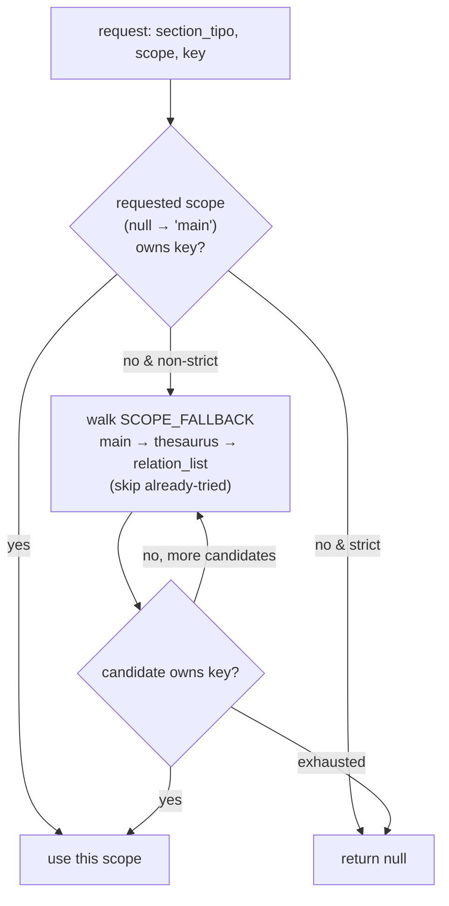
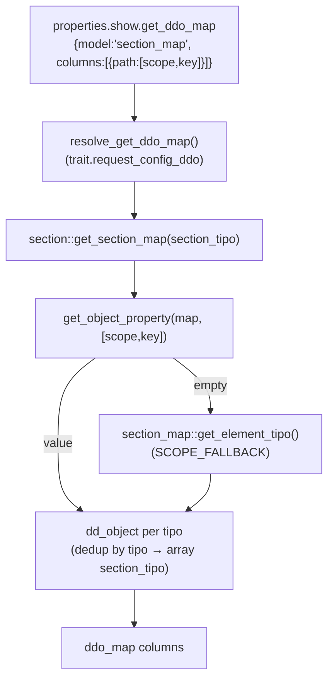

# section_map

> The global **scope/term resolver** — a stateless static service that reads a section's ontology `section_map` property and answers "which component tipos play role *X* (term, model, order, parent, is_indexable, …) for this section, under scope *Y*?", applying a `main → thesaurus → relation_list` fallback chain.

> See also: [common](../system/common.md) · [section](../sections/section.md) · [request_config](../request_config.md) · [relation_list](relation_list.md) · [ts_object](ts_object.md) · [hierarchy](hierarchy.md)

This page is the **class-level reference** for the `section_map` resolver
(`core/section/class.section_map.php`) and its client mirror
(`core/common/js/section_map.js`). It documents the resolution contract — the
scope fallback chain, the per-key walk, and the separator-travels-with-term rule
— plus where the term **string** cache lives (it does *not* live here) and how
`request_config` consumes the `section_map` model to build a dynamic `ddo_map`.

## Role

`section_map` (`class section_map`) is a **pure static service**: no instance
state, no constructor, no instance cache of its own. Every method takes a
`section_tipo` (and usually a `scope`) and reads the raw map through
`section::get_section_map()`, which is the single owner of the raw-map cache.

A *section map* is an ontology-defined object stored as the `properties` of a
section's first-level `section_map` child element. It maps **semantic roles** to
component tipos, grouped by **scope**. Historically only the `thesaurus` scope
existed (the thesaurus tree needed to know which component held the term, which
held the parent, etc.); this class generalizes that to any scope so a single
mechanism serves the thesaurus tree, relation lists, graph/visualization views,
search and dynamic `ddo_map` generation.

```json
{
  "main":          { "term": ["tch22"] },
  "thesaurus":     { "term": ["tch22","tch25"], "fields_separator": " ",
                     "model": "tch27", "order": "tch276", "parent": "tch38",
                     "is_indexable": "tch68", "is_descriptor": "tch67" },
  "relation_list": { "term": ["tch21","tch25","tch32"] }
}
```

Each top-level key (`main`, `thesaurus`, `relation_list`, …) is a **scope node**.
Inside a scope node, each key (`term`, `model`, `order`, `parent`,
`is_indexable`, `is_descriptor`, …) is a **role**, whose value is one component
tipo, an array of tipos, or a boolean flag. `fields_separator` is the optional
glue string used when joining multiple `term` values (default `', '`).

!!! note "Where the resolver lives vs. where the file lives"
    The PHP class is at `core/section/class.section_map.php` (it depends on
    `section::get_section_map()`), while the client mirror is at
    `core/common/js/section_map.js`. The two are a deliberate
    PHP↔JS pair implementing the same resolution rules.

## Responsibilities

- **Raw map access** — `get_map()` is a thin delegate to
  `section::get_section_map()`; the resolver never caches the raw map itself.
- **Scope resolution** — pick the scope node to use for a request, applying the
  fallback chain (`resolve_scope_name()`, `get_scope()`).
- **Per-key resolution** — find the first scope that actually *owns* a role key,
  skipping present-but-key-less scopes (`resolve_key_scope()`,
  `get_element_tipo()`, `get_first_element_tipo()`, `get_term_tipos()`).
- **Separator resolution** — return the `fields_separator` from the same scope
  that supplied `term` (`get_fields_separator()`).
- **Term resolution entry points** — `get_term()` / `get_term_data()` are the
  global, public-facing entry points for turning a locator into a label string
  or merged raw dato. They **delegate to `ts_term_resolver`**, which owns the
  term cache (see [Where the term cache lives](#where-the-term-cache-lives)).

## Key concepts

### Scope vs. per-key resolution

There are two distinct resolution levels, and the difference is the heart of
this class:

| level | method | a scope node that exists but lacks the key is… |
| --- | --- | --- |
| **scope** | `resolve_scope_name()` / `get_scope()` | **returned** (the node exists, that's enough) |
| **per-key** | `resolve_key_scope()` (and everything built on it) | **skipped** (the walk continues until a scope *owns* the key) |

So `get_scope($tipo, null)` returns the `main` node if `main` exists, even if it
is empty; but `get_element_tipo($tipo, 'term', null)` walks **past** an empty
`main` to `thesaurus` because `main` does not own `term`. The per-key check uses
`property_exists()` (PHP) / `hasOwnProperty` (JS) — never an inherited or
truthiness check — so a role whose value is boolean `false` (e.g.
`is_indexable: false`) still counts as "present" and must pass through unchanged.

### The scope fallback chain

```
SCOPE_FALLBACK = ['main', 'thesaurus', 'relation_list']
```

Resolution order for any request:

1. Try the **requested** scope first. A `null` scope defaults to `'main'`.
2. If absent (scope-level) or key-less (per-key level), walk `SCOPE_FALLBACK`
   in order, **skipping the already-tried scope**.
3. `strict=true` disables the chain — only the exact requested scope is
   considered, and resolution returns `null` if it is absent.

A scope candidate only qualifies when it is an **object** (guards malformed
ontology JSON where a scope key maps to `null` or a string).



### The separator travels with the term

`get_fields_separator()` does **not** read the separator from the requested
scope. It first resolves *which scope supplied `term`* (via the same per-key
walk), then reads `fields_separator` from **that** scope. This keeps the join
glue self-consistent: if a section overrides `term` in `relation_list` but not in
`thesaurus`, the `relation_list` separator is used to join those term values —
not whatever `thesaurus` happened to declare. Falls back to
`DEFAULT_FIELDS_SEPARATOR` (`', '`) when the winning term-scope defines no
string separator.

### Where the term cache lives

`section_map` resolves *configuration* (tipos, scopes, separators). The
expensive part — instantiating the `term` component(s), reading their values per
language and joining them into a string — is done by
[`ts_term_resolver`](ts_object.md) (`core/ts_object/class.ts_term_resolver.php`).
`section_map::get_term()` / `get_term_data()` are thin delegates to it.

The **request-scope term-string cache lives entirely in `ts_term_resolver`**,
not in `section_map`:

- `ts_term_resolver::$term_by_locator_data_cache` is keyed
  `"{section_tipo}_{section_id}_{scope}_{lang}"` (the `scope` segment is the
  empty string when the caller passed `null`, i.e. chain mode).
- It is bounded to 1000 entries and **fully dropped on overflow** (no LRU).
- `ts_term_resolver::invalidate_node($section_tipo, $section_id)` evicts by the
  `"{tipo}_{id}_"` prefix so every lang × scope combination for a node goes
  together after a tree write.
- `ts_term_resolver::clear()` is registered in the worker `cache_manager`
  (RoadRunner) so persistent workers never bleed cached terms across requests.

`ts_term_resolver` in turn calls back into `section_map::get_term_tipos()` and
`section_map::get_fields_separator()` to learn *what* to resolve. So the data
flow is: **section_map (config) → ts_term_resolver (values + cache) →
section_map (separator) → joined string.**

## Public API (PHP)

All methods are `static`. Verified against `core/section/class.section_map.php`.

### Constants

| constant | value | purpose |
| --- | --- | --- |
| `SCOPE_FALLBACK` | `['main', 'thesaurus', 'relation_list']` | Ordered priority list walked by the fallback chain. |
| `DEFAULT_FIELDS_SEPARATOR` | `', '` | Glue used to join multiple term values when a scope declares no `fields_separator`. |

### Raw map & scope resolution

| method | purpose |
| --- | --- |
| `get_map($section_tipo)` | The raw `section_map` object, delegating to `section::get_section_map()` (no independent cache). `null` when the section has no `section_map` child. |
| `resolve_scope_name($section_tipo, $scope=null, $strict=false)` | The **name** of the scope that resolves (requested-first, then `SCOPE_FALLBACK`). Scope must exist as an object. `null` when nothing matched. |
| `get_scope($section_tipo, $scope=null, $strict=false)` | The resolved scope **node** (object), via `resolve_scope_name()`. `null` when none resolved. |

### Per-key resolution

| method | purpose |
| --- | --- |
| `resolve_key_scope($section_tipo, $key, $scope=null, $strict=false)` | The name of the first scope that **owns** `$key` (`property_exists`), requested-first then chain. The core of per-key resolution: a present-but-key-less scope is skipped. |
| `get_element_tipo($section_tipo, $key, $scope=null)` | The raw value of `$key` from the first scope that provides it (`mixed`: string \| array \| bool \| null). **Never coerce to string** — boolean `false` is a valid `is_indexable` value. Always non-strict. |
| `get_first_element_tipo($section_tipo, $key, $scope=null)` | Single-tipo string convenience: array values collapse to their first element (`reset()`); `null` when absent, empty array, or non-string/non-array (e.g. a bool flag). |
| `get_term_tipos($section_tipo, $scope=null)` | Normalized zero-indexed **array** of `term` component tipos for the resolved scope (a scalar becomes a one-element array; `array_values()` re-indexes). Empty array when no scope owns `term`. |
| `get_fields_separator($section_tipo, $scope=null)` | The `fields_separator` from the **scope that supplied `term`** (not the requested scope). Falls back to `DEFAULT_FIELDS_SEPARATOR`; never `null`. |

### Term resolution (delegates to ts_term_resolver)

| method | purpose |
| --- | --- |
| `get_term($locator, $scope=null, $lang=DEDALO_DATA_LANG, $from_cache=false)` | The human-readable **string label** of a record. Delegates to `ts_term_resolver::get_term_by_locator()` (which owns the request-scope term cache). `null` when no term tipos were found. |
| `get_term_data($locator, $scope=null)` | The merged **raw dato array** across all `term` tipos of the resolved scope (no `$lang`; language-independent structured data). Delegates to `ts_term_resolver::get_term_data_by_locator()`. |

## Public API (JS mirror)

`core/common/js/section_map.js` is a pure-function mirror operating on a
`section_map` object received in the datum/section context
(`config.section_map` / a context item's `section_map`). It implements the same
scope/per-key/separator rules but does **not** resolve term values (the values
arrive in the datum; the client only needs the config logic).

| export | mirrors PHP | notes |
| --- | --- | --- |
| `SCOPE_FALLBACK` | `SCOPE_FALLBACK` | `['main', 'thesaurus', 'relation_list']` |
| `DEFAULT_FIELDS_SEPARATOR` | `DEFAULT_FIELDS_SEPARATOR` | `', '` |
| `resolve_scope_name(section_map, scope=null, strict=false)` | `resolve_scope_name()` | scope-level resolution |
| `get_scope(section_map, scope=null, strict=false)` | `get_scope()` | resolved scope node |
| `get_element_tipo(section_map, key, scope=null)` | `get_element_tipo()` | per-key raw value (always non-strict) |
| `get_term_tipos(section_map, scope=null)` | `get_term_tipos()` | normalized array (a `slice()` copy) |
| `get_fields_separator(section_map, scope=null)` | `get_fields_separator()` | separator from the term scope |

`resolve_key_scope` is an internal (non-exported) helper in the JS file, exactly
as in PHP it is the per-key engine behind `get_element_tipo` and
`get_fields_separator`. The JS `resolve_key_scope` / `get_element_tipo` use
`hasOwnProperty` so inherited `Object.prototype` keys are never mistaken for
config entries.

Known client consumers: `core/section/js/build_graph_data.js` (graph node labels
— `build_section_maps()` extracts maps from context, `resolve_label()` joins
term tipos with the map's own separator) and `core/search/js/render_search.js`
(`get_scope(section_map, 'thesaurus', true)` to detect a thesaurus section).

## How request_config uses the section_map model

`request_config` lets an ontology author build a `ddo_map` (the list of columns
to show) **dynamically** from the section_map instead of hardcoding every column.
A `show` / `search` / `choose` block may carry a `get_ddo_map` directive:

```json
{
  "show": {
    "get_ddo_map": {
      "model": "section_map",
      "columns": [
        { "path": ["thesaurus", "term"] },
        { "path": ["thesaurus", "model"], "mode": "list" }
      ]
    }
  }
}
```

This is resolved by `resolve_get_ddo_map()` in
`core/common/trait.request_config_ddo.php` (one of the `common`
request_config traits). For `model === 'section_map'` it:

1. For each resolved `section_tipo`, reads the raw map with
   `section::get_section_map()` (skipping section_tipos with no map).
2. For each column, takes its `path` (a `[scope, key]` pair) and looks the value
   up directly on the raw map object via `get_object_property()`.
3. **Scope fallback:** if that direct lookup is empty *and* the path is a 2-element
   `[scope, key]` whose scope is in `section_map::SCOPE_FALLBACK`, it retries via
   `section_map::get_element_tipo($section_tipo, $key, $scope)` — so a column path
   asking for `["thesaurus","term"]` still resolves when the section only defines
   `main.term`.
4. Normalizes the value to an array of component tipos and builds one
   `dd_object` per tipo (`set_tipo` / `set_section_tipo` / `set_parent`), applying
   any extra column properties (`mode`, `label`, …) via the matching `set_*`
   setters (`path` is skipped — it is a build-time directive, not a ddo field).
5. **Deduplicates:** when the same component tipo appears under multiple
   section_tipos, the existing ddo's `section_tipo` is extended into an array
   rather than emitting a duplicate ddo.

It returns `[]` (never `null`) when the directive is `false`, malformed, or
produces nothing, so the caller can merge the result into a literal `ddo_map`
without a null guard. Malformed directives also record a `drop` config warning
via `add_request_config_warning()`.



## Examples

### Resolve term tipos and join a multi-term label (server)

```php
// "thesaurus" scope, falling through the chain if absent
$term_tipos = section_map::get_term_tipos('tch1', 'thesaurus'); // e.g. ['tch22','tch25']
$separator  = section_map::get_fields_separator('tch1', 'thesaurus'); // e.g. ' '

// the usual path: let ts_term_resolver do the value read + caching
$loc = new locator();
    $loc->set_section_tipo('tch1');
    $loc->set_section_id(42);
$label = section_map::get_term($loc, 'thesaurus'); // joined string, cached in ts_term_resolver
```

### Per-key fallback and the boolean guard

```php
// 'main' exists but only declares 'term'; 'is_indexable' lives on 'thesaurus'
$scope = section_map::resolve_key_scope('tch1', 'is_indexable', null); // 'thesaurus'

// get_element_tipo must preserve boolean false (do NOT coerce to string)
$is_indexable = section_map::get_element_tipo('tch1', 'is_indexable', 'thesaurus'); // bool

// single-tipo consumers (order/parent/model writers) want a plain string
$parent_tipo = section_map::get_first_element_tipo('tch1', 'parent', 'thesaurus');
```

### Strict relation_list scope (no fallback)

```php
// relation_list grid columns must come from the relation_list scope only —
// a thesaurus/main fallback would render the wrong columns, so strict=true.
$rl_scope = section_map::get_scope('tch1', 'relation_list', true); // object|null
```

### Client label resolution (JS)

```js
import { get_term_tipos, get_fields_separator } from '../../common/js/section_map.js'

const section_map = datum.context_item?.section_map // arrives in the datum context
const term_tipos  = get_term_tipos(section_map)     // normalized array (chain from 'main')
// …read each term value from the datum, then:
const label = parts.join(get_fields_separator(section_map))
```

## How it fits with the rest of Dédalo

- **`section`** owns the raw map and its cache: `section::get_section_map()`
  finds the first-level `section_map` child element (trying the section as-is,
  then the resolved *real* section for virtual sections), reads its ontology
  `properties`, and caches the result in `section::$section_map_cache` (purged in
  `section::clear()`). Every `section_map` resolver method reads through it.
- **`ts_term_resolver`** ([ts_object](ts_object.md)) consumes
  `section_map::get_term_tipos()` / `get_fields_separator()` to build term
  strings, and **owns the term cache** that `section_map::get_term()` /
  `get_term_data()` delegate into. `ts_object` keeps thin static delegates
  (`ts_object::get_term_by_locator()` etc.) for backward compatibility.
- **`hierarchy`** wraps `section_map::get_first_element_tipo()` for its
  type/scope tipo lookups.
- **`relation_list`** ([relation_list](relation_list.md)) resolves its grid
  columns via `section_map::get_scope($tipo, 'relation_list', true)` (strict).
- **`component_relation_common`** detects thesaurus sections
  (`get_scope($tipo, 'thesaurus')`) and reads term data
  (`get_term_tipos` / `get_term_data`) for typology/model resolution.
- **`request_config`** ([request_config](../request_config.md#get_ddo_map--dynamic-ddo_map))
  uses the `section_map` model in `resolve_get_ddo_map()` to build dynamic
  `ddo_map` columns, with the same `SCOPE_FALLBACK` chain.

## Related

- [common](../system/common.md) — the request_config pipeline (and its traits)
  that hosts `resolve_get_ddo_map()`.
- [section](../sections/section.md) — owns `get_section_map()`, the raw map
  source and cache, plus virtual→real section resolution.
- [request_config](../request_config.md#get_ddo_map--dynamic-ddo_map) — the
  `get_ddo_map` directive that consumes the section_map model.
- [relation_list](relation_list.md) — uses the strict `relation_list` scope for
  its grid columns.
- [ts_object](ts_object.md) — the thesaurus tree node builder and
  `ts_term_resolver`, the owner of the term-string cache `section_map` delegates
  into.
- [hierarchy](hierarchy.md) — thin wrapper over `get_first_element_tipo()`.
- [Locator](../locator.md) — the pointer type passed to `get_term()` /
  `get_term_data()`.
