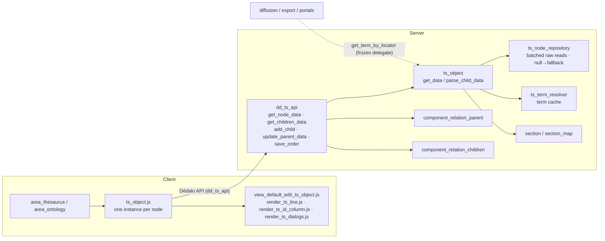

# ts_object

> The thesaurus/ontology **tree node** — the server-side builder that turns one term record into a renderable tree row, plus the client widget that owns one DOM node of the tree.

> See also: [Thesaurus & Ontology tree](../thesaurus/index.md) (the conceptual model) · [hierarchy](hierarchy.md) · [component_relation_parent](../components/component_relation_parent.md) · [component_relation_children](../components/component_relation_children.md)

This page is the **developer reference** for the `ts_object` subsystem. For the
conceptual model — *what a thesaurus tree is*, the bottom-up parent storage rule,
the section map and the `ddo_map` row definition — read
[Thesaurus & Ontology tree](../thesaurus/index.md) first; this document does not
repeat that material at length and instead documents the real classes, their
public API and how the pieces wire together.

`ts_object` is **not one class but a small subsystem**: a server node builder
(`ts_object` PHP), two server helpers it owns (`ts_term_resolver`,
`ts_node_repository`), and a client widget (`ts_object.js` + its view files).

## Role

`ts_object` builds the representation of **one node** of a thesaurus/ontology
tree — a single term record rendered as a tree row. A thesaurus tree is not a
bespoke data structure: every row is an ordinary [section](../sections/index.md)
record (`es1_42`, `ts1_7`, …), and `ts_object` is the object that reads that
record's role components (term, descriptor flag, indexable flag, order, children
link, indexation count) through the section map and emits the node shape the
client tree consumes.

On the **server**, `class ts_object` (`core/ts_object/class.ts_object.php`,
~1324 lines) is a plain PHP class — it does **not** extend `common` or any
component class; it composes `section`, `component_common`, `section_map`,
`ontology_node` and `hierarchy` instead. It is driven by the
`dd_ts_api` API class (`core/api/v1/common/class.dd_ts_api.php`), which
instantiates it for the `get_node_data` / `get_children_data` read actions.

On the **client**, `ts_object.js` (`core/ts_object/js/ts_object.js`) is a
no-framework ES-module instance class: one JS instance owns one DOM node and all
its expand / collapse / search / move / delete behavior.

Relative to neighbouring subsystems:

| subsystem | relationship |
| --- | --- |
| **[`section`](../sections/section.md)** | Every tree row *is* a section record. `ts_object` resolves children, the section map and permissions through `section`. |
| **[`hierarchy`](hierarchy.md)** | Describes a whole tree (TLD, typology, root terms). `ts_object` reads the order component tipo through `hierarchy::get_element_tipo_from_section_map()`. |
| **`section_map`** | The role-to-component map (`term`/`parent`/`order`/`is_descriptor`/`is_indexable`/`model`). `ts_object` and its helpers resolve every role through it. |
| **[`component_relation_parent`](../components/component_relation_parent.md) / [`component_relation_children`](../components/component_relation_children.md)** | The edge model: the *child* stores the parent locator; children are computed by querying who points at the parent. `ts_object` only **reads** them — all writes go through [`dd_ts_api`](../thesaurus/index.md#tree-mutations). |
| **[`component_relation_index`](../components/component_relation_index.md)** | The "U" indexations icon: `ts_object` counts indexations against the term to build the icon value. |
| **Diffusion / export / portals** | Consume `ts_term_resolver` through the frozen `ts_object::get_term_by_locator()` / `get_term_data_by_locator()` static delegates. |

!!! warning "`ts_object` reads; it never mutates the tree"
    The PHP `ts_object` class is **read-only**: it builds node data and counts.
    All tree mutations (add child, move/`update_parent_data`, reorder, delete)
    live in [`dd_ts_api`](../thesaurus/index.md#tree-mutations), inside
    `DBi::transaction()` with per-node advisory locks and the cycle guard. The
    only state `ts_object` *changes* is its own static caches (and only via
    `invalidate_node()` / `clear()`).

## Responsibilities

- **Build one node's data** — read the `section_list_thesaurus` `ddo_map`,
  resolve each element (term, icons, link_children) through its component, and
  emit the node object the client renders (`get_data()`).
- **Resolve and paginate children** — given a parent, compute its children
  locators through `component_relation_children`, count them with an SQL count,
  and turn each child into a node (`get_children_data()` → `parse_child_data()`).
- **Resolve node flags** — `is_descriptor` (descriptor vs ND),
  `is_indexable`, the per-parent `order`, and whether a node *has* descriptor /
  ND children (`is_indexable()`, `has_children_of_type()`).
- **Count indexations** — for the "U" icon, count records that index the term
  (and, in the recursive variant, the term plus all its descendants).
- **Resolve permissions** — the per-node `button_new` / `button_delete`
  permission integers (`get_permissions_element()`).
- **Term resolution (delegated)** — resolve a term string / raw data from a
  locator via `ts_term_resolver`, with a request-scope cache. `ts_object` keeps
  static delegates so diffusion/export/portal callers are unaffected.
- **Batched raw reads (delegated)** — kill the N+1 component loads on wide nodes
  via `ts_node_repository` (one SQL query per section group), with a strict
  fallback contract.
- **Cache hygiene** — targeted eviction after mutations (`invalidate_node()`)
  and a full reset between worker requests (`clear()`).
- **Client widget (`ts_object.js`)** — own one DOM node: expand/collapse state,
  child loading + dedup, rendering, search-path opening, drag-and-drop move,
  delete, indexation grid, order editing, and instance lifecycle.

## Files & structure

```text
core/ts_object/
├── class.ts_object.php             server node builder (this subsystem's core)
├── class.ts_term_resolver.php      term string/data resolution + request-scope term cache
├── class.ts_node_repository.php    batched raw matrix reads (N+1 killer) with fallback contract
├── css/
└── js/
    ├── ts_object.js                instance class: API, state, expand/search/move/delete
    ├── view_default_edit_ts_object.js  render / render_children / render_child / render_wrapper / pagination
    ├── render_ts_line.js           row elements (term, icons, link_children); model-based dispatch
    ├── render_ts_id_column.js      the id/order column + the inline order form
    ├── render_ts_dialogs.js        the delete-term dialog
    ├── render_edit_ts_object.js    the edit/search entry (assigned to .edit / .search)
    └── drag_and_drop.js            drag-and-drop move wiring
```

!!! note "Two helpers are explicitly required, not autoloaded"
    `class.ts_object.php` opens with two `require_once` lines pulling in
    `ts_node_repository` and `ts_term_resolver`. They live in the same directory
    but deliberately sit **outside** the one-class-per-directory autoload
    convention, so they must be loaded explicitly. Their public method
    signatures are frozen because external callers (and `ts_object`'s own static
    delegates) depend on them.

The API surface that drives the server side is
`dd_ts_api` (`core/api/v1/common/class.dd_ts_api.php`): read actions
`get_node_data`, `get_children_data`; mutations `add_child`,
`update_parent_data`, `save_order`. See
[Tree mutations](../thesaurus/index.md#tree-mutations).

## Data model

### The node object (`get_data()` output)

The unit `ts_object` produces is a flat node object (built in `get_data()`):

```json
{
    "section_tipo"  : "es1",
    "section_id"    : "42",
    "ts_id"         : "es1_42",
    "ts_parent"     : "es1_5",
    "order"         : 3,
    "mode"          : "list",
    "lang"          : "lg-eng",
    "is_descriptor" : true,
    "is_indexable"  : true,
    "children_tipo" : "hierarchy49",
    "has_descriptor_children" : true,
    "ar_elements"   : [
        { "type": "term", "tipo": "hierarchy25", "value": "Valencia", "model": "component_input_text" },
        { "type": "icon", "tipo": "hierarchy40", "value": "U:37", "model": "component_relation_index", "count_result": { "total": 37, "totals_group": [ ] } },
        { "type": "link_children", "tipo": "hierarchy49", "value": "button show children", "model": "component_relation_children" }
    ],
    "permissions_button_new"    : 2,
    "permissions_button_delete" : 2
}
```

- **`ts_id` / `ts_parent`** are the node identity: `"{section_tipo}_{section_id}"`
  (`ts_parent` is `null`/the area for roots). They are the same identity the
  client uses.
- **`ar_elements`** is the resolved tree row, one entry per `ddo_map` element
  that survives processing. Element `type` ∈ `term` | `icon` | `img` |
  `link_children` | `link_children_nd` (the last one is **synthesized** by
  `ts_object` when a node has ND children).
- **`is_descriptor`** starts `true` and is flipped to `false` when the `ND`
  icon's component resolves to "no" (`section_id === 2`); at that point the term
  is also marked as ND via `set_term_as_nd()`.
- **`children_tipo`** is the `component_relation_children` tipo, captured from
  the `link_children` element — it is set to `null` for non-descriptors (ND
  terms carry no children config).

### `ar_elements` value rules (per element type)

These are the real rules in `resolve_element_value()` / `format_component_data()`:

| element | how its value is built |
| --- | --- |
| `term` | First value of the term component(s); empty terms fall back to `get_component_data_fallback()` and are wrapped by `component_common::decorate_untranslated()`. Multiple term tipos are concatenated with a single space. |
| `icon` `ND` | Consumed server-side: sets `is_descriptor=false` + marks the term as ND, then **skips** the element (never rendered as an icon). |
| `icon` `CH` | Always skipped. |
| `icon` `U` (model `component_relation_index`) | Value becomes `"U:{total}"` from `get_count_data_group_by()`; zero-use icons are dropped. The element also carries a `count_result` whose `totals_group` keys are enriched with their section labels. The legacy `component_relation_struct` legacy-model is excluded. |
| `icon` (other) | Rendered only when the component has data; empty icons are skipped. |
| `link_children` | Sets `children_tipo` and `has_descriptor_children`; value is `"button show children"` or `"button show children unactive"`. If the node also has ND children, an extra `link_children_nd` element is appended. |
| `component_portal` / `component_autocomplete_hi` | Each locator value is replaced by its resolved term string (`ts_object::get_term_by_locator(..., from_cache:true)`). |
| `component_relation_related` | Bidirectional relations also append the inverse references (`get_references()`). |
| `component_svg` | Value is the file URL (cache-busted) when the file exists, else empty. |

### The term cache (in `ts_term_resolver`)

`ts_term_resolver` holds the **only** term cache,
`$term_by_locator_data_cache`, keyed
`"{section_tipo}_{section_id}_{scope}_{lang}"`. It is request-scoped, self-caps
at 1000 entries, evicts per node on the `"{tipo}_{id}_"` prefix
(`invalidate_node()`), and is fully cleared by `clear()`. `ts_object` does **not**
duplicate this cache — it only keeps a separate `resolved_child_cache` (sqo-hash
keyed) for the recursive indexation search.

## Instantiation & lifecycle (server)

The server class is instantiated directly with `new` (it has **no**
`get_instance` factory — the JS class does, see below):

```php
public function __construct(
    int|string  $section_id,            // the term record id        (mandatory)
    string      $section_tipo,          // the thesaurus section tipo (mandatory)
    ?object     $options    = null,     // order / is_indexable / model / have_children / area_model …
    string      $mode       = 'edit',
    ?string     $ts_parent  = null      // parent node id "{tipo}_{id}", or null for roots
)
```

The constructor sets `ts_id = "{section_tipo}_{section_id}"`, stores
`$options`, the mode and `ts_parent`, and seeds `order` from `$options->order`.
There is no DB access in the constructor.

```php
// Build one node and read its first element value
$ts_obj = new ts_object($section_id, $section_tipo);
$data   = $ts_obj->get_data();
echo $data->ar_elements[0]->value; // e.g. "Valencia"
```

`$options` is the per-node configuration bag. The flags `ts_object` reads from
it: `order`, `is_indexable` (prefetched), `model` (boolean — ontology "model"
view), `have_children` (forced-children case, e.g. persons), and `area_model`
(`'area_ontology'` switches `is_ontology()` on).

Most accessors are dynamic: the magic `__call` exposes `get_*` / `set_*` for any
real property (e.g. `get_section_tipo()`, `set_order(...)`).

## Public API (server)

Grouped by concern. *static?* marks class-level (static) methods.

### Node building & children

| method | static? | purpose |
| --- | --- | --- |
| `get_data()` | | Build the node object (above): iterate the `ddo_map`, resolve every element, compute `is_descriptor`/`is_indexable`/`children_tipo`/`has_descriptor_children` and the button permissions. |
| `get_children_data($options)` | | Resolve, count (SQL) and paginate a parent's children through `component_relation_children`, then turn each into a node via `parse_child_data()`. Returns `{result:{ar_children_data,pagination}, msg, errors}`. |
| `parse_child_data($locators, $area_model='area_thesaurus', $ts_object_options=null)` | ✓ | Turn an array of child locators into node objects. **Prefetches** order + `is_indexable` in one batched query (`ts_node_repository::fetch_node_info`) and falls back to a per-child component load when the batch returns `null`. Used directly by `dd_ts_api`. |
| `get_ar_elements($section_tipo, $model=false)` | ✓ | Read the `section_list_thesaurus` `ddo_map` for the section, with **virtual→real** section fallback and the `link_children` / `link_children_model` handling for the ontology "model" view. |

### Node flags & predicates

| method | static? | purpose |
| --- | --- | --- |
| `is_indexable($section_tipo, $section_id)` | ✓ | Resolve the `is_indexable` flag: hierarchy/ontology roots are never indexable; missing/false section_map → false; else read the first `is_indexable` locator (`section_id===1` ⇒ true). |
| `has_children_of_type($ar_children, $type)` | | Whether any child is a `descriptor` (1) or `nd` (2). Batched via `ts_node_repository::batch_descriptor_flags` with a per-`section_tipo` local-cache fallback. Empty children + `options->have_children` forces the descriptor case. |
| `is_ontology()` | | Whether this node runs in the ontology area (`options->area_model === 'area_ontology'`). |

### Indexations & permissions

| method | static? | purpose |
| --- | --- | --- |
| `get_count_data_group_by($component, $section_list_thesaurus_item)` | | Count indexation callers grouped by section. With `show_data:'children'` it first resolves the term's children **recursively** (a cached `search_query_object` with `filter_by_locators` + `children_recursive`) and counts the whole branch. |
| `get_permissions_element($element_name)` | | Resolve the integer permission for `'button_new'` / `'button_delete'` (special-cased for hierarchy/thesaurus root sections), or any other element model (recursive child lookup). |

### Term resolution (delegates to `ts_term_resolver`)

| method | static? | purpose |
| --- | --- | --- |
| `get_term_by_locator($locator, $lang=DEDALO_DATA_LANG, $from_cache=false)` | ✓ | **Delegate** → `ts_term_resolver::get_term_by_locator()`. The string term for a locator. Signature frozen (diffusion/export/portal callers). |
| `get_term_data_by_locator($locator)` | ✓ | **Delegate** → `ts_term_resolver::get_term_data_by_locator()`. The merged raw component data across the scope's term tipos. |
| `resolve_locator($locator, $lang=DEDALO_DATA_LANG, $from_cache=false)` | | Instance alias of `get_term_by_locator()`. |
| `get_component_order_tipo($section_tipo)` | ✓ | The order component tipo (alias of `hierarchy::get_element_tipo_from_section_map(..., 'order', 'thesaurus')`). |

### Cache management

| method | static? | purpose |
| --- | --- | --- |
| `invalidate_node($section_tipo, $section_id)` | ✓ | Targeted eviction after a mutation: evict the node's term cache (`ts_term_resolver::invalidate_node`) and wipe `resolved_child_cache`. |
| `clear()` | ✓ | Full reset (`ts_term_resolver::clear()` + wipe `resolved_child_cache`). Registered in `worker/class.cache_manager.php` under `'ts_object'` so persistent workers never serve stale tree data. |

### Misc

| method | static? | purpose |
| --- | --- | --- |
| `set_term_as_nd(&$ar_elements)` | ✓ | Mark the `term` element of a node as a non-descriptor (used when the ND flag resolves to "no"). |

!!! note "Protected build helpers"
    `get_data()` is decomposed into protected helpers —
    `process_element_details()`, `load_component_instance()`,
    `format_component_data()`, `resolve_element_value()` — which carry the
    per-element-type rules tabulated under [Data model](#data-model). They are
    implementation detail, not API.

### `ts_term_resolver` — public API

| method | static? | purpose |
| --- | --- | --- |
| `get_term_by_locator($locator, $lang=DEDALO_DATA_LANG, $from_cache=false, $scope='thesaurus')` | ✓ | Resolve the term **string**: gather the scope's term tipos (`section_map::get_term_tipos`), read each component value (with main-lang fallback), join with the scope separator. Falls back to a locator-string id when no term map exists. Caches per scope+lang. |
| `get_term_data_by_locator($locator, $scope='thesaurus')` | ✓ | Resolve the merged **raw** component data across the scope's term tipos. |
| `invalidate_node($section_tipo, $section_id)` | ✓ | Evict all cache keys for one node (all langs/scopes) on the `"{tipo}_{id}_"` prefix. |
| `clear()` | ✓ | Full cache reset (worker hygiene). |

!!! note "Scope defaults to `'thesaurus'`"
    Both resolvers default `$scope='thesaurus'` to preserve historical
    behavior; passing `null` walks the section_map scope chain. The cache key is
    scope-aware to avoid cross-scope pollution.

### `ts_node_repository` — public API

The N+1 killer for wide nodes. **Contract: every public method returns `null`
when anything cannot be resolved (unknown table, missing section_map, query
failure), and the caller MUST run the legacy per-component path.** Output parity
with the legacy reads — *types included* — is gated by
`test/server/ts_object/ts_node_repository_Test.php` and `ts_object_Test.php`.

| method | static? | purpose |
| --- | --- | --- |
| `fetch_node_info($locators)` | ✓ | One query per `section_tipo` group resolving `order` (number column) + `is_indexable` (relation column). Returns a map `"{tipo}_{id}" → {order, is_indexable}` or `null`. Order is passed through `format_number_value()` so it matches `component_number` formatting exactly. |
| `batch_descriptor_flags($locators)` | ✓ | One query per group resolving the `is_descriptor` flag (first locator's `section_id`, `1`|`2`). Returns a map of `int|null` flags or `null`. |

!!! warning "Raw reads must mirror component semantics"
    The repository reads the raw `number` / `relation` JSONB containers
    directly, but it must reproduce the component path *exactly*: order uses the
    first `number` item's `value` formatted like `component_number`; the
    indexable/descriptor flags read the **first** locator's `section_id`. The
    parity tests are the contract — never ship repository changes without them
    green.

## Client widget (`ts_object.js`)

`ts_object.js` is a no-framework ES-module instance class. One instance owns one
DOM node; instances are cached in the global instances map.

### Instance key

```javascript
const key_order = ['section_tipo','section_id','children_tipo','target_section_tipo','thesaurus_mode','ts_parent']
```

`get_instance(options)` builds the key with `key_instances_builder(options)` and
returns a cached instance when present (refreshing its `caller`), otherwise
builds, registers and initializes a new one. **`ts_parent` is part of the key on
purpose**: the same term visible under two parents is two nodes and must not
steal each other's DOM.

### Public methods (selected, verified)

| method | purpose |
| --- | --- |
| `init(options)` / `build(autoload=false)` | Initialize the instance and (optionally) load + render its data. |
| `get_node_data()` | Fetch this node's data from `dd_ts_api.get_node_data`. |
| `get_children_data(options)` | Fetch children from `dd_ts_api.get_children_data`, **deduping** concurrent requests with the same signature (`children_request` / `children_request_signature`). |
| `set_open(is_open, {persist, force_reload})` | **The only** expand/collapse entry point. Flips `is_open` synchronously, lazy-loads + renders children when empty (or on force reload), projects to the DOM via `sync_open_dom()`, and persists the state. |
| `sync_open_dom()` | The **only** place the `open` / `hide` classes change. |
| `render_children(options)` / (view) `render_child` | Build child nodes into `DocumentFragment`s and attach synchronously; register children in the parent's `ar_instances`. |
| `update_children_state(options)` | Re-fetch/re-render children and refresh content after a change. |
| `get_children_recursive(options)` | Resolve all descendants (used by the recursive indexation button). |
| `add_child()` | Create a child term via `dd_ts_api.add_child`. |
| `update_parent_data(options)` | Move this node to a new parent via `dd_ts_api.update_parent_data` (source props `new_parent_*` / `old_parent_*`). |
| `swap_parent(options)` | Apply a move client-side; triggers `rekey()`. |
| `rekey()` | After `ts_parent` changes: delete old instance key → rebuild → re-add, migrate persisted status and `ar_instances` membership, sync `node.dataset.id`. |
| `save_order(value)` | Persist sibling order via `dd_ts_api.save_order`. |
| `toggle_nd(button_obj)` | Toggle the ND-children view. |
| `delete_term(options)` | Delete the term (and destroy self + persisted status); callers must capture `self.caller` **before** calling it. |
| `show_indexations(options)` | The "U" button: render a **`dd_grid` with view `'indexation'`** into the row's `indexations_container` (toggle on second click; grid cached per button). Does **not** open the component. |
| `show_component_in_ts_object(options)` | The generic "open this element's component inline" path (the default ts-line dispatch). |
| `parse_search_result(data, to_hilite)` | Orchestrate search-result rendering: `build_search_instances` → `hierarchize_search_instances` (orphans reported, never dropped) → `open_search_branches` (top-down recursion) → `hilite_search_results`. |
| `open_record(section_id, section_tipo)` | Open the term's full record in an edit window. |
| `refresh_element(hilite, callback)` / `hilite_element()` / `reset_hilites()` | Re-render / highlight a single row. |

!!! warning "ts-line dispatch is by model, not type"
    `component_relation_index` ("U") elements arrive with `type:'icon'` like any
    other icon. `render_ts_line.js` must dispatch them by
    `model === 'component_relation_index'`; matching by `type` silently routes
    the U button to the generic open-component path. See
    [Indexations](../thesaurus/index.md#indexations-the-u-button).

## How it fits with the rest of Dédalo



1. **Read flow.** The client `ts_object.js` calls `dd_ts_api.get_node_data` /
   `get_children_data`. The API builds a server `ts_object` (or calls the static
   `parse_child_data`), which resolves each row through `section_map` +
   `component_common`, batching the hot reads through `ts_node_repository`.
2. **Edge model.** A node's children are never stored — they are computed by
   [`component_relation_children`](../components/component_relation_children.md)
   searching who points at the parent via the
   [`component_relation_parent`](../components/component_relation_parent.md)
   locator. `ts_object` only reads this; the mutation classes write it.
3. **Term resolution.** The string shown for a portal/select/autocomplete value
   anywhere in Dédalo (the work UI, exports, diffusion) flows through
   `ts_term_resolver` via the frozen `ts_object::get_term_by_locator()` delegate.
4. **Worker hygiene.** `ts_object::clear()` (which clears `ts_term_resolver` too)
   is registered in `worker/class.cache_manager.php` so a long-running worker
   never serves a previous request's tree state.

## Examples

### Build one node's data (server)

```php
$ts_obj = new ts_object(42, 'es1');
$node   = $ts_obj->get_data();

$node->ts_id;          // "es1_42"
$node->is_descriptor;  // true
$node->children_tipo;  // "hierarchy49" (null if non-descriptor)
$node->ar_elements[0]; // { type:"term", tipo:"hierarchy25", value:"Valencia", model:"component_input_text" }
```

### Turn child locators into nodes (the API path)

```php
// $children = component_relation_children->get_data() (array of parent→child locators)
$ar_children_data = ts_object::parse_child_data(
    $children,
    'area_thesaurus'
);
// $ar_children_data is an array of node objects (same shape as get_data())
// order + is_indexable were prefetched in one batched query per section group
```

### Resolve a term string from a locator (used by diffusion/export/portal)

```php
$term = ts_object::get_term_by_locator($locator, DEDALO_DATA_LANG, true);
// delegates to ts_term_resolver; the second→nth call for the same node hits the cache
```

### Invalidate a node after a mutation

```php
// inside a successful add_child / move / reorder transaction:
ts_object::invalidate_node($section_tipo, $section_id);
// evicts the node's cached term strings and wipes resolved_child_cache
```

## Related

- [Thesaurus & Ontology tree](../thesaurus/index.md) — the conceptual model: bottom-up parent storage, the section map, the `ddo_map` row, mutations, indexations, and configuring a new thesaurus section. **Read this first.**
- [hierarchy](hierarchy.md) — the per-tree descriptor (TLD, typology, root terms) and the order/section-map helpers `ts_object` calls.
- [section](../sections/section.md) — every tree row is a section record; `get_section_map()` / children resolution live here.
- [component_relation_parent](../components/component_relation_parent.md) — the stored upward edge (the cycle guard's home).
- [component_relation_children](../components/component_relation_children.md) — the computed downward edge (`use_db_data=false`); supplies `count_children()`.
- [component_relation_index](../components/component_relation_index.md) — the indexation backlinks behind the "U" icon.
- [component_portal](../components/component_portal.md) — the canonical related component whose values `ts_object` resolves to term strings.
- [Locator](../locator.md) — the pointer type every edge and term value is built from.
