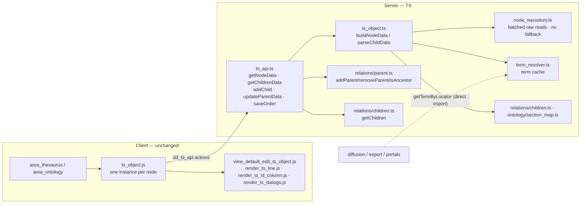

# ts_object

> The thesaurus/ontology **tree node** — the server-side builder that turns one term record into a renderable tree row, plus the client widget that owns one DOM node of the tree.

> See also: [Thesaurus & Ontology tree](../thesaurus/index.md) (the conceptual model) · [hierarchy](hierarchy.md) · [component_relation_parent](../components/component_relation_parent.md) · [component_relation_children](../components/component_relation_children.md)

This page is the **developer reference** for the `ts_object` subsystem. For the
conceptual model — *what a thesaurus tree is*, the bottom-up parent storage rule,
the section map and the `ddo_map` row definition — read
[Thesaurus & Ontology tree](../thesaurus/index.md) first; this document does not
repeat that material at length and instead documents the real TS modules, their
public functions and how the pieces wire together.

`ts_object` is **not one class but a small subsystem**, and the TS rewrite keeps
that shape while dropping the OOP wrapper: a server node builder
(`src/core/ts_object/ts_object.ts`), two server helpers it calls
(`term_resolver.ts`, `node_repository.ts`), a tree-search module
(`search.ts`), an API dispatch layer (`ts_api.ts`), and the **unchanged**
client widget (`client/dedalo/core/ts_object/js/ts_object.js` + its view
files, copied as-is by the rewrite).

## Role

`ts_object` builds the representation of **one node** of a thesaurus/ontology
tree — a single term record rendered as a tree row. A thesaurus tree is not a
bespoke data structure: every row is an ordinary [section](../sections/index.md)
record (`es1_42`, `ts1_7`, …), and the TS `ts_object` module reads that record's
role components (term, descriptor flag, indexable flag, order, children link,
indexation count) through the section map and emits the node shape the client
tree consumes.

On the **server**, PHP's `class ts_object` (~1324 lines, composing `section`,
`component_common`, `section_map`, `ontology_node` and `hierarchy`) becomes a
set of plain exported functions in `src/core/ts_object/ts_object.ts` —
`buildNodeData()`, `parseChildData()`, `getChildrenData()`, `getArElements()`,
`isIndexable()`, `hasChildrenOfType()` (private), `getPermissionsElement()`,
`getCountDataGroupBy()` — composing the resolver/relations/search primitives
directly instead of instantiating component objects (TS has none). It is
driven by `src/core/ts_object/ts_api.ts` (the TS port of `dd_ts_api`), which
the HTTP dispatch (`src/core/api/dispatch.ts`) forwards `get_node_data` /
`get_children_data` / mutations into.

On the **client**, `ts_object.js` is unchanged — the same no-framework
ES-module instance class from PHP-era Dédalo, one JS instance per DOM node.

Relative to neighbouring subsystems:

| subsystem | relationship |
| --- | --- |
| **[`section`](../sections/section.md)** | Every tree row *is* a section record. `ts_object.ts` resolves children, the section map and permissions through `src/core/relations/children.ts` and `ontology/section_map.ts`, and reads raw record columns directly (no component-object machinery). |
| **[`hierarchy`](hierarchy.md)** | Describes a whole tree (TLD, typology, root terms). The order component tipo is resolved via `getComponentOrderTipo()` (`relations/children.ts`), the TS equivalent of PHP's `hierarchy::get_element_tipo_from_section_map(..., 'order', 'thesaurus')` chain. |
| **`section_map`** | The role-to-component map (`term`/`parent`/`order`/`is_descriptor`/`is_indexable`/`model`). `ts_object.ts` and its helpers resolve roles through `ontology/section_map.ts`. |
| **[`component_relation_parent`](../components/component_relation_parent.md) / [`component_relation_children`](../components/component_relation_children.md)** | The edge model: the *child* stores the parent locator; children are computed by querying who points at the parent (`src/core/relations/children.ts`, `parent.ts`). `ts_object.ts` only **reads** them — all writes go through `ts_api.ts`. |
| **[`component_relation_index`](../components/component_relation_index.md)** | The "U" indexations icon: `getCountDataGroupBy()` counts indexations against the term via `countInverseReferences()` (`src/core/search/search_related.ts`) to build the icon value. |
| **Diffusion / export / portals** | Consume `term_resolver.ts` through `getTermByLocator()` / `getTermDataByLocator()` — plain exported functions, not "frozen static delegates" (there is no separate `ts_object` facade to freeze; callers import the term resolver directly). |

!!! warning "`ts_object.ts` reads; it never mutates the tree"
    The TS module is **read-only**, matching PHP: it builds node data and
    counts. All tree mutations (add child, move/`update_parent_data`, reorder,
    delete) live in `ts_api.ts`, inside `withTransaction()` with per-node
    advisory locks and a cycle guard (`isAncestor()`). The only state
    `ts_object.ts` *changes* is its own module-level cache (and only via
    `invalidateNode()`).

## Responsibilities

- **Build one node's data** — read the `section_list_thesaurus` `ddo_map`
  (`getArElements()`), resolve each element (term, icons, link_children)
  against the preloaded matrix record, and emit the node object the client
  renders (`buildNodeData()`).
- **Resolve and paginate children** — given a parent, compute its children
  locators through `getChildren()`/`countChildrenOrNull()`
  (`relations/children.ts`), and turn each into a node
  (`getChildrenData()` → `parseChildData()`).
- **Resolve node flags** — `is_descriptor` (descriptor vs ND, flipped inline
  during element resolution), `isIndexable()`, the per-parent `order`, and
  whether a node *has* descriptor/ND children (`hasChildrenOfType()`,
  private).
- **Count indexations** — for the "U" icon, count records that index the term
  (and, in the recursive variant, the term plus all its descendants) via
  `getCountDataGroupBy()`.
- **Resolve permissions** — the per-node `button_new`/`button_delete`
  permission integers (`getPermissionsElement()`).
- **Term resolution (delegated)** — resolve a term string/raw data from a
  locator via `term_resolver.ts`, with a request-scope cache.
- **Batched raw reads (delegated)** — kill the N+1 component loads on wide
  nodes via `node_repository.ts` (one SQL query per section group) — **with
  no legacy per-component fallback** (a deliberate TS divergence; see
  [Public API (server)](#ts_node_repositoryts)).
- **Cache hygiene** — targeted eviction after mutations (`invalidateNode()`
  in `ts_object.ts`, which also evicts the term cache); there is no
  "clear-all" worker-reset call to make, since every `dd_ontology` write
  already fans out through `clearOntologyDerivedCaches()`.
- **Client widget (`ts_object.js`)** — unchanged: own one DOM node,
  expand/collapse state, child loading + dedup, rendering, search-path
  opening, drag-and-drop move, delete, indexation grid, order editing, and
  instance lifecycle.

## Files & structure

```text
src/core/ts_object/
├── ts_object.ts          server node builder (this subsystem's core) — buildNodeData, parseChildData, getChildrenData, getArElements, isIndexable, getPermissionsElement, getCountDataGroupBy, invalidateNode
├── term_resolver.ts      term string/data resolution + request-scope term cache (getTermByLocator, getTermDataByLocator, invalidateNode, clearTermCache)
├── node_repository.ts    batched raw matrix reads (N+1 killer), NO legacy fallback (fetchNodeInfo, batchDescriptorFlags)
├── search.ts             tree search / ancestor-expansion (searchThesaurus, getHierarchyTermsSqo)
└── ts_api.ts             the TS port of dd_ts_api: getNodeData, getChildrenData, addChild, updateParentData, saveOrder

client/dedalo/core/ts_object/   (unchanged — vanilla-JS client, copied as-is)
├── css/
└── js/
    ├── ts_object.js                instance class: API, state, expand/search/move/delete
    ├── view_default_edit_ts_object.js  render / render_children / render_child / render_wrapper / pagination
    ├── render_ts_line.js           row elements (term, icons, link_children); model-based dispatch
    ├── render_ts_id_column.js      the id/order column + the inline order form
    ├── render_ts_dialogs.js        the delete-term dialog
    ├── render_edit_ts_object.js    the edit/search entry (assigned to .edit / .search)
    └── drag_and_drop.js            drag-and-drop move wiring
```

!!! note "No autoload distinction to preserve"
    PHP's note about `ts_node_repository`/`ts_term_resolver` being explicitly
    `require_once`'d rather than autoloaded (because they sit outside the
    one-class-per-directory convention) has no TS analog: `import` resolves
    every module explicitly and once, so there is no autoloader boundary to
    call out.

The API surface that drives the server side is `src/core/ts_object/ts_api.ts`
(read actions `get_node_data`, `get_children_data`; mutations `add_child`,
`update_parent_data`, `save_order`) — five actions, byte-parity envelopes and
verbatim `msg` strings, matching PHP's test-asserted contract. See
[Tree mutations](../thesaurus/index.md#tree-mutations).

## Data model

### The node object (`buildNodeData()` output)

The unit `ts_object.ts` produces is a flat `TsNodeData` object — same shape as
PHP's `get_data()`, property insertion order preserved for wire familiarity:

```json
{
    "section_tipo"  : "es1",
    "section_id"    : "42",
    "ts_id"         : "es1_42",
    "ts_parent"     : "es1_5",
    "order"         : 3,
    "mode"          : "list",
    "lang"          : "lg-eng",
    "is_descriptor" : true,
    "is_indexable"  : true,
    "children_tipo" : "hierarchy49",
    "has_descriptor_children" : true,
    "ar_elements"   : [
        { "type": "term", "tipo": "hierarchy25", "value": "Valencia", "model": "component_input_text" },
        { "type": "icon", "tipo": "hierarchy40", "value": "U:37", "model": "component_relation_index", "count_result": { "total": 37, "totals_group": [ ] } },
        { "type": "link_children", "tipo": "hierarchy49", "value": "button show children", "model": "component_relation_children" }
    ],
    "permissions_button_new"    : 2,
    "permissions_button_delete" : 2
}
```

- **`ts_id` / `ts_parent`** are the node identity: `"{section_tipo}_{section_id}"`
  (`ts_parent` is `null` for roots). Same identity the client uses. Note
  `section_id` on the wire is **always a string** — TS's `buildNodeData()`
  stamps `String(sectionId)`, matching PHP's locator-cast behavior.
- **`ar_elements`** is the resolved tree row, one entry per `ddo_map` element
  that survives processing. Element `type` ∈ `term` | `icon` | `img` |
  `link_children` | `link_children_nd` (the last one is **synthesized** by
  `resolveElementValue()` when a node has ND children).
- **`is_descriptor`** starts `true` and is flipped to `false` inline (inside
  `resolveElementValue()`'s `icon`/`ND` branch) when the ND icon's component
  resolves to "no" (`section_id === 2`).
- **`children_tipo`** is the `component_relation_children` tipo, captured from
  the `link_children` element — set to `null` for non-descriptors (ND terms
  carry no children config).

### `ar_elements` value rules (per element type)

These are the real rules in `resolveElementValue()` / `getComponentDataLang()`
(`ts_object.ts`) — a direct functional port of PHP's `resolve_element_value()`
/ `format_component_data()`:

| element | how its value is built | TS coverage |
| --- | --- | --- |
| `term` | First value of the term component(s); empty terms fall back to `componentDataFallbackValue()` (main-lang → `lg-nolan` → any non-empty), wrapped as `` `<mark>${value}</mark>` `` (the TS stand-in for `component_common::decorate_untranslated()`). | ✅ ported |
| `icon` `ND` | Consumed server-side: sets `data.is_descriptor = false`, then **skips** the element (never rendered as an icon). | ✅ ported |
| `icon` `CH` | Always skipped. | ✅ ported |
| `icon` `U` (model `component_relation_index`) | Value becomes `` `${icon}:${total}` `` from `getCountDataGroupBy()`; zero-use icons are dropped. The element also carries a `count_result` whose `totals_group` entries are enriched with their section labels (`termByTipo()`, a direct `dd_ontology.term` read — the tree's own local `ontology_node::get_term_by_tipo()` mirror, structure-lang-first). | ✅ ported |
| `icon` (other) | Rendered only when the component has data; empty icons are skipped. | ✅ ported |
| `link_children` | Sets `children_tipo` and `has_descriptor_children`; value is `'button show children'` or `'button show children unactive'`. If the node also has ND children, an extra `link_children_nd` element is appended. | ✅ ported |
| `component_portal` / `component_autocomplete_hi` | Each locator value is replaced by its resolved term string (`getTermByLocator(locator, DATA_LANG, true)`). | ✅ ported |
| `component_relation_related` | Bidirectional relations also append the inverse references (PHP `get_references()`). | **deferred** — a tree term is rarely a related component; ledgered in `ts_object.ts`'s coverage note. |
| `component_svg` | Value is the file URL (cache-busted) when the file exists, else empty. | **deferred** — needs media machinery. |
| indexation grid (tag-indexation, not the icon count) | — | **deferred** by plan scope decision — counts only are ported. |
| legacy `component_relation_struct` | Always skipped. | ✅ skip preserved (`model === 'box elements'` guard in `processElementDetails()`). |

### The term cache (in `term_resolver.ts`)

`term_resolver.ts` holds the **only** term cache, `termByLocatorCache`, keyed
`` `${section_tipo}_${section_id}_${scope}_${lang}` ``. It self-caps at 1000
entries (full-drop on overflow, no LRU — byte-identical eviction rule to
PHP), evicts per node on the `` `${tipo}_${id}_` `` prefix
(`invalidateNode()` in `term_resolver.ts`), and registers with
`clearOntologyDerivedCaches()` for a full flush. `ts_object.ts` does **not**
duplicate this cache — it only keeps a separate `resolvedChildCache`
(node-identity keyed, bounded 1000, full-drop on overflow) for the recursive
indexation search.

## Instantiation & lifecycle (server)

There is no class to instantiate — `buildNodeData()` is a plain `async
function` taking every input as an explicit parameter (no constructor state,
no magic accessors):

```ts
export async function buildNodeData(
	sectionTipo: string,
	sectionId: number | string,
	options: TsOptions,        // order / is_indexable / model / have_children / area_model
	tsParent: string | null,   // "{tipo}_{id}", or null for roots
	principal: Principal,      // the TS auth principal — permission checks need this explicitly
): Promise<TsNodeData>
```

```ts
// Build one node and read its first element value
import { buildNodeData } from 'src/core/ts_object/ts_object.ts';

const data = await buildNodeData('es1', 42, {}, null, principal);
data.ar_elements[0].value; // e.g. "Valencia"
```

`options` (`TsOptions`) is the per-node configuration bag — same fields as
PHP's `$options` stdClass: `order`, `is_indexable` (prefetched), `model`
(boolean — ontology "model" view), `have_children` (forced-children case,
e.g. persons), and `area_model` (`'area_ontology'` switches the ontology-area
behavior on). There is no PHP-style magic `__call` for dynamic `get_*`/`set_*`
— every field is a plain object property.

## Public API (server)

Grouped by concern, naming the real TS export and module in place of each PHP
method.

### `ts_object.ts` — node building & children

| PHP | TS | purpose |
| --- | --- | --- |
| `get_data()` | `buildNodeData(sectionTipo, sectionId, options, tsParent, principal)` | Build the node object: iterate the `ddo_map`, resolve every element, compute `is_descriptor`/`is_indexable`/`children_tipo`/`has_descriptor_children` and the button permissions. Preloads the record **once** for the whole element loop (an efficiency the PHP class-per-component model didn't have). |
| `get_children_data($options)` | `getChildrenData(sectionTipo, sectionId, childrenTipo, defaultLimit, areaModel, tsObjectOptions, pagination, principal)` | Resolve, count (SQL, via `countChildrenOrNull()` with a load-and-count fallback) and paginate a parent's children, then turn each into a node via `parseChildData()`. Returns `{result:{ar_children_data,pagination}, msg, errors}`. Refuses when `childrenTipo`'s model isn't `component_relation_children`. |
| `parse_child_data(...)` | `parseChildData(locators, areaModel, tsObjectOptions, parentLocator, principal)` | Turn an array of child locators into node objects. **Prefetches** order + `is_indexable` in one batched query (`fetchNodeInfo()`, parent-aware) and does **not** fall back per-child on a miss — a locator absent from the batch gets `order: null` directly (see the node_repository divergence below). |
| `get_ar_elements($section_tipo, $model=false)` | `getArElements(sectionTipo, model)` | Read the `section_list_thesaurus` `ddo_map` for the section, with virtual→real section fallback and the `link_children`/`link_children_model` handling for the ontology "model" view. |

### `ts_object.ts` — node flags & predicates

| PHP | TS | purpose |
| --- | --- | --- |
| `is_indexable($section_tipo,$section_id)` | `isIndexable(sectionTipo, sectionId)` | Hierarchy/ontology roots are never indexable; missing/false section_map `is_indexable` role → false; else read the first `is_indexable` locator (`section_id === 1` ⇒ true). |
| `has_children_of_type($ar_children,$type)` | `hasChildrenOfType(arChildren, type, options)` *(private)* | Whether any child is a `descriptor` (1) or `nd` (2). Batched via `batchDescriptorFlags()`. Empty children + `options.have_children` forces the descriptor case. |
| `is_ontology()` | — | Not ported as a standalone predicate; the equivalent check is inlined where `options.area_model === 'area_ontology'` matters (`getArElements()`). |

### `ts_object.ts` — indexations & permissions

| PHP | TS | purpose |
| --- | --- | --- |
| `get_count_data_group_by(...)` | `getCountDataGroupBy(sectionTipo, sectionId, componentTipo, ddoEntry)` | Count indexation callers grouped by section via `countInverseReferences()` (`search/search_related.ts`). With `show_data` on the ddo entry, first resolves the term's children **recursively** (`getChildrenRecursive()`, cached by node identity) and counts the whole branch. |
| `get_permissions_element($element_name)` | `getPermissionsElement(sectionTipo, elementName, principal)` | Resolve the integer permission for `'button_new'`/`'button_delete'` (special-cased for hierarchy/thesaurus root sections via `getPermissions()`), or any other element model (recursive child lookup via a local `dd_ontology` subtree walk). |

### `ts_object.ts` — term resolution

There is no PHP-style "frozen static delegate" layer — every caller
(diffusion, export, portals, `ts_object.ts` itself) imports
`term_resolver.ts` directly:

| PHP | TS | purpose |
| --- | --- | --- |
| `get_term_by_locator(...)` | `getTermByLocator(locator, lang, fromCache, scope)` | The string term for a locator. |
| `get_term_data_by_locator(...)` | `getTermDataByLocator(locator, scope)` | The merged raw component data across the scope's term tipos. |
| `resolve_locator(...)` | — | Not ported as a separate alias — callers use `getTermByLocator()` directly (there was never an instance to alias it on). |
| `get_component_order_tipo($section_tipo)` | `getComponentOrderTipo(sectionTipo)` | `src/core/relations/children.ts` — the order component tipo, TS's equivalent of the `hierarchy::get_element_tipo_from_section_map(...,'order','thesaurus')` chain. |

### `ts_object.ts` — cache management

| PHP | TS | purpose |
| --- | --- | --- |
| `invalidate_node($section_tipo,$section_id)` | `invalidateNode(sectionTipo, sectionId)` (`ts_object.ts`) | Targeted eviction after a mutation: evicts the node's term cache (`term_resolver.ts`'s own `invalidateNode()`) and clears `resolvedChildCache` entirely (PHP's version only cleared its own cache too — same scope). |
| `clear()` | — | **No manual "clear everything" call exists or is needed.** Every `dd_ontology` write already fans out through `clearOntologyDerivedCaches()`, which both `term_resolver.ts`'s `clearTermCache()` and the resolver's caches register with. There is no persistent-worker boundary to reset. |

### `term_resolver.ts` — public API

| PHP (`ts_term_resolver`) | TS | purpose |
| --- | --- | --- |
| `get_term_by_locator($locator,$lang,$from_cache,$scope='thesaurus')` | `getTermByLocator(locator, lang = DATA_LANG, fromCache = false, scope = 'thesaurus')` | Resolve the term **string**: gather the scope's term tipos, read each component value (with main-lang fallback via a private `getMainLang()`), join with the scope separator. Falls back to a locator-string id when no term map exists. Caches per scope+lang. |
| `get_term_data_by_locator($locator,$scope='thesaurus')` | `getTermDataByLocator(locator, scope = 'thesaurus')` | Resolve the merged **raw** component data across the scope's term tipos. Not cached (matches PHP). |
| `invalidate_node(...)` | `invalidateNode(sectionTipo, sectionId)` | Evict all cache keys for one node (all langs/scopes) on the `` `${tipo}_${id}_` `` prefix. |
| `clear()` | `clearTermCache()` | Full cache reset — registered with `clearOntologyDerivedCaches()`, called automatically rather than by a worker-boundary hook. |

!!! note "Scope defaults to `'thesaurus'`"
    Both TS functions default `scope = 'thesaurus'` to preserve historical
    behavior, same as PHP; passing `null` walks the section_map scope chain.
    The cache key is scope-aware to avoid cross-scope pollution.

### `node_repository.ts` — public API

The N+1 killer for wide nodes — **with a real, verified divergence from
PHP's fallback contract**:

!!! warning "No legacy per-component fallback (a deliberate TS divergence)"
    PHP's contract was: *every public method returns `null` when anything
    cannot be resolved, and the caller MUST run the legacy per-component
    path.* TS has **no legacy per-component path to fall back to** (there is
    no component-object machinery), so this repository is **BATCH-FIRST, NO
    FALLBACK** by explicit plan decision:
    - `fetchNodeInfo()` **throws** on an unresolvable section (bad table/tipo
      grammar) — there is nothing to fall back to, so a malformed locator is
      a hard error the caller must surface, not a silent miss.
    - `batchDescriptorFlags()` skips an unresolvable section **per-tipo**
      (that group's flags stay unresolved) rather than aborting the whole
      batch.
    - A locator that resolves but has no matching row still yields the
      documented default (`{order: null, is_indexable: false}`), matching
      PHP's own partial-data semantics — only the "escape hatch to component
      instantiation" is gone, not the partial-data handling itself.

| PHP | TS | purpose |
| --- | --- | --- |
| `fetch_node_info($locators)` | `fetchNodeInfo(locators, parentLocator?)` | One query per `section_tipo` group resolving `order` (number column, paired to the parent when `parentLocator` narrows it) + `is_indexable` (relation column, `[0].section_id === 1`). Returns a map `` `${tipo}_${id}` → {order, is_indexable} ``. |
| `batch_descriptor_flags($locators)` | `batchDescriptorFlags(locators)` | One query per group resolving the `is_descriptor` flag (first locator's `section_id`, `1`\|`2`). Returns a map of `int\|null` flags. |

## Client widget (`ts_object.js`) — unchanged

`client/dedalo/core/ts_object/js/ts_object.js` is copied as-is from the
PHP-era client: a no-framework ES-module instance class, one instance per DOM
node, instances cached in the global instances map. Every behavior described
below (instance key, `set_open()`, drag-and-drop, search-path opening, order
editing, the "U" indexation grid) is **byte-identical to before the rewrite**
— the client talks to `ts_api.ts` through the same `dd_ts_api` action names
it always used.

### Instance key

```javascript
const key_order = ['section_tipo','section_id','children_tipo','target_section_tipo','thesaurus_mode','ts_parent']
```

`get_instance(options)` builds the key with `key_instances_builder(options)` and
returns a cached instance when present (refreshing its `caller`), otherwise
builds, registers and initializes a new one. **`ts_parent` is part of the key on
purpose**: the same term visible under two parents is two nodes and must not
steal each other's DOM.

### Public methods (selected, verified)

| method | purpose |
| --- | --- |
| `init(options)` / `build(autoload=false)` | Initialize the instance and (optionally) load + render its data. |
| `get_node_data()` | Fetch this node's data from `dd_ts_api.get_node_data` (now served by `ts_api.ts`). |
| `get_children_data(options)` | Fetch children from `dd_ts_api.get_children_data`, **deduping** concurrent requests with the same signature (`children_request` / `children_request_signature`). |
| `set_open(is_open, {persist, force_reload})` | **The only** expand/collapse entry point. Flips `is_open` synchronously, lazy-loads + renders children when empty (or on force reload), projects to the DOM via `sync_open_dom()`, and persists the state. |
| `sync_open_dom()` | The **only** place the `open` / `hide` classes change. |
| `render_children(options)` / (view) `render_child` | Build child nodes into `DocumentFragment`s and attach synchronously; register children in the parent's `ar_instances`. |
| `update_children_state(options)` | Re-fetch/re-render children and refresh content after a change. |
| `get_children_recursive(options)` | Resolve all descendants (used by the recursive indexation button). |
| `add_child()` | Create a child term via `dd_ts_api.add_child`. |
| `update_parent_data(options)` | Move this node to a new parent via `dd_ts_api.update_parent_data` (source props `new_parent_*` / `old_parent_*`). |
| `swap_parent(options)` | Apply a move client-side; triggers `rekey()`. |
| `rekey()` | After `ts_parent` changes: delete old instance key → rebuild → re-add, migrate persisted status and `ar_instances` membership, sync `node.dataset.id`. |
| `save_order(value)` | Persist sibling order via `dd_ts_api.save_order`. |
| `toggle_nd(button_obj)` | Toggle the ND-children view. |
| `delete_term(options)` | Delete the term (and destroy self + persisted status); callers must capture `self.caller` **before** calling it. |
| `show_indexations(options)` | The "U" button: render a **`dd_grid` with view `'indexation'`** into the row's `indexations_container` (toggle on second click; grid cached per button). Does **not** open the component. |
| `show_component_in_ts_object(options)` | The generic "open this element's component inline" path (the default ts-line dispatch). |
| `parse_search_result(data, to_hilite)` | Orchestrate search-result rendering: `build_search_instances` → `hierarchize_search_instances` (orphans reported, never dropped) → `open_search_branches` (top-down recursion) → `hilite_search_results`. |
| `open_record(section_id, section_tipo)` | Open the term's full record in an edit window. |
| `refresh_element(hilite, callback)` / `hilite_element()` / `reset_hilites()` | Re-render / highlight a single row. |

!!! warning "ts-line dispatch is by model, not type"
    `component_relation_index` ("U") elements arrive with `type:'icon'` like any
    other icon. `render_ts_line.js` must dispatch them by
    `model === 'component_relation_index'`; matching by `type` silently routes
    the U button to the generic open-component path. See
    [Indexations](../thesaurus/index.md#indexations-the-u-button).

## How it fits with the rest of Dédalo



1. **Read flow.** The client `ts_object.js` calls `dd_ts_api.get_node_data` /
   `get_children_data`, dispatched to `ts_api.ts`. It builds the node payload
   via `buildNodeData()` (or `parseChildData()` for a batch), which resolves
   each row through `section_map` + raw record reads, batching the hot reads
   through `node_repository.ts`.
2. **Edge model.** A node's children are never stored — they are computed by
   `getChildren()`/`countChildrenOrNull()` (`src/core/relations/children.ts`)
   searching who points at the parent via the
   [`component_relation_parent`](../components/component_relation_parent.md)
   locator. `ts_object.ts` only reads this; `ts_api.ts`'s mutations write it
   through `relations/parent.ts`.
3. **Term resolution.** The string shown for a portal/select/autocomplete
   value anywhere in Dédalo (the work UI, exports, diffusion) flows through
   `term_resolver.ts`'s `getTermByLocator()`, imported directly — no facade to
   go through.
4. **Cache hygiene.** `invalidateNode()` (`ts_object.ts`) is called by the
   tree's mutation path in `ts_api.ts` after a successful commit; every
   `dd_ontology` write additionally fans out through
   `clearOntologyDerivedCaches()` automatically — there is no persistent
   worker boundary requiring a manual reset.

## Examples

### Build one node's data (server)

```ts
import { buildNodeData } from 'src/core/ts_object/ts_object.ts';

const node = await buildNodeData('es1', 42, {}, null, principal);

node.ts_id;          // "es1_42"
node.is_descriptor;  // true
node.children_tipo;  // "hierarchy49" (undefined if non-descriptor)
node.ar_elements[0]; // { type:"term", tipo:"hierarchy25", value:"Valencia", model:"component_input_text" }
```

### Turn child locators into nodes (the API path)

```ts
import { parseChildData } from 'src/core/ts_object/ts_object.ts';

// children = getChildren(sectionId, sectionTipo, childrenTipo) — parent→child locators
const arChildrenData = await parseChildData(
	children,
	'area_thesaurus',
	null,
	{ section_tipo: sectionTipo, section_id: sectionId },
	principal,
);
// order + is_indexable were prefetched in one batched query per section group;
// a locator absent from the batch gets order:null directly (no per-child fallback)
```

### Resolve a term string from a locator (used by diffusion/export/portal)

```ts
import { getTermByLocator } from 'src/core/ts_object/term_resolver.ts';

const term = await getTermByLocator(locator, DATA_LANG, true);
// the second→nth call for the same node hits the cache
```

### Invalidate a node after a mutation

```ts
import { invalidateNode } from 'src/core/ts_object/ts_object.ts';

// inside a successful add_child / move / reorder transaction (ts_api.ts), post-commit:
invalidateNode(sectionTipo, sectionId);
// evicts the node's cached term strings and clears resolvedChildCache
```

## Related

- [Thesaurus & Ontology tree](../thesaurus/index.md) — the conceptual model: bottom-up parent storage, the section map, the `ddo_map` row, mutations, indexations, and configuring a new thesaurus section. **Read this first.**
- [hierarchy](hierarchy.md) — the per-tree descriptor (TLD, typology, root terms) and the order/section-map helpers `ts_object.ts` calls.
- [section](../sections/section.md) — every tree row is a section record; `getSectionMap()` / children resolution live here.
- [component_relation_parent](../components/component_relation_parent.md) — the stored upward edge (the cycle guard's home, `isAncestor()` in `relations/parent.ts`).
- [component_relation_children](../components/component_relation_children.md) — the computed downward edge; supplies `countChildrenOrNull()`.
- [component_relation_index](../components/component_relation_index.md) — the indexation backlinks behind the "U" icon.
- [component_portal](../components/component_portal.md) — the canonical related component whose values `ts_object.ts` resolves to term strings.
- [Locator](../locator.md) — the pointer type every edge and term value is built from.
