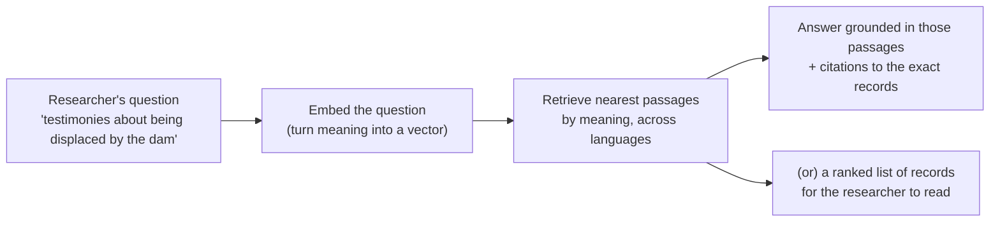
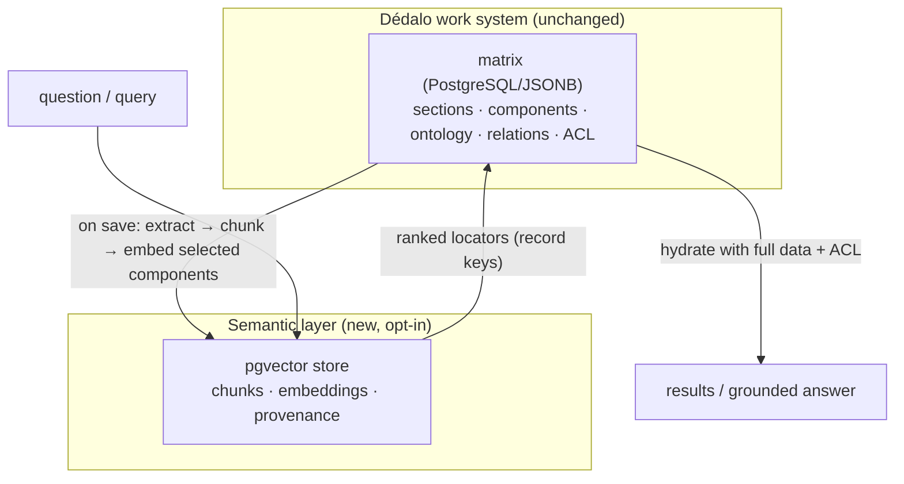

# Retrieval-Augmented Generation (RAG) & Semantic Search

> See also: [Architecture overview](architecture_overview.md) · [Search Query Object (SQO)](sqo.md) · [Exporting data](exporting_data.md) · [Glossary](glossary.md) · [Ontology](ontology/index.md)

This document has **two readers in mind** and is written for both:

- **Researchers in the humanities** — historians, archaeologists, anthropologists, art historians, archivists, oral-memory researchers — who want to understand *what* semantic search and RAG bring to their work, *why* it matters for cultural heritage and memory, and *how* it changes the questions they can ask of their data. **Parts I–IV** are for you; no programming required.
- **Developers** — who need to enable, use, operate and extend the subsystem. **Parts V–VI** are for you, with the API, the pipeline internals, configuration and tests. The subsystem code lives in [`core/rag/`](../../core/rag/README.md).

If you read only one paragraph: Dédalo already stores cultural-heritage data as **meaningful, structured records** (sections and components governed by the ontology). RAG adds a **semantic layer** on top of that structure — a "vector version" of selected data — so the archive can be searched and questioned by **meaning**, not only by exact words. It does not replace the data model; it amplifies it.

---

# Part I — Why vectorize Cultural Heritage and Memory

## The problem: our archives know more than our searches can find

Imagine an oral-history archive with ten thousand interviews about life in a rural valley. A researcher wants every testimony that touches on **displacement caused by the building of a reservoir**. She types "reservoir" into the search box. She gets the interviews where someone literally said *reservoir* — and misses the ones where people said *the dam*, *when the water came*, *they flooded our houses*, *el pantano*, *quan ens van fer marxar*. The knowledge is in the archive. The search cannot reach it, because classic search matches **strings**, not **meaning**.

This is the everyday condition of cultural-heritage data. It is:

- **Multilingual and historical** — the same idea appears in Spanish, Català, English, in archaic spellings, in dialect, in the vocabulary of a particular decade or trade.
- **Paraphrastic** — humans describe the same object, event or idea in endlessly different words. An archaeologist's "glazed earthenware vessel with cobalt decoration" is a curator's "blue-and-white majolica jar" is a donor's "old blue pot".
- **Fragmented across collections** — a person named in an interview, an object in a catalog, a photograph, a thesis chapter, and a place in a gazetteer may all speak about the same thing, in different sections, never linked.

Classic keyword search, and even Dédalo's powerful structured search (the [SQO](sqo.md)), are precise and essential — but they answer the question *"where does this string / this exact value appear?"*. They cannot answer *"what is **about** this idea?"*.

## What RAG and semantic search actually are (in plain terms)

**Semantic search** finds records by **conceptual similarity**. Instead of comparing letters, it compares *meanings*. Ask for "displacement caused by a dam" and it surfaces the testimony that says "when the water came and we had to leave" — because those phrases *mean* almost the same thing, even though they share no words.

How is meaning compared by a machine? Through **embeddings** (also called **vectors**). An embedding model reads a piece of text — **or an image** — and turns it into a long list of numbers — a point in a high-dimensional "**meaning space**". The crucial property: **things that mean similar things land near each other** in that space, and things that mean different things land far apart. "Dam" and "reservoir" sit close; "dam" and "wedding" sit far; two photographs of the *same kind of coin* sit close even when nothing textual links them. Searching becomes **geometry**: embed the question (or the object's image), then find the nearest records.

> **A useful mental image.** Think of a vast library where books are not shelved alphabetically but **by subject affinity** — every book physically placed so that books about similar ideas are neighbours, across every language and phrasing. To research a topic you walk to its region and everything relevant is within arm's reach, regardless of the exact words on the spine. Embeddings build that library automatically; semantic search is walking to the right shelf.

**RAG — Retrieval-Augmented Generation** — adds a second step. After *retrieving* the most relevant passages by meaning, it can hand them to a language model to *generate* a grounded answer **with citations back to the source records**. The model does not answer from its own memory of the internet; it answers **from your archive**, quoting your records. Retrieval keeps generation honest.



## Why the *semantics* of heritage data matter

The [introduction](index.md) to this documentation states the Dédalo conviction plainly: *cultural-heritage data is information about ourselves, at the same level of importance as health or defense*. If the data is that important, then **being able to ask it the questions that matter** is equally important.

Cultural heritage is, at bottom, about **meaning** — what an object signified, what a witness understood, how a practice was lived. A data model that only matches exact strings captures the *letter* of the record but not its *sense*. Vectorizing heritage data is a way of giving the archive a memory that works the way human memory works: by **association and resemblance**, not only by exact recall.

This matters for memory in a deep way. Oral memory especially is **paraphrase all the way down** — no two people describe the same event identically, and the historical value often lives precisely in the *variation*. A semantic layer lets that variation become **findable** instead of being lost between non-matching keywords.

## How this changes research

| Without semantics (string search) | With semantics (RAG / vector search) |
| --- | --- |
| You must already know the words used in the record. | You describe the **idea**; the system finds the words. |
| Each language searched separately. | One question retrieves matches **across languages** (cross-lingual). |
| Synonyms, dialect, archaic spelling are missed. | Conceptually equivalent phrasings are found together. |
| Connections across collections are manual. | "Find records **similar to this one**" surfaces hidden links. |
| Answering a question = reading many records by hand. | A grounded, **cited** synthesis points you to the exact passages. |
| Exploratory questions ("what themes recur about X?") are hard. | Thematic and comparative exploration becomes a first-class operation. |

The point is **not** to replace the researcher's reading and judgment — it is to **remove the wall** between a well-posed question and the relevant evidence, so that the scholar spends time interpreting rather than hunting.

---

# Part II — Definitions (a short glossary)

These terms recur throughout. They are written for the non-specialist; developers will find precise mechanics in Part V.

| Term | Definition |
| --- | --- |
| **Embedding / vector** | A list of numbers representing the *meaning* of a piece of text (or media). Produced by an "embedding model". Similar meanings → nearby vectors. |
| **Embedding model** | The neural model that converts text into an embedding. Dédalo's default text model is **multilingual** so non-English heritage text is handled well. A separate **multimodal** model (a joint image+text encoder) embeds object images into a space shared with text, enabling text→image search. |
| **Multimodal / joint encoder** | An image+text model (CLIP/SigLIP-style) whose image and text "towers" share one space, so an image can be compared to another image *and* to a textual description. Used for object similarity and text→image search. |
| **Semantic / vector space** | The high-dimensional space the vectors live in. "Distance" in this space approximates *difference in meaning*. |
| **Distance (cosine)** | How meaning-similarity is measured. Small distance = similar meaning. Dédalo uses **cosine** distance. |
| **Chunk** | A coherent passage a long text is split into before embedding. Each chunk is one retrievable unit (e.g. a paragraph, a timecoded segment of a transcription). |
| **Semantic chunking** | Splitting text at **topic boundaries** (detected from meaning) and along document structure (headings, tables, pages), so each chunk is one coherent idea — not an arbitrary cut. |
| **Retrieval** | Finding the most relevant chunks for a query by vector (and lexical) similarity. |
| **Generation** | Producing a natural-language answer from retrieved passages, using a language model (LLM). |
| **RAG** | **R**etrieval-**A**ugmented **G**eneration: retrieve first, then generate grounded in what was retrieved. |
| **Grounding** | The discipline of answering **only** from retrieved sources. If nothing relevant is found, the system **refuses** rather than inventing. |
| **Hallucination** | When a language model states something plausible but unsupported. RAG mitigates it by grounding answers in real records and **refusing** when there is no evidence. |
| **Citation** | A pointer from a sentence in the answer back to the exact source record/passage it came from — so claims are verifiable. |
| **Hybrid search** | Combining **semantic** (vector) retrieval with **lexical** (keyword) retrieval, so exact terms — names, inventory numbers, signatures — are not lost. |
| **Reranking** | A second, more precise scoring pass over the top candidates to improve ordering. |
| **pgvector** | The PostgreSQL extension that stores vectors and searches them efficiently. Dédalo's vector store is a dedicated PostgreSQL + pgvector database. |
| **ACL** | Access-Control List — Dédalo's per-project permissions. RAG **never** returns a record a user may not see. |

---

# Part III — RAG in Dédalo: what, why, how

## What it is, concretely

Dédalo's RAG subsystem maintains a **vector version of selected data** — only the components an archive explicitly opts in — in a **separate, dedicated PostgreSQL + pgvector database**. It vectorizes both **text** (with a multilingual text model) and **object images** (with a joint image+text model). On top of it sit five capabilities, all exposed through one API (`dd_rag_api`):

1. **Semantic search** — find records by meaning.
2. **Q&A / chat** — grounded answers over the collection, with citations.
3. **Object image similarity & characterization** — find visually similar objects (coins, ceramics, …) and **propose attributes** (typology, period, material) aggregated from their cataloged neighbours.
4. **Agent / MCP context** — retrieval-backed passages an external AI agent can ground its reasoning on.
5. **External public semantic API** — semantic access over *published* data for third parties (a separate, later phase).

## Why it fits Dédalo so naturally

Everything in Dédalo is already **meaningful by construction**. A value is never a loose string in a spreadsheet cell; it is a component, governed by the ontology, with a model, a language, relations and context (see the [architecture overview](architecture_overview.md) and [data model](data_model/index.md)). That is exactly the substrate semantic search wants:

- **The ontology decides what gets vectorized.** Vectorization is *opt-in per component*, declared in the node's `properties` — the same `properties` mechanism that already drives diffusion, search and rendering. No bespoke tables, no parallel schema (the [Dédalo way](index.md)).
- **The text is already clean.** Dédalo can already produce a clean, flat textual value for any component through the export-atoms contract (`get_value()` / `get_export_value()` — see [exporting data](exporting_data.md)). RAG reuses it, so a relation component's linked labels, a thesaurus term's hierarchy, or a transcription's text all flow in without new extraction code.
- **Security is already per-record.** Dédalo's project ACL governs who sees what. RAG enforces the **same** ACL on every retrieved passage, so the semantic layer can never leak a record a user could not otherwise open.

## How it improves the Dédalo data model

RAG does not change the matrix, the sections or the components. It **adds a complementary index of meaning** beside the structured store:



The two databases are **bridged by a list of record locators**, never by a SQL join. A vector search produces *which records* are relevant; the **main Dédalo search then hydrates them with full data and enforces ACL**. This gives the best of both worlds:

- The **structured model remains the single source of truth** — vectors are a derived, rebuildable index.
- The **semantic layer is additive and reversible** — you can enable it for one section, rebuild it, or drop it, without touching heritage data.
- **Meaning becomes a queryable dimension** of the archive, alongside the exact, relational queries the SQO already provides. The two compose: *"records semantically about coastal trade **and** dated before 1500 **and** in project X"*.

In short, RAG turns Dédalo's already-excellent **data model** into an also-excellent **knowledge-retrieval model**, without compromising either.

## Multilingual and cross-lingual by design

Heritage collections are overwhelmingly non-English, often with historical orthography and dialect. Dédalo's default embedding model is **multilingual**, and — importantly — the system **does not silo searches by language**. A question in English can retrieve a testimony in Spanish, because in a multilingual embedding space the *meaning* sits in the same place regardless of the language it was written in. For a discipline where the same event is documented in several languages, this is transformative.

## Security, ethics and "do no harm"

Cultural-heritage and memory data can be sensitive: protected sites, culturally restricted knowledge, personal testimony, donor embargoes. The subsystem treats this as a first-class concern:

- **Per-record ACL on every retrieval.** A passage is returned only if the requesting user may access its record — checked explicitly, before any score or count leaves the server, for *every* action (search, retrieve, agent context, and chat).
- **Egress control.** If an embedding or language model is an *external* third-party service, restricted records are **never** sent to it — they are processed only by a local model, or skipped. This is enforced at **index time** (before any text leaves) and again at **answer time**.
- **Grounding and refusal.** The chat assistant answers **only** from retrieved, permitted passages and **refuses** when it has no grounded context — it does not improvise.
- **The archive stays in control.** Vectorization is opt-in per component; an institution decides exactly what enters the semantic layer.

---

# Part IV — Use cases (worked examples)

These scenarios show the *kind* of question that becomes possible. They are written from the researcher's side; the developer's request/response forms are in Part V.

### 1. Identifying an object from a description

An archaeologist excavates a sherd and wants to know whether anything like it is already cataloged. She describes it in her own words:

> *"a glazed earthenware fragment with cobalt-blue floral motifs on a white tin glaze, probably tableware"*

Semantic search returns cataloged objects described — by different curators, in different decades, in different languages — as *"blue-and-white majolica plate"*, *"loza azul de reflejo"*, *"fajalauza"*. None share the searcher's exact words; all share her *meaning*. A keyword search would have required her to already guess the catalog's vocabulary. **The system bridges her description and the catalog's terminology.**

### 2. Searching oral-history documentation by theme

An anthropologist studying environmental memory asks:

> *"What did informants say about losing farmland when the valley was flooded?"*

The system retrieves **timecoded passages** from interview transcriptions where people speak of *the dam*, *when the water rose*, *we had to leave the fields*, *el pantano se lo llevó todo* — and each result deep-links to the **exact moment in the audio/video** (via the transcription's timecodes). She can jump straight to the testimony, in the informant's own voice. Months of listening become an afternoon of focused study.

### 3. Connecting fragments across collections

A historian is reading a thesis chapter (a long full-text document in a `component_text_area`) about a guild of silversmiths. With **"find records similar to this passage"**, the system surfaces: people records of named artisans, a numismatic catalog entry mentioning a related mint mark, a photograph's caption, and an archival document — scattered across different sections, never explicitly linked, but **conceptually adjacent**. The semantic layer reveals a web of relationships the manual cataloging never recorded.

### 4. A grounded research assistant with citations

A curator preparing an exhibition asks the chat assistant:

> *"Summarize what the collection documents about coastal trade in the 15th century."*

The assistant retrieves the relevant permitted passages, synthesizes a short answer, and **cites each claim** back to the specific records and passages it used — including the exact page of a document or the exact timecode of an interview. If the collection holds nothing on the topic, it says so plainly rather than inventing. The curator gets a starting map **and** the evidence to verify every statement.

### 5. Grounding an external AI agent (MCP)

A research tool or an AI agent (via [MCP](system/index.md)) needs trustworthy context about the collection. It calls `get_agent_context` and receives **permission-filtered passages** to ground its own reasoning — so the agent's output is anchored in the institution's real, access-controlled data, not in the model's general training.

### 6. Comparative and exploratory research

Because meaning is now a queryable dimension, new *shapes* of question become routine: *"which testimonies resemble this one?"*, *"what themes recur across these 300 interviews?"*, *"show me objects conceptually between these two."* Vectorization makes the archive **explorable by resemblance**, which is how humanistic inquiry often actually proceeds.

### 7. Cataloguing a coin from its images (typology proposal)

A numismatist registers a newly-found coin and uploads its **obverse** and **reverse** photographs. The moment it is saved, the images are vectorized. The system finds the cataloged coins whose obverse *and* reverse are visually closest — an object that matches on **both faces** ranks above one that matches on only one — and then **proposes a typology** by a similarity-weighted vote of those neighbours, showing the exact coins it relied on (with thumbnails) and a confidence. The numismatist confirms or overrides. The machine did the finding; the scholar keeps the judgment. *(This is "describe the object by its relatives" — a proposal grounded in real cataloged objects, never a generative guess.)*

### 8. Dating an object from its image

An excavation yields an object with no clear context. The researcher asks the collection to **estimate its period from its image**: the system retrieves the visually-(and metadata-)nearest objects and aggregates *their* recorded dates into a proposed **time-frame** — an earliest…latest range with a most-likely central estimate — again citing the objects that support it. It is a hypothesis to test, with its evidence attached, not an oracle's verdict.

### 9. "The same in the collection" / finding relatives

"Show me objects close to this one" returns the visually nearest pieces across the collection; raising the similarity threshold turns it into **near-duplicate detection** — the same object photographed twice, the same coin die, a re-used image — invaluable for deduplication, for spotting parallels, and for assembling a typological series. Because object similarity blends the image with the catalog **context** (material, typology, period), it does not confuse a bronze coin with a bronze button: the meaning of the object, not only its pixels, drives the match.

> **Why the context matters (and is ontology-defined).** What counts as an object's "context" is not universal — a coin's typology and a ceramic's fabric are different fields. So each section declares, **in the ontology**, which images carry the visual signal (and which face they show) and which components are the typology / period / material. Archaeology, numismatics and oral history each describe their material on their own terms, and the system respects that.

---

# Part V — For developers

The subsystem is implemented under [`core/rag/`](../../core/rag/README.md) (20 classes, text + image), exposed via `core/api/v1/common/class.dd_rag_api.php`, and is **strictly opt-in**: it is fully dormant unless `DEDALO_RAG_ENABLED = true` (image vectorization additionally requires `DEDALO_RAG_MEDIA_ENABLED = true`).

## Architecture at a glance

```mermaid
flowchart TB
    save["section_record::save() / delete()"] -->|enqueue marker (best-effort)| Q[("rag_index_queue<br/>(matrix DB)")]
    Q -->|cron drain| IDX["rag_indexer"]
    IDX -->|extract get_value| EX["rag_text_extractor"]
    IDX -->|structure-aware semantic chunking| CH["rag_chunker"]
    IDX -->|embed selected| EP["embedding_provider<br/>(local / external)"]
    IDX -->|atomic upsert| VS[("pgvector store<br/>per-model partitions + HNSW")]
    API["dd_rag_api"] --> RET["retrieval"]
    RET -->|dense ANN| VS
    RET -->|lexical BM25 / trigram| VS
    RET -->|RRF fuse → rerank → EXPLICIT ACL| ACL["security::user_can_access_record"]
    RET -->|records or passages| API
    API -->|ask: grounded prompt| LLM["rag_llm_provider<br/>(Anthropic Citations / local)"]
```

Two databases, bridged by a **locator/passage list**, never a join. **ACL is enforced explicitly in PHP inside `retrieval`** — the SQO `filter_by_locators` fast path does not run the project filter, so retrieval never relies on it.

## Enabling RAG

1. **Provision the vector store.** A *separate* PostgreSQL with the `vector` extension. Set `DEDALO_RAG_DB_*` in `../private/.env` (every RAG setting is declared in the config catalog `core/base/config/catalog/domains/rag.php` and overridden per-install via `.env` by constant name). Run the DDL:
   - `install/db/rag_embeddings.sql` → the **RAG** instance (partitioned table, HNSW, `unaccent`/`f_unaccent` for accent-folded lexical search).
   - `install/db/matrix_rag_index_queue.sql` → the **matrix** instance (the dirty-marker queue).
2. **Stand up an embeddings endpoint.** Default: a local multilingual model (e.g. `bge-m3` via Ollama). Set `DEDALO_RAG_PROVIDER` / `_MODEL` / `_ENDPOINT`.
3. **Opt records in, via the ontology `properties`:**
   - On the **section** node: `properties.rag = { "enabled": true }` — the cheap gate the save hook checks.
   - On each **text component** to vectorize: `properties.rag = { "embed": true }` (optionally `strategy`, `chunk`, `system_prompt`).
4. **Switch it on:** `DEDALO_RAG_ENABLED = true`.
5. **Backfill and build the index** (see *Operations*), then wire the drain cron.
6. **(Optional) object images** — to enable image similarity & characterization, declare `properties.rag.context` on the section (images + views, and the typology/period/material components), stand up the multimodal sidecar (`DEDALO_RAG_MULTIMODAL_*`), and set `DEDALO_RAG_MEDIA_ENABLED = true`. See *Image similarity & object characterization* below.

Example ontology `properties` for an oral-history transcription component:

```json
{
    "rag": {
        "embed": true,
        "strategy": "structural_semantic"
    }
}
```

## The API (`dd_rag_api`)

Dispatched by `dd_manager` (login + CSRF inherited) and gated by SEC-024 via the `API_ACTIONS` allowlist. Every action takes one `$rqo` and returns the standard `{ result, msg, errors }` envelope. A scope (`section_tipo` or `section_tipos`) is required and is permission-filtered (`common::get_permissions >= 1`) before retrieval.

**Actions:** `semantic_search`, `similar_to`, `retrieve`, `ask`, `get_agent_context`, and (images) `similar_objects`, `characterize_object`, `search_by_text_image`.

**Semantic search** — text → ranked records:

```json
// request
{
    "dd_api": "dd_rag_api",
    "action": "semantic_search",
    "source": {
        "query": "displacement caused by the building of the reservoir",
        "section_tipos": ["oh1"],
        "top_k": 8
    }
}
```
```json
// response.result (record-level, ACL-filtered, best-first)
[
    { "section_tipo": "oh1", "section_id": 412, "score": 0.78,
      "component_tipo": "oh23", "lang": "lg-spa",
      "chunk_meta": { "tc_in": "00:14:22.500", "tc_out": "00:15:01.000", "media_tipo": "oh3" } }
]
```

**Ask** — grounded answer with citations:

```json
// request
{ "dd_api": "dd_rag_api", "action": "ask",
  "source": { "query": "What do informants say about losing farmland to the dam?",
              "section_tipos": ["oh1"] } }
```
```json
// response.result
{
    "answer": "Several informants describe being forced to leave when the reservoir flooded their fields…",
    "citations": [ /* spans mapping back to {section_tipo, section_id, chunk} */ ],
    "provenance": [ { "section_tipo": "oh1", "section_id": 412, "text": "…cuando llegó el agua tuvimos que marcharnos…",
                      "chunk_meta": { "tc_in": "00:14:22.500", "media_tipo": "oh3" } } ],
    "grounded": true,
    "used_provider": "anthropic"
}
```

If no permitted, relevant context is found, `ask` returns `grounded: false` and **makes no model call**. The answer is returned as **raw text in JSON** (transport-safe); the client escapes it at render.

`similar_to` takes a `{ section_tipo, section_id }` and returns nearest neighbours (excluding itself). `retrieve` and `get_agent_context` return **passages** (not collapsed to records) for chat/agent grounding.

## Ingestion pipeline

`save()` / `delete()` enqueue a dirty marker (best-effort, never blocking the editor; a down vector store cannot fail a save). A cron-driven drain processes markers out-of-band:

- **`rag_text_extractor`** — per `(record, component, lang)`, clean text via `component_common::get_value()` (the export-atoms flat string). Relation components recurse; empty/duplicate-across-lang values are skipped.
- **`rag_chunker`** — **structure-aware semantic chunking** (the advanced piece):
  1. **Structural hard boundaries** — headings, paragraphs, lists, tables, page markers `[page-n-X]`, and transcription timecode/speaker turns `[TC_…_TC]`; a chunk never crosses one.
  2. **Semantic soft boundaries** — sentences are embedded and split at cosine-distance percentile breakpoints, so each chunk is one coherent idea (degrades to structural-only without an embedder).
  3. **Pack + double-merge** to a token budget with a minimum-size floor.
  4. **Contextual enrichment** — `{document title › heading path}` is prepended to the *embedded* text (raw text kept clean for citations).
  5. **Small-to-big** — each chunk stores a `parent_key` so `ask()` can expand a precise hit to its parent section for coherent context.
- **`rag_indexer`** — diffs chunk hashes (unchanged chunks skip the provider entirely), enforces the **per-record egress gate** before any external embed, embeds *outside* the DB transaction, then flushes upserts + stale-deletes **atomically** (`DBi_vector` transactions).
- **`rag_vector_store`** — pgvector schema: a table **partitioned by model**, each partition a fixed-dimension typed column (`vector(N)` / `halfvec(N)` above 2000 dims) with its own HNSW cosine index, built after backfill.

## Retrieval pipeline

`retrieval` is the corrected two-step bridge:

1. **Hybrid candidates** — dense ANN (`rag_vector_store`) + lexical BM25/trigram (`rag_lexical`, accent-folded via `f_unaccent`), fused with **Reciprocal Rank Fusion** (`rag_fusion`). Hybrid catches the proper nouns, inventory numbers and archival signatures that pure-vector retrieval misses.
2. **Rerank** — optional cross-encoder (`rag_reranker`; pass-through until a `DEDALO_RAG_RERANK_ENDPOINT` is configured).
3. **Explicit ACL** — `security::user_can_access_record()` on every candidate, **before** any score/count is returned (no existence oracle), for **all** actions.
4. **Shape** — `semantic_search`/`similar_to` collapse to best-per-record; `retrieve`/`ask` keep passages (with `source_text`, `chunk_meta`, `parent_key`) and apply an optional relevance floor (`DEDALO_RAG_MAX_DISTANCE`) and per-record diversify.

## Generation

`rag_llm_provider` is pluggable (`DEDALO_RAG_LLM_PROVIDER`): **Anthropic** (default, `claude-opus-4-8`, native **Citations** via `document` blocks titled by record locator, low temperature for factual answers) or a **local / OpenAI-compatible** endpoint (the only adapter permitted for restricted content). `ask()` enforces a context-token budget, recomputes egress from live config, and grounds-or-refuses.

## Image similarity & object characterization (Phase 5b)

For object collections (coins, amphorae, ceramics, …) the subsystem can vectorize **images** with a joint image+text encoder and answer object-centric questions. A section opts in through `properties.rag.context`, which declares — **in the ontology, per section** (archaeology ≠ oral history) — which image components carry the visual signal (and their `view`: obverse/reverse), and which components are the *typology / period / material*:

```json
{ "rag": { "enabled": true,
  "context": {
    "images":   [ { "tipo": "numd5", "view": "obverse" }, { "tipo": "numd6", "view": "reverse" } ],
    "metadata": { "typology": "numd10", "period": "numd20", "material": "numd30" },
    "compare_scope": "same_section"
  } } }
```

Capabilities (all ACL-filtered, results carry a `thumb_url`):

- **`similar_objects`** — "objects close to this one". Reads the object's stored image vectors and finds the visually nearest others. A multi-image object (a coin's obverse + reverse) **fuses the per-view result lists** (RRF) so an object close on *both* faces ranks above one close on a single face. A high `min_similarity` (or `near_duplicate`) gives "the same in the collection". **Hybrid** (default) blends visual similarity with the object's catalog context (typology/material/period) — essential for heritage, where pure visual similarity confuses a bronze coin with a bronze button.
- **`search_by_text_image`** — a textual description → matching object images, encoded by the multimodal model's **text tower** (the one correctness-critical wiring detail: never the plain text embedder).
- **`characterize_object`** — the "describe the object by its relatives" capability: retrieve the visually-(and metadata-)nearest objects and **aggregate their catalog metadata into a proposal** — a **similarity-weighted vote** for typology/material, and an *earliest…latest* range with a weighted-central estimate for period (`dd_date::convert_date_to_seconds`). Each proposal carries a **confidence and cited evidence** (the supporting objects, with thumbnails). No generative guess: a coin's typology is *proposed from real cataloged coins*, verifiably.

Ingestion reads a **downsized, non-master** image (`'1.5MB'` quality, never `original`/`modified`), optionally downscaled to `DEDALO_RAG_IMAGE_MAX_PX` via ImageMagick, and embeds it locally by default. **External** image embedding is gated by `diffusion_utils::is_publishable()` — non-publishable objects are embedded only by a local model or skipped. The encoder is a local sidecar exposing `POST /image` and `POST /text` (`{embeddings:[…]}`); set `DEDALO_RAG_MEDIA_ENABLED=true` and `DEDALO_RAG_MULTIMODAL_*`. At a typical 500k-image / 200k-object scale this is one HNSW index over the image partition.

*Worked example — cataloging a new coin:* save the coin with its obverse/reverse photographs → on the next drain it is embedded → `similar_objects` surfaces the closest cataloged coins (both faces considered) → `characterize_object` proposes its **typology** (weighted vote of those coins) and a **date range** (aggregated from their periods), each citing the coins it relied on. The numismatist confirms or overrides — the system did the finding, the scholar keeps the judgment.

## Operations

- **Drain (required).** Wire the queue drain to OS cron — without it, markers never index:
  ```cron
  * * * * * cd /path/to/dedalo && php core/rag/cli/rag_drain.php >> /var/log/dedalo/rag_drain.log 2>&1
  ```
  Safe to overlap (advisory single-flight). Failures back off exponentially and record `last_error`.
- **Backfill / index build.** Drive `rag_indexer::index_record()` over a section, then `rag_vector_store::build_ann_index($model, $dimension)` once.
- **Monitoring.** `rag_queue::stats()` reports queue depth, ready/blocked/failed counts and the in-process `metrics::` summary.
- **Reconcile.** `rag_indexer::reconcile_section($tipo)` enqueues add/delete drift after direct-SQL changes or migrations.
- **Model migration.** Build the new model's partition + index, re-backfill, then `rag_vector_store::drop_model_partition($old_model)`.

## Extending

- **Embedding provider** — implement `embedding_provider::embed_raw()` (local-HTTP and OpenAI-compatible providers ship; thin subclasses cover Voyage/Cohere/Jina). Dimension is **discovered**, never hard-coded.
- **Reranker** — point `DEDALO_RAG_RERANK_ENDPOINT` at a cross-encoder (`rag_reranker` speaks the Cohere/Jina/TEI shape; fail-open).
- **System prompt** — global `DEDALO_RAG_LLM_SYSTEM_PROMPT` or per-section `properties.rag.system_prompt`.

## Configuration & tests

All settings are declared in the config catalog (`core/base/config/catalog/domains/rag.php` — vector DB, provider/model, chunking, HNSW tuning, hybrid/rerank, generation, egress policy, multimodal) and overridden per-install from `../private/.env` by constant name (`DEDALO_RAG_*`; secrets such as passwords/API keys are env-only). Tests live in `test/server/rag/` (suite `rag`):

```bash
php vendor/bin/phpunit -c test/server/phpunit.xml --testsuite rag
```

Pure-logic tests (chunker semantic boundaries, fusion, security/egress, hardening, and the image proposal-aggregation / context resolution) always run; the store-integration test runs end-to-end against a live pgvector instance and skips cleanly when `DEDALO_RAG_DB_*` is unset.

**Testing it end-to-end (as a user).** A reference local embedding+image sidecar lives in `core/rag/services/` (no paid API; `uvicorn embed_server:app`), `php core/rag/cli/rag_selftest.php` is a one-command wiring check, and `php core/rag/cli/rag_backfill.php <section_tipo> --build-index` loads a section's existing records. All capabilities are exposed to the local AI agent as **MCP tools** (`mcp/dedalo-work-mcp/`, agent tier): `dedalo_semantic_search`, `dedalo_ask`, `dedalo_get_relevant_context`, `dedalo_similar_objects`, `dedalo_characterize_object`, `dedalo_search_by_text_image` — so you can test by prompting the agent (e.g. *"propose the typology and period of object X"*). Full walkthrough in [`core/rag/README.md`](../../core/rag/README.md).

---

# Part VI — Limits, ethics, and the road ahead

## What RAG is *not*

- **Not a source of truth.** The matrix remains authoritative; vectors are a derived, rebuildable index.
- **Not an oracle.** A language model can still be wrong. RAG mitigates this by **grounding** answers in real records, **citing** every claim, and **refusing** when there is no evidence — but a researcher must still verify, exactly as with any secondary source. Treat the assistant as a **finding aid**, not an authority.
- **Not a replacement for structured search.** The [SQO](sqo.md) remains the right tool for exact, relational, faceted queries. RAG is for *meaning*; the SQO is for *precision*. They compose.

## Ethical considerations for heritage and memory

Vectorizing heritage and memory carries responsibilities beyond the technical:

- **Sensitive and restricted knowledge.** Some heritage is culturally restricted, embargoed, or personal. The egress and ACL controls exist precisely so the semantic layer cannot become a back door around them. Institutions should decide deliberately what is opted in.
- **Model bias.** Embedding and language models carry the biases of their training data, which may misrepresent minority languages, dialects or worldviews. A multilingual default helps; vigilance and local models for sensitive collections help more.
- **Provenance and consent.** When testimony is involved, retrieval should *point to* the source in the informant's own voice (timecodes, citations) rather than paraphrase it away. The design favours linking back to the original over substituting for it.
- **Interpretation stays human.** The system surfaces evidence and resemblance; the meaning-making — the actual scholarship — remains the researcher's.

## Roadmap

- **Image region search & linking (Phase 5b-B)** — query by a *region* of an image (a segment of a painting) and **link** the matching objects to that segment, building on the implemented object image similarity (Part V).
- **Vision-LLM object description (Phase 5b-C, optional)** — a generated description grounded in the visually-similar neighbours, for the cases where the neighbour-aggregated proposal isn't enough.
- **Reranking by default** — a local cross-encoder for higher precision.
- **Public semantic API** — a separate service over *published-only* data, for third parties, co-located with the diffusion engine.
- **Retrieval-quality evaluation** — a golden-set harness (recall@k, citation-grounding) so model and parameter choices are measurable and regression-safe.

---

*Subsystem code and developer quick-reference: [`core/rag/README.md`](../../core/rag/README.md). Conceptual neighbours: [architecture overview](architecture_overview.md), [SQO](sqo.md), [exporting data](exporting_data.md), [ontology](ontology/index.md).*
