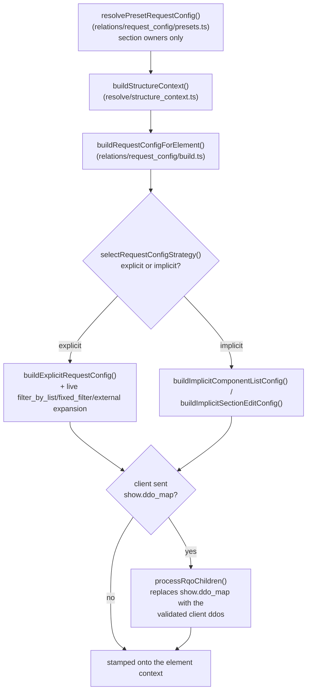

# Request Config Architecture

`src/core/relations/request_config/{build,explicit,implicit,filters,external,presets}.ts`
implements the system; the pure contract (schemas + the strategy-selection rule)
lives in `src/core/concepts/request_config.ts`.

## Overview

The `request_config` system is Dédalo's **server-side** mechanism for defining how a section or component retrieves and displays its data. It is the configuration half of the work API: the server resolves a `request_config` per element and injects it into the element's context; the client then turns it into one or more [RQO](rqo.md)s for the actual calls. The request_config declares:

- **What** data to display (the `ddo_map` columns/fields)
- **How** to search and pick records (`search` / `choose` layouts)
- **Where** to get the data (target `section_tipo` sources, external API engines)
- **Which** elements to resolve but never render (`hide`)
- **How much** to fetch (sqo limits, pagination) and **with what UI** (interface controls)

For the wire-level message the client builds from this config, see [rqo.md](rqo.md). For copy-paste ontology JSON by scenario, see the cookbook [request_config_examples.md](request_config_examples.md).

## Architecture

The system is a module set under `src/core/relations/request_config/`, called from the horizontal read engine (`src/core/section/read.ts`) and from `src/core/resolve/structure_context.ts`. There is no per-instance object carrying its own config — the build is a pure function of `(properties, context)`.

```
relations/request_config/build.ts       # buildRequestConfigForElement() — the strategy selector + entry point
├── concepts/request_config.ts          # pure contract: zod schemas + selectRequestConfigStrategy()
├── relations/request_config/explicit.ts# EXPLICIT parser (ddo self-resolution, get_ddo_map, sqo.section_tipo sources)
├── relations/request_config/implicit.ts# IMPLICIT: the ontology-relation-graph walk
├── relations/request_config/presets.ts # per-user/section layout preset override (STAGE-2, section owners only)
├── relations/request_config/filters.ts # filter_by_list / fixed_filter live expansion
└── relations/request_config/external.ts# non-dedalo api_engine → target section's api_config
```

### Module responsibilities

| Module | Responsibility | Key exports |
|-------|----------------|-------------|
| `concepts/request_config.ts` | Pure contract: schemas, the explicit/implicit selection rule | `requestConfigSchema`, `selectRequestConfigStrategy()`, `EXPLICIT_CONFIG_REQUIRED_MODELS` |
| `relations/request_config/build.ts` | Entry point: preset override, LIST/TM section_list substitution, then explicit/implicit dispatch | `buildRequestConfigForElement()`, `getElementColumnsMap()`, `findSectionListChild()` |
| `relations/request_config/explicit.ts` | Explicit config parsing: ddo self-resolution, mode/label enrichment, `get_ddo_map`, the enriched `sqo.section_tipo` ddo objects, per-ddo permission gating | `buildExplicitRequestConfig()`, `resolveSqoSectionTipos()`, `buildSqoSectionTipoDdos()`, `processRqoChildren()` |
| `relations/request_config/implicit.ts` | The ontology-relation-graph walk (component list targets + the full section edit-form tree) | `buildImplicitComponentListConfig()`, `buildImplicitSectionEditConfig()`, `resolveVirtualEditScope()` |
| `relations/request_config/presets.ts` | Per-user saved layout overrides (section `dd1244`) | `resolvePresetRequestConfig()`, `getActiveRequestConfigPresets()`, `selectMatchingPreset()` |
| `relations/request_config/filters.ts` | Live `filter_by_list` / `fixed_filter` expansion (record/DB data, never cached) | `expandFilterByList()`, `expandFixedFilter()` |
| `relations/request_config/external.ts` | Attaches the target section's `api_config` for non-`dedalo` engines | `resolveExternalConfig()` |

Every build is a plain async function call — there is no config-level cache to invalidate (see [Caching](#caching-and-the-cache-key) below for what that means in practice). `build.ts`, the pure-contract boundary in `concepts/request_config.ts`, and the `explicit`/`implicit` builders are the things to understand first; `presets.ts`/`filters.ts`/`external.ts` are the live-expansion special cases.

## Explicit vs implicit configuration

This is the most misunderstood part of the system, so read it precisely. The selection is one function, `selectRequestConfigStrategy()` (`src/core/concepts/request_config.ts`):

```typescript
// src/core/concepts/request_config.ts
export function selectRequestConfigStrategy(properties: unknown): 'explicit' | 'implicit' {
  const requestConfig = (properties as { source?: { request_config?: unknown } } | null)
    ?.source?.request_config;
  return requestConfig !== undefined && requestConfig !== null ? 'explicit' : 'implicit';
}
```

`relations/request_config/build.ts` calls this rule and dispatches to `buildExplicitRequestConfig()` (`explicit.ts`) or the graph walk in `implicit.ts` — data-driven: there is no per-model requirement, only whether the node's properties carry `source.request_config`. (Some code comments still use the historical names `v6`/`v5` for explicit/implicit respectively — the modules themselves are `explicit.ts`/`implicit.ts`.)

### Explicit — the modern config (`relations/request_config/explicit.ts`)

Explicit is the **preferred strategy**: an ontology-driven configuration. The node's `properties->source->request_config` holds a JSON **array** of config objects, each parsed into a `request_config_object` shape. Everything — target sections, the show/search/choose/hide layouts, sqo defaults, interface switches — is declared by hand. New ontology definitions should use the explicit form.

A minimal explicit node (full scenarios live in the [cookbook](request_config_examples.md)):

```json
{
  "source": {
    "request_config": [
      {
        "api_engine": "dedalo",
        "type": "main",
        "sqo": { "section_tipo": [{ "value": ["numisdata3"], "source": "section" }] },
        "show": { "ddo_map": [ { "tipo": "numisdata27", "section_tipo": "self", "parent": "self" } ] }
      }
    ]
  }
}
```

### Implicit — the legacy-but-active auto-derived fallback (`relations/request_config/implicit.ts`)

Implicit is **not dead or deprecated code**. It **runs automatically, on every request, for every ontology node that has no explicit `properties->source->request_config`**. It is the live default for un-migrated nodes — the majority of components in a typical ontology never declare an explicit config and are served by the implicit walk on every read. It is the real graph walk, not a stub — load-bearing for classic simple relations (select/radio/check_box target definitions).

Instead of reading an explicit array, the implicit builder **derives** the display config by walking the ontology relation graph:

1. **Component list targets** (`buildImplicitComponentListConfig`) — the first `section`-model node among the source's `relations` becomes the TARGET SECTION (stripped from the ddo list); `exclude_elements` marker nodes and the deprecated `dd249` security component are skipped; `component_filter`/`component_filter_master` always target the projects section (`dd153`/`dd156`) instead; a section_list child with no section node falls back to the component's main `related` section (`getMainRelatedSectionTipo`).
2. **Section edit-form tree** (`buildImplicitSectionEditConfig`) — for a SECTION in edit mode: a recursive ontology walk collects every `component_*`/`section_group*`/`section_tab`/`tab` descendant (excluding `component_dataframe`, which renders through its main component), honoring virtual-section resolution (`resolveVirtualEditScope` — a virtual section borrows the REAL section's children minus its first `exclude_elements` set) and per-ddo view defaults.

**The critical normalization point:** the implicit builder wraps its derived result in **exactly the same parsed-item shape** as the explicit builder (`api_engine:'dedalo'`, `type:'main'`, with `show`/`sqo`) and returns a **one-element array matching what the explicit builder returns, so callers need no branching** — `build.ts` calls either builder through the same `ParsedRequestConfigItem[]` return type. Downstream code (the resolvers in `src/core/relations/`, the structure-context stamping) cannot tell which strategy produced a config.

Un-migrated nodes are expected to eventually move to an explicit config — that does not mean the implicit walk is inert; it is the active default until they do. The only genuinely dead corner is the explicit **throw**: `component_relation_parent` and `component_relation_children` (`EXPLICIT_CONFIG_REQUIRED_MODELS`) raise an error forcing migration to an explicit config. Everything else the implicit builder handles silently and indefinitely.

| | Explicit | Implicit |
|---|---|---|
| Source | `properties->source->request_config` array | derived by walking the relation graph |
| Status | preferred / modern | legacy **but active default** for un-migrated nodes |
| Output | `ParsedRequestConfigItem[]` | **same** `ParsedRequestConfigItem[]` (one element) |
| Runs when | the node declares a config | the node declares **no** config (every request) |
| Hard failure | — | throws for `component_relation_parent`/`children` |

Per-ddo permission gating (dropping ddos the current user holds permission 0 on) is wired into the explicit builder for SECTION-owned configs: `processSingleDdo()` calls `ddoIsAuthorized()` (`src/core/security/permissions.ts`) against the request's live principal (`currentPrincipal()`, ALS-scoped) and drops unauthorized ddos. It only gates section-owned configs — portal and other component-owned configs are not gated at this step.

## Construction flow

`buildRequestConfigForElement()` runs three concerns in sequence: an optional per-user layout-preset override, the base build (section_list substitution + strategy selection + the matching builder), and — when the request carries client children ddos — an RQO-derived narrowing overlay. Every call is a plain, stateless async function of `(properties, context)` scoped to the current request (`AsyncLocalStorage`; see `src/core/resolve/request_lang.ts` for the pattern) — there is no cross-request cache to bleed between users (see [Caching](#caching-and-the-cache-key) below).



### Base build — strategy selection (every call)

`buildRequestConfigForElement()` runs the section_list LIST-mode substitution (below), then `selectRequestConfigStrategy()`, then the matching builder. There is no deterministic/cacheable-vs-live distinction at this layer — every call runs the full build; `filters.ts`'s live `filter_by_list`/`fixed_filter` expansion is simply always current.

### RQO-derived narrowing (the reverse path, partial)

The base build always runs first (time machine, `tool_qr`, graph view, "portal full grid in one read" — [cookbook #18](request_config_examples.md#18-portal-full-grid-in-one-read)): `structure_context.ts` always runs the base build, then — only when the request carries client children ddos (`options.rqoChildrenDdos`) — calls `processRqoChildren()` (`relations/request_config/explicit.ts`) to REPLACE each parsed item's `show.ddo_map` with the client-sent ddos, each passed through the same self-resolution/mode/label enrichment pipeline as an ontology ddo. There is no separate structural-validation pass beyond that enrichment pipeline today — be careful relying on it as the sole gate for a security-sensitive client-ddo surface.

### Per-call overlay (session sqo)

`src/core/security/session_store.ts` maintains a per-session SQO store: a SECTION read in `list`/`edit` mode persists its resolved sqo into the session (`setSessionSqo()`, keyed by the section tipo) unless the caller opts out (`source.session_save === false`, used by secondary windows). The section's context exposes the **previous** stored value back as `sqo_session` (`src/core/section/context.ts`, read live from the request's `AsyncLocalStorage`-scoped session) — the client is expected to resend it to resume pagination/filter continuity on the next call. There is no automatic server-side fallback: a client that omits its filter/limit on a follow-up call is not silently replayed against its previous navigation state — continuity relies on the client reading and resending `sqo_session`.

### User layout presets

A per-user (or public, as a fallback) layout override is supported: `resolvePresetRequestConfig()` (`src/core/relations/request_config/presets.ts`) resolves an active preset for the `(tipo, section_tipo, mode)` triple, for SECTION owners only, BEFORE the base build, without mutating the ontology-cached properties. Presets are records in section `dd1244`: `dd1242` (tipo), `dd642` (section tipo), `dd1246` (mode), `dd654` (owning user, null = public), `dd640` (public flag), `dd1566` (active flag, SQL-filtered), `dd625` (the `request_config_object[]` payload). When an active preset matches, its `dd625` payload is injected as `properties.source.request_config` onto a clone of the element's properties, so the existing explicit builder parses it with no special-casing. The active-preset list is cached and invalidated on any write/delete to `dd1244`; the per-user match itself is always computed live from the request's principal and never cached.

## request_config_object shape

`requestConfigItemSchema` (`src/core/concepts/request_config.ts`) is a zod schema with **`.passthrough()`**: an unrecognized key on a parsed item is kept, not dropped — the schema documents the known fields but does not police extras.

```typescript
interface request_config_object {
  api_engine: 'dedalo' | string;   // internal engine, or an external adapter name (e.g. 'zenon')
  type: 'main' | string;           // config type ('main' is the primary one)
  sqo: {                           // query defaults (the SQO the client copies into its RQO)
    section_tipo: object[];        // target-section sources (see vocabulary below)
    fixed_filter?: object;         // context/record-derived filter (disables caching)
    filter_by_list?: object;       // live DB list pre-filter (disables caching)
    filter_by_locators?: object[];
    limit?: number;
    offset?: number;
    operator?: '$or' | '$and';
  };
  show: {                          // mandatory display context
    ddo_map?: dd_object[];         // columns/fields to show
    get_ddo_map?: object;          // OR resolve the ddo_map dynamically (see below)
    sqo_config?: object;           // display-scoped sqo tuning (limit, offset, operator, full_count)
    interface?: object;            // UI switches — see rqo.md (#show-interface) for the table
    fields_separator?: string;
    records_separator?: string;
  };
  search?: { ddo_map?: dd_object[]; get_ddo_map?: object; sqo_config?: object; };
  choose?: { ddo_map?: dd_object[]; fields_separator?: string; };
  hide?:   { ddo_map?: dd_object[]; };  // resolved server-side, never rendered
  api_config?: object | null;      // external-engine connection params (null preserved)
}
```

`show` is the mandatory display context. `search`/`choose`/`hide` are optional and share the `show` sub-shape. The `interface` switches are documented **once, canonically, in [rqo.md → `show.interface`](rqo.md#show-interface)** — do not duplicate that table here.

## dd_object (DDO) shape

A **Data Description Object** is a single column/field entry in a `ddo_map`. The most relevant fields:

`src/core/concepts/ddo.ts` splits this into two schemas with different trust levels: `ddoSchema` is a **strict whitelist** (zod's default `.strip()`, dropping anything not listed) — it is the security gate for any ddo a CLIENT sends (`show`/`search`/`choose` on an inbound RQO). Server-resolved ddos (the `ProcessedDdo` interface the explicit/implicit builders emit, `relations/request_config/explicit.ts`) carry a wider, open field set (an index signature keeps every enrichment field) — the whitelist only applies at the untrusted client boundary, not to what the ontology/graph-walk builders produce server-side.

```typescript
interface dd_object {
  // identity / resolution
  tipo: string;                  // ontology identifier of the element
  model?: string;                // component model name
  section_tipo?: string|string[];// target section ('self' resolves at runtime)
  parent?: string;               // parent element tipo ('self' resolves at runtime)
  parent_grouper?: string;       // grouper the element belongs to (layout grouping)
  // presentation
  label?: string; labels?: object; lang?: string;
  mode?: string; view?: string; children_view?: string;
  css?: object;                  // per-ddo style overrides (from properties.css)
  color?: string; role?: string;
  // behavior / access
  id?: string; type?: string; permissions?: number;
  buttons?: array; tools?: array;
  sortable?: boolean; autoload?: boolean;
  show_in_inspector?: boolean; show_in_component?: boolean;
  value_with_parents?: boolean;
  // data shaping
  columns_map?: array; target_sections?: array; section_map?: object;
  fields_separator?: string; records_separator?: string;
  fn?: string; data_fn?: string; parser_args?: object; data_slice?: object;
  matrix_table?: string; diffusion_tipo?: string; options?: object;
  section_filter?: array; component_filter?: array;
  request_config?: array;        // nested config (e.g. a portal's own columns)
}
```

See [dd_object.md](dd_object.md) for the per-field contract. Note `parent_grouper` (used to nest a ddo under a grouper in the layout) and `css` (per-ddo style overrides, sourced from the node's `properties.css`) — both appear in cookbook examples and are real, settable fields.

## Self-resolution and dynamic `section_tipo` sources

The ontology cannot know installation-specific tipos, so configs use placeholders resolved **server-side** before the client ever sees them.

### `self` in a ddo (`processSingleDdo` self-resolution)

`processSingleDdo()` (`relations/request_config/explicit.ts`) resolves `self` references. One subtlety worth making explicit: for a normal (non-dataframe) ddo, `section_tipo: "self"` resolves to the ITEM'S resolved SQO **target** sections (the child lives at the portal's targets, not at the caller) — only `component_dataframe` resolves `self` to the caller's own section (frames live on the caller's record):

| Field | `self` resolves to |
|-------|--------------------|
| `section_tipo` | the item's resolved `sqo.section_tipo` targets — or the CALLER's own section_tipo (scalar) for `component_dataframe` |
| `parent` | `context.ownerTipo` (the current element's tipo) |

### `sqo.section_tipo` source vocabulary

The `sqo.section_tipo` is an **array of source descriptors** (`{source, value}`), resolved by `resolveSqoSectionTipos()` (`relations/request_config/explicit.ts`). The vocabulary:

| `source` | Resolves to |
|----------|-------------|
| `section` (default) | TLD-active-checked literal section tipos in `value` |
| `self` | the caller's own section_tipo, `value` ignored |
| `hierarchy_types` | the ACTIVE hierarchy sections (`resolveHierarchySectionsFromTypes()`) whose typology matches the typology ids in `value` |
| `ontology_sections` | every registered ontology's target section (`resolveOntologySections()`), `value` ignored |
| `field_value` | a live read of the caller's own ACTIVE records, taking each named component's data values (`value`, a list of component tipos) as target tipos, keeping only the ones that resolve to a section model |
| `hierarchy_terms` | each entry's locator `section_tipo` (the values are term locators) |

A bare string `'self'` (not wrapped in a `{source, value}` object) also resolves directly. Every resolved tipo is deduplicated and then dropped if its ontology model cannot be resolved.

### `get_ddo_map` — dynamic ddo_map

Instead of hardcoding `ddo_map`, a `show`/`search`/`choose` block may carry a `get_ddo_map` directive of the form `{model: 'section_map', columns: [...]}`. `resolveGetDdoMap()` (`relations/request_config/explicit.ts`) reads `getSectionMapValue()` (`src/core/ontology/section_map.ts`). Lets multiple sections share a common column set: a component tipo seen under several target sections merges into ONE ddo whose `section_tipo` becomes the array of those sections.

```json
{
  "show": {
    "get_ddo_map": {
      "model": "section_map",
      "columns": [ { "path": ["components", "mint"] }, { "path": ["components", "type"] } ]
    }
  }
}
```

The `section_map` itself is the global scope/term map built per section. A full dynamic-ddo_map scenario is in the [cookbook](request_config_examples.md).

## `filter` vs `filter_by_list` vs `fixed_filter`

Three distinct filtering concepts that are easy to confuse:

| Key | Lives on | Meaning | TS resolver |
|-----|----------|---------|---------|
| `filter` | the **SQO** (RQO side) | the live query `WHERE` the client sends per call (search box, panel) | n/a — part of the request, not the config; see [sqo.md](sqo.md) |
| `filter_by_list` | `sqo.filter_by_list` | a pre-filter dropdown whose option values are read **live from the DB** | `expandFilterByList()` (`relations/request_config/filters.ts`) |
| `fixed_filter` | `sqo.fixed_filter` | a context/record-derived filter that varies by `section_id`, over three sources: `fixed_dato` (embedded SQO filter objects), `component_data` (multi-hop live read of the calling record's own data), `hierarchy_terms` (thesaurus-subtree section_id IN-filter) | `expandFixedFilter()` (`relations/request_config/filters.ts`) |

Both are resolved inside `buildExplicitRequestConfig()` (`explicit.ts`) whenever the raw sqo carries the key, reading LIVE record/DB data. There is no cache-invalidation signal to flip because the build never caches (see [Caching](#caching-and-the-cache-key)) — every call already re-reads this live data.

## Pagination

`src/core/section/read.ts` applies the section-level defaults directly when the client sends no limit (`rqo.sqo.limit` absent/null); `src/core/relations/relation_core.ts`'s `ownEditLimit()`/`PORTAL_LIST_LIMIT` apply the component-level defaults for portal/relation cells. There is no single defaults entry point to link to — search for `PORTAL_LIST_LIMIT` and the `rqo.sqo.limit` default branches in `section/read.ts` if you need to change these numbers.

### Limit priority (highest → lowest)

1. the RQO's own `sqo.limit` (clamped client-side by `sanitizeClientSqo`, §7.5)
2. the config's declared `sqo.limit` / `show.sqo_config.limit` (LAST request_config item wins — `ownEditLimit()`)
3. mode/model heuristic default (below)

### Default limits

| Caller | Mode | Default limit | Location |
|--------|------|---------------|--------------|
| section | edit | 1 | `section/read.ts` |
| section | other (list, ...) | 10 | `section/read.ts` |
| component | edit | 10 | `relations/relation_core.ts` `ownEditLimit() ?? 10` |
| component | other (list, ...) | 1 | `relations/relation_core.ts` `PORTAL_LIST_LIMIT` |

### Session override

The per-session SQO store (`src/core/security/session_store.ts`, see [Per-call overlay](#per-call-overlay-session-sqo) above) carries the previous navigation state, but nothing consults it as an automatic limit fallback: a client that omits its filter/limit on a follow-up call gets the mode/model heuristic default above, not its previous session state. Continuity depends on the client reading `sqo_session` from the section context and resending it.

## Caching and the cache key

There is no config-level cache: every `buildRequestConfigForElement()` call is a fresh, stateless computation scoped to the current request (`AsyncLocalStorage`) — there is no cache key to compute and no clone boundary to protect, because nothing is ever cached in the first place. A handful of narrower intermediate lookups DO cache (the hierarchy-sections list, the all-ontologies target-section list, the active-presets list — each in its own module, invalidated on the relevant ontology/data write), but the assembled `request_config` result itself is always recomputed.

## Error contract and warnings

An invalid tipo, an unresolvable node, or a missing model simply produces `null`/is filtered out of the ddo_map (the `return null` steps in `processSingleDdo()`) — there is no separate warnings collection or debug-gated surface to inspect. `EXPLICIT_CONFIG_REQUIRED_MODELS` (`component_relation_parent`/`children`) is the one case that throws instead of dropping silently. To debug an empty `ddo_map`, step through `buildRequestConfigForElement()`/`processSingleDdo()` directly rather than reading a warnings field from the response.

## Best practices

1. **Use an explicit config for new nodes.** The implicit walk will keep serving un-migrated nodes, but explicit config is auditable and predictable — and it is the better-tested path (`test/parity/relation_corpus_config.test.ts`).
2. **Use `self`** for `parent` and ddo `section_tipo` rather than hardcoding installation tipos.
3. **Prefer the `{source, value}` object form** for `sqo.section_tipo` — a bare `"self"` string still resolves, but the object form is the documented shape.
4. **Define `show`, `search` and `choose` separately** for autocomplete components.
5. **Prefer `get_ddo_map`** for column sets shared across sections.
6. **Let the server own limits** (`limit: null`) so the mode/model default wins; client limits are clamped anyway. Do not rely on cross-request session-limit continuity — the client must resend `sqo_session` itself (see [Session override](#session-override)).
7. **Test under multiple user permissions** — per-ddo permission gating only applies to SECTION-owned explicit configs; portal and other component-owned configs are not gated at the `processSingleDdo()` step.
8. **Keep configs auditable by construction** — since there is no separate structural-validation pass, malformed `request_config` JSON fails at build time inside `processSingleDdo()` rather than at a dedicated audit step; test new configs against `test/parity/relation_corpus_config.test.ts`.

## Troubleshooting

- **Empty `ddo_map`** — verify the `section_tipo` source resolves and that the node/model lookups in `processSingleDdo()` succeed; there is no warnings field to inspect — step through the builder directly.
- **`self` not resolving** — remember it resolves to the item's SQO TARGET sections for a normal ddo, and to the CALLER's own section only for `component_dataframe` (`processSingleDdo()`); confirm which one applies.
- **Config changes not taking effect** — there is no config-level cache (see [Caching](#caching-and-the-cache-key)), so a stale value here is almost certainly upstream (the ontology read cache) rather than a request_config cache mismatch.
- **`component_relation_parent`/`children` throws** — these models require an explicit `request_config`; give the node one.
- **Preset not applied** — presets only override SECTION owners (`context.ownerIsSection`); confirm the preset's `(tipo, section_tipo, mode)` triple matches and that it is marked active (`dd1566`).

## API reference

```typescript
// src/core/relations/request_config/build.ts — the entry point, start here
export async function buildRequestConfigForElement(
  ownProperties: unknown,
  context: RequestConfigContext,
): Promise<ParsedRequestConfigItem[]>

// src/core/concepts/request_config.ts — the pure explicit/implicit selection rule
export function selectRequestConfigStrategy(properties: unknown): 'explicit' | 'implicit'
```

### Related files

- `src/core/relations/request_config/build.ts` — entry point: LIST-mode section_list substitution + explicit/implicit selector
- `src/core/concepts/request_config.ts` — pure contract: zod schemas, `selectRequestConfigStrategy`, `EXPLICIT_CONFIG_REQUIRED_MODELS`
- `src/core/relations/request_config/explicit.ts` — explicit config parsing, ddo self-resolution, `get_ddo_map`
- `src/core/relations/request_config/implicit.ts` — the ontology-relation-graph walk
- `src/core/relations/request_config/presets.ts` — per-user saved layout overrides
- `src/core/relations/request_config/filters.ts` — `filter_by_list` / `fixed_filter` live expansion
- `src/core/relations/request_config/external.ts` — non-`dedalo` engine `api_config` attachment
- `src/core/resolve/structure_context.ts` — where the parsed config gets stamped onto an element's context (and where the RQO-children narrowing happens)

## Related documentation

- [Request Query Object (RQO)](rqo.md) — the wire message the client builds from this config; canonical [`show.interface` controls table](rqo.md#show-interface)
- [Request Config Examples](request_config_examples.md) — cookbook of annotated ontology JSON by scenario
- [Search Query Object (SQO)](sqo.md) — the `filter`/`limit`/`order` carried inside the RQO
- [DD Object](dd_object.md) — per-field DDO contract
- [Ontology index](ontology/index.md) — ontology nodes, sections and the relation graph the config draws from
- [Request Config Presets](ontology/request_config_presets.md) — per-installation layout overrides (`dd1244`)
