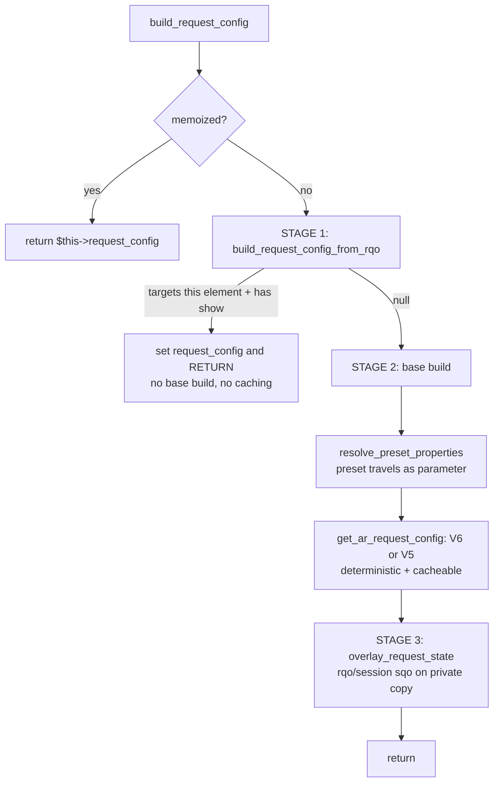

# Request Config Architecture

> Orchestrator: `./core/common/class.common.php` → `build_request_config()`
> Shapes: `./core/common/class.request_config_object.php`, `./core/common/class.dd_object.php`

## Overview

The `request_config` system is Dédalo's **server-side** mechanism for defining how a section or component retrieves and displays its data. It is the configuration half of the work API: the server resolves a `request_config` per element and injects it into the element's context; the client then turns it into one or more [RQO](rqo.md)s for the actual calls. The request_config declares:

- **What** data to display (the `ddo_map` columns/fields)
- **How** to search and pick records (`search` / `choose` layouts)
- **Where** to get the data (target `section_tipo` sources, external API engines)
- **Which** elements to resolve but never render (`hide`)
- **How much** to fetch (sqo limits, pagination) and **with what UI** (interface controls)

For the wire-level message the client builds from this config, see [rqo.md](rqo.md). For copy-paste ontology JSON by scenario, see the cookbook [request_config_examples.md](request_config_examples.md).

## Architecture

The system is built using a modular trait-based architecture composed into `class.common.php` (so every section/component instance has it):

```
common::build_request_config() [3-stage orchestrator]
├── common::get_ar_request_config()         # cacheable base build (V6/V5 selector)
├── trait.request_config_utils.php          # validation, caching, cache key, pagination
├── trait.request_config_ddo.php            # ddo_map / get_ddo_map / self-resolution
├── trait.request_config_v6.php             # V6: explicit properties->source->request_config
└── trait.request_config_v5.php             # V5: auto-derived fallback (active default)
```

### Trait responsibilities

| Trait | Responsibility | Key Methods |
|-------|----------------|-------------|
| `request_config_utils` | Validation, caching, cache key, pagination | `build_request_config_cache_key()`, `cache_request_config()`, `get_cached_request_config()`, `sync_pagination_from_config()`, `resolve_pagination_defaults()`, `calculate_default_limit()` |
| `request_config_ddo` | DDO map processing | `resolve_ddo_self_references()`, `resolve_get_ddo_map()`, `resolve_sqo_section_tipo()` |
| `request_config_v6` | Modern explicit config parsing | `build_request_config_v6()` |
| `request_config_v5` | Auto-derived fallback | `build_request_config_v5()`, `resolve_ar_related()`, `clean_and_extract_related()`, `filter_authorized_related()`, `build_legacy_ddo_map()` |

The orchestrator (`build_request_config`), the cache-clone boundary helpers and the shape classes are the four things to understand first; the rest is detail.

## V6 vs V5 configuration

This is the most misunderstood part of the system, so read it precisely. The selection is a single line in `get_ar_request_config()` (`class.common.php`):

```php
if (isset($properties->source->request_config)) {
    $ar_request_query_objects = $this->build_request_config_v6($properties, $context, $pagination);
} else {
    $ar_request_query_objects = $this->build_request_config_v5($context, $pagination);
}
```

### V6 — the modern explicit config (`trait.request_config_v6`)

V6 is the **preferred strategy introduced in Dédalo v6**: an ontology-driven, explicit configuration. The node's `properties->source->request_config` holds a JSON **array** of config objects, each parsed into a `request_config_object`. Everything — target sections, the show/search/choose/hide layouts, sqo defaults, interface switches — is declared by hand. New ontology definitions should use V6.

A minimal V6 node (full scenarios live in the [cookbook](request_config_examples.md)):

```json
{
  "source": {
    "request_config": [
      {
        "api_engine": "dedalo",
        "type": "main",
        "sqo": { "section_tipo": [{ "value": ["numisdata3"], "source": "section" }] },
        "show": { "ddo_map": [ { "tipo": "numisdata27", "section_tipo": "self", "parent": "self" } ] }
      }
    ]
  }
}
```

### V5 — the legacy-but-active auto-derived fallback (`trait.request_config_v5`)

V5 is **not dead or deprecated code**. Its header calls it a "legacy fallback strategy," but it **runs automatically, on every request, for every ontology node that has no explicit `properties->source->request_config`**. It is the live default for un-migrated nodes — the majority of components in a typical ontology never declare an explicit config and are served by V5 on every read.

Instead of reading an explicit array, V5 **derives** the display config by walking the ontology relation graph:

1. `resolve_ar_related()` — dispatches to mode/model-specific resolvers (`resolve_ar_related_edit`, `resolve_ar_related_list_section`, `resolve_ar_related_list_component`, ...) to find the related nodes that should be shown.
2. `clean_and_extract_related()` — strips sections, groupers, deprecated and inaccessible tipos, and extracts the `target_section_tipo`.
3. `filter_authorized_related()` — keeps only related nodes with permissions > 0 for the current user.
4. `build_legacy_ddo_map()` — emits one `dd_object` per surviving authorized component.

**The critical normalization point:** V5 wraps its derived result in **exactly the same `request_config_object`** as V6 (`api_engine='dedalo'`, `type='main'`, with `show`/`sqo`) and returns a **one-element array matching the shape V6 returns, so callers need no branching**. It also mirrors V6's side effect of updating `$this->pagination->limit`. Downstream code (overlay, caching, the API context resolution) cannot tell whether a config came from V6 or V5.

"Migration target" in the trait comments means **un-migrated nodes should eventually move to an explicit V6 config** — not that V5 is inert. The only genuinely dead corner is the explicit V5 **throw**: `component_relation_parent` and `component_relation_children` are listed in `$v5_unsupported` and raise an Exception forcing migration to an explicit V6 RQO. Everything else V5 handles silently and indefinitely.

| | V6 | V5 |
|---|---|---|
| Source | explicit `properties->source->request_config` array | derived by walking the relation graph |
| Status | preferred / modern | legacy **but active default** for un-migrated nodes |
| Output | `request_config_object[]` | **same** `request_config_object[]` (one element) |
| Runs when | the node declares a config | the node declares **no** config (every request) |
| Hard failure | — | throws for `component_relation_parent`/`children` |

## Construction flow — the 3-stage orchestrator

`common::build_request_config()` is the public entry. It is **memoized per instance** (`if (isset($this->request_config)) return $this->request_config;`), reads `dd_core_api::$rqo` **once**, and runs three named stages.



### Stage 1 — RQO-derived (short-circuit)

`build_request_config_from_rqo($rqo)`. When the client API request targets **this** element (the rqo source tipo matches, or this tipo is in the requested sqo's `section_tipo`) **and** the request carries an explicit `show`, the config is rebuilt from the rqo rather than the ontology. Client-sent ddos pass `validate_requested_ddo()` (the same tipo / active-TLD / permission gate as ontology configs) and are then normalized by `consolidate_requested_ddo()`. If the result is non-null, it is assigned to `$this->request_config` and the method **returns immediately** — no base build, no preset, no caching.

This is the reverse path used by time machine, `tool_qr`, graph view and search presets (a `section` instantiated with `add_show:true`). See [rqo.md](rqo.md) for the wire side and [sqo.md](sqo.md) for the sanitization that precedes it.

### Stage 2 — Base build (cacheable)

`resolve_preset_properties($tipo, $section_tipo, $mode)` optionally resolves a user layout preset (section `dd1244`) via `request_config_presets::get_request_config()`. **The preset never mutates the instance** — it travels as the `$properties_override` parameter into `get_ar_request_config($properties_override)`, and it stamps `$this->request_config_preset_hash` into the cache key so preset builds never collide with plain builds. See [request_config_presets.md](ontology/request_config_presets.md).

`get_ar_request_config()` is the deterministic, cacheable build: it validates the section_tipo, checks the cache, resolves source properties and pagination defaults, then runs the **V6/V5 selector** above and caches the result (subject to the skip conditions below).

### Stage 3 — Overlay (per-call state)

`overlay_request_state($request_config, $requested_sqo, $tipo)` applies per-call, request-scoped state to **this instance's private copy** of the config:

- fills a missing `type`;
- merges the rqo sqo (skipping `section_tipo`; preserving an existing limit when the server sends `null`);
- otherwise falls back to `section::get_session_sqo()`, which preserves navigation state across calls (e.g. for `section_tool` / `tool_export`, whose tipo differs from the real section).

This stage mutates freely **only because the cache never hands out references** — see the immutable boundary next.

### The immutable cache-clone boundary

STAGE 3 (and `get_section_elements_context`, which injects children ddos) is safe because the static cache stores and serves **deep clones**:

```php
// cache_request_config()
common::$resolved_request_properties_parsed[$key] = unserialize(serialize($ar_request_query_objects));
// get_cached_request_config()
return unserialize(serialize($cached));
```

`unserialize(serialize())` is **mandatory** — not a JSON round-trip — because the payload holds live PHP instances (`request_config_object`, `dd_object`, `search_query_object`) whose classes must survive the clone. A JSON round-trip would flatten them to `stdClass` and break downstream type checks. Sharing a reference would let one caller's overlay poison the pristine base for every later caller on the same key.

## request_config_object shape

`request_config_object extends stdClass` (`class.request_config_object.php`). Its constructor dispatches each input key to the matching `set_<key>()` method and **logs + skips unknown keys**; `api_config` is the only key whose `null` value is deliberately preserved.

```typescript
interface request_config_object {
  api_engine: 'dedalo' | string;   // internal engine, or an external adapter name (e.g. 'zenon')
  type: 'main' | string;           // config type ('main' is the primary one)
  sqo: {                           // query defaults (the SQO the client copies into its RQO)
    section_tipo: object[];        // target-section sources (see vocabulary below)
    fixed_filter?: object;         // context/record-derived filter (disables caching)
    filter_by_list?: object;       // live DB list pre-filter (disables caching)
    filter_by_locators?: object[];
    limit?: number;
    offset?: number;
    operator?: '$or' | '$and';
  };
  show: {                          // mandatory display context
    ddo_map?: dd_object[];         // columns/fields to show
    get_ddo_map?: object;          // OR resolve the ddo_map dynamically (see below)
    sqo_config?: object;           // display-scoped sqo tuning (limit, offset, operator, full_count)
    interface?: object;            // UI switches — see rqo.md (#show-interface) for the table
    fields_separator?: string;
    records_separator?: string;
  };
  search?: { ddo_map?: dd_object[]; get_ddo_map?: object; sqo_config?: object; };
  choose?: { ddo_map?: dd_object[]; fields_separator?: string; };
  hide?:   { ddo_map?: dd_object[]; };  // resolved server-side, never rendered
  api_config?: object | null;      // external-engine connection params (null preserved)
}
```

`show` is the mandatory display context. `search`/`choose`/`hide` are optional and share the `show` sub-shape. The `interface` switches are documented **once, canonically, in [rqo.md → `show.interface`](rqo.md#show-interface)** — do not duplicate that table here.

## dd_object (DDO) shape

`dd_object extends stdClass implements JsonSerializable` (`class.dd_object.php`) is one **Data Description Object** — a single column/field entry in a `ddo_map`. Its setter list is the authoritative field set; the most relevant fields:

```typescript
interface dd_object {
  // identity / resolution
  tipo: string;                  // ontology identifier of the element
  model?: string;                // component model name
  section_tipo?: string|string[];// target section ('self' resolves at runtime)
  parent?: string;               // parent element tipo ('self' resolves at runtime)
  parent_grouper?: string;       // grouper the element belongs to (layout grouping)
  // presentation
  label?: string; labels?: object; lang?: string;
  mode?: string; view?: string; children_view?: string;
  css?: object;                  // per-ddo style overrides (from properties.css)
  color?: string; role?: string;
  // behavior / access
  id?: string; type?: string; permissions?: number;
  buttons?: array; tools?: array;
  sortable?: boolean; autoload?: boolean;
  show_in_inspector?: boolean; show_in_component?: boolean;
  value_with_parents?: boolean;
  // data shaping
  columns_map?: array; target_sections?: array; section_map?: object;
  fields_separator?: string; records_separator?: string;
  fn?: string; data_fn?: string; parser_args?: object; data_slice?: object;
  matrix_table?: string; diffusion_tipo?: string; options?: object;
  section_filter?: array; component_filter?: array;
  request_config?: array;        // nested config (e.g. a portal's own columns)
}
```

See [dd_object.md](dd_object.md) for the per-field contract. Note `parent_grouper` (used to nest a ddo under a grouper in the layout) and `css` (per-ddo style overrides, sourced from the node's `properties.css`) — both appear in cookbook examples and are real, settable fields.

## Self-resolution and dynamic `section_tipo` sources

The ontology cannot know installation-specific tipos, so configs use placeholders resolved **server-side** before the client ever sees them.

### `self` in a ddo (`resolve_ddo_self_references`)

`resolve_ddo_self_references($ddo, $context)` (`trait.request_config_ddo.php`):

| Field | `self` resolves to |
|-------|--------------------|
| `section_tipo` | `$context->ar_section_tipo` — or the single `context->section_tipo` for `component_dataframe`, which targets its own host section |
| `parent` | `$context->tipo` (the current element's tipo) |

### `sqo.section_tipo` source vocabulary

The `sqo.section_tipo` is an **array of source descriptors** (`{source, value}`), resolved by `component_relation_common::get_request_config_section_tipo()`. The vocabulary:

| `source` | Resolves to |
|----------|-------------|
| `section` | TLD-active-checked literal section tipos in `value` (the default form) |
| `self` | the caller's section_tipo array |
| `hierarchy_types` | `get_hierarchy_sections_from_types()` over the hierarchy types in `value` |
| `ontology_sections` | the ontology sections set for `value` |
| `field_value` | a **live SQO lookup** of children/hierarchy field values (record-dependent) |

A bare string `'self'` (not wrapped in a `{source, value}` object) is now an **error**: it is logged and throws under `SHOW_DEBUG`. Always use the object form.

### `get_ddo_map` — dynamic ddo_map

Instead of hardcoding `ddo_map`, a `show`/`search`/`choose` block may carry a `get_ddo_map` directive of the form `{model: 'section_map', columns: [...]}`. It is resolved by `resolve_get_ddo_map()` from `section::get_section_map()`, letting multiple sections share a common column set:

```json
{
  "show": {
    "get_ddo_map": {
      "model": "section_map",
      "columns": [ { "path": ["components", "mint"] }, { "path": ["components", "type"] } ]
    }
  }
}
```

The `section_map` itself is the global scope/term map built per section. A full dynamic-ddo_map scenario is in the [cookbook](request_config_examples.md).

## `filter` vs `filter_by_list` vs `fixed_filter`

Three distinct filtering concepts that are easy to confuse:

| Key | Lives on | Meaning | Caching |
|-----|----------|---------|---------|
| `filter` | the **SQO** (RQO side) | the live query `WHERE` the client sends per call (search box, panel) | n/a — part of the request, not the config |
| `filter_by_list` | `sqo.filter_by_list` | a pre-filter dropdown whose option values are read **live from the DB** (`get_filter_list_data`) | **disables caching** (`use_cache=false`) |
| `fixed_filter` | `sqo.fixed_filter` | a context/record-derived filter that varies by `section_id` (`get_fixed_filter`) | **disables caching** (`use_cache=false`) |

Both `filter_by_list` and `fixed_filter` are resolved in `resolve_sqo_section_tipo()`, which flips `context->use_cache=false` because the result depends on record data that has no cache-invalidation path. `filter` is purely an RQO/SQO concern — see [sqo.md](sqo.md).

## Pagination

`resolve_pagination_defaults()` sets `offset = $this->pagination->offset ?? 0` and computes the limit via `calculate_default_limit()`.

### Limit priority (highest → lowest)

1. `$this->pagination->limit` — the instance/rqo limit
2. `properties->source->request_config[dedalo]->sqo->limit` — the config's declared limit
3. mode/model heuristic default (below)

Per item, `resolve_pagination_override()` re-applies the chain lowest → highest: calculated default `<` instance limit `<` `rqo->sqo->limit` (the rqo limit only when the rqo source matches this tipo). For sections, `resolve_show_sqo_config()` additionally layers a session-sqo limit override and a default `operator='$or'`.

### Default limits

| Caller | Mode | Default limit |
|--------|------|---------------|
| section | edit | 1 |
| section | other (list, ...) | 10 |
| component | edit | 10 |
| component | other (list, ...) | 1 |

### Session override

Sections store the user's navigation limit in session, reached through the
`section::get_session_sqo($sqo_id)` / `section::set_session_sqo($sqo_id, $sqo)`
accessors (never touch the superglobal directly):

```php
$sqo = section::get_session_sqo($sqo_id);
$sqo->limit = 25;
section::set_session_sqo($sqo_id, $sqo);
```

Both V6 and V5 mirror their resolved limit back onto `$this->pagination->limit`. On a **cache hit**, `sync_pagination_from_config()` replays that instance side-effect so a cached build behaves identically to a fresh one.

## Caching and the cache key

The base config is cached in a static array (`common::$resolved_request_properties_parsed`), stored and served as deep clones (see the immutable boundary above). The cache is bounded to 1000 entries (`common::manage_cache_size`) and emptied per request in worker mode by `common::clear()`.

`build_request_config_cache_key()` composes:

```
{tipo}_{section_tipo}_{(int)external}_{mode}_{section_id}
  _u{user_id}        // permissions/buttons are baked in and user-specific
  _pg{limit}-{offset}// instance pagination is baked into the payload
  _rq{rqo_limit}     // API rqo limit override (only when the rqo source targets this tipo)
  _ss{session_limit} // session sqo limit (sections only)
  _v{view}           // tm mode only (component_dataframe ddo view)
  _p{preset_hash}    // user layout preset builds (only when a preset is applied)
```

Caching is **skipped entirely** when:

- **STAGE 1 short-circuits** — an RQO-derived config never reaches the cacheable build; or
- **`context->use_cache===false`** after `resolve_sqo_section_tipo()` detected a `fixed_filter` or `filter_by_list` (record-data-derived, no invalidation path).

## Error contract, warnings and audit

Three tiers, plus an offline validator and a CLI.

| Class | When | Behavior |
|-------|------|----------|
| **FATAL** (throw) | structural error (non-array `request_config`, non-object item) **and this tipo is the direct API target** (`dd_core_api::$rqo->source->tipo === context->tipo`); also the V5-unsupported `component_relation_parent`/`children` throw | Exception reaches the client via the API `errors` channel |
| **DROP + WARN** | the same structural error on a **non-target** node; or an invalid / no-permission / inactive-TLD ddo | element silently removed via `add_request_config_warning('drop', ...)`; counts `request_config_drops_total_calls` |
| **DEFAULT + NOTICE** | a missing expected definition where a default applies (e.g. missing `show`) | default applied via `add_request_config_warning('default', ...)` |

Collected warnings live in `$this->request_config_warnings`. They are always logged via `debug_log`, counted in metrics, and surfaced as the element-context field **`config_warnings` only under `SHOW_DEBUG`** (`class.common.php`) — so an unexpectedly empty UI self-explains in development without leaking detail in production.

### Offline validation and the audit CLI

- `request_config_object::validate_config($request_config)` — a pure structural validator (shape, tipo grammar, ddo_map sections, `get_ddo_map`) returning issue objects `{level: 'error'|'warning', path, message}`.
- Validate-on-save: `ontology::parse_section_record_to_ontology_node` runs the validator as a non-blocking warning whenever saved properties contain `source->request_config`.
- Batch audit (cron/CI friendly — scans every ontology node mentioning `request_config`, **exit code 1 on any error**):

```bash
php core/ontology/audit_request_config.php [--errors-only]
```

## Best practices

1. **Use V6 explicit config for new nodes.** V5 will keep serving un-migrated nodes, but explicit config is auditable and predictable.
2. **Use `self`** for `parent` and ddo `section_tipo` rather than hardcoding installation tipos.
3. **Always use the `{source, value}` object form** for `sqo.section_tipo` — a bare `"self"` string is now an error.
4. **Define `show`, `search` and `choose` separately** for autocomplete components.
5. **Prefer `get_ddo_map`** for column sets shared across sections.
6. **Let the server own limits** (`limit: null`) so the mode/model default and session sqo win; client limits are clamped anyway.
7. **Test under multiple user permissions** — DDOs with permission 0 are dropped, which V5 and V6 both honor.
8. **Run the audit CLI in CI** to catch malformed configs before they reach users.

## Troubleshooting

- **Empty `ddo_map`** — verify the `section_tipo` source resolves (active TLD), and that the user has permission > 0; under `SHOW_DEBUG` inspect `config_warnings` in the element context.
- **`self` not resolving** — check `ar_section_tipo` extraction from the SQO and that the ddo uses the object source form, not a bare string.
- **Config changes not taking effect** — a `fixed_filter`/`filter_by_list` disables caching, but a stale base may still be memoized on the instance or worker-cached; confirm the build is reaching V6 (check `request_config_source_v6_total_calls` vs `_v5_`).
- **`component_relation_parent`/`children` throws** — these models are V5-unsupported; give the node an explicit V6 `request_config`.
- **Preset not applied** — confirm a `dd1244` record exists for the user/section and that `request_config_preset_hash` is non-empty (it appears as `_p…` in the cache key).

## API reference

```php
// 3-stage orchestrator (memoized, rqo-aware) — start here
public function build_request_config() : array
// cacheable base build (V6/V5 selector); accepts a preset override
public function get_ar_request_config(?object $properties_override=null) : array
// first request_config_object or null
public function get_request_config_object() : ?request_config_object
```

### Related files

- `core/common/class.common.php` — orchestrator + base build + warning collector
- `core/common/trait.request_config_utils.php` — cache, cache key, pagination
- `core/common/trait.request_config_ddo.php` — ddo_map, get_ddo_map, self-resolution
- `core/common/trait.request_config_v6.php` — V6 explicit parsing
- `core/common/trait.request_config_v5.php` — V5 auto-derived fallback
- `core/component_relation_common/class.component_relation_common.php` — `section_tipo` source resolution
- `core/common/class.request_config_object.php` — `request_config_object` + `validate_config`
- `core/common/class.dd_object.php` — `dd_object` (DDO)
- `core/ontology/audit_request_config.php` — batch validation CLI

## Related documentation

- [Request Query Object (RQO)](rqo.md) — the wire message the client builds from this config; canonical [`show.interface` controls table](rqo.md#show-interface)
- [Request Config Examples](request_config_examples.md) — cookbook of annotated ontology JSON by scenario
- [Search Query Object (SQO)](sqo.md) — the `filter`/`limit`/`order` carried inside the RQO
- [DD Object](dd_object.md) — per-field DDO contract
- [Ontology index](ontology/index.md) — ontology nodes, sections and the relation graph the config draws from
- [Request Config Presets](ontology/request_config_presets.md) — per-installation layout overrides (`dd1244`)
